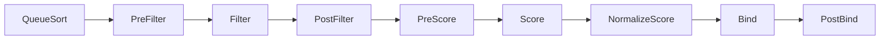
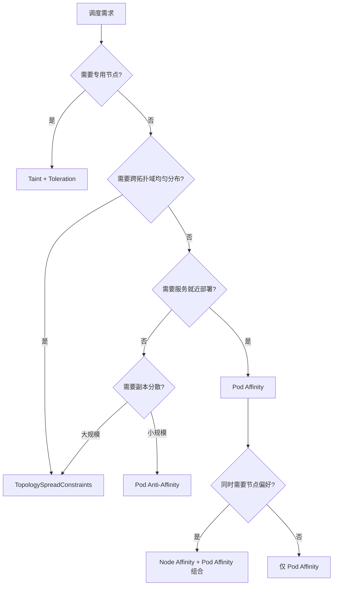
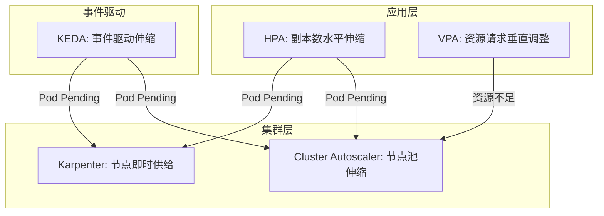
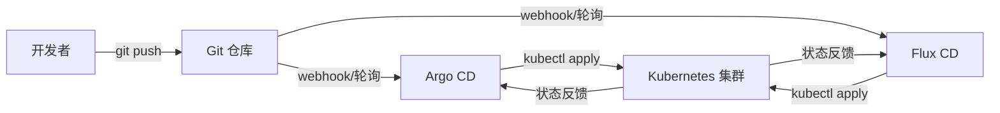
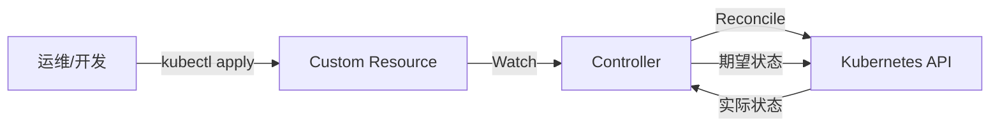
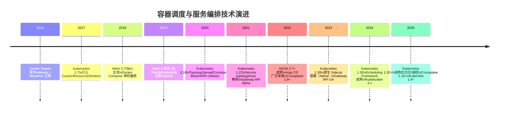

# 微服务容器化运维：容器调度和服务编排

> **版本基线**：Kubernetes 1.30+ | Helm 3.15+ | Kubebuilder 4.x（Operator SDK 已于 2025 年归档）
> **前置知识**：[[25-26]] 容器化基础——镜像仓库与资源调度

## 概述

上一期我们解决了镜像存储（镜像仓库）和资源分配（资源调度）两个基础问题。镜像仓库让 Docker 镜像有了可靠的存取通道，资源调度决定了镜像可以被分发到哪些节点。接下来要回答的核心问题是：**在集群中如何选择最优节点创建容器（容器调度），以及容器创建后如何协同运作对外提供服务（服务编排）**。

2018 年专栏初版时，Swarm、Mesos、Kubernetes 三足鼎立；到 2025 年，Kubernetes 已成为事实标准，Swarm 逐步退出主流，Mesos 更是已归档。容器调度和服务编排的技术栈发生了根本性变化——从"选哪个调度器"变成了"如何用好 Kubernetes 的调度与编排能力"。本文将基于最新技术栈，系统讲解这一演进。

## 一、容器调度：从人工指派到智能编排

容器调度的本质是：给定一组可用节点和一组待部署 Pod，如何做出最优的放置决策。当集群规模从 10 台扩展到上千台、服务从几个增长到数百个时，调度问题从"运维手动选机器"变成了一个多约束优化问题。

### 1.1 调度框架总览

Kubernetes 的调度器（kube-scheduler）在 1.30+ 版本中已完全基于 **Scheduling Framework** 架构运行。该框架将调度过程拆解为一系列扩展点（Extension Point），每个扩展点都可以插入自定义插件：



| 阶段 | 扩展点 | 职责 | 典型插件 |
|------|--------|------|----------|
| 排序 | QueueSort | 决定 Pod 出队顺序 | PrioritySort |
| 预过滤 | PreFilter | 预处理 Pod 信息，缓存数据 | InterPodAffinity、PodTopologySpread |
| 过滤 | Filter | 剔除不满足硬约束的节点 | NodeName、NodeAffinity、TaintToleration |
| 后过滤 | PostFilter | Filter 无可用节点时的补救 | DefaultPreemption（抢占） |
| 评分 | Score | 对候选节点打分排序 | NodeResourcesFit、ImageLocality |
| 绑定 | Bind | 将 Pod 绑定到选定节点 | DefaultBinder |

理解这个框架是掌握高级调度能力的基础——无论是使用内置策略还是开发自定义调度器，都围绕这些扩展点展开。

### 1.2 节点过滤：硬约束的守门人

节点过滤（Filter 阶段）解决的是"哪些节点**不能**用"的问题，属于硬约束——不满足则直接淘汰，没有商量余地。

#### 1.2.1 基础过滤

- **节点状态过滤**：只有 `Ready` 状态的节点才进入候选集。Kubernetes 通过 Node Heartbeat 机制自动检测节点存活，节点失联后自动标记为 `NotReady`，其上的 Pod 会在 `pod-eviction-timeout`（默认 5 分钟）后被驱逐。
- **资源容量过滤**：节点剩余 CPU/内存必须满足 Pod 的 `requests` 声明。这是最基本的过滤条件。

#### 1.2.2 节点亲和性（Node Affinity）

节点亲和性是早期 `nodeSelector` 的超集，提供了更丰富的表达式语法：

```yaml
# Kubernetes 1.30+
apiVersion: v1
kind: Pod
metadata:
  name: feed-service
spec:
  affinity:
    nodeAffinity:
      requiredDuringSchedulingIgnoredDuringExecution:  # 硬约束
        nodeSelectorTerms:
        - matchExpressions:
          - key: node-pool
            operator: In
            values: ["compute", "general"]
          - key: zone
            operator: In
            values: ["cn-east-1a", "cn-east-1b"]
      preferredDuringSchedulingIgnoredDuringExecution:  # 软约束（打分）
      - weight: 80
        preference:
          matchExpressions:
          - key: node-type
            operator: In
            values: ["compute"]
  containers:
  - name: feed
    image: registry.example.com/feed:v2.1.0
```

| 字段 | 类型 | 行为 |
|------|------|------|
| `requiredDuringSchedulingIgnoredDuringExecution` | 硬约束 | 调度时必须满足，运行后不再检查 |
| `preferredDuringSchedulingIgnoredDuringExecution` | 软约束 | 调度时作为打分权重，不满足也可调度 |

> **注意**：`IgnoredDuringExecution` 后缀意味着节点标签在 Pod 运行期间变化时，Kubernetes 不会驱逐已运行的 Pod。Kubernetes 尚未提供 GA 的"运行时强制执行"节点亲和能力，若需要节点标签变化后迁移 Pod，可借助 Descheduler 等工具。

#### 1.2.3 污点与容忍（Taints and Tolerations）

污点（Taint）是打在**节点**上的排斥标记，容忍（Toleration）是打在 **Pod**上的准入凭证。只有 Pod 声明了对应容忍，才能被调度到带有该污点的节点上。

```bash
# 给 GPU 节点打污点
kubectl taint nodes gpu-node-01 hardware=gpu:NoSchedule
```

```yaml
# Pod 声明容忍才能调度到 GPU 节点
apiVersion: v1
kind: Pod
metadata:
  name: model-inference
spec:
  tolerations:
  - key: "hardware"
    operator: "Equal"
    value: "gpu"
    effect: "NoSchedule"
  containers:
  - name: inference
    image: registry.example.com/inference:v1.5.0
    resources:
      limits:
        nvidia.com/gpu: "1"
```

三种污点效果（Effect）：

| Effect | 行为 | 典型场景 |
|--------|------|----------|
| `NoSchedule` | 不调度新 Pod，已运行 Pod 不受影响 | 专用节点（GPU、大数据） |
| `PreferNoSchedule` | 尽量不调度，极端情况下可以 | 软性隔离 |
| `NoExecute` | 不调度新 Pod，且驱逐不满足容忍的已运行 Pod | 节点故障、维护排空 |

Kubernetes 内置了若干自动污点：
- `node.kubernetes.io/not-ready`：节点 NotReady 时自动添加（NoExecute）
- `node.kubernetes.io/unreachable`：节点不可达时自动添加（NoExecute）
- `node.kubernetes.io/memory-pressure`：内存压力
- `node.kubernetes.io/disk-pressure`：磁盘压力

### 1.3 调度评分：软约束的最优化

过滤阶段筛选出可用节点后，评分阶段（Score）对候选节点打分排序，选出最优节点。

#### 1.3.1 内置评分策略

Kubernetes 1.30+ 默认启用的评分插件：

| 评分插件 | 策略倾向 | 说明 |
|----------|----------|------|
| `NodeResourcesFit` | 可配置 | 支持 MostAllocated（binpack）、LeastAllocated（spread）、RequestedToCapacityRatio |
| `ImageLocality` | 就近 | 优先选择已有所需镜像的节点，减少拉取时间 |
| `InterPodAffinity` | 亲和 | 根据 Pod 间亲和性权重打分 |
| `NodeAffinity` | 亲和 | 根据节点亲和性权重打分 |
| `PodTopologySpread` | 均匀 | 跨拓扑域均匀分布 |

通过 `kube-scheduler` 的 `--config` 参数可以自定义评分策略：

```yaml
# kube-scheduler 配置 (Kubernetes 1.30+)
apiVersion: kubescheduler.config.k8s.io/v1
kind: KubeSchedulerConfiguration
profiles:
- schedulerName: default-scheduler
  pluginConfig:
  - name: NodeResourcesFit
    args:
      scoringStrategy:
        type: RequestedToCapacityRatio  # 自定义评分曲线
        resources:
        - name: cpu
          weight: 1
        - name: memory
          weight: 1
        requestedToCapacityRatio:
          shape:
          - utilization: 0
            score: 0
          - utilization: 100
            score: 10
```

#### 1.3.2 Pod 亲和性与反亲和性

Pod 亲和性（Inter-Pod Affinity）解决的是"Pod 想和谁在一起"的问题，反亲和性解决的是"Pod 不想和谁在一起"的问题。

```yaml
# Kubernetes 1.30+
apiVersion: v1
kind: Pod
metadata:
  name: feed-service
  labels:
    app: feed
spec:
  affinity:
    podAffinity:
      # Feed 服务倾向于和 User 服务部署在同一可用区
      preferredDuringSchedulingIgnoredDuringExecution:
      - weight: 100
        podAffinityTerm:
          labelSelector:
            matchLabels:
              app: user
          topologyKey: topology.kubernetes.io/zone
    podAntiAffinity:
      # Feed 服务的不同副本尽量不在同一节点（反亲和）
      requiredDuringSchedulingIgnoredDuringExecution:
      - labelSelector:
          matchLabels:
            app: feed
        topologyKey: kubernetes.io/hostname
  containers:
  - name: feed
    image: registry.example.com/feed:v2.1.0
```

**典型应用场景**：

| 场景 | 策略 | 说明 |
|------|------|------|
| 服务就近调用 | Pod Affinity（zone 级别） | 减少跨区网络延迟 |
| 高可用分散部署 | Pod Anti-Affinity（hostname 级别） | 避免单节点故障影响所有副本 |
| 缓存与计算协同 | Pod Affinity | 利用本地性减少缓存未命中 |
| 在线/离线混部 | Pod Anti-Affinity | 避免资源竞争型工作负载扎堆 |

> **性能提示**：Pod 反亲和性在大规模集群（数千节点）中可能导致调度变慢，因为调度器需要遍历所有节点的 Pod 列表。对于大规模场景，推荐使用 Topology Spread Constraints 替代。

### 1.4 拓扑分布约束（Topology Spread Constraints）

Topology Spread Constraints 是 Kubernetes 1.19+ 稳定、1.30+ 持续增强的高级调度特性，它比 Pod Anti-Affinity 更精确地控制 Pod 在拓扑域中的分布。

```yaml
# Kubernetes 1.30+
apiVersion: v1
kind: Pod
metadata:
  name: feed-service
  labels:
    app: feed
spec:
  topologySpreadConstraints:
  - maxSkew: 1                    # 最大偏差：各域之间 Pod 数差值不超过 1
    topologyKey: topology.kubernetes.io/zone  # 按可用区分布
    whenUnsatisfiable: DoNotSchedule  # 硬约束：不满足则不调度
    labelSelector:
      matchLabels:
        app: feed
  - maxSkew: 1
    topologyKey: kubernetes.io/hostname    # 按节点分布
    whenUnsatisfiable: ScheduleAnyway      # 软约束：尽量满足
    labelSelector:
      matchLabels:
        app: feed
  containers:
  - name: feed
    image: registry.example.com/feed:v2.1.0
```

| 参数 | 含义 | 取值 |
|------|------|------|
| `maxSkew` | 允许的最大分布偏差 | 正整数，越小越均匀 |
| `topologyKey` | 拓扑域的节点标签键 | `zone`、`hostname`、`region` 等 |
| `whenUnsatisfiable` | 不满足时的行为 | `DoNotSchedule`（硬约束）/ `ScheduleAnyway`（软约束） |
| `labelSelector` | 匹配的 Pod 标签 | 选择同一工作负载的副本 |

**与 Pod Anti-Affinity 的对比**：

| 维度 | Pod Anti-Affinity | Topology Spread Constraints |
|------|-------------------|----------------------------|
| 控制粒度 | "不能在同一节点" | "各域最多差 N 个" |
| 均匀性 | 无法保证均匀分布 | 精确控制偏差 |
| 性能 | 大规模下 O(N) 遍历 | 优化后的拓扑计算 |
| 灵活性 | 仅支持排斥 | 支持均匀分布 + 偏差控制 |

### 1.5 调度策略选型决策树



## 二、服务编排：从手工脚本到声明式应用交付

容器调度解决了"Pod 放在哪里"的问题，服务编排则解决"一组相关的微服务如何协同部署、发现、伸缩和治理"的问题。

### 2.1 服务依赖与部署顺序

微服务之间通常存在启动依赖——配置中心先于业务服务、数据库先于应用、网关最后上线。Kubernetes 提供了多种机制来处理这种依赖。

#### Init Container 模式

```yaml
# Kubernetes 1.30+
apiVersion: v1
kind: Pod
metadata:
  name: feed-service
spec:
  initContainers:
  - name: wait-for-config
    image: busybox:1.36
    command: ['sh', '-c', 'until nslookup config-service.$(cat /var/run/secrets/kubernetes.io/serviceaccount/namespace).svc.cluster.local; do echo waiting for config; sleep 2; done']
  - name: wait-for-user
    image: busybox:1.36
    command: ['sh', '-c', 'until nslookup user-service.$(cat /var/run/secrets/kubernetes.io/serviceaccount/namespace).svc.cluster.local; do echo waiting for user; sleep 2; done']
  containers:
  - name: feed
    image: registry.example.com/feed:v2.1.0
```

Init Container 按顺序执行，全部成功后主容器才启动。但这种方式只检查 DNS 可达性，不保证服务真正就绪。

#### Helm 的 Hook 机制

Helm 提供了更精细的生命周期控制：

```yaml
# Helm 3.15+ - templates/pre-install-job.yaml
apiVersion: batch/v1
kind: Job
metadata:
  name: db-migration
  annotations:
    "helm.sh/hook": pre-install,pre-upgrade      # 安装/升级前执行
    "helm.sh/hook-weight": "-5"                    # 权重控制执行顺序
    "helm.sh/hook-delete-policy": hook-succeeded   # 成功后自动清理
spec:
  template:
    spec:
      containers:
      - name: migrate
        image: registry.example.com/feed-migrate:v2.1.0
        command: ["python", "manage.py", "migrate"]
      restartPolicy: Never
```

| Hook 类型 | 触发时机 | 典型用途 |
|-----------|----------|----------|
| `pre-install` | 安装前 | 数据库初始化、Secret 生成 |
| `post-install` | 安装后 | 通知、注册 |
| `pre-upgrade` | 升级前 | 数据库迁移 |
| `pre-rollback` | 回滚前 | 数据备份 |
| `test` | `helm test` 时 | 集成验证 |

### 2.2 服务发现：从静态配置到动态感知

容器调度完成后，新 Pod 需要被服务消费者感知。Kubernetes 原生提供了两层服务发现机制。

#### 2.2.1 Service：稳定的虚拟 IP

```yaml
# Kubernetes 1.30+
apiVersion: v1
kind: Service
metadata:
  name: feed-service
  labels:
    app: feed
spec:
  type: ClusterIP
  selector:
    app: feed
  ports:
  - port: 8080
    targetPort: 8080
```

**拓扑感知路由**（Topology Aware Routing）基于 EndpointSlice 的 hints 机制实现，由 EndpointSlice 控制器自动为各拓扑域分配端点，优先将流量路由到与客户端同一拓扑域的 Endpoints，减少跨区延迟和成本。注意：早期通过 Service `spec.topologyKeys` 字段实现的拓扑路由（Alpha 特性）已在 Kubernetes 1.22 移除，不应再使用。

#### 2.2.2 服务发现机制对比

| 机制 | 适用场景 | 协议 | 就近路由 | 健康检查 |
|------|----------|------|----------|----------|
| Kubernetes Service | 集群内 RPC/HTTP | TCP/UDP | 拓扑感知路由 | readinessProbe |
| Headless Service + DNS | StatefulSet、直连 Pod | DNS A 记录 | 否 | readinessProbe |
| Ingress / Gateway API | 集群外 HTTP/HTTPS | HTTP/HTTPS | 基于路由规则 | 后端探针 |
| 注册中心（Nacos/Consul） | 跨集群 RPC | gRPC/HTTP | 分组/命名空间 | 心跳/长连接 |
| Service Mesh（Istio/Linkerd） | 服务间治理 | Sidecar 代理 | 区域感知 | 主动探针 |

> **实践建议**：对于纯集群内通信，Kubernetes Service + 拓扑感知路由已足够；对于跨集群、跨云场景，注册中心（如 Nacos）仍是主流选择；Service Mesh 则在需要精细流量治理时引入。

### 2.3 自动扩缩容：从 CPU 阈值到多维驱动

#### 2.3.1 HPA（Horizontal Pod Autoscaler）

Kubernetes HPA 在 1.30+ 中已支持多指标、自定义指标和容器资源指标：

```yaml
# Kubernetes 1.30+
apiVersion: autoscaling/v2
kind: HorizontalPodAutoscaler
metadata:
  name: feed-service
spec:
  scaleTargetRef:
    apiVersion: apps/v1
    kind: Deployment
    name: feed-service
  minReplicas: 3
  maxReplicas: 50
  metrics:
  - type: Resource
    resource:
      name: cpu
      target:
        type: Utilization
        averageUtilization: 60
  - type: Resource
    resource:
      name: memory
      target:
        type: Utilization
        averageUtilization: 70
  - type: Pods
    pods:
      metric:
        name: http_requests_per_second
      target:
        type: AverageValue
        averageValue: "1000"
  behavior:                        # 扩缩容行为控制（1.18+ 稳定）
    scaleDown:
      stabilizationWindowSeconds: 300  # 缩容冷却期 5 分钟
      policies:
      - type: Percent
        value: 10                  # 每分钟最多缩容 10%
        periodSeconds: 60
    scaleUp:
      stabilizationWindowSeconds: 0
      policies:
      - type: Percent
        value: 100                 # 每分钟最多扩容 100%
        periodSeconds: 60
      - type: Pods
        value: 4
        periodSeconds: 60
      selectPolicy: Max
```

#### 2.3.2 KEDA：事件驱动的弹性伸缩

KEDA（Kubernetes Event-Driven Autoscaling）是微软和红帽联合开源的弹性伸缩组件，它扩展了 HPA 的能力，支持从 0 到 N 的伸缩，并内置 60+ 种事件源：

```yaml
# KEDA 2.15+
apiVersion: keda.sh/v1alpha1
kind: ScaledObject
metadata:
  name: feed-scaler
spec:
  scaleTargetRef:
    name: feed-service
  minReplicaCount: 0           # 支持缩容到零
  maxReplicaCount: 50
  cooldownPeriod: 300
  triggers:
  - type: kafka                # 基于 Kafka 消息堆积量
    metadata:
      bootstrapServers: kafka:9092
      consumerGroup: feed-group
      topic: feed-events
      lagThreshold: "100"      # 每个分区堆积超过 100 条时扩容
  - type: prometheus           # 基于 Prometheus 指标
    metadata:
      serverAddress: http://prometheus:9090
      metricName: http_requests_total
      threshold: "1000"
      query: "sum(rate(http_requests_total{app='feed'}[1m]))"
```

| 特性 | HPA | KEDA |
|------|-----|------|
| 缩容到零 | 不支持 | 支持 |
| 事件源 | CPU/内存/自定义指标 | 60+ 内置（Kafka、RabbitMQ、Redis、Cron 等） |
| 多触发器 | 支持 | 支持（可组合） |
| 伸缩策略 | behavior 字段 | cooldownPeriod + 多策略 |
| 依赖 | Metrics Server | KEDA Operator + Metrics Server |

#### 2.3.3 VPA 与 Cluster Autoscaler

完整的弹性伸缩体系需要三个组件协同：



| 组件 | 作用域 | 伸缩维度 | 适用场景 |
|------|--------|----------|----------|
| HPA | Pod | 副本数 | CPU/内存/QPS 驱动的水平伸缩 |
| VPA | Pod | 资源请求值 | 资源配额优化（注意：重启模式需谨慎） |
| Cluster Autoscaler | Node | 节点数 | 云厂商节点池自动伸缩 |
| Karpenter | Node | 节点即时供给 | AWS/通用，比 CA 更快的节点供给 |
| KEDA | Pod | 副本数（含零） | 事件驱动、定时、消息队列驱动 |

## 三、包管理与声明式配置：Helm、Kustomize 与 GitOps

### 3.1 Helm 3：Kubernetes 的事实包管理器

Helm 3 自 2019 年发布以来，已演进到 3.15+ 版本，核心变化包括：

- **移除 Tiller**：完全客户端侧操作，安全性大幅提升
- **OCI 注册表支持**：Chart 可存储在标准 OCI Registry（如 Harbor、GHCR）
- **JSON Schema 验证**：`values.schema.json` 可定义 Schema，提前校验参数
- **PostRenderer**：支持在渲染后插入自定义处理（如注入 Sidecar）

```bash
# Helm 3.15+ - OCI 注册表操作
helm registry login registry.example.com -u admin -p $HARBOR_TOKEN
helm push feed-service-2.1.0.tgz oci://registry.example.com/charts
helm install feed-service oci://registry.example.com/charts/feed-service --version 2.1.0
```

一个微服务的 Helm Chart 典型结构：

```
feed-service/
├── Chart.yaml              # Chart 元数据
├── values.yaml             # 默认配置
├── values-production.yaml  # 生产环境覆盖
├── values-staging.yaml     # 预发环境覆盖
├── schemas/
│   └── values.schema.json  # JSON Schema 校验
├── templates/
│   ├── deployment.yaml
│   ├── service.yaml
│   ├── hpa.yaml
│   ├── configmap.yaml
│   ├── secret.yaml
│   ├── _helpers.tpl        # 模板辅助函数
│   └── tests/
│       └── test-connection.yaml
└── .helmignore
```

### 3.2 Kustomize：声明式配置叠加

Kustomize 采取与 Helm 不同的哲学——不引入模板语法，而是通过**基础（Base）+ 覆盖（Overlay）**的方式管理配置差异：

```
base/
├── kustomization.yaml
├── deployment.yaml
└── service.yaml

overlays/
├── staging/
│   ├── kustomization.yaml
│   └── replica-patch.yaml
└── production/
    ├── kustomization.yaml
    ├── replica-patch.yaml
    └── hpa-patch.yaml
```

```yaml
# overlays/production/kustomization.yaml
apiVersion: kustomize.config.k8s.io/v1beta1
kind: Kustomization
resources:
- ../../base
patches:
- path: replica-patch.yaml
  target:
    kind: Deployment
    name: feed-service
replicas:
- name: feed-service
  count: 10
namespace: production
labels:
- pairs:
    env: production
  includeSelectors: false
configMapGenerator:
- name: feed-config
  literals:
  - LOG_LEVEL=warn
  - CACHE_TTL=300s
```

### 3.3 Helm vs Kustomize 对比

| 维度 | Helm | Kustomize |
|------|------|-----------|
| 核心理念 | 模板 + 变量渲染 | 原始 YAML + 补丁叠加 |
| 学习曲线 | 需学习 Go Template 语法 | 纯 YAML，学习成本低 |
| 复用性 | Chart 可独立发布、共享 | Base 可复用，但无独立版本 |
| 参数化 | `values.yaml` + `--set` | Kustomization 补丁 |
| 依赖管理 | Chart 依赖（Chart.yaml） | 无内置依赖管理 |
| 生命周期 | `helm install/upgrade/rollback` | 无状态，需配合 GitOps |
| OCI 支持 | 原生支持 | 不支持 |
| 适用场景 | 独立发布的应用包 | 同一应用多环境差异管理 |

> **实践建议**：对于需要版本化发布、独立分发的微服务，使用 Helm；对于同一应用在多环境间仅有少量配置差异的场景，Kustomize 更简洁。两者也可以组合使用——Helm Chart 作为 Base，Kustomize 做 Overlay。

### 3.4 GitOps：声明式配置的终极交付模式

GitOps 将 Git 仓库作为应用期望状态的唯一事实来源，通过自动化同步实现持续交付：



| 工具 | 核心特点 | 适用场景 |
|------|----------|----------|
| Argo CD | UI 友好、多集群、ApplicationSet | 多团队、多集群、需要可视化 |
| Flux CD | 轻量、CNCF 毕业、Git 原生 | 单集群、偏好 CLI、追求简洁 |

## 四、Operator 模式：将运维知识代码化

### 4.1 Operator 是什么

Operator 是 Kubernetes 的扩展模式，它将**领域专家的运维知识**编码为自定义控制器。一个 Operator = CRD（Custom Resource Definition，自定义资源定义）+ Controller（控制器逻辑）。



### 4.2 Operator 开发框架对比

| 框架 | 语言 | 特点 | 适用场景 |
|------|------|------|----------|
| Kubebuilder | Go | 官方推荐、controller-runtime 基础 | Go 团队、标准 Operator |
| Operator SDK | Go/Ansible/Helm | 已于 2025 年 6 月归档，功能并入 Kubebuilder | 遗留项目维护（新项目请用 Kubebuilder） |
| Kopf | Python | Pythonic、轻量 | Python 团队、快速原型 |
| Java Operator SDK | Java | Quarkus 基础、Spring 集成 | Java 团队 |
| Metacontroller | 通用 | Webhook 模式、无需编译 | 简单编排逻辑 |

### 4.3 Kubebuilder 实战示例

以微博 Feed 服务的自动扩缩容 Operator 为例：

```go
// api/v1alpha1/feedautoscaler_types.go - CRD 定义
// Kubebuilder 4.x / Kubernetes 1.30+
package v1alpha1

import (
	metav1 "k8s.io/apimachinery/pkg/apis/meta/v1"
)

// FeedAutoscalerSpec 定义期望状态
type FeedAutoscalerSpec struct {
	//+kubebuilder:validation:Minimum=1
	MinReplicas int32 `json:"minReplicas"`

	//+kubebuilder:validation:Maximum=100
	MaxReplicas int32 `json:"maxReplicas"`

	//+kubebuilder:validation:Minimum=1
	//+kubebuilder:default=60
	TargetCPUUtilization int32 `json:"targetCPUUtilization,omitempty"`

	// 依赖服务的扩缩容比例
	Dependencies []DependencyScaleRatio `json:"dependencies,omitempty"`

	// 定时扩缩容规则
	ScheduleRules []ScheduleRule `json:"scheduleRules,omitempty"`
}

type DependencyScaleRatio struct {
	Name  string `json:"name"`
	Ratio float64 `json:"ratio"`  // 每扩容 10 台 Feed，扩容 Ratio*10 台依赖服务
}

type ScheduleRule struct {
	//+kubebuilder:validation:Pattern="^\\d{2}:\\d{2}$"
	At       string `json:"at"`       // 如 "12:30"
	Replicas int32  `json:"replicas"` // 目标副本数
}

// FeedAutoscalerStatus 定义观测状态
type FeedAutoscalerStatus struct {
	CurrentReplicas int32 `json:"currentReplicas"`
	DesiredReplicas int32 `json:"desiredReplicas"`
	//+kubebuilder:validation:Enum={"Scaling","Stable"}
	Phase string `json:"phase,omitempty"`
}

//+kubebuilder:object:root=true
//+kubebuilder:subresource:status
//+kubebuilder:subresource:scale:specpath=.spec.minReplicas,statuspath=.status.desiredReplicas
//+kubebuilder:printcolumn:name="Desired",type="integer",JSONPath=".status.desiredReplicas"
//+kubebuilder:printcolumn:name="Current",type="integer",JSONPath=".status.currentReplicas"
//+kubebuilder:printcolumn:name="Phase",type="string",JSONPath=".status.phase"

type FeedAutoscaler struct {
	metav1.TypeMeta   `json:",inline"`
	metav1.ObjectMeta `json:"metadata,omitempty"`

	Spec   FeedAutoscalerSpec   `json:"spec,omitempty"`
	Status FeedAutoscalerStatus `json:"status,omitempty"`
}
```

```yaml
# 使用 CRD
apiVersion: ops.weibo.com/v1alpha1
kind: FeedAutoscaler
metadata:
  name: feed-scaler
spec:
  minReplicas: 3
  maxReplicas: 50
  targetCPUUtilization: 60
  dependencies:
  - name: user-service
    ratio: 0.4    # 每 10 台 Feed 扩 4 台 User
  - name: card-service
    ratio: 0.3    # 每 10 台 Feed 扩 3 台 Card
  scheduleRules:
  - at: "12:30"   # 午高峰
    replicas: 30
  - at: "22:30"   # 晚高峰
    replicas: 40
  - at: "03:00"   # 凌晨低谷
    replicas: 3
```

### 4.4 Operator 成熟度模型

CNCF Operator Framework 定义了五个成熟度等级：

| 等级 | 名称 | 能力 | 示例 |
|------|------|------|------|
| Level 1 | Basic Install | 安装/卸载 | etcd Operator |
| Level 2 | Seamless Upgrades | 滚动升级、零停机 | Prometheus Operator |
| Level 3 | Full Lifecycle | 备份恢复、故障检测 | TiDB Operator |
| Level 4 | Deep Insights | 监控、告警、自动调优 | CockroachDB Operator |
| Level 5 | Auto Pilot | 自动扩缩容、自愈、调优 | Crossplane Provider |

> **实践建议**：不要一上来就追求 Level 5。从 Level 1-2 开始，逐步增加能力。大多数内部微服务的 Operator 到 Level 3 已足够。

## 五、应用交付模型：OAM 与 Crossplane

### 5.1 OAM（Open Application Model）

OAM 的核心理念是**关注点分离**——将应用定义（Component）、运维策略（Trait）和运行时环境（Application Configuration）解耦：

```yaml
# OAM / KubeVela 1.9+
apiVersion: core.oam.dev/v1beta1
kind: Application
metadata:
  name: feed-app
spec:
  components:
  - name: feed-service
    type: webservice          # 组件类型
    properties:
      image: registry.example.com/feed:v2.1.0
      port: 8080
      cpu: "2"
      memory: "4Gi"
    traits:
    - type: scaler            # 伸缩策略
      properties:
        min: 3
        max: 50
    - type: gateway           # 网关暴露
      properties:
        domain: feed.example.com
        path: /api/feed
    - type: keda-autoscaler   # 事件驱动伸缩
      properties:
        triggers:
        - type: kafka
          metadata:
            topic: feed-events
            lagThreshold: "100"
  policies:
  - name: multi-env
    type: topology
    properties:
      clusters:
      - name: staging
        namespace: staging
      - name: production
        namespace: production
  workflow:
    steps:
    - name: deploy-staging
      type: deploy
      properties:
        policies: ["multi-env"]
        env: staging
    - name: approval
      type: suspend           # 人工审批
    - name: deploy-production
      type: deploy
      properties:
        policies: ["multi-env"]
        env: production
```

OAM 的价值在于：开发团队只关心 Component 定义，运维团队通过 Trait 注入策略，平台团队定义可用的 Trait 类型。三方协作，互不干扰。

### 5.2 Crossplane：Kubernetes 原生基础设施编排

Crossplane 将基础设施资源（云数据库、消息队列、存储等）建模为 Kubernetes CRD，实现**基础设施即 Kubernetes 资源**：

```yaml
# Crossplane 1.15+
apiVersion: aws.upbound.io/v1beta1
kind: ProviderConfig
metadata:
  name: aws-config
spec:
  credentials:
    source: Secret
    secretRef:
      name: aws-creds
      namespace: crossplane-system
---
# 声明式创建 RDS 实例
apiVersion: rds.aws.upbound.io/v1beta1
kind: Instance
metadata:
  name: feed-db
  annotations:
    crossplane.io/external-name: feed-db-production
spec:
  forProvider:
    engine: mysql
    engineVersion: "8.0"
    instanceClass: db.r6g.large
    allocatedStorage: 100
    region: cn-north-1
    vpcSecurityGroupIds:
    - sg-xxx
  writeConnectionSecretToRef:
    name: feed-db-conn
    namespace: default
---
# Composition：将多个资源组合为可复用的抽象
apiVersion: apiextensions.crossplane.io/v1
kind: CompositeResourceDefinition
metadata:
  name: xmicroservices.ops.example.com
spec:
  group: ops.example.com
  names:
    kind: XMicroService
    plural: xmicroservices
  versions:
  - name: v1alpha1
    served: true
    referenceable: true
    schema:
      openAPIV3Schema:
        type: object
        properties:
          spec:
            type: object
            properties:
              image:
                type: string
              replicas:
                type: integer
            required:
            - image
```

### 5.3 应用交付方案对比

| 维度 | Helm + ArgoCD | Kustomize + Flux | OAM/KubeVela | Crossplane |
|------|---------------|-------------------|--------------|------------|
| 核心关注点 | 应用包管理 + GitOps | 配置差异管理 + GitOps | 应用模型 + 多环境交付 | 基础设施编排 |
| 基础设施管理 | 手动/外部 | 手动/外部 | 通过 Trait 抽象 | 原生 CRD 管理 |
| 多集群交付 | ArgoCD ApplicationSet | Flux 多集群 | 内置 Workflow | Provider 机制 |
| 学习成本 | 中 | 低 | 中高 | 中高 |
| 生态成熟度 | 高 | 高 | 中 | 中高 |
| 适用团队 | 大多数团队 | 配置差异为主的团队 | 平台工程团队 | 需要统一管理基础设施的团队 |

## 六、技术演进时间线



| 时间 | 关键变化 | 影响 |
|------|----------|------|
| 2016-2018 | Swarm/Mesos/K8s 三足鼎立 | 调度器选型是核心决策 |
| 2019-2020 | K8s 胜出，Helm 3 发布 | 从"选哪个"到"怎么用好" |
| 2021-2022 | GitOps 成为主流交付模式 | 声明式 + 自动同步成为标准 |
| 2023-2024 | Operator 模式成熟，Gateway API GA | 运维知识代码化，流量治理标准化 |
| 2025-2026 | 平台工程兴起，OAM/Crossplane 演进 | 应用交付与基础设施统一编排 |

## 七、架构决策指南

### 7.1 调度策略选型

| 场景 | 推荐方案 | 理由 |
|------|----------|------|
| 通用微服务部署 | Node Affinity + TopologySpreadConstraints | 均匀分布 + 拓扑感知 |
| GPU/专用硬件 | Taint + Toleration + Node Affinity | 硬隔离 + 精确调度 |
| 数据库/有状态服务 | Node Affinity + PV 拓扑 | 数据局部性优先 |
| 在线/离线混部 | Taint 分层 + Pod Anti-Affinity | 资源隔离 + 减少干扰 |
| 跨可用区高可用 | TopologySpreadConstraints (zone) | 精确控制域间偏差 |

### 7.2 编排工具选型

| 团队规模 | 推荐方案 | 理由 |
|----------|----------|------|
| 小团队（<10 服务） | Helm + ArgoCD | 简单直接，社区资源丰富 |
| 中团队（10-50 服务） | Helm/Kustomize + ArgoCD + KEDA | 多环境管理 + 事件驱动伸缩 |
| 大团队（50+ 服务） | OAM/KubeVela + Crossplane | 平台化交付 + 基础设施统一管理 |
| 有状态服务为主 | Operator (Kubebuilder) | 运维知识代码化，自动化运维 |

### 7.3 弹性伸缩选型

| 场景 | 推荐方案 | 理由 |
|------|----------|------|
| CPU/内存驱动 | HPA v2 | 原生支持，无需额外组件 |
| 消息队列驱动 | KEDA | 60+ 内置 Scaler，支持缩容到零 |
| 定时驱动 | KEDA Cron Scaler | 声明式定时规则 |
| 多维指标组合 | KEDA + HPA | KEDA 作为 HPA 的外部指标源 |
| 资源配额优化 | VPA（推荐模式） | 自动调整 requests，不重启 Pod |

## 小结

本文从容器调度和服务编排两个维度，系统梳理了 2025-2026 年微服务容器化运维的最新技术栈：

**容器调度**方面，Kubernetes Scheduling Framework 提供了完整的扩展机制。节点亲和性（Node Affinity）解决节点级约束，污点与容忍（Taint/Toleration）实现节点级隔离，Pod 亲和/反亲和性处理服务间协同与分散，拓扑分布约束（TopologySpreadConstraints）精确控制跨域均匀分布。理解这些机制的组合使用，是做好生产级调度的关键。

**服务编排**方面，技术栈已从 Docker Compose 的单机编排演进为多层次体系：Helm 3 管理应用包的生命周期，Kustomize 处理多环境配置差异，ArgoCD/Flux 实现 GitOps 持续交付，Operator 模式将运维知识代码化，OAM/KubeVela 提供应用级抽象，Crossplane 统一基础设施编排。

**弹性伸缩**方面，HPA v2 处理资源驱动的水平伸缩，KEDA 扩展到事件驱动和缩容到零，VPA 优化资源配额，Cluster Autoscaler/Karpenter 处理节点层供给。

最后，选择技术方案时，务必从团队规模和业务复杂度出发，而非追求理论上最先进的方案。小团队用 Helm + ArgoCD + HPA 就能覆盖 80% 的场景；大团队才需要引入 OAM、Crossplane 等平台级工具。渐进式演进，而非一步到位，才是微服务容器化运维的务实之道。

## 思考题

1. 在你的业务场景中，TopologySpreadConstraints 和 Pod Anti-Affinity 哪个更适合控制副本分布？为什么？
2. 如果你的团队要管理 50+ 微服务的多环境交付，你会选择 Helm + ArgoCD 还是 OAM/KubeVela？请从团队技能、维护成本、交付效率三个维度分析。
3. Operator 模式将运维知识代码化，但 Operator 本身也需要运维。你如何评估"引入 Operator 带来的收益是否大于维护 Operator 的成本"？


