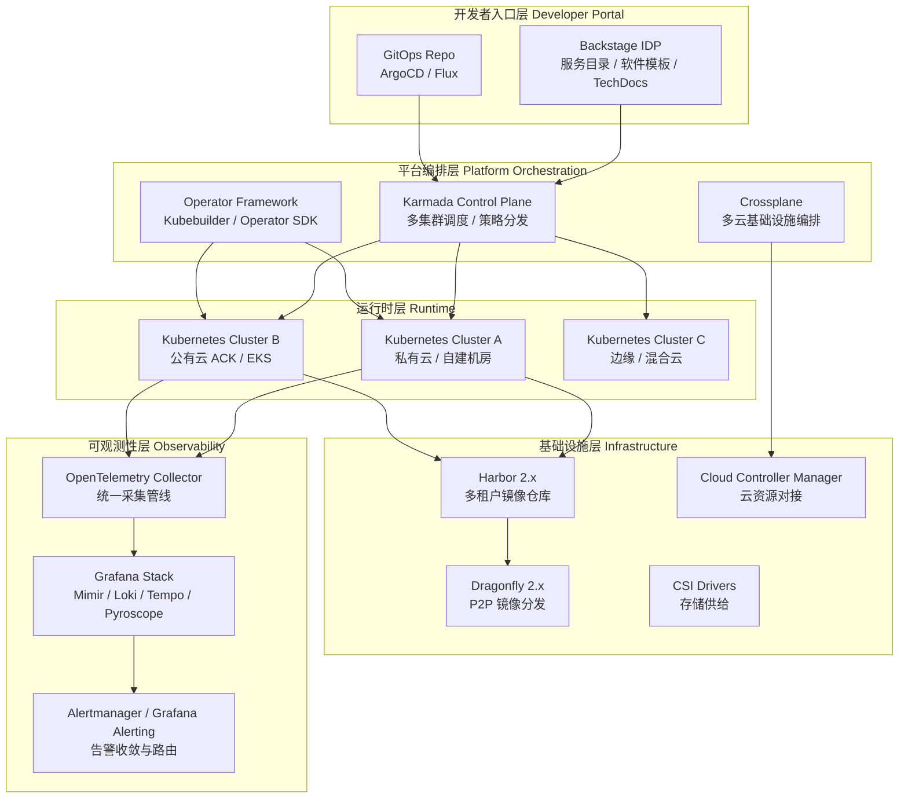
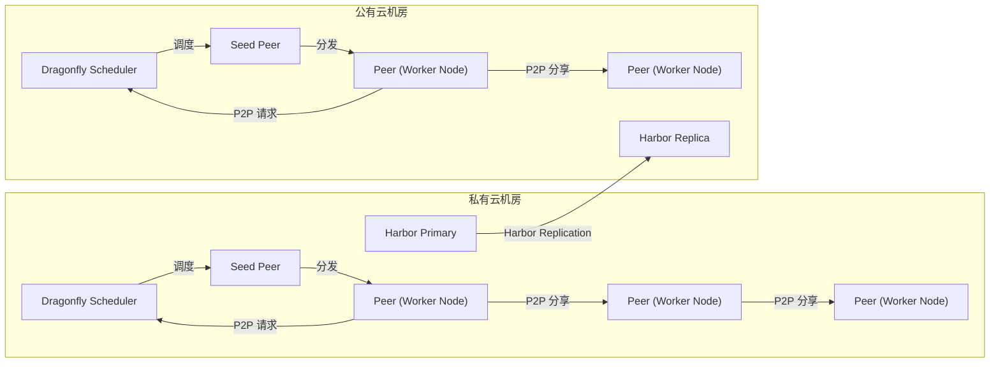
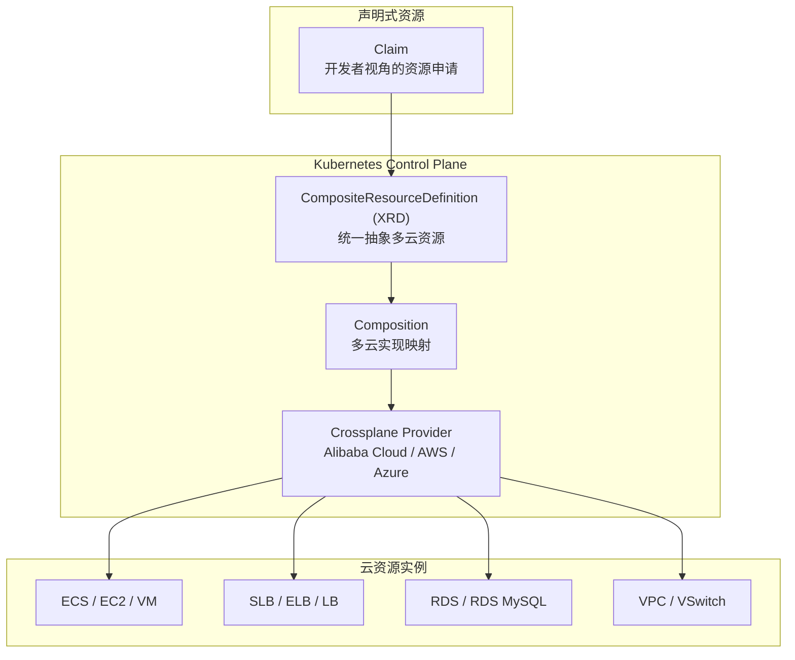
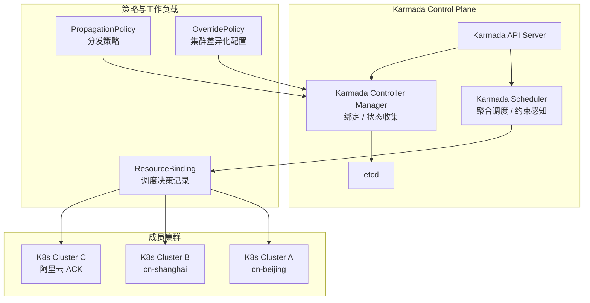
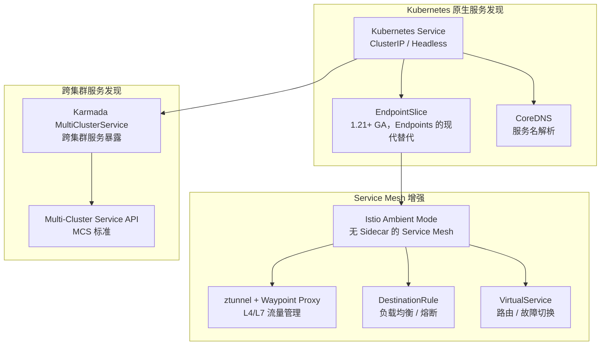
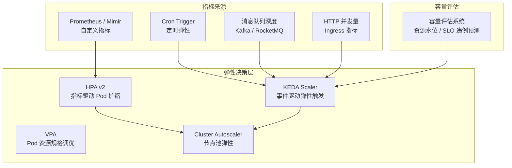
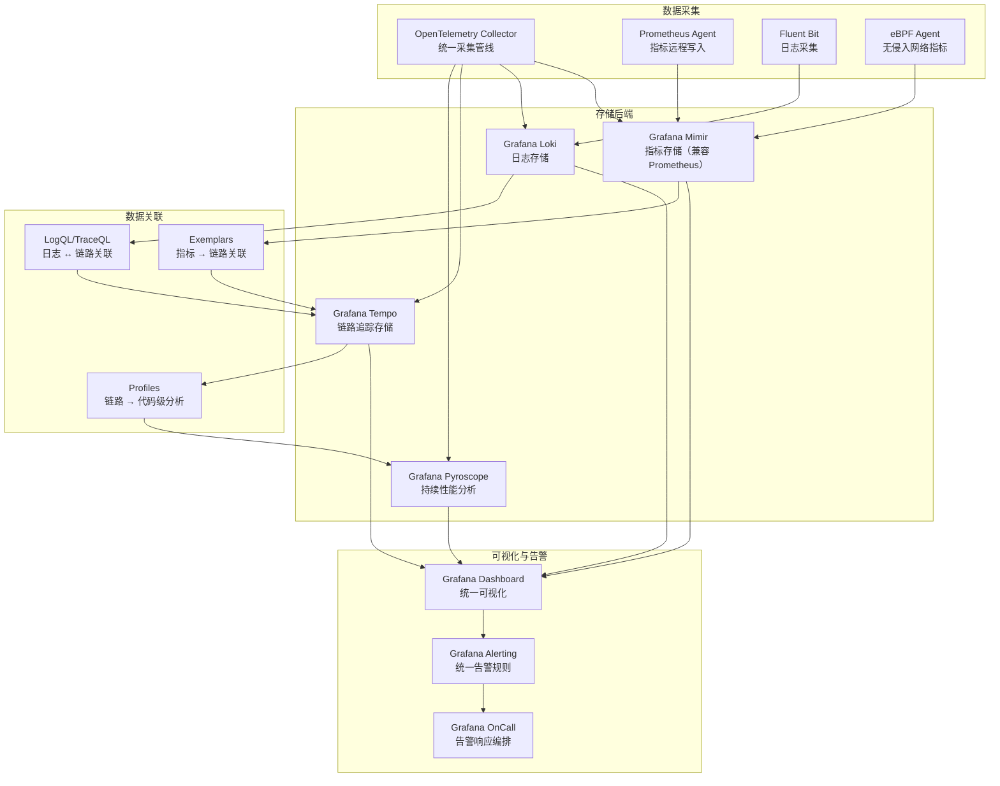
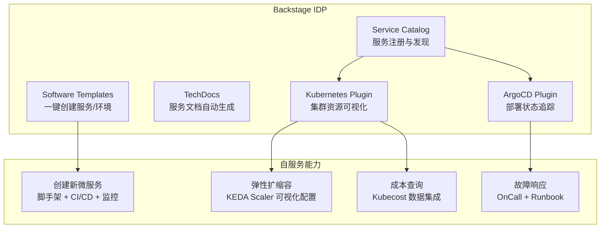
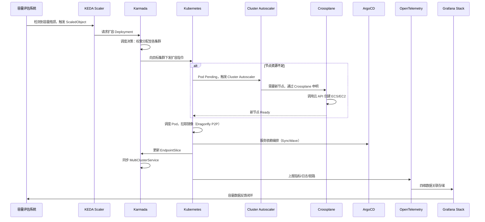

# 微服务容器化运维：从DCP到云原生容器运维平台

> **版本基线**：Kubernetes 1.30+ | Karmada 1.9+ | Backstage 1.x | ArgoCD 2.12+ | Crossplane 1.14+ | KEDA 2.14+ | Harbor 2.10+ | Dragonfly 2.x | Grafana Mimir 2.14+ / Loki 3.x / Tempo 2.x / Pyroscope 1.x | Istio 1.24+ (Ambient GA)
>
> **前置知识**：[[25-27]] 容器化运维三部曲——为什么要容器化、镜像仓库与资源调度、容器调度与服务编排

微服务容器化运维系列的前两期，我详细介绍了容器化运维的几个关键问题——镜像仓库、资源调度、容器调度、服务编排，这些问题因部署单元从物理机/虚拟机变为容器而愈发凸显。当 Kubernetes 成为事实标准后，容器运维平台的构建范式已从"自研调度器 + 脚本编排"演进为"Kubernetes 原生 + 平台工程 + GitOps"的现代架构。

微博的 DCP（Docker Container Platform）始于 2015 年，基于 Swarm 构建，在当时的业务场景下取得了显著成效。然而，技术生态在过去十年经历了剧变：Swarm 已退场、Kubernetes 一统天下、多集群管理成为标配、平台工程（Platform Engineering）理念深入人心。本文将以 DCP 的架构演进为起点，系统阐述 2025-2026 年云原生容器运维平台的设计哲学、核心技术栈与最佳实践。

## 一、从 DCP 到现代容器运维平台：架构演进

### 1.1 DCP 架构回顾与局限性

DCP 的四层架构——基础设施层、主机层、调度层、编排层——在 2015 年的语境下是合理的设计。但随着业务规模和技术生态的变化，其局限性日益明显：

| 维度 | DCP 原始方案 | 局限性 |
|------|-------------|--------|
| 容器调度 | Swarm + 自研 Roam | Swarm 已停止维护，社区生态萎缩 |
| 服务发现 | Consul + 自研 11-Nginx基础概述-upsync-module | 与 Kubernetes Service/Endpoint 体系割裂 |
| 配置管理 | Ansible 批量下发 | 无声明式语义，缺乏版本追溯与 drift detection |
| 多云管理 | 手动适配阿里云 API | 硬编码云厂商逻辑，扩展新云困难 |
| 自动扩缩容 | 自研容量决策 + CronTrigger | 无事件驱动机制，响应延迟高 |
| 可观测性 | 监控中心（自研） | 指标/日志/链路未统一，排障效率低 |

### 1.2 现代容器运维平台架构

2025-2026 年，一个面向生产的容器运维平台应遵循以下设计原则：

1. **Kubernetes-Native**：以 Kubernetes 为底座，而非在其外另起炉灶
2. **声明式 + GitOps**：所有配置以声明式资源定义，通过 Git 仓库实现单一可信源
3. **多集群原生**：从 Day 1 支持多集群、多地域、多云部署
4. **平台工程**：通过 Internal Developer Platform（IDP）降低开发者认知负载
5. **可观测性一体化**：Metrics / Logs / Traces / Profiles 四维统一

下面是现代容器运维平台的整体架构：



接下来，我们将逐层深入，对比 DCP 原始实现与现代方案。

## 二、基础设施层：镜像仓库与分发体系

### 2.1 Harbor 2.x + Dragonfly：多云镜像分发

DCP 时代通过 Harbor 主从复制 + LVS/SLB 负载均衡解决跨机房镜像拉取问题。这一方案在 2025 年仍然有效，但有了更优解：

**Harbor 2.x（v2.10+）** 的关键增强：

- **OCI 兼容性**：支持 Helm Chart、CNAB、OPA Bundle 等 OCI Artifact，成为通用制品仓库
- **策略引擎**：基于 Open Policy Agent（OPA）的镜像准入策略，可强制执行签名验证、漏洞扫描门禁
- **分布式存储后端**：支持 S3 / OSS / Azure Blob 等对象存储，降低存储成本
- **Trivy 集成**：内置 CVE 漏洞扫描，支持 SBOM（Software Bill of Materials）生成

**Dragonfly 2.x** 解决大规模镜像拉取的带宽瓶颈：

DCP 时代的痛点——上百台节点同时拉取镜像导致专线带宽打满——在 Dragonfly 中通过 P2P 分发机制根本性解决：

```yaml
# Dragonfly 2.x Scheduler 配置示例 (v2.1+)
# dragonfly-scheduler-config.yaml
scheduler:
  algorithm: default # 支持 default / backfill / rainbow
  backSourceCount: 3 # P2P 失败时回源并发数
  retry:
    maxAttempts: 5
    retryDelay: 200ms

seedPeer:
  enable: true
  concurrent:
    limit: 200 # 种子节点并发下载限制

manager:
  security:
    autoIssueCert: true # 自动签发 mTLS 证书
```



对比 DCP 的方案，Dragonfly 的核心优势在于：

| 对比维度 | DCP 方案（Harbor + LVS） | 现代方案（Harbor + Dragonfly） |
|----------|-------------------------|-------------------------------|
| 分发模型 | C/S 模式，中心化分发 | P2P 模式，节点互助分发 |
| 带宽消耗 | 与节点数线性增长 | 近似常数，仅种子节点回源 |
| 专线压力 | 高（所有节点跨专线拉取） | 低（仅种子节点跨专线） |
| 千节点拉取 | 需要 SLB 横向扩展 | P2P 网络自动扩展 |
| 分发协议 | HTTPS only | HTTPS + P2P + 增量块传输 |

### 2.2 容器镜像安全与供应链

2025 年，镜像安全已从"可选"变为"必选"。现代容器运维平台必须集成以下安全机制：

```yaml
# Harbor OPA 策略示例：强制镜像签名与漏洞门禁
# harbor-policy.yaml (Harbor 2.10+)
policy:
  - name: "require-cosign-signature"
    action: "reject"
    condition:
      type: "signature"
      validator: "cosign"
      required: true

  - name: "block-critical-cves"
    action: "reject"
    condition:
      type: "vulnerability"
      severity: ["Critical"]
      maxCount: 0

  - name: "require-sbom"
    action: "warn"
    condition:
      type: "artifact"
      hasSBOM: true
```

## 三、主机层：从手动 API 调用到声明式基础设施编排

### 3.1 DCP 的痛点与现代解法

DCP 的 Pluto 层通过直接调用阿里云 API 创建 ECS，并处理并发限制、库存限制、多可用区切换等复杂逻辑。这些逻辑全部硬编码在平台代码中，存在以下问题：

1. **云厂商锁定**：新增云厂商需重写大量代码
2. **状态管理复杂**：主机状态依赖 DB 记录，与实际状态容易 drift
3. **缺乏声明式语义**：无法通过 `kubectl apply` 管理基础设施

现代方案使用 **Crossplane** 实现声明式多云基础设施编排：

```yaml
# Crossplane: 声明式创建阿里云 ECS (Crossplane 1.14+)
# crossplane-ecs.yaml
apiVersion: ecs.alibabacloud.crossplane.io/v1alpha1
kind: Instance
metadata:
  name: weibo-app-server
  annotations:
    crossplane.io/external-name: i-bp1a2b3c4d5e
spec:
  forProvider:
    imageId: aliyun_3_x64_20G_alibase_
    instanceType: ecs.c7.2xlarge
    region: cn-beijing
    zoneId: cn-beijing-h     # 多可用区由 Crossplane 自动 failover
    securityGroupId: sg-2ze...
    vSwitchId: vsw-2ze...
    systemDiskSize: 100
    systemDiskCategory: cloud_essd
    tags:
      env: production
      team: weibo-infra
  providerConfigRef:
    name: alibabacloud-config
  writeConnectionSecretToRef:
    name: weibo-app-server-secret
    namespace: crossplane-system
```

Crossplane 的核心价值在于将云资源映射为 Kubernetes CRD（Custom Resource Definition），使得基础设施管理与应用管理使用同一套声明式 API：



### 3.2 混合云资源池调度

DCP 的共享池机制——在线业务与离线计算错峰使用资源——在 Kubernetes 生态中有更优雅的实现方式：

**方案一：Kubernetes 原生调度 + Cluster Autoscaler**

```yaml
# 利用 ResourceClass 和 PriorityClass 实现错峰调度
# priority-class.yaml (Kubernetes 1.30+)
apiVersion: scheduling.k8s.io/v1
kind: PriorityClass
metadata:
  name: online-batch-low-priority
value: 100
preemptionPolicy: PreemptLowerPriority
globalDefault: false
description: "离线批处理任务，可被在线业务抢占"
---
apiVersion: scheduling.k8s.io/v1
kind: PriorityClass
metadata:
  name: online-service-high-priority
value: 1000
preemptionPolicy: PreemptLowerPriority
globalDefault: false
description: "在线业务，可抢占低优先级资源"
```

**方案二：KEDA + 自定义 Scaler 实现弹性资源调度**

```yaml
# KEDA ScaledObject: 基于 Cron 的弹性扩缩 (KEDA 2.14+)
# keda-cron-scaler.yaml
apiVersion: keda.sh/v1alpha1
kind: ScaledObject
metadata:
  name: batch-job-scaler
  namespace: offline-compute
spec:
  scaleTargetRef:
    name: spark-history-server
  minReplicaCount: 0
  maxReplicaCount: 50
  triggers:
    - type: cron
      metadata:
        timezone: Asia/Shanghai
        start: "00 0 * * *"    # 凌晨0点扩容（离线计算高峰）
        end: "00 8 * * *"      # 上午8点缩容（在线业务高峰）
        desiredReplicas: "50"
    - type: prometheus          # 同时基于指标
      metadata:
        serverAddress: http://prometheus:9090
        metricName: batch_job_queue_depth
        threshold: "10"
        query: batch_job_queue_depth{namespace="offline-compute"}
```

### 3.3 成本管理：FinOps 集成

DCP 的成本管理依赖手动记录 ECS 使用时长。现代方案通过 FinOps 工具链实现自动化成本治理：

| 工具 | 功能 | 适用场景 |
|------|------|---------|
| Kubecost | Kubernetes 资源级成本分配 | 集群内成本归属 |
| OpenCost | 开源成本监控（Kubecost 上游） | 基础成本可视化 |
| Crossplane + Tags | 声明式资源标签管理 | 多云成本分账 |
| Grafana Cost Dashboard | 成本趋势与预测 | FinOps 看板 |

```yaml
# Kubecost 成本注解示例
apiVersion: apps/v1
kind: Deployment
metadata:
  name: weibo-feed-service
  annotations:
    kubecost.io/product: "feed-service"
    kubecost.io/team: "weibo-feed"
    kubecost.io/environment: "production"
spec:
  template:
    metadata:
      annotations:
        kubecost.io/product: "feed-service"
```

### 3.4 配置初始化：从 Ansible 到 Kubernetes Operator

DCP 使用 Ansible 批量初始化主机配置。在 Kubernetes 原生架构中，这一职责由 **Operator** 承担。Operator 不仅是配置管理工具，更是对运维知识的代码化封装：

```go
// Kubebuilder 生成的 Operator Reconcile 逻辑骨架 (Kubebuilder 4.x)
// internal/controller/clusterinit_controller.go
package controller

import (
    "context"
    "fmt"

    appsv1 "k8s.io/api/apps/v1"
    corev1 "k8s.io/api/core/v1"
    "k8s.io/apimachinery/pkg/api/errors"
    "k8s.io/apimachinery/pkg/runtime"
    ctrl "sigs.k8s.io/controller-runtime"
    "sigs.k8s.io/controller-runtime/pkg/client"
    "sigs.k8s.io/controller-runtime/pkg/log"

    platformv1 "my-platform/api/v1"
)

// ClusterInitReconciler 协调集群初始化资源
type ClusterInitReconciler struct {
    client.Client
    Scheme *runtime.Scheme
}

func (r *ClusterInitReconciler) Reconcile(ctx context.Context, req ctrl.Request) (ctrl.Result, error) {
    logger := log.FromContext(ctx)

    var clusterInit platformv1.ClusterInit
    if err := r.Get(ctx, req.NamespacedName, &clusterInit); err != nil {
        if errors.IsNotFound(err) {
            return ctrl.Result{}, nil
        }
        return ctrl.Result{}, err
    }

    // 1. 确保 DaemonSet 安装基础组件（替代 Ansible 批量下发）
    if err := r.ensureBaseComponents(ctx, &clusterInit); err != nil {
        logger.Error(err, "failed to ensure base components")
        return ctrl.Result{}, err
    }

    // 2. 确保 ConfigMap 分发节点配置
    if err := r.ensureNodeConfig(ctx, &clusterInit); err != nil {
        logger.Error(err, "failed to ensure node config")
        return ctrl.Result{}, err
    }

    // 3. 更新初始化状态（替代 DB 写入，使用 CRD Status）
    clusterInit.Status.Phase = platformv1.PhaseInitialized
    if err := r.Status().Update(ctx, &clusterInit); err != nil {
        return ctrl.Result{}, err
    }

    logger.Info("cluster initialization completed",
        "cluster", req.Name, "phase", clusterInit.Status.Phase)
    return ctrl.Result{}, nil
}
```

Operator 与 Ansible 的本质区别在于：

| 对比维度 | Ansible（DCP 方案） | Kubernetes Operator |
|----------|---------------------|---------------------|
| 调度模式 | 推送式（Push） | 调谐式（Reconcile Loop） |
| 状态管理 | 外部 DB | CRD Status 子资源 |
| 故障恢复 | 需手动重跑 Playbook | 自动重入 Reconcile |
| 可观测性 | Callback Queue 写 DB | Event + Status Condition |
| 扩展性 | Playbook 编排 | 自定义 Controller 逻辑 |
| 与 K8s 集成 | 外部工具 | 原生 API 交互 |

## 四、调度层：多集群管理与智能调度

### 4.1 从 Swarm 到 Kubernetes：调度范式迁移

DCP 的 Roam 基于 Swarm Manager + Consul 实现跨 IDC 调度。Kubernetes 时代，这一能力由多集群编排器提供，当前 CNCF 毕业项目 **Karmada** 是首选方案：



### 4.2 Karmada 核心调度能力

Karmada（v1.9+）提供了 DCP Roam 无法企及的调度能力：

**1) 聚合调度（Aggregate Scheduling）**

```yaml
# PropagationPolicy: 定义工作负载的分发策略 (Karmada 1.9+)
# propagation-policy.yaml
apiVersion: policy.karmada.io/v1alpha1
kind: PropagationPolicy
metadata:
  name: weibo-feed-propagation
  namespace: production
spec:
  resourceSelectors:
    - apiVersion: apps/v1
      kind: Deployment
      name: weibo-feed
  placement:
    clusterAffinity:
      clusterNames:
        - bj-private   # 北京自建机房
        - sh-private   # 上海自建机房
        - ali-cloud    # 阿里云
    clusterTolerations:
      - key: "cluster.karmada.io/not-ready"
        operator: "Exists"
        effect: "NoExecute"
        tolerationSeconds: 300  # 集群不健康时 5 分钟后迁移
    spreadConstraints:
      - maxGroups: 3
        minGroups: 2
        spreadByField: cluster  # 至少分布在 2 个集群
    replicaScheduling:
      replicaSchedulingType: Divided
      replicaDivisionPreference: Weighted
      weightPreference:
        staticWeightList:
          - targetCluster:
              clusterNames: ["bj-private"]
            weight: 5
          - targetCluster:
              clusterNames: ["sh-private"]
            weight: 3
          - targetCluster:
              clusterNames: ["ali-cloud"]
            weight: 2
```

**2) 集群差异化配置（Override Policy）**

DCP 需要硬编码阿里云的可用区、安全组参数。Karmada 通过 OverridePolicy 实现声明式差异化：

```yaml
# OverridePolicy: 公有云集群差异化配置 (Karmada 1.9+)
# override-policy.yaml
apiVersion: policy.karmada.io/v1alpha1
kind: OverridePolicy
metadata:
  name: weibo-feed-ali-cloud-override
  namespace: production
spec:
  resourceSelectors:
    - apiVersion: apps/v1
      kind: Deployment
      name: weibo-feed
  overrideRules:
    - targetCluster:
        clusterNames: ["ali-cloud"]
      overriders:
        plaintext:
          - path: "/spec/template/spec/nodeSelector"
            operator: add
            value:
              topology.kubernetes.io/zone: cn-beijing-h
          - path: "/spec/template/spec/tolerations"
            operator: add
            value:
              - key: "cloud-provider"
                operator: "Equal"
                value: "alibabacloud"
                effect: "NoSchedule"
```

**3) 故障自动转移（Failover）**

```yaml
# 启用应用级故障转移 (Karmada 1.9+)
# 需在 Karmada 配置中开启 failover 功能
apiVersion: policy.karmada.io/v1alpha1
kind: PropagationPolicy
metadata:
  name: weibo-feed-with-failover
spec:
  placement:
    clusterAffinity:
      clusterNames: ["bj-private", "sh-private", "ali-cloud"]
  failover:
    application:
      decisionConditions:
        tolerationSeconds: 120  # 2 分钟后触发故障转移
      purgeMode: Immediately    # 立即从故障集群移除
      gracePeriodSeconds: 60
```

### 4.3 多集群方案对比

| 方案 | 成熟度 | 调度能力 | 故障转移 | 社区活跃度 | 适用场景 |
|------|--------|---------|---------|-----------|---------|
| **Karmada** | CNCF 毕业（2026-09） | 强（加权/聚合/约束） | 原生支持 | 高 | 多集群统一管理首选 |
| KubeFed | CNCF 归档 | 基础 | 有限 | 已停止维护 | 遗留系统迁移 |
| Liqo | CNCF 沙箱 | 资源共享/租借 | 支持 | 中 | 跨集群资源弹性 |
| Admiral | Istio 生态 | 多集群 Service Mesh | 依赖 Istio | 低 | Istio 多集群场景 |

## 五、编排层：服务依赖、发现与弹性伸缩

### 5.1 服务依赖：从模板引擎到 GitOps + ArgoCD

DCP 通过扩容模板中的任务依赖定义服务依赖关系。现代方案使用 **ArgoCD ApplicationSet** 实现声明式服务编排：

```yaml
# ArgoCD ApplicationSet: 编排多服务依赖部署 (ArgoCD 2.12+)
# appset-weibo.yaml
apiVersion: argoproj.io/v1alpha1
kind: ApplicationSet
metadata:
  name: weibo-feed-stack
  namespace: argocd
spec:
  goTemplate: true
  generators:
    - list:
        elements:
          - name: weibo-feed-db
            path: charts/feed-db
            order: "1"        # 部署顺序
          - name: weibo-feed-cache
            path: charts/feed-cache
            order: "2"
          - name: weibo-feed-rpc
            path: charts/feed-rpc
            order: "3"
          - name: weibo-feed-gateway
            path: charts/feed-gateway
            order: "4"
  template:
    metadata:
      name: '{{.name}}'
      annotations:
        argocd.argoproj.io/sync-wave: '{{.order}}'  # 同步波次控制依赖顺序
    spec:
      project: weibo-production
      source:
        repoURL: https://git.internal.weibo.com/platform/manifests
        targetRevision: main
        path: '{{.path}}'
      destination:
        server: https://kubernetes.default.svc
        namespace: production
      syncPolicy:
        automated:
          prune: true
          selfHeal: true
        syncOptions:
          - CreateNamespace=true
```

ArgoCD 的 SyncWave 机制替代了 DCP 的任务依赖模板，优势在于：

- **Git 单一可信源**：所有部署编排可追溯、可回滚
- **自动 Drift Detection**：配置漂移自动检测与修复
- **可视化**：ArgoCD UI 直观展示服务依赖与部署状态

### 5.2 服务发现：从 Consul 到 Kubernetes Service + Istio

DCP 使用 Consul + 11-Nginx基础概述-upsync-module 实现服务发现。2025 年，服务发现已深度融入 Kubernetes 原生体系：



**关键演进点：**

1. **EndpointSlice 替代 Endpoints**：Kubernetes 1.30+ 默认使用 EndpointSlice，网络端点规模从数千提升至十万级
2. **Istio Ambient Mode**：无 Sidecar 架构，通过 ztunnel（节点级 L4 代理）+ Waypoint Proxy（服务级 L7 代理）实现流量管理，解决了 DCP 时代 Nginx Reload 导致吞吐下降的问题
3. **跨集群服务发现**：Karmada 的 MultiClusterService API 实现跨集群透明服务访问

```yaml
# Karmada MultiClusterService: 跨集群服务发现 (Karmada 1.9+)
# mcs-weibo-feed.yaml
apiVersion: networking.karmada.io/v1alpha1
kind: MultiClusterService
metadata:
  name: weibo-feed
  namespace: production
spec:
  types:
    - CrossCluster
  ports:
    - name: http
      port: 8080
      targetPort: 8080
  providerClusters:
    - name: bj-private
    - name: sh-private
  consumerClusters:
    - name: ali-cloud      # 阿里云集群可访问私有云的服务
```

### 5.3 自动扩缩容：从 CronTrigger 到 KEDA + HPA/VPA

DCP 的自动扩缩容依赖自研的容量决策支持系统 + CronTrigger，响应延迟高、扩展性差。现代方案采用分层弹性策略：



**KEDA 实现事件驱动扩缩容：**

```yaml
# KEDA ScaledObject: 基于消息队列深度的弹性扩缩 (KEDA 2.14+)
# keda-queue-scaler.yaml
apiVersion: keda.sh/v1alpha1
kind: ScaledObject
metadata:
  name: weibo-feed-scaler
  namespace: production
spec:
  scaleTargetRef:
    apiVersion: apps/v1
    kind: Deployment
    name: weibo-feed
  minReplicaCount: 10
  maxReplicaCount: 500
  cooldownPeriod: 60
  triggers:
    # 触发器 1：RocketMQ 消息堆积
    - type: rocketmq
      metadata:
        namesrvAddr: rocketmq:9876
        topic: feed-update
        consumerGroup: feed-consumer
        lagThreshold: "1000"       # 堆积超过 1000 条触发扩容
    # 触发器 2：Prometheus 自定义指标
    - type: prometheus
      metadata:
        serverAddress: http://mimir:9009
        query: >
          sum(rate(http_requests_total{app="weibo-feed",code=~"5.."}[2m]))
          / sum(rate(http_requests_total{app="weibo-feed"}[2m]))
        threshold: "0.05"          # 5xx 比率超过 5% 触发扩容
    # 触发器 3：Cron 定时预热
    - type: cron
      metadata:
        timezone: Asia/Shanghai
        start: "50 18 * * *"       # 每晚 18:50 预热（春晚/热点事件高发时段）
        end: "00 23 * * *"
        desiredReplicas: "200"
```

**Cluster Autoscaler + 节点池弹性：**

DCP 时代需手动管理阿里云 ECS 创建队列和库存切换。现代方案通过 Cluster Autoscaler + 多节点池自动处理：

```yaml
# Cluster Autoscaler 配置 - 多可用区节点池 (ACK 1.30+)
# cluster-autoscaler-config.yaml
apiVersion: v1
kind: ConfigMap
metadata:
  name: cluster-autoscaler-status
  namespace: kube-system
data:
  autoscaling-groups: |
    - name: bj-private-on-demand
      minSize: 10
      maxSize: 200
      priority: 1               # 优先使用自有资源
    - name: ali-cloud-spot      # Spot 实例池
      minSize: 0
      maxSize: 500
      priority: 2               # 次优先使用竞价实例
      instance-types:           # 多规格实例，避免库存限制
        - ecs.c7.2xlarge
        - ecs.c7a.2xlarge
        - ecs.c6.2xlarge
    - name: ali-cloud-on-demand # 按量付费池
      minSize: 0
      maxSize: 100
      priority: 3               # 最后使用按量实例
```

这直接解决了 DCP 面临的阿里云 API 并发限制和库存限制问题：多规格实例池自动在库存不足时切换规格类型。

## 六、可观测性层：Grafana Stack 统一可观测

DCP 时代依赖自研监控中心，指标与日志割裂。现代容器运维平台采用 **Grafana LGTMP Stack**（Loki + Grafana + Tempo + Mimir + Pyroscope）实现四维统一可观测：



**关键能力：Exemplar 实现指标到链路的关联**

```yaml
# Prometheus 远程写入配置 - 启用 Exemplar (Mimir 2.14+)
# prometheus-agent.yaml
apiVersion: monitoring.coreos.com/v1
kind: Prometheus
metadata:
  name: prometheus-agent
  namespace: observability
spec:
  remoteWrite:
    - url: http://mimir:9009/api/v1/push
      sendExemplars: true       # 启用 Exemplar 关联
  exemplarStorage:
    maxExemplars: 100000        # 内存中保留的 Exemplar 数量
```

这使得在 Grafana Dashboard 上，可以直接从指标图表上的数据点跳转到对应的分布式链路详情，将排障时间从"分钟级"缩短到"秒级"。

## 七、平台工程：Backstage 开发者门户

DCP 提供的运维 UI 是面向运维人员的操作界面。现代容器运维平台通过 **Backstage** 构建 Internal Developer Platform（IDP），将运维能力以自服务方式交付给开发者：



```yaml
# Backstage Software Template: 创建新微服务 (Backstage 1.x)
# template.yaml
apiVersion: scaffolder.backstage.io/v1beta3
kind: Template
metadata:
  name: weibo-microservice
  title: Weibo Microservice Template
  description: 创建微博新微服务，含 Kubernetes 清单、CI/CD 流水线、监控模板
spec:
  owner: platform-team
  type: service
  parameters:
    - title: 服务基本信息
      required:
        - name
        - owner
        - language
      properties:
        name:
          title: 服务名称
          type: string
          pattern: "^[a-z]([a-z0-9-]*[a-z0-9])?$"
        owner:
          title: 负责团队
          type: string
          ui:field: OwnerPicker
        language:
          title: 开发语言
          type: string
          enum: ["java", "golang", "python"]
          default: "java"
    - title: 部署配置
      required:
        - replicas
        - namespace
      properties:
        replicas:
          title: 初始副本数
          type: number
          default: 3
        namespace:
          title: 命名空间
          type: string
          default: production
        enableKEDA:
          title: 启用 KEDA 弹性伸缩
          type: boolean
          default: true

  steps:
    - id: template
      name: 生成服务脚手架
      action: fetch:template
      input:
        url: ./skeleton
        values:
          name: ${{ parameters.name }}
          owner: ${{ parameters.owner }}
          language: ${{ parameters.language }}
          replicas: ${{ parameters.replicas }}
          namespace: ${{ parameters.namespace }}

    - id: publish
      name: 推送到 Git 仓库
      action: publish:github
      input:
        repoUrl: git.internal.weibo.com/${{ parameters.owner }}/${{ parameters.name }}

    - id: register
      name: 注册到 Backstage Catalog
      action: catalog:register
      input:
        catalogInfoUrl: https://git.internal.weibo.com/${{ parameters.owner }}/${{ parameters.name }}/blob/main/catalog-info.yaml

  output:
    links:
      - title: 仓库地址
        url: ${{ steps.publish.output.remoteUrl }}
      - title: ArgoCD 部署
        url: https://argocd.internal.weibo.com/applications/${{ parameters.name }}
```

## 八、技术演进时间线

从 DCP 到现代容器运维平台，技术栈经历了系统性演进：

| 年份 | 调度层 | 编排层 | 服务发现 | 镜像分发 | 可观测性 | 平台入口 |
|------|--------|--------|---------|---------|---------|---------|
| 2015 | Docker Swarm | 自研 CronTrigger | Consul + 11-Nginx基础概述-upsync | Harbor 1.x + LVS | 自研监控 | 自研运维 UI |
| 2017 | Kubernetes 1.7+ | Helm 2 | K8s Service + CoreDNS | Harbor 1.x | Prometheus | 自研运维 UI |
| 2019 | Kubernetes 1.16+ | Helm 3 + ArgoCD | Istio Sidecar | Harbor 2.0 | Prometheus + ELK | 自研运维 UI |
| 2021 | Kubernetes 1.22+ | ArgoCD + Flux | Istio 1.10+ | Harbor 2.x + Dragonfly | LGTM Stack 初版 | 自研 + Backstage |
| 2023 | Karmada 1.5+ | ArgoCD ApplicationSet | Istio Ambient (Preview) | Harbor 2.x + Dragonfly 2.x | LGTMP Stack | Backstage 1.x |
| 2025 | Karmada 1.9+ / K8s 1.30+ | ArgoCD 2.12+ + Crossplane | Istio Ambient (Stable) | Harbor 2.10+ + Dragonfly 2.x | LGTMP + Grafana OnCall | Backstage 1.x + IDP |

## 九、架构决策指南

基于不同的业务规模和团队能力，容器运维平台的架构选型应有所差异：

| 决策维度 | 小型团队（<50 服务） | 中型团队（50-500 服务） | 大型团队（>500 服务） |
|----------|---------------------|------------------------|----------------------|
| **容器调度** | 单集群 Kubernetes | 多集群 Karmada | Karmada + 自定义 Scheduler Plugin |
| **基础设施编排** | Terraform | Crossplane | Crossplane + 自定义 Provider |
| **服务编排** | Helm + kubectl | ArgoCD + Helm Chart | ArgoCD ApplicationSet + Kustomize Overlay |
| **服务发现** | K8s Service + CoreDNS | K8s Service + Istio Ambient | Karmada MCS + Istio Ambient |
| **弹性伸缩** | HPA + Cluster Autoscaler | KEDA + HPA + Cluster Autoscaler | KEDA + HPA + VPA + Cluster Autoscaler + 自定义容量评估 |
| **镜像分发** | Harbor 单实例 | Harbor + Dragonfly | Harbor + Dragonfly + 多区域 P2P |
| **可观测性** | Prometheus + Loki | Mimir + Loki + Tempo | LGTMP Stack + Grafana OnCall |
| **开发者门户** | ArgoCD UI | Backstage 基础版 | Backstage + 自定义 Plugin |
| **GitOps** | Flux | ArgoCD | ArgoCD + Policy Engine（OPA/Kyverno） |

**关键决策原则：**

1. **渐进式演进**：不要试图一次性从 DCP 迁移到全栈云原生架构，优先迁移痛点最大的层
2. **Kubernetes First**：新服务全部 Kubernetes 化，遗留服务通过 Operator 逐步纳管
3. **平台工程 > 运维自动化**：目标是降低开发者认知负载，而非仅仅自动化运维操作
4. **多集群 Day 1**：即使当前只有一个集群，架构设计也应支持多集群，因为迁移成本远高于初始设计成本
5. **FinOps 内建**：成本管理从 Day 1 集成，而非事后补课

## 十、完整扩容流程：2025 版

对比 DCP 时代的完整扩容流程，现代容器运维平台的扩容链路如下：



与 DCP 的扩容流程相比，核心变化在于：

| 流程环节 | DCP 流程 | 现代流程 |
|----------|---------|---------|
| 容量感知 | 自研容量系统 → CronTrigger | KEDA 事件驱动 + 容量评估系统 |
| 资源申请 | 直接调阿里云 API（含队列/重试） | Crossplane 声明式 + Cluster Autoscaler |
| 主机初始化 | Ansible 批量下发 | Node Bootstrapping + DaemonSet |
| 容器调度 | Swarm Manager + Consul | Karmada 多集群调度 |
| 镜像拉取 | Harbor + LVS 负载均衡 | Harbor + Dragonfly P2P 分发 |
| 服务编排 | 模板引擎 + 任务依赖 | ArgoCD SyncWave + GitOps |
| 服务发现 | Consul + 11-Nginx基础概述-upsync | K8s EndpointSlice + Istio Ambient |
| 扩容反馈 | DB 状态记录 | Grafana Stack 可观测闭环 |

## 小结

本文以微博容器运维平台 DCP 为起点，系统阐述了从 2015 年到 2025-2026 年容器运维平台的技术演进。核心变化可以概括为六个维度的范式迁移：

1. **调度范式**：从 Swarm 自研封装到 Kubernetes + Karmada 多集群原生调度
2. **编排范式**：从脚本/模板驱动到 GitOps 声明式编排（ArgoCD + Crossplane）
3. **服务发现范式**：从 Consul + Nginx Hack 到 Kubernetes Service + Istio Ambient Mode
4. **弹性范式**：从 CronTrigger 定时触发到 KEDA 事件驱动 + 多层弹性策略
5. **可观测范式**：从自研监控到 Grafana LGTMP Stack 四维统一可观测
6. **平台范式**：从运维操作界面到 Backstage 平台工程开发者门户

这些演进并非技术炫技，而是应对业务规模增长、降低运维复杂度、提升开发者效率的必然选择。对于正在建设或升级容器运维平台的团队，建议遵循"渐进式演进、Kubernetes First、平台工程优先"的原则，在继承 DCP 等先行者经验的基础上，拥抱云原生生态的现代解决方案。

## 思考题

在讲到服务编排时，我提到服务之间会存在依赖关系，比如服务 A 依赖服务 B。假如此时服务 A 的流量上涨需要扩容，现代云原生架构中有两种方案：

- **方案一**：通过 KEDA 为每个服务独立配置弹性伸缩策略，服务 A 和服务 B 各自按需扩缩容
- **方案二**：通过 ArgoCD SyncWave 编排扩容顺序，扩容服务 A 之前先扩容服务 B

你认为这两种方案哪种更好？在什么场景下应该选择哪种方案？如果采用方案一，如何保证服务 B 不会成为服务 A 的瓶颈？
