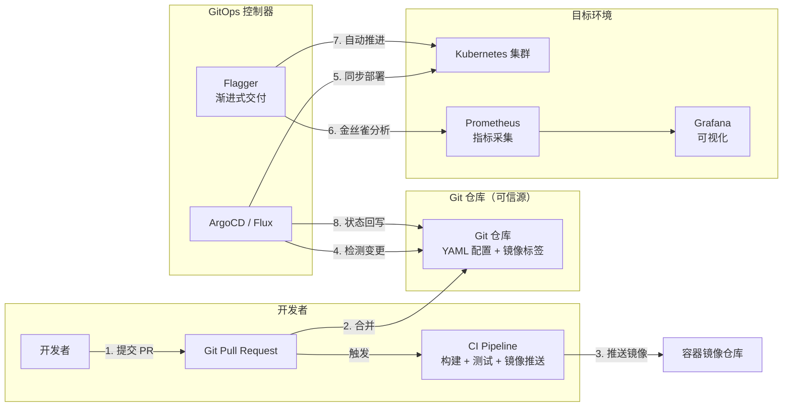
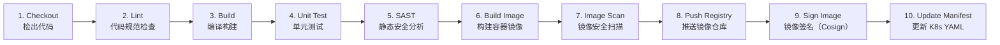
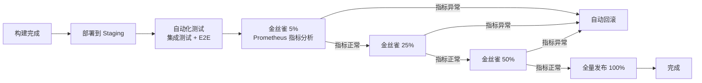
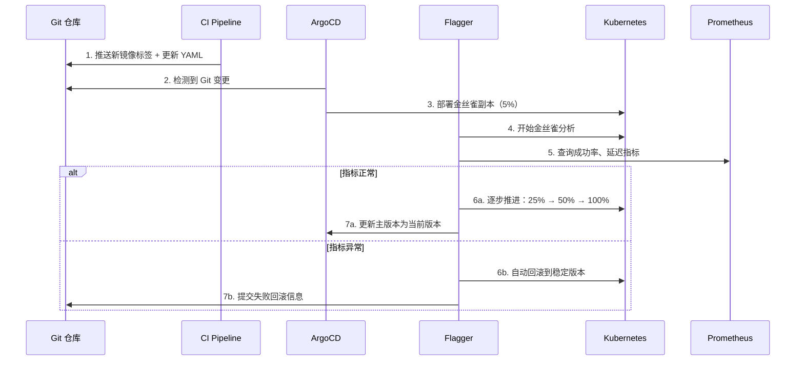
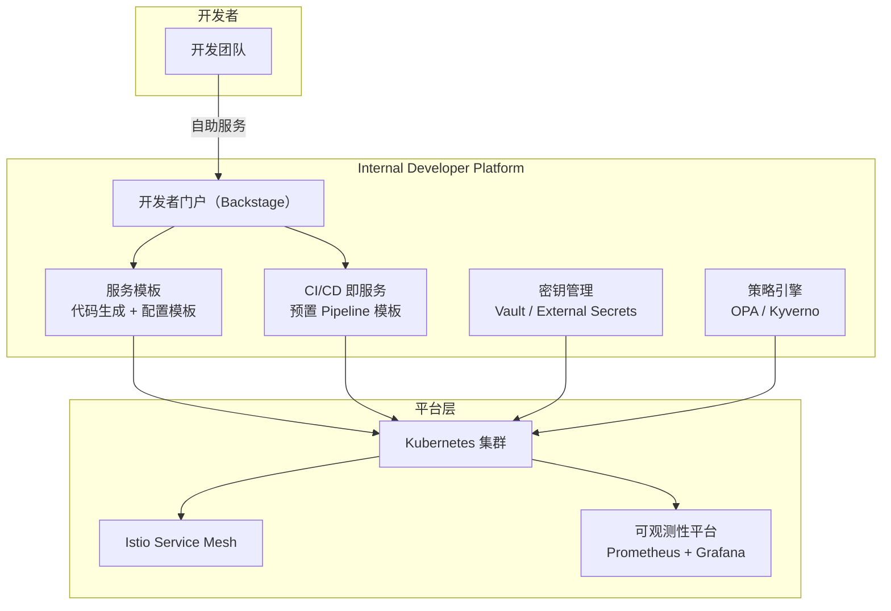
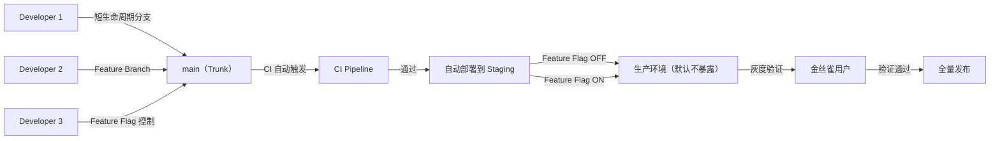

# 微服务如何实现DevOps

> **版本基线**：ArgoCD 2.12+ | Flux 2.x | Tekton 1.x | GitHub Actions | Flagger 1.30+
> **阅读时间**：约 35 分钟
> **前置知识**：[[24]] 微服务架构该如何落地？ · [[28]] 微博容器运维平台 DCP

## 概述

微服务拆分后，业务迭代的效率瓶颈从代码开发转移到了**发布与运维**。一个需求可能涉及数十个服务的代码变更、联调测试、灰度发布和回滚，人工协调的成本远超单体架构。DevOps 正是为解决这一问题而生——它不是简单的工具链拼接，而是一种**组织与技术双重转型**的工程实践。

原文以微博的 GitLab CI + DCP 实践为例，讲解了 CI/CD 流水线的构建。七年过去，DevOps 的范式已从 CI/CD 流水线演进为 **GitOps + Progressive Delivery + Platform Engineering** 三位一体的云原生工程体系。本篇将系统阐述这一演进脉络，以及微服务架构下 DevOps 的落地实践。

---

## 一、从 CI/CD 到 GitOps 的范式演进

### 1.1 DevOps 的本质

DevOps 的核心目标是通过**自动化流水线**消除开发与运维之间的壁垒，实现从代码提交到线上发布的端到端自动化。其核心包含三个层次：

| 层次 | 目标 | 核心实践 |
|------|------|---------|
| **自动化** | 消除手工操作 | CI/CD 流水线、自动化测试、自动化部署 |
| **协作** | 打破职能壁垒 | 开发负责全生命周期、共享 On-Call 职责 |
| **反馈** | 缩短问题发现到修复的周期 | 可观测性、A/B 验证、渐进式交付 |

### 1.2 GitOps：声明式运维范式

GitOps 是 2017 年由 Weaveworks 提出的声明式运维模型，其核心原则：

1. **声明式描述**：系统最终状态以声明式方式描述（YAML/JSON）
2. **Git 作为唯一可信源**：所有变更通过 Git Pull Request 管理，支持审计和回滚
3. **自动化同步**：GitOps 控制器（ArgoCD/Flux）持续监控 Git 与集群状态差异，自动同步
4. **持续校验**：使用 **观测性数据驱动** 的自动化策略（如 Flagger 渐进式交付）



### 1.3 CI/CD 工具选型

| 工具 | 类型 | 适用场景 | 特点 |
|------|------|---------|------|
| **GitHub Actions** | SaaS CI/CD | GitHub 仓库、中小团队 | 与 GitHub 深度集成，Marketplace 生态丰富 |
| **GitLab CI** | 内置 CI/CD | GitLab 仓库 | All-in-One 体验，Kubernetes 集成成熟 |
| **Tekton** | Kubernetes 原生 CI/CD | 云原生团队、多集群 | CNCF 项目，声明式 Pipeline，Serverless 执行 |
| **Jenkins** | 传统 CI/CD | 遗留系统迁移 | 插件生态最丰富，但运维成本高 |
| **ArgoCD** | GitOps 部署 | Kubernetes 应用交付 | 可视化 UI，多集群管理，App of Apps |
| **Flux** | GitOps 部署 | GitOps 原生工作流 | K8s API 驱动，声明式配置，轻量 |

**选型建议**：
- 全栈云原生：**Tekton + ArgoCD**（Kubernetes 原生，完全声明式）
- GitHub 用户：**GitHub Actions + ArgoCD**（CI 用 Actions，CD 用 ArgoCD）
- 追求简单：**GitLab CI + GitLab Auto DevOps**（All-in-One）

---

## 二、CI Pipeline 最佳实践

### 2.1 微服务 CI Pipeline 标准阶段

微服务的 CI Pipeline 应包含以下标准化阶段：



### 2.2 Tekton 声明式 Pipeline 示例

```yaml
# Tekton 1.x — 微服务 CI Pipeline
apiVersion: tekton.dev/v1
kind: Pipeline
metadata:
  name: microservice-ci
spec:
  params:
    - name: repo-url
    - name: image-name
    - name: image-tag
  workspaces:
    - name: shared-workspace
  tasks:
    - name: checkout
      taskRef:
        name: git-clone
      params:
        - name: url
          value: $(params.repo-url)
        - name: revision
          value: main
      workspaces:
        - name: output
          workspace: shared-workspace

    - name: lint
      taskRef:
        name: golangci-lint
      runAfter:
        - checkout
      params:
        - name: args
          value: ["run", "--timeout=5m"]

    - name: unit-test
      taskRef:
        name: go-test
      runAfter:
        - lint
      params:
        - name: args
          value: ["-race", "-coverprofile=coverage.out"]

    - name: build-image
      taskRef:
        name: kaniko
      runAfter:
        - unit-test
      params:
        - name: IMAGE
          value: $(params.image-name):$(params.image-tag)
        - name: DOCKERFILE
          value: ./Dockerfile
      workspaces:
        - name: source
          workspace: shared-workspace

    - name: trivy-scan
      taskRef:
        name: trivy-scanner
      runAfter:
        - build-image
      params:
        - name: image
          value: $(params.image-name):$(params.image-tag)

    - name: sign-image
      taskRef:
        name: cosign-sign
      runAfter:
        - trivy-scan
      params:
        - name: image
          value: $(params.image-name):$(params.image-tag)
```

### 2.3 DevSecOps 安全左移

现代 DevOps 将安全能力嵌入每个阶段：

| 阶段 | 安全实践 | 工具 |
|------|---------|------|
| 代码提交 | 密钥扫描、依赖检查 | Gitleaks, Trivy SBOM, Snyk |
| 构建阶段 | SAST 静态分析 | SonarQube, Semgrep |
| 镜像构建 | 镜像漏洞扫描 | Trivy, Grype |
| 部署阶段 | 镜像签名、准入控制 | Cosign, Kyverno, OPA Gatekeeper |
| 运行时 | 运行时安全监控 | Falco, Tetragon |

---

## 三、CD Pipeline 与渐进式交付

### 3.1 持续交付 vs 持续部署

| 模式 | 自动化程度 | 人工介入点 | 适用场景 |
|------|-----------|-----------|---------|
| **持续交付**（Continuous Delivery） | 自动构建、测试、部署到类生产环境 | 手动触发线上发布 | 对稳定性要求极高的核心服务 |
| **持续部署**（Continuous Deployment） | 全流程自动化，含线上发布 | 无人工介入 | 拥有完善测试体系和灰度能力的中大型团队 |

### 3.2 Progressive Delivery 渐进式交付

渐进式交付是持续部署的进化形态，通过**多阶段风险控制**逐步扩大发布范围：



### 3.3 Argo Rollouts：声明式金丝雀发布

```yaml
# Argo Rollouts 1.7+ — 金丝雀发布
apiVersion: argoproj.io/v1alpha1
kind: Rollout
metadata:
  name: user-service
spec:
  replicas: 20
  selector:
    matchLabels:
      app: user-service
  template:
    spec:
      containers:
        - name: user-service
          image: registry.example.com/user-service:v2.1.0
  strategy:
    canary:
      canaryService: user-service-canary
      stableService: user-service-stable
      trafficRouting:
        istio:
          virtualService:
            name: user-service
            routes:
              - primary
      steps:
        - setWeight: 5
        - pause: {duration: 2m}
        - analysis:
            templates:
              - templateName: success-rate
                clusterScope: true
            args:
              - name: service-name
                value: user-service-canary
        - setWeight: 25
        - pause: {duration: 5m}
        - analysis:
            templateName: latency-p95
        - setWeight: 50
        - pause: {duration: 5m}
        - setWeight: 100

---
# AnalysisTemplate — 金丝雀分析指标
apiVersion: argoproj.io/v1alpha1
kind: AnalysisTemplate
metadata:
  name: success-rate
spec:
  args:
    - name: service-name
  metrics:
    - name: success-rate
      initialDelay: 30s
      interval: 10s
      failureLimit: 3
      successCondition: result[0] >= 0.99
      provider:
        prometheus:
          address: http://prometheus.monitoring:9090
          query: |
            sum(rate(
              istio_requests_total{
                destination_service=~"{{args.service-name}}.*",
                response_code!~"5.."
              }[2m]
            )) / sum(rate(
              istio_requests_total{
                destination_service=~"{{args.service-name}}.*"
              }[2m]
            ))
    - name: latency-p95
      initialDelay: 30s
      interval: 10s
      failureLimit: 3
      successCondition: result[0] < 500
      provider:
        prometheus:
          address: http://prometheus.monitoring:9090
          query: |
            histogram_quantile(0.95,
              sum(rate(
                istio_request_duration_milliseconds_bucket{
                  destination_service=~"{{args.service-name}}.*"
                }[2m]
              )) by (le)
            )
```

### 3.4 ArgoCD + Flagger 集成



---

## 四、平台工程：从 DevOps 到 Internal Developer Platform

### 4.1 DevOps 的困境

随着微服务数量增长到数十甚至数百个，DevOps 面临着新的挑战：

- **基础设施碎片化**：不同团队使用不同的 CI/CD 工具链
- **开发者认知过载**：开发者需理解 Kubernetes、容器、服务网格等复杂概念
- **合规与安全**：安全策略难以在数百个微服务中统一执行
- **发布频率瓶颈**：手动审批和协调成为发布瓶颈

平台工程（Platform Engineering）是应对这些挑战的新范式，其核心是构建 **Internal Developer Platform（IDP）**：



### 4.2 Backstage 开发者门户

Backstage（CNCF 孵化项目）是目前最流行的 IDP 框架，提供以下核心能力：

| 能力 | 功能 | 微服务场景价值 |
|------|------|---------------|
| **Service Catalog** | 服务注册与发现 | 统一管理数百个微服务元数据 |
| **Software Templates** | 项目脚手架 | 标准化微服务项目模板，一键创建 |
| **TechDocs** | 文档中心 | API 文档、架构图、运行手册集中管理 |
| **CI/CD Integration** | 流水线集成 | 集成 ArgoCD、GitHub Actions 等 |
| **Search** | 全局搜索 | 快速查找服务、API、文档 |
| **Kubernetes Plugin** | 集群集成 | 查看 Pod 状态、日志、事件 |

### 4.3 IDP 成熟度模型

| 成熟度 | 特征 | 对应工具链 |
|--------|------|-----------|
| L1：手动流程 | 手工部署，文档分散 | Git + 手动 k8s deploy |
| L2：基础自动化 | CI 流水线，基础 CD | Jenkins/ArgoCD |
| L3：GitOps | 声明式配置，自动同步 | ArgoCD + Flux |
| L4：渐进式交付 | 金丝雀、自动回滚 | ArgoCD + Flagger |
| L5：自服务平台 | 开发者自助，模板标准化 | Backstage + IDP |

---

## 五、微服务 DevOps 工程实践

### 5.1 Trunk-Based Development 与 Feature Flag

微服务高频发布依赖 Trunk-Based Development 分支策略：



**Feature Flag 最佳实践**：

| 维度 | 建议 | 工具 |
|------|------|------|
| 粒度 | 服务级 → 方法级 → 用户级 | LaunchDarkly, Flagsmith, 自研 |
| 生命周期 | 上线开启 → 验证后全量 → 过期删除 | 关联 Jira/Issue 管理 |
| 安全 | 敏感功能需额外权限控制 | 与服务网格 RBAC 集成 |
| 审计 | 开启/关闭操作需可追溯 | 审计日志 + Slack 通知 |

### 5.2 环境管理策略

微服务架构下，推荐 **T恤尺码环境模型**：

| 环境 | 用途 | 与生产差异 | 数据 |
|------|------|-----------|------|
| **Development** | 本地开发 | 全量依赖 | 本地数据 / 模拟数据 |
| **Ephemeral（Preview）** | PR 预览部署 | 全量部署，每个 PR 独立环境 | 测试数据快照 |
| **Staging** | 预发布验证 | 全量部署，配置与生产一致 | 生产数据脱敏镜像 |
| **Canary** | 金丝雀验证 | 生产流量百分比 | 真实生产流量 |
| **Production** | 生产环境 | — | 真实生产数据 |

**Preview 环境（PR 环境）的自动化**：

```yaml
# ArgoCD ApplicationSet — 每个 PR 自动创建预览环境
apiVersion: argoproj.io/v1alpha1
kind: ApplicationSet
metadata:
  name: preview-environments
spec:
  generators:
    - pullRequest:
        github:
          owner: my-org
          repo: user-service
          tokenRef:
            secretName: github-token
            key: token
  template:
    metadata:
      name: "pr-{{number}}-user-service"
      labels:
        env: preview
    spec:
      project: default
      source:
        repoURL: https://github.com/my-org/user-service
        targetRevision: "PR-{{number}}"
        path: k8s/overlays/preview
      destination:
        server: https://kubernetes.default.svc
        namespace: preview-pr-{{number}}
      syncPolicy:
        automated:
          prune: true
          selfHeal: true
        syncOptions:
          - CreateNamespace=true
```

### 5.3 制品管理策略

| 制品类型 | 命名规范 | 保留策略 | 清理策略 |
|---------|---------|---------|---------|
| **Docker 镜像** | `service-name:commit-hash` | 最近 30 天 | 自动清理超期镜像 |
| **Helm Chart** | `service-name-0.1.2.tgz` | 每个版本保留 | SemVer 标签 |
| **JAR/NPM 包** | `service-name:1.2.3` | 每个版本保留 | 按版本清理 |

**不可变镜像**原则：每个镜像标签只构建一次，构建后不可修改。如需更新，需创建新标签（如 commit hash 或 SemVer）。

---

## 六、可观测性驱动的 DevOps

### 6.1 从监控到可观测性

原文强调测试和监控是 DevOps 的关键环节。现代可观测性体系将 DevOps 从"事后排查"推进到"实时感知"：

| 能力 | 传统监控 | 现代可观测性 |
|------|---------|-------------|
| 数据模型 | 指标（Metrics）为主 | Metrics + Traces + Logs 三大支柱 |
| 数据采集 | Agent 预埋点 | OpenTelemetry 自动埋点 + eBPF 无侵入 |
| 查询方式 | 预定义 Dashboard | 自由探索（Trace → Log → Metric 关联） |
| 告警 | 静态阈值 | AIOps 异常检测 + 告警降噪 |

### 6.2 DORA Metrics 度量

DORA（DevOps Research and Assessment）提出的四个核心指标已成为衡量 DevOps 成熟度的行业标准：

| 指标 | 定义 | Elite 水平 | 测量方式 |
|------|------|-----------|---------|
| **部署频率**（Deployment Frequency） | 代码部署到生产的频率 | 按需部署（每天多次） | CI/CD 日志 + Git Tag |
| **变更前置时间**（Lead Time for Changes） | 代码提交到部署完成的时间 | < 1 小时 | Git commit → K8s apply 时间差 |
| **变更失败率**（Change Failure Rate） | 部署导致线上故障的比例 | 0-15% | Incident 管理系统统计 |
| **恢复时间**（Time to Restore Service） | 故障发生后恢复服务的时间 | < 1 小时 | Incident 开始 → 修复完成 |

---

## 技术演进时间线

| 时间 | 里程碑 | 影响 |
|------|--------|------|
| 2010 | Jenkins 成为 CI 标准 | 自动化构建和测试成为共识 |
| 2013 | Docker 发布 | 容器化解决了环境一致性问题 |
| 2014 | Kubernetes 发布 | 容器编排标准化 |
| 2017 | GitOps 概念提出 | 声明式运维，Git 作为可信源 |
| 2018 | 原文描述：GitLab CI + DCP | DevOps 从概念走向大规模实践 |
| 2019 | ArgoCD 发布，Flagger 发布 | Kubernetes 原生 GitOps 工具成熟 |
| 2020 | Tekton 发布，Flux 发布 | CNCF 标准化 CI/CD 流水线 |
| 2020 | Backstage 开源（Spotify） | 平台工程兴起 |
| 2022 | OpenTelemetry 成为可观测性标准 | 统一三大支柱数据采集 |
| 2023 | Progressive Delivery 成为标配 | 金丝雀/蓝绿/功能标志成为标准实践 |
| 2024 | DevSecOps 全面普及 | 安全左移，供应链安全成为合规要求 |
| 2025 | AIOps 融入 DevOps | AI 驱动的智能发布和运维 |

---

## 架构决策指南

> **CI/CD 工具选型**
> - 小团队（< 10 人）：GitHub Actions 或 GitLab CI，零额外运维成本
> - 中团队（10-50 人）：ArgoCD（GitOps）+ 自选 CI，Kubernetes 原生
> - 大团队（50+ 人）：Tekton（CI）+ ArgoCD（CD）+ Backstage（IDP），全栈云原生
> - 遗留系统：Jenkins + ArgoCD 逐步迁移

> **渐进式交付策略**
> - 核心支付链路：金丝雀 5% → 10% → 25% → 50% → 100%，每步指标验证
> - 内部服务：蓝绿部署，零停机
> - 高频迭代的服务：Feature Flag + 持续部署

> **何时引入平台工程？**
> - 微服务数量 > 30 个，开发者认知过载
> - 安全合规要求高，需统一策略执行
> - 发布频率成为瓶颈，需要标准化流程

---

## 小结

微服务架构下的 DevOps 已从原始的 CI/CD 流水线演进为 **GitOps + Progressive Delivery + Platform Engineering** 三位一体的现代工程体系：

- **GitOps**：声明式配置管理，Git 作为唯一可信源，ArgoCD/Flux 自动同步
- **Progressive Delivery**：金丝雀/蓝绿/Feature Flag，数据驱动的渐进式发布
- **平台工程**：Backstage IDP 降低开发者认知负担，实现自助服务
- **DevSecOps**：安全左移，从代码扫描到镜像签名到运行时保护
- **可观测性驱动**：DORA Metrics + OpenTelemetry + AIOps 实现数据驱动的持续改进

**下一篇**：[[30]] 如何做好微服务容量规划？ →