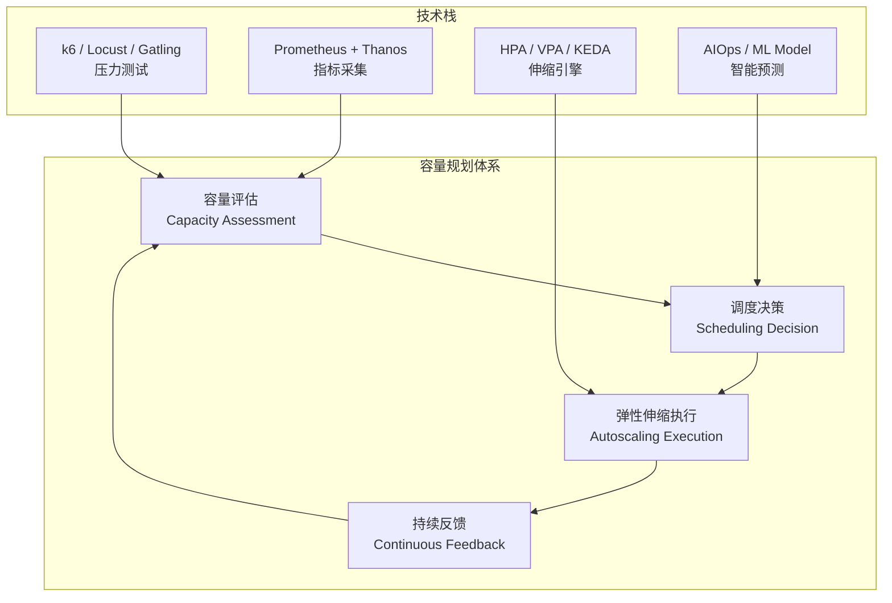
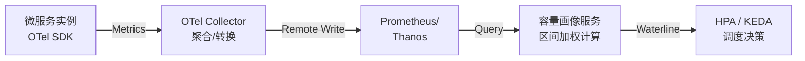
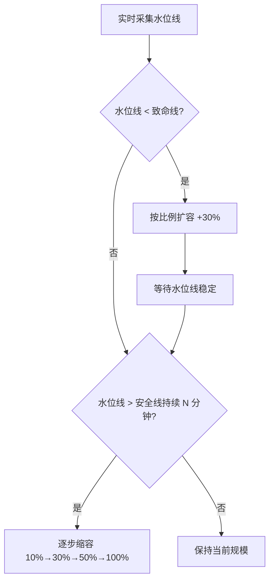
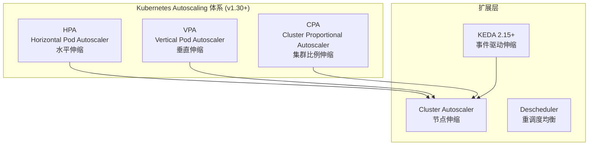
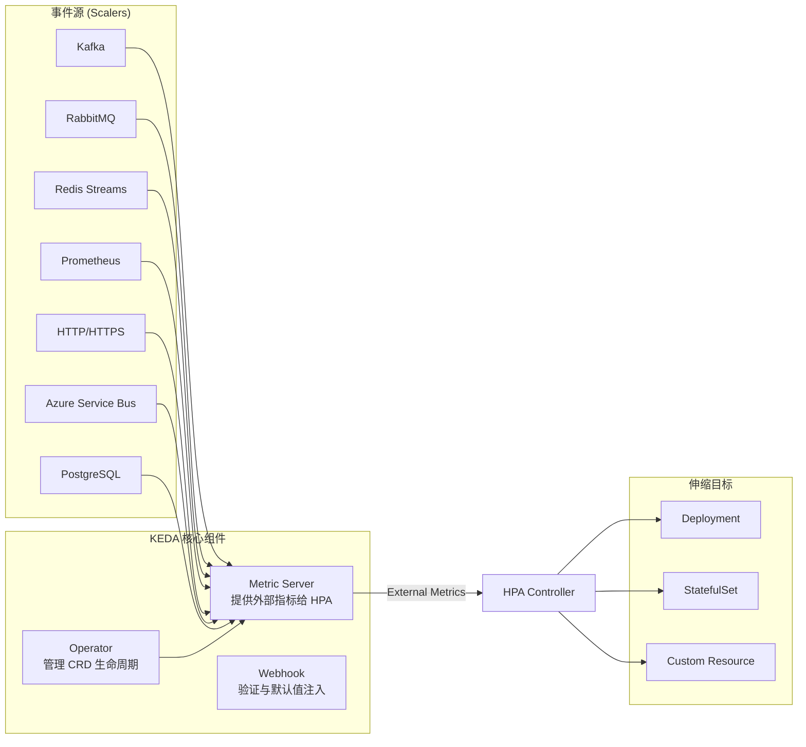
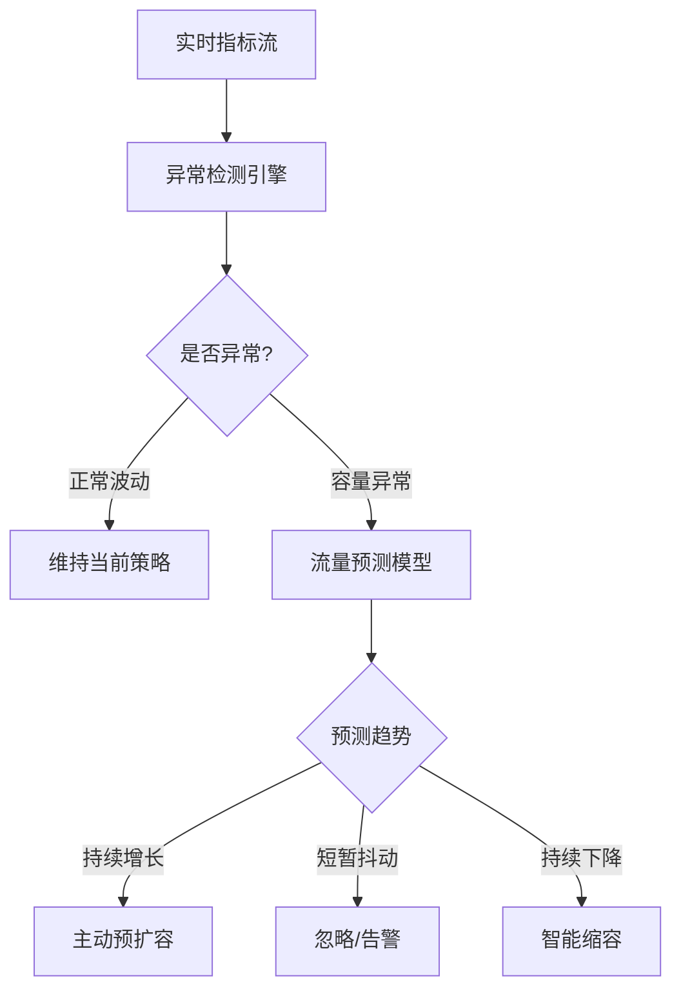
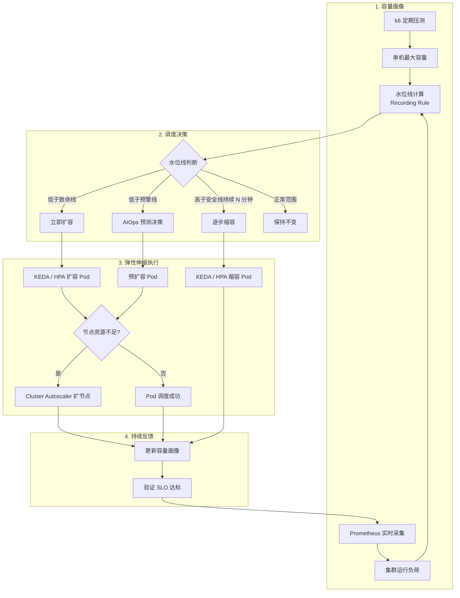

# 如何做好微服务容量规划

## 概述

单体应用拆分为微服务后，容量规划的复杂度呈指数级增长。在单体时代，只需关注一个应用的 QPS 与响应时间；而微服务架构下，数十乃至上百个服务的容量如何协同规划、弹性伸缩如何自动化决策、突发流量如何快速响应，成为运维与架构团队的核心挑战。

传统的"人肉运维+手动扩缩容"模式早已难以为继。从 2018 年微博的容量规划实践——基于水位线与区间加权的自动扩缩容，到 2025-2026 年以 **Kubernetes 原生 autoscaling**、**KEDA 事件驱动弹性伸缩**、**AIOps 智能容量预测**为代表的新一代容量规划体系，技术栈已发生根本性变革。

本文将从**容量评估**、**调度决策**、**云原生弹性伸缩体系**三个维度系统阐述微服务容量规划的完整方法论，并结合 Kubernetes 1.30+、KEDA 2.15+、k6 1.x 等最新技术栈给出落地实践。



## 正文

### 一、容量评估：从压测到持续容量画像

容量评估的核心目标是回答两个问题：**集群最大容量是多少？集群实时运行负荷是多少？** 二者之比即为"水位线"（Waterline），是调度决策的基础输入。

#### 1.1 压测指标选择：从单一指标到多维 SLI 体系

原文提到选择"慢速比"作为核心压测指标，这在当时是务实的做法。但 2025 年的实践表明，单一指标不足以刻画服务健康状态，应建立 **多维 SLI（Service Level Indicator）体系**：

| 指标类别 | 具体指标 | 优势 | 局限 |
|---------|---------|------|------|
| 系统类 | CPU 使用率 | 采集简单，通用性强 | 无法直接反映业务健康状况 |
| 系统类 | 内存使用率 | 对 OOM 风险预警有效 | GC 型应用波动大，参考性有限 |
| 服务类 | 平均响应时间 | 直观易懂 | 被长尾请求稀释，掩盖真实问题 |
| 服务类 | P99/P999 延迟 | 捕捉长尾问题 | 对突发抖动敏感，需配合窗口平滑 |
| 服务类 | 慢速比（>阈值占比） | 与用户体验直接关联 | 阈值选择依赖业务经验 |
| 服务类 | 错误率（5xx比率） | 反映严重退化 | 触发时往往已发生雪崩 |
| **现代类** | **饱和度（Saturation）** | Google SRE 四黄金指标之一 | 需要定义每类资源的"满载线" |

> **最佳实践（2025）**：采用 **SLO-based 压测**，以 SLO 违约作为压测终止条件。例如"Feed 接口 P99 延迟 > 1s 的比例超过 1%"作为硬性终止线，同时监控错误率作为安全兜底。

#### 1.2 压测方式演进：从人工压测到持续负载测试

原文介绍了单机压测（日志回放、TCP-Copy）和集群压测（缩节点法）两种方式。2025 年的主流实践已全面转向 **持续负载测试（Continuous Load Testing）**，以 k6、Locust、Gatling 为代表：

```yaml
# k6 1.x — 持续负载测试脚本示例 (k6 v1.x, JavaScript ES6+)
# 文件: capacity-test.js
import http from 'k6/http';
import { check, sleep } from 'k6';
import { Rate, Trend } from 'k6/metrics';

// 自定义指标：慢速比（响应时间 > 1s 的比例）
const slowRate = new Rate('slow_request_rate');
const feedLatency = new Trend('feed_latency');

export const options = {
  scenarios: {
    // 阶梯式加压场景
    ramping: {
      executor: 'ramping-arrival-rate',
      startRate: 100,
      timeUnit: '1s',
      preAllocatedVUs: 500,
      maxVUs: 5000,
      stages: [
        { duration: '5m', target: 500 },   // 缓慢加压到 500 RPS
        { duration: '10m', target: 1000 },  // 继续加压到 1000 RPS
        { duration: '5m', target: 2000 },   // 加压到 2000 RPS 观察拐点
        { duration: '5m', target: 0 },      // 减压恢复
      ],
    },
  },
  thresholds: {
    // SLO-based 终止条件：慢速比 > 1% 则测试失败
    slow_request_rate: ['rate<0.01'],
    feed_latency: ['p99<1000'],
    http_req_failed: ['rate<0.001'],
  },
};

export default function () {
  const res = http.get('https://api.example.com/feed', {
    tags: { endpoint: 'feed' },
  });

  const isSlow = res.timings.duration > 1000;
  slowRate.add(isSlow);
  feedLatency.add(res.timings.duration);

  check(res, {
    'status is 200': (r) => r.status === 200,
    'latency < 500ms': (r) => r.timings.duration < 500,
  });

  sleep(1);
}
```

**三大压测工具对比（2025）**：

| 特性 | k6 1.x | Locust 2.x | Gatling 3.x |
|------|---------|------------|------------|
| 语言 | JavaScript | Python | Scala/Java |
| 分布式支持 | k6 Cloud / Operator | 原生 Master-Worker | 原生集群模式 |
| CI/CD 集成 | 优秀（CLI 原生支持） | 一般 | 优秀（Maven/Gradle 插件） |
| 指标输出 | Prometheus Remote Write | CSV + Web UI | Gatling Enterprise |
| 协议支持 | HTTP/gRPC/WebSocket | HTTP/WebSocket | HTTP/WebSocket/JMS |
| Kubernetes 原生 | k6 Operator（CRD） | Helm Chart | Gatling Enterprise CRD |
| 脚本复用性 | 高（ES Module） | 中 | 中 |
| **适用场景** | **CI/CD 集成、SLO 验证** | **协议灵活、快速原型** | **JVM 生态、企业级** |

> **容量压测新范式**：将 k6 测试脚本通过 k6 Operator 以 CRD 方式部署到 Kubernetes 集群中，在 staging 环境中定期自动执行容量压测，结果自动推送到 Prometheus，与 HPA/KEDA 的指标链路打通，形成 **"压测→画像→伸缩"闭环**。

#### 1.3 单机容量计算：区间加权法的演进

原文提出的**区间加权法**是一种优雅的容量归一化方案，其核心思想是：不同响应时间的请求对资源的消耗不同，应赋予不同权重。这一方法在 2025 年依然是容量评估的有效手段，但有了更精细的实现方式。

**区间加权法的数学表达**：

$$Capacity = \sum_{i=1}^{n} W_i \times C_i$$

其中 $W_i$ 是第 $i$ 个耗时区间的权重，$C_i$ 是该区间内的请求计数。权重设计遵循指数递增原则，反映资源消耗的非线性增长。

**2025 改进点**：

1. **动态权重调整**：基于历史数据通过线性回归自动拟合各区间权重，而非人工设定
2. **多维容量向量**：不再产出单一标量，而是 (CPU容量, 内存容量, IO容量) 的向量，更精确地反映瓶颈资源
3. **OpenTelemetry 集成**：通过 OTel Metrics 的 Histogram 数据类型直接获取耗时分布，无需自定义聚合逻辑

```go
// 基于 OpenTelemetry Histogram 的区间加权容量计算
// Go 1.22+, OTel SDK v1.28+
package capacity

import (
	"go.opentelemetry.io/otel/sdk/metric/metricdata"
	"math"
)

// 区间权重定义 — 指数递增（键为耗时区间上界，单位秒，与 OTel Histogram 的 Bounds 一致）
var bucketWeights = map[float64]float64{
	0.01:        1,  // 0-10ms
	0.05:        2,  // 10-50ms
	0.1:         4,  // 50-100ms
	0.2:         8,  // 100-200ms
	0.5:         16, // 200-500ms
	1.0:         32, // 500ms-1s
	math.Inf(1): 64, // >1s
}

// CalculateWeightedCapacity 从 OTel Histogram 数据计算区间加权容量
func CalculateWeightedCapacity(histogram metricdata.Histogram[float64]) float64 {
	var capacity float64
	for _, dp := range histogram.DataPoints {
		prevBound := 0.0
		for i, count := range dp.BucketCounts {
			if i >= len(dp.Bounds) {
				break
			}
			upperBound := dp.Bounds[i]
			weight := getWeightForRange(prevBound, upperBound)
			capacity += weight * float64(count)
			prevBound = upperBound
		}
	}
	return capacity
}

func getWeightForRange(lower, upper float64) float64 {
	// 选取区间上界对应的权重
	for bound, weight := range bucketWeights {
		if upper <= bound {
			return weight
		}
	}
	return 64 // 默认最高权重
}
```

#### 1.4 实时负荷采集：从自定义聚合到 Prometheus + OTel

原文描述的"每台单机统计不同耗时区间的请求数，推送到集中处理的地方聚合"本质上是手动实现的指标聚合管道。2025 年，这一链路已由 **Prometheus + OpenTelemetry** 标准化：



**关键组件**：

- **OTel SDK**：在业务代码中以非侵入方式采集请求延迟 Histogram
- **OTel Collector**：负责聚合、转换、路由，支持跨集群数据汇总
- **Prometheus/Thanos**：长期存储与高效查询，Thanos 支持跨集群全局视图
- **容量画像服务**：定时从 Prometheus 查询 Histogram 数据，执行区间加权计算，输出水位线指标

```yaml
# Prometheus 自定义 Recording Rule — 自动计算集群水位线
# Prometheus Rule v1, Kubernetes 1.30+
groups:
  - name: capacity_waterline
    interval: 60s
    rules:
      # 计算集群运行负荷（区间加权；Prometheus Histogram 为累计桶，需先做相邻桶差分）
      - record: cluster:capacity:load_weighted
        expr: |
          sum by (cluster, service) (
            rate(http_request_duration_seconds_bucket{le="0.01"}[5m]) * 1 +
            (rate(http_request_duration_seconds_bucket{le="0.05"}[5m]) - rate(http_request_duration_seconds_bucket{le="0.01"}[5m])) * 2 +
            (rate(http_request_duration_seconds_bucket{le="0.1"}[5m]) - rate(http_request_duration_seconds_bucket{le="0.05"}[5m])) * 4 +
            (rate(http_request_duration_seconds_bucket{le="0.2"}[5m]) - rate(http_request_duration_seconds_bucket{le="0.1"}[5m])) * 8 +
            (rate(http_request_duration_seconds_bucket{le="0.5"}[5m]) - rate(http_request_duration_seconds_bucket{le="0.2"}[5m])) * 16 +
            (rate(http_request_duration_seconds_bucket{le="1.0"}[5m]) - rate(http_request_duration_seconds_bucket{le="0.5"}[5m])) * 32 +
            (rate(http_request_duration_seconds_bucket{le="+Inf"}[5m]) - rate(http_request_duration_seconds_bucket{le="1.0"}[5m])) * 64
          )

      # 计算集群水位线 = 最大容量 / 运行负荷
      - record: cluster:capacity:waterline
        expr: |
          cluster:capacity:max_weighted /
          cluster:capacity:load_weighted
```

### 二、调度决策：从水位线到云原生弹性伸缩体系

#### 2.1 水位线调度模型回顾与升级

原文的**水位线模型**（安全线/致命线 + 比例扩容 + 逐步缩容）是一个经典且有效的调度模型。其核心逻辑如下：



**2025 升级要点**：

1. **多级水位线**：从二级（安全/致命）扩展为四级（安全/预警/危险/致命），给调度系统更多决策空间
2. **防抖动机制升级**：从"5 个点中 3 个满足"升级为**滑动窗口 + EMA（指数移动平均）**滤波，有效过滤瞬时抖动
3. **预测性扩容**：基于历史流量模式（日周期/周周期），在流量高峰到来前预扩容，而非被动响应

#### 2.2 Kubernetes 原生 Autoscaling 体系

2025 年，Kubernetes 已构建了完整的 autoscaling 体系，由 HPA、VPA、CPA 三个核心组件构成：



**HPA (Horizontal Pod Autoscaler) — Kubernetes 1.30+**：

Kubernetes 1.30 对 HPA 进行了多项增强，核心特性包括：

| 特性 | 版本 | 说明 |
|------|------|------|
| HPA Status 条件增强 | 1.30+ | 更丰富的 ScalingLimited 原因说明 |
| Metric API 性能优化 | 1.30+ | 大规模集群下指标查询延迟降低 |
| Behavior 配置 | 1.23+ (稳定) | 精细控制扩缩容速率和稳定窗口 |
| Custom Metrics | 早已可用 | 通过 custom.metrics.k8s.io API（Prometheus Adapter 等）支持任意指标作为伸缩依据 |

```yaml
# HPA 配置示例 — 基于水位线指标的水位线感知伸缩
# Kubernetes 1.30+, autoscaling/v2
apiVersion: autoscaling/v2
kind: HorizontalPodAutoscaler
metadata:
  name: feed-service-hpa
  namespace: production
spec:
  scaleTargetRef:
    apiVersion: apps/v1
    kind: Deployment
    name: feed-service
  minReplicas: 10
  maxReplicas: 200

  metrics:
    # 基于自定义水位线指标
    - type: Pods
      pods:
        metric:
          name: capacity_waterline
        target:
          type: AverageValue
          averageValue: "1.5"  # 水位线目标值 1.5（负荷为容量的 2/3）

    # 兜底：基于 CPU 使用率
    - type: Resource
      resource:
        name: cpu
        target:
          type: Utilization
          averageUtilization: 70

  behavior:
    scaleUp:
      stabilizationWindowSeconds: 60    # 扩容稳定窗口 1 分钟
      policies:
        - type: Percent
          value: 30                      # 每次最多扩容 30%
          periodSeconds: 60
        - type: Pods
          value: 5                       # 或每次最多扩 5 个 Pod
          periodSeconds: 60
      selectPolicy: Max                  # 取两种策略的较大值
    scaleDown:
      stabilizationWindowSeconds: 300    # 缩容稳定窗口 5 分钟
      policies:
        - type: Percent
          value: 10                      # 先缩 10%
          periodSeconds: 300
        - type: Percent
          value: 30                      # 逐步可缩 30%
          periodSeconds: 600
      selectPolicy: Min                  # 缩容取较小值，保守缩容
```

**VPA (Vertical Pod Autoscaler)**：

VPA 关注的是单个 Pod 的资源请求（Request）是否合理，而非副本数调整。适用于：

- 内存泄漏等导致实际用量持续增长的场景
- 资源 Request 配置过高导致资源浪费的场景
- JVM 应用启动后堆内存逐步增长的场景

> **注意**：VPA 的 Update 模式会重启 Pod，对有状态服务需谨慎使用。推荐使用 Off 模式仅提供建议，配合 CI/CD 流水线自动调整 Request 值。

**CPA (Cluster Proportional Autoscaler)**：

CPA 根据集群节点数量按比例伸缩副本数，适用于 CoreDNS、Ingress Controller 等集群级基础设施服务。当 Cluster Autoscaler 扩容节点时，CPA 自动增加对应的 DNS 副本数。

#### 2.3 KEDA：事件驱动的弹性伸缩

KEDA (Kubernetes Event-Driven Autoscaling) 是微软与社区共同开源的事件驱动弹性伸缩方案，在 Kubernetes 原生 HPA 基础上扩展了**事件驱动**和**零副本缩容到零**两大核心能力。

**KEDA 2.15+ 核心架构**：



**KEDA vs 原生 HPA 关键差异**：

| 能力 | 原生 HPA | KEDA 2.15+ |
|------|---------|-----------|
| 指标来源 | CPU/内存/Prometheus | 60+ 事件源（Kafka/RabbitMQ/Redis 等） |
| 缩容到零 | 不支持 | 支持（ScaledObject minReplicaCount=0） |
| 伸缩触发 | 被动（指标超阈值后） | 主动（事件队列积压即触发） |
| 多触发器 | 支持（多指标） | 支持（多 Scaler 聚合策略） |
| 冷启动优化 | 无 | 支持（cooldownPeriod / minReplicaCount） |
| 全局伸缩 | 不支持 | 支持（ScaledJob → Job 扩缩） |
| 指标缓存 | 依赖 Metrics Server | 内置缓存，减少外部系统压力 |

**KEDA 实战：基于 Kafka 消息积压的自动伸缩**

```yaml
# KEDA 2.15+ ScaledObject — 基于 Kafka 消费者延迟伸缩
apiVersion: keda.sh/v1alpha1
kind: ScaledObject
metadata:
  name: feed-consumer-scaler
  namespace: production
spec:
  scaleTargetRef:
    apiVersion: apps/v1
    kind: Deployment
    name: feed-consumer
  pollingInterval: 30        # 每 30s 检查一次事件源
  cooldownPeriod: 300        # 缩容冷却期 5 分钟
  minReplicaCount: 2         # 最小副本数
  maxReplicaCount: 50        # 最大副本数
  fallback:                  # 指标源不可用时的降级策略
    failureThreshold: 3
    replicas: 10
  triggers:
    - type: kafka
      metadata:
        bootstrapServers: kafka-cluster.production.svc:9092
        consumerGroup: feed-consumer-group
        topic: feed-events
        lagThreshold: "1000"       # 每个 Partition 积压 1000 条消息时触发伸缩
        activationLagThreshold: "100"  # 积压低于 100 条时不伸缩
    - type: prometheus
      metadata:
        serverAddress: http://prometheus.monitoring:9090
        metricName: capacity_waterline
        threshold: "1.5"
        query: >-
          cluster:capacity:waterline{service="feed-consumer"}
  advanced:
    horizontalPodAutoscalerConfig:
      behavior:                  # 继承 HPA Behavior 配置
        scaleUp:
          stabilizationWindowSeconds: 60
          policies:
            - type: Percent
              value: 30
              periodSeconds: 60
        scaleDown:
          stabilizationWindowSeconds: 300
          policies:
            - type: Percent
              value: 10
              periodSeconds: 300
```

**KEDA 的典型应用场景**：

1. **消息队列驱动**：Kafka/RabbitMQ 消费者按消息积压量伸缩，"有活干就扩，没活干就缩到零"
2. **定时任务驱动**：Cron Scaler 在定时任务执行窗口预扩容
3. **Prometheus 指标驱动**：替代原生 HPA 的 Prometheus Adapter，配置更简洁
4. **HTTP 流量驱动**：基于 HTTP 请求速率的主动伸缩（Preview）
5. **多云事件源**：Azure Service Bus、AWS SQS、GCP PubSub 等云原生事件源

#### 2.4 AIOps 智能容量规划

2025-2026 年，AIOps 在容量规划领域的应用已从概念走向落地，主要涵盖三个方向：

**方向一：流量预测与预扩容**

基于历史时序数据（日周期、周周期、大促周期）训练预测模型，在流量高峰到来前自动扩容，消除冷启动延迟。

```python
# 基于 Prophet 的流量预测与预扩容决策
# Python 3.12+, prophet 1.1+
import pandas as pd
from prophet import Prophet
from kubernetes import client, config

class CapacityForecaster:
    """基于 Prophet 的容量预测器"""

    def __init__(self, lookback_days: int = 90, forecast_hours: int = 6):
        self.lookback_days = lookback_days
        self.forecast_hours = forecast_hours
        config.load_incluster_config()
        self.k8s_apps = client.AppsV1Api()

    def predict_qps(self, history_df: pd.DataFrame) -> pd.DataFrame:
        """预测未来 N 小时的 QPS"""
        model = Prophet(
            changepoint_prior_scale=0.05,   # 较低灵敏度，避免过拟合
            seasonality_prior_scale=10,      # 较强季节性
            yearly_seasonality=True,
            weekly_seasonality=True,
            daily_seasonality=True,
        )
        # 添加大促等特殊日期
        model.add_country_holidays(country_name='CN')
        model.fit(history_df)

        future = model.make_future_dataframe(
            periods=self.forecast_hours,
            freq='h'
        )
        forecast = model.predict(future)
        return forecast[['ds', 'yhat', 'yhat_lower', 'yhat_upper']]

    def calculate_pre_scale_replicas(
        self,
        predicted_qps: float,
        capacity_per_replica: float,
        safety_margin: float = 1.2,
    ) -> int:
        """根据预测 QPS 计算预扩容副本数"""
        required = (predicted_qps * safety_margin) / capacity_per_replica
        return max(1, int(required))
```

**方向二：异常检测与智能告警**

传统阈值告警依赖人工经验设定，AIOps 通过无监督异常检测自动识别容量异常：

- **3-Sigma 检测**：适用于近正态分布的指标（如 QPS）
- **IQR 检测**：适用于偏态分布的指标（如响应时间）
- **Isolation Forest**：适用于多维指标的联合异常检测
- **LSTM 自编码器**：适用于复杂时序模式的异常检测

**方向三：智能缩容决策**

缩容最大的风险是"缩了又要扩"，AIOps 通过分析历史模式判断当前低流量是暂时性还是持续性：

- 若历史数据显示流量将在 30 分钟内回升，则保持当前规模
- 若历史数据显示流量将持续走低，则执行逐步缩容
- 结合业务日历（大促/活动/节假日）做出更精确的判断



#### 2.5 Cluster Autoscaler：节点层弹性伸缩

Pod 层面的伸缩受限于集群节点资源，当 HPA/KEDA 扩容 Pod 但无节点可调度时，需要 Cluster Autoscaler (CA) 自动扩容节点池。

**CA 关键配置（Kubernetes 1.30+）**：

```yaml
# Cluster Autoscaler 配置示例
# Kubernetes 1.30+, cluster-autoscaler v1.30+
apiVersion: v1
kind: ConfigMap
metadata:
  name: cluster-autoscaler-status
  namespace: kube-system
data:
  autoscaler-config: |
    # 扩容策略
    scale-down-unneeded-time: 10m       # 节点空闲 10 分钟后可缩
    scale-down-delay-after-add: 10m     # 扩容后 10 分钟内不缩
    scale-down-delay-after-delete: 10s  # 缩容后 10 秒内不继续缩
    scale-down-delay-after-failure: 3m  # 缩容失败后 3 分钟重试
    max-graceful-termination-sec: 600   # 优雅终止最长等待时间

    # 扩容优化
    expander: priority                  # 按优先级选择节点组扩容
    balance-similar-node-groups: true   # 相似节点组间均衡
    skip-nodes-with-system-pods: true   # 跳过含系统 Pod 的节点

    # 节点组自动发现
    node-group-auto-discovery: label=cloud.google.com/gke-nodepool
```

**云厂商节点弹性方案对比**：

| 方案 | 云厂商 | 特点 |
|------|-------|------|
| Cluster Autoscaler | 通用 | 社区标准，功能全面 |
| Karpenter | AWS | 更快的调度速度，灵活的节点选择 |
| EKS Managed Node Groups | AWS | 托管节点组，简化运维 |
| GKE Autopilot | GCP | 完全托管，无需管理节点 |
| AKS Virtual Nodes | Azure | 基于 Virtual Kubelet，秒级扩容 |
| 阿里云 ECI | 阿里云 | 弹性容器实例，按量付费 |

> **趋势（2025-2026）**：Karpenter 模式正在成为新标准，其核心思想是"不管理节点组，而是直接按 Pod 需求选择最优节点"，打破了传统 Node Group 的约束。阿里云、华为云等也在跟进类似方案。

### 三、容量规划全流程实践

综合以上内容，一个完整的微服务容量规划体系应包含以下环节：



#### 3.1 容量画像 Pipeline

```yaml
# 容量画像 CronJob — 定期执行 k6 压测更新容量基线
# Kubernetes 1.30+, k6 Operator v0.0.9+
apiVersion: k6.io/v1alpha1
kind: K6
metadata:
  name: capacity-benchmark
  namespace: capacity-planning
spec:
  parallelism: 4                        # 4 个 Worker 并行压测
  script:
    configMap:
      name: k6-capacity-test
      file: capacity-test.js
  arguments: --out experimental-prometheus-rw  # 直接写入 Prometheus
  runner:
    env:
      - name: K6_PROMETHEUS_RW_SERVER_URL
        value: "http://prometheus.monitoring:9090/api/v1/write"
    resources:
      requests:
        cpu: "1"
        memory: "1Gi"
      limits:
        cpu: "2"
        memory: "2Gi"
```

#### 3.2 端到端容量规划配置清单

| 组件 | 配置项 | 推荐值 | 说明 |
|------|-------|--------|------|
| HPA | minReplicas | 业务最低保障 | 按峰值 30% 设定 |
| HPA | maxReplicas | 集群最大容量 | 需配合 Cluster Autoscaler |
| HPA | scaleUp.stabilizationWindowSeconds | 60 | 扩容快速响应 |
| HPA | scaleDown.stabilizationWindowSeconds | 300 | 缩容保守等待 |
| KEDA | pollingInterval | 30 | 事件源检查间隔 |
| KEDA | cooldownPeriod | 300 | 缩容冷却期 |
| KEDA | minReplicaCount | 0 或 2 | 无状态服务可缩到零 |
| CA | scale-down-unneeded-time | 600 | 节点空闲 10 分钟后缩 |
| Pod Disruption Budget | maxUnavailable | 1 | 滚动更新/缩容时保证可用性 |
| PriorityClass | 临界值 | system-critical / app-critical | 低优先级 Pod 可被抢占 |

#### 3.3 防止容量规划常见陷阱

| 陷阱 | 表现 | 解决方案 |
|------|------|---------|
| 冷启动延迟 | 扩容的 Pod 启动慢，流量已过载 | 预热 + 预扩容 + Readiness Gate |
| 缩容震荡 | 缩了又扩，扩了又缩 | 增大稳定窗口 + 逐步缩容 |
| 指标延迟 | HPA 指标滞后于实际负载 | 缩短采集间隔 + 使用 OTel 实时推送 |
| 资源碎片 | 节点有资源但无法调度 Pod | Descheduler 重调度 + 合理设置 Request |
| 级联扩容 | A 服务扩容触发依赖服务过载 | 全链路容量规划 + 依赖服务同步扩容 |
| 水位线失真 | 个别故障节点导致整体水位偏低 | 剔除异常节点 + 分位值代替均值 |

> **级联扩容问题的解法**：这是原文提到的"依赖服务容量是否足够"问题的现代化解法。当 Feed 服务因流量突增触发扩容时，应同步检查下游依赖服务（如用户关系服务、Card 服务）的水位线，若下游水位也接近致命线，则触发**联动扩容**。KEDA 的多 Scaler 聚合能力可实现这一逻辑。

## 技术演进时间线

| 年份 | 里程碑 | 技术代表 | 容量规划方式 |
|------|--------|---------|-------------|
| 2015 | 容器化起步 | Docker 1.x | 手动扩缩容，脚本化运维 |
| 2016 | 容器编排 | Kubernetes（HPA 于 1.1 引入） | 基于 CPU 的自动伸缩 |
| 2017 | 微服务爆发 | Spring Cloud / Dubbo | 自建容量规划系统（水位线模型） |
| 2018 | 云原生兴起 | Kubernetes 1.10/1.11（自定义指标 API 稳定） | HPA + Prometheus 自定义指标 |
| 2019 | 服务网格 | Istio 1.x | 网格级流量控制 + 伸缩 |
| 2020 | 事件驱动伸缩 | KEDA 2.0 | 事件源驱动的弹性伸缩 |
| 2021 | 混沌工程 | Chaos Mesh / Litmus | 容量验证 + 混沌实验结合 |
| 2022 | FinOps 兴起 | Kubecost / OpenCost | 成本感知的容量规划 |
| 2023 | VPA 成熟 | VPA 0.14+ | 垂直伸缩 + 右-sizing |
| 2024 | AIOps 落地 | Prophet / LSTM | 智能预测 + 预扩容 |
| 2025 | 统一弹性平台 | KEDA 2.15+ / Karpenter | 多层协同 + 事件驱动 + 智能决策 |
| 2026 | 自主运维 | LLM + Agent | 自然语言驱动的容量管理 |

## 架构决策指南

### 场景一：中小规模（< 50 个微服务）

**推荐方案**：HPA + Prometheus + k6

```yaml
# 中小规模简化配置
apiVersion: autoscaling/v2
kind: HorizontalPodAutoscaler
metadata:
  name: service-hpa
spec:
  scaleTargetRef:
    apiVersion: apps/v1
    kind: Deployment
    name: my-service
  minReplicas: 3
  maxReplicas: 20
  metrics:
    - type: Resource
      resource:
        name: cpu
        target:
          type: Utilization
          averageUtilization: 70
  behavior:
    scaleUp:
      stabilizationWindowSeconds: 60
    scaleDown:
      stabilizationWindowSeconds: 300
```

**决策要点**：
- 优先使用 CPU 指标，简单可靠
- 定期（每月）用 k6 执行容量压测，更新 HPA 阈值
- 暂不需要 KEDA 和 AIOps

### 场景二：中等规模（50-200 个微服务）

**推荐方案**：KEDA + Prometheus + k6 + Cluster Autoscaler

**决策要点**：
- 消息驱动服务使用 KEDA，REST 服务使用 HPA
- 引入水位线指标作为自定义伸缩依据
- 部署 Cluster Autoscaler 实现节点层弹性
- 建立 Pod Disruption Budget 和 PriorityClass

### 场景三：大规模（> 200 个微服务）

**推荐方案**：KEDA + AIOps + k6 + Cluster Autoscaler + FinOps

**决策要点**：
- 全链路容量画像，服务间联动扩容
- AIOps 流量预测 + 预扩容
- FinOps 成本优化，Spot/Preemptible 实例混部
- 混沌工程定期验证容量规划有效性
- Karpenter 替代传统 Cluster Autoscaler

### 场景决策矩阵

| 决策维度 | HPA | KEDA | AIOps |
|---------|-----|------|-------|
| 适用规模 | 中小 | 中大 | 大 |
| 指标类型 | CPU/内存/自定义 | 60+ 事件源 | 预测性指标 |
| 缩容到零 | 否 | 是 | 否 |
| 实现复杂度 | 低 | 中 | 高 |
| 运维成本 | 低 | 中 | 高 |
| 响应速度 | 被动（分钟级） | 半主动（秒-分钟级） | 主动（提前扩容） |
| 冷启动风险 | 中 | 中 | 低 |
| 依赖 | Metrics Server | KEDA Operator | ML Pipeline + 数据仓库 |
| 推荐组合 | 基础伸缩 | + KEDA 事件驱动 | + AIOps 预测 |

## 小结

微服务容量规划从 2018 年微博的"水位线 + 区间加权"实践，到 2025 年的 **KEDA 事件驱动 + AIOps 智能预测 + 云原生多层协同**，已经形成了完整的体系：

1. **容量评估**：从人工压测到 k6 持续负载测试，从单一指标到多维 SLI 体系，区间加权法依然是容量归一化的有效手段，但已与 OpenTelemetry + Prometheus 深度集成

2. **调度决策**：从水位线二级模型到多级水位线 + EMA 防抖 + 预测性扩容，Kubernetes HPA Behavior 配置提供了标准化的扩缩容速率控制

3. **弹性伸缩**：HPA（水平伸缩）+ VPA（垂直伸缩）+ KEDA（事件驱动）+ Cluster Autoscaler（节点伸缩）构成四层协同伸缩体系，KEDA 的 60+ 事件源和缩容到零能力是关键差异化特性

4. **智能增强**：AIOps 的流量预测、异常检测、智能缩容决策，将容量规划从"被动响应"升级为"主动预测"

5. **成本优化**：FinOps 与容量规划的结合，使得扩缩容决策不仅考虑性能，还考虑成本效益

**核心原则**：容量规划不是一次性项目，而是持续反馈的闭环系统。压测→画像→伸缩→验证→优化，每一轮循环都在提升系统对流量变化的响应能力。

最后回答原文的思考题：当集群内个别单机故障导致水位线失真时，2025 年的解法是——**在聚合水位线前先执行异常节点过滤**：通过 Pod 级别的健康评分（基于重启率、OOM 次数、P99 延迟偏离度），将健康评分低于阈值的实例从水位线计算中剔除；同时通过 Prometheus 的 `quantile` 函数取 P50 代替均值，降低异常值的影响。更进一步的方案是使用 **PodDisruptionBudget** 主动驱逐异常节点上的 Pod，让 Cluster Autoscaler 自动替换不健康节点。
