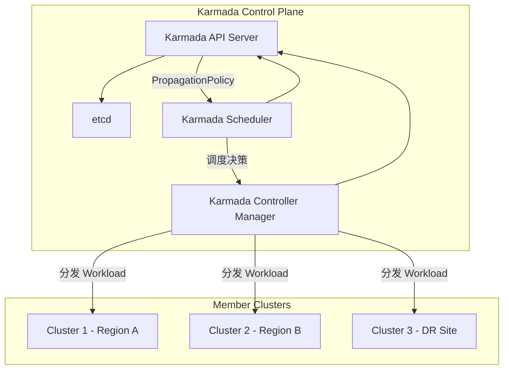
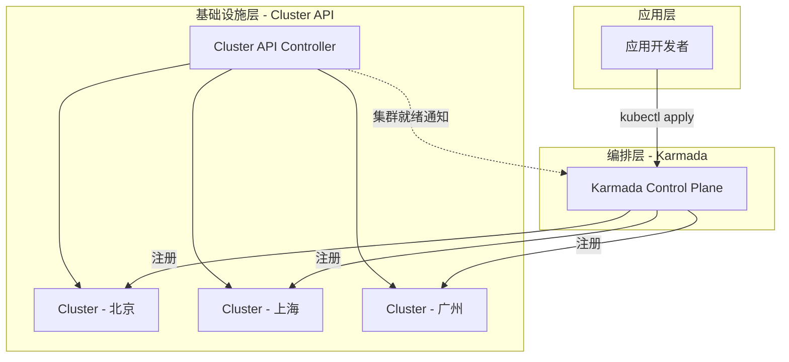
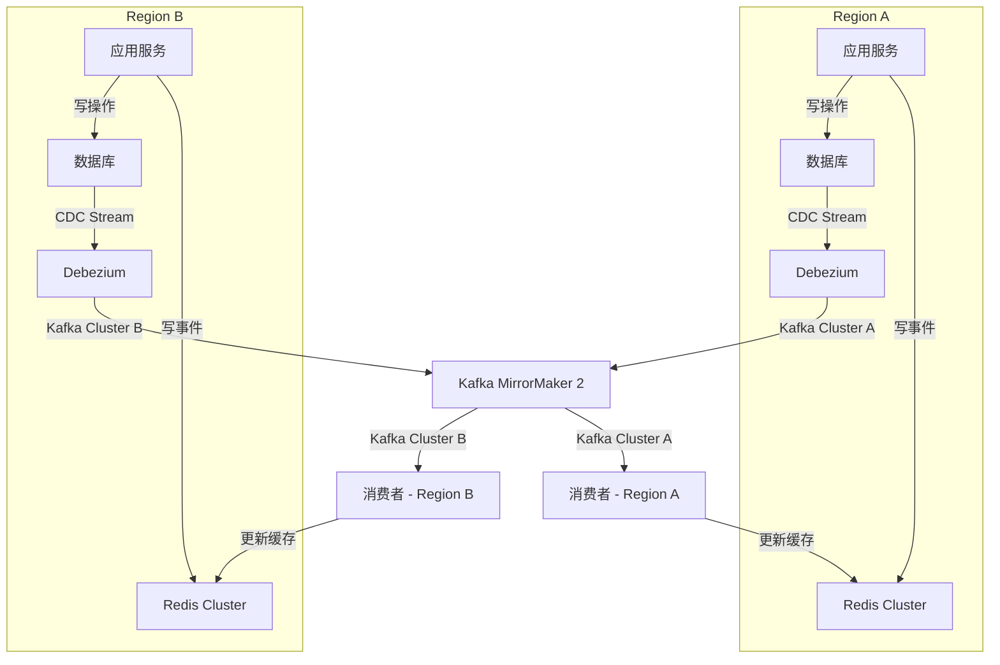
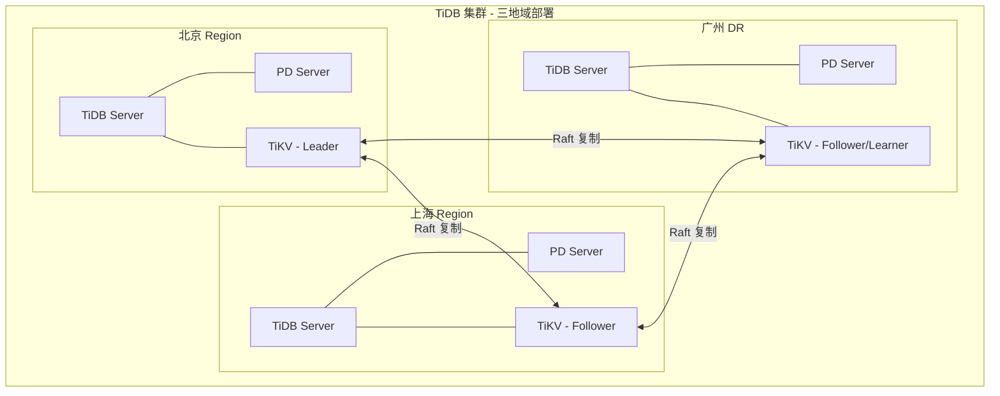
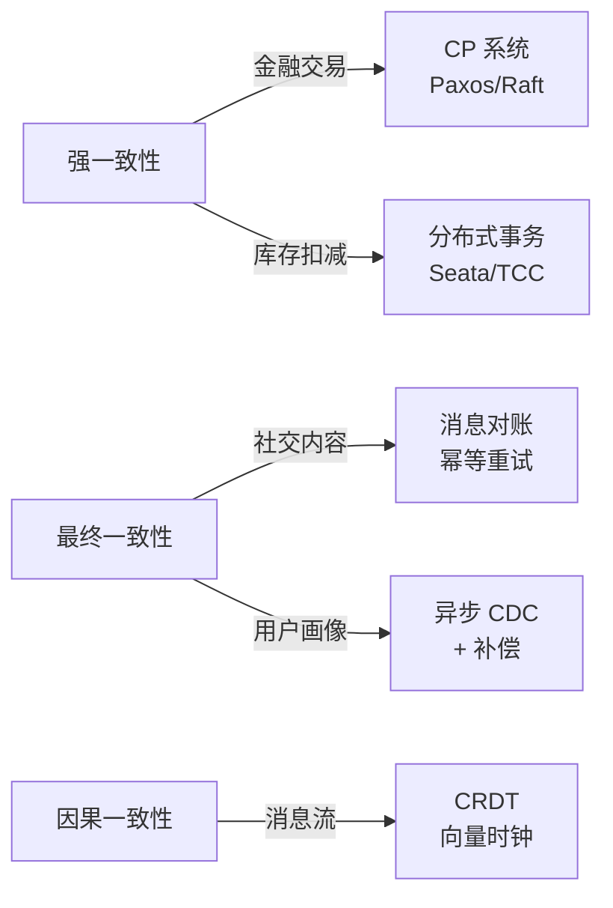
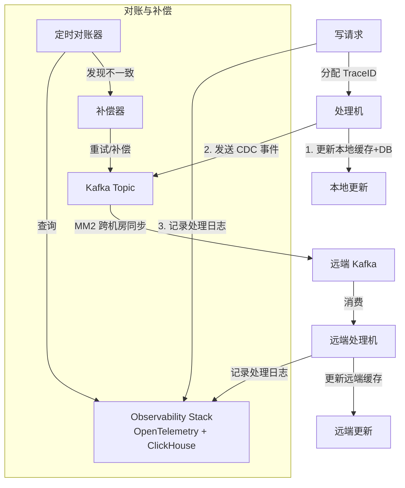
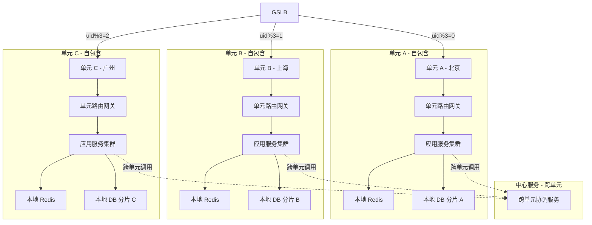
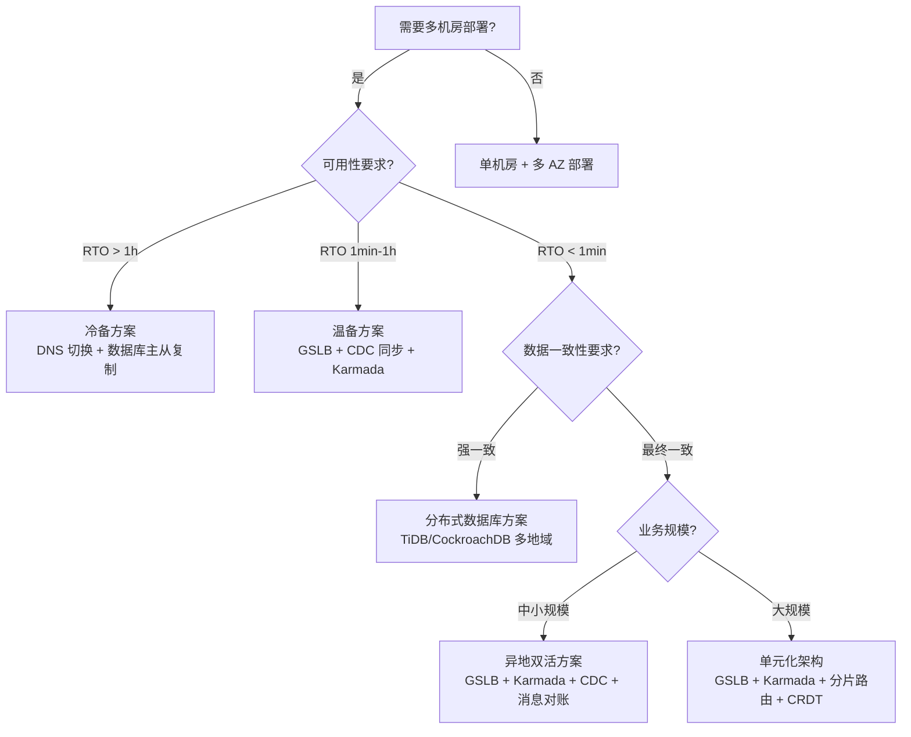

# 微服务多机房与多集群部署实践

## 概述

在云原生时代，微服务的高可用早已不再局限于单机房内的冗余部署。从早期的主从机房冷备，到异地双活，再到如今的单元化多活架构，多机房/多集群部署已经成为生产级微服务系统的标准配置。但多机房部署远非"把服务复制到多个机房"这么简单，它涉及三个核心挑战：

- **流量调度**：用户请求如何被路由到最优机房？故障时如何快速切换？
- **数据同步**：多个机房/集群之间的数据如何保持同步？
- **一致性保障**：同步过程中如何确保数据一致性？强一致还是最终一致？

在 Kubernetes 多集群管理、Service Mesh、CDC（Change Data Capture）等云原生技术的推动下，多机房部署的工程实践已经发生了根本性变化。本文将从传统架构出发，结合 Karmada 1.9+、MCS API、Istio Ambient Mesh 等最新技术栈，系统讲解多机房/多集群部署的完整方案。

---

## 一、多机房流量调度：从 DNS 分流到全局负载均衡

### 1.1 传统 DNS 分流方案

最经典的多机房流量调度方式是 DNS 分流：根据用户 IP 地理位置解析到不同机房的 VIP。每个机房内部再通过四层负载均衡（LVS/IPVS）+ 七层负载均衡（Nginx/Envoy）完成请求分发。

这种方案的问题在于：DNS 缓存导致切换延迟长（TTL 通常 30s-5min），且缺乏实时健康感知能力。

### 1.2 全局负载均衡（GSLB）

GSLB（Global Server Load Balancing）在 DNS 层之上增加了智能决策能力：

| 能力 | 传统 DNS 分流 | GSLB |
|------|-------------|------|
| 健康检查 | 无 | 主动/被动健康探测 |
| 故障切换 | 手动修改 DNS，分钟级 | 自动检测，秒级切换 |
| 负载感知 | 无 | 实时负载、延迟、容量感知 |
| 切换延迟 | TTL 依赖，30s-5min | 结合 DNS 刷新 + anycast，可低至秒级 |

### 1.3 云原生方案：Gateway API + Service Mesh

Kubernetes Gateway API（GA 于 2023 年，v1.1+ 于 2024 年发布）为多集群流量入口提供了标准化定义。

```yaml
# Kubernetes Gateway API - 多集群 Gateway 示例 (Gateway API v1.1+, Kubernetes 1.30+)
apiVersion: gateway.networking.k8s.io/v1
kind: HTTPRoute
metadata:
  name: api-route
spec:
  parentRefs:
    - name: multi-region-gateway
  rules:
    - backendRefs:
        - name: api-service
          port: 8080
          weight: 80
        - name: api-service-dr
          port: 8080
          weight: 20
```

**Istio Ambient Mesh**（1.18 引入，1.24 起正式 GA）引入了无 Sidecar 的数据面模式，通过 ztunnel（节点级代理）和 waypoint（按命名空间部署的 L7 代理）实现多集群网格，大幅降低资源开销。

| 模式 | 优点 | 缺点 | 适用场景 |
|------|------|------|---------|
| Single Primary | 控制面简单，统一管理 | 控制面单点 | 跨 Region 但同云厂商 |
| Multi-Primary | 控制面高可用 | 配置复杂，需同步 | 跨云/混合云 |
| Ambient Multi-Cluster | 资源开销低，运维简单 | 功能仍在完善 | 大规模多集群渐进式采纳 |

---

## 二、多集群管理：从手工运维到声明式编排

### 2.1 多集群管理演进

Kubernetes 多集群管理经历了三代演进：

| 代际 | 代表方案 | 核心思路 | 状态 |
|------|---------|---------|------|
| 第一代 | KubeFed v2 | 联邦化 API，统一调度 | 已归档（2022） |
| 第二代 | Kubefed → Karmada 继承 | 分离调度与执行 | 活跃，CNCF 毕业（2026-09） |
| 第三代 | Karmada 1.9+ + Cluster API | 声明式多集群编排 + 集群生命周期管理 | 当前主流 |

### 2.2 Karmada 架构与核心概念

Karmada（Kubernetes Armada）是 CNCF 毕业项目（2026 年 9 月），继承了 KubeFed 的设计理念但做了根本性改进：



**核心 CRD**：

- **PropagationPolicy**：定义工作负载如何分发到多个集群（调度策略）
- **OverridePolicy**：定义针对特定集群的配置覆盖（差异化配置）
- **ResourceBinding**：调度器产生的调度结果
- **Work**：下发到成员集群的工作负载对象

```yaml
# Karmada PropagationPolicy - 多集群分发策略 (Karmada 1.9+)
apiVersion: policy.karmada.io/v1alpha1
kind: PropagationPolicy
metadata:
  name: api-service-propagation
spec:
  resourceSelectors:
    - apiVersion: apps/v1
      kind: Deployment
      name: api-service
  placement:
    clusterAffinity:
      clusterNames:
        - cluster-bj
        - cluster-sh
        - cluster-gz
    clusterTolerations:
      - key: "cluster.karmada.io/unreachable"
        operator: Exists
        tolerationSeconds: 30
    spreadConstraints:
      - maxGroups: 3
        minGroups: 2
        spreadByField: cluster
    replicaScheduling:
      replicaSchedulingType: Divided
      replicaDivisionPreference: Weighted
      weightPreference:
        staticWeightList:
          - targetCluster:
              clusterNames: [cluster-bj]
            weight: 5
          - targetCluster:
              clusterNames: [cluster-sh]
            weight: 3
          - targetCluster:
              clusterNames: [cluster-gz]
            weight: 2
```

### 2.3 Karmada 1.9+ 关键特性

Karmada 近期版本的重要演进：

| 特性 | 版本 | 说明 |
|------|------|------|
| 声明式冲突解决 | v1.7+ | 多策略冲突时的优先级与合并策略 |
| 增量同步优化 | v1.8+ | 仅同步变更部分，减少控制面到成员集群的流量 |
| 调度器增强 | v1.9+ | 支持集群优先级调度、Taint/Toleration 机制 |
| Fence 机制 | v1.9+ | 自动隔离故障集群，避免持续重试 |
| Federated HPA | v1.9+ | 跨集群水平自动扩缩容 |
| Workload Rebalancing | v1.9+ | 集群变化时自动重平衡工作负载 |
| Resource Interpreter | v1.8+ | 自定义资源的调度语义解释 |

### 2.4 Cluster API：集群生命周期管理

Cluster API（CAPI）专注于 Kubernetes 集群本身的声明式生命周期管理，与 Karmada 的多集群工作负载编排互补：



### 2.5 多集群服务发现：MCS API

Kubernetes SIG-Multicluster 推出的 MCS（Multi-Cluster Services）API 解决了跨集群服务发现的标准化问题。

**MCS API 核心概念**：

- **ServiceExport**：将一个集群中的 Service 导出到多集群可见
- **ServiceImport**：将其他集群导出的 Service 导入到本集群
- **ClusterSet**：定义一组逻辑上相关的集群

```yaml
# MCS API - 导出/导入服务 (MCS API v0.1+, Kubernetes 1.30+)
apiVersion: multicluster.x-k8s.io/v1alpha1
kind: ServiceExport
metadata:
  name: api-service
  namespace: production
---
apiVersion: multicluster.x-k8s.io/v1alpha1
kind: ServiceImport
metadata:
  name: api-service
  namespace: production
spec:
  type: ClusterSetIP
  ports:
    - port: 8080
      protocol: TCP
  ips:
    - 10.96.100.1  # 跨集群虚拟 IP
```

**MCS API 与 Karmada 集成**：Karmada 从 v1.8 开始内置 MCS API 控制器，可以自动管理 ServiceExport/ServiceImport 的生命周期，无需额外部署 MCS 控制器。

| 方案 | 服务发现范围 | 跨集群负载均衡 | 服务健康感知 | 标准化程度 |
|------|------------|-------------|------------|----------|
| KubeFed Service | 联邦集群 | 有限 | 无 | 已归档 |
| Istio ServiceEntry | Mesh 内集群 | 完整 | 完整 | Istio 特有 |
| MCS API | ClusterSet 内 | 基础 | 基础 | Kubernetes 标准 |
| Karmada 内置 MCS | Karmada 管理集群 | 完整 | 完整 | 兼容 MCS 标准 |

---

## 三、多机房数据同步：从 binlog 复制到 CDC + 分布式数据库

### 3.1 传统数据同步架构回顾

原始的多机房数据同步有两种经典模式：

**主从机房架构**：所有写请求走主机房，主机房负责更新本机房缓存和数据库，其他机房缓存通过主机房同步更新，数据库通过 MySQL binlog 异步复制。优点是简单一致，缺点是主机房是单点。

**独立机房架构**：每个机房都处理写请求，通过消息同步组件（如微博 WMB）将写请求双向同步，每个机房拥有全量写消息。缓存各机房独立更新，数据库仍通过 binlog 单写主库复制。

### 3.2 现代数据同步方案：CDC + 事件驱动

在现代云原生架构中，传统的 binlog 直接复制和自定义消息同步组件已被更标准化的方案替代：



**关键技术组件**：

| 组件 | 版本 | 作用 |
|------|------|------|
| Debezium | 2.5+ | CDC，捕获数据库变更事件 |
| Apache Kafka | 3.7+ | 事件流平台，可靠传输变更事件 |
| Kafka MirrorMaker 2 | 3.7+ | 跨集群/跨机房消息同步 |
| Redis Cluster | 7.2+ | 分布式缓存，支持跨机房复制 |

**Debezium CDC 配置示例**（Debezium 2.5+）：

```json
{
  "name": "mysql-connector",
  "config": {
    "connector.class": "io.debezium.connector.mysql.MySqlConnector",
    "database.hostname": "mysql-primary.region-a",
    "database.port": "3306",
    "database.user": "debezium",
    "database.password": "${DB_PASSWORD}",
    "database.server.id": "184054",
    "topic.prefix": "region_a",
    "database.include.list": "app_db",
    "snapshot.mode": "schema_only"
  }
}
```

### 3.3 分布式数据库：原生多地域支持

新一代分布式数据库内置了多地域复制能力，从根本上简化了数据同步：

| 数据库 | 多地域方案 | 一致性模型 | 典型延迟 | 适用场景 |
|--------|----------|----------|---------|---------|
| TiDB | Placement Rules + CDC | Raft 强一致 / 异步 CDC | 同城 <5ms, 跨城 30-100ms | 中大规模，强一致需求 |
| CockroachDB | Multi-Region SQL | Range 级 Raft | 同城 <5ms, 跨城 30-100ms | 全球部署，Geo-Partition |
| YugabyteDB | Geo-Partitioned Data | Raft + Async | 同城 <5ms, 跨城 30-100ms | 云原生，Postgres 兼容 |
| OceanBase | Multi-Zone Multi-DC | Paxos | 同城 <3ms | 金融级，超大规模 |

**TiDB 多地域部署示例**（TiDB 7.5+）：

```sql
-- TiDB Placement Rules - 数据地域亲和 (TiDB 7.5+)
ALTER PLACEMENT POLICY locality_bj
  LEADER_CONSTRAINTS = "[+region=bj]"
  FOLLOWER_CONSTRAINTS = "[+region=bj, +region=sh]"
  FOLLOWER_COUNT = 2;

ALTER PLACEMENT POLICY locality_sh
  LEADER_CONSTRAINTS = "[+region=sh]"
  FOLLOWER_CONSTRAINTS = "[+region=sh, +region=gz]"
  FOLLOWER_COUNT = 2;

-- 将表绑定到地域策略
ALTER TABLE orders PLACEMENT POLICY = locality_bj;
ALTER TABLE user_profiles PLACEMENT POLICY = locality_sh;
```



### 3.4 缓存层同步

缓存层的多机房同步策略取决于一致性要求：

| 策略 | 方案 | 一致性 | 复杂度 | 适用场景 |
|------|------|--------|--------|---------|
| 主动失效 | 通过 CDC/Kafka 事件触发远端缓存失效 | 最终一致（秒级） | 中 | 大部分互联网业务 |
| 双写同步 | 写操作同时写本地+远端缓存 | 最终一致（毫秒级） | 高 | 低延迟要求场景 |
| Redis 复制 | Redis Cluster 跨机房 Replica | 近实时 | 低 | 读多写少场景 |
| 本地缓存 + 远程 | 本地 Caffeine + 远程 Redis + 事件失效 | 最终一致（秒级） | 中 | 热点数据高并发 |

**Redis 跨机房缓存同步**：通过 CDC/Kafka 事件触发远端缓存失效是主流方案，兼顾了简洁性和最终一致性（秒级延迟）。对于读多写少场景，可使用 Redis Cluster 跨机房 Replica 实现近实时同步。

---

## 四、多机房数据一致性：从消息对账到强一致保障

### 4.1 一致性模型与业务适配

不同业务场景对一致性的要求差异巨大，需要选择合适的模型：



| 一致性级别 | 延迟影响 | 可用性影响 | 实现复杂度 | 典型业务 |
|----------|---------|----------|----------|---------|
| 强一致 | 高（跨机房 RTT） | 低（任一机房不可用则写失败） | 高 | 金融、支付 |
| 因果一致 | 中 | 中 | 中 | 社交消息流 |
| 最终一致 | 低 | 高 | 低 | 内容、画像 |
| 读己之写 | 中 | 高 | 中 | 用户个人数据 |

### 4.2 最终一致性：消息对账机制的现代化实现

原文提到的消息对账机制在今天有了更成熟的工程实现。核心思路不变——为每次写操作分配全局唯一 ID，追踪各机房处理状态，定时对账补偿——但技术栈已全面升级：



**现代化对账实现要点**：

1. **全局唯一 ID**：采用 Snowflake 或 ULID 替代简单的 requestId，保证全局有序且可排序
2. **事件溯源**：通过 CDC 事件而非自定义消息同步组件实现跨机房事件传播
3. **可观测性**：用 OpenTelemetry 替代自研日志，天然支持分布式追踪
4. **对账存储**：用 ClickHouse 替代 Elasticsearch，更适合时序数据的高效聚合查询

### 4.3 强一致性：分布式事务与共识协议

对于需要强一致性的业务（金融、支付），现代方案包括：

**方案一：分布式数据库原生强一致**

TiDB、CockroachDB 等通过 Raft/Paxos 协议在数据库层面实现跨机房强一致。应用无需感知多机房，只需将数据库配置为多地域模式。

**方案二：分布式事务框架**

Seata（阿里开源）提供 AT、TCC、Saga、XA 四种事务模式：

| 模式 | 一致性 | 性能 | 侵入性 | 适用场景 |
|------|--------|------|--------|---------|
| AT | 最终一致 | 高 | 低（自动补偿） | 大部分业务 |
| TCC | 强一致 | 中 | 高（三段编码） | 资金操作 |
| Saga | 最终一致 | 高 | 中（正向+补偿） | 长流程业务 |
| XA | 强一致 | 低 | 低（依赖 DB） | 传统数据库 |

**方案三：CRDT（Conflict-free Replicated Data Types）**

对于可以容忍弱一致但需要自动解决冲突的场景（如计数器、集合），CRDT 提供了数学上可证明的收敛性保证：

- **CRDT 库**：Automerge、Yjs、riak_dt
- **应用场景**：协作编辑、实时计数器、用户标签

### 4.4 单元化架构：从数据同步到数据分片

单元化（Unit Architecture）是多机房架构的高级形态——不仅按机房分流流量，更按业务维度将数据和服务分片到固定单元，每个单元自包含（Self-Contained），单元内闭环处理：



**单元化架构关键设计**：

| 设计维度 | 方案 | 说明 |
|---------|------|------|
| 分片键选择 | 用户 ID / 租户 ID | 保证同一用户请求始终路由到同一单元 |
| 单元路由 | API Gateway + 分片路由规则 | 请求入口即确定目标单元 |
| 跨单元调用 | 异步消息 / gRPC 跨单元代理 | 最小化跨单元同步调用 |
| 单元故障转移 | 热备单元接管 + 数据同步 | 需要数据层面的跨单元复制 |
| 弹性扩缩 | Karmada + HPA 跨集群调度 | 单元内 Pod 自动扩缩，跨单元按需调度 |

---

## 五、多集群可观测性与灾备

### 5.1 多集群可观测性

多机房/多集群环境下的可观测性是运维的基石。现代方案基于 OpenTelemetry 构建：每集群部署 OTel Collector 采集 Metrics/Traces/Logs，通过 Thanos/Mimir 联邦 Metrics、Tempo 联邦 Traces、Loki 联邦 Logs，最终在 Grafana 上呈现全局视图。

**关键实践**：

- **Metrics 全局聚合**：通过 Thanos 或 Grafana Mimir 实现跨集群 Metrics 全局查询
- **Traces 跨集群关联**：OpenTelemetry 的 W3C Trace Context 传播，保证跨集群 Trace 串联
- **告警去重**：通过 Thanos Ruler 或 Mimir Ruler 实现告警去重和聚合

### 5.2 灾备切换策略

| 策略 | RTO | RPO | 成本 | 适用场景 |
|------|-----|-----|------|---------|
| 冷备（Cold Standby） | 小时级 | 小时级 | 低 | 非核心业务 |
| 温备（Warm Standby） | 分钟级 | 分钟级 | 中 | 一般业务 |
| 热备（Hot Standby） | 秒级 | 秒级 | 高 | 核心业务 |
| 多活（Active-Active） | 近零 | 近零 | 最高 | 关键业务 |

**Karmada 驱动的自动故障切换**（Karmada 1.9+）：

```yaml
# PropagationPolicy 配合 Toleration 实现自动迁移 (Karmada 1.9+)
apiVersion: policy.karmada.io/v1alpha1
kind: PropagationPolicy
metadata:
  name: critical-service-ha
spec:
  resourceSelectors:
    - apiVersion: apps/v1
      kind: Deployment
      name: payment-service
  placement:
    clusterAffinity:
      clusterNames: [cluster-bj, cluster-sh]
    clusterTolerations:
      - key: "cluster.karmada.io/unreachable"
        operator: Exists
        effect: NoExecute
        tolerationSeconds: 30  # 30 秒后自动迁移
    replicaScheduling:
      replicaSchedulingType: Duplicated  # 每个集群都跑全量副本
```

---

## 六、技术演进时间线

| 时间 | 里程碑 | 意义 |
|------|--------|------|
| 2018 | KubeFed v2 发布 | Kubernetes 多集群联邦首次标准化尝试 |
| 2019 | 微博 WMB 消息同步方案公开 | 国内大规模多机房实践标杆 |
| 2020 | MCS API 提案启动 | 多集群服务发现标准化 |
| 2021 | Karmada 项目成立 | 继承 KubeFed 理念，架构重构 |
| 2022 | KubeFed 归档 | 第一代多集群方案退出舞台 |
| 2022 | Karmada v1.0 发布 | 多集群编排进入稳定期 |
| 2023 | Gateway API v1.0 GA | 多集群入口标准化 |
| 2023 | TiDB 7.x Placement Rules | 分布式数据库原生多地域支持 |
| 2024 | Istio Ambient Mode GA（1.24） | 无 Sidecar 多集群网格 |
| 2024 | Karmada v1.8 增量同步 + MCS 内置 | 多集群编排与发现一体化 |
| 2024 | Karmada v1.9 Fence + Federated HPA | 故障自愈与跨集群弹性 |
| 2025 | Karmada v1.10+ 持续演进 | 多集群编排成为云原生基础设施标配 |
| 2025 | MCS API 趋向 Beta | 多集群服务发现标准趋近成熟 |

---

## 七、架构决策指南

### 7.1 多机房架构选型决策树



### 7.2 技术选型对比

| 维度 | 小型团队 | 中型团队 | 大型团队 |
|------|---------|---------|---------|
| 多集群管理 | kubectl + 脚本 | Karmada 单控制面 | Karmada HA + Cluster API |
| 服务发现 | CoreDNS 手动配置 | Karmada 内置 MCS | Istio Multi-Cluster + MCS |
| 流量调度 | DNS 权重切换 | GSLB + Gateway API | GSLB + Istio VirtualService |
| 数据同步 | MySQL 主从复制 | Debezium CDC + Kafka | 分布式数据库 + CDC |
| 缓存同步 | Redis 主从 | Redis + Kafka 事件失效 | Redis Cluster + 本地缓存 + 事件 |
| 一致性保障 | 应用层幂等 + 重试 | 消息对账 + 补偿 | 分布式事务 + 对账 + CRDT |
| 可观测性 | Prometheus 单集群 | Thanos/Mimir 联邦 | 全栈 OpenTelemetry + 联邦 |
| 灾备 | 手动切换 | Karmada 自动切换 | 多活 + Karmada Fence + 自动切换 |

### 7.3 常见反模式

| 反模式 | 问题 | 正确做法 |
|--------|------|---------|
| 跨机房同步调用 | 延迟不可控，级联故障风险 | 异步消息，最终一致 |
| 忽略时钟偏移 | 分布式事务判断错误 | NTP 同步 + 逻辑时钟 |
| 全量数据多活 | 资源浪费，同步开销大 | 单元化分片，按需同步 |
| 无降级方案 | 机房间断网时系统不可用 | 本地降级 + 熔断 + 限流 |
| 忽略幂等性 | 重试导致数据重复 | 全局唯一 ID + 幂等处理 |

---

## 小结

多机房/多集群部署是微服务高可用的必由之路，核心挑战在于流量调度、数据同步、一致性保障三个维度。在云原生技术栈的推动下，2025-2026 年的实践方案与原文写作时期相比已发生深刻变化：

1. **多集群管理**：从 KubeFed 归档到 Karmada 1.9+ 成为主流，声明式多集群编排、Fence 机制、Federated HPA 让多集群运维从手工走向自动化
2. **服务发现**：MCS API 标准化多集群服务发现，Karmada 内置 MCS 控制器降低采纳门槛
3. **流量调度**：从 DNS 分流进化到 GSLB + Gateway API + Service Mesh 三层调度体系，故障切换从分钟级缩短到秒级
4. **数据同步**：从 MySQL binlog + 自定义消息组件进化到 CDC（Debezium）+ Kafka + 分布式数据库原生多地域支持
5. **一致性保障**：从简单的消息对账扩展到分层一致性体系——强一致用分布式数据库/分布式事务，最终一致用 CDC + 对账补偿，冲突可接受用 CRDT

多机房部署没有银弹，关键在于根据业务的可用性要求和一致性需求，选择合适的架构方案。对于大多数互联网业务，**GSLB + Karmada + CDC + 消息对账** 的组合已经能在控制成本的前提下实现较好的多机房高可用。对于金融等强一致需求业务，**分布式数据库多地域部署 + 分布式事务** 是更合适的选择。而对于超大规模业务，**单元化架构** 则是不可避免的演进方向。

---

## 思考题

1. 在 Karmada 的 Fence 机制中，当集群被标记为不可达后自动迁移工作负载，但如果集群只是短暂网络抖动（30s 内恢复），频繁迁移反而会造成服务中断。你会如何设计策略来平衡故障切换速度与误切换风险？

2. 单元化架构要求请求在单元内闭环，但实际业务中总存在跨单元的场景（如转账涉及两个用户可能在不同单元）。你会如何设计跨单元操作的一致性保障方案？


