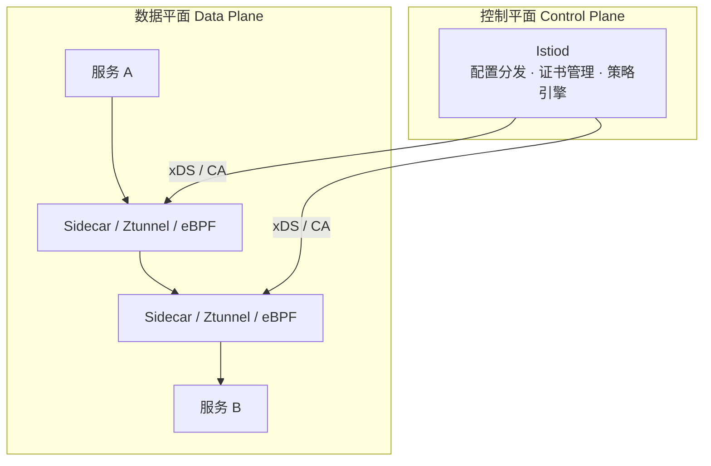
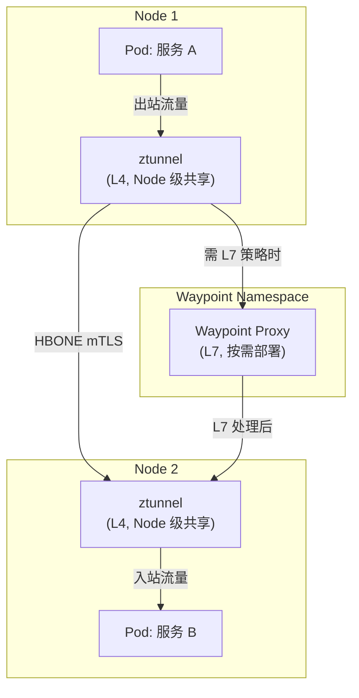
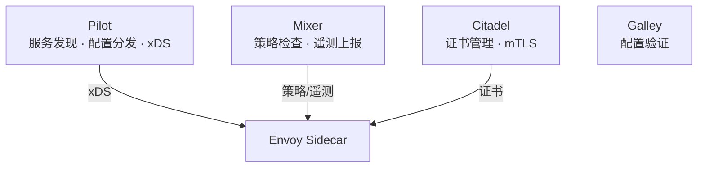
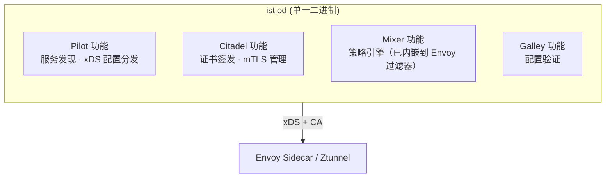
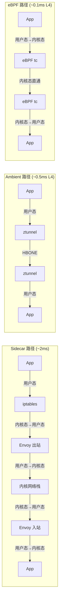
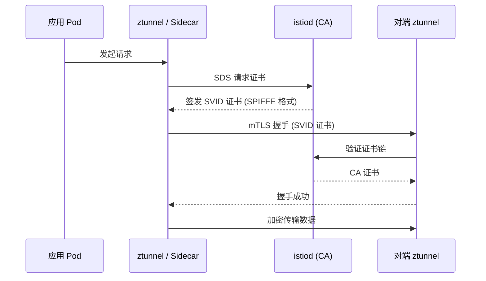
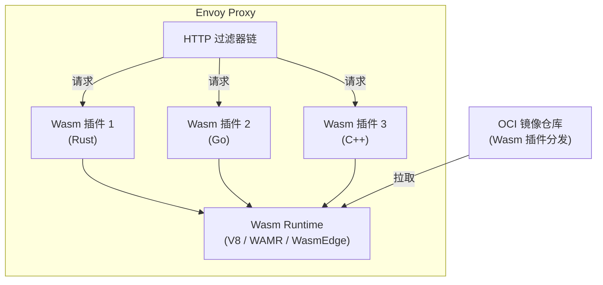
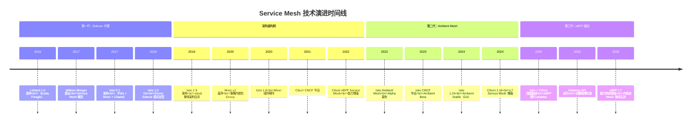
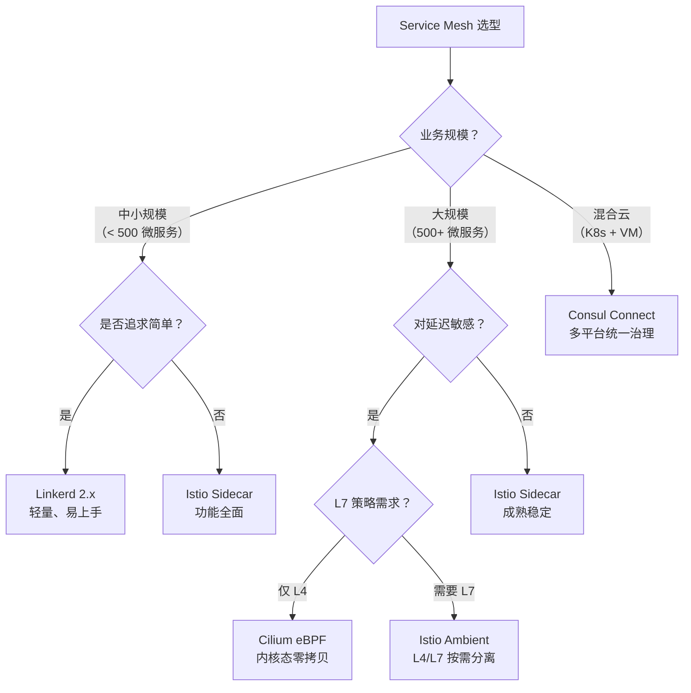

# 下一代微服务架构Service Mesh：从Sidecar到Ambient再到eBPF

今天我们进入专栏最后一个模块，聊聊下一代微服务架构 Service Mesh。自 2017 年 William Morgan 首次提出 Service Mesh 概念至今，这项技术已经历了 Sidecar 代理、Ambient Mesh（无 Sidecar 模式）、eBPF 数据平面三代架构演进。本文将以 Istio 1.22+、Cilium 1.16+、eBPF 为版本基线，带你深入理解 Service Mesh 的核心原理、架构演进与选型决策。

## 一、概述：为什么需要 Service Mesh

Service Mesh 的概念最早由 Buoyant 公司 CEO William Morgan 在 2017 年的一篇 [文章](https://blog.buoyant.io/2017/04/25/whats-a-service-mesh-and-why-do-i-need-one/) 中提出：

> A service mesh is a dedicated infrastructure layer for handling service-to-service communication. It's responsible for the reliable delivery of requests through the complex topology of services that comprise a modern, cloud native application. In practice, the service mesh is typically implemented as an array of lightweight network proxies that are deployed alongside application code, without the application needing to be aware.

简言之，Service Mesh 是一个专门处理服务间通信的基础设施层，以对业务无侵入的方式实现服务治理。它的诞生源于两大驱动力：

1. **跨语言服务调用的需要**。企业内部往往存在多语言技术栈——以微博为例，移动服务端用 PHP，API 平台用 Java。传统服务框架（Dubbo、Spring Cloud）与语言强绑定；gRPC、Thrift 虽然跨语言，但需为每种语言实现 SDK，开发成本极高。Service Mesh 将服务治理能力下沉到基础设施层，彻底解耦了语言依赖。

2. **云原生应用服务治理的需要**。微服务容器化 + Kubernetes 编排已成主流，而传统服务治理要求在业务代码中集成 SDK，这与云原生"应用与基础设施分离"的理念相悖。Service Mesh 以代理方式拦截所有流量，实现了真正的无侵入治理。

```text
传统微服务架构：
┌──────────────────────────┐     ┌──────────────────────────┐
│      服务消费者           │     │      服务提供者           │
│  ┌─────────┐ ┌────────┐ │     │  ┌────────┐ ┌─────────┐ │
│  │业务逻辑  │ │SDK集成  │ │────▶│  │SDK集成  │ │业务逻辑  │ │
│  └─────────┘ └────────┘ │     │  └────────┘ └─────────┘ │
└──────────────────────────┘     └──────────────────────────┘

Service Mesh 架构：
┌───────────────────┐     ┌───────────────────┐
│   服务消费者       │     │   服务提供者       │
│  ┌─────────────┐  │     │  ┌─────────────┐  │
│  │  业务逻辑    │  │     │  │  业务逻辑    │  │
│  └──────┬──────┘  │     │  └──────▲──────┘  │
│         │         │     │         │         │
│  ┌──────▼──────┐  │     │  ┌──────┴──────┐  │
│  │  Sidecar    │◀─┼─────┼─▶│  Sidecar    │  │
│  │  (代理)     │  │     │  │  (代理)     │  │
│  └─────────────┘  │     │  └─────────────┘  │
└───────────────────┘     └───────────────────┘
```

## 二、Service Mesh 核心架构

Service Mesh 架构由两大平面构成：**数据平面（Data Plane）** 和 **控制平面（Control Plane）**。这一架构模式自 Linkerd 1.0 确立以来，至今仍是所有 Service Mesh 产品的共同基础，区别在于数据平面的实现方式不断演进。



### 2.1 数据平面：流量拦截的三种模式

数据平面的核心职责是拦截并转发服务间的所有流量，同时执行负载均衡、熔断、加密等策略。流量拦截的实现方式决定了 Service Mesh 的性能、侵入性和运维复杂度。目前存在三种主流模式：

#### 模式一：Sidecar 代理（第一代，2017—）

在每个 Pod 中注入一个 Sidecar 代理容器（Istio 使用 Envoy），拦截该 Pod 的所有入站和出站流量。拦截机制基于 iptables 规则在 Pod 的网络命名空间中实现。

```text
┌────────────────── Pod ──────────────────┐
│                                          │
│  ┌────────────┐      ┌───────────────┐  │
│  │ 业务容器    │◀────▶│ Envoy Sidecar │  │
│  │ (app:9080) │      │ (port:15001)  │  │
│  └────────────┘      └───────┬───────┘  │
│                              │           │
│  iptables redirect ──────────┘           │
│  (所有出入流量 → 15001)                   │
└──────────────────────────────────────────┘
```

**iptables 拦截原理**：Pod 网络命名空间中的 iptables 规则将所有出站 TCP 流量重定向到 Envoy 监听的 15001 端口（出站），将所有入站流量重定向到 15006 端口（入站）。Envoy 根据控制平面下发的 xDS 配置决定如何转发。

**Sidecar 模式的优缺点**：

| 维度 | 优势 | 劣势 |
|------|------|------|
| 隔离性 | 每个 Pod 独立代理，故障域小 | 每个 Pod 额外消耗 ~50MB 内存 + ~0.1 vCPU |
| 安全性 | L7 策略可精确到 Pod 粒度 | 大规模集群 Sidecar 管理开销巨大 |
| 侵入性 | 业务代码无感知 | iptables redirect 有性能损耗 |
| 可观测性 | 每条流量的完整 L7 遥测 | 代理间 hop 增加延迟约 1-2ms |

#### 模式二：Ambient Mesh 无 Sidecar（第二代，Istio 1.24 GA）

Istio 在 1.24 版本（2024 年 11 月）将 Ambient Mesh 提升为 Stable 状态，标志着 Service Mesh 正式进入"无 Sidecar"时代。Ambient Mesh 将数据平面拆分为两层：

- **ztunnel（零信任隧道）**：每个 Node 运行一个共享的 ztunnel DaemonSet，负责 L4 流量转发与 mTLS 加密。ztunnel 是 Rust 实现的轻量级 L4 代理（并非基于 Envoy），运行在 Node 级别而非 Pod 级别。
- **Waypoint Proxy**：按 Namespace 或 Service Account 部署的 L7 代理，负责 L7 策略（限流、路由、Wasm 扩展等）。仅对需要 L7 策略的服务按需部署。



**HBONE 协议**：Ambient Mesh 的核心创新之一是 HBONE（HTTP-Based Overlay Network Environment）。ztunnel 之间通过 HBONE 隧道通信，底层基于 HTTP/2 CONNECT 隧道封装，在 L4 层实现 mTLS 加密，避免了传统 iptables redirect 的性能损耗。

```text
Ambient Mesh 数据路径：
客户端 Pod → Node ztunnel →── HBONE/HTTP2 ──→ Node ztunnel → 服务端 Pod
                                        │
                               (mTLS 加密隧道)
```

**Ambient vs Sidecar 对比**：

| 维度 | Sidecar 模式 | Ambient Mesh |
|------|-------------|--------------|
| 代理位置 | Pod 内（每个 Pod 一个） | Node 级 ztunnel + Namespace 级 Waypoint |
| 内存开销 | ~50MB/Pod | ~100MB/Node（ztunnel）+ ~50MB/Namespace（Waypoint） |
| L4 安全 | 需要 Sidecar 参与 | ztunnel 直接处理，零额外 hop |
| L7 策略 | 所有 Sidecar 都支持 L7 | 仅 Waypoint 处理 L7，L4 路径无 L7 开销 |
| 运维复杂度 | 每个 Pod 注入/升级 Sidecar | ztunnel DaemonSet 滚动升级，影响面小 |
| 业务侵入 | iptables redirect | 无 iptables（ztunnel 通过 Node 级流量拦截） |
| 延迟（L4） | ~1-2ms（Sidecar hop） | ~0.3-0.5ms（ztunnel 直通） |
| 延迟（L7） | ~1-2ms | ~2-3ms（需经 Waypoint） |
| 成熟度 | GA，生产验证充分 | Istio 1.24 GA，生产验证快速积累中 |

#### 模式三：eBPF 数据平面（第三代，Cilium 1.16+）

eBPF（Extended Berkeley Packet Filter）允许在 Linux 内核中安全地运行沙盒程序，无需修改内核源码或加载内核模块。Cilium 利用 eBPF 在内核态实现 Service Mesh 的数据平面，彻底绕过用户态代理。

```text
传统 Sidecar 数据路径：
App → iptables → Envoy (用户态) → iptables → 内核网络栈 → NIC
                                          ↑ 上下文切换开销

eBPF 数据路径：
App → 内核网络栈 → eBPF 程序 (内核态) → NIC
                    ↑ 零上下文切换
```

**Cilium Service Mesh 的核心能力**：

```yaml
# Cilium 1.16+ Service Mesh 配置示例
apiVersion: cilium.io/v2
kind: CiliumClusterwideNetworkPolicy
metadata:
  name: service-mesh-l7
spec:
  endpointSelector:
    matchLabels:
      app: my-service
  ingress:
    - fromEndpoints:
        - matchLabels:
            app: trusted-client
      toPorts:
        - ports:
            - port: "8080"
          rules:
            http:
              - method: GET
                path: "/api/v1/.*"
              - method: POST
                path: "/api/v1/data"
```

**eBPF 数据平面 vs Sidecar vs Ambient**：

| 维度 | Sidecar (Envoy) | Ambient (ztunnel) | eBPF (Cilium) |
|------|-----------------|-------------------|----------------|
| 运行位置 | Pod 内用户态 | Node 级用户态 | 内核态 |
| 上下文切换 | 2 次/Pod（进出各一次） | 1 次/Node | 0 次 |
| L4 延迟 | ~1-2ms | ~0.3-0.5ms | ~0.05-0.1ms |
| L7 能力 | 完整（Envoy 生态） | Waypoint 提供 | 有限（HTTP/gRPC 解析） |
| 可编程性 | Wasm / Lua | Wasm（Waypoint） | eBPF 程序 |
| 内核要求 | 无特殊要求 | 无特殊要求 | Linux Kernel 5.10+ |
| mTLS | Envoy 实现 | ztunnel + HBONE | Cilium 证书管理 |
| 生态成熟度 | 最成熟 | 快速成长中 | L4 成熟，L7 持续增强 |

### 2.2 控制平面：从三组件到 Istiod 单体

#### 历史架构：Pilot + Mixer + Citadel（Istio 1.0 - 1.4）

早期 Istio 的控制平面由三个独立组件构成：



- **Pilot**：负责服务发现和配置分发，通过 xDS 协议向 Envoy 推送路由规则、集群配置等。
- **Mixer**：负责策略检查（限流、ACL）和遥测数据上报。每个请求都需要两次 Mixer 调用（前置检查 + 后置上报），成为性能瓶颈。
- **Citadel**：负责证书签发和轮换，实现 mTLS。
- **Galley**：负责配置验证和分发。

这一架构的问题显而易见：组件间 RPC 通信增加延迟，Mixer 的每次请求策略检查成为严重性能瓶颈，多组件部署增加了运维复杂度。

#### 当前架构：Istiod 单体（Istio 1.5+，2019 年至今）

Istio 1.5 将 Pilot、Mixer、Citadel、Galley 合并为单一二进制 `istiod`，这是 Istio 架构演进中最重要的一次重构：



**关键变化**：

1. **Mixer 废弃（v1 遥测 → v2 遥测）**：原来 Mixer 的策略检查功能被内嵌为 Envoy 的 WASM 过滤器或原生过滤器，每个请求不再需要与 Mixer 通信。遥测数据由 Envoy 直接输出，性能提升 10 倍以上。Mixer 组件在 Istio 1.8 中被完全移除。

2. **进程内通信替代 RPC**：Pilot、Citadel、Galley 合并为同一进程，组件间调用从 RPC 变为函数调用，消除了网络开销。

3. **简化部署**：从 4 个 Deployment 缩减为 1 个，运维复杂度大幅降低。

```yaml
# Istio 1.22+ Istiod 部署配置示例
apiVersion: install.istio.io/v1alpha1
kind: IstioOperator
spec:
  profile: ambient          # 启用 Ambient Mesh 配置文件
  meshConfig:
    accessLogFile: /dev/stdout
    defaultConfig:
      proxyStatsMatcher:
        inclusionRegexps:
          - ".*outlier_detection.*"
  values:
    pilot:
      resources:
        requests:
          cpu: 500m
          memory: 2048Mi
    global:
      mtls:
        enabled: true       # 默认启用 mTLS
```

## 三、主流 Service Mesh 产品全景

### 3.1 Istio

Istio 是目前市场份额最大的 Service Mesh 产品，由 Google、IBM、Lyft 联合开发，2018 年发布 1.0，2023 年成为 CNCF 毕业项目。核心特性：

- **数据平面**：Envoy 代理（Sidecar 模式）或 ztunnel + Waypoint（Ambient 模式）
- **控制平面**：istiod 单体架构
- **流量管理**：VirtualService、DestinationRule、Gateway API 支持
- **安全**：自动 mTLS、AuthorizationPolicy、PeerAuthentication
- **可观测性**：集成 Prometheus、Grafana、Jaeger、Kiali
- **扩展**：Wasm 插件、EnvoyFilter

```yaml
# Istio 1.22+ Ambient 模式启用示例
# Step 1: 安装 Istio with Ambient profile
# istioctl install --set profile=ambient

# Step 2: 将 Namespace 加入 Ambient Mesh（无需注入 Sidecar）
apiVersion: v1
kind: Namespace
metadata:
  name: my-app
  labels:
    istio.io/dataplane-mode: ambient   # 关键标签：启用 Ambient 模式
---
# Step 3: L7 策略通过 Waypoint Proxy 实现
apiVersion: gateway.networking.k8s.io/v1
kind: Gateway
metadata:
  name: waypoint
  namespace: my-app
  annotations:
    istio.io/use-waypoint: "true"      # 标记为 Waypoint Gateway
spec:
  gatewayClassName: istio-waypoint     # 使用 Waypoint GatewayClass
  listeners:
    - port: 15008
      protocol: HBONE
```

### 3.2 Cilium

Cilium 是基于 eBPF 的网络、可观测性和安全方案，由 Isovalent（已被 Cisco 收购）开发，2021 年成为 CNCF 毕业项目。Cilium 的 Service Mesh 能力分为两层：

- **L4 Service Mesh**（无代理模式）：完全在 eBPF 内核态实现 L4 负载均衡、NAT、网络策略，零用户态代理开销。
- **L7 Service Mesh**：对于需要 HTTP/gRPC L7 策略的场景，Cilium 集成 Envoy 作为 per-Node 级别的共享代理，仅在需要 L7 能力时才引入。

```yaml
# Cilium 1.16+ 启用 Service Mesh 功能
# Helm values
hubble:
  enabled: true
  relay:
    enabled: true
  ui:
    enabled: true
serviceMesh:
  enabled: true           # 启用 Cilium Service Mesh
l7Proxy:
  enabled: true           # 启用 L7 代理能力
egressGateway:
  enabled: true
ingressController:
  enabled: true
  loadbalancerMode: shared
```

**Cilium 的独特优势**：

1. **内核级网络策略**：eBPF 程序挂载在内核网络栈的 tc（traffic control）层和 XDP（eXpress Data Path）层，实现最早阶段的流量拦截。
2. **身份驱动安全**：基于 Kubernetes Label 的安全身份（Cilium Identity），而非 IP 地址，与 Service Mesh 的零信任模型天然契合。
3. **透明加密**：利用 eBPF + WireGuard 或 IPsec 实现节点间透明加密，无需 Sidecar 参与。
4. **Cluster Mesh**：跨集群的服务发现与通信，eBPF 程序自动处理跨集群路由。

### 3.3 Linkerd 2.x

Linkerd 是 Service Mesh 的开山鼻祖（2016 年发布 1.0），2.x 版本使用 Rust 编写的微代理 linkerd2-proxy 替代了早期基于 Scala 的实现，主打轻量与简单：

| 维度 | Linkerd 2.x | Istio |
|------|-------------|-------|
| 代理 | linkerd2-proxy (Rust, ~20MB) | Envoy (C++, ~50MB) |
| 控制平面 | 简单 Go 微服务 | istiod 单体 |
| 配置复杂度 | 低（自动注入即可） | 高（丰富的 CRD） |
| 功能完整度 | 核心功能（mTLS、重试、路由） | 全面（流量管理、安全、可观测） |
| Ambient 模式 | 无（坚持 Sidecar） | 有 |
| eBPF 集成 | 部分探索 | 通过 Cilium 集成 |
| CNCF 状态 | 毕业项目 | 毕业项目 |
| 适用场景 | 中小规模、追求简单 | 大规模、需要精细控制 |

### 3.4 Consul Connect

HashiCorp Consul Connect 将服务发现与服务网格能力整合，核心特点是支持 Kubernetes 和非 Kubernetes 环境（VM、裸金属）：

```hcl
# Consul Connect 服务定义（非 K8s 环境）
service {
  name = "payment"
  port = 9090
  connect {
    sidecar_service {
      proxy {
        upstreams {
          destination_name = "billing"
          local_bind_port  = 9091
        }
      }
    }
  }
}
```

**Consul Connect 的差异化价值**：

- **多平台统一治理**：同一套 Service Mesh 同时管理 Kubernetes 服务和 VM/裸金属服务，这是企业混合云场景的刚需。
- **内置服务发现**：Consul 本身就是服务发现方案，Connect 在其上叠加 mTLS 和流量管理。
- **多租户 Namespace**：Consul Enterprise 支持 Namespace 隔离。
- **API Gateway 集成**：Consul API Gateway 原生集成，统一入口流量管理。

### 3.5 产品对比总览

| 特性 | Istio 1.22+ | Cilium 1.16+ | Linkerd 2.x | Consul Connect |
|------|------------|-------------|-------------|----------------|
| 数据平面 | Envoy / ztunnel | eBPF + Envoy | linkerd2-proxy | Envoy |
| Sidecar 模式 | 支持 | 可选 | 必须 | 支持 |
| Ambient 模式 | Stable | N/A（原生无 Sidecar） | 不支持 | 不支持 |
| eBPF 增强 | 通过 Cilium 集成 | 原生 | 实验性 | 不支持 |
| L4 性能 | 中 | 极高 | 中 | 中 |
| L7 能力 | 最完整 | 增长中 | 核心 | 完整 |
| Wasm 扩展 | 支持 | 支持（Envoy 层） | 不支持 | 支持 |
| 非 K8s 支持 | 有限 | 有限 | 不支持 | 完整 |
| Gateway API | GA | GA | 部分 | 部分支持 |
| 学习曲线 | 陡峭 | 中等 | 平缓 | 中等 |
| 社区活跃度 | 最高 | 高 | 中 | 中 |

## 四、数据平面技术深度解析

### 4.1 iptables 流量拦截（Sidecar 模式）

iptables 是 Sidecar 模式最经典的流量拦截方式。以 Istio 为例，Sidecar 注入时会为 Pod 的网络命名空间设置如下规则：

```bash
# Istio Sidecar 注入后的 iptables 规则（简化版）
# 出站流量：所有非本地流量重定向到 Envoy 出站端口
-A ISTIO_REDIRECT -p tcp -j REDIRECT --to-ports 15001

# 入站流量：所有非本地流量重定向到 Envoy 入站端口
-A ISTIO_IN_REDIRECT -p tcp -j REDIRECT --to-ports 15006

# 排除 Istio 自身流量和 localhost
-A ISTIO_OUTPUT -o lo -j RETURN
-A ISTIO_OUTPUT -m owner --uid-owner 1337 -j RETURN  # istio-proxy 用户
```

**iptables 拦截的性能问题**：每次数据包都需要遍历 iptables 规则链，在大规模集群（数千 Pod）中，规则链长度可达数百条，单次匹配开销显著。这也是 Ambient Mesh 和 eBPF 方案要解决的核心问题。

### 4.2 HBONE 隧道（Ambient 模式）

Ambient Mesh 用 HBONE 隧道替代了 iptables 拦截。ztunnel 运行在 Node 级别，通过 Node 的 cgroup 和网络命名空间感知本 Node 上所有 Pod 的流量：

```text
Ambient Mesh 流量路径详解：

1. 客户端 Pod 发出请求（目标: service-b:9080）
2. Node 级 ztunnel 通过 cgroup 感知到出站流量
3. ztunnel 查询 istiod 获取 service-b 的端点信息
4. ztunnel 与目标 Node 的 ztunnel 建立 HBONE 隧道
5. HBONE 隧道内封装原始请求，并附加 mTLS 证书
6. 目标 Node 的 ztunnel 解密验证后，将请求转发给服务端 Pod
7. 若需 L7 策略，ztunnel 先将流量路由到 Waypoint Proxy
```

**ztunnel 的技术实现**：ztunnel 是用 Rust 编写的独立 L4 代理（非 Envoy），仅包含 TCP 代理、mTLS 终止、连接池等 L4 功能，去除了 L7 过滤器链，资源占用约为完整 Envoy 的 1/3。

### 4.3 eBPF 内核态数据平面

eBPF 程序挂载在内核网络栈的关键路径上，在数据包到达用户态之前就完成处理：

```text
eBPF 挂载点与数据路径：

NIC 收包
  │
  ▼
XDP (eXpress Data Path)     ← 最早拦截点，DDoS 防护、LB
  │
  ▼
tc ingress (traffic control) ← 网络策略、路由决策
  │
  ▼
Netfilter / iptables         ← 传统规则处理
  │
  ▼
Socket Filter                ← 进程级流量拦截
  │
  ▼
用户态应用 (App / Envoy)     ← 传统 Service Mesh 工作层
```

Cilium 的 eBPF Service Mesh 主要在 tc 层和 XDP 层工作：

```c
// eBPF 程序示例：tc 层 L4 负载均衡（简化）
SEC("tc")
int cil_service_mesh(struct __sk_buff *skb) {
    struct iphdr *ip = get_iphdr(skb);
    struct tcphdr *tcp = get_tcphdr(skb);

    // 查找 Service 后端
    struct lb4_key key = {
        .address = ip->daddr,
        .dport = tcp->dest,
    };
    struct lb4_service *svc = lb4_lookup(&key);
    if (!svc) return TC_ACT_OK;

    // DNAT 到后端 Pod IP
    struct lb4_backend *backend = select_backend(svc);
    ip->daddr = backend->address;
    tcp->dest = backend->port;

    // 更新连接追踪表
    ct_update(skb, CT_SERVICE, backend);
    return TC_ACT_OK;
}
```

**eBPF 数据平面的限制**：

1. **L7 能力有限**：eBPF 程序不能任意膨胀（内核验证器限制指令数），复杂的 HTTP 解析仍需用户态 Envoy 辅助。
2. **内核版本依赖**：不同 eBPF 功能需要不同内核版本（BPF CO-RE 部分缓解了此问题）。
3. **调试困难**：eBPF 程序运行在内核态，排查问题比用户态代理更困难。
4. **可编程性受限**：eBPF 验证器对循环、指针操作有严格限制，无法实现 Envoy 级别的复杂逻辑。

### 4.4 三种数据平面路径的延迟对比



## 五、控制平面深度解析

### 5.1 xDS 协议

xDS 是 Envoy 的动态配置 API 协议族，也是 Service Mesh 控制平面与数据平面之间的标准通信协议：

| 协议 | 全称 | 功能 |
|------|------|------|
| LDS | Listener Discovery Service | 监听器配置（入站/出站端口） |
| RDS | Route Discovery Service | 路由规则（VirtualService 映射） |
| CDS | Cluster Discovery Service | 集群配置（服务发现端点） |
| EDS | Endpoint Discovery Service | 端点发现（Pod IP + Port） |
| SDS | Secret Discovery Service | 证书与密钥分发 |
| ECDS | Extension Config Discovery Service | Wasm 插件等扩展配置 |

Istiod 通过 gRPC 流式推送 xDS 配置到数据平面代理，实现了配置的秒级生效。

### 5.2 证书管理与零信任



Istio 的证书管理基于 SPIFFE（Secure Production Identity Framework for Everyone）规范，每个工作负载获得一个 SPIFFE Verifiable Identity Document（SVID），格式为 `spiffe://cluster.local/ns/<namespace>/sa/<service-account>`。证书生命周期默认 24 小时，通过 SDS 协议自动轮换。

### 5.3 策略执行架构演进

```text
Istio 1.0-1.4 (Mixer 架构)：
  请求 → Sidecar → Mixer (策略检查) → Sidecar → 服务
                  ↑ 每次请求两次 RPC，严重性能瓶颈

Istio 1.5-1.7 (Mixer v2 过渡)：
  请求 → Sidecar (内置策略过滤器) → 服务
         ↑ 策略内嵌，遥测仍走 Mixer

Istio 1.8+ (无 Mixer 架构)：
  请求 → Sidecar/ztunnel (TELEMETRY 过滤器 + 策略过滤器) → 服务
         ↑ 完全内嵌，零额外 RPC

Istio 1.24+ (Ambient 架构)：
  请求 → ztunnel (L4 mTLS) → [Waypoint (L7 策略)] → 服务
         ↑ L4/L7 分离，按需启用 L7
```

## 六、Wasm 扩展：Service Mesh 的可编程未来

WebAssembly（Wasm）为 Service Mesh 提供了沙盒化的可编程扩展能力，允许用户以安全隔离的方式在 Envoy 中运行自定义逻辑。

### 6.1 Wasm 在 Service Mesh 中的工作方式



### 6.2 Wasm 插件开发示例

```rust
// Rust 编写的 Envoy Wasm 插件示例（Istio 1.22+ 兼容）
use proxy_wasm::traits::*;
use proxy_wasm::types::*;

struct RequestLogger;

impl Context for RequestLogger {}

impl HttpContext for RequestLogger {
    fn on_http_request_headers(&mut self, _num_headers: usize, _end_of_stream: bool) -> Action {
        if let Some(path) = self.get_http_request_header(":path") {
            if let Some(method) = self.get_http_request_header(":method") {
                self.log(
                    LogLevel::Info,
                    &format!("request: {} {}", method, path),
                );
            }
        }
        Action::Continue
    }
}

#[no_mangle]
pub fn _start() {
    proxy_wasm::set_log_level(LogLevel::Trace);
    proxy_wasm::set_http_context(|_, _| -> Box<dyn HttpContext> {
        Box::new(RequestLogger)
    });
}
```

```yaml
# Wasm 插件部署配置（Istio 1.22+ OCI 镜像方式）
apiVersion: extensions.istio.io/v1alpha1
kind: WasmPlugin
metadata:
  name: request-logger
  namespace: istio-system
spec:
  selector:
    matchLabels:
      istio: ingressgateway
  url: oci://ghcr.io/myorg/wasm-plugins/request-logger:v1.0.0
  pluginConfig:
    log_level: info
    metrics_enabled: true
  phase: STATS          # 在过滤器链中的执行阶段
  priority: 100
```

### 6.3 Wasm 扩展的典型场景

| 场景 | 说明 | 示例 |
|------|------|------|
| 自定义认证 | 对接企业内部认证系统 | OIDC 增强验证、Token 转换 |
| 协议转换 | 遗留协议适配 | HTTP ↔ Dubbo 协议桥接 |
| 数据脱敏 | 响应数据中敏感字段过滤 | 日志中的 PII 脱敏 |
| 自定义指标 | 业务维度的可观测性 | 按租户/特征的流量统计 |
| 流量标记 | 请求染色与标签注入 | 全链路灰度标记传播 |

## 七、技术演进时间线



## 八、架构决策指南

选择 Service Mesh 方案时，需要根据业务规模、技术栈、团队能力综合决策。

### 8.1 按场景选型



### 8.2 迁移路径建议

| 当前状态 | 推荐目标 | 迁移策略 |
|----------|---------|---------|
| 无 Service Mesh | Istio Sidecar | 逐步 Namespace 注入，先非核心业务 |
| Istio Sidecar | Istio Ambient | 去除 Sidecar 注入，添加 Ambient 标签，ztunnel 自动接管 L4 |
| Istio Ambient | Istio + Cilium eBPF | 安装 Cilium，替换 kube-proxy，eBPF 增强 L4 性能 |
| 自研 SDK | Istio Sidecar | 逐步替换 SDK 功能为 Sidecar 策略，双跑过渡 |
| 混合云（K8s + VM） | Consul Connect | 统一 Consul 服务发现，Connect 叠加 mTLS |

### 8.3 关键决策因素

| 决策因素 | 倾向 Sidecar | 倾向 Ambient | 倾向 eBPF |
|----------|-------------|-------------|-----------|
| L7 策略复杂度 | 高（需要完整 Envoy 生态） | 中（Waypoint 提供核心 L7） | 低（仅需 HTTP 路由） |
| 延迟敏感度 | 不敏感 | 中等 | 极度敏感 |
| 运维团队能力 | 强（需管理 Sidecar 生命周期） | 中（ztunnel DaemonSet 管理） | 强（需理解 eBPF 排障） |
| 内核版本 | 无要求 | 无要求 | 5.10+（推荐 5.15+） |
| 已有 Istio 投资 | 重度 | 可平滑迁移 | 可叠加增强 |
| 合规要求 | Pod 级隔离 | Node 级共享需评估 | 内核级需评估 |

## 九、小结

Service Mesh 从 2017 年诞生至今，经历了三代架构演进：

1. **第一代：Sidecar 代理模式**（2017—）——以 Envoy 为代表，每个 Pod 注入 Sidecar 代理，通过 iptables 拦截流量。成熟稳定、L7 能力最完整，但资源开销大、运维复杂。

2. **第二代：Ambient Mesh 无 Sidecar 模式**（Istio 1.24 GA）——将数据平面拆分为 Node 级 ztunnel（L4 mTLS）和 Namespace 级 Waypoint Proxy（L7 策略），实现 L4/L7 按需分离，大幅降低资源开销和运维复杂度。

3. **第三代：eBPF 数据平面**（Cilium 1.16+）——将流量处理下沉到 Linux 内核，零上下文切换，L4 性能极致，但 L7 能力仍在持续增强中。

控制平面方面，Istio 从早期的 Pilot + Mixer + Citadel 三组件架构演进为 istiod 单体架构，消除了组件间 RPC 开销和 Mixer 性能瓶颈。Mixer 的策略检查功能被内嵌到 Envoy 过滤器中，遥测从每次请求 RPC 调用变更为本地输出，性能提升 10 倍以上。

Wasm 扩展为 Service Mesh 提供了沙盒化的可编程能力，OCI 镜像分发方式使插件管理更加标准化。

**选型建议**：中小规模追求简单选 Linkerd；大规模需要精细控制选 Istio Sidecar 或 Ambient；延迟极度敏感选 Cilium eBPF；混合云环境选 Consul Connect。Istio + Cilium 的组合正在成为下一代 Service Mesh 的主流方向——Istio 提供控制平面和 L7 能力，Cilium eBPF 提供高性能 L4 数据平面，两者互补形成完整方案。

Service Mesh 的演进方向清晰：**控制平面标准化**（Gateway API 统一流量管理）、**数据平面内核化**（eBPF 替代 iptables 和部分用户态代理）、**治理能力平台化**（Service Mesh 成为云原生基础设施的标配能力而非可选组件）。这一演进与云原生"应用与基础设施解耦"的核心理念高度一致，Service Mesh 正从"下一代微服务架构"变为"当前一代基础设施"。

## 思考题

1. Ambient Mesh 中 ztunnel 以 Node 级共享代理模式运行，多个 Pod 的流量经过同一个 ztunnel，这在安全隔离上与 Sidecar 模式有何差异？在什么场景下这种差异会成为问题？
2. eBPF 数据平面在 L7 层的能力目前仍然有限，你认为 eBPF 未来能否完全替代用户态代理实现完整的 L7 Service Mesh？为什么？
3. 如果你的组织已有大规模 Istio Sidecar 部署，从 Sidecar 迁移到 Ambient 的过程中，哪些流量策略可能需要调整？如何制定渐进式迁移计划？


