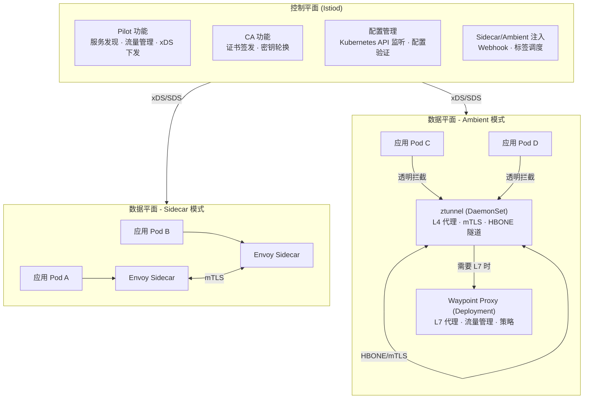
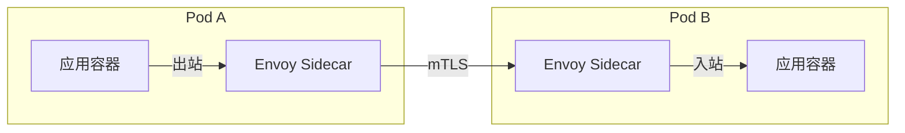
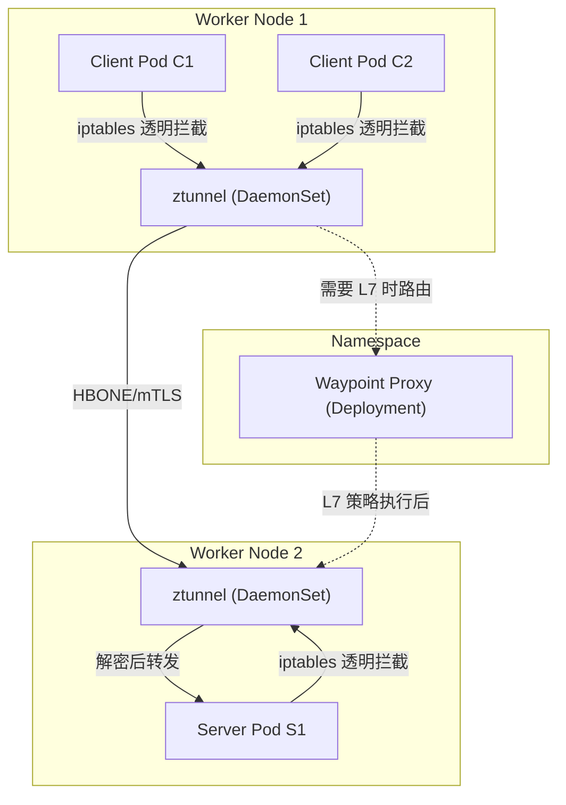
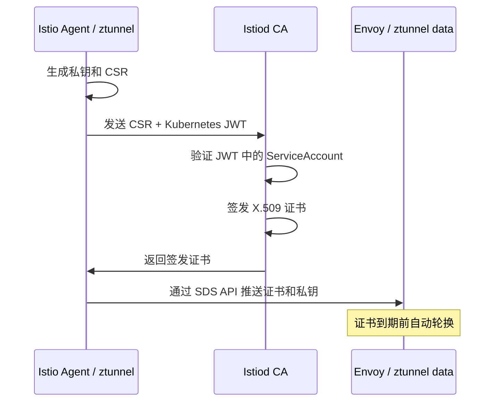
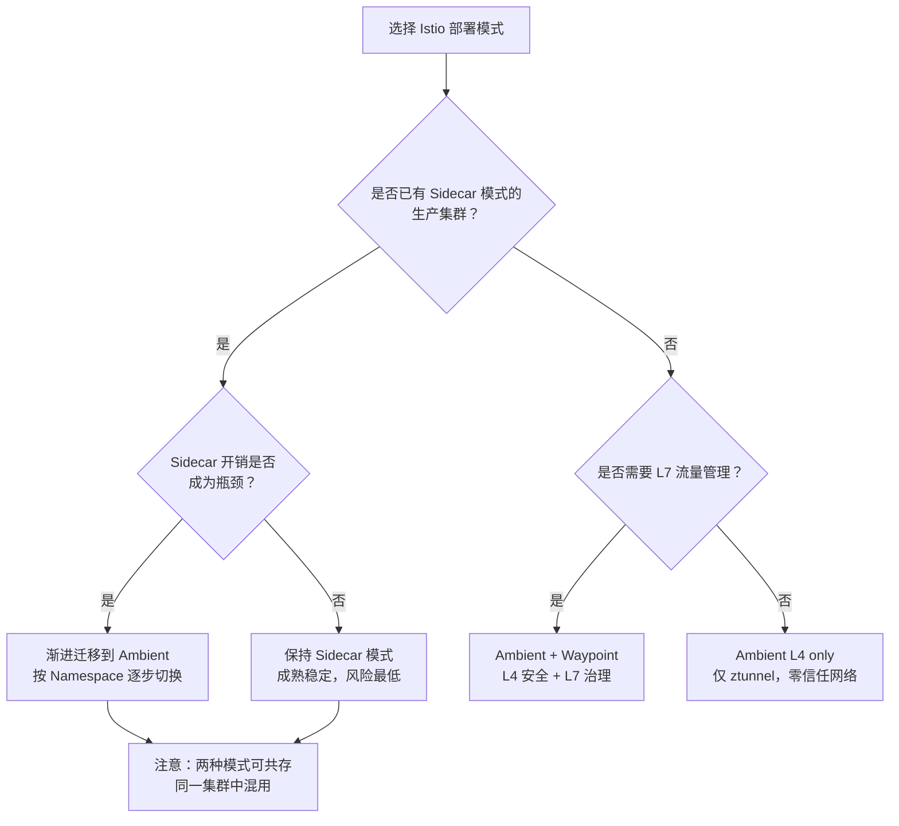

# Istio：Service Mesh的代表产品

专栏上一期我们聊了 Service Mesh，并以 Linkerd 为例介绍了 Service Mesh 的架构。随着技术发展，现在来看 Linkerd 可以说是第一代 Service Mesh 产品。到了今天当我们再谈到 Service Mesh 时，往往第一个想到的是 [Istio](https://istio.io/)。为什么 Istio 可以称得上是 Service Mesh 的代表产品？在我看来主要有以下几个原因：

- **架构持续进化**：从早期的 Pilot + Mixer + Citadel 三组件分离架构，演进到 Istiod 单体控制平面，再到 Ambient Mesh 无 Sidecar 模式，Istio 始终引领 Service Mesh 的技术方向。每一次架构变革都直击生产环境的真实痛点——部署复杂度、Sidecar 资源开销、升级侵入性。

- **数据平面双模式**：Istio 1.22+ 同时支持传统 Sidecar 模式和 Ambient Mesh 模式，前者以 Envoy Sidecar 代理每个 Pod 的流量，后者以节点级 ztunnel + 可选 Waypoint Proxy 实现分层治理。两种模式可在同一集群中无缝互通，用户可按需选择、渐进迁移。

- **拥抱 Kubernetes 生态标准**：Istio 正在从自有的 `VirtualService` + `DestinationRule` API 向 [Kubernetes Gateway API](https://gateway-api.sigs.k8s.io/) 迁移，后者已成为 Kubernetes 社区公认的流量管理标准。Istio 计划将 Gateway API 作为默认的流量管理 API，这标志着 Service Mesh 与 Kubernetes 的深度融合。

- **云原生巨头背书**：Google、IBM 和 Lyft 联合发起，与 Kubernetes 深度整合，CNCF 毕业项目，生态成熟度高。

前置知识：[[33]] 下一代微服务架构 Service Mesh。现在我们一起走进 Istio 的最新架构，看看它各部分的实现原理，希望能让你有所收获。

## Istio 整体架构

Istio 的架构逻辑上分为**数据平面**（Data Plane）和**控制平面**（Control Plane）。但在 2024-2025 年的技术语境下，这两个平面的形态已经与早期版本截然不同。

### 架构演进：从三组件到 Istiod

原文中描述的 Pilot + Mixer + Citadel 三组件架构已在 Istio 1.5（2020 年）被合并为单一二进制 `istiod`，Mixer 组件在 Istio 1.8 被完全移除。这一演进的核心逻辑是：

| 维度 | 旧架构（Pilot + Mixer + Citadel） | 新架构（Istiod） |
|------|-----------------------------------|-----------------|
| 组件数量 | 3 个独立二进制 + 适配器 | 1 个单体二进制 |
| 部署复杂度 | 高，需协调多组件版本 | 低，单一 Deployment |
| Mixer 请求路径 | 每次调用都经过 Proxy → Mixer → 后端 | 策略下沉到 Envoy，遥测通过 Telemetry API |
| 性能瓶颈 | Mixer 是单点，高频调用延迟显著 | 无 Mixer，策略直接在 Envoy 执行 |
| 证书管理 | Citadel 独立进程 | Istiod 内嵌 CA |
| 配置分发 | Galley 独立处理 | Istiod 统一处理 |

### 当前架构全景



下面我详细分解 Istio 架构中每个核心组件的作用和工作原理。

## Istiod：统一控制平面

Istiod 是 Istio 的控制平面核心，它将早期 Pilot、Galley、Citadel 和 Sidecar Injector 的功能合并为单一进程。这一合并并非简单的代码搬运，而是对架构的重新审视：

### 为什么合并成 Istiod？

1. **Mixer 的性能瓶颈**：原文中提到的 Mixer 架构——每次 Proxy 转发都调用 Mixer——在生产环境中暴露了严重的性能问题。即使有两级缓存，Mixer 仍然是延迟热点和可用性单点。Istio 1.5 开始将策略检查下沉到 Envoy 过滤器中，遥测则通过 Telemetry API 直接在 Envoy 端生成，彻底消除了 Mixer 的运行时依赖。

2. **部署与运维复杂度**：三组件意味着三套版本协调、三套健康检查、三套故障排查路径。合并为 Istiod 后，一个 `istiod` Deployment 即可运行整个控制平面。

3. **配置一致性**：Galley 原本负责配置验证和分发，但其与 Pilot 的职责边界模糊导致配置同步问题。合并后，Istiod 直接通过 Kubernetes API Server 的 Informer 机制监听配置变化，路径更短、更可靠。

### Istiod 核心功能

**服务发现与流量管理（原 Pilot）**：Istiod 连接 Kubernetes API Server，监听 Service、Endpoint、Pod 等资源变化，将其转换为 Envoy 可消费的 xDS 配置（CDS/RDS/EDS/LDS/SDS），通过 gRPC 流式推送给数据平面的 Envoy 代理。

**证书管理（原 Citadel）**：Istiod 内嵌 CA，通过 SDS（Secret Discovery Service）向 Envoy 推送工作负载证书。每个工作负载的证书由 Istio Agent（运行在 Sidecar 或 ztunnel 中）发起 CSR 请求，Istiod CA 签发，并自动处理证书轮换。

**配置注入**：Istiod 运行 Mutating Admission Webhook，根据 Namespace 或 Pod 标签自动注入 Sidecar 容器或注册到 Ambient 数据平面。

## 数据平面：Sidecar 模式 vs Ambient 模式

Istio 1.22+ 提供两种数据平面模式，这是近年最重大的架构演进。

### Sidecar 模式（传统）

Sidecar 模式是 Istio 自诞生以来的默认模式。每个应用 Pod 被注入一个 Envoy Sidecar 容器，拦截该 Pod 的所有入站和出站流量。



**优势**：流量隔离粒度细，每个 Pod 有独立代理，故障爆炸半径小。

**痛点**：
- 每个 Pod 额外消耗约 50-100MB 内存和 50-100m CPU
- Sidecar 升级需要重启所有业务 Pod，侵入性高
- 大规模集群中 Sidecar 管理开销显著（如 1000 个 Pod = 1000 个 Envoy 实例）

### Ambient 模式（Sidecar-less）

Ambient Mesh 在 Istio 1.18 引入 Alpha，1.24 起正式 GA，是 Istio 面向未来的核心方向。它的核心理念是**分层治理**：将 Service Mesh 的功能拆分为 L4 安全覆盖层和 L7 流量管理层，分别由不同组件承载。



#### ztunnel：节点级 L4 代理

ztunnel（Zero Trust Tunnel）是 Ambient 模式的基础组件，以 DaemonSet 形式运行在每个 Worker Node 上，负责：

- **L4 流量代理**：通过 iptables 规则透明拦截节点上所有标记为 Ambient 模式的 Pod 流量
- **mTLS 加密**：使用 HBONE 协议建立加密隧道，确保节点间流量零信任
- **L4 授权策略**：基于 TCP 连接的源/目标身份执行 AuthorizationPolicy
- **身份管理**：为节点上每个 Pod 管理独立的 X.509 证书，确保身份隔离

ztunnel 使用 Rust 编写，资源消耗极低（约 10-20MB 内存），不解析 HTTP 头部，不终止应用流量——它只做 L4 层的加密隧道和策略执行。

#### HBONE：安全隧道协议

HBONE（HTTP-Based Overlay Network Environment）是 Istio Ambient 模式的核心传输协议，它组合了三个开放标准：

| 协议层 | 作用 | 说明 |
|--------|------|------|
| HTTP/2 | 多路复用 | 在单一加密连接上复用多个应用连接流 |
| HTTP CONNECT | 隧道建立 | 透明代理 TCP 连接，无需修改应用流量 |
| mTLS | 加密与认证 | 双向 TLS 确保通信双方身份和加密 |

HBONE 的关键特性：原始应用流量完全透传，无需添加 Istio 特有的 HTTP 头部。元数据通过 HTTP/2 帧传递，不侵入应用层。默认监听端口 15008。

#### Waypoint Proxy：命名空间级 L7 代理

Waypoint Proxy 是基于 Envoy 的 L7 代理，以 Deployment 形式运行在每个需要 L7 功能的 Namespace 中。它独立于应用 Pod 部署、升级和扩缩容，解决了 Sidecar 模式下代理升级必须重启业务 Pod 的痛点。

Waypoint Proxy 按需启用：如果只需要 mTLS 加密和 L4 策略，则无需部署 Waypoint；如果需要 L7 流量管理（如 VirtualService 路由、L7 AuthorizationPolicy、可观测性），则为对应 Namespace 启用 Waypoint。

| 功能需求 | 所需组件 | 说明 |
|----------|----------|------|
| mTLS 加密 | ztunnel only | 默认状态，零配置获得加密通信 |
| L4 授权策略 | ztunnel only | 基于 TCP 层的身份和端口策略 |
| L4 遥测 | ztunnel only | TCP 连接指标 |
| L7 路由（A/B 测试、金丝雀发布） | ztunnel + Waypoint | 需要 VirtualService/HTTPRoute |
| L7 授权策略（HTTP 方法、路径） | ztunnel + Waypoint | 基于 HTTP 请求的细粒度策略 |
| L7 遥测（请求延迟、HTTP 状态码） | ztunnel + Waypoint | HTTP 级别指标和追踪 |

#### 启用 Ambient 模式

```yaml
# Istio 1.22+ | Ambient 模式启用示例
# 1. 安装 Istio（启用 Ambient 模式）
# istioctl install --set profile=ambient

# 2. 为 Namespace 启用 Ambient 数据平面
apiVersion: v1
kind: Namespace
metadata:
  name: my-app
  labels:
    istio.io/dataplane-mode: ambient    # 加入 Ambient Mesh（L4）
---
# 3. 为 Namespace 启用 Waypoint Proxy（L7）
apiVersion: v1
kind: Namespace
metadata:
  name: my-app
  labels:
    istio.io/dataplane-mode: ambient
    istio.io/use-waypoint: waypoint     # 启用 Waypoint
```

### 两种模式对比

| 维度 | Sidecar 模式 | Ambient 模式 |
|------|-------------|-------------|
| 代理位置 | 每个 Pod 一个 | 节点级(ztunnel) + 命名空间级(Waypoint) |
| 内存开销/Pod | ~50-100MB (Envoy Sidecar) | ~0 (无 Sidecar 容器) |
| 节点级开销 | 无额外开销 | ztunnel ~10-20MB/节点 |
| 代理升级 | 需重启业务 Pod | 独立升级，不影响业务 |
| L4 安全 | 支持 | 支持（ztunnel） |
| L7 功能 | 完整支持 | 支持（需启用 Waypoint） |
| 故障隔离 | Pod 级别 | 节点级(ztunnel) / NS 级(Waypoint) |
| 侵入性 | 高（修改 Pod Spec） | 低（标签声明） |
| 成熟度 | GA，生产验证充分 | GA（Istio 1.24 起稳定，验证快速积累中） |
| 互通性 | - | 与 Sidecar 模式无缝互通 |

## Kubernetes Gateway API 集成

Istio 正在将 Kubernetes Gateway API 定位为其流量管理的默认 API，这是与 Kubernetes 生态深度融合的关键一步。

### Gateway API vs Istio API

| 维度 | Istio API（VirtualService + DestinationRule） | Kubernetes Gateway API |
|------|-----------------------------------------------|----------------------|
| 标准化 | Istio 专属 | Kubernetes 社区标准 |
| 角色划分 | 单一配置者 | 基于角色：基础设施/集群运维/应用开发者 |
| Gateway 管理 | 先部署 Gateway Deployment，再配置 | Gateway 资源同时配置和部署 |
| 路由模型 | 单一 VirtualService 混合所有协议 | 每种协议独立资源（HTTPRoute、TCPRoute、GRPCRoute） |
| 跨实现兼容 | 仅 Istio | 可迁移到其他实现（如 Contour、Traefik） |
| 功能覆盖 | 100% Istio 功能 | 覆盖核心场景，部分高级功能通过 Extension Policy 扩展 |

### Gateway API 配置示例

```yaml
# Istio 1.22+ | Kubernetes Gateway API 配置示例
# 1. 定义 Gateway（替代 Istio Gateway + Deployment）
apiVersion: gateway.networking.k8s.io/v1
kind: Gateway
metadata:
  name: my-gateway
  namespace: istio-ingress
spec:
  gatewayClassName: istio              # 指定 Istio 为实现
  listeners:
  - name: http
    hostname: "*.example.com"
    port: 80
    protocol: HTTP
    allowedRoutes:
      namespaces:
        from: All
---
# 2. 定义 HTTPRoute（替代 VirtualService）
apiVersion: gateway.networking.k8s.io/v1
kind: HTTPRoute
metadata:
  name: httpbin-route
  namespace: default
spec:
  parentRefs:
  - name: my-gateway
    namespace: istio-ingress
  hostnames: ["httpbin.example.com"]
  rules:
  - matches:
    - path:
        type: PathPrefix
        value: /get
    backendRefs:
    - name: httpbin
      port: 8000
```

### 自动化部署模式

Gateway API 的一个重要特性是：创建 `Gateway` 资源时，Istio 会自动创建对应的 Deployment 和 Service，无需手动部署 Ingress Gateway。这简化了运维流程，实现了"配置即部署"。

## Istio 安全体系

Istio 的安全架构围绕**身份**（Identity）、**认证**（Authentication）和**授权**（Authorization）三个核心概念构建。

### 身份模型

Istio 使用 SPIFFE 标准定义工作负载身份，格式为 `spiffe://<trust-domain>/ns/<namespace>/sa/<service-account>`。在 Kubernetes 中，身份绑定到 ServiceAccount。

证书签发流程：



### mTLS 认证

Istio 支持三种 mTLS 模式：

| 模式 | 行为 | 适用场景 |
|------|------|---------|
| STRICT | 仅接受 mTLS 流量 | Mesh 内部通信，要求零信任 |
| PERMISSIVE | 同时接受 mTLS 和明文流量 | 迁移期间，逐步启用 mTLS |
| DISABLE | 不使用 mTLS | 调试或特殊兼容需求 |

```yaml
# Istio 1.22+ | PeerAuthentication 配置
apiVersion: security.istio.io/v1
kind: PeerAuthentication
metadata:
  name: default
  namespace: my-app
spec:
  mtls:
    mode: STRICT              # 强制 mTLS
```

### AuthorizationPolicy：统一授权策略

Mixer 时代的访问控制（原文中的 `config.istio.io/v1alpha2` Rule）已被 `AuthorizationPolicy` 完全替代。AuthorizationPolicy 是声明式的、在 Envoy/ztunnel/Waypoint 中直接执行的，无需 Mixer 中转。

```yaml
# Istio 1.22+ | AuthorizationPolicy 示例
# 场景 1：默认拒绝所有请求
apiVersion: security.istio.io/v1
kind: AuthorizationPolicy
metadata:
  name: deny-all
  namespace: my-app
spec:
  {}                              # 空 spec = deny all
---
# 场景 2：仅允许 reviews v3 访问 ratings
apiVersion: security.istio.io/v1
kind: AuthorizationPolicy
metadata:
  name: ratings-allow-reviews
  namespace: my-app
spec:
  selector:
    matchLabels:
      app: ratings
  action: ALLOW
  rules:
  - from:
    - source:
        principals: ["cluster.local/ns/my-app/sa/reviews"]
    to:
    - operation:
        methods: ["GET"]
        paths: ["/api/v1/ratings/*"]
---
# 场景 3：显式拒绝特定来源
apiVersion: security.istio.io/v1
kind: AuthorizationPolicy
metadata:
  name: deny-untrusted
  namespace: my-app
spec:
  selector:
    matchLabels:
      app: ratings
  action: DENY
  rules:
  - from:
    - source:
        notPrincipals: ["cluster.local/ns/my-app/sa/*"]  # 非 Mesh 内部流量
```

AuthorizationPolicy 的执行位置取决于数据平面模式：
- **Sidecar 模式**：在 Pod 的 Envoy Sidecar 中执行
- **Ambient L4 模式**：在 ztunnel 中执行（仅支持 L4 条件：IP、端口、身份）
- **Ambient L7 模式**：在 Waypoint Proxy 中执行（支持 HTTP 方法、路径、头等 L7 条件）

## 流量管理实战

### 请求路由：金丝雀发布

```yaml
# Istio 1.22+ | 金丝雀发布示例
# 方式一：Istio VirtualService（传统方式）
apiVersion: networking.istio.io/v1
kind: VirtualService
metadata:
  name: reviews
spec:
  hosts:
  - reviews
  http:
  - match:
    - headers:
        x-user-type:
          exact: beta-tester
    route:
    - destination:
        host: reviews
        subset: v2            # Beta 用户路由到 v2
  - route:
    - destination:
        host: reviews
        subset: v1
      weight: 90
    - destination:
        host: reviews
        subset: v2
      weight: 10             # 10% 流量金丝雀到 v2
---
# 方式二：Kubernetes Gateway API HTTPRoute
apiVersion: gateway.networking.k8s.io/v1
kind: HTTPRoute
metadata:
  name: reviews-route
spec:
  parentRefs:
  - name: my-gateway
  hostnames: ["reviews.example.com"]
  rules:
  - backendRefs:
    - name: reviews-v1
      port: 9080
      weight: 90
    - name: reviews-v2
      port: 9080
      weight: 10
```

### 超时与重试

```yaml
# Istio 1.22+ | 超时重试配置
apiVersion: networking.istio.io/v1
kind: VirtualService
metadata:
  name: ratings
spec:
  hosts:
  - ratings
  http:
  - route:
    - destination:
        host: ratings
    timeout: 10s             # 请求超时
    retries:
      attempts: 3
      perTryTimeout: 2s
      retryOn: 5xx,reset,connect-failure
```

### 故障注入

```yaml
# Istio 1.22+ | 故障注入
apiVersion: networking.istio.io/v1
kind: VirtualService
metadata:
  name: ratings
spec:
  hosts:
  - ratings
  http:
  - fault:
      delay:
        percentage:
          value: 10          # 10% 请求注入 5s 延迟
        fixedDelay: 5s
    route:
    - destination:
        host: ratings
  - fault:
      abort:
        percentage:
          value: 10          # 10% 请求注入 HTTP 400
        httpStatus: 400
    route:
    - destination:
        host: ratings
```

注意与原文的差异：百分比字段从 `percent: 10`（整数）改为 `percentage.value: 10`（浮点数，支持 0.1% 精度），这是 Istio API v1beta1 的改进。

## 技术演进时间线

| 时间 | 版本 | 里程碑 | 关键变化 |
|------|------|--------|---------|
| 2017.05 | 0.1 | 项目发布 | Pilot + Mixer + Citadel 三组件架构 |
| 2018.07 | 1.0 | 生产可用 | 稳定 API，Sidecar 注入 |
| 2020.03 | 1.5 | **Istiod 合并** | Pilot + Citadel + Galley 合并为 `istiod`；Mixer 被标记废弃 |
| 2020.11 | 1.8 | **Mixer 移除** | Mixer 完全移除，策略下沉 Envoy，遥测改用 Telemetry API |
| 2022.09 | 1.14 | Gateway API Beta | Kubernetes Gateway API 升级为 Beta |
| 2023.05 | 1.18 | **Ambient Mesh Alpha** | 引入 ztunnel + Waypoint 无 Sidecar 模式 |
| 2023.11 | 1.20 | Ambient Mesh 改进 | ztunnel 稳定性提升，支持 L4 AuthorizationPolicy |
| 2024.05 | 1.22 | Ambient 增强 | ztunnel 与 Waypoint 稳定性、可观测性提升 |
| 2024.11 | 1.24 | Ambient Stable | Ambient Mesh 趋于稳定，Sidecar 与 Ambient 无缝互通 |
| 2025 | 1.26+ | 持续演进 | Gateway API 成为默认入口 API，Ambient 模式持续优化 |

## 架构决策指南

当你在生产环境中选择 Istio 的部署模式时，可以参考以下决策树：



### 场景推荐

| 场景 | 推荐模式 | 理由 |
|------|---------|------|
| 新项目，Kubernetes 原生 | Ambient + Gateway API | 零侵入、标准化、运维成本低 |
| 已有 Sidecar 集群，运行稳定 | 保持 Sidecar | 不折腾，生产优先 |
| 已有 Sidecar 集群，资源压力大 | 渐进迁移到 Ambient | 按 Namespace 迁移，两种模式互通 |
| 仅需 mTLS 和 L4 策略 | Ambient L4 only | 最小资源开销，ztunnel 即可 |
| 需要完整 L7 治理能力 | Ambient + Waypoint 或 Sidecar | Waypoint 独立升级，Sidecar 更成熟 |
| 多集群环境 | Istiod 多集群 + Ambient | 控制平面共享，数据平面按需 |
| VM + K8s 混合 | Sidecar 模式 | VM 场景 Ambient 支持尚不完善 |

### 迁移注意事项

从 Sidecar 模式迁移到 Ambient 模式时，需特别注意：

1. **AuthorizationPolicy 兼容性**：L7 条件的策略（如 HTTP 方法、路径匹配）在纯 L4 模式下无法执行，必须启用 Waypoint
2. **流量路径变化**：Sidecar 模式下流量在 Pod 内闭环，Ambient 模式下流量经过节点级 ztunnel，排查问题时需调整思路
3. **可观测性差异**：L4 模式只有 TCP 级指标，HTTP 级指标需要 Waypoint
4. **渐进迁移**：建议先在一个非核心 Namespace 启用 Ambient L4，验证后再逐步扩展

## 小结

今天我们从 Istio 的最新架构出发，详细讲解了以下核心内容：

1. **Istiod 统一控制平面**：Pilot + Mixer + Citadel 三组件合并为 Istiod，消除了 Mixer 性能瓶颈，简化了部署和运维。策略执行下沉到 Envoy 过滤器，遥测通过 Telemetry API 在数据平面直接生成。

2. **Ambient Mesh 双层数据平面**：ztunnel（Rust 编写的节点级 L4 代理）提供 mTLS 加密和 L4 策略，Waypoint Proxy（命名空间级 L7 代理）提供完整流量管理能力。两者按需组合，解决了 Sidecar 模式的资源开销和升级侵入性痛点。

3. **Kubernetes Gateway API 集成**：Istio 正在从自有 API 向社区标准迁移，Gateway API 实现了"配置即部署"，角色划分更清晰，跨实现兼容性更强。

4. **安全体系升级**：mTLS 通过 PeerAuthentication 声明式管理，AuthorizationPolicy 替代了 Mixer 时代的策略控制，在 Envoy/ztunnel/Waypoint 中直接执行，无需 Mixer 中转。

Istio 的演进路径清晰地反映了一个设计哲学：**从复杂到简约，从侵入到透明**。Sidecar 模式证明了 Service Mesh 的价值，Ambient 模式则让这种价值以更低的成本被采纳。对于正在规划 Service Mesh 落地的团队，建议以 Istio 1.24+ 的 Ambient 模式 + Gateway API 作为技术基线，从 L4 安全覆盖开始，按需启用 L7 治理，逐步构建完整的零信任微服务网络。

## 思考题

原文的思考题关于 Mixer 日志收集的性能优化，Mixer 已被移除，这个问题在今天有了全新的答案。请思考：

在 Ambient Mesh 模式下，ztunnel 以节点级 DaemonSet 运行，为节点上所有 Pod 代理流量。如果某个节点上运行了高并发服务，ztunnel 可能成为瓶颈。你将如何评估和缓解这种节点级代理的瓶颈风险？与 Sidecar 模式下每个 Pod 独立代理的架构相比，两者在资源竞争和故障爆炸半径上有何权衡？


---

扩展阅读：

- Istio 架构文档：[https://istio.io/latest/docs/ops/deployment/architecture/](https://istio.io/latest/docs/ops/deployment/architecture/)
- Ambient Mesh 概览：[https://istio.io/latest/docs/ambient/overview/](https://istio.io/latest/docs/ambient/overview/)
- Ambient 数据平面架构：[https://istio.io/latest/docs/ambient/architecture/data-plane/](https://istio.io/latest/docs/ambient/architecture/data-plane/)
- HBONE 协议：[https://istio.io/latest/docs/ambient/architecture/hbone/](https://istio.io/latest/docs/ambient/architecture/hbone/)
- Kubernetes Gateway API：[https://istio.io/latest/docs/tasks/traffic-management/ingress/gateway-api/](https://istio.io/latest/docs/tasks/traffic-management/ingress/gateway-api/)
- Istio 安全概念：[https://istio.io/latest/docs/concepts/security/](https://istio.io/latest/docs/concepts/security/)
- AuthorizationPolicy 参考：[https://istio.io/latest/docs/reference/config/security/authorization-policy/](https://istio.io/latest/docs/reference/config/security/authorization-policy/)
- Gateway API 规范：[https://gateway-api.sigs.k8s.io/](https://gateway-api.sigs.k8s.io/)
