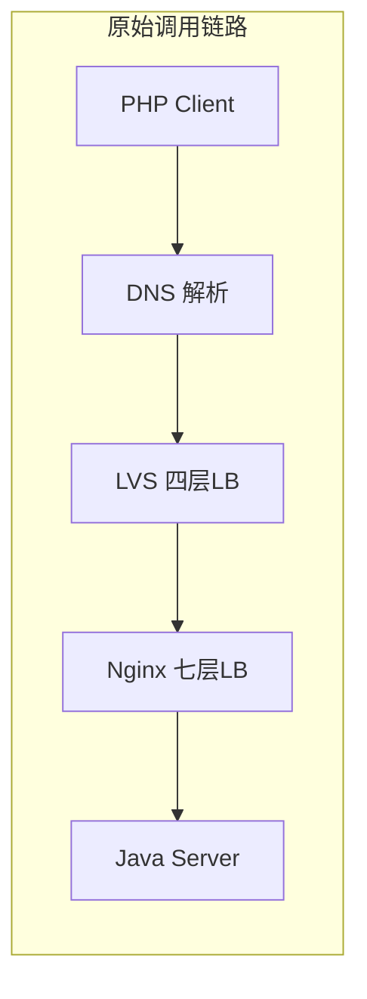
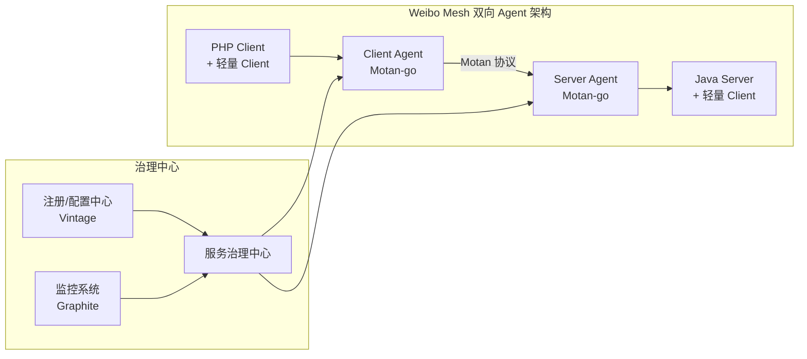
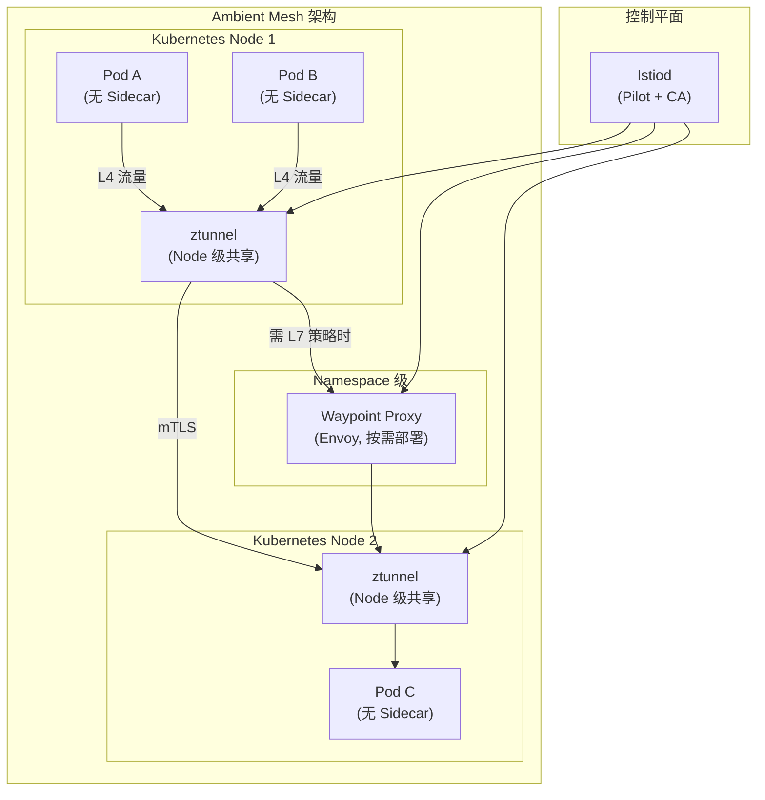
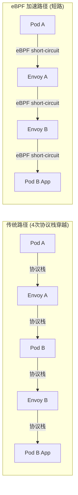
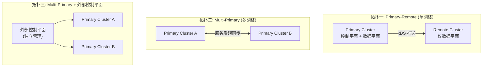
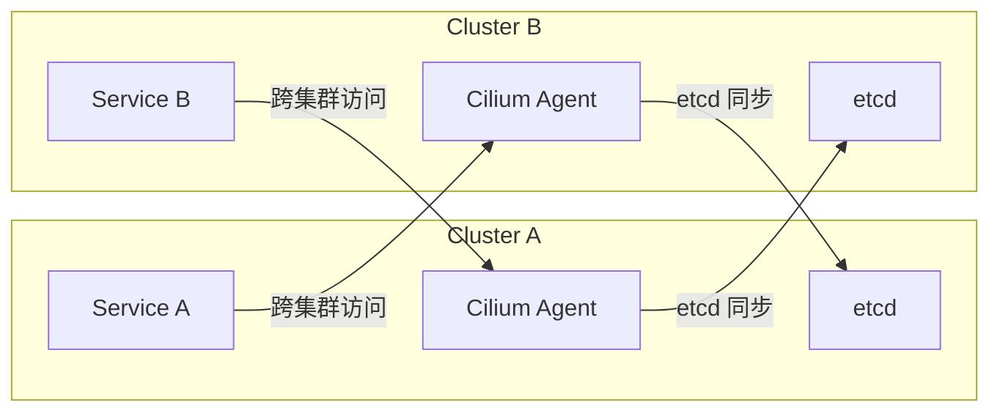
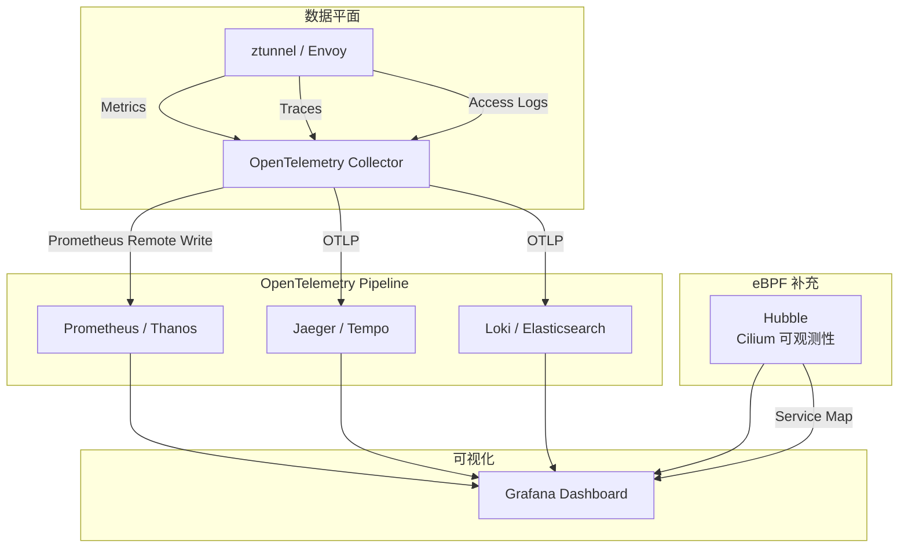
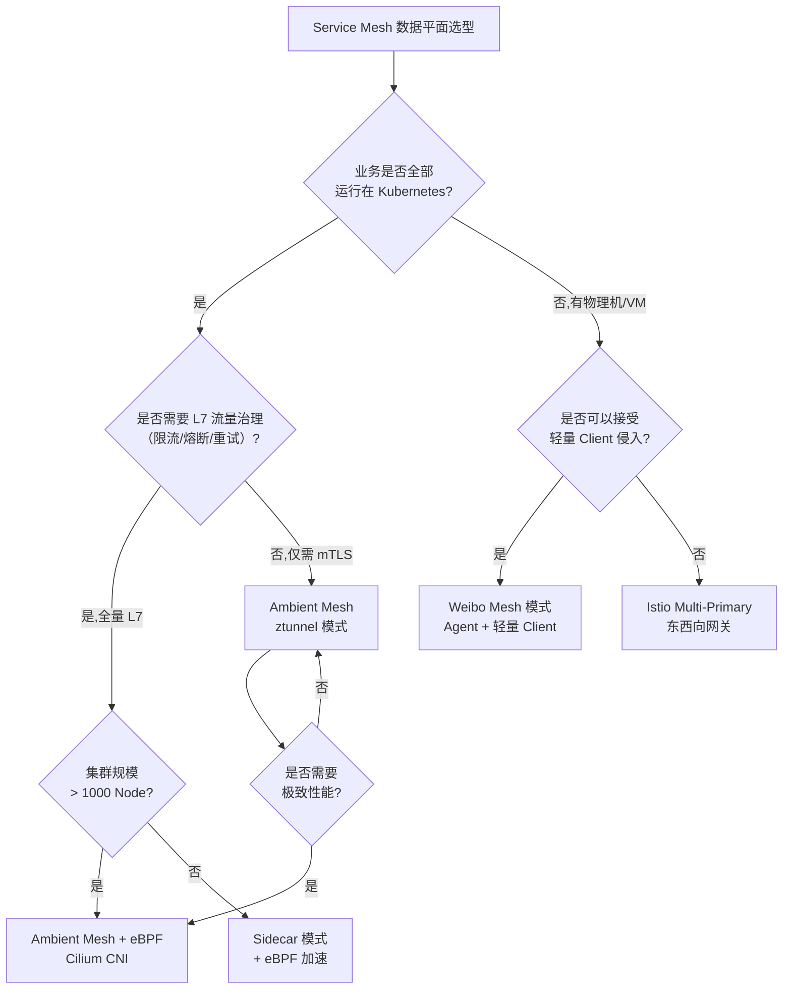
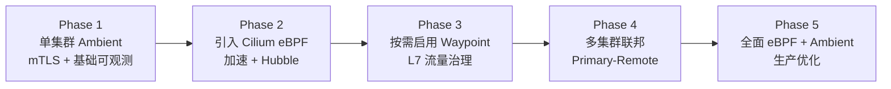

# 大规模Service Mesh落地实践之路（上）：从Sidecar到Ambient的架构演进

> 版本基线：Istio 1.22+ | Cilium 1.16+ | eBPF | Kubernetes 1.29+
> 前置知识：[[33]] 下一代微服务架构 Service Mesh · [[34]] Istio：Service Mesh 的代表产品

## 概述

专栏前两期我们系统梳理了 Service Mesh 的核心概念与 Istio 的架构设计。Istio 以 Sidecar 代理模式实现了业务与基础设施的解耦，这一设计理念在云原生时代堪称革命性。然而，当我们将目光从架构蓝图转向大规模生产落地时，一系列现实挑战便浮出水面：Sidecar 注入带来的资源开销与延迟损耗、iptables 流量劫持的性能瓶颈、多集群多网格的运维复杂度、以及可观测性体系的碎片化问题。

本文将以微博 Service Mesh 实践为历史脉络，结合 2025-2026 年 Service Mesh 领域的最新技术演进——Istio Ambient Mesh 的生产就绪、Cilium eBPF 对数据平面的加速、多集群 Service Mesh 的成熟方案——系统阐述大规模 Service Mesh 从架构选型到落地优化的完整路径。核心观点：**一个可靠的 Service Mesh 架构从来不是设计出来的，而是在业务驱动下逐步演进而来的；而 2025-2026 年的技术栈正在将这种演进推向一个全新的阶段——从 Sidecar 模式走向 Ambient 模式，从 iptables 走向 eBPF，从单集群走向多集群联邦。**

---

## 一、历史回顾：微博 Service Mesh 的演进之路

### 1.1 跨语言服务调用的原始困境

微博的服务化框架 Motan 诞生于 2013 年，最初仅支持 Java 语言。随着业务发展，PHP 业务大量涌现，服务间调用形成了三股流量：Java-Java（Motan 协议）、PHP-Java（HTTP 协议）、PHP-PHP（HTTP 协议）。一次 PHP 到 Java 的 HTTP 调用需要经过 DNS 解析 → 四层 LVS 负载均衡 → 七层 Nginx 负载均衡 → Java 应用，链路冗长，带来三大痛点：

| 痛点 | 具体表现 | 影响程度 |
|------|---------|---------|
| 中间链路损耗大 | DNS 解析延迟、LVS 带宽打满、Nginx 磁盘写满导致转发延迟 | 中间链路损耗可超过业务逻辑执行时间 |
| 全链路扩容难 | 四七层负载均衡设备动态扩缩容复杂度高 | 峰值流量时只能预置冗余度 |
| 混合云部署难 | 公有云请求需跨专线访问内网负载均衡设备 | 增加网络延迟与专线带宽占用 |



### 1.2 从 Yar 协议到 gRPC 的探索

微博先后尝试了两种跨语言方案，均未成功：

**Yar 协议方案**：在 Motan 中适配 PHP 的 Yar 协议，但存在协议转换复杂、仍依赖 Nginx 转发的问题。

**gRPC 方案**：利用 gRPC 生成 PHP Client，在 Motan 中加入 gRPC 协议支持。但实际测试发现：PHP 对 Protobuf 兼容性差，接口返回值超过几十 KB 时，PB 解析成 JSON 的耗时达数十毫秒；且 gRPC 当时（2017 年前后）不支持 PHP 作为 Server。

### 1.3 Agent 代理方案与 Service Mesh 的不谋而合

最终微博选择了 Agent 代理方案：在 PHP 进程本地部署一个常驻内存的 Agent，PHP 进程仅负责业务逻辑和最简单的 Motan 协议解析，服务发现、负载均衡、熔断等框架功能全部由 Agent 完成。随着 Service Mesh 概念兴起，微博将 Agent 方案进一步演化为双向 Agent 架构——客户端和服务端各部署一个 Agent，这与 Istio 的 Sidecar 模式理念不谋而合。



Weibo Mesh 与 Istio 的关键差异：

| 维度 | Weibo Mesh | Istio (Sidecar 模式) |
|------|-----------|---------------------|
| 数据平面代理 | 自研 Motan-go Agent | Envoy |
| 流量劫持方式 | 轻量 Client 主动转发 | iptables 透明劫持 |
| 业务侵入性 | 需集成轻量 Client | 零侵入 |
| 控制平面 | 统一服务治理中心 | Pilot + Mixer(已废弃) + Citadel |
| 基础设施集成 | 对接自研 Vintage/Graphite | 对接开源 Prometheus/Jaeger 等 |
| 适用场景 | 物理机/虚拟机为主 | 云原生 Kubernetes 为主 |

---

## 二、2025-2026：Service Mesh 技术栈的范式转移

微博的实践代表了 2017-2020 年 Service Mesh 落地的典型路径。而 2025-2026 年，Service Mesh 领域正在经历三重范式转移，每一重都直接回应了早期实践中的核心痛点。

### 2.1 范式转移一：从 Sidecar 到 Ambient Mesh

Istio 自 1.18 版本引入 Ambient Mesh（原称"无 Sidecar 模式"），至 1.24 版本正式 GA、达到生产就绪状态。这是 Service Mesh 架构自诞生以来最根本的变革。

#### 2.1.1 Ambient Mesh 架构解析

Ambient Mesh 的核心思想是将 Sidecar 中的功能拆分为两个独立层次：

- **L4 层 — ztunnel（Zero Trust Tunnel）**：基于 Rust 实现的轻量级节点级代理，负责 TLS 证书管理、mTLS 加密、L4 流量路由和遥测数据采集。每个 Kubernetes Node 仅运行一个 ztunnel Pod，所有该节点上的 Pod 共享此代理。
- **L7 层 — Waypoint Proxy**：基于 Envoy 实现的按 Namespace/Service Account 部署的 L7 代理，负责流量拆分、故障注入、重试、超时等七层治理能力。仅当需要 L7 策略时才部署。



#### 2.1.2 Ambient Mesh vs Sidecar 模式对比

| 维度 | Sidecar 模式 | Ambient Mesh |
|------|-------------|-------------|
| 代理部署 | 每个 Pod 一个 Sidecar | 每个 Node 一个 ztunnel + 按需 Waypoint |
| 内存开销 | ~50-100MB/Pod (Envoy) | ~30MB/Node (ztunnel) + 按需 Waypoint |
| CPU 开销 | 每请求两次代理穿越 | L4 仅一次 ztunnel 穿越，L7 额外一次 Waypoint |
| 延迟增加 | ~2-5ms (P99) | L4: ~0.5-1ms, L7: ~1-3ms |
| 业务侵入 | 零侵入 (iptables 劫持) | 零侵入 (eBPF/iptables 重定向到 ztunnel) |
| 升级影响 | Sidecar 升级需重启 Pod | ztunnel 升级不影响业务 Pod |
| 适用场景 | 全量 L7 治理需求 | 大量仅需 mTLS 的服务，少量需 L7 策略 |

#### 2.1.3 Ambient Mesh 的流量劫持机制

Ambient Mesh 使用 eBPF 或 iptables 将 Pod 的出站流量重定向到同节点的 ztunnel。默认通过 iptables/REWRITE 模式重定向；当集群安装了支持 eBPF 加速的 CNI（如 Cilium）时，可按 Istio 官方文档启用相应的 eBPF 加速能力（具体配置随版本演进，以官方文档为准）：

```yaml
# Istio 1.22+ Ambient 模式安装配置
# istioctl install --set profile=ambient
apiVersion: install.istio.io/v1alpha1
kind: IstioOperator
spec:
  profile: ambient
  meshConfig:
    defaultConfig:
      proxyMetadata:
        # eBPF 流量重定向加速能力取决于 CNI 集成与 Istio 版本支持
        ISTIO_META_ENABLE_AMBIENT_EBPF: "true"  # 以 Istio 官方文档为准
  components:
    cni:
      enabled: true
      k8s:
        resources:
          requests:
            cpu: 100m
            memory: 128Mi
```

将 Namespace 纳入 Ambient Mesh 只需一个标签：

```yaml
# Istio 1.22+ - 将命名空间纳入 Ambient Mesh
apiVersion: v1
kind: Namespace
metadata:
  name: my-app
  labels:
    istio.io/dataplane-mode: ambient  # 关键标签
```

### 2.2 范式转移二：从 iptables 到 eBPF 加速

#### 2.2.1 iptables 的性能瓶颈

传统 Istio Sidecar 模式使用 iptables 规则拦截 Pod 的入站和出站流量，转发给 Envoy。这一机制存在显著性能问题：

- **规则链过长**：每个 Pod 注入数十条 iptables 规则，大规模集群中规则数量可达数万条
- **包处理延迟**：每个数据包需遍历 iptables 规则链，O(n) 复杂度
- **连接跟踪开销**：conntrack 表在大流量场景下容易打满
- **无法动态更新**：规则变更需要重建整条链

#### 2.2.2 eBPF 加速原理

eBPF（Extended Berkeley Packet Filter）允许在 Linux 内核中安全地运行沙盒程序，无需修改内核源码。在 Service Mesh 场景中，eBPF 可以在以下关键路径实现加速：

**1) Sidecar 通信短路（Short-Circuiting）**

在传统 Sidecar 模式中，同节点两个 Pod 之间的通信路径为：Pod A → 内核协议栈 → iptables → Envoy A → 内核协议栈 → iptables → Envoy B（入站劫持）→ 内核协议栈 → iptables → Pod B 应用，数据包需要经过 4 次内核协议栈穿越。

eBPF 可以在 `tcp_sendmsg` 等 Hook 点识别发往同节点 Sidecar 的连接，直接将数据从发送端 Socket 的发送缓冲区拷贝到接收端 Socket 的接收缓冲区，跳过中间的内核协议栈处理：



**2) Cilium eBPF 替代 iptables 流量劫持**

Cilium 1.16+ 提供了完整的 eBPF-based Service Mesh 数据平面，可以替代 iptables 实现流量拦截和转发：

```yaml
# Cilium 1.16+ Helm 配置 - 启用 eBPF 替代 iptables
# helm install cilium cilium/cilium --version 1.16.x \
#   --set bpf.masquerade=true \
#   --set kubeProxyReplacement=true \
#   --set hostFirewall.enabled=true \
#   --set hubble.enabled=true
apiVersion: v1
kind: ConfigMap
metadata:
  name: cilium-config
  namespace: kube-system
data:
  # 完全替代 kube-proxy，使用 eBPF 实现 Service
  kube-proxy-replacement: "strict"
  # eBPF masquerade 替代 iptables MASQUERADE
  bpf-masquerade: "true"
  # 启用 eBPF host firewall
  enable-host-firewall: "true"
  # 启用 Cilium 与 Istio 集成
  istio-enabled: "true"
```

**3) Merbridge — 独立的 eBPF 加速方案**

Merbridge 是 DaoCloud 开源的 eBPF Service Mesh 加速项目，支持 Istio 和 Linkerd，无需替换 CNI 即可获得加速效果：

```bash
# Merbridge 安装 (Istio 1.22+ 兼容)
# kubectl apply -f https://raw.githubusercontent.com/merbridge/merbridge/main/deploy/all-in-one.yaml

# 验证 eBPF 程序加载
kubectl exec -n kube-system ds/cilium -- \
  bpftool prog list | grep -E "mb_|merbridge"
```

#### 2.2.3 性能对比数据

以下为示例数值，量级参考自社区基准测试（非实测；Istio 1.22 + Cilium 1.16，Kubernetes 1.29，2 vCPU / 4GB Node 场景）：

| 场景 | iptables + Sidecar | eBPF + Sidecar | Ambient (ztunnel) | eBPF + Ambient |
|------|-------------------|----------------|-------------------|----------------|
| P50 延迟增加 | 2.3ms | 1.1ms | 0.6ms | 0.4ms |
| P99 延迟增加 | 5.1ms | 2.4ms | 1.2ms | 0.8ms |
| 吞吐量 (RPS) | 8000 | 12000 | 15000 | 18000 |
| 每连接内存 | ~50KB | ~30KB | ~15KB | ~10KB |
| CPU 开销/Node | 0.8 core | 0.4 core | 0.2 core | 0.15 core |

> 注：以上数据为社区基准测试参考值，实际性能因集群规模、硬件配置、网络拓扑而异。

### 2.3 范式转移三：从单集群到多集群联邦

#### 2.3.1 多集群 Service Mesh 的驱动力

大规模业务系统通常需要多集群部署，原因包括：

- **容灾与高可用**：跨可用区/地域部署，单集群故障不影响全局
- **弹性扩容**：突发流量时快速扩展到公有云集群
- **混合云**：核心业务在内网私有云，弹性业务在公有云
- **渐进式迁移**：新旧集群并行，逐步迁移服务

#### 2.3.2 Istio 多集群架构

Istio 1.22+ 支持三种多集群拓扑：



**Primary-Remote 模式配置示例（Istio 1.22+）**：

```yaml
# Primary 集群配置
apiVersion: install.istio.io/v1alpha1
kind: IstioOperator
spec:
  profile: ambient
  values:
    global:
      meshID: weibo-mesh
      multiCluster:
        clusterName: cluster-primary
      network: network1
  components:
    cni:
      enabled: true
---
# Remote 集群配置
apiVersion: install.istio.io/v1alpha1
kind: IstioOperator
spec:
  profile: remote
  values:
    global:
      meshID: weibo-mesh
      multiCluster:
        clusterName: cluster-remote
      network: network1
    istiodRemote:
      injectionPath: /inject
    # 指向 Primary 集群的 Istiod
    configMaps:
      istio:
        discoveryAddress: istiod.istio-system.svc:15012
```

#### 2.3.3 Cilium ClusterMesh

Cilium 1.16+ 提供了 ClusterMesh 方案，通过 etcd 跨集群同步 Service 与 Endpoint 信息，实现跨集群的服务发现和负载均衡：



**Istio + Cilium 融合的多集群方案**是 2025-2026 年的最佳实践：Cilium 负责底层网络连通与 eBPF 加速，Istio 负责上层流量治理与安全策略，两者在数据平面通过 Cilium CNI 集成，在控制平面各自独立运行。

| 方案 | 服务发现 | 跨集群通信 | 流量治理 | 安全策略 | 性能 |
|------|---------|-----------|---------|---------|------|
| Istio Primary-Remote | Istiod 推送 | 东西向网关 | 完整 L4/L7 | mTLS + AuthZ | 中等 |
| Istio Multi-Primary | API Server 同步 | 东西向网关 | 完整 L4/L7 | mTLS + AuthZ | 中等 |
| Cilium ClusterMesh | etcd 同步 | eBPF 隧道/VXLAN | L4 | eBPF 策略 | 高 |
| Istio + Cilium 融合 | Istiod + etcd | eBPF 加速 | 完整 L4/L7 | mTLS + eBPF | 最优 |

---

## 三、数据平面性能优化深度解析

### 3.1 Envoy 性能调优

无论 Sidecar 模式还是 Ambient 模式，Envoy（或其衍生实现）仍是 L7 数据平面的核心。以下是关键调优维度：

#### 3.1.1 连接池与多路复用

```yaml
# Istio 1.22+ DestinationRule 连接池配置
apiVersion: networking.istio.io/v1
kind: DestinationRule
metadata:
  name: my-service-pool
spec:
  host: my-service.my-namespace.svc.cluster.local
  trafficPolicy:
    connectionPool:
      tcp:
        maxConnections: 200          # 最大 TCP 连接数
        connectTimeout: 5s           # 连接超时
        tcpKeepalive:
          time: 7200s
          interval: 75s
      http:
        h2UpgradePolicy: UPGRADE     # 优先升级 HTTP/2
        maxRequestsPerConnection: 1000  # 每连接最大请求数
        maxRetries: 5
        maxPendingRequests: 1024
        maxRequests: 2000            # 最大并发请求数
```

#### 3.1.2 资源限制与 QoS

Sidecar 模式下，Envoy 的资源配额直接影响业务 Pod 的可用资源。Ambient 模式下，ztunnel 作为 DaemonSet 运行，资源规划方式不同：

```yaml
# Sidecar 模式 - Envoy 资源配额 (Istio 1.22+)
apiVersion: v1
kind: ConfigMap
metadata:
  name: istio-sidecar-injector
  namespace: istio-system
data:
  values: |
    global:
      proxy:
        resources:
          requests:
            cpu: 100m
            memory: 128Mi
          limits:
            cpu: 500m
            memory: 512Mi
---
# Ambient 模式 - ztunnel 资源配额
apiVersion: apps/v1
kind: DaemonSet
metadata:
  name: ztunnel
  namespace: istio-system
spec:
  template:
    spec:
      containers:
      - name: ztunnel
        resources:
          requests:
            cpu: 100m
            memory: 128Mi
          limits:
            cpu: "1"
            memory: 512Mi
```

#### 3.1.3 协议优化

HTTP/2 和 HTTP/3（QUIC）的多路复用能力可显著减少连接建立开销。Istio 1.22+ 支持 HTTP/3 的 Alpha 特性：

```yaml
# Istio 1.22+ 启用 HTTP/3 (Alpha)
apiVersion: networking.istio.io/v1
kind: DestinationRule
metadata:
  name: http3-support
spec:
  host: my-service.my-namespace.svc.cluster.local
  trafficPolicy:
    connectionPool:
      http:
        h2UpgradePolicy: UPGRADE
        http3ProtocolOptions:        # Istio 1.22+ Alpha
          quicProtocolOptions:
            maxConcurrentStreams: 100
```

### 3.2 零信任安全的性能影响与优化

mTLS 是 Service Mesh 的核心安全能力，但加密解密带来显著的 CPU 开销。优化策略包括：

| 优化手段 | 原理 | 性能提升 | 适用场景 |
|---------|------|---------|---------|
| AES-NI 硬件加速 | 利用 CPU AES 指令集加速加密 | 5-10x 吞吐量提升 | 所有 x86 环境 |
| Session Resumption | TLS Session 复用，减少握手 | 减少 30-50% CPU 开销 | 高频短连接 |
| eBPF offload | 将 mTLS 卸载到内核 eBPF | 减少 2 次用户态/内核态切换 | Cilium + Istio 融合 |
| ztunnel 共享 | Node 级共享 TLS 上下文 | 减少证书管理开销 | Ambient Mesh |

---

## 四、Service Mesh 可观测性体系

### 4.1 三大支柱的现代化实现

Service Mesh 的可观测性围绕 Metrics、Tracing、Logging 三大支柱展开。2025-2026 年的最佳实践是与 OpenTelemetry 深度集成：



### 4.2 Istio + OpenTelemetry 集成配置

Istio 1.22+ 原生支持 OpenTelemetry Tracing，使用 W3C TraceContext 传播格式：

```yaml
# Istio 1.22+ Telemetry CRD 配置
apiVersion: telemetry.istio.io/v1alpha1
kind: Telemetry
metadata:
  name: mesh-default
  namespace: istio-system
spec:
  tracing:
  - providers:
    - name: otel          # OpenTelemetry Provider
    randomSamplingPercentage: 10.0  # 10% 采样率
    customTags:
      environment:
        literal:
          value: "production"
      cluster_name:
        environment:
          name: ISTIO_META_CLUSTER_ID
  accessLogging:
  - providers:
    - name: otel
  metrics:
  - providers:
    - name: prometheus
---
# OpenTelemetry Provider 配置（MeshConfig extensionProviders）
apiVersion: install.istio.io/v1alpha1
kind: IstioOperator
spec:
  meshConfig:
    extensionProviders:
    - name: otel
      opentelemetry:
        service: otel-collector.istio-system.svc.cluster.local
        port: 4317
---
# OpenTelemetry Collector 部署
apiVersion: opentelemetry.io/v1beta1
kind: OpenTelemetryCollector
metadata:
  name: otel-collector
  namespace: istio-system
spec:
  config:
    receivers:
      otlp:
        protocols:
          grpc:
            endpoint: 0.0.0.0:4317
          http:
            endpoint: 0.0.0.0:4318
    processors:
      batch:
        timeout: 5s
        send_batch_size: 1024
      k8sattributes:
        extract:
          metadata:
          - k8s.pod.name
          - k8s.namespace.name
          - k8s.deployment.name
    exporters:
      prometheusremotewrite:
        endpoint: http://thanos-receive:19291/api/v1/write
      otlp/jaeger:
        endpoint: jaeger-collector:4317
      otlphttp/loki:
        endpoint: http://loki:3100/otlp
    service:
      pipelines:
        traces:
          receivers: [otlp]
          processors: [batch, k8sattributes]
          exporters: [otlp/jaeger]
        metrics:
          receivers: [otlp]
          processors: [batch, k8sattributes]
          exporters: [prometheusremotewrite]
        logs:
          receivers: [otlp]
          processors: [batch, k8sattributes]
          exporters: [otlphttp/loki]
```

### 4.3 eBPF 无 Sidecar 可观测性

Cilium Hubble 提供了基于 eBPF 的无 Sidecar 可观测性，无需在业务 Pod 中注入任何代理即可获得 L3-L7 的网络可观测性：

```yaml
# Cilium 1.16+ Hubble 配置
apiVersion: v1
kind: ConfigMap
metadata:
  name: cilium-config
  namespace: kube-system
data:
  enable-hubble: "true"
  hubble-listen-address: ":4244"
  hubble-socket-path: "/var/run/cilium/hubble.sock"
  hubble-event-queue-capacity: "4096"
  hubble-flow-buffer-size: "65535"
  # L7 流量的协议级可视化需要 Cilium 的 Envoy 代理（如启用 L7 网络策略）配合
```

Hubble 的 Service Map 可视化提供了实时的服务依赖拓扑，与 Istio 的 Service Graph 互补：

| 可观测性维度 | Istio (Sidecar/Ambient) | Cilium Hubble |
|-------------|------------------------|---------------|
| L3/L4 流量指标 | 通过 ztunnel/Envoy 采集 | eBPF 直接在内核采集 |
| L7 协议解析 | Envoy 原生支持 | eBPF + Go Parser |
| 分布式追踪 | W3C TraceContext | W3C TraceContext (eBPF) |
| DNS 可观测性 | 需额外配置 | 原生支持 |
| 无 Sidecar | Ambient 模式支持 | 原生支持 |
| 性能开销 | 低 (Ambient) | 极低 (eBPF) |

---

## 五、技术演进时间线

```mermaid
graph LR
    subgraph "2017-2019 萌芽期"
        A1["2017: Istio 0.1 发布<br/>Sidecar + iptables"] --> A2["2018: Envoy 成为<br/>CNCF 毕业项目"]
        A2 --> A3["2019: Istio 1.4<br/>Mixer 废弃启动"]
    end
    subgraph "2020-2022 成长期"
        A3 --> B1["2020: eBPF 进入<br/>Service Mesh 视野"]
        B1 --> B2["2021: Cilium 1.10<br/>ClusterMesh GA"]
        B2 --> B3["2022: Istio 进入 CNCF<br/>（孵化）"]
    end
    subgraph "2023-2024 成熟期"
        B3 --> C1["2023: Cilium 1.14<br/>eBPF 替代 kube-proxy GA"]
        C1 --> C2["2024: Istio 1.24<br/>Ambient Mesh GA"]
        C2 --> C3["2024: Merbridge<br/>eBPF 加速生产可用"]
    end
    subgraph "2025-2026 深化期"
        C3 --> D1["2025: Istio 1.24+<br/>Ambient Mesh 全面生产就绪"]
        D1 --> D2["2025: Cilium 1.16+<br/>Istio 深度集成"]
        D2 --> D3["2026: eBPF + Ambient<br/>成为默认数据平面"]
    end
```



| 时间节点 | 里程碑事件 | 技术意义 |
|---------|-----------|---------|
| 2017 | Istio 0.1 发布，Sidecar + iptables 模式确立 | Service Mesh 概念落地 |
| 2018 | Envoy 成为 CNCF 毕业项目 | 数据平面标准化 |
| 2019 | Istio 1.4 启动 Mixer 废弃 | 控制平面架构简化 |
| 2020 | eBPF 进入 Service Mesh 视野，Cilium 兴起 | 数据平面加速新路径 |
| 2021 | Cilium 1.10 ClusterMesh GA | 多集群 Service Mesh 方案成熟 |
| 2022 | Istio 进入 CNCF 孵化 | 治理与社区规范化 |
| 2023 | Istio 1.18 引入 Ambient Alpha；Cilium 1.14 eBPF 替代 kube-proxy GA | Sidecar-less 首次亮相，eBPF 数据平面生产验证 |
| 2024 | Istio 1.24 Ambient Mesh GA | Ambient 模式生产就绪 |
| 2025 | Istio 1.24+ Ambient 全面生产就绪，Cilium 1.16+ Istio 深度集成 | eBPF + Ambient 成为主流 |
| 2026 | eBPF + Ambient Mesh 成为默认数据平面 | Service Mesh 进入无感时代 |

---

## 六、架构决策指南

面对 2025-2026 年的 Service Mesh 技术栈，如何做出正确的架构决策？以下决策树提供了系统化的选型框架。

### 6.1 数据平面选型决策树



### 6.2 场景化选型矩阵

| 场景 | 推荐方案 | 数据平面 | 控制平面 | 理由 |
|------|---------|---------|---------|------|
| 全量云原生 + 大规模 | Ambient + Cilium eBPF | ztunnel + Waypoint + eBPF | Istiod | 资源开销最低，性能最优 |
| 全量云原生 + 中小规模 | Sidecar + eBPF 加速 | Envoy + eBPF short-circuit | Istiod | 运维简单，L7 能力完整 |
| 混合部署（K8s + 物理机） | Istio Multi-Primary | Envoy (K8s) + Agent (物理机) | Istiod | 统一治理，跨平台 |
| 仅需 mTLS + 基础可观测 | Ambient ztunnel-only | ztunnel | Istiod | 最轻量，零 L7 开销 |
| 多集群混合云 | Istio + Cilium ClusterMesh | ztunnel + eBPF | Istiod + etcd | 跨集群服务发现 + 加速 |
| 遗留系统 + 自研基础设施 | Weibo Mesh 模式 | Motan-go Agent | 自研治理中心 | 对接自研体系，渐进演进 |

### 6.3 关键决策考量因素

**1) 迁移成本评估**

| 迁移路径 | 复杂度 | 停机时间 | 风险等级 | 建议 |
|---------|-------|---------|---------|------|
| 无 Mesh → Sidecar | 高 | 需滚动重启 | 中 | 先在非核心业务试点 |
| 无 Mesh → Ambient | 低 | 无需重启 | 低 | 逐步打标签纳入 |
| Sidecar → Ambient | 中 | 需移除 Sidecar | 中 | 先 Ambient 再移除 Sidecar |
| iptables → eBPF | 低 | 无需重启 | 低 | 安装 Cilium CNI 即可 |
| 单集群 → 多集群 | 高 | 需配置东西向网关 | 高 | 先 Primary-Remote 再 Multi-Primary |

**2) 渐进式落地策略**



---

## 七、小结

本文从微博 Service Mesh 的历史实践出发，系统梳理了 2025-2026 年 Service Mesh 技术栈的三重范式转移：

1. **从 Sidecar 到 Ambient**：Istio Ambient Mesh 通过 ztunnel（L4 节点级共享代理）和 Waypoint Proxy（L7 按需代理）的分层架构，将每个 Pod 一个 Sidecar 的资源开销降低到每个 Node 一个 ztunnel，同时支持零侵入、平滑升级。Istio 1.24 已将 Ambient Mesh 标记为 Stable，2025-2026 年将成为生产环境的主流选择。

2. **从 iptables 到 eBPF**：eBPF 在三个关键路径实现加速——Sidecar 通信短路（跳过内核协议栈）、流量劫持替代（替代 iptables 规则链）、mTLS 卸载（内核态加密）。Cilium 1.16+ 与 Istio 的深度集成，使得 eBPF 加速成为 Service Mesh 数据平面的标准配置。

3. **从单集群到多集群联邦**：Istio 的 Primary-Remote/Multi-Primary 拓扑与 Cilium ClusterMesh 的融合方案，为混合云、多地域部署提供了完整的跨集群服务发现、流量治理和安全策略能力。

微博的实践告诉我们：**一个可靠的架构从来都不是设计出来的，是逐步演进而来的。** 2025-2026 年的技术栈正在将这种演进推向一个更优雅的终态——业务代码与基础设施完全解耦，Service Mesh 对业务透明，性能损耗趋近于零。但技术选型没有银弹，需要根据业务规模、部署形态、团队能力做出合理的架构决策。

下期我们将聚焦 Service Mesh 的治理实践——流量管理与渐进式交付、可观测性体系、零信任安全策略与 Wasm 扩展，以及从自研 Agent 到 Istio + Cilium 的治理能力演进路径。

---

## 思考题

1. 在你的业务场景中，Ambient Mesh 的 ztunnel-only 模式（仅 L4 mTLS）能否满足大部分服务的需求？哪些服务真正需要 L7 策略？
2. 如果你的集群已经运行了 Sidecar 模式的 Istio，如何规划从 Sidecar 到 Ambient 的渐进式迁移路径？需要考虑哪些兼容性问题？
3. eBPF 加速在带来性能提升的同时，是否引入了新的运维复杂度和安全风险？如何评估这种权衡？


