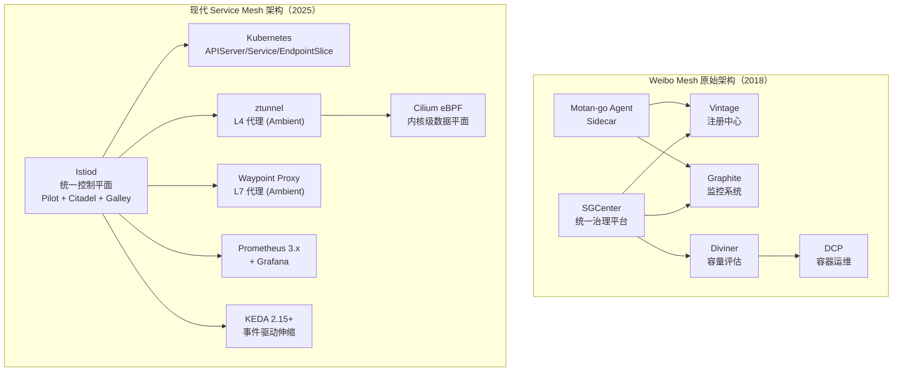
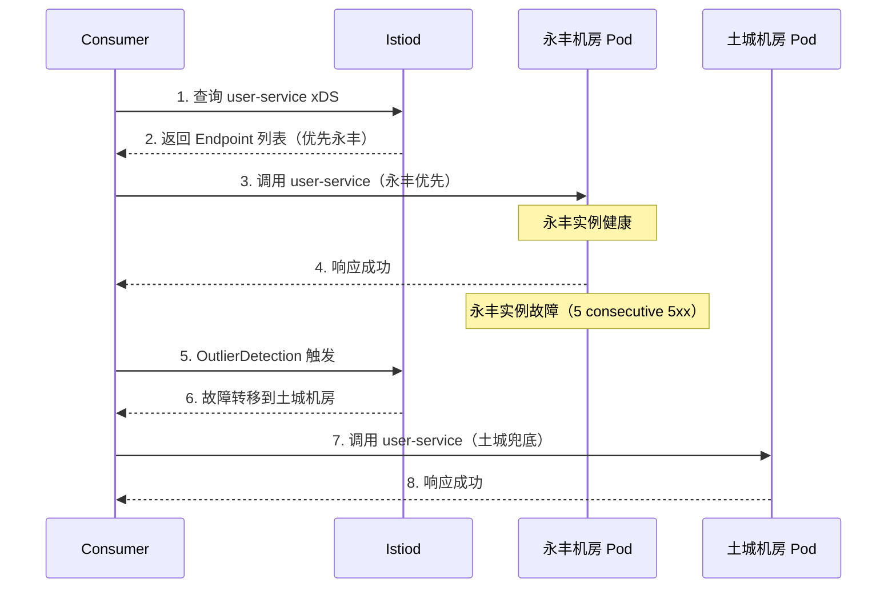
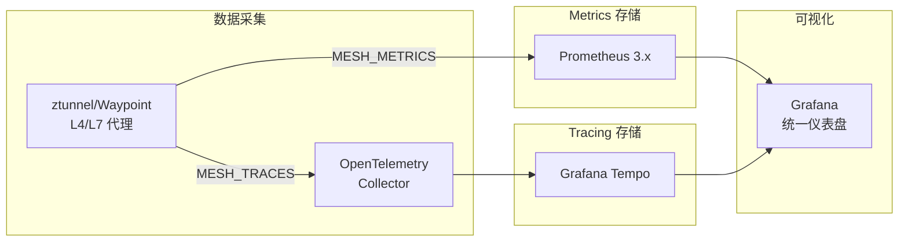
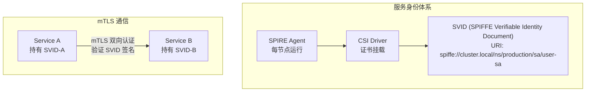

# 微博Service Mesh实践之路（下）

> **版本基线**：Istio 1.22+ | Cilium 1.16+ | eBPF | Wasm | Envoy 1.34+
> **阅读时间**：约 35 分钟
> **前置知识**：[[33]] 下一代微服务架构ServiceMesh · [[34]] Istio：ServiceMesh的代表产品 · [[35]] 微博ServiceMesh实践之路（上）

## 概述

上一篇我们回顾了微博从自研 Yar/gRPC/Agent 演进到 Service Mesh 的历程，以及 Istio Ambient Mesh 和 eBPF 加速对下一代架构的影响。本篇聚焦 Service Mesh 的**治理实践**——流量管理、可观测性、安全策略与 Wasm 扩展，结合大规模生产环境的经验与教训，探讨从自研 Agent 到 Istio + Cilium 的治理能力演进路径。

原文以 Weibo Mesh 的 Motan-go Agent 和统一服务治理中心（SGCenter）为例，讲解服务注册发现、监控上报、流量切换与自动扩缩容。这些能力在现代 Service Mesh 体系下，已被 Istio 控制平面 + Envoy/Cilium 数据平面全面承接和超越。

---

## 一、Service Mesh 治理能力全景

### 1.1 从自研治理中心到 Istio 控制平面

原文描述的 Weibo Mesh 治理架构包含：Vintage 注册中心、SGCenter 治理平台、Graphite 监控系统、Diviner 容量评估系统。这套架构在 2018 年是合理的自研方案，但面临以下局限：

- **治理能力分散**：注册、监控、流量切换、扩缩容分别由不同系统实现
- **协议绑定**：Motan2 私有协议 + Simple 序列化，跨语言扩展受限
- **数据平面耦合**：Motan-go Agent 承担全部治理逻辑，升级需全量部署

现代 Service Mesh 体系（Istio + Cilium）将治理能力统一到控制平面：



### 1.2 治理能力对比

| 治理能力 | Weibo Mesh（2018） | Istio + Cilium（2025） |
|---------|-------------------|----------------------|
| **服务注册发现** | Vintage 注册中心 | Kubernetes Service + Istiod xDS 推送 |
| **流量路由** | SGCenter 下发切流量指令 | Istio VirtualService + DestinationRule |
| **熔断限流** | Motan-go Agent Filter Chain | Istio OutlierDetection + Envoy Rate Limit |
| **降级** | Switcher Filter | Istio FaultInjection + Envoy Fallback |
| **监控** | Graphite + 自定义 metric | Prometheus + OpenTelemetry + Grafana |
| **容量评估** | Diviner 自研系统 | KEDA 事件驱动 + AIOps 预测 |
| **自动扩缩容** | DCP + SGCenter | Kubernetes HPA + KEDA + Cluster Autoscaler |
| **安全** | 无内置 TLS | Istio mTLS + AuthorizationPolicy + SPIFFE |
| **可扩展性** | Go 模块扩展 | Wasm Plugin + Envoy Filter + Cilium eBPF |
| **跨语言** | Motan2 + Simple 序列化 | Triple/gRPC + Protobuf（多语言 SDK） |

---

## 二、流量管理实践

### 2.1 Istio 流量路由模型

原文的流量切换依赖 SGCenter 向 Vintage 下发指令，Motan-go Agent 感知变更后执行机房切换。Istio 的流量管理基于声明式配置，通过 VirtualService 和 DestinationRule 实现：

```yaml
# Istio 1.22+ VirtualService — 机房级流量切换
apiVersion: networking.istio.io/v1
kind: VirtualService
metadata:
  name: user-service
spec:
  hosts:
    - user-service
  http:
    - route:
        - destination:
            host: user-service
            subset: yongfeng    # 永丰机房
          weight: 80
        - destination:
            host: user-service
            subset: tucheng     # 土城机房
          weight: 20
      retries:
        attempts: 3
        perRetryTimeout: 2s
        retryOn: 5xx,connect-failure

# DestinationRule — 机房子集定义 + 离群检测
apiVersion: networking.istio.io/v1
kind: DestinationRule
metadata:
  name: user-service
spec:
  host: user-service
  trafficPolicy:
    connectionPool:
      tcp:
        maxConnections: 100
      http:
        h2UpgradePolicy: DEFAULT
        http1MaxPendingRequests: 1024
        http2MaxRequests: 1024
    outlierDetection:
      consecutive5xxErrors: 5
      interval: 30s
      baseEjectionTime: 30s
      maxEjectionPercent: 50
      minHealthPercent: 25
  subsets:
    - name: yongfeng
      labels:
        topology.kubernetes.io/zone: yongfeng
    - name: tucheng
      labels:
        topology.kubernetes.io/zone: tucheng
```

### 2.2 Locality-Aware 故障转移

Istio 1.22+ 内置了 Locality-Aware 故障转移能力，优先将流量路由到同一区域的实例，仅在健康实例不足时才故障转移到其他区域：



### 2.3 灰度发布与渐进式交付

原文的流量切换是粗粒度的机房级操作。Istio + Argo Rollouts 提供了更精细的金丝雀发布能力：

```yaml
# Argo Rollouts 1.7+ — 金丝雀发布策略
apiVersion: argoproj.io/v1alpha1
kind: Rollout
metadata:
  name: user-service
spec:
  strategy:
    canary:
      canaryService: user-service-canary
      stableService: user-service-stable
      trafficRouting:
        istio:
          virtualService:
            name: user-service
            routes:
              - primary
      steps:
        - setWeight: 5
        - pause: {duration: 5m}
        - setWeight: 10
        - pause: {duration: 5m}
        - analysis:
            templates:
              - templateName: success-rate
                clusterScope: true
            args:
              - name: service-name
                value: user-service-canary
        - setWeight: 30
        - pause: {duration: 5m}
        - setWeight: 50
        - pause: {duration: 10m}
        - setWeight: 80
        - pause: {duration: 5m}
        - setWeight: 100
        - pause: {duration: 0}
```

---

## 三、可观测性体系

### 3.1 从 Graphite 到 OpenTelemetry + Prometheus

原文的监控架构基于 Motan-go Agent 采集 → Graphite 存储 → SGCenter 查询。现代 Service Mesh 的可观测性基于 Istio 内置的遥测体系：



Istio 1.22+ 的遥测配置：

```yaml
# Istio 1.22+ Telemetry CRD
apiVersion: telemetry.istio.io/v1alpha1
kind: Telemetry
metadata:
  name: default
  namespace: istio-system
spec:
  metrics:
    - providers:
        - name: prometheus
      overrides:
        - match:
            metric: REQUEST_COUNT
          operation: ADD
          value:
            request_method: request.method
        - match:
            metric: REQUEST_DURATION
          operation: ADD
          value:
            request_host: request.host
  tracing:
    - providers:
        - name: otel
      randomSamplingPercentage: 10.0
      customTags:
        source_ip:
          header:
            name: X-Envoy-External-Address
```

### 3.2 eBPF 无侵入可观测性

Cilium Hubble 提供 eBPF 级别的网络流量可观测性，无需 Sidecar 介入：

```yaml
# Cilium Hubble 配置
apiVersion: v1
kind: ConfigMap
metadata:
  name: hubble-config
  namespace: kube-system
data:
  hubble.yaml: |
    metrics:
      enabled:
        - dns
        - drop
        - flow
        - http
        - icmp
        - tcp
      server:
        enabled: true
        port: 8080
    observe:
      observability:
        enabled: true
```

---

## 四、安全策略实践

### 4.1 从无 TLS 到零信任安全

原文的 Weibo Mesh 未提及安全机制。现代 Service Mesh 内置了完整的零信任安全能力：

```yaml
# Istio 1.22+ — 全命名空间 mTLS 严格模式
apiVersion: security.istio.io/v1
kind: PeerAuthentication
metadata:
  name: default
  namespace: istio-system
spec:
  mtls:
    mode: STRICT

# AuthorizationPolicy — 服务级访问控制
apiVersion: security.istio.io/v1
kind: AuthorizationPolicy
metadata:
  name: user-service-policy
  namespace: production
spec:
  selector:
    matchLabels:
      app: user-service
  rules:
    - from:
        - source:
            principals:
              - "cluster.local/ns/frontend/sa/frontend-sa"
            namespaces:
              - frontend
      to:
        - operation:
            methods:
              - GET
            paths:
              - /api/v1/users/*
      when:
        - key: request.headers[x-token]
          values:
            - "valid-token-*"
```

### 4.2 SPIFFE 服务身份框架

Istio 的 mTLS 基于 SPIFFE/SPIRE 服务身份标准：



---

## 五、Wasm 扩展实践

### 5.1 从 Motan-go Agent Filter Chain 到 Envoy Wasm

原文的 Motan-go Agent 通过 Filter Chain 模块实现 AccessLog、Metric、CircuitBreaker、Switcher、Tracing、Mock、ActiveLimit 等功能。Istio 的 Wasm 扩展机制提供了类似的可扩展性，但更加标准化和通用：

| 扩展方式 | Motan-go Agent Filter | Istio Wasm Plugin |
|---------|----------------------|-------------------|
| 语言 | 仅 Go | Rust / C++ / AssemblyScript / Go |
| 飞行机制 | 需全量重新部署 Agent | 动态加载，无需重启 Envoy |
| 部署方式 | 机器级部署 | OCI 镜像分发，Istiod 自动拉取 |
| 性能 | Go 进程内调用，低开销 | Wasm 虚拟机沙箱，中等开销 |
| 生态 | 仅微博内部 | Envoy 生态，社区共享 |
| 安全 | 无沙箱隔离 | Wasm 沙箱隔离，能力受限 |

### 5.2 Rust Wasm Plugin 示例

```rust
// Rust Wasm Plugin — 自定义 AccessLog 扩展
use proxy_wasm::traits::*;
use proxy_wasm::types::*;

#[no_mangle]
pub fn _start() {
    proxy_wasm::set_log_level(LogLevel::Trace);
    proxy_wasm::set_vm_context(VmContext);
}

struct VmContext;
impl Context for VmContext {}
impl VmContext for VmContext {
    fn create_http_context(&self, context_id: u32) -> Option<Box<dyn HttpContext>> {
        Some(Box::new(HttpContext { context_id }))
    }
}

struct HttpContext {
    context_id: u32,
}

impl Context for HttpContext {}
impl HttpContext for HttpContext {
    fn on_http_response_headers(&mut self, _num_headers: usize, _end_of_stream: bool) {
        let status = self.get_http_response_header(":status").unwrap_or("unknown");
        let path = self.get_http_request_header(":path").unwrap_or("unknown");
        let method = self.get_http_request_header(":method").unwrap_or("unknown");

        // 自定义日志格式
        self.log(LogLevel::Info,
            &format!("access_log: method={}, path={}, status={}", method, path, status));
    }
}
```

### 5.3 Wasm Plugin OCI 部署配置

```yaml
# Istio 1.22+ WasmPlugin CRD
apiVersion: extensions.istio.io/v1alpha1
kind: WasmPlugin
metadata:
  name: custom-accesslog
  namespace: istio-system
spec:
  selector:
    matchLabels:
      istio: ingressgateway
  url: oci://registry.example.com/wasm/accesslog:v1.0.0
  imagePullPolicy: IfNotPresent
  imagePullSecret: registry-credentials
  phase: AUTHN
  pluginConfig:
    log_format: "method={{method}} path={{path}} status={{status}}"
    output_destination: stdout
  priority: 100
```

---

## 六、Service Mesh 与 API Gateway 融合

### 6.1 Kubernetes Gateway API

Istio 1.22+ 支持 Kubernetes Gateway API 作为北向流量入口的标准接口：

```yaml
# Kubernetes Gateway API — API Gateway 配置
apiVersion: gateway.networking.k8s.io/v1
kind: Gateway
metadata:
  name: api-gateway
  namespace: istio-system
spec:
  gatewayClassName: istio
  listeners:
    - name: http
      port: 80
      protocol: HTTP
      hostname: "*.example.com"
      allowedRoutes:
        namespaces:
          from: All
    - name: https
      port: 443
      protocol: HTTPS
      hostname: "*.example.com"
      tls:
        mode: Terminate
        certificateRefs:
          - name: example-com-cert
            kind: Secret
            namespace: istio-system

# HTTPRoute — 路由规则
apiVersion: gateway.networking.k8s.io/v1
kind: HTTPRoute
metadata:
  name: user-service-route
spec:
  parentRefs:
    - name: api-gateway
      namespace: istio-system
  hostnames:
    - "api.example.com"
  rules:
    - matches:
        - path:
            type: PathPrefix
            value: /api/v1/users
      backendRefs:
        - name: user-service
          port: 8080
          weight: 90
        - name: user-service-canary
          port: 8080
          weight: 10
      filters:
        - type: RequestHeaderModifier
          requestHeaderModifier:
            add:
              - name: X-Source
                value: gateway
```

---

## 七、大规模 Service Mesh 治理经验

### 7.1 从 Weibo Mesh 到现代架构的演进要点

| 演进维度 | Weibo Mesh 经验 | 现代 Service Mesh 实践 |
|---------|----------------|----------------------|
| **部署策略** | Motan-go Agent 与业务进程同机部署 | Sidecar 容器注入或 Ambient Mesh ztunnel |
| **治理集中度** | SGCenter 统一平台，手工下发指令 | Istiod 控制平面，声明式配置，xDS 自动推送 |
| **协议选择** | Motan2 私有协议 | Triple/gRPC（HTTP/2 标准），兼容 gRPC 生态 |
| **可扩展性** | Go 模块扩展 | Wasm Plugin（OCI 镜像分发）+ eBPF |
| **安全** | 无内置机制 | mTLS + AuthorizationPolicy + SPIFFE |
| **升级方式** | 全量替换 Motan-go Agent | Sidecar 逐个升级或 Ambient 模式热更新 |

### 7.2 大规模 Service Mesh 落地挑战

1. **Sidecar 资源开销**：每个 Pod 需额外 50-150MB 内存和 0.1-0.5 CPU，万级 Pod 规模下资源消耗显著。Ambient Mesh 的 ztunnel 仅需约 10MB，大幅降低开销。

2. **配置推送延迟**：Istiod 需向所有 Sidecar 推送 xDS 配置，万级实例时推送效率成为瓶颈。增量 xDS（Delta xDS）和 Namespace 级发现显著优化了推送性能。

3. **故障域隔离**：单个 Istiod 实例管理万级服务时，控制平面故障影响面巨大。多 Istiod 实例 + Namespace 分区是推荐的解决方案。

4. **跨集群治理**：多机房/多集群场景下，Istio Multi-Primary 架构可实现跨集群服务发现和流量管理。

---

## 技术演进时间线

| 时间 | 里程碑 | 影响 |
|------|--------|------|
| 2018 | Weibo Mesh（Motan-go Agent + SGCenter） | 原文描述的技术状态；自研治理中心 |
| 2019 | Istio 1.5 统一为 Istiod | 控制平面从三组件简化为单体 |
| 2020 | Envoy Wasm 扩展机制 | 数据平面可扩展性标准化 |
| 2021 | Istio 1.11 引入 Telemetry API | 遥测配置声明式标准化 |
| 2022 | Istio 提出 Ambient Mesh 构想；Cilium eBPF 替代 kube-proxy 推进 | 无 Sidecar 模式探索与内核级加速 |
| 2023 | Istio 1.18 引入 Ambient Mesh Alpha；Kubernetes Gateway API v1.0 GA | ztunnel + Waypoint 架构落地；北向入口标准化 |
| 2024 | Istio 1.24 Ambient Mesh GA | Ambient 生产就绪 |
| 2025 | Ambient + eBPF 融合成为主流方案 | 大规模 Service Mesh 生产级部署 |

---

## 架构决策指南

> **何时选择 Sidecar 模式？**
> - 需要完整的 L7 治理能力（流量路由、熔断、限流、重试）
> - 应用间通信需要精细的策略控制
> - 已有成熟的 Sidecar 运维体系

> **何时选择 Ambient Mesh 模式？**
> - 大规模集群，Sidecar 资源开销成为瓶颈
> - 对 L7 治理需求较低，主要需要 mTLS 和 L4 负载均衡
> - 希望渐进式采用 Service Mesh（先 Ambient L4，再按需 Waypoint L7）

> **何时选择 eBPF 模式？**
> - 网络性能是关键瓶颈（如高吞吐低延迟场景）
> - 需要内核级可观测性和安全策略
> - 已采用 Cilium 替代 kube-proxy

> **何时使用 Wasm 扩展？**
> - 需要自定义 Filter 逻辑（AccessLog、认证、限流）
> - 扩展逻辑需要跨 Sidecar/Ambient 通用
> - 需要沙箱隔离的自定义业务逻辑

> **何时使用 Motan-go Agent 自研方案？**
> - 已有成熟的 Motan 生态且迁移成本极高
> - 业务对特定协议有强绑定需求
> - 小规模部署，自研方案足以覆盖

---

## 小结

本篇从 Weibo Mesh 的治理实践出发，系统对比了自研方案与现代 Service Mesh 体系的治理能力演进：

- **流量管理**：从 SGCenter 手工下发指令 → Istio VirtualService/DestinationRule 声明式配置，Locality-Aware 故障转移，Argo Rollouts 渐进式交付
- **可观测性**：从 Graphite 自定义 metric → Prometheus + OpenTelemetry + Cilium Hubble eBPF 级可观测
- **安全策略**：从无 TLS → Istio mTLS + AuthorizationPolicy + SPIFFE 零信任身份
- **可扩展性**：从 Motan-go Agent Filter Chain → Envoy Wasm Plugin OCI 镜像分发 + eBPF
- **大规模落地**：Ambient Mesh 降低 Sidecar 开销，Delta xDS 优化推送效率，Multi-Primary 多集群治理

从自研到开源的演进路径，核心经验是：**紧贴业务需求的治理能力是落地的关键，但标准化和生态兼容是规模化推广的前提**。Weibo Mesh 的实践证明了业务驱动架构决策的重要性，而 Istio + Cilium 的现代体系提供了更标准化、更可扩展的治理能力。

**下一篇**：[[37]] AI辅助微服务开发与运维（新增专题） →