# AI辅助微服务开发与运维

> **版本基线**：OpenTelemetry 1.x | Prometheus 3.x | Kubernetes 1.30+
> **阅读时间**：约 25 分钟
> **前置知识**：[[15]] 如何搭建监控系统？ · [[16]] 如何搭建服务追踪系统？

## 概述

在专栏前面的文章中，我们已经系统性地讲解了微服务架构的方方面面：从服务注册发现到 RPC 调用，从监控追踪到 Service Mesh，从容器化到多机房部署。这些技术和方案解决了一个又一个微服务落地中的核心难题，但同时也带来了一个不容忽视的现实——微服务系统的运维复杂度正以指数级增长。

一个拥有数百个微服务、数千个实例的生产系统，每天产生的监控指标以亿计、日志以 TB 计、Trace 数据以千万计。面对这样的数据量，传统依靠人工经验进行告警配置、故障排查、容量规划的方式已经力不从心。告警风暴让 SRE 团队疲于奔命，MTTR（平均恢复时间）居高不下，容量规划过度或不足带来的资源浪费与稳定性风险并存。

正是在这样的背景下，AIOps（Artificial Intelligence for IT Operations）应运而生。Gartner 在 2016 年首次提出 AIOps 概念时，将其定义为"利用大数据、机器学习和先进分析技术，自动化和增强 IT 运维过程"。而随着大语言模型（LLM）在 2023-2025 年间的爆发式发展，AIOps 正经历从"规则驱动 + 传统 ML"到"LLM 驱动 + 智能体协作"的范式跃迁。

与此同时，AI 对微服务开发的影响同样深远。GitHub Copilot、Cursor 等 AI 编程工具已经深刻改变了开发者的工作方式；AI 驱动的测试生成、代码审查、故障诊断正在将开发效率提升到新的量级。

今天这篇文章，我们就来深入探讨 AI 如何辅助微服务的开发与运维，覆盖从智能告警到 AI 辅助开发、从预测性容量规划到自动化故障诊断的完整链路。

## 从传统运维到智能运维：AIOps 的演进

### 运维演进的四阶段

微服务运维的发展，大致经历了四个阶段，每个阶段都对应着不同的技术范式和人力依赖程度：

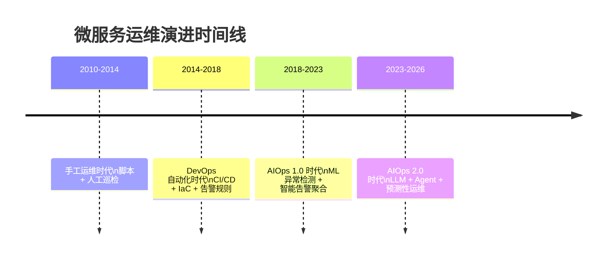

| 阶段 | 核心能力 | 典型工具 | 人工依赖度 |
|------|----------|----------|------------|
| 手工运维 | 脚本化部署、人工巡检 | Shell/Python 脚本、Nagios | 极高 |
| DevOps 自动化 | CI/CD 流水线、IaC、规则告警 | Jenkins、Ansible、Prometheus | 高 |
| AIOps 1.0 | ML 异常检测、告警降噪、根因排序 | Dynatrace、Moogsoft | 中 |
| AIOps 2.0 | LLM 驱动的故障诊断、预测性运维、Agent 协作 | Datadog Bits AI、PagerDuty AIOps | 低 |

从手工运维到 AIOps 2.0，核心的变化在于：**运维决策的主体从"人"逐步向"AI"转移，而人的角色从"执行者"转变为"审核者"**。

### AIOps 的三大数据支柱

AIOps 之所以能有效运作，依赖于三大数据支柱——这正是我们在系列第 15 讲和第 16 讲中详细讨论过的可观测性数据：

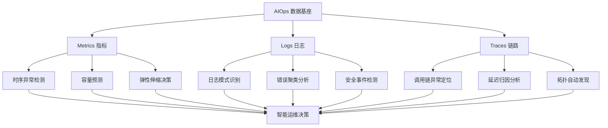

- **Metrics（指标）**：CPU 利用率、QPS、P99 延迟、错误率等时序数据，是异常检测和容量预测的基础
- **Logs（日志）**：结构化与非结构化的文本数据，是错误诊断和安全审计的依据
- **Traces（链路）**：分布式调用的拓扑与耗时信息，是跨服务故障定位的关键

OpenTelemetry 作为统一可观测性框架，通过 OTLP（OpenTelemetry Protocol）将这三种信号统一采集、关联和传输，为 AIOps 系统提供标准化的数据输入。

## 智能告警：从告警风暴到精准定位

### 告警疲劳：微服务运维的头号敌人

在微服务架构中，告警疲劳是一个普遍且严重的问题。一个典型案例：某电商平台在"双 11"大促期间，由于一个数据库连接池耗尽，引发了连锁反应——下游的 20 个服务相继超时，监控系统在 5 分钟内产生了 3000+ 条告警。SRE 团队被淹没在告警洪水中，真正需要关注的根因反而被忽略，最终 MTTR 超过了 45 分钟。

传统基于静态阈值的告警存在三大问题：

1. **阈值设定困难**：微服务的流量模式随业务周期波动，固定的 QPS 阈值在白天可能正常，在凌晨却已是异常
2. **告警风暴**：一个根因引发的级联故障会触发大量关联告警
3. **误报率高**：据统计，传统告警系统的误报率高达 40%-60%，导致"狼来了"效应

### 基于机器学习的异常检测

智能告警的核心是从"阈值判断"升级为"行为建模"。常见的异常检测算法可以分为以下几类：

| 算法类别 | 代表算法 | 适用场景 | 优劣势 |
|----------|----------|----------|--------|
| 统计方法 | 3-Sigma、Z-Score | 指标平稳、正态分布 | 简单高效，但对非平稳序列效果差 |
| 时序预测 | ARIMA、Prophet | 带周期性的指标 | 能捕捉周期模式，但对突变响应慢 |
| 机器学习 | Isolation Forest、One-Class SVM | 多维指标联合检测 | 无需标签，但解释性差 |
| 深度学习 | LSTM-AE、Transformer-AE | 复杂非线性模式 | 精度高，但训练成本大、需大量数据 |

在实际生产中，更推荐采用**分层检测策略**：

```python
# 分层异常检测示例（Python + Prometheus Client）
# Prometheus 3.x 兼容
import numpy as np
from prometheus_client import CollectorRegistry, Gauge
from datetime import datetime, timedelta

class LayeredAnomalyDetector:
    """分层异常检测器：快速检测 + 精确确认"""

    def __init__(self, metric_name: str):
        self.metric_name = metric_name
        self.history_window = 7 * 24 * 3600  # 7 天历史数据

    def layer1_statistical_check(self, current: float,
                                  baseline: np.ndarray) -> dict:
        """第一层：统计快速检测（低延迟）"""
        mean = np.mean(baseline)
        std = np.std(baseline)
        z_score = (current - mean) / std if std > 0 else 0

        return {
            "is_anomaly": abs(z_score) > 3,
            "z_score": z_score,
            "confidence": "low",  # 统计检测置信度较低
            "method": "z_score"
        }

    def layer2_seasonal_check(self, current: float,
                               history: np.ndarray,
                               period: int = 86400) -> dict:
        """第二层：周期性检测（中延迟）"""
        # 取同周期历史数据
        same_period_values = history[-period:]
        period_mean = np.mean(same_period_values)
        period_std = np.std(same_period_values)
        deviation = abs(current - period_mean) / period_std \
                    if period_std > 0 else 0

        return {
            "is_anomaly": deviation > 2.5,
            "deviation": deviation,
            "confidence": "medium",
            "method": "seasonal_decomposition"
        }

    def layer3_ml_confirm(self, features: np.ndarray,
                          model) -> dict:
        """第三层：ML 模型确认（高延迟、高准确率）"""
        prediction = model.predict(features.reshape(1, -1))
        is_anomaly = prediction[0] == -1  # Isolation Forest

        return {
            "is_anomaly": bool(is_anomaly),
            "confidence": "high",
            "method": "isolation_forest"
        }
```

分层策略的核心思路是：**第一层用低成本的统计方法快速过滤明显异常，第二层结合周期性特征提升准确率，第三层用 ML 模型做最终确认**。这样既能保证检测的实时性，又能控制误报率。

### 告警聚合与根因排序

当多个告警同时触发时，AIOps 系统需要完成两件事：**聚合关联告警**和**排序根因候选**。

告警聚合的核心逻辑基于拓扑关联和时间关联：

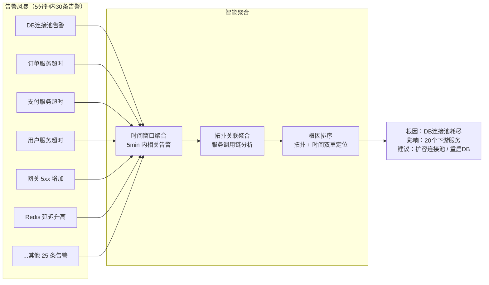

PagerDuty AIOps 和 BigPanda 是这一领域的代表性产品。PagerDuty 的告警智能聚合可以将告警噪声降低 90% 以上，其核心能力包括：

- **事件关联**：基于时间窗口和服务拓扑，将相关告警合并为 Incident
- **噪声抑制**：自动识别并抑制已知问题衍生的重复告警
- **根因推断**：结合 CMDB（配置管理数据库）和服务拓扑，将最可能的根因排在首位

### 根因分析：从规则到推理

传统的根因分析依赖人工总结的规则（如"数据库慢查询导致服务超时"），但微服务调用链路的复杂性使得规则难以穷举。AIOps 2.0 时代的根因分析引入了两种新能力：

1. **因果推断（Causal Inference）**：基于 PC 算法或 Granger 因果检验，从指标时间序列中自动发现因果关系，构建因果图
2. **LLM 辅助推理**：将告警上下文、日志摘要、Trace 信息输入 LLM，由 LLM 进行多步推理，输出根因分析报告

以 Dynatrace 的 Davis AI 为例，其根因分析流程如下：

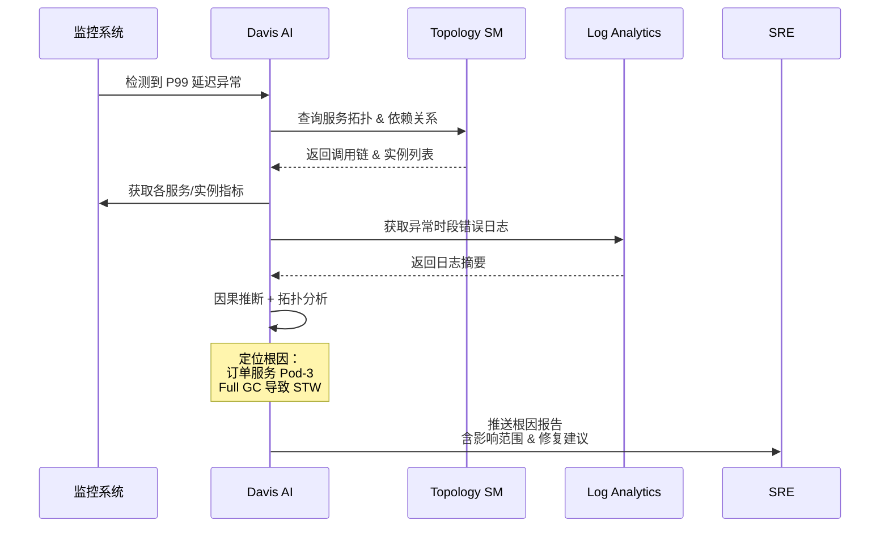

## AI 辅助微服务开发

### 代码生成：从模板到智能补全

在微服务开发中，大量重复性的编码工作占据了开发者相当多的时间：定义 Protobuf IDL、编写 API 接口的 CRUD 逻辑、实现服务间调用的容错处理、编写配置文件的模板……这些工作虽然技术含量不高，但数量庞大且容易出错。

AI 编程工具的出现在本质上改变了这一局面。2025 年，GitHub Copilot 和 Cursor 已经成为微服务开发者最常用的 AI 辅助工具，它们的能力对比：

| 能力维度 | GitHub Copilot | Cursor |
|----------|---------------|--------|
| 代码补全 | 行级/块级补全，基于上下文 | 行级/块级/文件级补全 |
| 代码生成 | Chat 驱动 + Inline 生成 | Composer 多文件生成 |
| 上下文理解 | 打开的文件 + Workspace 索引 | 全项目代码库索引（Codebase） |
| 多文件编辑 | 有限支持 | 原生支持多文件同时修改 |
| 终端集成 | Copilot CLI | 内置 Terminal + AI |
| 自定义规则 | .github/copilot-instructions.md | .cursorrules 项目级配置 |

在微服务开发场景中，这些工具的典型应用包括：

**1. API 接口快速生成**

```protobuf
// order.proto - 订单服务接口定义
syntax = "proto3";
package order.v1;

service OrderService {
  // AI 自动补全：基于已有字段和业务语义
  // 生成 CreateOrder、GetOrder、ListOrders 等接口
  rpc CreateOrder(CreateOrderRequest) returns (CreateOrderResponse);
  rpc GetOrder(GetOrderRequest) returns (GetOrderResponse);
  rpc ListOrders(ListOrdersRequest) returns (ListOrdersResponse);
  rpc UpdateOrderStatus(UpdateOrderStatusRequest) returns (UpdateOrderStatusResponse);
}
```

**2. 微服务脚手架代码**

以 Go 微服务为例，结合 Cursor 的项目级规则（`.cursorrules`）可以让 AI 生成的代码保持一致的架构风格：

```markdown
# .cursorrules - 项目级 AI 编码规则

## 项目架构
- 采用 Clean Architecture 分层：handler / service / repository / model
- 使用 Kratos 框架（Go microservice framework）
- 配置管理使用 Viper，配置文件为 YAML
- 数据库访问使用 GORM，禁止裸 SQL

## 编码规范
- 错误处理：使用 errors.Wrap 包装错误上下文
- 日志：使用 logrus，禁止 fmt.Println
- 命名：遵循 Go 官方命名规范，接口不加 I 前缀
- 并发：优先使用 errgroup 管理 goroutine 生命周期

## 微服务特有规则
- 所有对外接口必须有超时控制（context.WithTimeout）
- 服务间调用必须实现重试 + 熔断（使用 kratos middleware）
- 每个接口必须有 OpenTelemetry 的 Trace 和 Metrics 埋点
```

通过这样的项目级规则配置，AI 生成的代码将自动遵循团队的架构约定和编码规范，显著减少人工 Code Review 的负担。

**3. 配置文件生成**

Kubernetes 的 YAML 配置文件是微服务容器化部署的重要一环，但编写起来繁琐易错。AI 工具可以根据服务描述自动生成 Deployment、Service、ConfigMap 等配置：

```yaml
# AI 生成的 Kubernetes Deployment（Kubernetes 1.30+）
apiVersion: apps/v1
kind: Deployment
metadata:
  name: order-service
  namespace: production
  labels:
    app: order-service
    version: v2.1.0
spec:
  replicas: 3
  selector:
    matchLabels:
      app: order-service
  template:
    metadata:
      labels:
        app: order-service
        version: v2.1.0
      annotations:
        prometheus.io/scrape: "true"
        prometheus.io/port: "9090"
        # OpenTelemetry 注入
        instrumentation.opentelemetry.io/inject-java: "true"
    spec:
      containers:
        - name: order-service
          image: registry.example.com/order-service:v2.1.0
          ports:
            - containerPort: 8080
              name: http
            - containerPort: 9090
              name: metrics
          resources:
            requests:
              cpu: "500m"
              memory: "512Mi"
            limits:
              cpu: "2000m"
              memory: "2Gi"
          env:
            - name: OTEL_SERVICE_NAME
              value: "order-service"
            - name: OTEL_EXPORTER_OTLP_ENDPOINT
              value: "http://otel-collector:4317"
          livenessProbe:
            httpGet:
              path: /healthz
              port: 8080
            initialDelaySeconds: 15
            periodSeconds: 10
          readinessProbe:
            httpGet:
              path: /ready
              port: 8080
            initialDelaySeconds: 5
            periodSeconds: 5
```

### 智能测试：从手工编写到自动生成

微服务架构下的测试面临独特挑战：服务间依赖复杂、测试数据准备困难、集成测试环境成本高。AI 在测试领域的应用正在从"辅助编写"向"智能生成"演进。

**1. 单元测试自动生成**

AI 可以根据函数签名和业务逻辑自动生成单元测试。以 GitHub Copilot 为例，它能理解代码上下文，生成边界条件和异常路径的测试用例：

```go
// order_service.go - 订单服务核心逻辑
func (s *OrderService) CreateOrder(ctx context.Context,
    req *pb.CreateOrderRequest) (*pb.CreateOrderResponse, error) {
    // 参数校验
    if req.UserId == "" || len(req.Items) == 0 {
        return nil, errors.New("invalid request: user_id and items required")
    }

    // 库存检查（调用库存服务）
    for _, item := range req.Items {
        available, err := s.inventoryClient.CheckStock(ctx, item.SkuId)
        if err != nil {
            return nil, errors.Wrap(err, "check stock failed")
        }
        if !available {
            return nil, fmt.Errorf("sku %s out of stock", item.SkuId)
        }
    }

    // 创建订单
    order := &Order{
        OrderId:   uuid.New().String(),
        UserId:    req.UserId,
        Items:     req.Items,
        Status:    OrderStatus_CREATED,
        CreatedAt: time.Now(),
    }

    if err := s.repo.Save(ctx, order); err != nil {
        return nil, errors.Wrap(err, "save order failed")
    }

    return &pb.CreateOrderResponse{OrderId: order.OrderId}, nil
}
```

AI 可自动生成覆盖正常路径、参数校验、库存不足、依赖服务异常等场景的测试用例，大幅提升测试覆盖率。

**2. 契约测试智能维护**

微服务间的接口契约（如 Protobuf 定义、OpenAPI Spec）变更时，AI 可以自动分析变更影响范围，并生成对应的契约测试。当 `order.proto` 新增字段或修改接口签名时，AI 工具能：

- 识别破坏性变更（Breaking Change）
- 自动更新消费者端的契约测试
- 生成兼容性测试用例（验证新旧版本兼容性）

**3. Chaos Engineering + AI**

混沌工程（Chaos Engineering）是验证微服务韧性的重要手段。AI 可以根据服务拓扑和历史故障数据，智能推荐混沌实验方案：

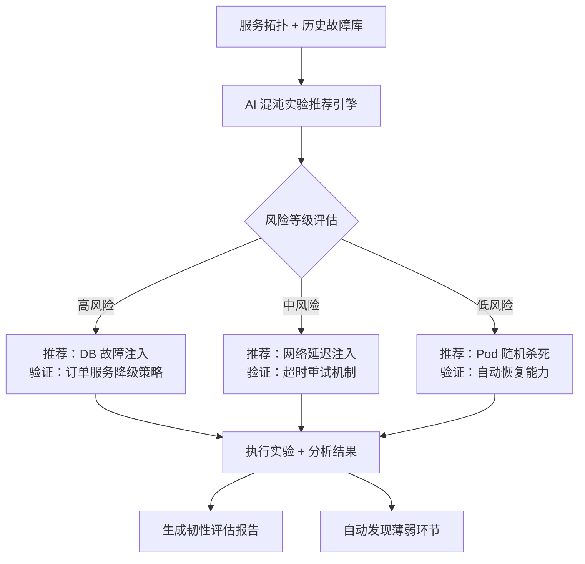

### AI 辅助故障诊断

当微服务系统发生故障时，快速定位问题是缩短 MTTR 的关键。传统的故障诊断依赖 SRE 工程师的经验和直觉，而 AI 辅助诊断通过以下方式加速这一过程：

**1. 自然语言故障查询**

借助 LLM，SRE 工程师可以用自然语言描述问题，AI 系统自动查询相关指标、日志和 Trace 数据：

```
SRE: "订单服务今天下午 2 点开始 P99 延迟升高，帮忙排查"

AI Agent 执行步骤：
1. 查询 order-service 14:00-15:00 的 P99 延迟趋势 → 确认异常
2. 检查该时段 error rate → 发现 5xx 从 0.1% 升至 3.5%
3. 分析 Trace 数据 → 定位到 payment-service 调用延迟异常
4. 检查 payment-service 指标 → 发现 DB 连接池使用率达 95%
5. 查询 slow query log → 发现一条新增的全表扫描 SQL
6. 根因结论：新上线的代码引入了缺少索引的查询条件

修复建议：
1. 紧急：为该查询条件添加数据库索引
2. 临时：对 payment-service 限流，保护 DB 连接池
3. 长期：SQL 上线前增加 Explain 审查环节
```

**2. 多数据源关联分析**

AI 故障诊断的核心能力在于跨数据源的关联分析——将 Metrics 异常、Logs 错误和 Traces 超时自动关联：

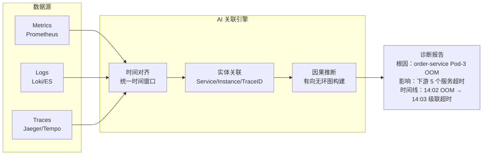

## 智能容量规划：从经验估算到预测驱动

### 传统容量规划的困境

在系列第 30 讲中，我们详细讨论了微服务的容量规划。传统的容量规划方式通常是：

1. 基于历史峰值估算未来需求
2. 预留 20%-30% 的冗余水位
3. 大促前手动扩容

这种方式存在两个突出问题：**过度配置导致资源浪费**（据 CNCF 2024 调查，Kubernetes 集群平均资源利用率仅 30%-40%）和**配置不足导致稳定性风险**（突发流量超出预期引发服务雪崩）。

### 基于预测模型的弹性伸缩

AI 驱动的容量规划核心思路是：**用预测模型替代经验估算，用自动伸缩替代手动扩容**。

**1. 时序预测模型选型**

| 模型 | 适用场景 | 预测粒度 | 训练成本 | 可解释性 |
|------|----------|----------|----------|----------|
| Prophet | 日/周周期性流量 | 小时级 | 低 | 高 |
| ARIMA | 平稳时序 | 分钟级 | 低 | 中 |
| LSTM/GRU | 复杂非线性模式 | 分钟级 | 高 | 低 |
| Transformer（Temporal Fusion） | 多变量联合预测 | 分钟级 | 高 | 中 |
| N-BEATS | 纯时序预测（无需特征工程） | 多粒度 | 中 | 低 |

对于微服务容量预测，推荐采用 **Prophet + LSTM 的混合方案**：Prophet 捕捉周期性模式（日周期、周周期），LSTM 捕捉残差中的非线性模式。

```python
# 混合预测模型示例
# 依赖：prophet>=1.1, tensorflow>=2.15
import numpy as np
import pandas as pd
from prophet import Prophet

class HybridCapacityForecaster:
    """Prophet + LSTM 混合容量预测器"""

    def __init__(self, service_name: str,
                 forecast_horizon: str = "24h",
                 single_instance_capacity: float = 100.0):
        self.service_name = service_name
        self.forecast_horizon = forecast_horizon
        # 单实例容量基线（QPS），由压测得出
        self.single_instance_capacity = single_instance_capacity
        self.prophet_model = Prophet(
            yearly_seasonality=True,
            weekly_seasonality=True,
            daily_seasonality=True,
            changepoint_prior_scale=0.05
        )

    def train(self, metrics_df: pd.DataFrame):
        """
        metrics_df: columns = [ds, y]
        ds: datetime, y: QPS 或资源利用率
        """
        # 第一层：Prophet 捕捉周期性
        self.prophet_model.fit(metrics_df)

        # 计算残差
        forecast = self.prophet_model.predict(metrics_df)
        residuals = metrics_df['y'].values - \
                    forecast['yhat'].values

        # 第二层：LSTM 捕捉残差中的非线性模式
        # 此处简化，实际需构建序列窗口
        self.residual_mean = np.mean(residuals)
        self.residual_std = np.std(residuals)

    def predict(self, future_df: pd.DataFrame) -> pd.DataFrame:
        """预测未来流量"""
        # Prophet 周期性预测
        prophet_forecast = self.prophet_model.predict(future_df)

        # 合并预测结果
        result = prophet_forecast[['ds', 'yhat']].copy()
        result.columns = ['timestamp', 'predicted_qps']

        # 添加置信区间
        result['lower_bound'] = prophet_forecast['yhat_lower']
        result['upper_bound'] = prophet_forecast['yhat_upper']

        # 容量建议：基于预测值 + 安全余量
        safety_margin = 1.2  # 20% 安全余量
        result['recommended_instances'] = np.ceil(
            result['predicted_qps'] * safety_margin /
            self.single_instance_capacity
        )

        return result
```

**2. 预测性弹性伸缩（Predictive HPA）**

Kubernetes 原生的 HPA（Horizontal Pod Autoscaler）是反应式的——指标超出阈值后才触发扩容，存在 1-3 分钟的延迟。预测性 HPA 在流量高峰到来前提前扩容，实现零延迟应对：

```yaml
# Predictive HPA 配置示例（基于 KEDA + 自定义预测指标）
# Kubernetes 1.30+, KEDA 2.14+
apiVersion: keda.sh/v1alpha1
kind: ScaledObject
metadata:
  name: order-service-predictive
  namespace: production
spec:
  scaleTargetRef:
    name: order-service
  minReplicaCount: 3
  maxReplicaCount: 50
  cooldownPeriod: 60
  triggers:
    # 实时指标触发器（反应式）
    - type: prometheus
      metadata:
        serverAddress: http://prometheus:9090
        metricName: http_requests_per_second
        threshold: "1000"
        query: >
          sum(rate(http_requests_total{
            service="order-service"
          }[1m]))
    # 预测指标触发器（预测式）
    - type: prometheus
      metadata:
        serverAddress: http://prometheus:9090
        metricName: predicted_qps_30m_ahead
        threshold: "800"
        query: >
          predicted_qps{
            service="order-service",
            horizon="30m"
          }
```

预测性伸缩的关键参数：

| 参数 | 推荐值 | 说明 |
|------|--------|------|
| 预测窗口（horizon） | 15-30 分钟 | 需覆盖实例启动时间 |
| 预测更新频率 | 5 分钟 | 平衡计算成本与时效性 |
| 安全余量 | 15%-25% | 根据预测误差调整 |
| 缩容冷却期 | 5-10 分钟 | 避免缩容后立即又需扩容 |

**3. 容量规划决策流程**

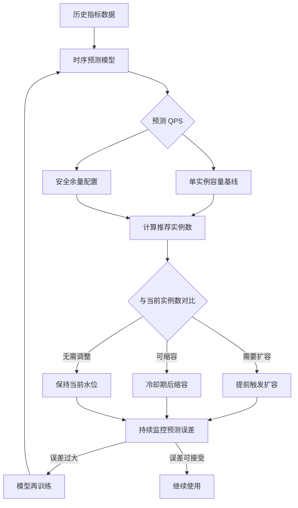

## AI 辅助故障诊断：日志、Trace 与自动根因

### 智能日志分析

微服务系统的日志分析面临"大海捞针"的困境。一个中等规模的微服务系统，日均日志量可达 TB 级别，其中 99% 以上是正常日志。如何从海量日志中快速定位异常信息，是故障诊断的第一步。

**1. 日志模式挖掘（Log Pattern Mining）**

AI 日志分析的第一步是将非结构化日志进行模式化处理。以 Drain 算法为代表的日志解析方法，能将原始日志抽象为日志模板：

```
原始日志:
2025-01-15 14:02:03 [ERROR] OrderService - Failed to process order #12345: connection timeout to payment-service:8080
2025-01-15 14:02:04 [ERROR] OrderService - Failed to process order #12346: connection timeout to payment-service:8080
2025-01-15 14:02:05 [ERROR] OrderService - Failed to process order #12347: connection timeout to payment-service:8080

日志模板（Drain 算法输出）:
[ERROR] OrderService - Failed to process order <*>, connection timeout to payment-service:8080

统计：3 次 / 3秒（异常突增）
```

**2. LLM 驱动的日志理解**

传统日志模式挖掘能发现"什么模式出现了"，但无法理解"这意味着什么"。LLM 的引入使得日志分析从模式识别升级为语义理解：

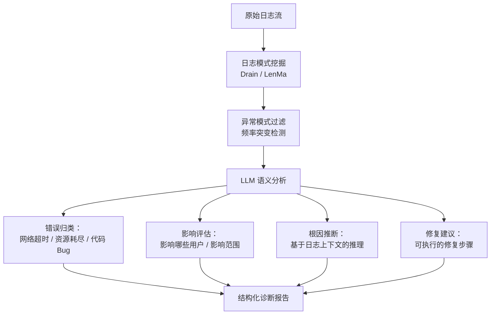

**3. 日志异常检测实战**

```python
# 基于 LLM 的日志异常分析示例
# Python 3.11+
import json
from dataclasses import dataclass

@dataclass
class LogAnomaly:
    timestamp: str
    service: str
    log_template: str
    anomaly_type: str
    severity: str
    root_cause_hypothesis: str
    suggested_action: str

class LLMLogAnalyzer:
    """LLM 驱动的日志异常分析器"""

    ANALYSIS_PROMPT = """
    你是一位微服务运维专家。请分析以下异常日志模式：

    服务：{service}
    时间窗口：{time_window}
    异常日志模式：{log_pattern}
    出现频率：{frequency}（基线：{baseline}）
    关联指标变化：{related_metrics}

    请输出 JSON 格式：
    {{
        "anomaly_type": "网络超时/资源耗尽/代码缺陷/配置错误/安全事件",
        "severity": "P0/P1/P2/P3",
        "root_cause_hypothesis": "根因假设",
        "confidence": 0.0-1.0,
        "suggested_actions": ["动作1", "动作2"],
        "affected_services": ["服务列表"]
    }}
    """

    def analyze(self, anomaly_context: dict) -> LogAnomaly:
        prompt = self.ANALYSIS_PROMPT.format(**anomaly_context)
        # 调用 LLM API（Claude / GPT-4 / 本地模型）
        response = self._call_llm(prompt)
        result = json.loads(response)

        return LogAnomaly(
            timestamp=anomaly_context["time_window"],
            service=anomaly_context["service"],
            log_template=anomaly_context["log_pattern"],
            anomaly_type=result["anomaly_type"],
            severity=result["severity"],
            root_cause_hypothesis=result["root_cause_hypothesis"],
            suggested_action="; ".join(result["suggested_actions"])
        )
```

### Trace 智能分析

分布式链路追踪（Distributed Tracing）是微服务可观测性的重要支柱，但 Trace 数据量大且结构复杂。一个请求可能跨越 10+ 个服务，产生数十个 Span，人工分析耗时耗力。

**1. Trace 异常自动检测**

AI 对 Trace 数据的分析主要包括三个维度：

| 分析维度 | 方法 | 目标 |
|----------|------|------|
| 延迟异常 | 统计每个 Span 的延迟分布，识别离群点 | 找到延迟瓶颈节点 |
| 错误传播 | 沿调用链追踪 Error Span 的传播路径 | 定位首次出错的节点 |
| 拓扑异常 | 对比正常/异常时段的服务调用拓扑差异 | 发现新增/缺失的调用关系 |

**2. 关键路径分析**

在微服务调用链中，延迟的关键路径（Critical Path）决定了请求的总耗时。AI 可以自动识别关键路径并标注优化建议：

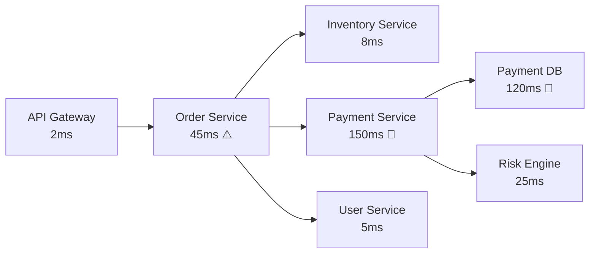

AI 分析结论：
- 关键路径：API Gateway → Order Service → Payment Service → Payment DB
- 瓶颈节点：Payment DB（120ms），占总延迟的 60%
- 优化建议：为 Payment DB 慢查询添加索引 / 引入缓存层

**3. Trace 对比分析**

当系统出现间歇性性能退化时，AI 可以对比"正常 Trace"和"异常 Trace"的差异，自动发现异常模式：

```
正常请求（P50）: Gateway[2ms] → Order[15ms] → Payment[30ms] → DB[10ms] = 57ms
异常请求（P99）: Gateway[2ms] → Order[45ms] → Payment[150ms] → DB[120ms] = 317ms

差异分析：
- DB 延迟增长 12x → 根因候选 #1
- Payment 延迟增长 5x → 由 DB 延迟传导
- Order 延迟增长 3x → 由 Payment 延迟传导
```

### 自动根因定位系统

将日志分析、Trace 分析和指标异常检测结合起来，可以构建端到端的自动根因定位系统：

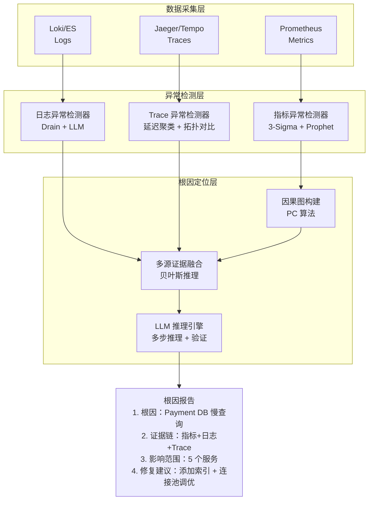

这一系统的核心流程是：

1. **异常检测层**独立运行，分别从 Metrics、Logs、Traces 中检测异常
2. **因果图构建**基于指标间的 Granger 因果关系，构建有向无环图（DAG）
3. **多源证据融合**使用贝叶斯推理，综合来自不同数据源的证据，计算每个候选根因的后验概率
4. **LLM 推理引擎**对排名靠前的候选根因进行多步推理验证，输出最终结论

## AI 辅助安全：从被动防御到主动检测

### 微服务安全的新挑战

微服务架构的分布式特性带来了新的安全挑战：

- **攻击面扩大**：每个微服务暴露的 API 都是潜在的攻击点
- **东西向流量风险**：服务间通信被攻破后，攻击者可横向移动
- **依赖链风险**：一个服务的漏洞可能影响整条调用链
- **配置漂移**：数百个服务的安全配置难以保持一致

### 异常流量检测

AI 驱动的异常流量检测是微服务安全的第一道防线。相比传统的基于规则的 WAF（Web Application Firewall），AI 检测能识别未知攻击模式：

**1. 流量基线建模**

对每个微服务的正常流量模式建立基线，包括：

- 请求频率（QPS）的时间分布
- 请求参数的统计特征（长度、类型、取值范围）
- 调用来源的服务分布
- 响应码的比例分布

```python
# 流量基线建模示例
# Python 3.11+, scikit-learn >= 1.4
import numpy as np
from sklearn.ensemble import IsolationForest
from dataclasses import dataclass

@dataclass
class TrafficFeatures:
    qps: float
    avg_request_size: float
    error_rate: float
    unique_source_count: int
    p99_latency: float
    ratio_post_get: float  # POST/GET 请求比例

class TrafficAnomalyDetector:
    """微服务流量异常检测器"""

    def __init__(self, contamination: float = 0.01):
        self.model = IsolationForest(
            n_estimators=100,
            contamination=contamination,
            random_state=42
        )
        self.is_trained = False

    def train(self, normal_traffic: list[TrafficFeatures]):
        """基于正常流量训练基线模型"""
        X = np.array([
            [f.qps, f.avg_request_size, f.error_rate,
             f.unique_source_count, f.p99_latency,
             f.ratio_post_get]
            for f in normal_traffic
        ])
        self.model.fit(X)
        self.is_trained = True

    def detect(self, traffic: TrafficFeatures) -> dict:
        """检测流量异常"""
        if not self.is_trained:
            raise RuntimeError("Model not trained")

        X = np.array([[
            traffic.qps, traffic.avg_request_size,
            traffic.error_rate, traffic.unique_source_count,
            traffic.p99_latency, traffic.ratio_post_get
        ]])

        prediction = self.model.predict(X)[0]    # -1 = 异常
        score = self.model.score_samples(X)[0]   # 异常分数

        return {
            "is_anomaly": prediction == -1,
            "anomaly_score": float(score),
            "severity": self._calc_severity(score),
            "details": self._explain_anomaly(traffic)
        }

    def _calc_severity(self, score: float) -> str:
        if score < -0.5:
            return "CRITICAL"
        elif score < -0.3:
            return "HIGH"
        elif score < -0.1:
            return "MEDIUM"
        return "LOW"

    def _explain_anomaly(self, traffic: TrafficFeatures) -> str:
        explanations = []
        if traffic.error_rate > 0.1:
            explanations.append("错误率异常升高")
        if traffic.ratio_post_get > 5.0:
            explanations.append("POST 请求比例异常（疑似暴力提交）")
        if traffic.unique_source_count < 2 and traffic.qps > 1000:
            explanations.append("单一来源高频请求（疑似 DDoS）")
        return "; ".join(explanations) or "综合特征异常"
```

**2. API 行为分析**

更细粒度的安全检测需要对 API 行为进行建模。AI 可以学习每个 API 的正常请求模式，识别异常调用：

- 用户 A 通常只查询自己的订单，突然批量查询他人订单 → 越权风险
- 某个 API 的请求体大小突然增加 10 倍 → 注入攻击风险
- 深夜时段出现大量管理员 API 调用 → 凭证泄露风险

### 漏洞自动修复

传统漏洞修复流程是：漏洞扫描 → 人工评估 → 手动修复 → 测试验证 → 部署上线，周期通常为数天到数周。AI 辅助的漏洞修复将这一流程压缩到数小时甚至数分钟。

**1. 依赖漏洞自动升级**

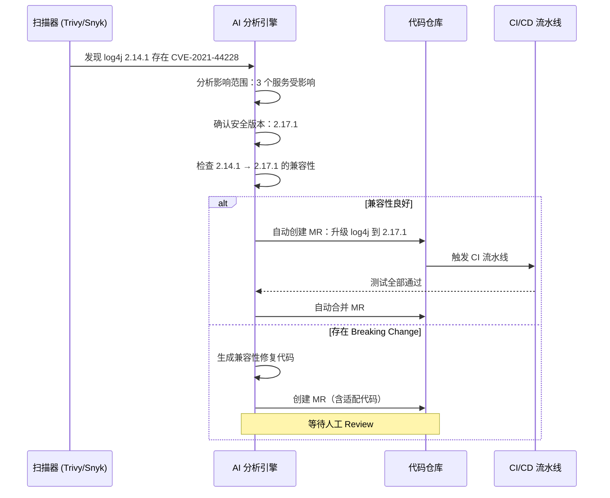

**2. 代码漏洞自动修复**

LLM 可以理解漏洞原理并生成修复代码。例如，对于 SQL 注入漏洞：

```java
// 漏洞代码（SQL 注入风险）
public User findUser(String username) {
    String sql = "SELECT * FROM users WHERE username = '"
                 + username + "'";
    return jdbcTemplate.queryForObject(sql, userRowMapper);
}

// AI 自动生成的修复代码（参数化查询）
public User findUser(String username) {
    String sql = "SELECT * FROM users WHERE username = ?";
    return jdbcTemplate.queryForObject(
        sql, userRowMapper, username);
}
```

**3. 安全策略自动生成**

基于微服务的拓扑和流量模式，AI 可以自动生成 Service Mesh 的安全策略：

```yaml
# AI 生成的 Istio AuthorizationPolicy
# Istio 1.21+
apiVersion: security.istio.io/v1
kind: AuthorizationPolicy
metadata:
  name: order-service-access
  namespace: production
spec:
  selector:
    matchLabels:
      app: order-service
  rules:
    # 仅允许以下服务访问 order-service
    - from:
        - source:
            principals:
              - "cluster.local/ns/production/sa/api-gateway"
              - "cluster.local/ns/production/sa/user-service"
      to:
        - operation:
            methods: ["GET", "POST"]
            paths: ["/api/v1/orders/*"]
    # 管理接口仅限运维命名空间访问
    - from:
        - source:
            namespaces: ["ops"]
      to:
        - operation:
            methods: ["GET"]
            paths: ["/admin/*"]
```

## 技术演进时间线

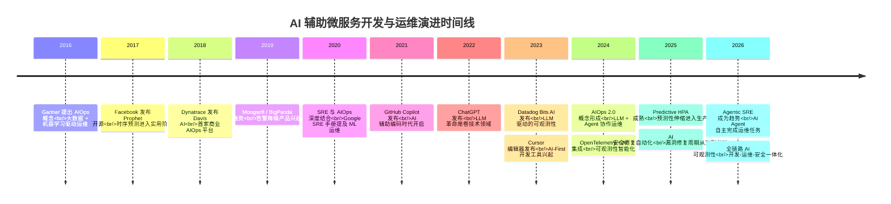

## 架构决策指南

在不同规模和成熟度下，AI 辅助微服务开发和运维的落地策略应有所差异：

| 决策维度 | 初创期（<50 服务） | 成长期（50-200 服务） | 成熟期（>200 服务） |
|----------|-------------------|----------------------|---------------------|
| **智能告警** | Prometheus 静态规则 + 简单 3-Sigma | 引入 Prophet 周期检测 + 告警聚合平台 | 全链路异常检测 + LLM 根因分析 |
| **AI 辅助开发** | GitHub Copilot 个人版 | Cursor Team + .cursorrules 统一规范 | 定制化 AI Agent + 内部知识库 |
| **容量规划** | 手动扩容 + 经验估算 | Prophet 预测 + KEDA 弹性伸缩 | 混合预测模型 + Predictive HPA |
| **故障诊断** | 人工查看日志 + Trace | 日志模式挖掘 + Trace 关联 | 多源融合 + LLM 推理 + 自动根因 |
| **安全** | Trivy 扫描 + 人工修复 | AI 流量检测 + 依赖自动升级 | 行为分析 + 漏洞自动修复 + 策略自动生成 |
| **投入优先级** | AI 辅助开发 > 智能告警 | 智能告警 > 故障诊断 > 容量规划 | 故障诊断 > 安全 > 容量规划 |

### AIOps 平台选型参考

| 平台 | 核心能力 | 适用场景 | 定位 |
|------|----------|----------|------|
| Dynatrace Davis AI | 全栈根因分析、自动拓扑发现 | 大型企业、全栈可观测性 | 商业 AIOps 平台 |
| Datadog Bits AI | LLM 驱动查询、自然语言故障排查 | 中大型企业、多云环境 | 可观测性 + AI 增强平台 |
| PagerDuty AIOps | 告警聚合、噪声抑制、事件关联 | 告警管理、On-Call 优化 | 事件管理 + AI 增强平台 |
| BigPanda | 告警关联、根因推断、自动化修复 | 告警降噪、事件管理 | 事件智能平台 |
| Moogsoft | ML 异常检测、告警降噪 | 网络运维、电信行业 | AIOps 专用平台 |
| 自建方案 | OTel + Prometheus + ML Pipeline | 有 ML 能力的技术团队 | 定制化 AIOps |

### AI 辅助开发工具选型参考

| 工具 | 核心能力 | 适用场景 | 成本 |
|------|----------|----------|------|
| GitHub Copilot | 代码补全 + Chat + CLI | 通用编程、IDE 集成 | $10-39/月/人 |
| Cursor | 多文件编辑 + 项目级规则 | 项目开发、架构级代码生成 | $20-40/月/人 |
| Codeium | 免费代码补全 + Chat | 预算有限的团队 | 免费 / $12/月 |
| Amazon Q Developer | AWS 集成 + 安全扫描 | AWS 生态、安全合规 | $19/月/人 |
| Sourcegraph Cody | 全代码库搜索 + AI | 大型代码库、跨仓库理解 | 免费 / $9/月 |

## 小结

今天这篇文章，我们系统探讨了 AI 如何辅助微服务的开发与运维，覆盖了从 AIOps 演进到具体落地的完整链路。让我来总结几个核心要点：

**1. AIOps 正经历范式跃迁。** 从传统 ML 驱动的 AIOps 1.0，到 LLM + Agent 驱动的 AIOps 2.0，运维决策的主体正在从"人"向"AI"转移。人的角色从执行者变为审核者，但这并不意味着人可以被替代——AI 的价值在于放大人的能力，而非取代人的判断。

**2. 智能告警是 AIOps 落地的第一步。** 告警疲劳是微服务运维的头号敌人，基于 ML 的异常检测和告警聚合可以将告警噪声降低 90%。采用分层检测策略（统计快速检测 → 周期性检测 → ML 确认），可以兼顾实时性和准确率。

**3. AI 辅助开发已从锦上添花变为生产力必需。** GitHub Copilot 和 Cursor 等工具不仅提升了编码效率，更重要的是通过项目级规则（如 .cursorrules）确保了代码风格和架构约定的一致性。对于微服务开发，AI 在接口生成、配置文件编写、测试用例生成等场景的价值尤为显著。

**4. 预测性容量规划是降本增效的关键。** 基于 Prophet + LSTM 的混合预测模型，结合 KEDA 的 Predictive HPA，可以在流量高峰前提前扩容，实现零延迟应对，同时将资源利用率从 30%-40% 提升到 60%-70%。

**5. 端到端的自动根因定位需要多源融合。** 单一数据源的根因分析容易误判，将 Metrics、Logs、Traces 的异常检测结果通过因果图和贝叶斯推理进行融合，再由 LLM 进行多步推理验证，可以显著提升根因定位的准确率。

**6. AI 安全正在从检测走向自动修复。** 异常流量检测、依赖漏洞自动升级、代码漏洞自动修复、安全策略自动生成——AI 将安全响应周期从"天"压缩到"分钟"，这对微服务架构尤为关键。

最后需要强调的是，AI 辅助微服务开发与运维并非银弹。AI 模型本身存在误判风险，LLM 可能产生幻觉，自动化修复可能引入新问题。因此，**人在回路（Human-in-the-Loop）** 依然是不可忽视的原则——AI 提供建议和自动化执行，人负责审核和兜底。随着 AI 能力的持续进步，人机协作的边界会不断调整，但"AI 增强、人类决策"的基本范式在可预见的未来不会改变。

---

> **延伸阅读**：
> - Gartner: "Market Guide for AIOps Platforms"（最新版）
> - Google SRE Workbook: Chapter "Handling Overload" — 人工智能在过载保护中的应用
> - OpenTelemetry 官方文档：AI/ML 集成指南
> - Dynatrace Blog: "How Davis AI Works" 系列
> - CNCF: "Cloud Native AI Whitepaper"（2024）
