# 大模型服务化架构

> **版本基线**：vLLM 0.6+ | TGI 2.x | TensorRT-LLM 0.10+ | Kubernetes 1.30+
> **阅读时间**：约 25 分钟
> **前置知识**：[[06]] 如何实现RPC远程服务调用？ · [[33]] 下一代微服务架构ServiceMesh

## 概述

当大语言模型（Large Language Model, LLM）从实验室走向生产环境，它面临的第一个问题不是"模型够不够大"，而是"怎么把模型变成一个可用的服务"。一个 70B 参数的模型文件动辄上百 GB，推理一次需要占用整张 A100 GPU；而线上业务要求毫秒级响应、7x24 小时可用、支持万级并发——这和传统微服务的部署运维挑战完全不同。

**大模型服务化**（LLM as a Service）要解决的核心问题是：如何将一个静态的模型权重文件，转化为一套具备高可用、可伸缩、可观测的生产级服务架构。从推理引擎的选型，到 API 层的路由与限流，再到 RAG 管道的编排与 Agent 的工具调用，每一层都有独立的技术选型和架构决策。

本文将从推理服务部署、模型服务化架构、RAG 架构、大模型微服务化以及推理服务运维五个维度，系统阐述大模型服务化架构的设计与实践。

## 1 大模型服务化概述：LLM as a Service 的架构模式

### 1.1 从模型到服务：为什么需要服务化

传统微服务处理的是"业务逻辑"，代码体积以 MB 计，一个容器即可承载；而 LLM 服务处理的是"推理计算"，模型权重以 GB 乃至 TB 计，需要 GPU 等异构算力。二者的差异决定了 LLM 服务化必须面对以下独特挑战：

| 维度 | 传统微服务 | LLM 服务 |
|------|-----------|----------|
| 计算资源 | CPU 即可 | GPU/TPU 等异构算力 |
| 部署体积 | MB 级 | GB ~ TB 级 |
| 响应延迟 | 毫秒级 | 百毫秒 ~ 分钟级（流式输出） |
| 并发模型 | 请求-响应 | 流式生成（Token-by-Token） |
| 弹性伸缩 | 秒级扩缩容 | 分钟级（GPU 初始化 + 模型加载） |
| 冷启动 | 毫秒级 | 数十秒 ~ 数分钟（模型加载） |

### 1.2 LLM as a Service 的三层架构

一个典型的 LLM as a Service 架构可以划分为三层：

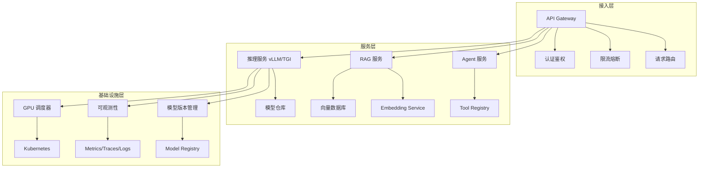

- **接入层**：API Gateway 负责统一入口，处理认证鉴权、限流熔断、请求路由等横切关注点；
- **服务层**：推理服务（vLLM/TGI 等）负责模型推理，RAG 服务负责检索增强生成，Agent 服务负责工具调用与任务编排；
- **基础设施层**：GPU 调度、可观测性、模型版本管理提供底层支撑。

### 1.3 服务化模式的演进

LLM 服务化经历了三个阶段的演进：

1. **单模型服务**：一个模型对应一个服务实例，直接暴露 HTTP/gRPC 接口，适合小规模验证；
2. **多模型网关**：通过 API Gateway 路由到不同的推理服务，支持模型切换和 A/B 测试，适合中等规模生产；
3. **全链路服务化**：推理服务 + RAG + Agent + 模型仓库形成完整的微服务拓扑，支持复杂业务场景。

## 2 推理服务部署：四大推理引擎选型

推理引擎是 LLM 服务化的核心组件，它决定了模型的加载方式、推理性能和资源利用率。当前主流的开源推理引擎有四个：vLLM、TGI、TensorRT-LLM 和 Triton Inference Server。

### 2.1 vLLM：高吞吐推理引擎

vLLM 是目前社区最活跃的开源 LLM 推理引擎，由 UC Berkeley 团队开发。其核心创新是 **PagedAttention** 机制——借鉴操作系统的虚拟内存分页思想，将 KV Cache 按块（Block）管理，解决了传统推理中 KV Cache 预分配导致的显存浪费问题。

vLLM 的关键特性包括：

- **PagedAttention**：KV Cache 显存利用率从传统方案的 20%~40% 提升到 90%+；
- **Continuous Batching**：请求到达即入队，完成即出队，相比 Static Batching 吞吐量提升 2x~4x；
- **Prefix Caching**：共享 Prompt 前缀的请求可复用 KV Cache，显著降低重复计算；
- **Speculative Decoding**：用小模型投机预测大模型的输出，加速推理过程；
- **多模态支持**：支持 LLaVA、Phi-3-Vision 等多模态模型；
- **OpenAI 兼容 API**：原生提供与 OpenAI API 兼容的接口，便于迁移。

```bash
# vLLM 0.6+ 启动示例
python -m vllm.entrypoints.openai.api_server \
  --model meta-llama/Llama-3.1-70B-Instruct \
  --tensor-parallel-size 4 \
  --max-model-len 8192 \
  --gpu-memory-utilization 0.9 \
  --enable-prefix-caching \
  --enable-chunked-prefill \
  --port 8000
```

### 2.2 TGI：HuggingFace 官方推理引擎

Text Generation Inference（TGI）是 HuggingFace 官方的 LLM 推理服务，深度集成 HuggingFace Model Hub，开箱即用。

TGI 的关键特性包括：

- **Flash Attention & Paged Attention**：支持多种注意力优化；
- **Continuous Batching**：基于 token 级别的动态批处理；
- **Watermark**：模型输出水印，用于内容溯源；
- **Safetensors 加载**：安全、快速的模型权重加载格式；
- **HuggingFace Hub 深度集成**：一键部署 Hub 上的模型；
- **量化和推测解码**：支持 GPTQ、AWQ 量化以及 Medusa 推测解码。

```bash
# TGI 2.x 启动示例
docker run --gpus all -p 8080:80 \
  -v $PWD/data:/data \
  ghcr.io/huggingface/text-generation-inference:2.0 \
  --model-id meta-llama/Llama-3.1-70B-Instruct \
  --num-shard 4 \
  --max-input-length 4096 \
  --max-total-tokens 8192 \
  --quantize awq
```

### 2.3 TensorRT-LLM：NVIDIA 极致性能方案

TensorRT-LLM 是 NVIDIA 推出的 LLM 推理优化库，基于 TensorRT 深度学习编译器，针对 NVIDIA GPU 进行了极致优化。

TensorRT-LLM 的关键特性包括：

- **Kernel Fusion**：将多个 GPU Kernel 融合为一个，减少显存访问次数；
- **In-Flight Batching**：NVIDIA 版本的 Continuous Batching；
- **Tensor Parallelism & Pipeline Parallelism**：支持张量并行和流水线并行；
- **FP8/INT8 量化**：支持多种精度量化，在保持精度的同时大幅提升吞吐；
- **KV Cache 复用**：支持跨请求的 KV Cache 复用；
- **NVIDIA GPU 专用**：与 NVIDIA 硬件深度绑定，性能最优但可移植性差。

```python
# TensorRT-LLM 模型构建示例 (TensorRT-LLM 0.10+)
from tensorrt_llm import LLM, SamplingParams

llm = LLM(model="meta-llama/Llama-3.1-70B-Instruct",
          tensor_parallel_size=4,
          kv_cache_type="paged",
          quantization="fp8")

sampling_params = SamplingParams(max_tokens=512, temperature=0.7)
outputs = llm.generate(["Hello, how are you?"], sampling_params)
```

### 2.4 Triton Inference Server：通用推理平台

Triton Inference Server（原 TensorRT Inference Server）是 NVIDIA 推出的通用推理服务平台，不仅支持 LLM，还支持 CV、语音等多种模型。

Triton 的关键特性包括：

- **多框架支持**：TensorRT、PyTorch、ONNX、OpenVINO 等多种后端；
- **Dynamic Batching**：自动将请求组成批次，提升 GPU 利用率；
- **Model Ensemble**：支持多模型串联流水线，适合 RAG 等多步骤推理场景；
- **Model Analyzer**：自动分析模型性能瓶颈；
- **多实例部署**：同一模型可部署多个实例，支持 GPU 和 CPU 混合部署。

### 2.5 四大引擎对比

| 特性 | vLLM | TGI | TensorRT-LLM | Triton |
|------|------|-----|--------------|--------|
| 开发者 | UC Berkeley / 社区 | HuggingFace | NVIDIA | NVIDIA |
| 核心优势 | 高吞吐 + 易用性 | Hub 集成 + 开箱即用 | 极致性能 | 通用推理平台 |
| GPU 支持 | NVIDIA / AMD | NVIDIA / AMD | NVIDIA Only | NVIDIA / CPU |
| KV Cache 管理 | PagedAttention | Paged Attention | Paged KV Cache | Dynamic Batching |
| Continuous Batching | 支持 | 支持 | 支持 | In-Flight Batching |
| 量化支持 | GPTQ/AWQ/FP8 | GPTQ/AWQ/FP8 | FP8/INT8/INT4 | 多种精度 |
| 流式输出 | SSE | SSE | SSE | SSE |
| OpenAI API 兼容 | 原生支持 | 部分兼容 | 需封装 | 需封装 |
| 多模态 | 支持 | 支持 | 支持 | 支持 |
| 部署复杂度 | 低 | 低（Docker） | 高（需编译） | 中 |
| 社区活跃度 | 极高 | 高 | 中 | 中 |
| 适用场景 | 通用 LLM 推理 | 快速部署 / 原型 | 极致性能生产 | 多模型混合推理 |

**选型建议**：初创团队和快速验证首选 vLLM；需要与 HuggingFace 生态深度集成选 TGI；对延迟和吞吐有极致要求且全量使用 NVIDIA GPU 选 TensorRT-LLM；需要同时服务 LLM 和非 LLM 模型选 Triton。

## 3 模型服务化架构：API Gateway → 推理服务 → 模型仓库

将推理引擎部署起来只是第一步，要让它成为生产级服务，还需要 API Gateway 做流量管控，推理服务做计算执行，模型仓库做版本管理。

### 3.1 整体架构

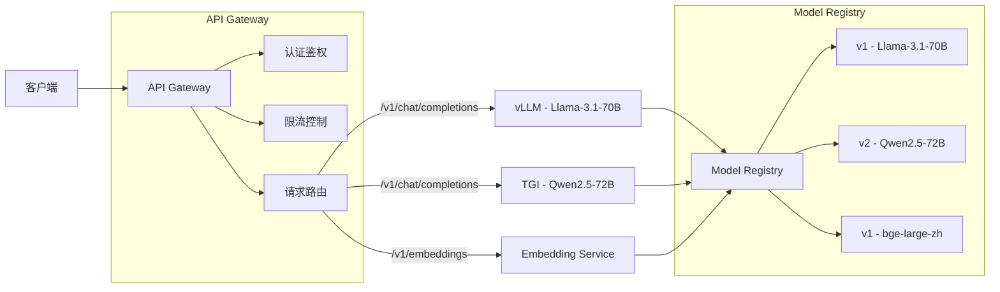

### 3.2 API Gateway：LLM 服务的流量入口

LLM 服务的 API Gateway 与传统微服务的 API Gateway 有相似之处，但需要额外关注以下几个问题：

**（1）流式响应代理**

LLM 推理的典型模式是 Streaming——服务端逐 Token 生成并通过 SSE（Server-Sent Events）推送给客户端。Gateway 需要支持流式代理，不能缓冲整个响应再转发。

```11-Nginx基础概述
# Nginx 流式代理配置
location /v1/chat/completions {
    proxy_pass http://vllm-backend;
    proxy_http_version 1.1;
    proxy_set_header Connection '';
    proxy_buffering off;           # 关键：禁用响应缓冲
    proxy_cache off;
    chunked_transfer_encoding on;
    proxy_read_timeout 300s;       # LLM 推理可能较慢
}
```

**（2）Token 级限流**

传统微服务按"请求数/QPS"限流，但 LLM 服务的成本取决于 Token 数量。因此需要按 Token 用量限流，防止个别用户消耗过多资源。

```python
# Token 级限流示例（基于 Redis 滑动窗口）
import redis

class TokenRateLimiter:
    def __init__(self, redis_client: redis.Redis, max_tokens_per_minute: int):
        self.redis = redis_client
        self.limit = max_tokens_per_minute

    def allow_request(self, user_id: str, estimated_tokens: int) -> bool:
        key = f"token_limit:{user_id}"
        current = int(self.redis.get(key) or 0)
        if current + estimated_tokens > self.limit:
            return False
        pipe = self.redis.pipeline()
        pipe.incrby(key, estimated_tokens)
        pipe.expire(key, 60)
        pipe.execute()
        return True
```

**（3）请求路由策略**

当后端部署了多个模型或同一模型的多个版本时，Gateway 需要根据请求参数路由到不同的推理服务：

- **按模型路由**：请求中的 `model` 字段决定路由目标；
- **按版本路由**：支持 A/B 测试和灰度发布，按比例分配流量；
- **按优先级路由**：付费用户路由到高性能实例，免费用户路由到普通实例；
- **Fallback 路由**：主模型不可用时自动切换到备用模型。

### 3.3 推理服务：核心计算引擎

推理服务是整个架构的核心，它的职责是接收请求、执行推理、返回结果。在微服务架构中，推理服务需要关注以下几点：

**（1）多副本部署与负载均衡**

单个推理服务实例通常独占一张或多张 GPU，无法像 CPU 服务那样在单机上部署多个实例。因此 LLM 推理服务的水平扩展依赖于多实例部署，负载均衡策略通常采用：

- **最少连接数**：优先将请求分配给当前处理请求数最少的实例，适用于推理延迟差异较大的场景；
- **一致性哈希**：按 Prompt 前缀哈希，配合 Prefix Caching 提高缓存命中率；
- **加权轮询**：根据 GPU 型号和负载分配不同权重。

**（2）健康检查与就绪探针**

推理服务的健康检查不能仅检查进程存活，还需要检查模型是否加载完成、GPU 是否可用：

```yaml
# Kubernetes 健康检查配置
apiVersion: v1
kind: Pod
spec:
  containers:
  - name: vllm
    image: vllm/vllm-openai:latest
    readinessProbe:
      httpGet:
        path: /health
        port: 8000
      initialDelaySeconds: 120   # 模型加载需要时间
      periodSeconds: 10
    livenessProbe:
      httpGet:
        path: /health
        port: 8000
      initialDelaySeconds: 180
      periodSeconds: 30
```

### 3.4 模型仓库：模型版本管理

模型仓库（Model Registry）是 LLM 服务化中容易被忽视但至关重要的组件。它解决的问题包括：模型版本管理、模型分发、模型元数据存储。

**（1）模型仓库的职责**

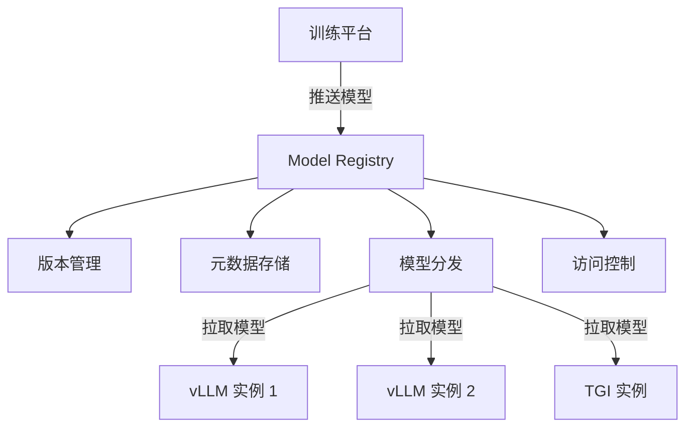

**（2）主流模型仓库方案**

| 方案 | 类型 | 特点 |
|------|------|------|
| HuggingFace Hub | SaaS / 自托管 | 社区最活跃，模型最丰富 |
| MLflow Model Registry | 自托管 | 与 MLflow 实验追踪集成 |
| NVIDIA NGC | SaaS | NVIDIA 官方模型仓库 |
| MinIO + 自研 | 自托管 | 灵活可控，适合私有化部署 |
| JFrog Artifactory | 自托管 / SaaS | 企业级制品仓库，支持模型管理 |

**（3）模型分发策略**

大模型文件动辄数十 GB，模型分发是推理服务启动速度的关键瓶颈：

- **预加载**：将模型文件预置在 GPU 节点的本地存储上，避免网络传输；
- **P2P 分发**：使用 BitTorrent 或 Dragonfly 等 P2P 协议加速模型分发；
- **分层加载**：支持模型分片（Shard）按需加载，先加载关键层即可开始推理。

## 4 RAG 架构：向量数据库 + Embedding + LLM

大模型的知识来自于训练数据，存在"知识截止"和"幻觉"两大问题。RAG（Retrieval-Augmented Generation，检索增强生成）通过在推理时检索外部知识库，为模型提供最新、准确的信息，是当前 LLM 落地最主流的架构模式。

### 4.1 RAG 的基本流程

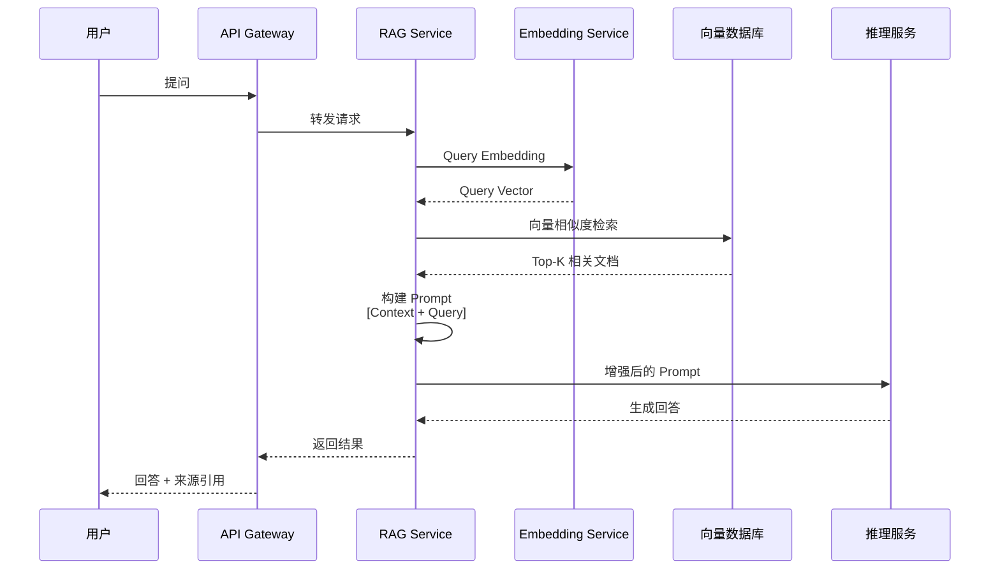

RAG 的核心流程是"检索-增强-生成"三步：

1. **检索（Retrieval）**：将用户查询通过 Embedding 模型转换为向量，在向量数据库中检索最相关的文档片段；
2. **增强（Augmentation）**：将检索到的文档片段作为上下文，与用户查询组合成增强的 Prompt；
3. **生成（Generation）**：将增强后的 Prompt 输入 LLM，生成最终回答。

### 4.2 Embedding Service：文本向量化服务

Embedding Service 负责将文本转换为高维向量，是 RAG 的"翻译器"。常见的 Embedding 模型包括：

| 模型 | 维度 | 语言 | 特点 |
|------|------|------|------|
| bge-large-zh-v1.5 | 1024 | 中/英 | BAAI 开源，中文效果优秀 |
| bge-m3 | 1024 | 多语言 | 支持稠密+稀疏+多粒度检索 |
| text-embedding-3-large | 3072 | 多语言 | OpenAI 闭源，效果最好 |
| gte-Qwen2-7B-instruct | 3584 | 多语言 | 基于大模型的 Embedding |
| Cohere embed-v3 | 1024 | 多语言 | 支持不同检索场景类型 |

Embedding Service 通常也部署为独立微服务，使用 vLLM 或 TEI（Text Embeddings Inference）作为推理引擎：

```bash
# TEI 启动示例
docker run --gpus all -p 8080:80 \
  ghcr.io/huggingface/text-embeddings-inference:latest \
  --model-id BAAI/bge-large-zh-v1.5 \
  --pooling cls \
  --max-batch-tokens 65536
```

### 4.3 向量数据库：存储与检索

向量数据库是 RAG 架构的"记忆中枢"，负责存储文档向量并支持高效的相似度检索。

**（1）主流向量数据库对比**

| 数据库 | 类型 | 索引算法 | 分布式 | 适用规模 |
|--------|------|----------|--------|----------|
| Milvus | 专用 | IVF/HNSW/DiskANN | 支持 | 亿级向量 |
| Pinecone | SaaS | 私有算法 | 原生 | 亿级向量 |
| Weaviate | 专用 | HNSW | 支持 | 千万级向量 |
| Qdrant | 专用 | HNSW | 支持 | 千万级向量 |
| pgvector | 扩展 | IVFFlat/HNSW | 依赖 PG | 百万级向量 |
| Elasticsearch | 通用 | HNSW | 原生 | 千万级向量 |
| Chroma | 轻量 | HNSW | 不支持 | 十万级向量 |

**（2）索引选型指南**

- **HNSW**：高召回率、低延迟，但内存占用大，适合千万级以下规模；
- **IVF + PQ**：内存友好，适合亿级规模，但需要调参；
- **DiskANN**：磁盘索引，适合超大规模（十亿级），延迟略高。

### 4.4 RAG 的进阶架构：从朴素 RAG 到高级 RAG

朴素 RAG 在实际生产中往往效果不理想，常见问题包括：检索不准确、上下文过长导致信息稀释、缺乏多轮对话记忆等。进阶的 RAG 架构通过以下手段解决：

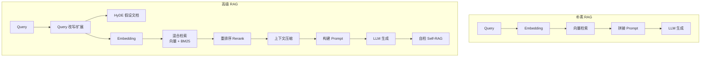

- **Query 改写**：使用 LLM 对原始查询进行改写或扩展，生成更适合检索的查询；
- **HyDE（Hypothetical Document Embedding）**：先让 LLM 生成假设性答案，再用假设答案的 Embedding 去检索；
- **混合检索**：向量检索 + BM25 关键词检索，兼顾语义相似和词汇匹配；
- **Rerank**：使用 Cross-Encoder 对检索结果重新排序，提高相关性；
- **上下文压缩**：对检索到的长文档进行摘要或裁剪，减少输入 Token 数；
- **Self-RAG**：让 LLM 自我评估检索结果的相关性和回答的准确性。

### 4.5 RAG 微服务化架构

在生产环境中，RAG 的各个组件通常被拆分为独立的微服务：

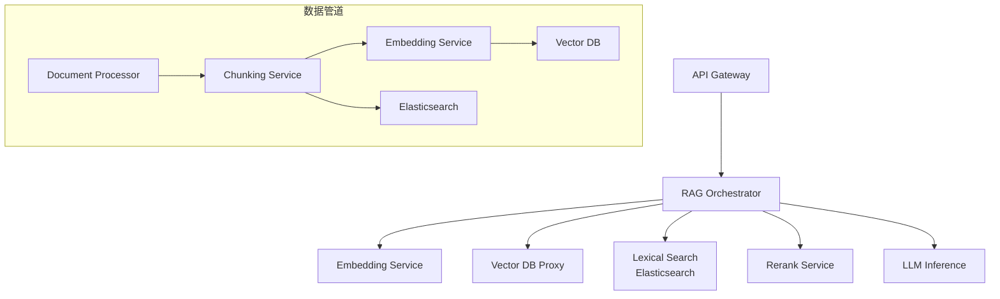

- **RAG Orchestrator**：编排检索-增强-生成流程，负责调用各微服务并组装结果；
- **Document Processor**：文档解析与预处理，支持 PDF、Word、HTML 等格式；
- **Chunking Service**：文档分块，支持按长度、按语义、按结构分块；
- **Vector DB Proxy**：向量数据库的访问代理，封装索引管理和查询逻辑；
- **Rerank Service**：使用 Cross-Encoder 模型对检索结果重排序。

## 5 大模型微服务化：Agent 架构、Tool Calling、Function Calling

当 LLM 从"问答"走向"行动"，就需要 Agent 架构——让 LLM 不仅能生成文本，还能调用工具、执行任务、与环境交互。

### 5.1 Agent 架构概述

Agent 的核心思想是让 LLM 成为"大脑"，通过 Tool Calling 与外部世界交互：

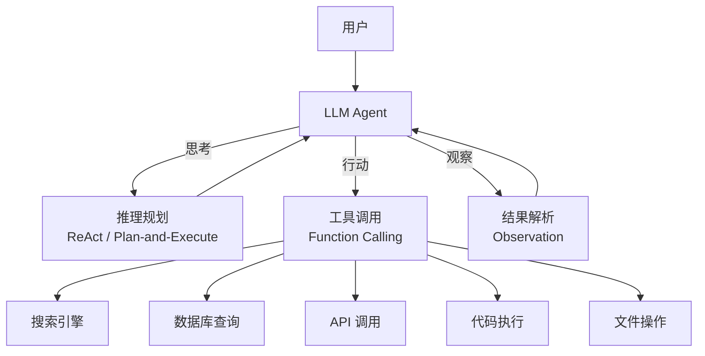

Agent 的典型工作循环遵循 **ReAct（Reasoning + Acting）** 模式：

1. **Thought**：LLM 分析当前状态，决定下一步行动；
2. **Action**：LLM 选择一个工具并构造调用参数；
3. **Observation**：工具返回执行结果，LLM 根据结果继续推理；
4. 重复上述步骤，直到任务完成。

### 5.2 Function Calling / Tool Calling 协议

Function Calling（也叫 Tool Calling）是 LLM 与外部工具交互的标准协议。各大模型厂商均已支持：

**（1）OpenAI Function Calling**

```json
// 请求：定义工具 + 用户提问
{
  "model": "gpt-4o",
  "messages": [
    {"role": "user", "content": "北京今天天气怎么样？"}
  ],
  "tools": [
    {
      "type": "function",
      "function": {
        "name": "get_weather",
        "description": "获取指定城市的天气信息",
        "parameters": {
          "type": "object",
          "properties": {
            "city": {
              "type": "string",
              "description": "城市名称"
            }
          },
          "required": ["city"]
        }
      }
    }
  ]
}
```

```json
// 响应：LLM 决定调用工具
{
  "choices": [{
    "message": {
      "role": "assistant",
      "content": null,
      "tool_calls": [{
        "id": "call_abc123",
        "type": "function",
        "function": {
          "name": "get_weather",
          "arguments": "{\"city\": \"北京\"}"
        }
      }]
    }
  }]
}
```

**（2）Function Calling 的服务化实现**

在微服务架构中，Function Calling 涉及三个组件的协作：

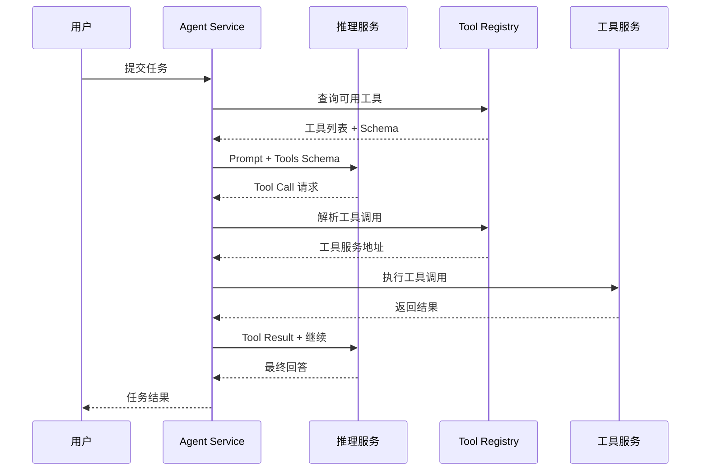

- **Agent Service**：编排 LLM 推理和工具调用的循环；
- **Tool Registry**：工具注册中心，管理工具的 Schema、地址、权限；
- **Tool Service**：具体的工具实现，以微服务形式部署。

### 5.3 Tool Registry 设计

Tool Registry 是 Agent 微服务化架构中的关键组件，类似于传统微服务中的注册中心：

```python
# Tool Registry 数据模型
from dataclasses import dataclass
from typing import Any

@dataclass
class ToolDefinition:
    name: str                    # 工具名称
    description: str             # 工具描述
    parameters: dict[str, Any]   # JSON Schema 参数定义
    endpoint: str                # 工具服务地址
    method: str                  # HTTP 方法
    auth_required: bool          # 是否需要认证
    timeout_ms: int              # 超时时间
    rate_limit: int              # 速率限制（QPS）
    version: str                 # 工具版本
```

工具的注册、发现和调用流程：

1. **注册**：工具服务启动时向 Tool Registry 注册自己的 Schema 和地址；
2. **发现**：Agent Service 从 Tool Registry 获取当前可用的工具列表；
3. **调用**：Agent Service 根据 LLM 返回的 Tool Call，通过 Tool Registry 解析出目标地址并调用。

### 5.4 多 Agent 协作架构

复杂任务需要多个 Agent 协作完成，常见的多 Agent 架构包括：

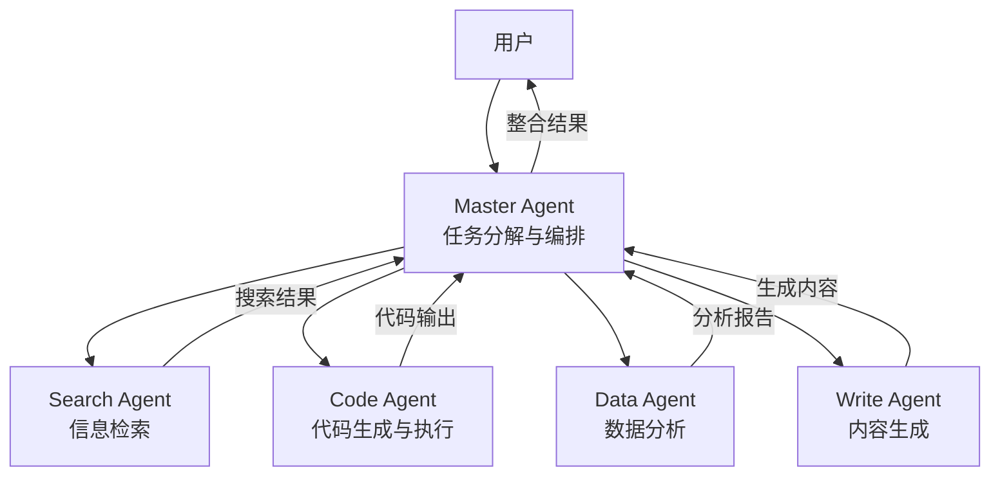

- **Master-Worker**：一个主 Agent 负责任务分解和结果整合，多个子 Agent 各司其职；
- **Pipeline**：多个 Agent 串联成流水线，前一个 Agent 的输出是后一个的输入；
- **Debate**：多个 Agent 辩论式协作，互相质疑和补充，提高输出质量；
- **Hierarchical**：层级式 Agent 架构，高层 Agent 负责战略决策，低层 Agent 负责战术执行。

### 5.5 Agent 的微服务化挑战

将 Agent 架构微服务化，需要解决以下挑战：

| 挑战 | 描述 | 应对策略 |
|------|------|----------|
| 长时运行 | Agent 循环可能持续数分钟 | 异步执行 + 事件通知 |
| 状态管理 | 多轮推理需要维护对话状态 | Redis / 数据库持久化 |
| 工具超时 | 外部工具调用可能超时 | 超时重试 + 降级策略 |
| 成本控制 | Agent 循环可能消耗大量 Token | 循环次数限制 + Token 预算 |
| 可观测性 | 多 Agent 调用链路复杂 | 分布式追踪 + Agent Trace |
| 安全风险 | LLM 可能生成恶意工具调用 | 工具白名单 + 参数校验 + 人工审批 |

## 6 推理服务运维：GPU 调度、模型版本管理、A/B 测试、弹性伸缩

推理服务上线后，运维的复杂度远超传统微服务。GPU 资源昂贵且稀缺，模型版本更新频繁，流量波动大——这些都对运维提出了更高的要求。

### 6.1 GPU 调度

GPU 是 LLM 推理最核心也是最昂贵的资源。高效的 GPU 调度是降低成本的关键。

**（1）GPU 资源模型**

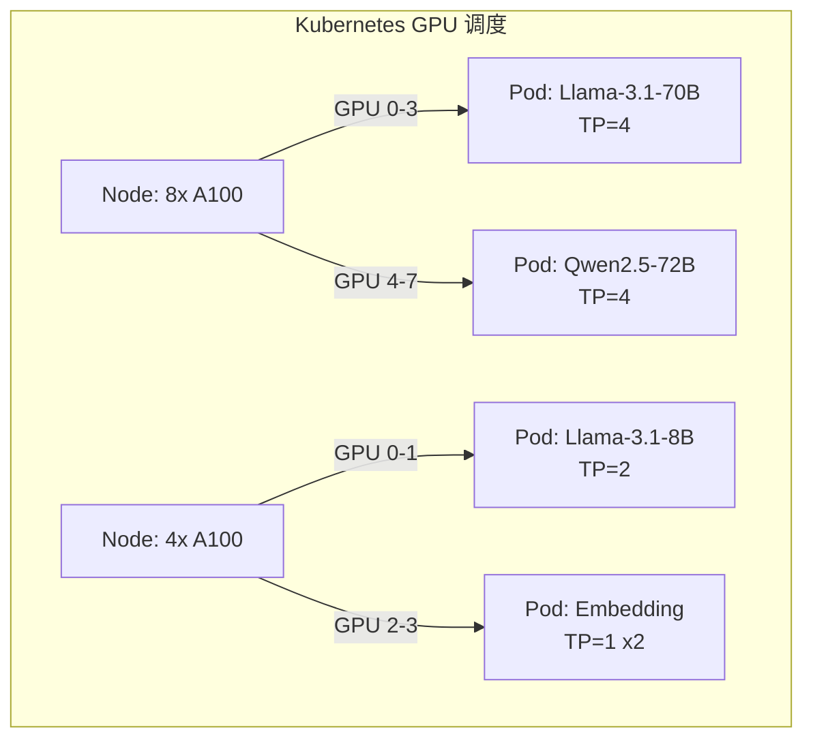

**（2）GPU 调度策略**

- **独占调度**：一个 GPU 只分配给一个 Pod，避免资源争抢，适合大规模模型；
- **时间片调度**：多个 Pod 共享 GPU，按时间片切换，适合小模型或低负载场景；
- **MPS（Multi-Process Service）**：NVIDIA 提供的 GPU 共享方案，允许同一 GPU 上多个进程并行执行；
- **MIG（Multi-Instance GPU）**：将 A100/H100 物理切分为多个 GPU 实例，硬件级隔离。

```yaml
# Kubernetes MIG 调度示例
apiVersion: v1
kind: Pod
spec:
  containers:
  - name: vllm
    resources:
      limits:
        nvidia.com/mig-1g.10gb: 1   # 使用 MIG 1g.10gb 实例
```

**（3）GPU 利用率优化**

| 策略 | 描述 | 效果 |
|------|------|------|
| Continuous Batching | 动态组批，减少 GPU 空闲 | 吞吐提升 2x~4x |
| KV Cache 优化 | PagedAttention 减少显存碎片 | 显存利用率提升到 90%+ |
| 量化推理 | INT8/FP8 降低显存占用 | 显存节省 50%~75% |
| 模型卸载 | 非活跃模型卸载到 CPU/磁盘 | GPU 利用率提升 |
| 请求排队 | 合理的请求队列避免 GPU 空转 | 延迟-吞吐平衡 |

### 6.2 模型版本管理

模型版本管理解决的是"如何安全地更新模型"的问题。

**（1）模型版本策略**

- **语义化版本**：major.minor.patch，如 `llama-3.1-70b-v2.1.0`，major 表示架构变更，minor 表示权重更新，patch 表示热修复；
- **蓝绿部署**：同时运行新旧两个版本的推理服务，通过 Gateway 切换流量，实现零停机更新；
- **金丝雀发布**：先将少量流量导入新版本，观察无异常后逐步扩大比例。

**（2）模型热加载**

多数推理引擎（包括 vLLM）目前不支持单实例内的模型热切换——模型在服务启动时完成加载。生产环境的版本更新通常通过蓝绿/金丝雀部署实现零停机切换：

```bash
# 1. 新版本推理服务以新的 Deployment 启动（加载 v2 模型）
kubectl apply -f vllm-llama-v2.yaml

# 2. 新副本就绪后，通过 API Gateway / VirtualService 将流量从 v1 切换到 v2
#    （先 10% 金丝雀，验证质量指标后逐步放量到 100%）
```

### 6.3 A/B 测试

LLM 服务的 A/B 测试比传统微服务更复杂，因为不同模型的输出不是简单的"对/错"，而需要多维度的质量评估。

**（1）A/B 测试架构**

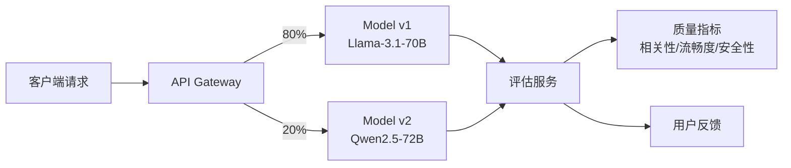

**（2）LLM A/B 测试的关键指标**

| 指标类别 | 具体指标 | 说明 |
|----------|----------|------|
| 质量指标 | BLEU/ROUGE | 参考答案相似度 |
| 质量指标 | LLM-as-Judge | 用强模型评判弱模型输出 |
| 质量指标 | 人工评估 | 人工评分，最可靠但成本高 |
| 性能指标 | TTFT | 首 Token 延迟（Time To First Token） |
| 性能指标 | TPS | 每秒生成 Token 数（Tokens Per Second） |
| 性能指标 | 端到端延迟 | 用户感知的总延迟 |
| 业务指标 | 用户满意度 | 点赞/踩、评分 |
| 业务指标 | 任务完成率 | 用户是否达到预期目标 |

### 6.4 弹性伸缩

LLM 推理服务的弹性伸缩面临"冷启动慢"和"GPU 成本高"两大难题。

**（1）伸缩策略**

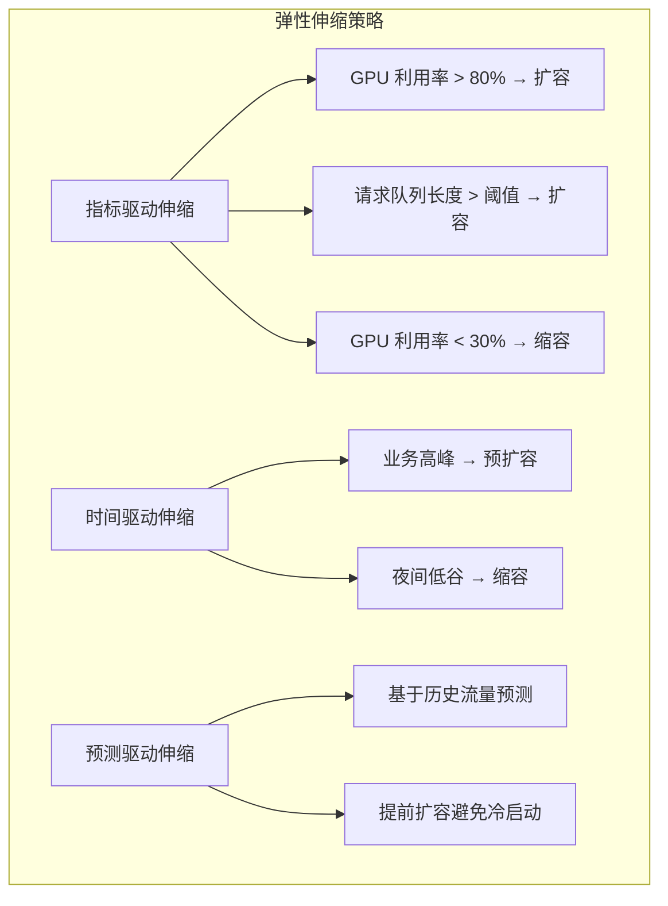

**（2）Kubernetes HPA 配置示例**

```yaml
# 基于 GPU 利用率的 HPA（需要 GPU Metrics Adapter）
apiVersion: autoscaling/v2
kind: HorizontalPodAutoscaler
metadata:
  name: vllm-hpa
spec:
  scaleTargetRef:
    apiVersion: apps/v1
    kind: Deployment
    name: vllm-llama
  minReplicas: 2
  maxReplicas: 10
  metrics:
  - type: Pods
    pods:
      metric:
        name: gpu_utilization   # 自定义 GPU 利用率指标
      target:
        type: AverageValue
        averageValue: "70"       # 目标 GPU 利用率 70%
  - type: Pods
    pods:
      metric:
        name: request_queue_length  # 请求队列长度
      target:
        type: AverageValue
        averageValue: "10"
  behavior:
    scaleUp:
      stabilizationWindowSeconds: 60
      policies:
      - type: Pods
        value: 2
        periodSeconds: 120        # 缓慢扩容，避免资源浪费
    scaleDown:
      stabilizationWindowSeconds: 600  # 缩容冷却期 10 分钟
      policies:
      - type: Pods
        value: 1
        periodSeconds: 300        # 极慢缩容，避免震荡
```

**（3）冷启动优化**

模型加载是冷启动的主要瓶颈，优化策略包括：

| 策略 | 描述 | 冷启动时间 |
|------|------|-----------|
| 直接加载 | 从磁盘加载模型到 GPU | 1~5 分钟 |
| 预热实例 | 维持最小实例数，始终加载模型 | 0（已就绪） |
| 模型缓存 | 将模型预加载到 CPU 内存 | 10~30 秒 |
| 快照恢复 | GPU 进程快照（CUDA Checkpoint） | 5~15 秒 |
| Serverless GPU | 云厂商提供的 GPU Serverless | 3~10 秒 |

## 技术演进时间线

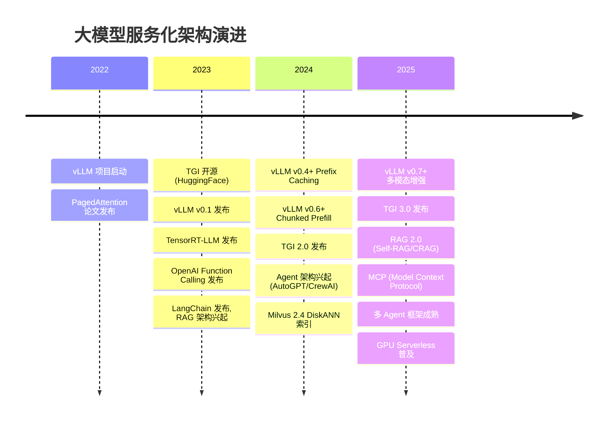

## 架构决策指南

面对大模型服务化的各种选择，以下决策树可以帮助快速定位：

| 决策点 | 选项 A | 选项 B | 建议 |
|--------|--------|--------|------|
| 推理引擎 | vLLM | TGI | 快速验证 / 通用场景选 vLLM；Hub 深度集成选 TGI |
| 推理引擎 | vLLM | TensorRT-LLM | 追求极致性能且全 NVIDIA 选 TensorRT-LLM；否则选 vLLM |
| 向量数据库 | Milvus | pgvector | 亿级规模 / 高性能选 Milvus；已有 PG 基础设施选 pgvector |
| 向量数据库 | 专用向量库 | Elasticsearch | 纯向量检索选专用库；混合检索（向量+关键词）选 ES |
| RAG 架构 | 朴素 RAG | 高级 RAG | POC 阶段用朴素 RAG；生产环境必须用高级 RAG |
| Agent 架构 | 单 Agent | 多 Agent | 简单任务单 Agent；复杂任务多 Agent |
| GPU 调度 | 独占 | 共享 | 大模型（70B+）独占；小模型（7B）可共享 |
| 部署模式 | 自建 | 云服务 | 大规模稳定负载自建；波动负载选云 Serverless |
| 模型量化 | 无量化 | INT8/FP8 | 延迟敏感 / 显存充足不量化；成本敏感 / 显存不足量化 |

## 小结

大模型服务化架构将 LLM 从一个静态的模型文件，转变为一套完整的微服务系统。本文从五个维度进行了系统阐述：

1. **LLM as a Service 三层架构**：接入层（API Gateway）、服务层（推理/RAG/Agent）、基础设施层（GPU 调度/可观测性/模型管理），构成了大模型服务化的基本骨架。

2. **推理引擎四大选型**：vLLM 以高吞吐和易用性成为社区首选；TGI 凭借 HuggingFace 生态深度集成开箱即用；TensorRT-LLM 在 NVIDIA GPU 上实现极致性能；Triton 作为通用推理平台支持多模型混合部署。

3. **RAG 架构从朴素到高级**：朴素 RAG 仅完成"检索-增强-生成"的基本流程，生产环境需要 Query 改写、混合检索、Rerank、上下文压缩等高级手段，并将各组件拆分为独立微服务。

4. **Agent 架构让 LLM 从"问答"走向"行动"**：Function Calling 是 LLM 与外部工具交互的标准协议，Tool Registry 实现工具的注册与发现，多 Agent 协作架构应对复杂任务。

5. **推理服务运维的核心是 GPU 效率**：GPU 调度（独占/MIG/共享）、模型版本管理（蓝绿/金丝雀）、A/B 测试（多维质量评估）、弹性伸缩（冷启动优化）四个维度共同决定了 LLM 服务的成本和可靠性。

大模型服务化不是传统微服务的简单复制，而是需要充分理解 GPU 计算、流式推理、Token 级资源管理等特殊约束，在此基础上借鉴微服务的设计原则，构建出适合 LLM 的服务化架构。随着推理引擎的持续优化和 GPU Serverless 的普及，大模型服务化的门槛将持续降低，但架构设计能力仍然是决定系统质量的关键。
