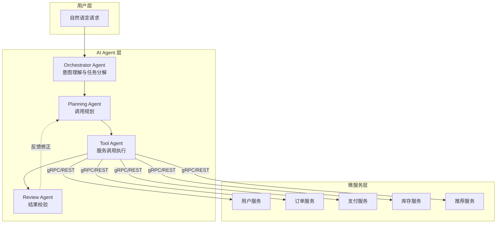
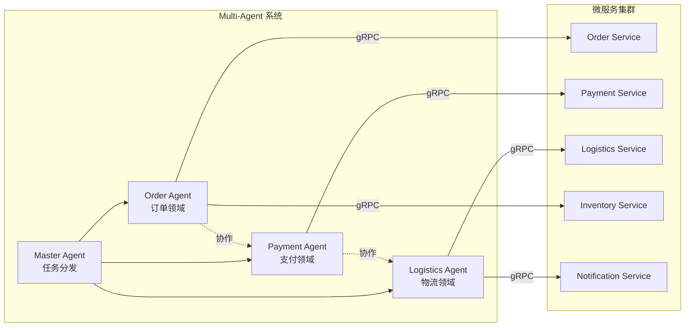
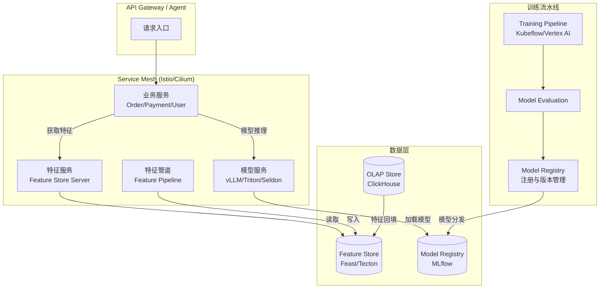
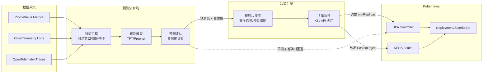
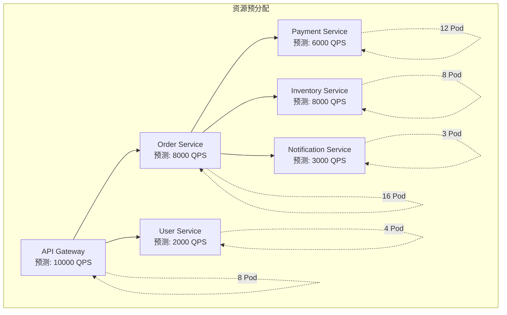
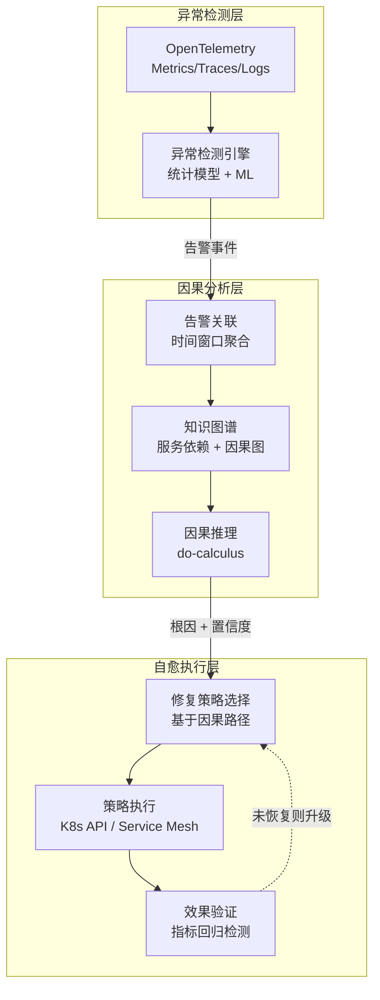
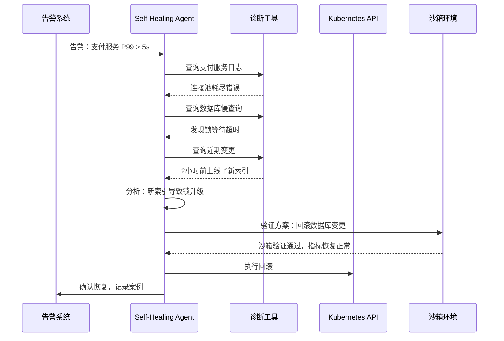
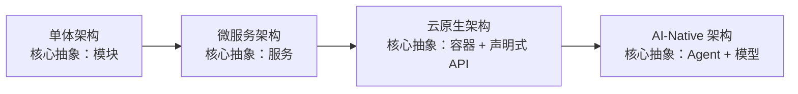
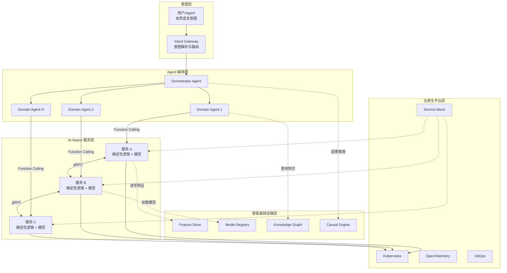
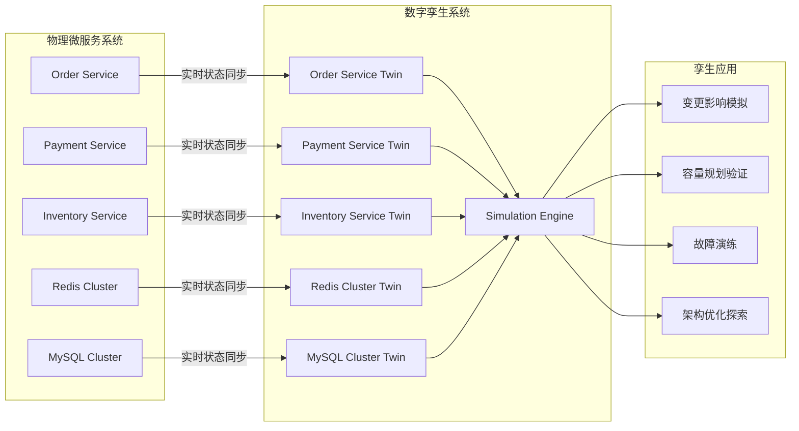

# AI与微服务融合展望

> **版本基线**：Kubernetes 1.30+ | Dapr 1.14+ | OpenTelemetry 1.x
> **阅读时间**：约 28 分钟
> **前置知识**：[[37]] AI辅助微服务开发与运维 · [[38]] 大模型服务化架构

## 概述

前两篇我们分别探讨了 AIOps 辅助微服务开发运维，以及大模型服务化架构的落地实践。这些内容本质上还是在"用 AI 改进微服务"的范式内——AI 是工具，微服务是主体。而本篇要讨论的是一个更深层的问题：当 AI 不再只是外挂的辅助工具，而是深度融合到微服务架构的每一个层面时，系统形态将如何演化？

从 AI Agent 编排微服务调用，到 MLOps 与微服务的一体化融合；从基于预测的智能弹性伸缩，到 AI 驱动的自愈微服务；从 AI-Native 架构范式的提出，到自治系统与数字孪生的未来展望——我们正在见证微服务架构从"人治"走向"自治"的关键拐点。本篇将系统性地梳理 AI 与微服务融合的技术脉络、架构模式与演进方向，为读者提供一个面向 2026 年及以后的架构认知框架。

---

## 一、AI Agent + 微服务：从工具调用到自主编排

### 1.1 Agent 编排微服务的核心模式

传统微服务的服务间调用由开发者硬编码在业务逻辑中，调用链路是静态的、确定性的。而 AI Agent 的引入使得服务调用从"预设路径"变为"动态决策"——Agent 根据用户意图和上下文，自主选择调用哪些微服务、以何种顺序调用、如何组合结果。

这一转变的核心架构模式如下：



在这种模式下，AI Agent 充当了微服务的"智能网关"角色，其核心能力包括：

| 能力维度 | 传统 API Gateway | AI Agent 编排 |
|---------|-----------------|--------------|
| 路由决策 | 静态规则匹配 | 基于意图的动态决策 |
| 调用链路 | 预设编排流程 | 运行时自主规划 |
| 错误处理 | 固定降级策略 | 上下文感知的弹性策略 |
| 交互方式 | API 调用 | 自然语言 + Function Calling |
| 可扩展性 | 需修改配置/代码 | 通过 Tool 定义即可扩展 |

### 1.2 Function Calling 与微服务 Tool 化

将微服务暴露为 AI Agent 可调用的 Tool，是 AI Agent 编排微服务的基础机制。以 OpenAI Function Calling 为代表，各主流 LLM 平台均已支持此模式。其核心实现思路是：将微服务的 API Schema 转化为 Function Description，供 LLM 在推理过程中选择性调用。

```python
# 示例：将微服务 API 注册为 Agent Tool（OpenAI Function Calling）
from openai import OpenAI
import httpx

client = OpenAI()

tools = [
    {
        "type": "function",
        "function": {
            "name": "query_order",
            "description": "查询用户订单信息，支持按订单ID或用户ID查询",
            "parameters": {
                "type": "object",
                "properties": {
                    "order_id": {"type": "string", "description": "订单ID"},
                    "user_id": {"type": "string", "description": "用户ID"}
                },
                "required": []
            }
        }
    },
    {
        "type": "function",
        "function": {
            "name": "check_inventory",
            "description": "检查商品库存状态",
            "parameters": {
                "type": "object",
                "properties": {
                    "sku": {"type": "string", "description": "商品SKU编号"},
                    "warehouse": {"type": "string", "enum": ["north", "south", "east"]}
                },
                "required": ["sku"]
            }
        }
    }
]

async def execute_tool(function_name, arguments):
    """将 Agent Tool 调用路由到对应微服务"""
    service_map = {
        "query_order": "http://order-service:8080/api/orders",
        "check_inventory": "http://inventory-service:8080/api/inventory"
    }
    async with httpx.AsyncClient() as http:
        resp = await http.post(service_map[function_name], json=arguments)
        return resp.json()
```

关键设计考量在于：微服务的 API 设计需要兼顾人类调用者与 AI Agent 两种消费方。这催生了"AI-Ready API"的设计原则——API 描述需足够语义化，参数类型需足够明确，错误信息需足够自解释，以便 LLM 能够准确理解并正确调用。

### 1.3 Multi-Agent 架构与微服务协同

当业务场景复杂度提升，单个 Agent 难以胜任时，Multi-Agent 架构成为必然选择。当前主流的 Multi-Agent 框架包括 LangGraph、CrewAI、AutoGen 等，它们与微服务的结合形成了两层编排架构：



| 框架 | 编排模式 | 与微服务集成方式 | 适用场景 |
|------|---------|---------------|---------|
| LangGraph | 图状态机 | 自定义 Tool Node 调用微服务 | 复杂工作流、条件分支 |
| CrewAI | 角色协作 | Tool 装饰器封装 API | 角色明确的团队协作 |
| AutoGen | 对话驱动 | Function Calling | 多轮对话式问题求解 |
| Dapr Workflow | 持久化工作流 | 内置 Service Invocation | 需要持久化保证的企业场景 |

Dapr 1.14+ 的 Workflow 构建块为 Multi-Agent 编排提供了天然的持久化支撑。其基于 Durable Task Framework 的实现，天然支持 Fan-out/Fan-in、等待外部事件、超时补偿等模式，与 Agent 的规划-执行-反思循环高度契合。

```csharp
// Dapr Workflow 示例：Agent 编排微服务调用（Dapr 1.14+）
public class OrderWorkflow : Workflow<OrderRequest, OrderResult>
{
    public override async Task<OrderResult> RunAsync(
        WorkflowContext context, OrderRequest request)
    {
        // Step 1: 调用库存服务检查库存
        var inventoryResult = await context.CallActivityAsync<InventoryResult>(
            "CheckInventory", new { Sku = request.Sku });

        if (!inventoryResult.Available)
            return new OrderResult { Status = "OUT_OF_STOCK" };

        // Step 2: Fan-out 并行调用订单创建和支付预授权
        var orderTask = context.CallActivityAsync<OrderInfo>(
            "CreateOrder", new { UserId = request.UserId, Sku = request.Sku });
        var paymentTask = context.CallActivityAsync<PaymentResult>(
            "PreAuthorize", new { Amount = request.Amount });

        await Task.WhenAll(orderTask, paymentTask);

        // Step 3: 等待支付确认事件（可能来自 AI Agent 决策）
        var paymentEvent = await context.WaitForExternalEventAsync<PaymentEvent>(
            "payment-confirmed", TimeSpan.FromMinutes(30));

        // Step 4: 确认订单
        return await context.CallActivityAsync<OrderResult>(
            "ConfirmOrder", new { OrderId = orderTask.Result.Id });
    }
}
```

### 1.4 Agent 编排的可靠性挑战

AI Agent 编排微服务带来了全新的可靠性挑战，这些挑战在传统微服务架构中并不存在：

- **不确定性调用**：LLM 的推理输出具有概率性，同一输入可能产生不同的调用链路，这对传统的幂等设计和超时控制提出了新要求
- **幻觉调用**：Agent 可能调用不存在的服务或传递错误参数，需要 Service Mesh 层面提供防护
- **调用爆炸**：Agent 的循环反思机制可能导致服务调用次数远超预期，需要引入 Token Budget 和调用预算控制
- **状态一致性**：Multi-Agent 并发调用微服务时，缺乏传统分布式事务的协调机制

应对策略包括：在 Service Mesh 层引入 Agent 流量治理（限流、熔断、超时），为 Agent 调用注入 Trace Context 以实现端到端可观测性，以及在 Agent Framework 层实现调用预算和回退机制。

---

## 二、MLOps 与微服务融合：从割裂到一体化

### 2.1 传统 MLOps 的架构割裂

在多数组织中，ML 系统与微服务系统是两套独立的技术栈：模型训练在 Jupyter Notebook 或 ML Pipeline 中完成，模型部署则通过独立的 Serving 基础设施实现，特征数据存储在专用的 Feature Store 中，与业务微服务的交互仅通过 REST API 松耦合。这种割裂导致三大问题：

1. **特征漂移难感知**：业务微服务的逻辑变更可能导致模型输入特征的语义偏移，但模型监控与业务监控相互隔离，漂移往往在业务指标恶化后才被发现
2. **部署节奏难对齐**：模型版本迭代与微服务版本迭代走不同的 CI/CD 流水线，模型热更新可能因微服务 API 变更而失败
3. **资源争抢难协调**：训练任务与在线服务共享 GPU 集群时，缺乏统一的资源调度和优先级策略

### 2.2 一体化架构：特征服务 - 模型服务 - 业务服务

融合 MLOps 与微服务的核心思路是：将 ML 能力（特征服务、模型服务）视为微服务架构中的一等公民，与业务服务统一在 Kubernetes 编排、Service Mesh 治理、OpenTelemetry 可观测的体系下。



| 组件 | 技术选型（2025-2026） | 在微服务架构中的角色 |
|------|---------------------|-------------------|
| Feature Store Server | Feast 0.38+ / Tecton | 微服务，通过 gRPC/REST 提供在线特征 |
| Model Serving | vLLM 0.6+ / Triton 2.5+ / Seldon Core 2 | 微服务，通过 Service Mesh 暴露推理端点 |
| Model Registry | MLflow 2.18+ / W&B | 配置中心，模型版本与微服务版本联动 |
| Training Pipeline | Kubeflow 1.9+ / Argo Workflows 3.5+ | CI/CD 流水线，与业务服务共享 GitOps 流程 |
| Feature Pipeline | Flink 1.20+ / Spark 3.5+ | 数据服务，计算特征并写入 Feature Store |

### 2.3 特征服务：微服务化的 Feature Store

Feature Store 的在线 Serving 层本质上是一个高并发、低延迟的微服务。以 Feast 为例，其架构演进正朝着与微服务生态深度融合的方向发展：

```yaml
# Feast Feature Service 部署为 Kubernetes 微服务（Feast 0.38+）
apiVersion: apps/v1
kind: Deployment
metadata:
  name: feast-online-server
  namespace: ml-platform
spec:
  replicas: 3
  selector:
    matchLabels:
      app: feast-online-server
  template:
    metadata:
      labels:
        app: feast-online-server
      annotations:
        sidecar.istio.io/inject: "true"    # 接入 Service Mesh
        prometheus.io/scrape: "true"        # 暴露 Metrics
    spec:
      containers:
      - name: server
        image: feastdev/feature-server:0.38.0
        ports:
        - containerPort: 6566
          name: grpc
        - containerPort: 6565
          name: http
        resources:
          requests:
            cpu: "1"
            memory: "2Gi"
          limits:
            cpu: "4"
            memory: "8Gi"
        env:
        - name: FEATURE_STORE_YAML
          value: "/config/feature_store.yaml"
        volumeMounts:
        - name: config
          mountPath: /config
      volumes:
      - name: config
        configMap:
          name: feast-config
---
# 通过 KEDA 基于 QPS 自动伸缩
apiVersion: keda.sh/v1alpha1
kind: ScaledObject
metadata:
  name: feast-scaler
  namespace: ml-platform
spec:
  scaleTargetRef:
    name: feast-online-server
  minReplicaCount: 3
  maxReplicaCount: 50
  triggers:
  - type: prometheus
    metadata:
      serverAddress: http://prometheus:9090
      metricName: feast_feature_requests_per_second
      threshold: "1000"
      query: sum(rate(feast_feature_request_total[1m]))
```

### 2.4 模型服务与 Service Mesh 的协同

模型推理服务接入 Service Mesh 后，可复用微服务治理的全部能力。但模型服务有其特殊性——推理延迟对 GPU 资源极度敏感，传统的负载均衡策略（如 Round Robin）可能导致 GPU 利用率不均衡。

针对此问题，Istio 支持基于自定义 Header 的一致性哈希路由，可将同一模型版本的请求亲和到同一组实例，并结合 subsets 按模型版本分流，避免 Round Robin 导致的 GPU 利用率不均衡：

```yaml
# Istio DestinationRule：模型版本亲和路由（Istio 1.22+）
apiVersion: networking.istio.io/v1
kind: DestinationRule
metadata:
  name: model-serving-dr
  namespace: ml-platform
spec:
  host: model-serving
  trafficPolicy:
    loadBalancer:
      consistentHash:
        httpHeaderName: x-model-version   # 模型版本亲和路由
  subsets:
  - name: v2
    labels:
      version: v2
    trafficPolicy:
      connectionPool:
        http:
          h2UpgradePolicy: UPGRADE         # 模型推理使用 HTTP/2
          maxRequestsPerConnection: 100
```

---

## 三、智能弹性：从反应式伸缩到预测式伸缩

### 3.1 传统弹性伸缩的局限

Kubernetes HPA（Horizontal Pod Autoscaler）是当前最广泛使用的弹性伸缩方案，但其本质是**反应式**的——指标超过阈值后才触发扩容，从指标采集到 Pod 就绪通常需要数分钟，这导致在突发流量场景下不可避免地出现服务降级或过载。

| 伸缩方案 | 触发机制 | 响应延迟 | 适用场景 |
|---------|---------|---------|---------|
| HPA（指标阈值） | CPU/Memory > 阈值 | 3-5 分钟 | 稳态负载 |
| KEDA（事件驱动） | 队列深度/消息积压 | 1-3 分钟 | 事件驱动型负载 |
| VPA（垂直伸缩） | 资源使用率分析 | 重启 Pod | 资源配置调优 |
| **预测式伸缩** | **ML 模型预测** | **预扩容，0 延迟** | **周期性/可预测负载** |

### 3.2 基于预测的自动伸缩架构

预测式伸缩的核心思路是：利用时序预测模型（如 Prophet、TFT、时序 Transformer）对未来的流量和资源需求进行预测，提前完成扩容操作，使系统在流量到达时已经具备足够的处理能力。



预测式伸缩的关键设计要点：

1. **预测粒度选择**：分钟级预测适合短期突发，小时级预测适合日常波动，天级预测适合容量规划。不同粒度使用不同模型——分钟级用 LSTM/Transformer，小时级用 Prophet，天级用统计回归
2. **置信度阈值**：预测结果附带置信区间，只有当置信度超过阈值时才执行预扩容，否则回退到反应式伸缩
3. **安全护栏**：设置扩容上限（maxReplicas）、缩容冷却期、预算限制等硬约束，防止预测异常导致资源浪费
4. **冷启动预热**：对于 JVM 微服务或 GPU 模型服务，预扩容后还需触发预热（发送探针流量），确保 Pod 在真实流量到达前完成初始化

### 3.3 KEDA + 自定义 Scaler 实现预测式伸缩

KEDA 提供了自定义 Scaler 的扩展机制，可以将 ML 预测模型作为 Scaler 的数据源：

```yaml
# KEDA External Scaler：基于预测模型的伸缩（KEDA 2.15+）
apiVersion: keda.sh/v1alpha1
kind: ScaledObject
metadata:
  name: predictive-scaler
  namespace: production
spec:
  scaleTargetRef:
    name: order-service
  minReplicaCount: 3
  maxReplicaCount: 100
  cooldownPeriod: 300
  triggers:
  - type: external
    metadata:
      scalerAddress: predictive-scaler.ml-platform:6000
      # 自定义 External Scaler 从预测服务获取预期负载
      # 返回目标副本数 = ceil(predicted_qps / per_pod_capacity)
```

```go
// 自定义 KEDA External Scaler 示例（Go, KEDA 2.15+）
package main

import (
    "context"
    "log"
    "net"

    pb "github.com/kedacore/keda/v2/pkg/scalers/externalscaler"
    "google.golang.org/grpc"
)

type PredictiveScaler struct {
    pb.UnimplementedExternalScalerServer
}

func (s *PredictiveScaler) IsActive(
    ctx context.Context, req *pb.ScaledObjectRef) (*pb.IsActiveResponse, error) {
    return &pb.IsActiveResponse{Result: true}, nil
}

func (s *PredictiveScaler) StreamIsActive(
    req *pb.ScaledObjectRef, stream pb.ExternalScaler_StreamIsActiveServer) error {
    // 持续监控预测服务状态
    for {
        select {
        case <-stream.Context().Done():
            return nil
        }
    }
}

func (s *PredictiveScaler) GetMetricSpec(
    ctx context.Context, req *pb.ScaledObjectRef) (*pb.GetMetricSpecResponse, error) {
    return &pb.GetMetricSpecResponse{
        MetricSpecs: []*pb.MetricSpec{{
            MetricName: "predicted_qps",
            TargetSize: 1000, // 每个副本的目标 QPS
        }},
    }, nil
}

func (s *PredictiveScaler) GetMetrics(
    ctx context.Context, req *pb.GetMetricsRequest) (*pb.GetMetricsResponse, error) {
    // 从预测服务获取未来 5 分钟的预期 QPS
    predictedQPS := callPredictionService(5) // minutes ahead
    return &pb.GetMetricsResponse{
        MetricValues: []*pb.MetricValue{{
            MetricName:  "predicted_qps",
            MetricValue: int64(predictedQPS),
        }},
    }, nil
}
```

### 3.4 流量预测与资源预分配

在大规模微服务场景中，各服务的流量并非独立——上游服务的流量波动会沿着调用链向下传播。因此，流量预测需要结合调用拓扑进行全局预分配：



这种基于调用拓扑的预测式资源预分配，在电商大促、票务抢购等场景中价值显著。它要求系统具备：调用拓扑的实时感知能力（通过 Service Mesh 的 xDS 数据）、流量传播模型的建立能力（基于历史 Trace 数据训练）、以及全局资源约束下的优化分配能力（整数规划或启发式算法）。

---

## 四、自愈微服务：AI 驱动的自动故障恢复

### 4.1 从自动恢复到自主自愈

Kubernetes 已经提供了基础的自动恢复能力——Pod 崩溃后自动重启、节点故障后 Pod 自动迁移、Deployment 滚动更新等。但这些机制是**规则驱动**的，只处理预定义的故障模式。当遇到未预见的故障组合（如网络分区导致的级联超时、慢查询引发的连接池耗尽）时，传统自愈机制往往无能为力。

AI 驱动的自愈微服务旨在实现三个层级的自主能力：

| 自愈层级 | 能力描述 | 技术实现 |
|---------|---------|---------|
| L1: 反应式自愈 | 检测到已知故障模式后执行预定义修复策略 | Kubernetes Operator + Runbook |
| L2: 分析式自愈 | 基于告警关联和根因定位，选择或组合修复策略 | AIOps + Knowledge Graph + Causal Inference |
| L3: 生成式自愈 | 面对未知故障，自主生成诊断步骤和修复方案 | LLM Agent + Tool Calling + 沙箱验证 |

### 4.2 L2 自愈架构：因果推理驱动的故障恢复

L2 自愈的核心是**因果推理（Causal Inference）**——不只是发现"什么指标异常"，更要推断"什么原因导致了异常"，从而选择正确的修复策略，而非头痛医头。



因果图（Causal Graph）的构建是 L2 自愈的基础。它来源于两个维度：

1. **静态拓扑**：Service Mesh 的服务依赖图，反映服务间的调用关系
2. **动态因果**：基于历史故障数据，通过 PC 算法或 GES 算法学习指标间的因果关系

例如，当检测到"订单服务延迟升高"时，因果推理可能推断出根因是"Redis 缓存命中率下降"，而非简单地重启订单服务 Pod。正确的自愈策略是触发缓存预热或扩容 Redis，而非重启业务服务。

### 4.3 L3 自愈架构：LLM Agent 驱动的探索式修复

面对从未见过的故障模式，L2 的因果推理可能因缺乏历史数据而失效。L3 自愈引入 LLM Agent，通过 Tool Calling 执行探索式诊断，并在沙箱中验证修复方案的安全性：



L3 自愈的关键安全机制：

- **沙箱先行**：所有修复方案必须在隔离环境中验证通过后才可在生产环境执行
- **最小权限**：Agent 通过 Kubernetes RBAC 仅获得必要的操作权限，且关键操作需人工审批
- **爆炸半径控制**：修复操作限定在故障影响的服务范围内，避免跨服务级联影响
- **回退保障**：每次修复操作都生成对应的回退方案，并在操作失败时自动执行

### 4.4 Kubernetes Operator 与自愈的集成

Kubernetes Operator 模式是自愈微服务的天然载体。通过自定义 CRD 和 Controller，可以将自愈策略声明式地管理：

```yaml
# SelfHealingPolicy CRD 示例
apiVersion: healing.microservice.io/v1alpha1
kind: SelfHealingPolicy
metadata:
  name: payment-service-healing
  namespace: production
spec:
  targetRef:
    apiVersion: apps/v1
    kind: Deployment
    name: payment-service
  rules:
  - name: high-latency-auto-scale
    condition:
      metric: http_server_request_duration_seconds
      threshold: 5.0
      window: 3m
    action:
      type: ScaleUp
      params:
        step: 2
        maxReplicas: 20
    level: L1  # 规则驱动
  - name: connection-pool-exhaustion
    condition:
      alertName: ConnectionPoolExhaustion
    action:
      type: CausalHealing  # 因果推理驱动
      params:
        maxRetries: 3
        requireApproval: false
    level: L2
  - name: unknown-failure
    condition:
      alertSeverity: critical
      noMatchingRule: true
    action:
      type: AgentHealing  # LLM Agent 驱动
      params:
        sandboxEnabled: true
        requireApproval: true
        timeout: 15m
    level: L3
```

---

## 五、AI 原生微服务架构：从微服务到 AI-Native 的演进

### 5.1 架构范式的代际演进

微服务架构并非终点，而是架构演进的一个阶段。从单体到微服务，从微服务到云原生，从云原生到 AI-Native，每一次范式跃迁都伴随着核心抽象的变化：



| 架构范式 | 核心抽象 | 通信模式 | 治理方式 | 演进驱动力 |
|---------|---------|---------|---------|----------|
| 单体 | 模块/函数 | 进程内调用 | 代码级控制 | 业务复杂度增长 |
| 微服务 | 服务/API | 网络调用（RPC/REST） | 服务治理框架 | 独立部署与扩展需求 |
| 云原生 | 容器/声明式 API | Service Mesh 代理 | 平台级治理 | 弹性与可移植性需求 |
| AI-Native | Agent/模型 | 自然语言 + Function Calling | AI 驱动的自治 | 智能化与自主决策需求 |

### 5.2 AI-Native 架构的核心特征

AI-Native 微服务架构不是对现有微服务的替代，而是在其基础上的升维。其核心特征体现在五个方面：

**1. 意图驱动的接口设计**

传统微服务暴露确定性的 API（`POST /orders`），AI-Native 微服务暴露语义化的意图接口（`CreateOrderIntent`），由 Agent 根据上下文选择具体实现。

**2. 模型即服务组件**

模型不再是独立部署的推理端点，而是嵌入到微服务内部的可替换组件。一个微服务可以同时包含确定性逻辑和概率性逻辑，通过 Feature Flag 或 A/B 测试动态切换。

**3. 自适应通信模式**

服务间通信不再仅限于同步 RPC，还可以通过 Agent 协商、事件驱动、流式推理等多种模式灵活组合。Service Mesh 从"流量代理"演变为"通信协商层"。

**4. 持续学习的反馈闭环**

每个微服务都内置数据飞轮——服务产生的数据训练模型，模型优化服务行为，形成闭环。Feature Store 和 Model Registry 成为微服务的标准依赖。

**5. 自治化运维**

微服务的部署、扩缩容、故障恢复等运维操作由 AI Agent 自主决策和执行，人类从"操作者"变为"监督者"和"策略制定者"。

### 5.3 AI-Native 微服务的参考架构



### 5.4 从微服务到 AI-Native 的演进路径

架构演进不应一蹴而就。以下是一个渐进式的演进路径：

| 阶段 | 名称 | 核心变更 | 风险等级 |
|------|------|---------|---------|
| Phase 0 | AI-Enhanced | 在现有微服务上叠加 AIOps 能力 | 低 |
| Phase 1 | AI-Augmented | Agent 编排部分微服务调用 | 中 |
| Phase 2 | AI-Integrated | MLOps 与微服务一体化部署 | 中 |
| Phase 3 | AI-Native | 意图驱动接口 + 自治运维 | 高 |

每个阶段的推进都需要相应的技术成熟度和组织准备度支撑。Phase 0 到 Phase 1 的关键是 Agent Framework 的可靠性，Phase 1 到 Phase 2 的关键是 MLOps 平台的成熟度，Phase 2 到 Phase 3 的关键是自治系统的安全性与可审计性。

---

## 六、未来趋势：自治系统、数字孪生与量子计算

### 6.1 自治系统：从自愈到自治

自愈微服务解决了"故障恢复"的问题，但自治系统（Autonomous System）追求的是更高层次的目标——系统自主管理自身的全生命周期，包括容量规划、架构演进、技术债务治理等。

自治系统的核心特征：

- **自我感知（Self-Awareness）**：系统持续理解自身的状态、能力和限制
- **自我调整（Self-Adjusting）**：根据业务目标和环境变化自主调整配置和架构
- **自我优化（Self-Optimizing）**：在没有明确人工指令的情况下，持续优化性能和成本
- **自我演进（Self-Evolving）**：能够自主决定是否需要引入新的服务拆分、合并或技术栈升级

这将催生一个新的角色——**AI SRE**，它不是辅助人类 SRE 的工具，而是承担 SRE 核心职责的 Agent 系统。人类 SRE 的工作重心将从"排障"转向"策略定义"和"AI SRE 监督"。

### 6.2 数字孪生：微服务的虚拟镜像

数字孪生（Digital Twin）理念应用于微服务架构，意味着为每一个微服务及其运行环境构建高保真的虚拟镜像。这个镜像不仅是静态的架构模型，而是能够实时反映微服务状态、预测未来行为、模拟变更影响的动态模型。



数字孪生在微服务场景的核心应用：

1. **变更前验证**：代码部署前，在孪生环境中模拟灰度发布，评估对全局的影响
2. **故障演练**：Chaos Engineering 的升级——不是在生产环境中注入故障，而是在孪生环境中安全地进行极端场景演练
3. **容量规划**：模拟大促场景，精确预测资源需求和瓶颈点
4. **架构演进模拟**：模拟服务拆分或合并的效果，评估是否值得执行

数字孪生的技术基础包括：eBPF 提供内核级的细粒度数据采集、OpenTelemetry 提供统一的可观测性数据、Service Mesh 提供流量镜像和回放能力、以及 LLM 提供自然语言交互式的孪生操控接口。

### 6.3 量子计算与微服务

量子计算与微服务的融合目前仍处于早期探索阶段，但已有明确的应用方向：

| 应用方向 | 当前状态 | 潜在影响 |
|---------|---------|---------|
| 量子优化 | 早期商用（QAOA/VQE） | 大规模资源调度优化（NP-Hard 问题） |
| 量子机器学习 | 实验室阶段 | 训练速度提升，新模型架构 |
| 量子随机 | 已可用（QRNG） | 密码学增强，真随机数生成 |
| 量子模拟 | 实验室阶段 | 分子级模拟（药物发现等） |

对微服务架构最直接的影响在于**量子优化**。当微服务集群规模达到数千服务、数万实例时，资源调度、流量路由、服务放置等问题本质上是组合优化问题，量子优化算法有望在合理时间内找到更优解。

### 6.4 其他值得关注的趋势

**边缘 AI 与微服务**：随着边缘计算节点的算力提升（NVIDIA Jetson、Apple Neural Engine），越来越多的 AI 推理能力将下沉到边缘节点。微服务架构需要支持"云-边-端"三级部署模型——训练在云端、推理在边缘、轻量决策在终端。

**WebAssembly（Wasm）作为 AI 推理运行时**：Wasm 的轻量级、安全沙箱、跨平台特性使其成为 AI 推理的理想运行时。通过 Wasm 插件机制，可以将 AI 模型注入到 Service Mesh 的 Sidecar 或 Ambient 节点中，实现"数据不动模型动"的推理模式。

**合成数据驱动的服务测试**：利用生成式 AI 生成高保真的合成数据，用于微服务的集成测试和压力测试，解决生产数据脱敏困难、测试数据不足的问题。

---

## 技术演进时间线

| 时间 | 里程碑 | 影响 |
|------|--------|------|
| 2017 | 微服务架构成为主流 | 服务拆分与独立部署成为标准实践 |
| 2018 | Service Mesh 兴起（Istio/Linkerd） | 服务治理从 SDK 剥离到基础设施层 |
| 2020 | AIOps 概念普及 | ML 开始应用于告警关联和异常检测 |
| 2022 | LLM 突破（GPT-3.5/ChatGPT） | AI 能力从感知智能跃迁到认知智能 |
| 2023 | Function Calling / Tool Use | LLM 具备调用外部工具的能力，Agent 概念兴起 |
| 2024 | Multi-Agent 框架成熟（LangGraph/CrewAI） | Agent 协作编排成为可行范式 |
| 2025 | KEDA + 自定义 Scaler 支持预测式伸缩 | 弹性伸缩从反应式走向预测式 |
| 2025 | MLOps 与微服务一体化架构出现 | Feature Store / Model Serving 成为微服务一等公民 |
| 2026 | L3 自愈系统在生产环境试运行 | AI Agent 驱动的探索式故障修复进入实践 |
| 2027+ | AI-Native 架构范式确立 | 意图驱动、自治运维成为新架构范式 |

---

## 架构决策指南

### AI Agent 编排：何时采用？

> **采用条件**：当你的业务场景满足以下条件时，建议引入 Agent 编排
> - 用户交互以自然语言为主（客服、搜索、助手类场景）
> - 服务调用链路多样化，难以穷举所有组合
> - 需要基于上下文动态决策调用路径
>
> **避免条件**：以下场景不建议使用 Agent 编排
> - 调用链路确定且性能要求极高（P99 < 10ms）
> - 系统对确定性有严格要求（金融交易核心链路）
> - 团队缺乏 LLM 应用经验且无快速学习资源

### 预测式伸缩：何时采用？

> **采用条件**：
> - 流量具有明显的周期性（日周期、周周期）
> - 微服务冷启动时间较长（JVM 服务 > 30s，GPU 服务 > 2min）
> - 可接受 1-2 个副本的资源预分配成本
>
> **避免条件**：
> - 流量完全随机，无法建立预测模型
> - 微服务冷启动极快（< 5s），反应式伸缩已满足需求
> - 资源极度紧张，无法承受预分配成本

### 自愈层级选择指南

| 层级 | 推荐场景 | 不推荐场景 | 实施成本 |
|------|---------|----------|---------|
| L1 规则自愈 | 已知故障模式明确、修复策略确定 | 故障模式复杂多变 | 低 |
| L2 因果自愈 | 服务依赖复杂、故障传播路径多 | 服务拓扑简单、故障根因单一 | 中 |
| L3 Agent 自愈 | 关键业务、MTTR 要求极高 | 低风险业务、可接受较长恢复时间 | 高 |

### AI-Native 演进：从哪里开始？

> **推荐起点**：Phase 0（AI-Enhanced）——在现有微服务上叠加 AIOps 能力
> - 投入最小、风险最低、见效最快
> - 可立即获得：智能告警降噪、异常检测、容量预测
> - 为后续阶段积累数据和经验
>
> **不推荐**：跳过 Phase 0 直接进入 Phase 3（AI-Native）
> - 缺乏 AI 基础设施的积累，直接构建自治系统风险极高
> - 组织对 AI 决策的信任需要渐进建立

---

## 小结

本文从六个维度系统探讨了 AI 与微服务融合的现在与未来：

- **AI Agent 编排**：将微服务 Tool 化，通过 Function Calling 和 Multi-Agent 协作实现意图驱动的服务调用，核心挑战在于可靠性保障
- **MLOps 一体化**：将 Feature Store、Model Serving 纳入微服务治理体系，解决特征漂移、部署节奏不对齐、资源争抢三大痛点
- **智能弹性**：从反应式 HPA 到预测式伸缩，基于时序预测模型提前完成资源预分配，KEDA External Scaler 提供了灵活的扩展机制
- **自愈微服务**：从 L1 规则自愈到 L2 因果自愈再到 L3 Agent 自愈，逐级提升故障恢复的自主性和智能性
- **AI-Native 架构**：意图驱动接口、模型即组件、自适应通信、持续学习闭环、自治化运维五大核心特征定义了下一代架构范式
- **未来趋势**：自治系统将 SRE 从操作者变为监督者，数字孪生为架构决策提供安全沙箱，量子计算为大规模优化问题提供新可能

AI 与微服务的融合不是一次技术替换，而是一次架构范式的升维。微服务解决了"拆"的问题，云原生解决了"跑"的问题，而 AI 融合要解决的是"治"的问题——让系统从被人类治理走向自主治理。这个进程中，微服务不会消失，但它的形态和运行方式将发生根本性变化。

**结语**：这些内容到此结束。从第 01 篇的微服务架构基本原理，到本篇的 AI 与微服务融合展望，我们完整地走过了微服务架构从 0 到 1、从 1 到 N、从传统到云原生、从云原生到 AI-Native 的演进之路。技术的迭代永无止境，但架构设计的核心原则——高内聚低耦合、面向失败设计、渐进式演进——始终不变。
