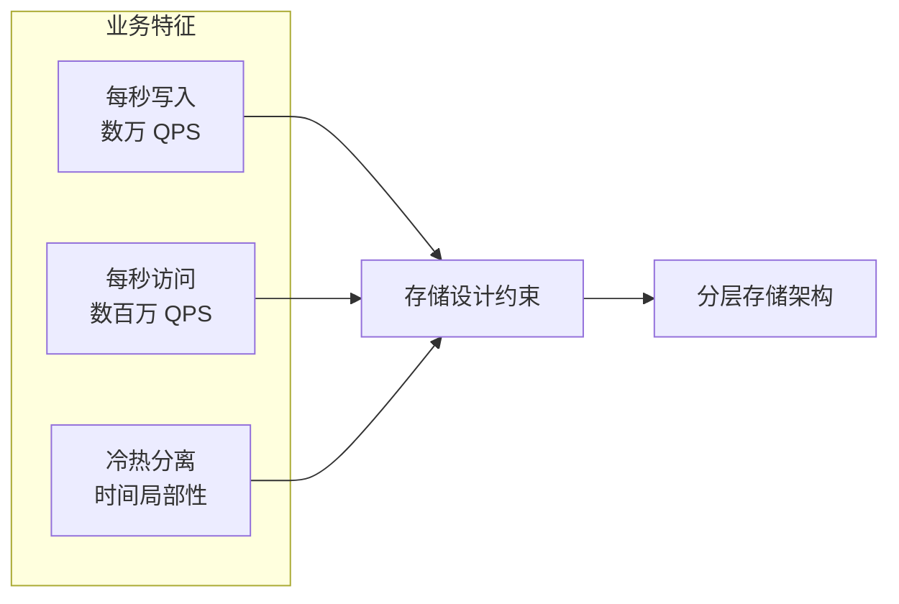
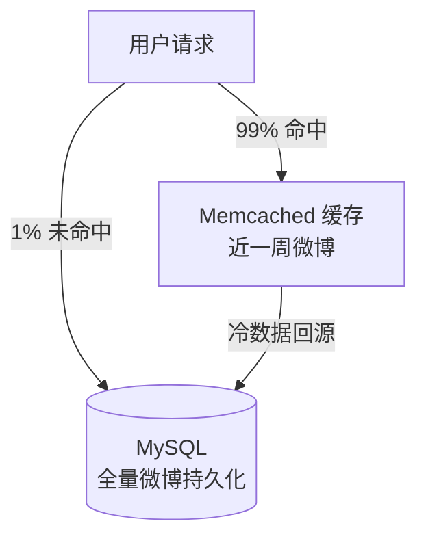
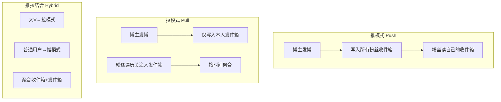

# 微博技术解密（上）：微博信息流是如何实现的

> **版本基线**：MySQL 8.0+ | Redis 7.x | Memcached 1.6 | 分布式缓存（Codis / Redis Cluster）
> **阅读时间**：约 15 分钟
> **前置知识**：[[01]] 到底什么是微服务

## 概述

微博信息流（Feed）是互联网 2.0 时代的核心产品形态。与门户网站"用户在各板块间跳转获取信息"不同，Feed 将不同信息源聚合到单一信息流中，供用户连续访问。这带来两个根本问题：

1. **信息如何保存**——海量用户的高频微博如何分层存储？
2. **信息如何聚合**——每个用户关注了数百上千人，如何快速拼装出他的个性化信息流？

本文以微博 Feed 为案例，剖析大规模读密集型系统的两大核心设计：存储分层架构与信息流的推/拉模式选型。虽然微博诞生于 2009 年，但其面对的高并发读、热点集中、冷热分离等挑战，至今仍是互联网架构设计的核心命题，对理解 2025-2026 年的缓存与存储体系仍有直接参考价值。

---

## 一、Feed 存储架构：三大核心指标

设计 Feed 存储，首先需要量化业务特征。微博业务决定了以下三个关键指标：

### 1.1 每秒写入量（发博量）

需要容忍极端峰值。以元旦零点、春晚等场景为例，瞬间发博量可达数万 QPS。写入需具备水平扩展能力。

### 1.2 每秒访问量（读请求量）

读压力远大于写。热点事件期间访问量达数万 QPS；结合"用户平均关注 200 人"这一假设，Feed 数据的实际请求量可达**数百万 QPS**。这是典型的读多写少场景。

### 1.3 冷热数据分布

微博访问具有显著的时间局部性：用户访问**新发布微博**的概率远大于一周前的微博。这决定了必须采用"热数据缓存 + 冷数据持久化"的分层存储。

---

## 二、存储技术选型：从当年到现代

在设计存储架构前，先盘点业界主流存储方案的能力边界：

| 存储类型 | 代表 | 读写能力 | 特点 | 适用场景 |
|---------|------|---------|------|---------|
| 关系型数据库 | MySQL | 千级 QPS/单机 | 结构固定、持久化可靠 | 结构化核心数据 |
| 内存缓存 | Memcached / Redis | 数十万 QPS | 读写快、数据易失 | 热数据缓存、计数器 |
| 分布式列存 | HBase | 高写入 | 数据结构灵活、海量存储 | 非结构化海量数据 |
| 分布式 NewSQL | TiDB / OceanBase | 万级 QPS 可扩展 | 强一致 + 水平扩展 | 现代替代方案 |

### 2.1 当年的选择：MySQL + Memcached 双层架构

基于 2009-2010 年的存储成熟度与业务特征，微博最终采用：

- **MySQL 持久化全量微博**：数据结构固定、需永久保存
- **Memcached 缓存近一周热点**：挡住 99% 的访问压力

**核心权衡**：单台 MySQL 读能力不足一万 QPS，直接支撑几百万 QPS 需要上千台服务器，成本不可接受。而由于访问存在时间局部性，用缓存挡掉 99% 请求后，真正打到数据库的只有几万 QPS，机器成本大幅下降。

### 2.2 现代演进：2025-2026 的存储体系

若在 2025-2026 年设计同等规模系统，存储选型已发生显著演进：

- **缓存层**：Memcached → **Redis Cluster / Codis**（支持持久化、数据结构丰富、主从复制），或自研代理层统一管理分片
- **数据库层**：单机 MySQL → **MySQL 分库分表**（ShardingSphere / Vitess）或 **TiDB / OceanBase** 等 NewSQL，通过分布式事务与水平扩展消除手工分片
- **冷数据**：磁盘归档 → **对象存储 + 大数据体系**（HDFS / Iceberg），配合数仓做离线分析

**关键启示**：微博当年"MySQL + 缓存"的分层思想仍然正确，但基础设施从手工运维演进为平台化、自动化的云原生体系。

---

## 三、Feed 业务架构：推模式、拉模式与推拉结合

解决了存储问题后，核心挑战变为：**如何将关注人的微博聚合成当前用户的 Feed？**

业界有三种方案：推模式（Push）、拉模式（Pull）、推拉结合（Hybrid）。

### 3.1 推模式（Push / Fanout-on-Write）

**原理**：每个用户维护一个"收件箱"（Inbox）。博主发博时，系统主动将该微博推送到所有粉丝的收件箱中。用户读取 Feed 时只需访问自己的收件箱。

**优势**：聚合逻辑简单，读路径快。

**劣势**：
- **写入放大严重**：上亿粉丝的头部用户发一条微博，需向所有粉丝收件箱各写一份
- **存储成本高**：同一条微博存储多份
- **更新成本高**：修改/删除微博需遍历所有粉丝收件箱
- 需要大量缓存、数据库与队列机支撑，易出现更新延迟（早期 Twitter 采用推模式，曾频繁出现延迟问题）

### 3.2 拉模式（Pull / Fanout-on-Read）

**原理**：每个用户维护一个"发件箱"（Outbox）。博主发博仅写入自己的发件箱。用户读取 Feed 时，遍历关注人列表，拉取各发件箱后按时间聚合。

**优势**：
- **存储成本低**：每份微博只存一份
- **更新简单**：修改数据只影响本人发件箱

**劣势**：聚合逻辑复杂，每次请求需遍历关注人列表并聚合，请求量与计算量远大于推模式。

### 3.3 推拉结合（Hybrid）

结合两者优点：**对大 V（粉丝量大）采用拉模式**，**对普通用户（粉丝量小）采用推模式**。用户读取 Feed 时，聚合"大 V 的发件箱"与"自己的收件箱"两部分。

**权衡**：看似最优，但粉丝数是动态变化的，维护"谁用推、谁用拉"的规则成本很高。

### 3.4 微博的选型结论

综合考量后，微博选择**拉模式**：虽聚合复杂度高，但结合微博公开社交平台（大量上千万粉丝账号）的特点，避免了推模式巨大的写入与存储成本。

**拉模式的性能优化——并行拉取**：当关注人数超过 4000 时，单次遍历拉取耗时达数百毫秒，且长尾请求（>1s）概率大增。微博采用**分而治之**策略：

- 将关注人分为多组
- **并行拉取**各组的发件箱
- 汇总各组聚合结果

这与 **MapReduce** 的分治思想一致。经实测，该方法显著降低了高关注用户拉取 Feed 的耗时与长尾请求数量。

---

## 四、架构演进与决策要点

### 4.1 当年做法的正确性

微博 2010 年的架构决策（MySQL+Memcached、拉模式、并行拉取）在当时是"结合业务场景与存储成熟度的最优解"。其核心思想——**分层存储应对冷热分离、读路径优化应对高并发读、分治聚合应对长尾延迟**——具有普遍的方法论价值。

### 4.2 现代高并发 Feed 的演进方向

若在现代重新设计，常见演进包括：

- **Timeline 缓存**：以 Redis 存储用户的 time line 列表（sorted set），点赞/关注变更时增量更新
- **异步化**：推模式配合消息队列 + 定时批量 fanout，缓解写入压力
- **缓存一致性**：Cache Aside + 消息通知失效，或 Read/Write Through
- **NewSQL**：以 TiDB 替代手工分库分表，简化水平扩展

---

## 技术演进时间线

| 时间 | 里程碑 | 影响 |
|------|--------|------|
| 2009 | 微博诞生，采用 MySQL + Memcached | 双层存储架构成型 |
| 2010 | 平台化改造，确定拉模式 Feed | 应对上千万粉丝账号的写入压力 |
| 2011 | 并行拉取优化高关注用户 | 降低长尾延迟 |
| 2013 | 自研 CounterService / Phantom | 优化计数器与存在性判断存储 |
| 2018+ | Redis Cluster / Codis 普及 | 缓存层从 Memcached 演进 |
| 2020+ | TiDB / OceanBase 等 NewSQL 成熟 | 分布式数据库替代手工分片 |
| 2025-2026 | 云原生缓存 + 平台化存储治理 | 存储运维自动化、弹性伸缩 |

---

## 架构决策指南

**何时用推模式**：粉丝量小、写放大可控的社交/通知场景，或对读延迟极敏感的场景。

**何时用拉模式**：粉丝量大（明星/大 V）、存储敏感、读多写少的公开平台。

**何时用推拉结合**：粉丝量差异巨大的混合场景，且能容忍维护"推/拉切换规则"的复杂度。

**存储分层原则**：热数据入缓存、冷数据持久化、极冷数据归档，以时间局部性为依据划分层级。

---

## 小结

1. **存储选型以业务特征为据**：写放大、读压力、冷热分布三个指标决定分层架构
2. **双层存储是高效解**：缓存挡热点 + 数据库持久化，大幅降低机器成本
3. **推/拉模式各有取舍**：推模式读快写重，拉模式存省但读聚合复杂，需结合粉丝结构选型
4. **分治优化长尾**：并行拉取 + 汇总，以 MapReduce 思想解决高关注用户聚合延迟

本文以微博为案例，揭示了高并发读系统"分层存储 + 推拉模式选型"的通用方法论。下一篇将深入微博的存储组件细节——MySQL 分库分表、Memcached 多层缓存，以及自研的 CounterService 与 Phantom。
