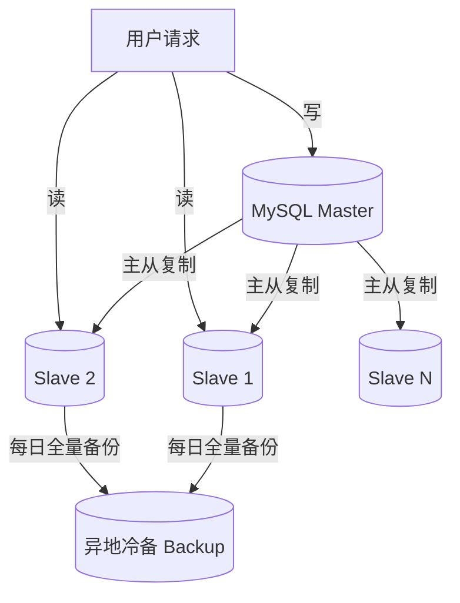
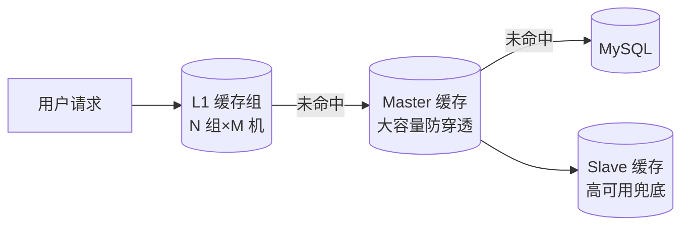
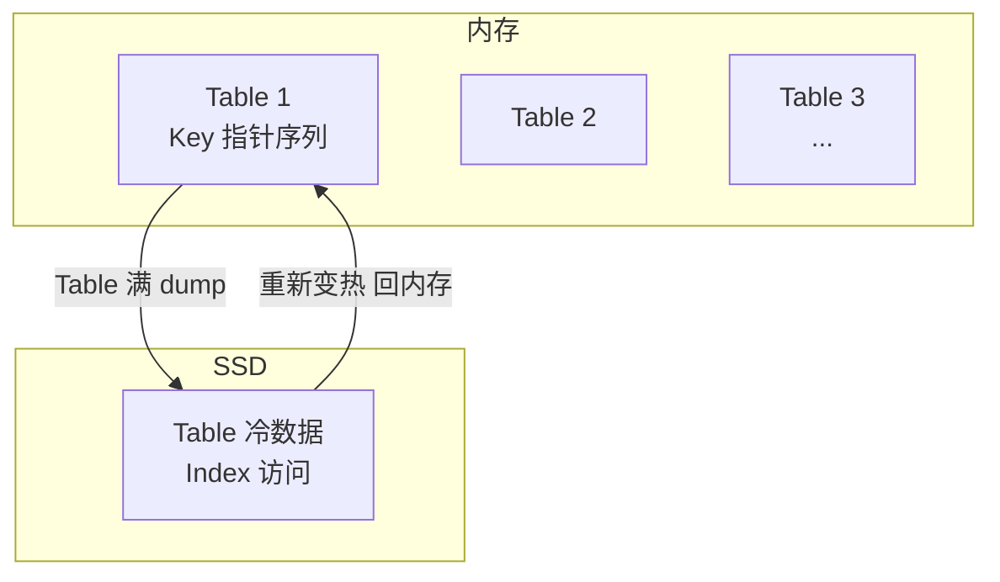
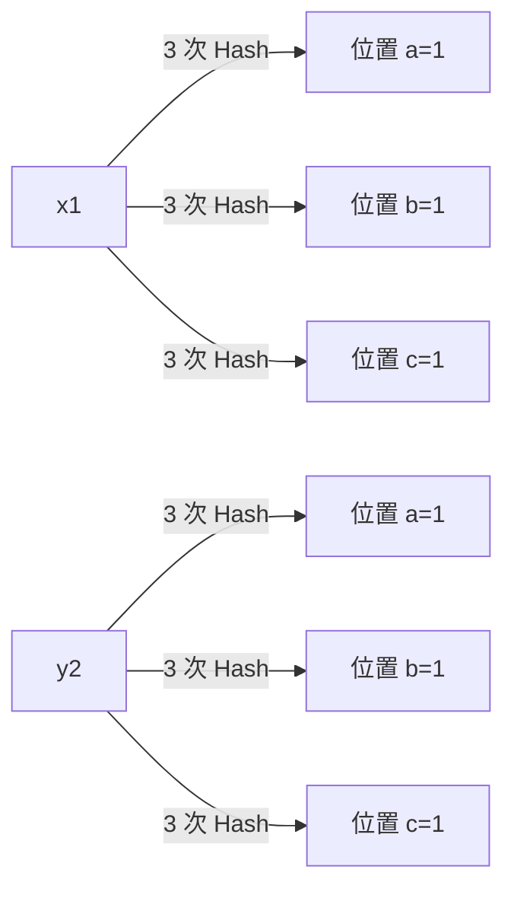

# 微博技术解密（下）：微博存储的那些事儿

> **版本基线**：MySQL 8.0+ | Redis 7.x | Memcached 1.6 | ShardingSphere 5.x
> **阅读时间**：约 20 分钟
> **前置知识**：[[微博技术解密（上）]] 微博信息流是如何实现的

## 概述

上一篇文章剖析了微博 Feed 的存储选型（MySQL + Memcached 双层架构）。本文深入微博存储的**三个核心组件**，揭示其在亿级流量下的精妙设计：

1. **MySQL**：如何通过端口拆分（分库）、读写分离、异地冷备，支撑几万 QPS 的数据库访问？
2. **Memcached**：如何设计 L1-Master-Slave 多层缓存，承担几百万 QPS 且避免缓存穿透？
3. **Redis 改造**：为什么自研 CounterService 与 Phantom？如何把存在性判断的内存成本从 6TB 降到 120GB？

这些设计不仅适用于微博，更是一套**高并发存储的通用方法论**——分库分表、缓存分层、冷热分离、BloomFilter 优化——对理解现代存储体系（如 ShardingSphere、TiDB、Redis Cluster）有直接价值。

---

## 一、MySQL：端口拆分、读写分离与异地冷备

### 1.1 问题：缓存之后仍有几万 QPS

在 Feed 存储中，Memcached 挡住了 99% 的访问压力，但剩余 1% 仍有几万 QPS，远超单台 MySQL（千级 QPS）的极限。需要从三个维度进一步减压：

### 1.2 端口拆分（分库）

**思路**：不同 UID 的用户按 Hash 规则访问不同数据库端口，将单个端口的访问量均分。

- 拆成 8 个端口后，单个端口访问量降为原来的 **1/8**
- 本质是**按业务维度水平分片**，是现代分库分表（如 ShardingSphere 的 sharding 策略）的早期手工实现

### 1.3 读写分离（一主多从）

微博读请求量远大于写请求量，因此：

- **Master**：仅承接写请求
- **Slave**：承接读请求，可按需扩展多套

形成 **一主多从（Master-Slave）** 架构，将读压力从主库卸载。这正是 MySQL 主从复制 + 读写分离的标准实践，也是现代数据库中间件（ShardingSphere-Proxy、Vitess）的核心能力之一。

### 1.4 异地冷备（灾备）

在异地部署一套**冷备灾备库**：平时不提供线上服务，每天对最新数据全量备份，以防线上数据库同时宕机。

**架构形态**：`Master-Slave-Backup` 三层，兼顾性能、可用性与灾备。

### 1.5 现代演进

2025-2026 年，上述手工分库 + 主从配置已演进为平台化能力：

- **分库分表中间件**：ShardingSphere / Vitess 自动路由、自动扩容
- **NewSQL**：TiDB / OceanBase 原生水平扩展 + 强一致，免去手工主从与分片
- **云数据库**：RDS 托管主从、跨 AZ 容灾、自动备份

---

## 二、Memcached：L1-Master-Slave 多层缓存

### 2.1 问题：几百万 QPS 下的带宽与穿透

缓存层需承担几百万 QPS，主要挑战是**带宽**。同时要避免缓存未命中时流量穿透至数据库。微博设计了三层结构：

### 2.2 L1 层：带宽分担 + 无限水平扩展

- 数据请求随机打到任意一组 L1 缓存
- 假设 10 组 L1、总请求 200 万 QPS，每组仅承担 **20 万 QPS**
- 每组内含 4 台机器，按 UID Hash 分片，单机访问量再降为 1/4
- **可按需无限增加 L1 组数**，实现带宽的弹性扩展

### 2.3 Master 层：防穿透

- 内存容量远大于 L1，尽可能多地缓存数据
- **L1 未命中时不直接穿透到数据库，而是先访问 Master**
- 有效拦截"缓存未命中 → 打爆数据库"的穿透风险

### 2.4 Slave 层：高可用兜底

- 防止 Master 宕机时流量直接穿透到数据库
- 在 Master 故障时兜底承接，保障高可用

**核心思想**：**逐层兜底，将数据库访问概率压到极低**。这与现代多级缓存（本地缓存 L1 → Redis L2 → DB）的设计一脉相承。

---

## 三、Redis 改造：CounterService 与 Phantom

微博对原生 Redis 进行了深度改造，诞生了专用于计数与存在性判断的两个组件。其核心动机是 **Redis 的内存有效负荷过低**。

### 3.1 Redis 的内存浪费问题

原生 Redis 一个 KV 至少占用 **65 字节**，但业务有效数据可能仅 12 字节：

- 单计数：Key 8 字节 + Value 4 字节 = 12 字节有效，其余 40+ 字节浪费
- 转评赞三计数：约需 20 字节有效，用 Redis 则需近 200 字节

在千亿级数据规模下，这种浪费是致命的——这正是**为极致场景定制存储**的根本动因。

### 3.2 CounterService：计数器专用存储

**应用场景**：转发、评论、点赞计数。

**存储结构**（内存 + SSD 分层）：

- 内存分成 N 个 Table，按微博 ID 指针序列划分范围
- 微博 ID 先定位所属 Table，直接增减
- 内存不足时，将最小的 Table **dump 到 SSD**，腾出位置给新 ID
- 超过 4 字节计数上限的热数据放 **Aux Dict**
- SSD 中的 Table 通过 Index 访问，用 **RDB 方式复制**

**效果**：内存使用量减少到原 Redis 方案的 **1/15 ~ 1/5**，并实现冷热数据分离 + LRU。

### 3.3 存在性判断的存储难题

**场景**：判断"某用户是否赞过某微博""某微博是否已读"。这类数据：

- **记录极小**：Value 用 1 位即可
- **总量极大**：每天新增微博约 1 亿条，存在性数据总量达上千亿条
- **稀疏**：大多数值为 0（不存在）

**存储成本对比**（按每天千亿条新增估算）：

| 方案 | 单条占用 | 日增存储 | 结论 |
|------|---------|---------|------|
| 原生 Redis | 65 字节 | 约 6 TB | 不可接受 |
| CounterService | 约 8 字节 | 约 800 GB | 仍偏高 |
| Phantom（BloomFilter） | 约 1 字节（每个元素约 10 bit） | 约 120 GB | 最优 |

### 3.4 Phantom：基于 BloomFilter 的存在性判断

**设计**：与 CounterService 类似分 Table，但每个 Table 是一个完整的 **BloomFilter**：

- 每个 BloomFilter 存储某 ID 范围段的 Key
- 所有 Table 按 Key 范围有序递增
- Table 存满时清除最小的 Table（滚动），供新 Key 使用

**BloomFilter 判存原理**：

- 写入：Key 经 3 次 Hash 映射到 Table 的 3 个位置并置 1
- 判断：查询 Key 的 3 个位置是否**全为 1**
  - 全为 1 → 可能存在（有**误判**风险）
  - 任一为 0 → **一定不存在**

**效果**：每天存在性判断仅需约 **120 GB 内存**；业务需满足一周需求，最多 840 GB。相比原生 Redis 的 6 TB，降低两个数量级。

### 3.5 现代替代

2025-2026 年，类似场景已有更成熟的工程化方案：

- **Redis BloomFilter 模块**（RedisBloom）：原生支持 `BF.ADD` / `BF.EXISTS`，无需自研
- **Roaring Bitmap / 位图**：适合稀疏整型集合的存在性判断
- **Cuckoo Filter**：支持删除操作，误判率更低
- **分层存储 + 冷数据降级**：热数据内存 + 冷数据 SSD/对象存储

---

## 技术演进时间线

| 时间 | 里程碑 | 影响 |
|------|--------|------|
| 2009 | MySQL + Memcached 双层架构 | Feed 存储基础 |
| 2010 | 端口拆分 + 读写分离 | 单库减压 |
| 2013 | 自研 CounterService | 计数器存储降本 5-15 倍 |
| 2015 | 自研 Phantom（BloomFilter）| 存在性判断降本两个数量级 |
| 2018+ | Redis Cluster / Codis 普及 | 缓存层现代化 |
| 2020+ | RedisBloom / NewSQL 成熟 | 原生替代自研组件 |
| 2025-2026 | 云原生存储 + 中间件平台化 | 分库分表、容灾、备份自动化 |

---

## 架构决策指南

**何时做分库分表**：单库 QPS 逼近极限、且数据量持续增长时，按业务键水平分片。

**何时用多级缓存**：读多写少、需拦截缓存穿透、对延迟敏感的场景。多级缓存逐层兜底，将数据库访问压到极低。

**何时自研存储组件**：通用方案（如 Redis）存在致命的内存浪费，且业务量达千亿级、成本不可接受时，才考虑针对场景定制。

**何时用 BloomFilter**：存在性判断、稀疏数据、可容忍少量误判的场景。注意 BloomFilter 存在误判率（不存在可能被误判为存在），需评估业务可接受度。

---

## 小结

1. **MySQL 三层减压**：端口拆分降单库压力、一主多从读写分离、异地冷备保障灾备
2. **多级缓存兜底**：L1 分担带宽 + Master 防穿透 + Slave 高可用，逐层降低数据库访问概率
3. **场景定制存储**：CounterService 压缩计数器内存 5-15 倍
4. **BloomFilter 革命**：Phantom 将存在性判断内存从 6TB 降至 120GB，降本两个数量级

微博的存储实践证明了：**在高并发、大数据的极限场景下，通用存储方案的"够用"与"最优"之间存在巨大鸿沟**。理解这些针对性优化（分片、分层、压缩、概率数据结构），是设计现代高并发存储体系的基石。
