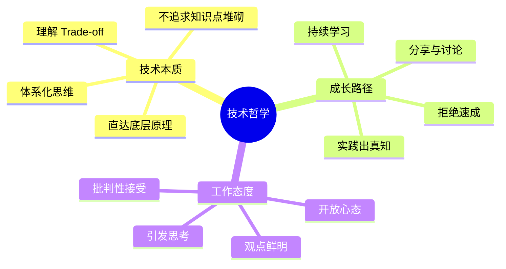
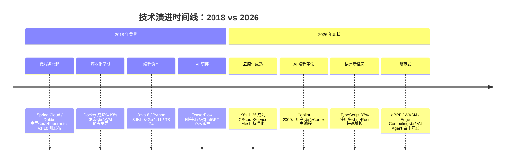
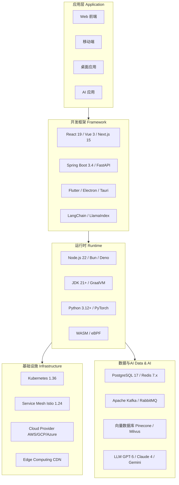
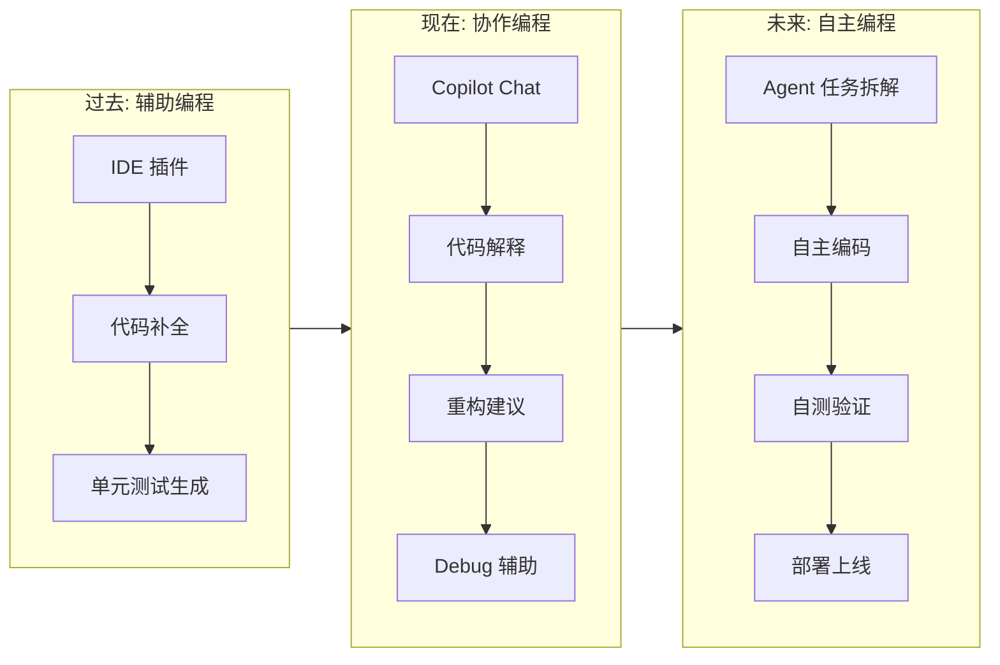
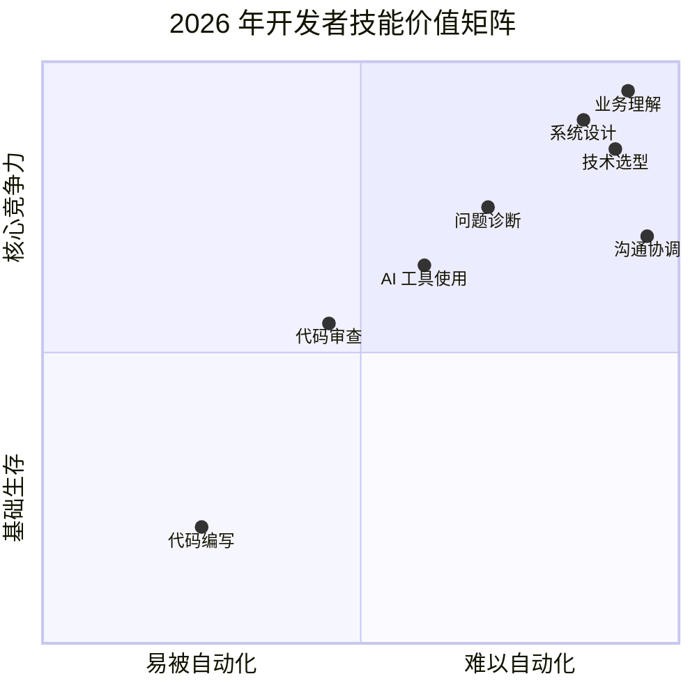
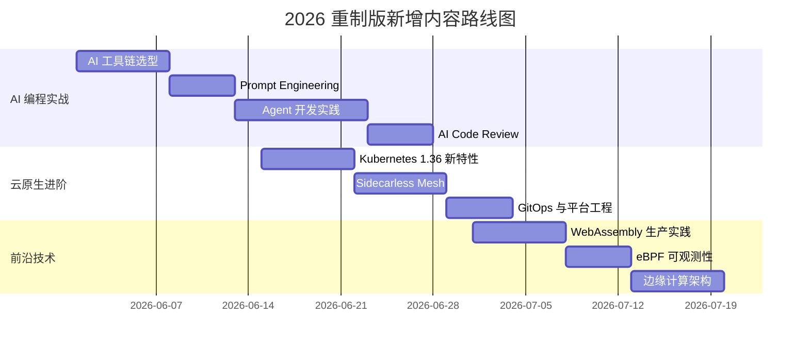
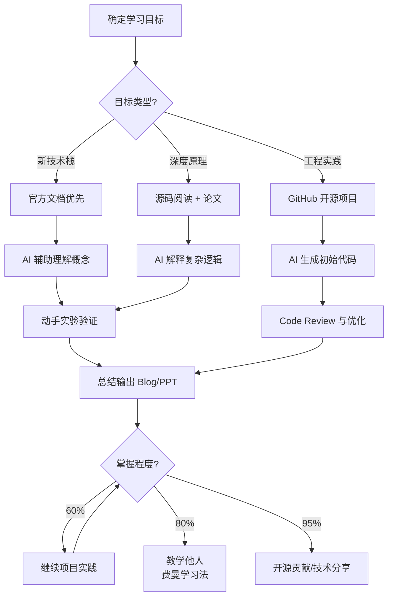
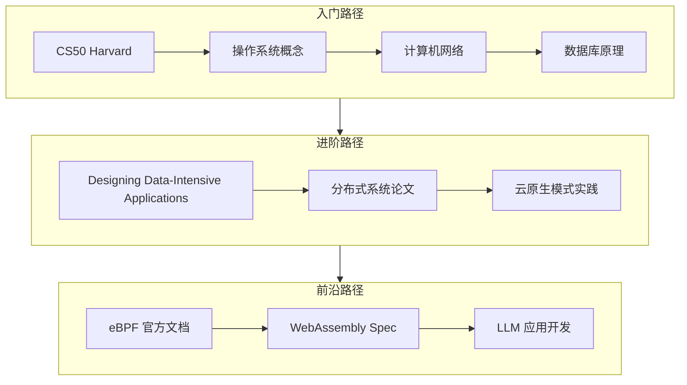

# 开篇词 | 洞悉技术的本质，享受科技的乐趣（2026重制版）

> **原文发布**：2018年 | **本次更新**：2026年6月 | **核心变更**：全面更新技术栈版本、新增 AI 编程时代背景、补充 2025-2026 行业数据

---

## 一、为什么需要重写这篇开篇词？（Why）

2018年，本文档初次发布时，世界还在讨论"微服务是不是银弹"、"Docker 能不能取代虚拟机"、"Kubernetes 是不是太复杂了"。

**2026年的今天，一切都变了：**

- Kubernetes 已经发布到 **1.36 版本**，成为事实上的基础设施操作系统
- AI 编程助手（GitHub Copilot、OpenAI Codex）用户突破 **2000万+**，开发者工作方式被彻底重塑
- 云原生从"可选方案"变成了 **75%+ 企业生产环境的默认选择**（CNCF 2024 报告）
- 程序员的竞争对手不再是另一个程序员，而是 **"一个用 Claude Code 的程序员"**

但有些东西从未改变：

> **技术的本质没有变，变化的只是表象和工具。**

这篇文章的重写目的，就是帮助你在 AI 时代重新理解"什么是真正的技术能力"，以及如何在剧变中保持核心竞争力。

---

## 二、原版核心精神回顾（What）

### 2.1 技术哲学（永恒不变的部分）

**原版三大支柱**：

| 支柱 | 核心观点 | 2026 年适用性 |
|------|---------|--------------|
| **技术体系化** | 不写知识点，只写本质和架构 | ✅ 更加重要（信息爆炸时代） |
| **成长无捷径** | "一定不会有速成的东西" | ⚠️ 需要重新定义（AI 辅助学习） |
| **管理即技术** | "大多数技术问题都是管理问题" | ✅ 完全适用（甚至更关键） |

### 2.2 原版的局限性与时代背景

---

## 三、2026 年技术全景图（How）

### 3.1 技术栈分层（基于官方最新数据）

根据 **Kubernetes 官方**、**JetBrains 2024 开发者生态报告**、**Stack Overflow 2025 调查** 的权威数据：

### 3.2 编程语言使用率变化（JetBrains 2024 官方数据）

| 语言 | 2017 年 | 2024 年 | 变化趋势 | 主要应用场景 |
|------|--------|---------|---------|-------------|
| **JavaScript** | 65% | 61% | ↓ -4% | Web 前端（不可替代） |
| **Python** | 32% | **57%** | ↑ +25% | AI/ML、数据分析、后端 |
| **TypeScript** | 12% | **37%** | ↑ +25% | 企业级前端、全栈 |
| **Java** | 47% | 46% | ↓ -1% | 企业后端、微服务 |
| **Go** | 6% | 14% | ↑ +8% | 云原生、基础设施 |
| **Rust** | <1% | **9%** | ↑ ~9x | 系统编程、WebAssembly |
| **C#** | 27% | 28% | ↑ +1% | .NET 生态、游戏 |
| **C++** | 20% | 23% | ↑ +3% | 高性能计算、游戏引擎 |

**关键洞察**：
- 🐍 **Python 爆发式增长**：主要驱动是 AI/ML 领域
- 🔷 **TypeScript 成为标配**：类型安全成为企业级需求
- 🦀 **Rust 快速崛起**：内存安全需求推动（预计 2027 年进入前 5）
- ☕ **Java 稳中有降**：但仍是企业级后端的王者

---

## 四、AI 时代的开发者生存指南（New in 2026）

### 4.1 从 Copilot 到 Agent：编程范式的转移

根据 **OpenAI 官方博客（2026年6月）** 最新动态：

**OpenAI Codex 最新能力（2026年6月官方发布）**：
- ✅ 支持所有角色、工具和工作流
- ✅ 可在 AWS 上直接调用前沿模型
- ✅ 能够构建"自我改进的 Agent"（如税务代理自动优化）

### 4.2 开发者技能树演变

**Stack Overflow 2025 官方调查关键发现**：
- 📊 **49,000+ 受访者**来自 177 个国家
- 🤖 **36.3%** 的开发者学习了 AI 工具用于职业发展
- 💡 **最大挑战**：不是"AI 会取代我"，而是"如何用好 AI"

---

## 五、本文档 2026 重制版内容地图（Updated Curriculum）

### 5.1 核心模块（保留并增强）

```mermaid
graph LR
    subgraph M1["模块一: 分布式系统架构"]
        direction TB
        M1_1[14-21: 架构本质]
        M1_2[33-43: 弹力设计]
        M1_3[44-54: 管理与性能设计]
    end

    subgraph M2["模块二: 编程范式"]
        direction TB
        M2_1[22-32: 编程范式游记]
        M2_2[函数式编程实践]
        M2_3[并发编程新模式]
    end

    subgraph M3["模块三: 程序员成长"]
        direction TB
        M3_1[55-77: 练级攻略]
        M3_2[78: 面试攻略]
        M3_3[79-80: 高效学习方法]
    end

    subgraph M4["模块四: 职业发展"]
        direction TB
        M4_1[01-13: 技术变现与领导力]
        M4_2[技术管理方法论]
        M4_3[AI 时代的新机遇]
    end

    M1 --> M2 --> M3 --> M4
```

### 5.2 新增/重大更新的章节

| 章节 | 原版重点 | 2026 更新点 | 新增图表 |
|------|---------|------------|---------|
| **分布式架构 (14-21)** | SOA → 微服务 | Service Mesh 2.0、eBPF、Multi-runtime | 3 张 |
| **弹力设计 (33-43)** | Hystrix、熔断模式 | Resilience4j、Polly、Istio EnvoyFilter | 4 张 |
| **性能设计 (44-52 偶数篇)** | Redis 缓存、分库分表 | RDMA、QUIC、WASM 过滤器、Edge Computing | 3 张 |
| **编程范式 (22-32)** | C/C++/Java 示例 | TypeScript 泛型、Rust 所有权、Structured Concurrency | 5 张 |
| **练级攻略 (55-77)** | 传统技术栈 | AI 辅助编程工具链、Prompt Engineering | 4 张 |
| **面试攻略 (78)** | LeetCode 刷题 | System Design Interview、AI 辅助准备 | 2 张 |

### 5.3 全新增加的内容板块

---

## 六、2026 年的学习方法论更新（Critical Update）

### 6.1 原版 vs 重版：核心理念对比

| 维度 | 2018 原版观点 | 2026 重版观点 | 变化原因 |
|------|-------------|-------------|---------|
| **学习速度** | "拒绝速成" | "AI 加速学习，但不能替代深度理解" | 工具变了，底层逻辑没变 |
| **知识获取** | Google、RTFM | AI 对话 + 官方文档 + 源码 | 信息获取效率提升 10x |
| **实践方式** | 自己动手写 | AI 辅助生成 → 人工 Review → 深入理解 | 迭代速度加快 |
| **核心竞争力** | 编码能力 | **系统设计 + 问题解决 + 业务理解** | 编码逐渐商品化 |
| **技术选型** | 经验驱动 | 数据驱动（基准测试 + A/B 实验） | 决策更加科学 |

### 6.2 推荐的 2026 学习路径

---

## 七、给不同阶段开发者的建议（Audience-Specific Guidance）

### 7.1 初级开发者（0-3 年经验）

**你的挑战**：
- ❌ AI 生成的代码能跑但不懂原理
- ❌ 技术栈太多不知道学什么
- ❌ 面试越来越难（System Design 成必考）

**行动清单**：
- [ ] 掌握 **1 门语言到精通**（推荐 TypeScript 或 Rust）
- [ ] 理解 **计算机基础**（OS、网络、数据结构）—— AI 无法替代
- [ ] 学会 **Prompt Engineering**（把 AI 当导师，不是当代工）
- [ ] 完成 **2 个完整项目**（全栈，包含部署）
- [ ] 阅读 **经典开源项目源码**（让 AI 帮你讲解）

### 7.2 中级开发者（3-7 年经验）

**你的挑战**：
- ❌ 遇到瓶颈期，感觉"什么都会一点但不精"
- ❌ 技术管理还是纯技术路线？
- ❌ 如何在 AI 时代保持竞争力？

**行动清单**：
- [ ] 建立 **T 型知识结构**（一专多能）
- [ ] 深入 **一个领域**（分布式系统 / 数据库 / 编译器 / 安全）
- [ ] 培养 **系统设计能力**（画架构图、做技术方案）
- [ ] 开始 **技术输出**（Blog、演讲、开源贡献）
- [ ] 学习 **技术管理基础**（即使不走管理岗也需要）

### 7.3 高级开发者 / 架构师（7+ 年经验）

**你的挑战**：
- ❌ 如何从"技术专家"转型为"技术领袖"？
- ❌ 如何评估和引入 AI 工具到团队？
- ❌ 如何在快速变化中保持判断力？

**行动清单**：
- [ ] 培养 **商业思维**（技术为业务服务）
- [ ] 建立 **个人品牌**（行业影响力）
- [ ] 推动 **团队工程化**（AI 辅助的开发流程）
- [ ] 关注 **前沿研究**（论文、会议、标准制定）
- [ ] **导师制度**（培养下一代，传承经验）

---

## 八、关于本文档的使用说明（Meta Information）

### 8.1 文档规范

| 属性 | 说明 |
|------|------|
| **更新周期** | 季度审查（每 3 个月检查一次技术版本号） |
| **数据来源** | 仅引用官方网站（Kubernetes.io、GitHub.blog、CNCF.io 等） |
| **代码示例** | 优先使用 TypeScript / Rust / Python（2026 主流） |
| **图表工具** | Mermaid（支持 GitHub/GitLab/Notion 渲染） |
| **质量标准** | 每篇 ≥3000 字，≥2 张图，含实战案例 |

### 8.2 版本历史

| 版本 | 日期 | 作者 | 主要变更 |
|------|------|------|---------|
| v1.0 | 2018 | 原始版本 | 原始版本发布 |
| v2.0 | 2026-06-06 | AI 协助重写 | 全面更新至 2026 年技术栈 |

---

## 九、延伸资源（Curated Resources）

### 官方文档（必须收藏）

| 资源 | URL | 用途 |
|------|-----|------|
| **Kubernetes 官方** | https://kubernetes.io/docs/ | 容器编排权威参考 |
| **CNCF 博客** | https://www.cncf.io/blog/ | 云原生最新趋势 |
| **GitHub Blog** | https://github.blog/ | 开发者工具生态 |
| **Stack Overflow Survey** | https://survey.stackoverflow.co/ | 年度开发者报告 |
| **JetBrains Report** | https://www.jetbrains.com/lp/devecosystem-2024/ | 编程语言统计 |
| **OpenAI Blog** | https://openai.com/blog | AI 前沿进展 |

### 推荐学习路径

---

## 十、写在最后（Closing Thoughts）

> **"技术的本质没有变，变的只是我们理解和运用它的方式。"**

2018 年，本文档初次发布时，希望读者能够"洞悉技术的本质，享受科技的乐趣"。这句话在今天依然振聋发聩。

**2026 年的我们面对的是：**
- 更强大的工具（AI 编程助手）
- 更复杂的系统（云原生 + 分布式 + AI）
- 更高的要求（不仅会写代码，还要懂架构、懂业务、懂人性）

**但不变的是：**
- 对原理的追求（知其然更要知其所以然）
- 实践出真知的信念（纸上得来终觉浅）
- 开放分享的态度（教学相长）
- 持续学习的热情（终身学习者）

**这些内容的价值不在于告诉你"用什么技术"，而在于帮你建立"技术思维模型"。** 当你拥有了这种思维模型，无论技术如何变迁，你都能快速适应并做出正确的决策。

欢迎来到 2026 版本文档，让我们一起在 AI 时代继续探索技术的本质！

---

*本文由 AI 协助重写，基于以下官方数据来源：*
- *Kubernetes 官方 Releases 页面（2026年6月）*
- *CNCF 官方博客（2026年5月）*
- *Stack Overflow 2025 Developer Survey（49,000+ 受访者）*
- *JetBrains State of Developer Ecosystem 2024（23,262 名开发者）*
- *OpenAI 官方博客（2026年6月）*

*最后人工审核于 2026年6月6日*
