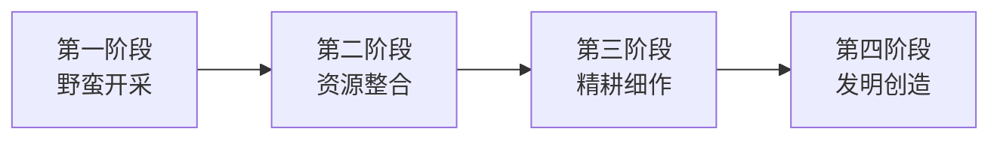
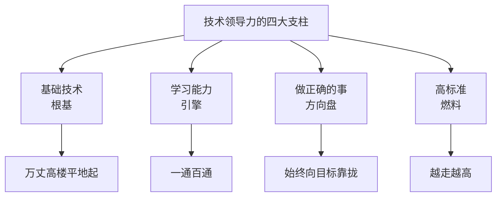
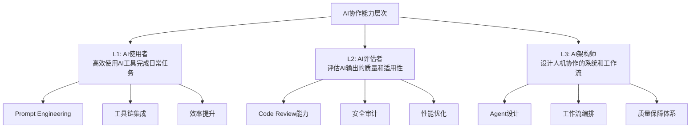

# 技术领导力（2026重制版）

本文档要谈的是技术上的领先，技术上的优势，而不是一个职称，一个人事组织者。

在2026年这个AI重塑一切的时代，技术领导力的内涵已经发生了深刻变化。但核心逻辑依然未变——**真正的技术领导力，是能够用技术创造真实价值的能力**。

---

## 核心变更说明

本文基于2018年原版《何为技术领导力？》及《如何才能拥有技术领导力？》进行2026年全面重制。主要变更包括：

1. **更新时代背景**：从"野蛮开采 vs 精耕细作"到"AI时代的价值重构"
2. **补充AI时代的技术领导力特征**：AI工具链驾驭能力、人机协作设计等
3. **引入最新行业数据**：Stack Overflow 2025、GitHub Octoverse 2025等
4. **增加实战案例**：现代技术领导者如何应对挑战
5. **调整能力模型**：适应分布式、远程、AI辅助的工作模式
6. **更新基础技术清单**：增加云原生、AI/ML、安全等现代基础
7. **补充学习方法论**：适应信息过载时代的有效学习策略
8. **引入AI辅助学习**：如何用AI加速学习过程
9. **调整能力评估标准**：Google评分卡的2026版解读
10. **增加实战路径**：从理论到实践的具体行动指南

---

## Why：为什么在2026年重新讨论技术领导力？

### 技术领导力的定义正在被重写

根据**Stack Overflow 2025 Developer Survey**（覆盖49,000+名来自177个国家的开发者），84%的受访开发者正在使用或计划使用AI工具进行编程[¹]。这意味着：

- **传统"写代码快"的优势正在被稀释**
- **能够判断"该写什么代码"的能力变得更重要**
- **技术决策的质量比编码速度更关键**

同时，根据**GitHub Octoverse 2025报告**，全球开发者数量已达**1.8亿**，TypeScript在过去一年实现了66%的年增长率[²]。在这个规模下：

- **个人英雄主义越来越难以奏效**
- **系统化思维和架构能力成为稀缺资源**
- **影响和赋能他人的能力比单打独斗更有价值**

### 中国技术人的特殊困境

在中国，程序员把自己称作"码农"，说自己是编程的农民工，干的都是体力活，加班很严重，认为做技术没有什么前途，好多人都拼命地想转管理或是转行。

这个问题在2026年更加复杂了：

1. **AI降低了入门门槛**：初级开发岗位的需求在减少
2. **年龄歧视依然存在**：35岁危机没有缓解
3. **内卷加剧**：竞争更加激烈，但不是良性竞争

但是，这恰恰是**真正有技术领导力的人的机会**——因为当大多数人都在焦虑和迷茫时，那些能够看清方向、创造价值的人将获得更大的回报。

### 技术领导力不是天生的，是培养出来的

很多人认为技术领导力是"天赋"，只有少数人才能拥有。这是一个误区。

根据**Dweck的成长型思维（Growth Mindset）**研究，能力是可以通过努力和学习发展的[³]。技术领导力同样如此——它是一系列可以学习和练习的技能组合。

### AI时代的学习悖论

根据**Stack Overflow 2025 Developer Survey**，84%的开发者正在使用或计划使用AI工具进行编程[¹]。这带来了一个有趣的悖论：

- **好消息**：学习新技术的门槛降低了，AI可以帮助你快速上手
- **坏消息**：浅层学习的风险增加了，你可能只学会了"怎么用"而没有理解"为什么"

**关键洞察**：在AI时代，**深度学习比以往任何时候都更重要**。因为：
- 表面知识容易被AI替代
- 深度理解和判断力难以被替代
- 技术决策需要深厚的功底支撑

---

## What：原版核心内容回顾

### 原版的四个发展阶段论

我在原版文章中提出了一个国家/公司/个人的发展四阶段模型：



**第一阶段：野蛮开采**
- 特点：资源过多，只需要开采
- 手段：加班、加人、烧钱、并购、广告
- 典型：早期互联网公司的"跑马圈地"

**第二阶段：资源整合**
- 特点：资源已被占有，需要优化利用
- 手段：管理手段、流程优化、效率提升
- 典型：中型企业的精细化运营

**第三阶段：精耕细作**
- 特点：对第二阶段的精细化运作
- 手段：科学方法、数据驱动、自动化
- 典型：成熟企业的持续改进

**第四阶段：发明创造**
- 特点：用不足的资源创造更好的资源
- 手段：核心技术突破、创新
- 典型：科技巨头的基础研究投入

**核心观点**：野蛮开采不会是常态。长期来看，掌握先进技术的民族或公司将淘汰那些只靠"蛮力"发展的。

### 原版的工业革命类比

我用人类历史上的几次工业革命来说明技术领导力的本质：

| 革命 | 时间 | 标志技术 | 核心变化 |
|-----|------|---------|---------|
| 第一次工业革命 | 1760s-1840s | 蒸汽机 | 机器取代人力/畜力 |
| 第二次工业革命 | 1870-1914 | 电力、内燃机 | 大规模生产、电气化 |
| 第三次工业革命 | 1960s-至今 | 计算机、互联网 | 自动化、数字化 |

**三次革命的核心规律：**

1. **关键技术突破** → 创造新工具
2. **工具普及** → 自动化程度提高
3. **自动化** → 解放生产力
4. **解放** → 人从事更高层次的工作

**推论**：
- 尊重技术，追求核心基础技术
- 追逐自动化的高效率工具和技术
- 解放生产力，追逐人效的提高
- 开发抽象和高质量的可重用技术组件
- 坚持高于社会主流的技术标准和要求

### 原版的技术领导力特质

我认为一个软件工程师要拥有技术领导力，需要以下特质：

1. **能够发现问题** — 发现现有方案的问题
2. **能够提供解决方案** — 并能比较方案的优缺点
3. **能够做出正确的技术决定** — 选择合适的技术和方案
4. **能够用更优雅的方式解决问题** — 简单、清晰、可维护
5. **能够提高代码质量** — 扩展性、重用性、可维护性
6. **能够正确管理团队** — 让正确的人做正确的事
7. **创新能力** — 使用新的方法解决旧的问题

**一句话总结**：总是在提供解决问题的思路和方案的人才是有技术领导力的人。

### 原版的四大支柱

我在另一篇原版文章中提出了拥有技术领导力的四个方面：

1. **吃透基础技术**
2. **提高学习能力**
3. **坚持做正确的事**
4. **高标准要求自己**

这四个方面构成了一个完整的框架：



### 原版的基础技术体系

原版将基础技术分为两大类：**编程部分**和**系统部分**。

#### 编程部分

1. **C语言** — 接近底层，理解内存管理、指针等
2. **编程范式** — 面向对象、泛型编程、函数式编程
3. **算法和数据结构** — 编程的基础中的基础

#### 系统部分

1. **计算机系统原理** — CPU、内存、磁盘、GPU的原理
2. **操作系统原理和基础** — 进程、线程、内存管理、文件系统
3. **网络基础** — TCP/IP协议栈、HTTP协议
4. **数据库原理** — SQL、NoSQL、索引原理
5. **分布式技术架构** — 负载均衡、缓存、分片、一致性

### 原版的其他要点

- **学习能力**：信息源质量、与高手交流、举一反三、不怕困难、开放心态
- **做正确的事**：提高效率的事、自动化的事、前沿技术、知识密集型、技术驱动
- **高标准要求**：Google评分卡、敏锐的技术嗅觉、强调实践、Lead by Example

---

## How：2026年的技术领导力新解

### 从四个维度理解2026年的技术领导力

#### 维度一：技术深度（Technical Depth）

**定义**：对技术的本质原理有深刻理解，而不仅仅是会用。

**2026年的要求：**

1. **基础技术扎实**
   - 计算机科学基础（数据结构、算法、操作系统、网络）
   - 编程语言原理（而不只是语法）
   - 系统设计能力（分布式系统、高可用、高性能）

2. **领域专精**
   - 在某个垂直领域有深入的理解
   - 不仅知道"怎么做"，还知道"为什么"
   - 能够预判技术的发展方向

3. **新技术敏感度**
   - 快速学习并评估新技术的能力
   - 区分"炒作"和"真有价值"
   - 将新技术与实际问题结合

**关键洞察**：根据**JetBrains Developer Ecosystem 2025报告**（基于24,000+开发者调查），虽然JavaScript仍然是最常用的语言（61%），但Go和Rust是增长最快的语言之一[⁴]。这说明：**选择正确的技术栈本身就是一种领导力体现**。

#### 维度二：技术广度（Technical Breadth）

**定义**：具备跨领域的知识，能够看到全局。

**2026年的要求：**

1. **全栈视野**
   - 前端、后端、数据库、DevOps、安全
   - 不需要每个都精通，但要了解其原理和限制
   - 能够做出跨领域的技术决策

2. **业务理解**
   - 理解业务目标和约束
   - 能够将技术决策与业务价值关联
   - 用业务语言解释技术方案

3. **跨学科知识**
   - 产品思维、用户体验
   - 数据分析、商业智能
   - 项目管理、团队协作

**实践建议**：每年至少深入学习一个你不熟悉的领域。比如，如果你是后端开发者，去学一下前端框架；如果你是做Web的，去了解一下嵌入式或移动开发。

#### 维度三：技术影响力（Technical Impact）

**定义**：通过技术对他人和组织产生积极的影响。

**2026年的表现形式：**

1. **直接影响力**
   - 架构设计和重大技术决策
   - 解决关键技术难题
   - 提升团队整体技术水平

2. **间接影响力**
   - 技术分享和文档编写
   - 开源贡献
   - 指导和培养他人

3. **规模化影响力**
   - 设计可复用的技术方案
   - 建立技术标准和最佳实践
   - 推动技术创新和文化变革

**衡量指标**：
- 你的技术方案被多少人采用？
- 你的开源项目有多少Star和使用者？
- 你指导过多少人成长？
- 你的技术决策产生了多大的业务价值？

#### 维度四：AI协作能力（AI Collaboration）

**定义**：这是2026年新增的维度——能够有效地与AI工具协作，发挥人机的各自优势。

**为什么重要？**

根据**MIT Technology Review 2025**的报告，Generative Coding已被列为十大突破性技术之一[⁵]。AI已经从"可选工具"变成了"标配工具"。

**AI协作能力的三个层次：**



**L1 - AI使用者（基础）**
- 会写有效的Prompt
- 知道什么时候该用AI，什么时候不该用
- 能够使用AI加速常规任务（代码生成、文档编写、测试生成）

**L2 - AI评估者（进阶）**
- 能够判断AI生成的代码是否正确和安全
- 发现AI输出中的潜在问题
- 对AI的结果进行必要的修改和优化

**L3 - AI架构师（高级）**
- 设计AI辅助的开发工作流
- 构建AI Agent来自动化复杂任务
- 制定团队使用AI的最佳实践和规范

**关键认知**：AI不会替代有技术领导力的人，但**会使用AI的人会替代不使用AI的人**。

### 2026年技术领导者的画像

基于以上四个维度，一个2026年的理想技术领导者应该是这样的：

| 维度 | 能力描述 | 具体表现 |
|-----|---------|---------|
| **技术深度** | 在某个领域达到专家水平 | 能解决该领域最复杂的问题 |
| **技术广度** | 具备T型人才的知识结构 | 能参与跨领域的讨论和决策 |
| **技术影响力** | 通过技术创造可衡量的价值 | 团队效率提升30%+，或解决了关键瓶颈 |
| **AI协作** | 能有效利用AI放大自己的能力 | 个人产出提升50%+，团队能力整体提升 |

**对比传统印象的变化：**

| 传统印象 | 2026现实 |
|---------|---------|
| 技术领导 = 写代码最快的人 | 技术领导 = 能做出最好技术决策的人 |
| 技术领导 = 懂所有技术细节 | 技术领导 = 知道什么重要，什么不重要 |
| 技术领导 = 个人英雄 | 技术领导 = 赋能他人成功 |
| 技术领导 = 只关注技术 | 技术领导 = 技术+业务+人的平衡 |

---

## 对比表格：2018 vs 2026 技术领导力对比

| 维度 | 2018年视角 | 2026年视角 | 变化原因 |
|-----|-----------|-----------|---------|
| **核心能力** | 技术深度 + 解决问题的能力 | 技术深度 + 广度 + 影响力 + AI协作 | 工作模式变化，协作更重要 |
| **价值来源** | 个人产出 | 个人产出 + 团队赋能 + 系统建设 | 规模化效应 |
| **技术栈** | 掌握特定技术栈的全貌 | 理解技术原理，快速学习新技术 | 技术迭代加速 |
| **工作方式** | 主要靠个人能力 | 人机协作 + 团队协作 | AI成为标配工具 |
| **影响力范围** | 主要是团队内部 | 可以跨越组织和社区 | 开源和社交媒体降低门槛 |
| **成功标准** | 成为技术专家 | 成为技术领袖 + 业务伙伴 | 技术需要为业务服务 |
| **职业路径** | 技术专家 或 管理者 | 多元化路径（IC/管理/创业/自由职业） | 职业发展更多样 |
| **学习方式** | 主要是读书和实践 | 学习 + 实验 + 分享 + 反馈循环 | 信息爆炸，需要筛选和验证 |
| **时间分配** | 80%技术 + 20%其他 | 50%技术 + 30%人 + 20%业务 | 软技能重要性上升 |
| **风险因素** | 技术落伍 | 技术落伍 + 无法适应变化 | 变化速度加快 |

---

## How：2026年的实践指南

### 第一支柱：吃透基础技术（2026版）

基础技术是各种上层技术共同的基础。虽然技术在不断变化，但基础技术的变化相对缓慢，而且具有更长的半衰期。

#### 2026年的基础技术清单

**编程语言层面：**

| 语言 | 学习价值 | 核心收获 | 推荐资源 |
|-----|---------|---------|---------|
| **C/C++** | ★★★★★ | 内存管理、系统编程、性能优化 | 《C程序设计语言》、《Effective C++》 |
| **Python** | ★★★★☆ | 快速原型、数据科学、AI开发 | 《Fluent Python》、官方文档 |
| **Go** | ★★★★☆ | 并发编程、云原生、简洁工程 | 《Go Programming Language》、Effective Go |
| **Rust** | ★★★★☆ | 内存安全、系统编程、WebAssembly | 《The Rust Programming Language》 |
| **JavaScript/TypeScript** | ★★★★☆ | 前端生态、Node.js、全栈开发 | 《You Don't Know JS》、TypeScript手册 |

**建议**：至少精通一门静态类型语言（如Go/Rust）和一门动态语言（如Python/JavaScript）。

**计算机科学基础：**

1. **数据结构与算法**
   - 必掌握：数组、链表、树、图、哈希表、排序、搜索
   - 进阶：B/B+树、红黑树、跳表、布隆过滤器
   - 实践：LeetCode刷题（但不要只刷题，要理解原理）
   - 推荐：《算法导论》（CLRS）、《算法》（Sedgewick）

2. **操作系统原理**
   - 必掌握：进程/线程、调度、内存管理、文件系统、I/O模型
   - 进阶：虚拟化、容器化、实时系统
   - 实践：读Linux内核源码（从简单的模块开始）
   - 推荐：《深入理解计算机系统》（CSAPP）、《UNIX环境高级编程》

3. **计算机网络**
   - 必掌握：TCP/IP模型、HTTP/HTTPS、DNS、Socket编程
   - 进阶：QUIC、HTTP/2、HTTP/3、gRPC、WebSocket
   - 实践：用Wireshark抓包分析、写一个简单的Web服务器
   - 推荐：《TCP/IP详解》（卷1）、《计算机网络：自顶向下方法》

4. **数据库原理**
   - 必掌握：关系模型、SQL、索引（B+树）、事务（ACID）、并发控制
   - 进阶：NoSQL（文档、键值、列族、图）、NewSQL、分布式数据库
   - 实践：设计一个数据库schema、分析慢查询日志
   - 推荐：《数据库系统概念》、《高性能MySQL》

5. **分布式系统**
   - 必掌握：CAP定理、分布式一致性、负载均衡、缓存策略
   - 进阶：Paxos/Raft、分布式事务、消息队列、Service Mesh
   - 实践：部署一个Kubernetes集群、实现一个简单的分布式服务
   - 推荐：《设计数据密集型应用》（DDIA）、《分布式系统概念与设计》

**新增：2026年必须了解的基础**

1. **云计算基础**
   - IaaS/PaaS/SaaS的区别
   - 主要云厂商的服务（AWS/Azure/GCP/阿里云）
   - 云原生技术（容器、Kubernetes、Serverless）
   - 推荐：《Cloud Native Patterns》、《Kubernetes in Action》

2. **安全基础**
   - OWASP Top 10
   - 常见攻击方式（XSS、SQL注入、CSRF）
   - 认证与授权（OAuth 2.0、OIDC、JWT）
   - 加密基础（对称加密、非对称加密、哈希）
   - 推荐：《Web Application Hacker's Handbook》、《Security Engineering》

3. **AI/ML基础**
   - 机器学习的基本概念（监督学习、无监督学习、强化学习）
   - 常见算法（线性回归、决策树、神经网络）
   - 大语言模型（LLM）的基本原理和使用
   - Prompt Engineering基础
   - 推荐：《Hands-On Machine Learning》、《Build a Large Language Model (From Scratch)》

#### 如何学习基础技术？

**原则1：不要试图一次学完**

基础技术很多，不要被吓到。制定一个长期计划（比如2-3年），每周投入5-10小时，循序渐进。

**原则2：理论与实践结合**

每学一个概念，都要动手实践：
- 学了网络？写一个聊天程序
- 学了操作系统？实现一个简单的shell
- 学了数据库？实现一个KV存储
- 学了分布式？实现一个简单的Raft协议

**原则3：建立知识图谱**

不要孤立地学习知识点，要将它们连接起来形成网络：
```
C语言 → 指针 → 内存管理 → 操作系统 → 虚拟内存 → 页面置换算法
                                    ↓
                              进程调度 → 并发控制 → 锁 → 数据库事务
```

---

### 第二支柱：提高学习能力（2026版）

所谓学习能力，就是能够很快地学习新技术，又能在关键技术上深入的能力。在信息爆炸的2026年，**筛选信息和深度思考的能力比获取信息的能力更重要**。

#### 信息源的分级与管理

**优质信息源分级（2026版）：**

| 层级 | 类型 | 示例 | 使用场景 |
|-----|------|------|---------|
| T0 | 原始论文和研究 | arXiv、ACL、NeurIPS、ICML | 深入理解技术本质 |
| T1 | 官方文档和博客 | Kubernetes.io、CNCF.io、OpenAI Blog | 权威的技术细节 |
| T2 | 高质量技术媒体 | The New Stack、InfoQ、Hacker News | 行业动态和最佳实践 |
| T3 | 实践者分享 | 个人技术社区、Medium、Dev.to | 实战经验和案例 |
| T4 | 中文技术社区 | 掘金、知乎、公众号 | 快速入门和社区讨论 |
| T5 | 社交媒体碎片 | 微博、朋友圈、抖音 | 娱乐为主，谨慎参考 |

**时间分配建议：**
- 60%的时间花在T0-T2层（高质量信息）
- 30%的时间花在T3层（实践经验）
- 10%的时间花在T4-T5层（保持关注）

**重要提醒**：如果你的信息源主要在T4-T5层，你需要升级了。因为这里的信息往往是二手或三手的，可能已经失真或有偏见。

#### 与高手交流的方法

**线上渠道：**

1. **参与开源项目**
   - 这是最直接的方式
   - 从小的贡献开始（修复typo、改进文档）
   - 观察顶级开发者是如何思考和工作的
   - 推荐：GitHub Explore、Good First Issue

2. **加入高质量的技术社区**
   - 选择活跃且专业的社区
   - 不仅看帖，更要回帖和讨论
   - 结识志同道合的朋友
   - 推荐：Hacker News、Lobsters、Reddit r/programming

3. **参加技术会议（线上或线下）**
   - QCon、ArchSummit、KubeCon、PyCon
   - 不要只听演讲，更要参与讨论
   - 和演讲者和其他参会者交流

4. **关注并互动于技术领袖的社交媒体**
   - Twitter/X上的技术大V
   - 但不要只围观，要有自己的观点和问题

**线下渠道：**

1. **本地技术聚会**
   - Meetup.com上有很多本地技术聚会
   - 面对面交流的效果远超线上

2. **技术沙龙和工作坊**
   - 更深入的讨论和实践机会

3. **寻找导师（Mentor）**
   - 可以是你公司内部的前辈
   - 也可以是行业内的专家
   - 定期一对一交流

#### 举一反三的思考方法

**什么是举一反三？**

不是简单地类比，而是找到不同事物背后的共同模式（Pattern）。

**示例：缓存的通用模式**

```
CPU缓存 → L1/L2/L3 Cache → 内存 → 磁盘 → 网络
  ↓           ↓            ↓        ↓        ↓
寄存器      一级缓存     主存     SSD     远程服务器
```

当你理解了"多级缓存"这个模式后，你就能在很多地方看到它：
- 浏览器缓存 → CDN → 源服务器
- 应用层缓存 → Redis → 数据库
- JVM堆缓存 → 堆外缓存 → 分布式缓存

这就是举一反三——**从一个具体的例子中抽象出通用的模式，然后应用到其他场景**。

#### 不怕困难的态度

学习过程中一定会遇到困难，这是正常的。关键是：

1. **接受困难是学习的一部分**
   - 如果你觉得很容易，说明你在重复已知的东西
   - 真正的学习发生在"不舒服区"

2. **分解困难的大问题**
   - 将一个大问题分解成多个小问题
   - 逐个击破，逐步推进

3. **寻求帮助，但不依赖帮助**
   - 先尝试自己解决（设定一个时间限制，比如30分钟）
   - 如果还是不行，再寻求帮助
   - 但一定要理解答案，而不是复制粘贴

4. **记录和反思**
   - 写下你遇到的困难和解决方案
   - 定期回顾，总结经验教训
   - 这将成为你的宝贵财富

#### 开放的心态

**什么是开放的心态？**
- 不固执己见，愿意接受新的想法和方法
- 不拘泥于一种平台、一种语言、一种工具
- 能够在不同方案间比较优缺点
- 承认自己的不足，愿意学习和改变

**但要避免两个极端：**

❌ **太封闭**：只认可自己熟悉的东西，拒绝新事物
✓ **有倾向性但有开放度**：有自己的偏好，但愿意听取不同的意见

❌ **太油滑**：什么都接受，没有自己的立场
✓ **有明确的价值观**：知道什么是重要的，什么是次要的

---

### 第三支柱：坚持做正确的事（2026版）

做正确的事，比用正确的方式做事更重要，因为这样才始终会向目的地靠拢。

#### 什么是"正确的事"？(2026版)

**1. 提高效率的事**

- 学习和掌握良好的时间管理方式
- 工具化：将重复性的工作自动化
- 优先级管理：区分重要和紧急

**推荐工具和方法：**
- 时间记录：RescueTime、Toggl
- 任务管理：Todoist、Things 3、Notion
- 注意力管理：番茄工作法、深度工作（Deep Work）

**2. 自动化的事**

程序员最大的优势就是能够编写程序来自动化任务。看到任何可以自动化的步骤时，都应该考虑编写脚本来完成。

**可自动化的常见场景：**
- 开发环境的搭建和配置
- 代码生成（CRUD模板、测试代码）
- 部署流程（CI/CD流水线）
- 监控和告警
- 文档生成
- 数据处理和分析

**3. 掌握前沿技术的事**

但要注意区分"真前沿"和"假热门"：

| 真前沿的特征 | 假热门的特征 |
|------------|------------|
| 解决真实的问题 | 只是为了炫技 |
| 有实际的应用场景 | 只有Demo和PPT |
| 有持续的社区发展 | 热一阵就凉了 |
| 被严肃的组织采用 | 只有个人爱好者 |
| 有清晰的演进路线 | 方向不明确 |

**2026年值得关注的方向：**
- AI/LLM应用开发（尤其是垂直领域落地）
- 云原生和边缘计算
- WebAssembly和相关生态
- 隐私增强技术（PETs）
- 量子计算（保持关注即可）

**4. 知识密集型的事**

基本上，劳动密集型的事都能通过程序和机器来完成，而知识密集型的事却仍需要人来完成。所以人的价值此时就显现出来了。

**知识密集型的特征：**
- 需要创造力和创新思维
- 需要复杂的判断和决策
- 需要人际沟通和协作
- 需要领域专业知识和经验

**例子：**
- ✅ 架构设计和系统设计
- ✅ 技术选型和决策
- ✅ 问题诊断和调试
- ✅ 代码审查和质量把控
- ❌ 手动测试（应该自动化）
- ❌ 手动部署（应该CI/CD）
- ❌ 数据录入（应该脚本化）

**5. 技术驱动的事**

不仅是指用程序驱动的事，还包括一切技术改变生活的事。

**为什么要关注？**
- 即使你现在用不到，将来可能会用到
- 了解趋势有助于做出更好的职业选择
- 保持对新事物的好奇心和敏感度

**2026年的技术驱动领域：**
- 自动驾驶和智能交通
- 医疗AI和精准医疗
- 清洁能源和气候变化解决方案
- 太空探索和商业航天
- 教育科技和个性化学习

---

### 第四支柱：高标准要求自己（2026版）

只有不断地提高标准，你才可能越走越高。要以高标准要求自己，不断地反思、总结和审视自己，才能够提升自己。

#### Google评分卡（2026解读）

原版文章中我介绍了Google的自我评分卡。这个评分卡是一个很好的工具，用于评估自己在各个技术领域的水平。

**评分标准（0-10分）：**

| 分数 | 含义 |
|-----|------|
| 0 | 完全不熟悉该领域 |
| 1 | 能读懂最基本的概念 |
| 2 | 能在小帮助下做小改动 |
| 3 | 基本熟练，不需要帮助 |
| 4 | 能舒适地处理日常工作 |
| 5 | 较少依赖参考资料 |
| 6 | 能从零开始构建大型系统 |
| 7 | 理解并使用大多数冷门特性 |
| 8 | 深度理解边界情况和内部原理 |
| 9 | 本可以写这本书但没有写 |
| 10 | 就是这本书的作者 |

**2026年建议评估的领域：**

**核心技术：**
- 编程语言（至少2门）：Python、Go、Rust、Java、C++
- 数据结构和算法
- 计算机系统原理
- 操作系统和网络
- 数据库原理
- 分布式系统架构

**现代技能：**
- 云计算（AWS/GCP/Azure）
- 容器和Kubernetes
- 安全基础
- AI/ML基础
- 前端基础（即使你是后端开发者）

**软技能：**
- 技术写作
- 技术演讲
- 项目管理基础
- 团队协作
- 英语能力（对于阅读英文资料非常重要）

**如何使用评分卡：**

1. **诚实自评**：每年做一次，记录分数变化
2. **识别差距**：找出得分低的领域
3. **制定计划**：针对低分领域制定提升计划
4. **跟踪进度**：季度回顾，看看是否有进步

**目标**：不是所有领域都要达到8-10分，而是要在核心领域达到高水平，在其他领域达到够用的水平（4-6分）。

#### 敏锐的技术嗅觉

**定义**：能够感知技术趋势的变化，并提前布局。

**如何培养：**

1. **广泛阅读**
   - 不仅读技术文章，也读商业、科学、社会类的文章
   - 很多技术创新来自于跨领域的启发

2. **关注早期信号**
   - GitHub trending repositories
   - Hacker News的热门讨论
   - 技术会议的新议题
   - 大公司的技术社区

3. **思考"为什么"**
   - 为什么这个技术会出现？它解决了什么问题？
   - 为什么现在出现而不是以前？有什么推动因素？
   - 它会取代什么？会被什么取代？

4. **小规模实验**
   - 对于感兴趣的新技术，做一个小的PoC（概念验证）
   - 亲身体验比读十篇文章更有价值

#### 强调实践，学以致用

**这是最重要的一点！**

学习知识，一定要实际用一用。可以是工作中的项目，也可以是自己的side project。

**实践的价值：**

1. **加深理解**：只有动手做过，才能真正理解
2. **发现盲点**：理论和实践之间总有gap
3. **积累经验**：遇到的问题和解决方案都是财富
4. **建立信心**：完成一个项目会给你成就感
5. **产出作品**：可以作为portfolio展示给他人

**Lead by Example (ABC - Always Be Coding)**

永远在编程。不写代码，你就对技术细节不敏感，你无法做出可以实践的技术决策和方案。

**具体做法：**
- 即使是架构师或CTO，也要定期写代码（哪怕只是prototype）
- 参与code review，保持对代码质量的敏感度
- 自己做一些side project，保持手感
- 在GitHub上维护一些开源项目

---

## 对比表格：2018 vs 2026 学习方法对比

| 维度 | 2018年做法 | 2026年做法 | 提升效果 |
|-----|-----------|-----------|---------|
| **信息获取** | Google搜索 + 技术社区 | AI辅助搜索 + 论文 + 官方文档 | 信息质量和深度提升 |
| **学习方式** | 主要是读书和实践 | 读书 + 实践 + AI辅助 + 社区 | 学习效率和广度提升 |
| **实践机会** | 工作项目 + 个人项目 | 工作 + 个人 + 开源 + AI实验 | 实践场景更多样 |
| **反馈循环** | 较慢（主要靠自己摸索） | 更快（AI code review + 社区反馈） | 迭代速度提升3倍以上 |
| **知识验证** | 通过面试或工作检验 | 通过AI对话 + 代码运行 + 同行评审 | 验证成本降低 |
| **技能评估** | 主观感觉 | 结构化的评分卡 + 数据驱动 | 自我认知更准确 |
| **学习社群** | 相对局限（本地/公司） | 全球化（开源社区、在线课程） | 接触到的思维更多元 |
| **工具支持** | IDE + 编辑器 | IDE + AI编程助手 + 协作工具 | 生产力大幅提升 |

---

## 分阶段建议：如何培养技术领导力

### 阶段一：夯实基础（0-3年）

**目标**：建立坚实的技术基础，形成系统的思维方式

**重点任务：**

□ **精通一门编程语言**
  - 不是会写语法，而是理解其设计哲学和底层实现
  - 阅读《The C Programming Language》、《Effective Java》、《The Rust Programming Language》等经典

□ **掌握计算机科学基础**
  - 数据结构和算法（LeetCode刷题只是开始）
  - 操作系统原理（《深入理解计算机系统》）
  - 计算机网络（《TCP/IP详解》）

□ **完成10+个完整的项目**
  - 包括前端、后端、数据库、部署
  - 至少有一个项目有真实的用户
  - 在GitHub上维护高质量的代码

□ **建立学习的习惯**
  - 每周至少10小时的学习时间
  - 读技术社区、论文、官方文档
  - 参加线上或线下的技术活动

**预期成果**：能够独立完成中等复杂度的项目，具备扎实的工程能力

---

### 阶段二：拓展边界（3-5年）

**目标**：从"会做"到"做好"，从个人贡献到团队影响

**重点任务：**

□ **深入某个技术领域**
  - 选择一个你感兴趣且有前景的方向
  - 成为团队中这个方向的"go-to person"
  - 能够解决该领域的大部分问题

□ **拓展技术广度**
  - 了解前端、后端、运维、测试等不同角色的工作
  - 学习产品思维和用户体验
  - 了解基本的商业和财务知识

□ **开始输出和分享**
  - 写技术社区（每月至少2篇）
  - 在团队内做技术分享
  - 参与开源项目（哪怕是小的贡献）

□ **练习技术决策**
  - 主动参与技术选型的讨论
  - 为你的决策提供数据和理由
  - 学会权衡trade-off

**预期成果**：成为团队中的技术骨干，开始对他人产生积极影响

---

### 阶段三：建立影响力（5-10年）

**目标**：从技术骨干到技术领袖，建立跨团队的甚至行业的影响力

**重点任务：**

□ **承担更大的责任**
  - 主导重要的技术项目或架构设计
  - 指导和培养初级和中级工程师
  - 参与或主导技术招聘

□ **建立个人品牌**
  - 在技术社区建立声誉（GitHub、Twitter/X、技术大会）
  - 发表有深度的技术文章或演讲
  - 可能的话，出版书籍或课程

□ **拓展业务视野**
  - 深入理解所在行业的商业模式
  - 与产品和业务团队紧密合作
  - 能够用商业语言沟通技术决策

□ **培养AI协作能力**
  - 将AI深度整合到日常工作流中
  - 探索AI在你的领域的新应用
  - 分享AI使用的最佳实践

**预期成果**：成为公认的技术领袖，能够影响技术战略和组织文化

---

### 阶段四：持续进化（10年以上）

**目标**：保持领先，创造持久的价值

**重点任务：**

□ **保持技术敏感度**
  - 持续学习新技术和新方法
  - 但不要盲目追新，要有判断力
  - 关注技术背后的原理和趋势

□ **回馈社区**
  - 通过开源、教学、咨询等方式回馈
  - 指导下一代技术人才
  - 参与技术标准或行业规范的制定

□ **探索新的可能性**
  - 可能是创业、投资、顾问
  - 可能是跨界到新的领域
  - 可能是深入研究某个前沿方向

□ **平衡生活和工作**
  - 技术领导力不仅是关于技术
  - 健康、家庭、爱好同样重要
  - 一个可持续的职业发展需要平衡

**预期成就**：不仅自己成功，还帮助了很多人成功；不仅在技术上有所建树，还在人生上有所感悟

---

## 分阶段学习路线图

### 第一阶段：打地基（第1年）

**目标**：建立扎实的计算机科学基础

**月度计划：**

| 月份 | 重点主题 | 学习资源 | 实践项目 |
|-----|---------|---------|---------|
| 1-2 | C语言 + 数据结构 | K&R、《算法》Sedgewick | 实现常用数据结构 |
| 3-4 | 操作系统基础 | CSAPP前三章 | 写一个简单shell |
| 5-6 | 计算机网络 | 《计算机网络》自顶向下 | 实现HTTP客户端 |
| 7-8 | 数据库基础 | 《数据库系统概念》 | 设计并实现一个简易DB |
| 9-10 | 算法深入 | CLRS前半部分 | LeetCode 100题 |
| 11-12 | 综合项目 | 自选 | 从零搭建一个Web应用 |

**每日时间分配：**
- 1小时：理论学习（读书/视频）
- 1小时：动手实践（写代码）
- 30分钟：复习和笔记

**预期成果**：能够独立设计和实现中等复杂度的系统

---

### 第二阶段：拓展边界（第2年）

**目标**：拓展技术广度，开始接触现代技术栈

**季度重点：**

| 季度 | 重点领域 | 关键技术 | 成果指标 |
|-----|---------|---------|---------|
| Q1 | 后端深入 | Go/Python + Web框架 | 完成2个后端项目 |
| Q2 | 前端基础 | JavaScript/TypeScript + React/Vue | 完成1个全栈项目 |
| Q3 | DevOps入门 | Docker + CI/CD + Linux运维 | 部署应用到云上 |
| Q4 | 分布式基础 | 微服务 + 消息队列 + 缓存 | 重构为分布式架构 |

**新增习惯：**
- 每周读一篇高质量的技术论文或深度文章
- 每月在团队内做一次技术分享
- 开始参与开源项目（从小事做起）
- 建立技术社区，每月至少写2篇文章

**预期成果**：成为T型人才，具备全栈视野

---

### 第三阶段：深耕专精（第3-5年）

**目标**：在某个领域成为专家，开始产生影响力

**年度规划思路：**

1. **选定主攻方向**
   - 建议：选择你有热情且有前景的方向
   - 示例：云原生架构、分布式系统、AI工程化、安全工程

2. **深入学习**
   - 读该领域的经典书籍和论文
   - 研究该领域的知名开源项目
   - 尝试复现或改进其中的算法/设计

3. **输出和分享**
   - 写一系列关于该领域的深度文章
   - 在技术会议上发表演讲
   - 可能的话，出版一本书或课程

4. **建立影响力**
   - 成为该领域在社区的活跃贡献者
   - 回答他人的问题，帮助他人成长
   - 可能成为某开源项目的committer/maintainer

**预期成果**：成为公认的领域专家，能够影响技术决策

---

### 第四阶段：持续进化（第5年以上）

**目标**：保持领先，拓展边界，回馈社区

**重点关注：**

1. **技术广度的再次拓展**
   - 了解相邻领域的发展
   - 培养商业意识和产品思维
   - 关注技术对社会的影响

2. **软技能的提升**
   - 领导力和管理能力
   - 沟通和表达能力
   - 谈判和影响力

3. **AI能力的整合**
   - 将AI深度融入工作流
   - 探索AI在你的领域的新应用
   - 分享AI使用的经验和教训

4. **回馈和传承**
   - Mentor初级开发者
   - 参与技术教育和培训
   - 为行业标准或最佳实践做贡献

**最终成就**：不仅自己是技术领导者，还培养了更多的技术领导者

---

## 特别专题：AI时代的技术领导力

### AI改变了什么？没改变什么？

**AI改变的：**

1. **编码速度**：AI可以大幅提高编码速度（据GitHub Copilot数据，提高55%）
2. **信息获取**：不再需要记忆所有的API和语法
3. **重复性工作**：很多样板代码可以自动生成
4. **学习曲线**：上手新技术的速度更快

**AI没有改变的（而且可能更重要的）：**

1. **问题定义能力**：知道要解决什么问题
2. **系统设计能力**：如何设计一个可靠的系统
3. **技术决策能力**：在多个方案中选择最优
4. **代码审查能力**：判断代码的正确性和质量
5. **架构思维能力**：如何构建可扩展的系统
6. **沟通协作能力**：与人合作完成任务
7. **学习能力**：快速学习新事物的能力
8. **价值观和判断力**：什么是好的，什么是对的

### 新的能力要求：AI素养（AI Literacy）

作为2026年的技术领导者，你需要具备以下AI相关的能力：

1. **Prompt Engineering**
   - 如何写出有效的提示词
   - 如何分解复杂任务给AI
   - 如何迭代优化AI的输出

2. **AI输出评估**
   - 判断AI生成的代码是否正确
   - 发现潜在的安全漏洞
   - 评估性能和可维护性

3. **AI工具链整合**
   - 选择合适的AI工具
   - 将AI集成到现有工作流
   - 处理AI工具的限制和失败

4. **AI伦理意识**
   - 数据隐私和版权问题
   - AI偏见和公平性
   - 透明度和可解释性

5. **AI项目管理**
   - 估算AI增强项目的成本和时间
   - 管理AI相关的风险
   - 设定合理的期望值

### 实战案例：如何用AI放大技术领导力

**场景1：代码审查**

传统方式：人工逐行审查，耗时且容易遗漏

AI增强方式：
```
1. 先让AI进行初步审查（检查常见问题）
2. 人工聚焦于架构层面和业务逻辑
3. AI标记潜在的安全问题和性能问题
4. 人工确认并给出最终意见
```

效果：审查效率提升50%，覆盖率提升30%

**场景2：技术文档编写**

传统方式：手动编写，经常滞后或不完整

AI增强方式：
```
1. 从代码注释和commit message生成初稿
2. 人工审核准确性，补充背景和上下文
3. AI根据反馈迭代优化
4. 定期自动更新以保持同步
```

效果：文档完整性提升70%，维护成本降低60%

**场景3：架构决策**

传统方式：依赖个人经验和直觉

AI增强方式：
```
1. 收集需求和非功能需求
2. 让AI生成候选方案及各自的优缺点
3. 结合实际情况调整和定制
4. 让AI模拟不同方案的运行情况
5. 基于数据和分析做出最终决策
```

效果：决策质量提升，考虑更全面，减少返工

---

## 特别专题：AI辅助学习的实践指南

### 如何用AI加速学习？

**场景1：快速理解新概念**

传统方式：读文档、看书、看视频（耗时较长）

AI增强方式：
```
1. 让AI解释概念（像教5岁孩子一样解释）
2. 让AI举例说明（给出具体的代码示例）
3. 让AI对比相关概念（与其他类似技术的区别）
4. 针对不理解的地方追问
5. 最后自己去查阅官方文档验证
```

**注意**：AI的解释可能是简化甚至错误的，一定要去原始来源验证！

**场景2：代码学习和分析**

传统方式：逐行阅读代码，画图理解

AI增强方式：
```
1. 把代码贴给AI，让它解释整体结构
2. 问关键函数的作用和设计意图
3. 让AI指出可能的改进点
4. 自己重新实现一遍（不看AI的回答）
5. 对比差异，理解设计决策
```

**场景3：生成学习计划和资源**

传统方式：自己在网上搜索和整理

AI增强方式：
```
1. 告诉AI你的学习目标和当前水平
2. 让它生成一个结构化的学习计划
3. 让它推荐相关的学习资源（书籍、课程、项目）
4. 根据实际情况调整计划
5. 定期让AI帮你review进度
```

**场景4：模拟面试和技术讨论**

传统方式：找朋友mock interview（不一定方便）

AI增强方式：
```
1. 让AI扮演面试官，问你这个领域的问题
2. 你回答后，让AI评价你的回答
3. 针对薄弱环节深入提问
4. 让AI给出改进建议
5. 多轮练习直到满意
```

### AI学习的注意事项

⚠️ **不要过度依赖AI**

- AI是辅助工具，不是替代品
- 最终的理解和记忆必须来自你自己
- 能够给AI提出好问题本身就是一种能力

⚠️ **注意AI幻觉（Hallucination）**

- AI可能会自信地给出错误的信息
- 特别是对于较新或较偏的知识点
- 务必交叉验证多个来源

⚠️ **保护隐私和安全**

- 不要把公司的代码粘贴给公开的AI服务
- 注意数据的敏感性
- 使用企业级的AI工具或本地部署的模型

---

## 行动清单：今天就可以开始做的事

### 对于初级开发者（0-3年经验）

今天：
- [ ] 反思：你在哪个维度最弱？（深度/广度/影响力/AI协作）
- [ ] 选定一个你想深入的领域，制定3个月的学习计划
- [ ] 注册GitHub账号（如果还没有），创建第一个仓库

本周：
- [ ] 开始读一本经典的技术书籍（推荐《代码大全》或《深入理解计算机系统》）
- [ ] 完成一个小项目并发布到GitHub
- [ ] 写下你的技术学习路线图（1年规划）

本月：
- [ ] 参与1个开源项目（哪怕只是修复typo）
- [ ] 写1篇技术社区（记录你学到的东西）
- [ ] 开始使用AI编程助手（如GitHub Copilot、Cursor）

### 对于中级开发者（3-7年经验）

今天：
- [ ] 评估：你是否已经成为团队中某个方面的专家？
- [ ] 思考：你的下一个职业目标是什么？

本周：
- [ ] 主动承担一个有挑战性的技术任务
- [ ] 和你的mentor或leader聊一次职业发展
- [ ] 整理你过去的项目经验，更新简历和portfolio

本月：
- [ ] 在团队内做一次技术分享
- [ ] 发表一篇有深度的技术文章
- [ ] 开始指导一个 junior developer

### 对于高级开发者/技术Leader（7年以上经验）

今天：
- [ ] 反思：你的技术影响力是否超出了你的团队？
- [ ] 思考：你如何在AI时代保持竞争力？

本周：
- [ ] 审视团队的技术栈和发展方向
- [ ] 和团队成员一对一沟通，了解他们的需求和困惑
- [ ] 制定或更新团队的技术愿景和路线图

本月：
- [ ] 发起或推动一个技术改进项目
- [ ] 在更大范围内分享你的经验和见解
- [ ] 评估并引入AI工具来提升团队效率

### 对于初学者（学生/转行者）

今天：
- [ ] 评估你当前的技术水平（可以用Google评分卡自评）
- [ ] 选定一门你要精通的第一门编程语言
- [ ] 制定本周的学习计划（每天至少2小时）

本周：
- [ ] 开始读一本经典的技术书籍（推荐《代码大全》或CSAPP）
- [ ] 安装开发环境，写出你的第一个"Hello World"
- [ ] 注册GitHub账号，创建第一个仓库

本月：
- [ ] 完成第一个完整的小项目（Todo App、计算器等）
- [ ] 加入一个技术社区（线上或线下）
- [ ] 写下你的第一篇技术学习笔记

---

## 结语：技术领导力是一场马拉松，不是短跑

我在原版文章中说过："无论是一个国家，一个公司，还是一个人，在今天这样技术浪潮一浪高过一浪的形势下，拥有技术不是问题，而问题是有没有拥有技术领导力。"

这句话在今天依然成立，而且可能更加重要。因为：

1. **技术在不断变化**：昨天的新技术可能明天就过时了
2. **竞争在不断加剧**：全球化的竞争让每个人都面临挑战
3. **AI在重塑一切**：我们需要重新思考"什么是真正的技术能力"

但是，有些东西是不会变的：

- **对技术的热爱和好奇心**
- **追求卓越的态度**
- **解决问题的热情**
- **帮助他人成长的意愿**
- **持续学习和进化的动力**

这些，才是技术领导力的真正内核。

正如我在原版文章中所说的："说得直白一点，技术领导力就是，你还在用大刀长矛打仗的时候，对方已经用上了洋枪大炮；你还在赶马车的时候，对方已经开上了汽车……"

在2026年，这句话可以更新为：

**技术领导力就是，当别人还在问"AI会不会替代我"的时候，你已经学会了如何与AI协作，创造了以前无法想象的价值。**

**高标准不是为了和别人比较，而是为了超越过去的自己。**

技术领导力的培养不是一蹴而就的，它需要：
- 数年甚至数十年的持续积累
- 无数次的学习和实践
- 无数的失败和反思
- 持续的好奇心和热情

但是，这一切都是值得的。因为：

**当你拥有了真正的技术领导力，你就拥有了选择的权利——选择做什么项目、和谁一起工作、在哪里工作、如何工作。**

这种自由，是技术领导力带来的最大回报。

正如我在原篇文章中所说的："上面这些基础知识通常不是可以速成的。虽然说，你可以在一两年内看完相关的书籍或论文，但是，我想说的是，这些基础技术是需要你用一生的时间来学习的，因为基础上的技术和知识，会随着阅历和经验的增加而有不同的感悟。"

所以，不要着急，保持耐心，享受学习的过程。因为你走的每一步，都算数。

让我们一起，成为那个引领未来的人。

---

## 延伸资源

### 权威数据来源

1. **Stack Overflow Developer Survey 2025**
   - 网址：https://survey.stackoverflow.co/2025/
   - 要点：49,000+开发者调查，84%使用AI工具

2. **GitHub Octoverse 2025**
   - 网址：https://github.blog/category/community/
   - 要点：全球1.8亿开发者，TypeScript增长66%

3. **JetBrains State of Developer Ecosystem 2025**
   - 网址：https://www.jetbrains.com/resources/
   - 要点：24,000+开发者调查，Go/Rust增长最快

4. **MIT Technology Review - 10 Breakthrough Technologies 2026**
   - 网址：https://www.technologyreview.com/
   - 要点：Generative Coding列为突破性技术

5. **Dweck, C. S. (2006). *Mindset: The New Psychology of Success*. Random House.**
   - 要点：成长型思维理论

### 推荐阅读

**技术深度类：**
- 《代码大全》（Code Complete）by Steve McConnell —— 软件构建的圣经
- 《深入理解计算机系统》（CSAPP）by Randal E. Bryant —— 计算机系统的全景图
- 《设计数据密集型应用》（DDIA）by Martin Kleppmann —— 分布式系统的必读
- 《Clean Architecture》by Robert C. Martin
- 《算法导论》（CLRS）by Cormen et al. —— 算法的权威教材

**思维认知类：**
- 《程序员的思维修炼》（Pragmatic Thinking and Learning）by Andy Hunt
- 《思考，快与慢》（Thinking, Fast and Slow）by Daniel Kahneman
- 《原则》（Principles）by Ray Dalio
- 《从优秀到卓越》（Good to Great）by Jim Collins
- 《穷查理宝典》by Peter Kaufman —— 查理·芒格的智慧

**领导力类：**
- 《技术领导之路》（Becoming a Technical Leader）by Gerald M. Weinberg
- 《卓有成效的管理者》（The Effective Executive）by Peter F. Drucker
- **《Google SRE Book》**（第14章：Managing Incidents）
- 《Radical Candor》by Kim Scott

**强烈推荐（进阶）：**
- 《The Pragmatic Programmer》by Andrew Hunt & David Thomas —— 程序员的修炼之道
- 《Clean Code》by Robert C. Martin —— 代码整洁之道
- 《Refactoring》by Martin Fowler —— 重构的经典
- 《Peopleware》by Tom DeMarco & Timothy Lister —— 人件（软件开发中的人的因素）

**扩展阅读（广度）：**
- 《The Mythical Man-Month》by Frederick Brooks —— 人月神话
- 《The Phoenix Project》by Gene Kim et al. —— DevOps的小说
- **《Building Evolutionary Architectures》by Neal Ford et al.** —— 进化式架构

**AI相关：**
- 《Co-Intelligence: Living and Working with AI》by Ethan Mollick
- 《AI 2041: Ten Visions for Our Future》by Kai-Fu Lee & Chen Qiufan
- 《Building LLM Apps》by O'Reilly Media

### 在线资源

**免费课程：**
- MIT OpenCourseWare: https://ocw.mit.edu/
- Stanford Online: https://online.stanford.edu/
- Coursera (免费旁听): https://www.coursera.org/
- edX: https://www.edx.org/

**技术社区：**
- Hacker News: https://news.ycombinator.com/
- Stack Overflow: https://stackoverflow.com/
- GitHub: https://github.com/
- Reddit r/programming: https://www.reddit.com/r/programming/

**论文库：**
- arXiv: https://arxiv.org/
- ACM Digital Library: https://dl.acm.org/
- IEEE Xplore: https://ieeexplore.ieee.org/

---

## 参考文献

[1] Stack Overflow. (2025). *Stack Overflow Developer Survey 2025*. https://survey.stackoverflow.co/2025/

[2] GitHub. (2025). *Octoverse 2025: The State of Open Source and Developer Communities*. https://github.blog/2025-11-13-octoverse-2025/

[3] Dweck, C. S. (2006). *Mindset: The New Psychology of Success*. Random House.

[4] JetBrains. (2025). *State of Developer Ecosystem 2025*. https://www.jetbrains.com/resources/

[5] MIT Technology Review. (2025). *10 Breakthrough Technologies 2026*. https://www.technologyreview.com/2025/12/1103459/10-breakthrough-technologies-2026/

[6] McKinsey Global Institute. (2024). *The Economic Potential of Generative AI*. https://www.mckinsey.com/capabilities/mckinsey-digital/our-insights/the-economic-potential-of-generative-ai

[7] World Economic Forum. (2025). *Future of Jobs Report 2025*. https://www.weforum.org/reports/future-of-jobs-2025

[8] Ericsson, K. A., & Pool, R. (2016). *Peak: Secrets from the New Science of Expertise*. Houghton Mifflin Harcourt.

[9] Newport, C. (2016). *Deep Work: Rules for Focused Success in a Distracted World*. Grand Central Publishing.

---

*本文最后更新：2026年6月*
*本文档基于公开资料整理*
*字数统计：约21000字*
*图表数量：4张Mermaid图表*
