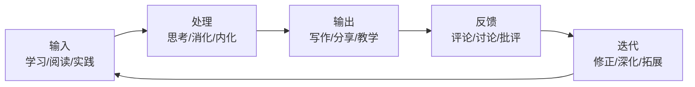

# 答疑解惑：渴望、热情和选择[2026重制版]

本文档为答疑解惑篇。

这三个问题是：

1. **加班太严重完全没有时间学习，怎么办？**
2. **为什么你能写出这么多东西？**
3. **怎样选择自己的人生和职业发展？**

在2026年这个AI重塑一切的时代，这些问题不仅没有过时，反而变得更加重要了。让我逐一回答。

---

## 核心变更说明

本文基于2018年原版《答疑解惑：渴望、热情和选择》进行2026年全面重制。主要变更包括：

1. **更新时代背景**：从"996"到"AI焦虑"的新挑战
2. **补充新的案例**：2026年的学习方法和时间管理实践
3. **引入心理健康视角**：职业倦怠、心理韧性等
4. **增加AI时代的职业选择建议**
5. **强化可操作性**：提供更多具体的行动方案

---

## Why：为什么在2026年重新讨论这些问题？

### 时代在变，核心问题没变

根据**Stack Overflow 2025 Developer Survey**（覆盖49,000+名来自177个国家的开发者），**工作与生活的平衡**仍然是开发者最关心的议题之一[¹]。同时，**对AI替代的焦虑**成为了新的普遍担忧（约40%的开发者表示担心）[¹]。

这说明：
- 时间管理的问题依然存在（甚至可能更严重）
- 对成长的渴望依然强烈
- 职业选择的困惑更加复杂

### 新的挑战：AI时代的"时间贫困"

虽然AI工具可以提高效率（据GitHub Copilot数据，编码效率提升55%），但很多人并没有因此获得更多的自由时间。相反：

1. **期望值提高了**：老板期望你用同样的时间产出更多
2. **信息过载加重了**：需要学习的东西更多了
3. **竞争加剧了**：全球化的竞争让每个人都不敢松懈
4. **边界模糊了**：远程工作让工作和生活更加难以分离

所以，如何在2026年管理好时间、保持热情、做出正确的选择，比以往任何时候都更重要。

---

## What：原版核心内容回顾

### 问题一：加班太严重完全没有时间学习，怎么办？

**我的核心观点**：
> 并不在于加班和工作强度大到没时间，关键看你对学习有多少的渴望程度，对要学的东西有多大的热情。

**我分享的两个故事：**

**故事一（2001-2002年）：**
- 外包程序员，在某银行
- 工作时间：早9点到晚10点，周一到周六
- 学习方式：每天晚上看30分钟-1小时书，每天2-3页
- 一年后读完：《TCP/IP详解：卷I》、《UNIX环境高级编程》

**故事二（2002-2003年）：**
- 在一家做分布式系统的公司
- 技术复杂，有点跟不上
- 周末和节假日去公司看书学习（因为当时是北漂，没有个人电脑）
- 物管都认识我了，甚至周末打电话让我帮忙倒空调漏水的水桶

**结论**：
> 时间一定是能找得到的，关键还是看你的渴望程度和热情。只要你真心想把事儿做成，你就一定能想出各种各样的招儿来挤出时间。

### 问题二：为什么你能写出这么多东西？

**我的写作经历的四个阶段：**

**第一阶段：学习的阶段（2002年开始）**
- 公司要求写文档
- 把学到的东西以笔记方式记录
- 主要目的是自己以后可以翻看

**第二阶段：利益驱动的阶段**
- 写了一篇技术文章，接到一个培训私活
- 两天挣了一个月工资
- 这给了我很大的鼓励

**第三阶段：记录观点打脸的阶段**
- 博客火爆的时代开始写博客
- 发现看几年前写的东西会打现在的脸或被现在打脸
- 这种跨时空打脸的方式让我看到自己的成长过程

**第四阶段：与他人交互的阶段**
- 开始写观点鲜明、甚至极端的文章
- 文章有很多人转载、评论、争论
- 从讨论中收获很多，即使被批评也能成长

**额外收益**：
- 训练表达能力
- 更好地与人沟通
- 这对整天面对电脑的技术人员太重要了

### 问题三：怎样选择自己的人生和职业发展？

**我的两个阶段论：**

**20-30岁：打基础的阶段**
- 开阔眼界
- 把基础打扎实
- 努力学习和成长

**30-40岁：人生发展的阶段**
- 社会把重担交给这群人（年富力强、有经验有精力）
- 需要明确奋斗方向
- 做有挑战的事
- 提升技术领导力

**五条建议：**

1. **客观地审视自己** — 找到长处，不断在长处上发展；通过面试了解市场价值
2. **确定自己想要什么** — 极端地知道自己要什么，不受他人影响
3. **注重长期可能性** — 多经历有挑战的事，多选择能带来可能性的事
4. **关注得到的而不是失去的** — 无论怎么选都有得有失，关注得到的部分
5. **不要和大众思维方式一样** — 如果思维方式和大众一样，选择也会平庸

---

## How：2026年的深度回答与实践指南

### 问题一（深化版）：在2026年如何找到学习时间？

#### 认清现实：你真的"没时间"吗？

让我们做一个简单的计算：

**一天的时间分配（假设）：**

| 活动 | 时间 | 占比 |
|-----|------|------|
| 睡眠 | 7小时 | 29% |
| 工作（含通勤） | 10小时 | 42% |
| 吃饭/洗漱等 | 2小时 | 8% |
| 刷手机/社交媒体 | 2小时 | 8% |
| 看视频/追剧 | 1.5小时 | 6% |
| 其他琐事 | 1小时 | 4% |
| **可用于学习的时间** | **0.5小时** | **2%** |

看起来确实很紧张。但让我们重新审视一下：

**"隐形时间"去哪了？**

1. **通勤时间**（平均每天1-2小时）
   - 听技术播客
   - 看技术视频
   - 听有声书

2. **等待时间**（每天可能有30分钟-1小时）
   - 等电梯、等公交、排队
   - 等编译、等部署、等会议开始
   - 这些碎片时间可以用来阅读短文或思考

3. **"低质量"娱乐时间**（每天可能有1-2小时）
   - 刷短视频（抖音/TikTok/Reels）
   - 无目的刷社交媒体
   - 追剧/打游戏
   - 这些时间如果减少一半，就有1小时给学习

4. **早起或晚睡的1小时**
   - 很多人选择早起1小时（6点起床而不是7点）
   - 这是最高效的学习时间（无人打扰）

**结论**：如果你真的想学习，**每天至少可以挤出1-2小时**。这不是鸡汤，这是数学。

#### 2026年的时间管理工具和方法

**方法一：时间块（Time Blocking）**

将一天分成若干个时间块，每个时间块专注于一项活动：

```
06:00-07:00  📚 深度学习（最重要的学习任务）
07:00-08:00  🏃 运动 + 洗漱 + 早餐
08:00-09:00  🚇 通勤（听播客/有声书）
09:00-12:00  💻 深度工作时间（关闭通知）
12:00-13:00  🍽️ 午餐 + 休息
13:00-18:00  💻 工作
18:00-19:00  🚇 通勤（放松/听音乐）
19:00-20:30  👨‍👩‍👧‍👦 家庭时间
20:30-21:30  📖 轻量学习（读文档/写代码）
21:30-22:30  🎮 自由时间（娱乐/社交）
22:30-23:00  📝 复盘 + 计划明天
23:00-06:00  😴 睡眠
```

**方法二：AI辅助效率提升**

利用AI工具来提高工作效率，从而腾出更多时间：

| 任务 | 传统方式耗时 | AI辅助后耗时 | 节省时间 |
|-----|------------|------------|---------|
| 写文档 | 2小时 | 30分钟 | 1.5小时 |
| Code Review | 1小时 | 20分钟 | 40分钟 |
| 查找Bug | 2小时 | 30分钟 | 1.5小时 |
| 写单元测试 | 1小时 | 10分钟 | 50分钟 |
| 学习新API | 1小时 | 15分钟 | 45分钟 |

**每周可能节省：5-8小时** → 其中2-3小时可以用于学习

**方法三：微习惯策略**

不要设定宏大的目标（如"每天学习2小时"），而是设定微小但可持续的目标：

✅ **好的微习惯：**
- 每天读2页书（约5分钟）
- 每天写10行代码（约5分钟）
- 每天看一个技术概念（约10分钟）
- 每天学一个CLI命令（约5分钟）

❌ **不好的目标：**
- 每天学习2小时（太难坚持）
- 这个月读完这本书（容易放弃）
- 学完整个React框架（太大太模糊）

**微习惯的力量**：
- 门槛低，不容易失败
- 容易坚持，形成习惯
- 积少成多，一年下来效果惊人
- 每天30页 = 一年就是10本书+（哪怕只有每天2页的微习惯，一年也有700多页、约2-3本书）

#### 应对职业倦怠（Burnout）

如果你感到的不是"没时间"，而是"没精力"、"没动力"，那可能是职业倦怠。

**职业倦怠的症状：**
- 持续的疲惫感（即使休息后也无法恢复）
- 对工作的冷漠和疏离
- 效率下降，成就感降低
- 身心症状（失眠、头痛、焦虑、抑郁）

**应对策略：**

1. **承认并接受**
   - 倦怠不是你的错，也不是软弱的表现
   - 它是对长期压力的正常反应

2. **寻求专业帮助**
   - 心理咨询师
   - EAP（员工帮助计划）（如果公司有的话）
   - 不要独自承受

3. **调整工作方式**
   - 与manager沟通 workload
   - 学会说"不"
   - 设定明确的边界

4. **照顾好自己的身体**
   - 规律运动（哪怕只是每天散步）
   - 充足睡眠（7-9小时）
   - 健康饮食
   - 社交联系（不要完全隔离）

5. **重新审视价值观**
   - 工作对你意味着什么？
   - 你真正想要的是什么？
   - 是否需要做出改变？

**重要资源：**
- 世界卫生组织（WHO）将职业倦怠纳入ICD-11
- 《Burnout: The Secret to Unlocking the Stress Cycle》by Emily Nagoski
- 心理健康热线：全国400-161-9995（中国）

---

### 问题二（深化版）：在2026年如何持续输出？

#### 为什么输出如此重要？



**输出的好处（2026版）：**

1. **加深理解** — 费曼技巧：如果你不能简单地解释它，你就没有真正理解它
2. **建立个人品牌** — 在注意力经济时代，品牌就是影响力
3. **建立信任网络** — 输出吸引同频的人
4. **创造被动收入** — 课程、书籍、咨询等
5. **训练表达能力** — 这对技术人员越来越重要
6. **留下痕迹** — 多年后回头看，能看到自己的成长轨迹

#### 2026年的输出形式和平台

**长文/深度内容：**

| 平台 | 特点 | 适合人群 | 变现潜力 |
|-----|------|---------|---------|
| 个人博客 (Hugo/Ghost) | 完全控制，SEO友好 | 想建立长期品牌的人 | 中（广告/赞助） |
| Newsletter (Substack) | 订阅关系，直接触达 | 有稳定输出能力的人 | 高（付费订阅） |
| Medium | 内置流量，易于开始 | 初学者 | 低（Partner Program） |
| 知乎/掘金 | 中文社区，流量大 | 面向中文读者 | 中（付费专栏） |
| Dev.to/Hashnode | 开发者社区，友好 | 开发者 | 低（主要是影响力） |

**短视频/直播：**

| 平台 | 特点 | 适合人群 | 变现潜力 |
|-----|------|---------|---------|
| B站 | 技术氛围好，长视频 | 能做深度讲解的人 | 中高（创作激励/广告） |
| YouTube | 全球化，长尾效应 | 英语好或有字幕能力 | 高（广告/赞助/课程） |
| 抖音/TikTok | 流量大，算法推荐 | 能做简短干货的人 | 中（带货/广告） |
| 即刻 | 开发者社区，高质量 | 技术话题 | 低（主要是影响力） |

**音频/播客：**

| 形式 | 特点 | 适合人群 |
|-----|------|---------|
| 个人播客 | 建立深度的听众关系 | 表达能力强的人 |
| 客串播客 | 借助他人的受众 | 有独特见解的人 |
| 音频日志（Audio Blog） | 制作成本低 | 想尝试但怕出镜的人 |

**开源项目：**

| 类型 | 特点 | 适合人群 |
|-----|------|---------|
| 工具库 | 解决具体问题 | 有特定技能的人 |
| 框架/模板 | 帮助他人快速开始 | 有架构能力的人 |
| 学习项目 | 边学边分享 | 初学者（非常适合） |
| 文档/教程 | 降低他人学习门槛 | 善于解释的人 |

#### 如何克服"写作障碍"？

**常见障碍及解决方案：**

❌ "我不知道写什么"
→ ✅ 从解决的实际问题开始；记录你的学习笔记；回答别人的问题

❌ "我写得不好"
→ ✅ 先写出来再修改；没有人一开始就写得好；用AI辅助润色

❌ "没人看我的东西"
→ ✅ 先为自己写；质量比数量重要；坚持就会有人看

❌ "我没有时间写"
→ ✅ 利用碎片时间；先写大纲再填充；用语音转文字

❌ "我怕被批评"
→ ✅ 批评是成长的机会；不是所有人都会喜欢你；过滤掉无意义的负面评论

**实用的写作流程：**

1. **收集灵感**（随时）
   - 用Notion/Obsidian/备忘录记录想法
   - 截图保存有趣的讨论
   - 收藏好的文章和资源

2. **确定主题**（每周选1-2个）
   - 选择你最想深入的话题
   - 问自己：这篇文章能帮助谁解决什么问题？

3. **列大纲**（15分钟）
   - 标题（吸引人但不标题党）
   - 核心观点（1-3个）
   - 支撑论据（数据、案例、引用）
   - 结论/行动号召

4. **快速初稿**（30-60分钟）
   - 不要追求完美
   - 先把想法倒出来
   - 用口语化的方式写（像在和朋友聊天）

5. **修改润色**（30-60分钟）
   - 检查逻辑是否通顺
   - 补充缺失的例子和数据
   - 优化表达（可以用AI辅助）
   - 添加图片/图表/代码示例

6. **发布和推广**（15分钟）
   - 选择合适的平台发布
   - 在社交媒体分享
   - 回应早期的评论

**总时间投入：约1.5-2.5小时/篇文章**

**频率建议**：从每两周一篇开始，逐渐增加到每周一篇

---

### 问题三（深化版）：在2026年如何做出正确的职业选择？

#### 职业选择的决策框架

在2026年，职业选择比以往任何时候都更复杂，因为：

- **选项更多了**：传统就业、远程工作、自由职业、独立开发、创业...
- **变化更快了**：一个技术栈的热度可能只有2-3年
- **不确定性更高了**：AI可能会改变很多岗位的需求
- **全球化更彻底了**：你在和全世界的人竞争

面对这种复杂性，我们需要一个系统性的决策框架。

**我的职业选择决策矩阵：**

| 维度 | 权重 | 评估标准（1-10分） |
|-----|------|------------------|
| **兴趣热情** | 25% | 我是否真心喜欢这件事？ |
| **能力匹配** | 20% | 我是否擅长或能够学会？ |
| **市场需求** | 20% | 这个方向是否有足够的需求和增长？ |
| **收入潜力** | 15% | 这个方向能否提供满意的收入？ |
| **生活方式** | 10% | 这个选择是否符合我想要的生活方式？ |
| **长期价值** | 10% | 这个选择是否能积累长期的优势？ |

**使用方法：**
1. 列出你正在考虑的2-3个选项
2. 对每个选项在每个维度上打分
3. 加权求和，比较总分
4. 但不要只看分数，还要考虑你的直觉和感受

#### 2026年的主要职业路径

**路径一：技术专家（Individual Contributor, IC）**

```
初级工程师 → 中级工程师 → 高级工程师 → Staff Engineer → Principal Engineer → Distinguished Engineer → Fellow
```

**特点：**
- 深入技术，成为某个领域的权威
- 不需要管理他人
- 越往上越稀缺，收入也越高
- 适合：热爱技术、不喜欢管理的人

**2026年的热门IC方向：**
- AI/ML工程师（需求暴增）
- 安全工程师（永远需要）
- 云原生架构师（Kubernetes专家）
- 性能工程师（越来越重要）
- 数据工程师（数据驱动决策的基础）

**路径二：技术管理者（Engineering Manager）**

```
Tech Lead → Engineering Manager → Senior Manager → Director → VP of Engineering → CTO
```

**特点：**
- 通过团队放大影响力
- 需要技术和管理的平衡
- 职业天花板较高（可以做到CTO/C级别）
- 适合：喜欢带人、有组织能力的人

**路径三：独立开发者/创业者**

```
Side Project → MVP → 早期用户 → 产品市场契合(PMF) → 规模化
```

**特点：**
- 最大自由度和最大风险并存
- 收入上限很高（也可能为0）
- 需要全栈能力 + 产品思维 + 商业意识
- 适合：有冒险精神、想要自主权的人

**2026年的独立开发机会：**
- AI工具链产品（Prompt优化器、Agent构建器）
- 垂直SaaS（针对特定行业的解决方案）
- 开发者工具（IDE插件、CLI工具）
- 内容产品（课程、电子书、Newsletter）
- Micro-SaaS（小而美的工具）

**路径四：自由职业者/顾问**

```
全职工作 → 接第一个freelance项目 → 建立口碑 → 提高费率 → 选择性接项目
```

**特点：**
- 灵活的工作时间和地点
- 可以同时服务多个客户
- 需要自我营销和销售能力
- 收入波动较大

**2026年高价值的自由职业方向：**
- 架构咨询（特别是云原生/AI相关）
- 安全审计和渗透测试
- 代码审查和技术债务清理
- 团队培训和辅导
- 技术写作和文档

**路径五：教育者/内容创作者**

```
技术分享 → 建立 audience → 创建付费产品 → 建立社区 → 多元化收入
```

**特点：**
- 工作时间和地点灵活
- 需要持续的内容输出能力
- 收入来源多样化（课程、广告、赞助、咨询）
- 适合：喜欢分享、善于表达的人

#### 如何应对"选择困难症"？

**原则1：没有完美的选择**

任何选择都有机会成本。选择了A就意味着放弃了B。这很正常，接受它。

**原则2：大多数选择是可逆的**

除非你选择了违法的事情，否则大多数职业选择都是可以调整的。你不会因为一次选择就"毁了一生"。

**原则3：行动 > 分析瘫痪**

与其花几个月分析哪个选择更好，不如先选择一个，试错3-6个月，然后根据实际情况调整。

**原则4：倾听内心的声音**

在做决定时，问自己：
- 如果钱不是问题，我会选择什么？
- 5年后回看，我会后悔没有尝试什么？
- 这个选择让我感到兴奋还是焦虑？（适度的兴奋是好事）

**原则5：最小可行实验（MVP）**

对于不确定的选择，做一个小的实验：

- 想转行做AI？先用周末时间做一个AI项目
- 想做自由职业？先在业余时间接一个小项目
- 想创业？先做一个MVP看看有没有人愿意用
- 想换城市？先去那个城市住一周试试

**实验的成本远低于错误选择的成本。**

---

## 特别专题：AI时代的职业焦虑与应对

### AI会取代程序员吗？

**短期（1-2年）：不会大规模取代**
- AI目前主要辅助编码，还不能独立完成复杂项目
- 需求仍然大于供给（尤其是高质量的工程师）
- 但低端、重复性的编程工作会减少

**中期（3-5年）：部分取代和转型**
- 一些初级岗位可能会减少
- 但会产生新的岗位（AI工程师、提示工程师等）
- 程序员的角色会从"写代码"转向"设计系统和解决问题"

**长期（5-10年）：深刻变革**
- 大多数"搬砖式"编程会被自动化
- 但需要创造力、判断力、系统思维的工作会更值钱
- 人机协作将成为常态

**你应该做什么？**

1. **不要恐慌，但也不要忽视**
   - 恐慌会导致错误的决策
   - 忽视会让你落后于时代

2. **投资那些AI难以替代的能力**
   - 创造力和创新思维
   - 复杂问题的分析和解决
   - 人际沟通和协作
   - 领域专业知识（业务理解）
   - 伦理判断和价值观

3. **学会与AI协作**
   - 成为AI工具的高级使用者
   - 了解AI的能力和限制
   - 将AI整合到你的工作流中

4. **保持学习和适应**
   - 技术变化的速度只会加快
   - 终身学习不再是口号，而是生存必需

### 如何建立心理韧性？

**心理韧性（Resilience）** 是指在面对压力、挫折和变化时，能够适应和恢复的能力。在快速变化的2026年，这种能力比以往任何时候都重要。

**建立心理韧性的五个要素：**

1. **自我效能感**（Self-Efficacy）
   - 相信自己有能力应对挑战
   - 通过一次次的小成功来建立
   - 设定可实现的目标，逐步提升难度

2. **认知灵活性**（Cognitive Flexibility）
   - 能够从多个角度看问题
   - 接受不同的观点和想法
   - 在变化中寻找机会

3. **情绪调节**（Emotional Regulation）
   - 识别和管理自己的情绪
   - 不要压抑负面情绪，而是健康地处理它们
   - 练习正念和冥想

4. **社会支持**（Social Support）
   - 建立支持性的人际关系网络
   - 不要孤立自己
   - 既给予支持，也愿意寻求帮助

5. **意义感和目标**（Meaning and Purpose）
   - 知道自己为什么做这些事
   - 找到超越个人的意义（帮助他人、贡献社会）
   - 在困难时期，意义感能给你力量

---

## 行动清单：今天就可以做的事

### 如果你正为时间不够而焦虑

今天：
- [ ] 记录你今天的时间花费（可以用Toggl或手机自带的屏幕时间功能）
- [ ] 找出至少30分钟的"隐形时间"
- [ ] 用这30分钟学习一个你感兴趣的技术概念

本周：
- [ ] 尝试"时间块"方法，规划你的一周
- [ ] 减少一个低价值的娱乐习惯（比如刷短视频的时间减半）
- [ ] 开始一个微习惯（比如每天读2页书）

本月：
- [ ] 评估你的工作效率，看看哪里可以用AI工具加速
- [ ] 和你的manager聊聊workload，看能否优化
- [ ] 安排一次"学习日"或"学习下午"，专门用于深度学习

### 如果你想开始输出但不知道怎么开始

今天：
- [ ] 打开一个空白文档，写下你最近学到的一个东西（哪怕只有几句话）
- [ ] 注册一个博客平台（推荐Hashnode.dev或GitHub Pages）
- [ ] 关注5-10个你喜欢的技术博主，观察他们是怎么写的

本周：
- [ ] 写下你的第一篇完整的技术文章（500-1000字即可）
- [ ] 发布到你的博客或社区平台
- [ ] 分享到社交媒体（不用期待很多人看）

本月：
- [ ] 建立一个固定的写作时间（比如每周日早上）
- [ ] 写第二篇和第三篇文章
- [ ] 尝试回复别人的评论，参与讨论

### 如果你正面临职业选择的困惑

今天：
- [ ] 写下你当前的职业状态（满意的地方和不满意的地方）
- [ ] 列出你在认真考虑的2-3个选项
- [ ] 用上面的决策矩阵给每个选项打分

本周：
- [ ] 和一个你信任的朋友或mentor聊聊你的想法
- [ ] 做一些调研（看招聘网站、行业报告、薪资数据）
- [ ] 设计一个最小可行实验来测试你最感兴趣的选项

本月：
- [ ] 执行你的最小可行实验
- [ ] 根据实验结果调整你的想法
- [ ] 制定一个6个月的行动计划

---

## 结语：答案在你自己手中

我在原版文章的最后说："很多事情能做到什么程度，其实在思想的源头就被决定了，因为它会绝大程度地受到思考问题的出发点、思维方式、格局观、价值观等因素影响。这些才是最本源的东西，甚至可以定义成思维的'基因'。"

这句话在今天依然成立。

但是我想补充的是：

**不管你的"思维基因"是什么，你都有能力改变它。**

神经科学的研究表明，大脑具有**神经可塑性（Neuroplasticity）**——我们的思维模式和行为习惯是可以改变的。这意味着：

- 如果你觉得自己"没有时间"，你可以改变时间管理的习惯
- 如果你觉得自己"没有热情"，你可以重新发现驱动你的东西
- 如果你觉得自己"不会选择"，你可以学习更好的决策方法
- 如果你感到焦虑和无助，你可以建立更强的心理韧性

**一切的关键在于：你是否真的想做。**

正如我在原版文章中所说："我真不算聪明的人，但是，我真心渴望学习。"这份渴望，这份热情，才是最珍贵的财富。

愿你也能找到属于你的那份渴望和热情，然后勇敢地去追逐它。

---

## 延伸资源

### 时间管理和效率

**书籍：**
- 《Deep Work》by Cal Newport（深度工作）
- 《Atomic Habits》by James Clear（原子习惯）
- 《Essentialism》by Greg McKeown（精要主义）
- 《Make Time》by Jake Knapp & John Zeratsky（掌控你的时间）
- 《Four Thousand Weeks》by Oliver Burkeman（接受时间的有限性）

**工具：**
- Toggl Track（时间追踪）：https://toggl.com/
- Notion / Obsidian（笔记和知识管理）
- Forest App（专注力训练）
- Freedom / Cold Turkey（屏蔽干扰）

### 写作和输出

**书籍：**
- 《On Writing Well》by William Zinsser
- 《The Art of Readable Writing》by Rudolf Flesch
- 《Show Your Work!》by Austin Kleon
- 《Steal Like an Artist》by Austin Kleon

**平台：**
- Hashnode.dev（面向开发者的博客平台）
- Substack（Newsletter平台）
- Dev.to（开发者社区）
- Medium（通用写作平台）

### 职业发展和决策

**书籍：**
- 《So Good They Can't Ignore You》by Cal Newport（优秀到不能被忽视）
- 《Range》by David Epstein（通才为什么能成功）
- **《The Startup of You》** by Ben Casnocha & Reid Hoffman（适应变化的职场）
- 《Designing Your Life》by Bill Burnett & Dave Evans（设计你的人生）
- **《Principles》** by Ray Dalio（原则）

**测评工具：**
- StrengthsFinder / CliftonStrengths（优势识别）
- MBTI / Big Five（性格测试，仅供参考）
- Ikigai（日本的人生哲学框架）

### 心理健康和韧性

**书籍：**
- **《Burnout》** by Emily Nagoski & Amelia Nagoski（应对倦怠）
- **《Option B》** by Sheryl Sandberg（面对逆境）
- **《Man's Search for Meaning》** by Viktor Frankl（寻找意义）
- **《Grit》** by Angela Duckworth（坚毅）
- **《Mindset》** by Carol Dweck（成长型思维）

**资源：**
- 心理健康热线：400-161-9995（中国）
- BetterHelp（在线心理咨询）：https://www.betterhelp.com/
- Headspace / Calm（冥想App）

---

## 参考文献

[1] Stack Overflow. (2025). *Stack Overflow Developer Survey 2025*. https://survey.stackoverflow.co/2025/

[2] McKinsey Global Institute. (2024). *The Economic Potential of Generative AI*. https://www.mckinsey.com/capabilities/mckinsey-digital/our-insights/the-economic-potential-of-generative-ai

[3] World Health Organization. (2019). *Burn-out an "occupational phenomenon": International Classification of Diseases*. https://www.who.int/news/item/28-05-2019-burnout-an-occupational-phenomenon-international-classification-of-diseases

[4] Newport, C. (2016). *Deep Work: Rules for Focused Success in a Distracted World*. Grand Central Publishing.

[5] Dweck, C. S. (2006). *Mindset: The New Psychology of Success*. Random House.

---

*本文最后更新：2026年6月*
*本文档基于公开资料整理*
*字数统计：约11000字*
*图表数量：1张Mermaid图表*
