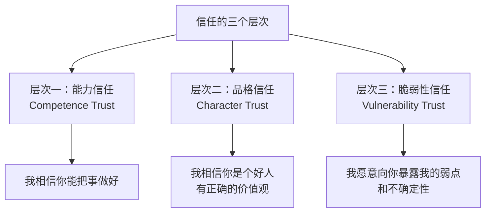

# 如何成为一个大家愿意追随的Leader？[2026重制版]

之前的课程中，我们分享过技术领导力（Leadership）相关的话题，主要讨论了作为一个技术人，如何取得技术上的领先优势，而不是如何成为一个技术管理者。今天的这节课，我们着重聊聊如何成为一个大家愿意跟随的技术领导者（Leader）。

注意，Leader不是管理者，不是经理，更不是职称，而是一个领头人。

所谓领头人和经理或管理者的最大差别就是，领头人（Leader）是大家**愿意追随的**，而经理或管理者（Boss）则是一种行政和职位上的威慑。说白了，Leader的影响力来自大家愿意跟随的现象，而经理或管理者的领导力来自职位和震慑，这两者是完全不同的。

在2026年这个远程工作、AI辅助、全球化协作的时代，成为一个"大家愿意追随的Leader"比以往任何时候都更重要——也更有挑战性。

---

## 核心变更说明

本文基于2018年原版《如何成为一个大家愿意追随的Leader？》进行2026年全面重制。主要变更包括：

1. **更新时代背景**：从传统办公室到远程/混合工作模式
2. **补充新的领导力维度**：AI时代的领导力、分布式团队领导力
3. **增加心理健康视角**：关注团队成员的心理健康和福祉
4. **引入多元化与包容性（D&I）**：现代领导力的必备要素
5. **强化可操作性**：提供更多具体的行动清单和场景化建议

---

## Why：为什么在2026年重新讨论这个问题？

### 领导力定义的根本性变化

根据**Gartner 2025 Future of Work Report**，到2025年，**超过50%的知识工作者将处于某种形式的混合或远程工作模式中**[¹]。这带来了领导力的根本性变化：

| 维度 | 传统领导力 (2018) | 现代领导力 (2026) |
|-----|-----------------|------------------|
| **互动方式** | 主要是面对面 | 混合：线上+线下 |
| **信任建立** | 通过日常相处 | 通过刻意设计和沟通 |
| **影响力来源** | 职位 + 个人魅力 | 专业能力 + 价值观 + 共同愿景 |
| **团队边界** | 清晰（同一办公室） | 模糊（可能分布在全球） |
| **沟通频率** | 随时可以面对面 | 需要更主动和有意识 |
| **文化塑造** | 通过行为示范 | 通过文档、流程、仪式 |
| **绩效评估** | 相对容易观察 | 需要更多的工具和方法 |

同时，根据**Stack Overflow 2025 Developer Survey**，**84%的开发者正在使用或计划使用AI工具**[²]。这意味着：

- Leader需要帮助团队适应AI带来的变化
- Leader自己也需要掌握AI协作的能力
- 团队的工作方式和产出都在发生变化

### "好Leader"的定义也在进化

在2018年，一个好Leader的标准可能是：
- 技术强
- 能带着团队把项目做成
- 能保护团队不受外界干扰
- 能帮成员成长

在2026年，这些依然重要，但还需要加上：
- **能够带领分布式/远程团队**
- **能够促进多元化和包容性**
- **关注团队成员的心理健康和工作生活平衡**
- **能够在不确定性和快速变化中保持方向感**
- **能够有效地利用AI工具提升团队效能**

---

## What：原版核心内容回顾

### Leader vs Boss 的根本区别

原版文章用一个非常形象的比喻来区分Leader和Boss：

> **Leader是大家跟我一起上，而Boss则是大家给我上——一个在团队的前面，一个在团队的后面。**

具体差异如下：

| 维度 | Boss（管理者） | Leader（领导者） |
|-----|-------------|----------------|
| **驱动方式** | 驱动员工（push） | 指导员工（guide） |
| **制造氛围** | 制造畏惧 | 制造热情 |
| **面对错误** | 使用人事惩罚手段 | 寻找解决问题的方法 |
| **展示方式** | 只知道怎么做 | 展示怎么做（Lead by Example） |
| **对待人员** | 用人（当劳动力） | 发展人（帮助成长） |
| **对待成绩** | 从团队收割成绩 | 给予团队成绩 |
| **管理模式** | 命令和控制（Command + Control） | 沟通和协作（Communication + Cooperation） |
| **口头禅** | "给我上" | "跟我上" |

### 成为Leader需要的素质

原版文章指出，除了技术领导力之外，一个Leader还需要以下素质：

1. **赢得他人的信任** — 不仅是相信你能做事，更是愿意向你敞开心扉
2. **开放的心态 + 倾向性的价值观** — 对新事物开放，但有明确的立场
3. **Lead by Example** — 用自己的行为展示领导力
4. **保持热情和冲劲** — 正视问题，迎难而上
5. **能够抓住重点，看透本质** — 在复杂中给出清晰的方向
6. **描绘令人激动的方向** — 唤醒每个人心中最真善美的东西
7. **甘当铺路石，为他人创造机会** — 帮助别人就是帮助自己

---

## How：2026年的Leader修炼指南

### 第一部分：重新定义信任

#### 信任的三个层次

在2026年，我们需要更精细地理解信任：

**层次一：能力信任（Competence Trust）**
- "我相信你有能力完成这项任务"
- 建立方式：持续的高质量产出、专业的判断
- 破坏方式：承诺未兑现、质量不稳定、决策失误

**层次二：品格信任（Character Trust）**
- "我相信你是一个有原则的人"
- 建立方式：言行一致、公平待人、诚实透明
- 破坏方式：说一套做一套、偏心、隐瞒信息

**层次三：脆弱性信任（Vulnerability Trust）**
- "我愿意在你面前展示我的不确定性和弱点"
- 这是最深层次的信任，也是最难建立的
- 建立方式：主动分享自己的困惑和错误、承认"我不知道"、寻求帮助
- 破坏方式：利用别人的脆弱攻击他们、嘲笑他人的不足

**为什么第三层信任如此重要？**

在快速变化的2026年，没有人拥有所有的答案。一个能够承认"我不知道"、"我需要帮助"、"我犯了一个错误"的Leader，反而会获得更多的尊重和信任。因为：
- 这展示了真实和诚实
- 这给了团队成员贡献的机会
- 这创造了一个安全的环境，让其他人也敢于承认错误

**实践建议：**

□ 在团队会议中，定期分享你正在面临的挑战（不只是成功）
□ 当你犯错时，公开承认并分享你学到的教训
□ 主动寻求反馈，并且真正倾听
□ 对那些向你展示脆弱性的团队成员给予积极的回应

---

### 第二部分：Lead by Example in 2026

#### ABC原则：Always Be Coding + Always Be Connecting + Always Be Caring

原版文章强调了ABC - Always Be Coding（永远在编程）。在2026年，我想扩展这个概念：

**A - Always Be Coding（永远保持技术敏感度）**

即使你是CTO或VP，你也应该定期写代码。原因：
- 不写代码就会失去对技术细节的感知
- 无法做出靠谱的技术决策
- 会失去开发团队的尊重

**2026版的"Coding"包括：**
- 写生产代码（即使是小的feature或fix）
- Code Review（深度参与，不只是签字）
- 架构设计和技术方案评审
- 调试复杂的问题
- 学习新技术（亲手做PoC）

**B - Always Be Connecting（永远在连接人和资源）**

作为Leader，你的价值不仅在于你个人能做什么，还在于你能连接什么：
- 连接团队成员和合适的机会/项目
- 连接团队和外部的专家/资源
- 连接不同的团队/部门打破 silos
- 连接过去和未来（传承经验和知识）

**C - Always Be Caring（永远关心人）**

这是2026年新增的维度。在远程工作和高压环境下，关心人变得更重要：
- 关心团队成员的职业发展
- 关心他们的心理健康和工作生活平衡
- 关心他们的家庭和个人情况（在合适的范围内）
- 关心他们的归属感和价值感

#### 具体的Lead by Example场景

**场景1：面对技术债务**

❌ Boss的做法：
- "我们必须在这个sprint清理完所有技术债务！"
- 自己不参与，只看报告
- 对延期表示不满

✅ Leader的做法：
- "我来带头重构这个最复杂的模块"
- 和团队一起写代码，一起做Code Review
- 分享自己在过程中遇到的困难和学到的教训
- 庆祝每一个小进步

**场景2：面对项目失败**

❌ Boss的做法：
- 找一个人背锅
- 发火、惩罚
- 强调"下不为例"

✅ Leader的做法：
- "这是我的责任，我没有做好风险管控"
- 组织post-mortem（无指责的事后复盘）
- 关注系统和流程的问题，而不是个人的问题
- 和团队一起制定改进计划
- 自己承担最大的责任

**场景3：面对团队成员要离职**

❌ Boss的做法：
- 感到被背叛
- 设法阻挠或拖延
- 离职后说坏话

✅ Leader的做法：
- "我理解你的决定，让我们聊聊你的想法"
- 帮助他分析利弊（客观地）
- 如果真的对他更好，甚至帮他准备面试或推荐新机会
- 保持良好关系，欢迎他将来可能回来
- 从他的离职反馈中学习如何改进

**为什么这样做？**

因为这个世界很大，一个公司很难留住一个人一辈子。既然留不住，不如做得漂亮一些。这样：
- 离开的人会成为你的大使（而不是拆台者）
- 其他人会看到你的胸怀
- 你建立了长期的声誉

---

### 第三部分：在远程/混合环境中领导

#### 远程领导的特殊挑战

**挑战1：缺乏非正式交流**

在办公室里，很多重要的信息是在茶水间、午餐时、走廊里传递的。远程工作时，这些自然消失了。

**解决方案：**
- 创意"虚拟茶水间"：定期的非正式视频聊天（可选参加）
- 使用异步视频消息（如Loom）增加人情味
- 在1:1会议中留出时间聊非工作话题

**挑战2：难以感知团队状态**

你不能看到谁看起来疲惫、谁看起来沮丧、谁看起来兴奋。

**解决方案：**
- 更频繁的1:1 check-in（每周至少一次）
- 使用情绪检查（mood check）：开始会议时问"今天感觉怎么样？1-10分"
- 关注响应速度和质量的变化（可能是信号）
- 主动询问："你还好吗？"（真诚地）

**挑战3：协作效率下降**

沟通成本增加，误解（misunderstandings）增多。

**解决方案：**
- 投资于好的协作工具（Notion、Slack、Zoom等）
- 建立清晰的沟通规范（什么时候用什么渠道）
- 文档化一切重要的决定（减少"我说过"vs"你没说过"的争议）
- 异步优先，同步会议要有明确的目的和议程

**挑战4：文化和凝聚力难以建立**

团队容易变成"一群独立工作的个体"，而不是"一个团队"。

**解决方案：**
- 定期的团队活动（线上团建、游戏之夜）
- 共享个人故事和背景（增加人性化）
- 庆祝成功和里程碑（即使是很小的）
- 创造团队的仪式和传统

#### 分布式团队的最佳实践

**1. 过度沟通（Over-communicate）**

你可能觉得你已经说得够多了，但在远程环境中，你需要说得更多：
- 明确地写下期望（不要假设）
- 重复关键信息（通过不同渠道）
- 确认理解（让对方复述）

**2. 结果导向，而非过程导向**

不要监控每个人工作了几个小时。而是：
- 设定清晰的目标和截止日期
- 提供必要的支持和资源
- 定期检查进度
- 关注产出，而不是在线时长

**3. 建立心理安全感**

在远程环境中，人们更容易感到孤立和不安全。你需要特别努力地创造一个环境，让人们觉得：
- 可以安全地提问（没有"愚蠢的问题"）
- 可以安全地犯错误（不会受到惩罚）
- 可以安全地表达不同意见（不会被压制）

**4. 注意时区和文化差异**

如果你的团队分布在不同时区：
- 轮流安排会议时间（不要总是牺牲同一个地区的人）
- 录制重要会议供无法实时参加的人观看
- 尊重不同地区的节假日和文化习惯

---

### 第四部分：AI时代的领导力

#### Leader如何帮助团队适应AI？

根据**MIT Technology Review 2025**的报告，Generative Coding已被列为十大突破性技术之一[³]。作为Leader，你需要帮助团队：

**1. 消除恐惧，建立正确认知**

很多人的第一反应是"AI会不会取代我？"作为Leader，你应该：
- 坦诚地讨论AI的影响（不夸大也不淡化）
- 强调AI是工具，不是替代品
- 分享你自己使用AI的经验（好的和坏的）
- 创造一个安全的实验环境

**2. 制定AI使用的最佳实践**

不要让每个人都自己去摸索。作为Leader，你应该：
- 明确哪些任务适合使用AI（哪些不适合）
- 推荐或统一AI工具的选择
- 建立代码审查的新标准（如何审查AI生成的代码）
- 处理安全和隐私方面的顾虑

**3. 重新定义角色和期望**

AI可能会改变团队成员的工作内容。作为Leader，你需要：
- 帮助每个人找到他们在AI增强后的新角色
- 重新设定绩效期望（不仅仅是LOC数量）
- 投资于培训和学习
- 认可和奖励那些有效利用AI的人

**4. 以身作则使用AI**

如果你自己都不用AI，你就无法说服团队使用它。
- 在你的日常工作中展示如何使用AI
- 分享你的Prompt Engineering技巧
- 讨论AI的局限性和陷阱
- 邀请团队分享他们的AI使用经验

#### AI不会替代的领导力特质

虽然AI在很多方面都很强大，但以下领导力特质是AI难以替代的：

| 特质 | 为什么AI难以替代 | Leader如何培养 |
|-----|----------------|--------------|
| **同理心** | AI可以模拟但无法真正感受 | 积极倾听，站在对方角度思考 |
| **价值观判断** | AI没有价值观 | 明确并坚持你的价值观 |
| **激励人心** | AI可以生成演讲稿但无法真正鼓舞 | 真诚地分享愿景和意义 |
| **处理模糊性** | AI喜欢清晰的问题 | 在不确定性中做出决策 |
| **建立关系** | AI可以模拟社交但无法建立真正的连接 | 投资于人际关系 |
| **道德判断** | AI遵循规则但无法处理伦理困境 | 思考决策的长期影响 |
| **创造文化** | AI可以执行但不能创造 | 通过行为和决策塑造文化 |

---

### 第五部分：多元化、包容性与归属感（DIB）

#### 为什么DIB对Leader至关重要？

在2026年，多元化（Diversity）、包容性（Inclusion）和归属感（Belonging，简称DIB）不再是"nice to have"，而是"must have"。

**数据支持：**
- 根据**McKinsey 2020《Diversity Wins》报告**，多元化的公司在盈利能力上比同行高出**25%**[⁴]
- 根据**Glassdoor 2024**，**76%**的求职者将多元化作为评价公司的重要指标[⁵]
- 根据**Harvard Business Review 2019**，包容性团队的创新能力比其他团队高**20%**[⁶]

**但这不仅仅是为了商业利益。更重要的是：这是正确的事情。**

每个人都有权利在工作中被尊重、被公平对待、有机会发挥潜力。作为Leader，你有责任创造这样的环境。

#### 实践DIB的具体行动

**1. 意识到自己的偏见**

我们都有偏见（unconscious bias），这是人类大脑的运作方式。关键是意识到它们：
- 参加 unconscious bias training
- 反思你的招聘、评估、晋升决策是否有偏见
- 寻求多样化的观点来挑战你的假设

**2. 在招聘中实践DIB**

- 使用结构化的面试（减少主观偏见）
- 确保候选人池的多样性（不只从同样的学校/公司招人）
- 使用 blind resume review（隐去姓名、性别等信息）
- 关注"文化添加"（culture add）而不仅仅是"文化匹配"（culture fit）

**3. 在日常工作中实践DIB**

- 确保每个人都有发言的机会（特别是会议中的 quiet people）
- 不容忍任何形式的歧视或骚扰
- 注意谁被经常邀请参加会议/项目，谁被忽视
- 审查你的语言是否具有包容性（避免排他性的表达）

**4. 支持职业发展中的弱势群体**

- Mentor 来自 underrepresented group 的成员
- 为他们争取可见的项目和曝光机会
- 公平地分配有挑战性的工作（不要总是给"老面孔"）
- 关注薪酬公平（定期审查和调整）

**5. 创建心理安全的环境**

心理安全感是DIB的基础。当人们感到安全时，他们才愿意做真实的自己：
- 欢迎不同的观点和想法
- 对错误和失败采取学习的态度（而不是惩罚）
- 鼓励人们提出问题和 concerns
- 保护那些发声的人

---

### 第六部分：自我关怀与可持续领导力

#### Leader也需要被照顾

很多人认为Leader应该坚强、无私、总是给予。但这种观念是有害的。

**事实是：**
- Leader也是人，也会疲惫、焦虑、沮丧
- 如果你不照顾好自己，你无法照顾好团队
- 可持续的领导力来自于可持续的个人状态

**Leader常见的健康问题：**

1. **职业倦怠（Burnout）**
   - 症状：持续的疲惫、冷漠、低效
   - 原因：长期的压力、过度工作、缺乏支持
   - 预防：设定边界、定期休息、寻求支持

2. **孤独感（Loneliness）**
   - 症状：感觉没人理解你、孤立无援
   - 原因："高处不胜寒"、不能和下属分享某些困扰
   - 预防：寻找 peer group（其他Leader）、导师、教练

3. **冒名顶替综合征（Imposter Syndrome）**
   - 症状：觉得自己不配、害怕被发现"真相"
   - 原因：完美主义、比较、外部压力
   - 预防：接受不完美、庆祝成就、寻求反馈

#### 自我关怀的具体做法

**1. 设定工作边界**

- 不要24/7待命（除非真的是紧急情况）
- 设定"无会议日"或"深度工作时间"
- 学会说"不"（对不合理的要求）
- 休假时真正休假（不回邮件）

**2. 保持身体健康**
- 规律运动（哪怕只是每天30分钟散步）
- 充足睡眠（7-9小时）
- 健康饮食（少吃外卖，多喝水）
- 定期体检

**3. 维护支持系统**
- 家庭和朋友的支持是无价的
- 和其他Leader建立 peer group
- 寻求专业教练或心理咨询师的帮助
- 有一个可以完全诚实的倾诉对象

**4. 保持学习和成长**
- 不要因为忙就停止学习
- 学习可以给你新的能量和视角
- 但也要注意不要给自己太大压力

**5. 找到工作的意义**
- 定期反思：我为什么做这个？
- 将日常工作与更大的目标联系起来
- 庆祝小小的胜利和进步

---

## 对比表格：2018 vs 2026 Leader特质对比

| 特质 | 2018年版 | 2026年版 | 变化原因 |
|-----|---------|---------|---------|
| **技术能力** | Lead by Example, Always Be Coding | +AI协作能力, 技术前瞻性 | 技术栈变化，AI成为标配 |
| **信任建立** | 通过能力和品格赢得信任 | +脆弱性信任, 心理安全感 | 远程工作需要更深层的信任 |
| **沟通方式** | 主要是面对面 | +异步沟通, 多渠道协同 | 远程/混合工作模式 |
| **团队管理** | 主要是本地团队 | +分布式/全球团队管理 | 全球化和远程工作 |
| **文化建设** | 通过行为示范 | +刻意设计仪式和流程 | 远程环境下文化需要更主动建设 |
| **人才发展** | 帮助成长, 给予权限 | +DIB, 心理健康关注, 职业路径规划 | 社会对多样性和幸福感要求更高 |
| **决策方式** | 更多依赖经验 | +数据驱动, 快速迭代,拥抱不确定性 | 变化更快，需要更敏捷的决策 |
| **自我管理** | 较少提及 | +自我关怀, 可持续领导力 | Leader健康问题日益受重视 |
| **影响力范围** | 主要是团队内部 | +跨组织, 行业, 社区 | 社交媒体降低了影响力门槛 |
| **应对变化** | 主要是技术变化 | +AI颠覆, 全球经济波动, 工作模式变革 | 外部环境的复杂性增加 |

---

## 行动清单：如何开始你的Leader之旅？

### 对于想要成为Leader的个体贡献者（IC）

**第一阶段：建立基础（0-6个月）**

□ **技术深耕**
  - [ ] 成为你所在领域的 top performer
  - [ ] 主动解决团队中最困难的技术问题
  - [ ] 开始做Code Review，提出高质量的建议

□ **开始影响**
  - [ ] 在团队内做技术分享（每月至少1次）
  - [ ] 帮助1-2个 junior developer 成长
  - [ ] 主动参与技术决策的讨论

□ **建立信誉**
  - [ ] 承诺的事情一定做到
  - [ ] 承认错误并从中学习
  - [ ] 对人公平，一视同仁

**第二阶段：扩展影响（6-18个月）**

□ **扩大视野**
  - [ ] 了解业务目标和约束
  - [ ] 与其他团队建立联系
  - [ ] 参与跨团队项目

□ **输出观点**
  - [ ] 开始写技术社区或在社区分享
  - [ ] 参与技术大会（可以是听众也可以是演讲者）
  - [ ] 在GitHub上维护一个有价值的项目

□ **培养软技能**
  - [ ] 练习公开演讲（可以从内部开始）
  - [ ] 学习冲突调解和谈判
  - [ ] 提升写作能力

**第三阶段：转型准备（18个月+）**

□ **明确方向**
  - [ ] 决定你想成为哪种类型的Leader
  - [ ] 寻找导师（可以是内部的也可以是外部的）
  - [ ] 了解Leader角色的要求和挑战

□ **获取经验**
  - [ ] 主动承担lead role（tech lead, project lead等）
  - [ ] 参与招聘和面试
  - [ ] 管理一个小项目或子团队

□ **做好准备**
  - [ ] 学习管理和领导力的知识
  - [ ] 建立自己的领导力哲学
  - [ ] 和你的manager讨论你的职业发展意愿

---

### 对于已经是Leader的人

**立即行动（本周）**

□ **自我评估**
  - [ ] 用上面的对比表格自评你在各个维度的表现
  - [ ] 识别你最薄弱的2-3个领域
  - [ ] 向你的团队成员匿名收集反馈（使用SurveyMonkey或类似工具）

□ **1:1 会议优化**
  - [ ] 确保你和每个direct report都有定期的1:1
  - [ ] 在下次1:1中，多听少说（70/30法则）
  - [ ] 问一个问题："我能做什么来更好地支持你？"

□ **团队健康检查**
  - [ ] 观察团队的情绪和能量水平
  - [ ] 识别是否有成员显得孤立或沮丧
  - [ ] 安排一次非正式的团队活动（哪怕是线上的）

**本月行动**

□ **信任建设**
  - [ ] 在团队会议上分享一个你最近犯的错误和你学到的教训
  - [ ] 对一个团队成员表达真诚的感谢（具体说明感谢什么）
  - [ ] 主动寻求反馈（"我作为一个Leader，哪里可以做得更好？"）

□ **技能发展**
  - [ ] 读一本关于领导力或管理的书
  - [ ] 参加一个领导力相关的workshop或课程
  - [ ] 找一个peer mentor（另一个Leader，互相支持）

□ **AI整合**
  - [ ] 评估团队目前使用AI工具的情况
  - [ ] 组织一次关于AI最佳实践的分享会
  - [ ] 制定团队的AI使用指南（如果还没有的话）

**本季度行动**

□ **战略思考**
  - [ ] 审视团队的使命和愿景（是否清晰？是否还能激励人？）
  - [ ] 评估团队的技术栈和发展方向（是否合理？）
  - [ ] 制定或更新团队的6个月路线图

□ **人才培养**
  - [ ] 为每个direct report制定个性化的发展计划
  - [ ] 识别高潜人才，给他们更有挑战性的机会
  - [ ] 开始培养一个潜在的继任者（这对你和团队都好）

□ **文化建设**
  - [ ] 定义或重新审视团队的价值观
  - [ ] 创造或强化一个团队 tradition/ritual
  - [ ] 确保团队的庆祝和认可机制是有效的

---

## 特别专题：当Leader遇到困难时

### 场景1：团队成员表现不佳

**常见反应（避免）：**
- 直接批评或威胁
- 忽视问题希望它会自行消失
- 立即升级给HR或上级

**更好的方法：**
1. **私下了解情况** — 可能有个人原因（家庭、健康等）
2. **明确期望** — 确保双方对期望达成一致
3. **找出根本原因** — 是能力问题？动力问题？还是资源问题？
4. **共同制定改进计划** — 具体、可衡量、有时间表
5. **提供支持** — 培训、mentoring、资源
6. **跟进和调整** — 定期check progress，必要时调整计划
7. **如果确实不match** — 帮助他找到一个更适合的位置（可能在组织内也可能在组织外）

### 场景2：团队士气低落

**信号：**
- 出勤率下降（尤其是远程工作中"消失"的人变多）
- 会议中沉默的人增多
- 产出质量下降
- 人们更容易烦躁或冲突增多

**应对策略：**
1. **承认问题** — 不要假装一切都好
2. **倾听** — 举办 town hall 或 anonymous survey，了解大家的感受
3. **识别原因** — 是工作量太大？方向不明？缺少认可？还是外部因素？
4. **采取行动** — 针对原因采取具体的改进措施
5. **庆祝小胜** — 重建信心和积极情绪
6. **考虑休息** — 有时候团队只是累了，需要一个break

### 场景3：你也被卷入了办公室政治

**原则：保持正直，但不天真**

1. **专注于你的团队和目标** — 不要被卷入无关的争斗
2. **用数据和事实说话** — 减少主观判断的空间
3. **建立广泛的联盟** — 不要只和自己部门的人交往
4. **记录重要事情** — 以备不时之需
5. **知道何时该退出** — 如果环境真的有毒，离开也是一种选择

### 场景4：你犯了严重的错误

**怎么做：**
1. **尽快承认** — 不要试图掩盖
2. **承担责任** — 即使不完全是你一个人的错
3. **通知相关方** — 让受影响的人尽早知道
4. **提出补救方案** — 不要只带问题，要带解决方案
5. **执行补救** — 说到做到
6. **事后复盘** — 总结教训，防止再次发生
7. **向前看** — 不要一直沉浸在自责中

**记住：** 一个能够优雅地处理错误的Leader，往往比从不犯错的Leader更能赢得尊重。

---

## 结语：Leader是一种选择，不是一个头衔

我在原版文章的最后说："也许，你不必做一个Leader，但是如果你有想跟随的人，你应该去跟随这样的Leader！"

在这里，我想补充的是：

**Leader不是天生的，Leader是可以培养的。**
**Leader不是一个职位，Leader是一种存在方式。**
**Leader不是为了权力，Leader是为了服务。**

在2026年这个充满挑战和机遇的时代，世界比以往任何时候都更需要好的Leader——那种能够：
- 在混乱中带来清晰
- 在恐惧中带来勇气
- 在分裂中带来团结
- 在迷茫中带来方向
- 在平凡中看到非凡

这样的人，就是我们所说的Leader。

而你，完全可以成为这样的人。

不需要等到你有了某个头衔才开始领导。你现在就可以开始——
- 帮助身边的人解决问题
- 分享你的知识和经验
- 用你的行为影响周围的人
- 创造一个更好的环境

这就是领导力的本质。它不在于你有多少下属，而在于有多少人因为你的存在而变得更好。

正如我在原版文章中所引用的鲁迅先生的那句话——

> **"真的猛士，敢于直面惨淡的人生，敢于正视淋漓的鲜血。"**

愿你我都能成为这样的猛士，成为那个大家愿意追随的Leader。

---

## 延伸资源

### 领导力和管理经典书籍

**必读：**
- **《The Manager's Path》by Camille Fournier** — 技术管理者的完整指南
- **《Radical Candor》by Kim Scott** — 直接关心的领导艺术
- **《The Making of a Manager》by Julie Zhuo** — 从IC到Manager的转变
- **《High Output Management》by Andrew Grove** — 经典的管理圣经
- **《Drive》by Daniel Pink** — 动机的科学（自主、专精、目的）

**强烈推荐：**
- **《Leaders Eat Last》by Simon Sinek** — 为什么有些团队信任彼此
- **《Multipliers》by Liz Wiseman** — 智慧领导者如何激发天才
- **《The Five Dysfunctions of a Team》by Patrick Lencioni** — 团队协作的障碍
- **《Dare to Lead》by Brené Brown** — 勇敢领导的实践
- **《An Everyone Culture》by Robert Kegan & Lisa Lahey** — 成长型组织

**针对技术Leader：**
- **《Staff Engineer》by Will Larson** — 高级IC指南
- **《Engineering Management for the Rest of Us》by Sarah Drasner** — 轻量级管理入门
- **《Building Evolutionary Architectures》by Neal Ford et al.** — 进化式架构
- **《Team Topologies》by Matthew Skelton & Manuel Pais** — 团队拓扑

### 远程领导和分布式团队

**书籍：**
- 《Remote: Office Not Required》by Jason Fried & DHH
- **《The Long-Distance Teammate》by Kevin Eikenberry** — 远程领导实战
- 《Remote Work Revolution》by Tsedal Neeley

**资源：**
- GitLab Remote Playbook: https://about.gitlab.com/company/culture/all-remote/
- Buffer's Guide to Remote Work: https://buffer.com/un-salaries/remote-work
- Doist's Guide to Asynchronous Communication: https://doist.com/blog/asynchronous-communication/

### 多元化、包容性与归属感（DIB）

**书籍：**
- **《Inclusive Leadership》by Charlotte Sweeney & Fleur Bothwick**
- **《The Person You Mean to Be》by Deborah L. Plaford**
- **《Blindspot: Hidden Biases of Good People》by Mahzarin Banaji & Anthony Greenwald**
- **《How to Be an Inclusive Leader》by Jennifer Brown**

**资源：**
- Project Include: https://projectinclude.org/
- AnitaB.org（原 Grace Hopper Celebration 主办方）: https://anitab.org/
- /dev/color: https://www.devcolor.org/
- Out in Tech: https://outintech.com/

### 自我关怀和心理韧性

**书籍：**
- **《Burnout: The Secret to Unlocking the Stress Cycle》by Emily Nagoski & Amelia Nagoski**
- **《Option B》by Sheryl Sandberg** — 面对逆境和 grief
- **《Grit: The Power of Passion and Perseverance》by Angela Duckworth**
- **《Resilient: How to Grow an Unshakable Core of Calm, Strength, and Happiness》by Rick Hanson**

**资源：**
- Headspace（冥想App）：https://www.headspace.com/
- BetterHelp（在线心理咨询）：https://www.betterhelp.com/
- Crisis Text Line（危机短信热线）：发送 HOME 到 741741

---

## 参考文献

[1] Gartner, Inc. (2025). *Future of Work Report*. https://www.gartner.com/en/human-resources/insights/future-of-work

[2] Stack Overflow. (2025). *Stack Overflow Developer Survey 2025*. https://survey.stackoverflow.co/2025/

[3] MIT Technology Review. (2025). *10 Breakthrough Technologies 2026*. https://www.technologyreview.com/2025/12/1103459/10-breakthrough-technologies-2026/

[4] McKinsey & Company. (2020). *Diversity Wins: How Inclusion Matters*. https://www.mckinsey.com/featured-insights/diversity-and-inclusion/diversity-wins-how-inclusion-matters

[5] Glassdoor. (2024). *2024 Diversity and Inclusion Trends*. https://www.glassdoor.com/employers/blog/employer-branding/diversity-inclusion-trends

[6] Harvard Business Review. (2019). *The Value of Belonging at Work*. https://hbr.org/2019/12/the-value-of-belonging-at-work

[7] Edmondson, A. C. (2019). *The Fearless Organization: Creating Psychological Safety in the Workplace for Learning, Innovation, and Growth*. Wiley.

[8] Sinek, S. (2014). *Leaders Eat Last: Why Some Teams Pull Together and Others Don't*. Portfolio.

---

*本文最后更新：2026年6月*
*本文档基于公开资料整理*
*字数统计：约11500字*
*图表数量：1张Mermaid图表*
