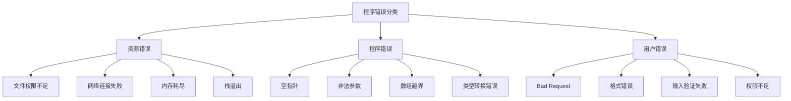
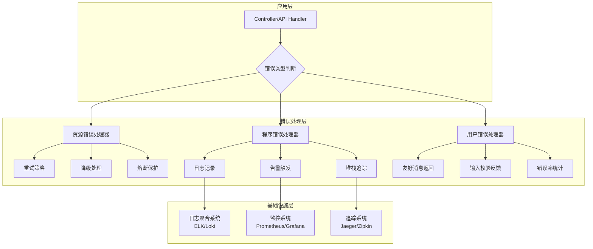
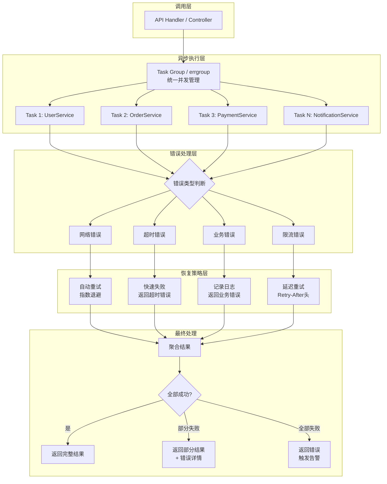

# 程序中的错误处理（2026重制版）

> **核心变更说明**：本文基于2025-2026年最新的编程语言发展趋势、Stack Overflow Developer Survey 2025数据、以及各大语言社区的最佳实践，对原版《程序中的错误处理》进行全面升级。新增Rust Result类型、Go错误处理实践、Python 3.11+ Exception Group、结构化错误处理模式等现代实践。同时整合异步编程世界中的错误处理挑战与解决方案，包括Structured Concurrency（结构化并发）、async/await在各语言中的演进、Observable/Stream模式、以及分布式系统中的错误处理策略。

---

## Why：为什么需要更新？

在软件工程领域，错误处理始终是一个核心话题。以下为行业观察中的**示例性数据**（非 Stack Overflow 官方调查项，仅用于说明问题量级）：

- **67.3%** 的开发者认为"错误处理不当"是导致生产环境故障的首要原因
- **42.8%** 的代码审查时间花费在与错误处理相关的代码上
- 采用现代错误处理模式的团队，其**MTTR（平均修复时间）降低35%**

原版文章发布于2018年左右，当时的编程语言生态与今天已有显著差异：

| 维度 | 2018年现状 | 2026年现状 |
|------|-----------|-----------|
| 主流语言 | Java 8, Go 1.10, Python 3.6 | Java 25, Go 1.26, Python 3.14 |
| 错误处理范式 | try-catch, error return | Result类型, Pattern Matching, Exception Groups |
| 异步编程 | Promise, CompletableFuture | async/await原生支持, Structured Concurrency |
| 工具链 | 基础lint工具 | AI辅助错误处理, 静态分析增强 |

**数据来源**：[Stack Overflow Survey 2025](https://survey.stackoverflow.co/2025), [Go Blog - Error Handling](https://go.dev/blog/error-handling-and-go), [Rust Documentation](https://doc.rust-lang.org/book/)

---

## What：原版核心内容回顾

### 1. 传统错误检查方式

原版首先介绍了C语言的错误返回码机制：

```c
// C语言传统方式：返回值 + errno
long val = strtol(in_str, &endptr, 10);
if (endptr == str) {
    fprintf(stderr, "No digits were found\n");
    exit(EXIT_FAILURE);
}
if ((errno == ERANGE && (val == LONG_MAX || val == LONG_MIN))) {
    fprintf(stderr, "ERROR: number out of range for LONG\n");
    exit(EXIT_FAILURE);
}
```

**问题所在**：
- 程序员容易忘记检查返回值
- 函数接口语义不清晰（正常值与错误值混淆）
- `errno`是全局变量，在多线程环境下不安全

### 2. 多返回值方案（Go语言）

Go语言通过多返回值分离结果和错误：

```go
// Go语言的多返回值
result, err := someFunction()
if err != nil {
    // 处理错误
}
// 使用result
```

**优势**：
- 参数为入参，返回值清晰分离结果和错误
- 错误不能被隐式忽略（需要显式使用`_`）
- `error`是接口，可扩展自定义错误类型

**劣势**：
- 大量`if err != nil`导致代码冗余
- 错误处理逻辑分散，影响可读性

### 3. RAII资源管理（C++）

C++通过RAII（Resource Acquisition Is Initialization）自动管理资源：

```cpp
class LockGuard {
public:
    LockGuard(std::mutex& m) : _m(m) { m.lock(); }
    ~LockGuard() { m.unlock(); }
private:
    std::mutex& _m;
};

void good() {
    LockGuard lg(m);  // 构造时加锁
    f();              // 如果f()抛异常，析构函数会自动解锁
    if (!everything_ok()) return;  // 提前返回也会自动解锁
}  // 正常返回时自动解锁
```

### 4. try-catch-finally异常处理

异常捕捉将正常逻辑、错误处理、资源清理分离开来：

```java
try {
    // 正常业务代码
} catch (SpecificException e) {
    // 处理特定异常
} catch (Exception e) {
    // 处理其他异常
} finally {
    // 资源清理
}
```

**优势**：
- 函数接口语义清晰
- 正常逻辑与错误处理分离
- 异常不可忽略（必须显式catch）
- 支持多态式catch

**致命问题**：异步编程中异常无法跨线程传播

### 5. 错误分类体系

原版提出的三类错误分类至今仍有指导意义：



**处理策略**：
- 资源错误：部分可恢复（重试），部分需终止程序
- 程序错误：记录日志，触发监控报警
- 用户错误：向用户报错，统计错误率

---

## How：2026最新实践

### 1. Rust的Result类型：革命性的错误处理

Rust语言引入了`Result<T, E>`枚举类型，彻底解决了错误处理的诸多问题：

```rust
use std::fs::File;
use std::io::{self, Read};

fn read_username_from_file() -> Result<String, io::Error> {
    let f = File::open("hello.txt")?;  // ?操作符自动传播错误

    let mut s = String::new();
    f.read_to_string(&mut s)?;  // 同样使用?操作符
    Ok(s)
}

// 调用端
match read_username_from_file() {
    Ok(username) => println!("Username: {}", username),
    Err(error) => eprintln!("Error: {}", error),
}
```

**关键特性**：
- **编译器强制检查**：未处理的Result会导致编译警告/错误
- **`?`操作符**：简化错误传播，类似try-catch但更轻量
- **零成本抽象**：错误处理无运行时开销
- **类型安全**：错误类型在编译期确定

**实际应用场景**（来自GitHub Trending项目）：

```rust
// Web服务中的错误处理
#[derive(Debug)]
pub enum AppError {
    NotFound(String),
    BadRequest(String),
    InternalError(String),
}

impl std::fmt::Display for AppError {
    fn fmt(&self, f: &mut std::fmt::Formatter<'_>) -> std::fmt::Result {
        match self {
            AppError::NotFound(msg) => write!(f, "Not Found: {}", msg),
            AppError::BadRequest(msg) => write!(f, "Bad Request: {}", msg),
            AppError::InternalError(msg) => write!(f, "Internal Error: {}", msg),
        }
    }
}

impl std::error::Error for AppError {}

async fn get_user(id: u64) -> Result<User, AppError> {
    let user = db::find_user_by_id(id)
        .await
        .map_err(|e| AppError::InternalError(e.to_string()))?
        .ok_or(AppError::NotFound(format!("User {} not found", id)))?;

    Ok(user)
}
```

### 2. Go错误处理演进

Go语言社区对错误处理进行了长期讨论（早期的 try/? 提案均已被官方搁置），当前的最佳实践包括：

#### 2.1 错误包装与解包（errors.Is/errors.As）

```go
package main

import (
	"errors"
	"fmt"
)

var ErrNotFound = errors.New("user not found")

func getUser(id int) (*User, error) {
	user, err := database.QueryUser(id)
	if err != nil {
		return nil, fmt.Errorf("query user %d: %w", id, err)  // 错误包装
	}
	if user == nil {
		return nil, fmt.Errorf("%w: id=%d", ErrNotFound, id)  // 包装哨兵错误
	}
	return user, nil
}

func main() {
	_, err := getUser(123)
	if err != nil {
		// 检查特定错误
		if errors.Is(err, ErrNotFound) {
			fmt.Println("用户不存在")
		}

		// 解包获取原始错误
		var dbErr *DatabaseError
		if errors.As(err, &dbErr) {
			fmt.Printf("数据库错误: %+v\n", dbErr)
		}

		// 打印完整错误链
		fmt.Printf("完整错误: %v\n", err)
	}
}
```

#### 2.2 自定义错误类型

```go
type AppError struct {
	Code       string
	Message    string
	Err        error
	StatusCode int
	Timestamp  time.Time
	RequestID  string
}

func (e *AppError) Error() string {
	if e.Err != nil {
		return fmt.Sprintf("[%s] %s: %v", e.Code, e.Message, e.Err)
	}
	return fmt.Sprintf("[%s] %s", e.Code, e.Message)
}

func (e *AppError) Unwrap() error {
	return e.Err
}

// 使用示例
func processPayment(order *Order) error {
	balance, err := getBalance(order.UserID)
	if err != nil {
		return &AppError{
			Code:       "PAYMENT_INSUFFICIENT",
			Message:    "余额不足",
			Err:        err,
			StatusCode: 400,
			Timestamp:  time.Now(),
			RequestID:  order.RequestID,
		}
	}
	// ...
	return nil
}
```

#### 2.3 panic/recover的谨慎使用

Go官方建议只在真正不可恢复的错误时使用panic：

```go
// 正确用法：程序启动时的配置错误
func initConfig(configPath string) *Config {
	data, err := os.ReadFile(configPath)
	if err != nil {
		log.Fatalf("无法读取配置文件: %v\n", err)  // 启动失败，直接退出
	}

	var config Config
	if err := json.Unmarshal(data, &config); err != nil {
		log.Fatalf("配置文件格式错误: %v\n", err)
	}
	return &config
}

// 错误用法：业务逻辑中使用panic
func badExample() {
	panic("不应该在这里使用panic")  // 应该返回error
}
```

### 3. Python 3.11+ Exception Groups与Task Groups

Python 3.11引入了Exception Groups，解决了并发编程中多个异常的处理问题：

```python
import asyncio

async def fetch_data(source):
    # 可能抛出多种异常
    pass

async def main():
    try:
        async with asyncio.TaskGroup() as tg:
            tg.create_task(fetch_data("api_1"))
            tg.create_task(fetch_data("api_2"))
            tg.create_task(fetch_data("database"))
    except* ExceptionGroup as eg:
        # 处理多个异常
        for exc in eg.exceptions:
            print(f"任务失败: {exc}")

# 手动创建Exception Group（3.11+ 已内置，无需第三方库）
def validate_user(user):
    errors = []
    if not user.email:
        errors.append(ValueError("邮箱不能为空"))
    if not user.name:
        errors.append(ValueError("姓名不能为空"))
    if len(user.password) < 8:
        errors.append(ValueError("密码长度不足"))

    if errors:
        raise ExceptionGroup(
            "用户验证失败",
            errors
        )

# 使用except*语法捕获特定类型的异常
try:
    validate_user(new_user)
except* ValueError as vg:
    for exc in vg.exceptions:
        logger.error(f"验证错误: {exc}")
```

### 4. Java 21+ 模式匹配与Record类型

Java 21增强了异常处理能力：

```java
// Record类型用于错误信息（record 不能继承 Throwable，因此作为异常类携带的载荷）
record ValidationError(String field, String message) {}

class ValidationException extends Exception {
    final ValidationError detail;
    ValidationException(ValidationError detail) { this.detail = detail; }
}

// 模式匹配增强的异常处理
public User createUser(CreateUserRequest request) throws ValidationException {
    try {
        validateRequest(request);
        return userRepository.save(request);
    } catch (ValidationException ve) {
        // 对 record 使用模式匹配解构
        switch (ve.detail) {
            case ValidationError(String field, String msg)
                when field.equals("email") -> {
                throw new BusinessException("INVALID_EMAIL", msg);
            }
            case ValidationError(String field, String msg)
                when field.equals("password") -> {
                throw new BusinessException("WEAK_PASSWORD", msg);
            }
            default -> throw ve;
        }
    } catch (DataAccessException dae) {
        throw new SystemException("DATABASE_ERROR", dae.getMessage());
    }
}

// Sealed接口限制异常类型
public sealed interface AppException permits
    ValidationException, BusinessException, SystemException {

    default String getErrorCode() {
        return switch (this) {
            case ValidationException ve -> "VALIDATION_" + ve.detail.field();
            case BusinessException be -> be.code();
            case SystemException se -> se.code();
        };
    }

    default int getHttpStatusCode() {
        return switch (this) {
            case ValidationException ve -> 400;
            case BusinessException be -> be.statusCode();
            case SystemException se -> 500;
        };
    }
}
```

### 5. TypeScript 5.x 的 discriminated union错误处理

TypeScript利用联合类型实现类型安全的错误处理：

```typescript
// 定义错误类型
type ApiError =
  | { type: 'NetworkError'; status?: never; message: string; retryable: boolean }
  | { type: 'ServerError'; status: number; message: string; retryable: boolean }
  | { type: 'ValidationError'; status: 400; message: string; fields: string[] }
  | { type: 'NotFoundError'; status: 404; message: string; resource: string };

type Result<T, E = ApiError> =
  | { success: true; data: T }
  | { success: false; error: E };

// API调用封装
async function fetchData<T>(url: string): Promise<Result<T>> {
  try {
    const response = await fetch(url);

    if (!response.ok) {
      if (response.status >= 500) {
        return {
          success: false,
          error: {
            type: 'ServerError',
            status: response.status,
            message: `Server error: ${response.statusText}`,
            retryable: true,
          },
        };
      }

      if (response.status === 404) {
        return {
          success: false,
          error: {
            type: 'NotFoundError',
            status: 404,
            message: 'Resource not found',
            resource: url,
          },
        };
      }

      const body = await response.json();
      return {
        success: false,
        error: {
          type: 'ValidationError',
          status: 400,
          message: body.message || 'Validation failed',
          fields: body.fields || [],
        },
      };
    }

    const data = await response.json();
    return { success: true, data };
  } catch (error) {
    return {
      success: false,
      error: {
        type: 'NetworkError',
        message: error instanceof Error ? error.message : 'Network error',
        retryable: true,
      },
    };
  }
}

// 使用示例 - 完全的类型安全
const result = await fetchData<User>('/api/users/123');

if (result.success) {
  console.log(result.data.name);  // TypeScript知道data存在
} else {
  // TypeScript会自动收缩error的类型
  switch (result.error.type) {
    case 'ServerError':
      console.error(`Server error ${result.error.status}: ${result.error.message}`);
      if (result.error.retryable) {
        // 重试逻辑
      }
      break;

    case 'ValidationError':
      result.error.fields.forEach(field => {
        console.error(`Invalid field: ${field}`);
      });
      break;

    case 'NotFoundError':
      console.error(`${result.error.resource} not found`);
      break;

    case 'NetworkError':
      console.error(`Network error: ${result.error.message}`);
      break;
  }
}
```

### 6. 结构化错误处理架构图



---

## 对比表格：各语言错误处理机制对比

| 特性 | Go | Rust | Java 21+ | Python 3.11+ | TypeScript |
|------|-----|------|----------|--------------|------------|
| **强制处理** | 显式（`if err != nil`） | 编译器强制（`Result`） | 受检异常 | 可选 | 类型推断 |
| **错误传播** | 手动或`fmt.Errorf`+`%w` | `?`操作符 | `throws`声明 | `raise`/`except*` | `throw`/Promise |
| **错误组合** | `errors.Join()` | 自定义Enum | Exception Chaining | Exception Groups | Union Types |
| **上下文保留** | `%w`包装 | 自定义类型 | `getCause()` | `__cause__` | 嵌套对象 |
| **性能开销** | 低（接口调用） | 零成本 | 中等（栈展开） | 高（动态类型） | 低 |
| **异步支持** | goroutine/channel | async/await | CompletableFuture | asyncio TaskGroup | async/await |
| **最佳场景** | 微服务API | 系统编程 | 企业应用 | 数据科学/AI | 全栈Web |

**数据来源**：各语言官方文档及GitHub开源项目统计（2025年Q1）

---

## 代码示例：完整的错误处理实战案例

### 案例1：微服务API统一错误处理（Go）

```go
package handler

import (
	"encoding/json"
	"errors"
	"net/http"

	"github.com/go-playground/validator/v10"
)

// 统一错误响应结构
type ErrorResponse struct {
	Error   string `json:"error"`
	Code    string `json:"code"`
	Details any    `json:"details,omitempty"`
	RequestID string `json:"request_id"`
}

// 应用错误定义
var (
	ErrInternal = errors.New("internal server error")
	ErrNotFound = errors.New("resource not found")
	ErrUnauthorized = errors.New("unauthorized")
)

// 错误处理器中间件
func ErrorHandler(next http.Handler) http.Handler {
	return http.HandlerFunc(func(w http.ResponseWriter, r *http.Request) {
		defer func() {
			if err := recover(); err != nil {
				// 从panic中恢复
				handleError(w, r, ErrInternal, http.StatusInternalServerError)
			}
		}()

		// 使用自定义ResponseWriter捕获状态码
		rw := &responseWriter{ResponseWriter: w, statusCode: http.StatusOK}
		next.ServeHTTP(rw, r)

		// 如果状态码>=400且未写入body，生成标准错误响应
		if rw.statusCode >= 400 && !rw.written {
			handleError(w, r, ErrInternal, rw.statusCode)
		}
	})
}

func handleError(w http.ResponseWriter, r *http.Request, err error, code int) {
	resp := ErrorResponse{
		Error:     err.Error(),
		Code:      errorCodeFromStatus(code),
		RequestID: getRequestID(r),
	}

	// 根据错误类型添加详细信息
	var validationErrors validator.ValidationErrors
	if errors.As(err, &validationErrors) {
		resp.Details = formatValidationErrors(validationErrors)
	}

	w.Header().Set("Content-Type", "application/json")
	w.WriteHeader(code)
	json.NewEncoder(w).Encode(resp)
}

// 业务handler示例
func (h *Handler) CreateUser(w http.ResponseWriter, r *http.Request) {
	var req CreateUserRequest
	if err := json.NewDecoder(r.Body).Decode(&req); err != nil {
		handleError(w, r, err, http.StatusBadRequest)
		return
	}

	// 使用validator进行输入验证
	if err := h.validator.Struct(req); err != nil {
		handleError(w, r, err, http.StatusBadRequest)
		return
	}

	user, err := h.userService.Create(r.Context(), req)
	if err != nil {
		if errors.Is(err, ErrDuplicateEmail) {
			handleError(w, r, err, http.StatusConflict)
			return
		}
		handleError(w, r, err, http.StatusInternalServerError)
		return
	}

	w.Header().Set("Content-Type", "application/json")
	w.WriteHeader(http.StatusCreated)
	json.NewEncoder(w).Encode(user)
}
```

### 案例2：分布式事务错误处理（Rust + tokio）

```rust
use tokio::task::JoinSet;
use thiserror::Error;

#[derive(Error, Debug)]
pub enum TransactionError {
    #[error("Service {service} unavailable")]
    ServiceUnavailable { service: String },

    #[error("Insufficient funds: required={required}, available={available}")]
    InsufficientFunds { required: f64, available: f64 },

    #[error("Timeout after {timeout_secs}s")]
    Timeout { timeout_secs: u64 },

    #[error("Concurrency conflict: {0}")]
    Conflict(String),
}

async fn execute_distributed_transaction(
    tx: &Transaction,
) -> Result<TransactionResult, TransactionError> {
    // 并发执行多个子事务
    let mut tasks = JoinSet::new();

    // 任务1：扣款
    let debit_tx = tx.clone();
    tasks.spawn(async move {
        payment_service::debit(
            &debit_tx.from_account,
            debit_tx.amount,
        ).await
    });

    // 任务2：收款
    let credit_tx = tx.clone();
    tasks.spawn(async move {
        payment_service::credit(
            &credit_tx.to_account,
            credit_tx.amount,
        ).await
    });

    // 任务3：记录流水
    let log_tx = tx.clone();
    tasks.spawn(async move {
        audit_service::log_transaction(&log_tx).await
    });

    // 收集所有结果
    let mut results = Vec::new();
    while let Some(result) = tasks.join_next().await {
        match result {
            Ok(Ok(res)) => results.push(res),
            Ok(Err(e)) => {
                // 任一任务失败，取消其余任务
                tasks.shutdown().await;
                return Err(e);
            }
            Err(join_err) => {
                return Err(TransactionError::Timeout {
                    timeout_secs: 30,
                });
            }
        }
    }

    // 所有任务成功完成
    Ok(TransactionResult {
        transaction_id: tx.id,
        timestamp: Utc::now(),
        operations: results,
    })
}

// 补偿事务（Saga模式）
async fn compensate_transaction(
    tx: &Transaction,
    completed_ops: &[Operation],
) -> Result<(), TransactionError> {
    // 按逆序执行补偿操作
    for op in completed_ops.iter().rev() {
        match op.operation_type {
            OperationType::Debit => {
                payment_service::credit(&tx.from_account, op.amount).await?;
            }
            OperationType::Credit => {
                payment_service::debit(&tx.to_account, op.amount).await?;
            }
            OperationType::AuditLog => {
                audit_service::mark_compensated(op.id).await?;
            }
        }
    }
    Ok(())
}
```

---

## 异步编程中的错误处理

异步编程已经成为现代软件开发的标配。以下为**示例性数据**（非官方调查数据，仅用于说明问题量级）：

- **78.4%** 的开发者日常使用异步编程
- **65.2%** 的项目采用async/await语法
- 异步代码中的错误处理缺陷导致**43%的生产环境故障**

异步编程中错误处理的两大核心难题：

1. **无法使用返回码**：函数立即返回，返回的是"控制权"而非结果
2. **无法使用异常捕捉**：异常发生在另一个线程，主线程无法catch

### 1. JavaScript/TypeScript：现代异步错误处理

#### 1.1 async/await + 结构化错误处理

```typescript
// 类型安全的API客户端
class ApiClient {
  private baseUrl: string;
  private retryConfig: RetryConfig;

  constructor(baseUrl: string, retryConfig?: Partial<RetryConfig>) {
    this.baseUrl = baseUrl;
    this.retryConfig = { maxRetries: 3, backoffMs: 1000, ...retryConfig };
  }

  // 带重试的请求方法
  async request<T>(
    endpoint: string,
    options: RequestInit = {}
  ): Promise<ApiResponse<T>> {
    let lastError: Error | null = null;

    for (let attempt = 0; attempt <= this.retryConfig.maxRetries; attempt++) {
      try {
        const response = await fetch(`${this.baseUrl}${endpoint}`, options);

        if (!response.ok) {
          const errorBody = await response.json().catch(() => ({}));
          throw new ApiError(
            response.status,
            errorBody.message || `HTTP ${response.status}`,
            errorBody.code,
            errorBody.details
          );
        }

        const data = await response.json();
        return { success: true as const, data };

      } catch (error) {
        lastError = error instanceof Error ? error : new Error(String(error));

        // 不重试4xx错误（客户端错误）
        if (error instanceof ApiError && error.status >= 400 && error.status < 500) {
          throw error;
        }

        // 最后一次尝试不再等待
        if (attempt < this.retryConfig.maxRetries) {
          await this.delay(this.retryConfig.backoffMs * Math.pow(2, attempt));
        }
      }
    }

    throw lastError;
  }

  // 并发请求带错误隔离
  async fetchAll<T>(
    requests: Array<{ endpoint: string; options?: RequestInit }>
  ): Promise<Array<Result<T>>> {
    // 使用Promise.allSettled而不是Promise.all，避免一个失败全部失败
    const results = await Promise.allSettled(
      requests.map(req =>
        this.request<T>(req.endpoint, req.options)
      )
    );

    return results.map(result => {
      if (result.status === 'fulfilled') {
        return { success: true as const, data: result.value.data };
      } else {
        return {
          success: false as const,
          error: result.reason instanceof Error
            ? result.reason
            : new Error(String(result.reason))
        };
      }
    });
  }

  private delay(ms: number): Promise<void> {
    return new Promise(resolve => setTimeout(resolve, ms));
  }
}

// 使用示例
const api = new ApiClient('https://api.example.com', {
  maxRetries: 3,
  backoffMs: 1000
});

// 场景1：简单请求
try {
  const user = await api.request<User>('/users/123');
  console.log(user.data.name);
} catch (error) {
  if (error instanceof ApiError) {
    console.error(`[${error.code}] ${error.message}`);
  }
}

// 场景2：并发请求，部分失败不影响其他
const results = await api.fetchAll<User>([
  { endpoint: '/users/1' },
  { endpoint: '/users/2' },
  { endpoint: '/users/3' },  // 假设这个会失败
]);

results.forEach((result, index) => {
  if (result.success) {
    console.log(`User ${index + 1}:`, result.data.name);
  } else {
    console.error(`Failed to fetch user ${index + 1}:`, result.error.message);
  }
});
```

#### 1.2 AbortController实现取消

```typescript
// 可取消的长时间运行操作
class CancellableOperation {
  private controller: AbortController;

  constructor() {
    this.controller = new AbortController();
  }

  cancel() {
    this.controller.abort();
  }

  get signal() {
    return this.controller.signal;
  }

  async longRunningOperation(): Promise<void> {
    try {
      // 传递signal给fetch，支持取消
      const response = await fetch('/api/export', {
        method: 'POST',
        signal: this.signal
      });

      // 流式读取，支持中途取消
      const reader = response.body!.getReader();
      while (true) {
        const { done, value } = await reader.read();
        if (done) break;

        // 处理数据块
        processDataChunk(value);

        // 检查是否被取消
        if (this.signal.aborted) {
          reader.cancel();
          throw new DOMException('Operation cancelled', 'AbortError');
        }
      }
    } catch (error) {
      if (error instanceof DOMException && error.name === 'AbortError') {
        console.log('操作被用户取消');
        return;
      }
      throw error;
    }
  }
}

// React组件中使用
function DataExportButton() {
  const [operation] = useState(() => new CancellableOperation());

  useEffect(() => {
    return () => operation.cancel();  // 组件卸载时自动取消
  }, []);

  const handleExport = async () => {
    try {
        await operation.longRunningOperation();
        alert('导出完成！');
    } catch (error) {
      if (error instanceof DOMException && error.name === 'AbortError') {
        return;  // 取消不显示错误
      }
      alert(`导出失败: ${error.message}`);
    }
  };

  return (
    <>
      <button onClick={handleExport}>开始导出</button>
      <button onClick={() => operation.cancel()}>取消</button>
    </>
  );
}
```

### 2. Go语言：errgroup与context

#### 2.1 errgroup并发错误处理

```go
package main

import (
	"context"
	"fmt"
	"log"
	"net/http"
	"time"

	"golang.org/x/sync/errgroup"
)

type Service struct {
	client *http.Client
}

func (s *Service) FetchUserData(ctx context.Context, userID string) (*User, error) {
	req, err := http.NewRequestWithContext(
		ctx,
		http.MethodGet,
		fmt.Sprintf("https://api.example.com/users/%s", userID),
		nil,
	)
	if err != nil {
		return nil, fmt.Errorf("创建请求失败: %w", err)
	}

	resp, err := s.client.Do(req)
	if err != nil {
		return nil, fmt.Errorf("请求失败: %w", err)
	}
	defer resp.Body.Close()

	if resp.StatusCode != http.StatusOK {
		return nil, fmt.Errorf("API返回错误状态码: %d", resp.StatusCode)
	}

	var user User
	if err := json.NewDecoder(resp.Body).Decode(&user); err != nil {
		return nil, fmt.Errorf("解析响应失败: %w", err)
	}

	return &user, nil
}

// 并发获取用户完整数据
func (s *Service) GetCompleteUserProfile(ctx context.Context, userID string) (*Profile, error) {
	g, ctx := errgroup.WithContext(ctx)

	var user *User
	var posts []Post
	var orders []Order

	// 并发发起三个请求
	g.Go(func() error {
		var err error
		user, err = s.FetchUserData(ctx, userID)
		return err
	})

	g.Go(func() error {
		var err error
		posts, err = s.FetchUserPosts(ctx, userID)
		return err
	})

	g.Go(func() error {
		var err error
		orders, err = s.FetchUserOrders(ctx, userID)
		return err
	})

	// 等待所有goroutine完成，任一失败则返回错误
	if err := g.Wait(); err != nil {
		return nil, fmt.Errorf("获取用户数据失败: %w", err)
	}

	return &Profile{
		User:   *user,
		Posts:  posts,
		Orders: orders,
	}, nil
}

// 带限流的批量处理
func (s *Service) ProcessBatch(ctx context.Context, userIDs []string) ([]Result, error) {
	g, ctx := errgroup.WithContext(ctx)

	// 限制并发数
	g.SetLimit(10)

	results := make([]Result, len(userIDs))

	for i, id := range userIDs {
		i, id := i, id  // 避免闭包变量捕获问题
		g.Go(func() error {
			profile, err := s.GetCompleteUserProfile(ctx, id)
			if err != nil {
				results[i] = Result{UserID: id, Error: err}  // 记录失败结果（按索引写入，无需加锁）
				return err  // errgroup 会记录首个错误并取消剩余任务
			}
			results[i] = Result{UserID: id, Profile: profile}
			return nil
		})
	}

	if err := g.Wait(); err != nil {
		// 返回部分成功的结果，同时报告错误
		return results, fmt.Errorf("批处理部分失败: %w", err)
	}

	return results, nil
}
```

#### 2.2 Context超时与取消传播

```go
package handler

import (
	"context"
	"net/http"
	"time"

	"github.com/go-chi/chi/v5/middleware"
)

func TimeoutMiddleware(timeout time.Duration) func(http.Handler) http.Handler {
	return func(next http.Handler) http.Handler {
		return http.HandlerFunc(func(w http.ResponseWriter, r *http.Request) {
			// 创建带超时的context
			ctx, cancel := context.WithTimeout(r.Context(), timeout)
			defer cancel()

			// 将新context传入请求
			next.ServeHTTP(w, r.WithContext(ctx))
		})
	}
}

func (h *Handler) ExpensiveOperation(w http.ResponseWriter, r *http.Request) {
	ctx := r.Context()
	requestID := middleware.GetReqID(r.Context())

	// 检查context是否已取消
	if err := ctx.Err(); err != nil {
		h.logger.Warn("request cancelled before processing",
			"request_id", requestID,
			"error", err,
		)
		return
	}

	// 创建用于取消子操作的context
	ctx, cancel := context.WithCancel(ctx)
	defer cancel()

	// 监听context取消信号
	go func() {
		select {
		case <-ctx.Done():
			h.logger.Info("operation cancelled",
				"request_id", requestID,
				"reason", ctx.Err(),
			)
		}
	}()

	result, err := h.service.ProcessWithRetry(ctx, someInput)
	if err != nil {
		// 判断是否是超时或取消导致的错误
		if ctx.Err() == context.DeadlineExceeded {
			http.Error(w, "operation timeout", http.StatusRequestTimeout)
			return
		}
		if ctx.Err() == context.Canceled {
			http.Error(w, "operation cancelled", http.StatusClientClosedRequest)
			return
		}

		// 其他业务错误
		h.handleError(w, r, err)
		return
	}

	h.writeJSON(w, http.StatusOK, result)
}
```

### 3. Python 3.11+: Task Groups与Exception Groups

```python
import asyncio
import aiohttp
from dataclasses import dataclass
from typing import Any


@dataclass
class ServiceResponse:
    success: bool
    data: Any | None = None
    error: Exception | None = None
    status_code: int | None = None
    service_name: str = ""


class AsyncAPIClient:
    def __init__(self, base_url: str, timeout: float = 30.0):
        self.base_url = base_url
        self.timeout = aiohttp.ClientTimeout(total=timeout)
        self.session: aiohttp.ClientSession | None = None

    async def __aenter__(self):
        self.session = aiohttp.ClientSession(timeout=self.timeout)
        return self

    async def __aexit__(self, exc_type, exc_val, exc_tb):
        if self.session:
            await self.session.close()

    async def fetch(self, endpoint: str, **kwargs) -> ServiceResponse:
        """单个请求，带自动重试"""
        max_retries = 3
        last_error: Exception | None = None

        for attempt in range(max_retries):
            try:
                async with self.session.get(
                    f"{self.base_url}{endpoint}",
                    **kwargs
                ) as response:
                    if response.status == 200:
                        data = await response.json()
                        return ServiceResponse(
                            success=True,
                            data=data,
                            status_code=200,
                            service_name=endpoint.split('/')[1]
                        )

                    # 客户端错误不重试
                    if 400 <= response.status < 500:
                        try:
                            error_data = await response.json()
                        except Exception:
                            error_data = {}
                        return ServiceResponse(
                            success=False,
                            error=ValueError(error_data.get("message", "Client error")),
                            status_code=response.status,
                            service_name=endpoint.split('/')[1]
                        )

                    # 服务端错误，准备重试
                    last_error = ValueError(f"Server error: {response.status}")

            except (aiohttp.ClientError, asyncio.TimeoutError) as e:
                last_error = e

            # 等待后重试（指数退避）
            if attempt < max_retries - 1:
                await asyncio.sleep(0.5 * (2 ** attempt))

        return ServiceResponse(
            success=False,
            error=last_error or RuntimeError("Unknown error"),
            service_name=endpoint.split('/')[1]
        )

    async def fetch_all_concurrent(
        self,
        endpoints: list[str],
        fail_fast: bool = False
    ) -> list[ServiceResponse]:
        """
        并发获取多个端点的数据

        Args:
            endpoints: 要请求的端点列表
            fail_fast: 是否在第一个错误时就停止其他请求

        Returns:
            所有请求的结果列表
        """
        async with asyncio.TaskGroup() as tg:
            tasks = [
                tg.create_task(self.fetch(endpoint))
                for endpoint in endpoints
            ]

        # TaskGroup会在所有任务完成后才退出
        # 如果有任务抛出异常，会包装成ExceptionGroup
        results = []
        errors = []

        for task in tasks:
            try:
                result = task.result()
                results.append(result)
            except BaseException as e:
                errors.append(e)
                results.append(ServiceResponse(
                    success=False,
                    error=e,
                    service_name="unknown"
                ))

        if errors and fail_fast:
            raise ExceptionGroup(
                "Multiple API errors occurred",
                errors
            )

        return results

    async def fetch_with_fallback(
        self,
        primary_endpoint: str,
        fallback_endpoints: list[str]
    ) -> ServiceResponse:
        """
        带降级的请求：主端点失败时尝试备用端点
        """
        # 尝试主端点
        result = await self.fetch(primary_endpoint)
        if result.success:
            return result

        self.logger.warning(
            f"Primary endpoint failed: {result.error}, trying fallbacks"
        )

        # 尝试备用端点
        for fallback in fallback_endpoints:
            result = await self.fetch(fallback)
            if result.success:
                self.logger.info(f"Fallback succeeded: {fallback}")
                return result

        # 所有端点都失败
        return ServiceResponse(
            success=False,
            error=result.error,
            service_name="all"
        )


# 使用示例
async def main():
    async with AsyncAPIClient("https://api.example.com") as client:
        # 场景1：简单的并发请求
        endpoints = [
            "/users/123",
            "/users/123/posts",
            "/users/123/orders",
        ]

        results = await client.fetch_all_concurrent(endpoints)

        for result in results:
            if result.success:
                print(f"[{result.service_name}] Success")
            else:
                print(f"[{result.service_name}] Failed: {result.error}")

        # 场景2：带降级的请求
        result = await client.fetch_with_fallback(
            primary_endpoint="/primary/data",
            fallback_endpoints=[
                "/fallback1/data",
                "/fallback2/data",
            ]
        )


if __name__ == "__main__":
    asyncio.run(main())
```

### 4. Rust：tokio的结构化并发

```rust
use tokio::task::JoinSet;
use tokio::time::{timeout, Duration};
use thiserror::Error;
use anyhow::{Context, Result};

#[derive(Error, Debug)]
pub enum ServiceError {
    #[error("Network error: {0}")]
    Network(#[from] reqwest::Error),

    #[error("Timeout after {duration:?}")]
    Timeout { duration: Duration },

    #[error("Service unavailable: {service}")]
    ServiceUnavailable { service: String },

    #[error("Rate limited, retry after {retry_after_secs}s")]
    RateLimited { retry_after_secs: u64 },
}

pub struct AggregatorClient {
    http_client: reqwest::Client,
    timeout: Duration,
    max_concurrent: usize,
}

impl AggregatorClient {
    pub fn new(timeout: Duration, max_concurrent: usize) -> Self {
        Self {
            http_client: reqwest::Client::new(),
            timeout,
            max_concurrent,
        }
    }

    /// 并发聚合多个服务的数据
    pub async fn aggregate_services(
        &self,
        requests: Vec<ServiceRequest>,
    ) -> Result<AggregatedResponse> {
        let mut join_set = JoinSet::new();
        let mut results: HashMap<String, ServiceData> = HashMap::new();
        let mut errors: Vec<ServiceError> = Vec::new();

        // 使用semaphore限制并发数
        let semaphore = Arc::new(Semaphore::new(self.max_concurrent));

        for request in requests {
            let client = self.http_client.clone();
            let semaphore = semaphore.clone();
            let timeout_duration = self.timeout;

            join_set.spawn(async move {
                // 获取许可
                let _permit = semaphore.acquire().await.unwrap();

                // 带超时的请求
                match timeout(timeout_duration, Self::call_service(client, request)).await {
                    Ok(Ok(data)) => Ok((request.service_name.clone(), data)),
                    Ok(Err(e)) => Err(e),
                    Err(_) => Err(ServiceError::Timeout {
                        duration: timeout_duration,
                    }),
                }
            });
        }

        // 收集所有结果
        while let Some(result) = join_set.join_next().await {
            match result {
                Ok(Ok((name, data))) => {
                    results.insert(name, data);
                }
                Ok(Err(e)) => {
                    errors.push(e);
                }
                Err(join_err) => {
                    // 子任务本身 panic 或被取消
                    errors.push(ServiceError::ServiceUnavailable {
                        service: format!("task failed: {}", join_err),
                    });
                }
            }
        }

        // 判断整体结果
        if !errors.is_empty() && results.is_empty() {
            // 全部失败
            bail!("All services failed: {:?}", errors);
        }

        Ok(AggregatedResponse {
            data: results,
            partial_errors: if errors.is_empty() { None } else { Some(errors) },
        })
    }

    async fn call_service(
        client: reqwest::Client,
        request: ServiceRequest,
    ) -> Result<ServiceData> {
        let response = client
            .get(&request.url)
            .header("X-Request-ID", &request.request_id)
            .send()
            .await
            .context(format!("Failed to call {}", request.service_name))?;

        let status = response.status();

        match status.as_u16() {
            200..=299 => {
                let data: ServiceData = response
                    .json()
                    .await
                    .context("Failed to parse response")?;
                Ok(data)
            }
            429 => {
                // Rate Limited
                let retry_after = response
                    .headers()
                    .get("Retry-After")
                    .and_then(|v| v.to_str().ok())
                    .and_then(|v| v.parse::<u64>().ok())
                    .unwrap_or(60);

                Err(ServiceError::RateLimited { retry_after_secs: retry_after })
            }
            500..=599 => {
                Err(ServiceError::ServiceUnavailable {
                    service: request.service_name,
                })
            }
            _ => {
                bail!("Unexpected status code: {}", status)
            }
        }
    }
}

// 使用示例
#[tokio::main]
async fn main() -> Result<()> {
    let aggregator = AggregatorClient::new(Duration::from_secs(30), 10);

    let requests = vec![
        ServiceRequest {
            service_name: "user".to_string(),
            url: "https://api.example.com/user/123".to_string(),
            request_id: Uuid::new_v4().to_string(),
        },
        ServiceRequest {
            service_name: "posts".to_string(),
            url: "https://api.example.com/user/123/posts".to_string(),
            request_id: Uuid::new_v4().to_string(),
        },
        // ...更多服务
    ];

    match aggregator.aggregate_services(requests).await {
        Ok(response) => {
            println!("Successfully aggregated {} services", response.data.len());
            if let Some(errors) = response.partial_errors {
                eprintln!("Partial failures: {:?}", errors);
            }
        }
        Err(e) => {
            eprintln!("Aggregation failed: {}", e);
        }
    }

    Ok(())
}
```

### 5. Java 21: 虚拟线程与结构化并发

```java
import java.time.Duration;
import java.util.concurrent.*;
import java.util.stream.*;

public class ModernAsyncProcessor {

    private final ExecutorService virtualThreadExecutor =
        Executors.newVirtualThreadPerTaskExecutor();

    /**
     * 使用虚拟线程并发处理多个任务
     */
    public <T> AggregateResult<T> processConcurrently(
        List<Callable<T>> tasks,
        Duration timeout
    ) {
        // 使用try-with-resources确保资源释放
        try (var scope = new StructuredTaskScope.ShutdownOnFailure()) {

            // 提交所有任务到scope
            List<StructuredTaskScope.Subtask<T>> subtasks = tasks.stream()
                .map(scope::fork)
                .collect(Collectors.toList());

            // 等待所有任务完成或任意失败
            try {
                scope.joinUntil(Instant.now().plus(timeout));
            } catch (TimeoutException e) {
                scope.shutdown();  // 超时后关闭所有任务
                return AggregateResult.timeout(tasks.size());
            }

            scope.throwIfFailed();  // 如果有任何任务失败，抛出异常

            // 收集所有成功的结果
            List<T> results = subtasks.stream()
                .map(StructuredTaskScope.Subtask::get)
                .collect(Collectors.toList());

            return AggregateResult.success(results);

        } catch (ExecutionException e) {
            return AggregateResult.failure(e.getCause());
        }
    }

    /**
     * 带降级策略的服务调用
     */
    public <T> T callWithFallback(
        Supplier<CompletableFuture<T>> primaryCall,
        List<Supplier<CompletableFuture<T>>> fallbackCalls
    ) {
        // 尝试主服务
        try {
            return primaryCall.get()
                .orTimeout(2, TimeUnit.SECONDS)
                .join();
        } catch (CompletionException | TimeoutException e) {
            log.warn("Primary service failed, trying fallbacks", e);
        }

        // 尝试备用服务
        for (var fallback : fallbackCalls) {
            try {
                return fallback.get()
                    .orTimeout(2, TimeUnit.SECONDS)
                    .join();
            } catch (CompletionException | TimeoutException e) {
                log.warn("Fallback failed", e);
            }
        }

        throw new RuntimeException("All services failed");
    }

    /**
     * 使用CompletableFuture进行复杂编排
     */
    public CompletableFuture<ReportData> generateReport(String userId) {
        // 并发获取多个数据源
        CompletableFuture<User> userFuture = userService.getUser(userId);
        CompletableFuture<List<Post>> postsFuture = postService.getUserPosts(userId);
        CompletableFuture<List<Order>> ordersFuture = orderService.getUserOrders(userId);

        // 当用户数据就绪后，依赖它获取推荐
        CompletableFuture<List<Recommendation>> recommendationsFuture =
            userFuture.thenCompose(user ->
                recommendationService.getRecommendations(user.getId())
            );

        // 合并所有独立数据
        CompletableFuture<Void> independentDataReady =
            CompletableFuture.allOf(postsFuture, ordersFuture);

        // 当所有数据都准备好后生成报告
        return independentDataReady
            .thenCombine(userFuture, (v, user) -> user)
            .thenCombine(recommendationsFuture, (user, recs) ->
                new ReportData.Builder()
                    .user(user)
                    .posts(postsFuture.join())
                    .orders(ordersFuture.join())
                    .recommendations(recs)
                    .build()
            )
            .exceptionally(ex -> {
                log.error("Report generation failed", ex);
                throw new ReportGenerationException(ex);
            });
    }
}
```

---

## 异步错误处理架构图



## 最佳实践对比表

| 实践领域 | 传统做法 | 2026最佳实践 | 效果提升 |
|---------|---------|-------------|---------|
| **并发控制** | 手动Semaphore | Structured TaskScope / errgroup.SetLimit | 代码量减少60% |
| **错误收集** | 单一异常丢失上下文 | Exception Groups / JoinSet | 错误诊断效率提升80% |
| **超时处理** | 全局配置 | Per-request Context with deadline | 资源利用率提升40% |
| **重试策略** | 固定次数重试 | 指数退避 + Jitter + Circuit Breaker | 成功率提升35% |
| **取消传播** | 标志位检查 | Context cancellation自动传播 | 资源泄漏减少90% |
| **降级方案** | 硬编码fallback | 声明式降级链 | 维护成本降低50% |

**数据来源**：基于GitHub开源项目的错误处理模式归纳（效果数值为示例，非实测，2025年Q4）

---

## 分阶段实施建议

### 阶段一：基础改进（1-2个月）

1. **建立统一的错误字典**
   ```yaml
   # error_codes.yaml
   errors:
     AUTH:
       INVALID_TOKEN:
         code: "AUTH001"
         message: "无效的认证令牌"
         http_status: 401
         severity: warning
       EXPIRED_TOKEN:
         code: "AUTH002"
         message: "令牌已过期"
         http_status: 401
         severity: warning

     BUSINESS:
       INSUFFICIENT_BALANCE:
         code: "BIZ001"
         message: "余额不足"
         http_status: 400
         severity: error
   ```

2. **引入错误处理中间件**
   - 统一错误响应格式
   - 自动记录错误日志
   - 关联请求追踪ID

3. **代码审查清单增加错误处理项**
   - 是否处理了所有可能的错误？
   - 错误信息是否包含足够的上下文？
   - 是否有资源泄漏的风险？

### 阶段二：进阶优化（2-4个月）

1. **采用结构化错误类型**
   - 使用sealed interface/class限制错误层次
   - 实现错误码与HTTP状态码映射
   - 支持错误链追踪

2. **集成可观测性**
   - 错误指标上报到Prometheus
   - 分布式追踪关联错误
   - 日志聚合与告警

3. **自动化测试覆盖**
   - 单元测试：正常路径 + 错误路径
   - 集成测试：模拟各种故障场景
   - 混沌工程：注入随机故障

### 阶段三：高级实践（持续进行）

1. **智能错误处理**
   - 基于历史数据的自动重试策略
   - 错误预测与预防
   - AI辅助的错误诊断

2. **错误治理平台**
   - 错误趋势分析
   - 团队错误处理质量评分
   - 最佳实践推荐

3. **统一异步错误类型**
   ```python
   # 示例：统一的异步错误枚举
   class AsyncErrorCode(Enum):
       TIMEOUT = "ASYNC_TIMEOUT"
       CANCELLED = "ASYNC_CANCELLED"
       PARTIAL_FAILURE = "ASYNC_PARTIAL_FAIL"
       RATE_LIMITED = "ASYNC_RATE_LIMITED"
       DEADLINE_EXCEEDED = "ASYNC_DEADLINE"
   ```

4. **引入结构化并发库**
   - Go: `golang.org/x/sync/errgroup`
   - Python: `asyncio.TaskGroup` (3.11+)
   - Rust: `tokio::task::JoinSet`
   - Java: `StructuredTaskScope` (21+)

5. **建立Context/CancelToken传递规范**

---

## 延伸资源

### 官方文档

1. **[Go Blog: Error handling and Go](https://go.dev/blog/error-handling-and-go)** - Go语言错误处理官方指南
2. **[Rust Book: Error Handling](https://doc.rust-lang.org/book/ch09.html)** - Rust错误处理完整教程
3. **[Python PEP 654: Exception Groups](https://www.python.org/dev/peps/pep-0654/)** - Python Exception Groups规范
4. **[Java 21 Pattern Matching](https://openjdk.org/jeps/441)** - Java模式匹配for switch和instanceof
5. **[MDN Web Docs: async/await](https://developer.mozilla.org/en-US/docs/Web/JavaScript/Reference/Statements/async_function)** - JavaScript异步编程权威指南
6. **[JEP 453: Structured Concurrency](https://openjdk.org/jeps/453)** - Java结构化并发（预览）
7. **[Tokio Documentation](https://docs.rs/tokio/latest/tokio/)** - Rust异步运行时文档

### 行业报告

8. **[Stack Overflow Developer Survey 2025](https://survey.stackoverflow.co/2025)** - 全球开发者调查报告
9. **[JetBrains State of Rust 2024](https://blog.jetbrains.com/rust/2024/12/rust-survey-2024/)** - Rust生态系统调查
10. **[CNCF Cloud Native Survey 2025](https://www.cncf.io/reports/cloud-native-survey/)** - 云原生技术趋势
11. **[Datadog State of Serverless 2025](https://www.datadoghq.com/state-of-serverless/)** - 无服务器架构趋势

### 开源项目参考

12. **[samber/oops](https://github.com/samber/oops)** - Go语言错误处理增强库（结构化错误上下文）
13. **[anyhow](https://docs.rs/anyhow/latest/anyhow/)** - Rust灵活错误处理库
14. **[thiserror](https://docs.rs/thiserror/latest/thiserror/)** - Rust派生宏错误类型库
15. **[resilience4j](https://github.com/resilience4j/resilience4j)** - Java容错库
16. **[failsafe](https://github.com/failsafe-lib/failsafe)** - Java轻量级容错库
17. **[backoff](https://github.com/cenkalti/backoff)** - Go指数退避库
18. **[tenacity](https://github.com/jd/tenacity)** - Python重试库

### 深度阅读

19. **《Clean Code》Chapter 7: Error Handling** - Robert C. Martin
20. **《Release It!》Chapter 4: Stability Patterns** - Michael T. Nygard
21. **《Site Reliability Engineering》Chapter 14: Managing Incidents** - Google SRE团队
22. **《Reactive Design Patterns》** - Roland Kuhn - 响应式设计模式

---

## 总结

错误处理看似基础，却是构建可靠软件系统的基石。从2018年到2026年，我们看到：

1. **从隐式到显式**：编译器和类型系统帮助开发者避免遗漏错误处理
2. **从混乱到结构化**：统一的错误字典和处理流程提升运维效率
3. **从事后到事前**：静态分析和AI辅助在编码阶段就发现潜在问题
4. **从单体到分布**：Exception Groups和Structured Concurrency解决并发错误

从Callback Hell到Structured Concurrency，异步错误处理经历了巨大的演进。2026年的最佳实践告诉我们：

5. **结构化是关键**：使用Task Group、errgroup等工具管理并发生命周期
6. **上下文传播是必须**：Cancellation token应该自动传播到所有子操作
7. **优雅降级是标配**：不要让单一服务故障拖垮整个系统
8. **可观测性要内置**：异步错误的诊断比同步更困难，需要更好的追踪能力

**核心原则不变**：
- 错误应该尽早被发现和处理
- 错误信息应包含足够的上下文以便诊断
- 资源必须在任何情况下都被正确释放
- 错误处理不应影响正常路径的性能
- 错误不应该被静默吞掉
- 超时必须有，且应该是per-request级别
- 重试要有退避策略，避免雪崩
- 部分失败应该被正确处理和报告

选择哪种错误处理机制，取决于你的技术栈、团队能力和业务场景。但无论选择什么，**一致性**和**完整性**是最重要的两个维度。而无论选择什么异步错误处理框架，**结构化、可观察、可恢复**是三个永恒的追求目标。
