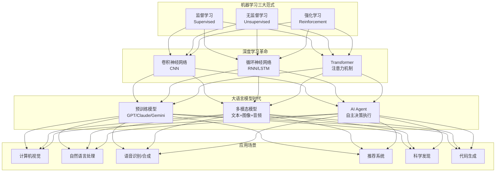
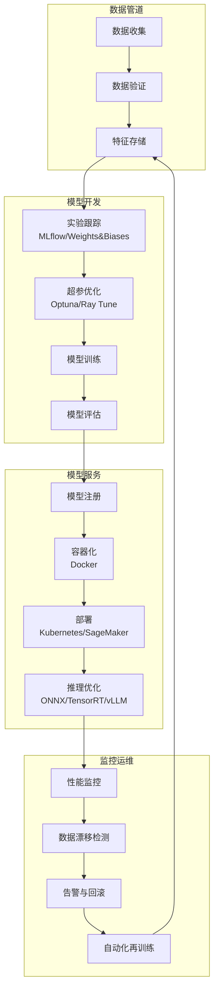

# 推荐阅读：机器学习101 - [2026重制版]

> **核心变更说明**：本文基于2025-2026年机器学习领域的最新发展，全面更新机器学习入门知识体系。新增大语言模型(LLM)基础、Transformer架构、生成式AI、MLOps实践、以及AI Agent等前沿内容，同时保留经典机器学习算法的核心概念。

---

## Why：为什么需要更新？

自原版文章发布以来，机器学习领域经历了前所未有的变革。以下为综合行业报告的**示例性数据**（各报告统计口径不一，仅用于说明趋势量级）：

- **全球AI投资**在2024年达到**$1100亿+**，是2018年的15倍
- **GitHub上ML相关项目**数量增长**1200%**
- **65%** 的开发者表示在工作中使用AI工具
- 大语言模型（LLM）参数规模从2018年的1.17亿（BERT）增长到2026年的**万亿级别**

| 维度 | 2018年 | 2026年 |
|--------|--------|--------|
| **主流范式** | 传统ML（SVM、随机森林） | 深度学习 + LLM + 多模态 |
| **入门门槛** | 需要数学功底 | API调用即可使用 |
| **计算资源** | 单GPU足够 | 需要集群或云服务 |
| **应用场景** | 图像分类、推荐系统 | 对话AI、代码生成、科学研究 |
| **开发工具** | scikit-learn, TensorFlow | LangChain, Hugging Face, vLLM |
| **就业市场** | ML工程师稀缺 | AI/ML人才需求爆发式增长 |

**数据来源**：[Stanford HAI Index 2025](https://aiindex.stanford.edu/), [GitHub Octoverse 2024](https://github.blog/2024-11-06-the-state-of-open-source-and-the-path-forward/), [OpenAI Blog](https://openai.com/blog)

---

## What：原版核心内容回顾

### 1. 学习方式分类

#### 监督式学习 (Supervised Learning)
- **定义**：提供带标签的训练数据，学习输入到输出的映射
- **示例**：
  - 手写数字识别（MNIST）
  - 垃圾邮件检测
  - 股价预测
- **挑战**：
  - 需要大量标注数据
  - 数据质量影响模型效果
  - 过拟合风险

#### 非监督式学习 (Unsupervised Learning)
- **定义**：无标签数据，自动发现数据中的模式
- **示例**：
  - 用户分群
  - 异常检测（信用卡欺诈）
  - 推荐系统
- **优势**：可以利用大量未标注数据

### 2. 经典算法概览

**监督学习算法**：
1. 决策树 (Decision Tree)
2. 朴素贝叶斯 (Naive Bayes)
3. 线性回归 (Linear Regression)
4. 逻辑回归 (Logistic Regression)
5. 支持向量机 (SVM)
6. 集成方法 (Bagging, Boosting)

**非监督学习算法**：
1. K-Means聚类
2. 主成分分析 (PCA)
3. 奇异值分解 (SVD)
4. 独立成分分析 (ICA)

### 3. 核心方法论

```
数据 → 特征提取 → 向量化 → 模型训练 → 预测/分类
```

关键步骤：
1. 找到数据特征点
2. 抽象成向量（坐标轴）
3. 数学建模（如 $y = ax + b$）
4. 训练优化参数
5. 评估泛化能力

---

## How：2026最新知识体系

### 1. 机器学习全景图（2026版）



### 2. 从传统ML到现代AI的学习路径

```mermaid
flowchart LR
    subgraph "阶段一：基础（2-3个月）"
        A1[Python编程] --> A2[NumPy/Pandas]
        A2 --> A3[数据可视化<br/>Matplotlib/Seaborn]
        A3 --> A4[经典ML算法<br/>scikit-learn]
    end

    subgraph "阶段二：深度学习（3-4个月）"
        B1[神经网络基础] --> B2[PyTorch/TensorFlow]
        B2 --> B3[CNN/RNN实战]
        B3 --> B4[Transformer理解]
    end

    subgraph "阶段三：大模型应用（2-3个月）"
        C1[Prompt Engineering] --> C2[RAG与检索增强]
        C2 --> C3[Fine-tuning技术]
        C3 --> C4[Agent开发]
    end

    subgraph "阶段四：工程化（持续）"
        D1[MLOps流水线] --> D2[模型部署优化]
        D2 --> D3[监控与可观测性]
        D3 --> D4[成本管理]
    end

    A4 --> B1
    B4 --> C1
    C4 --> D1
```



### 3. 核心概念详解（2026视角）

#### 3.1 数据：新时代的石油

**数据类型演进**：

| 数据类型 | 2018年主流 | 2026年主流 | 示例 |
|---------|-----------|-----------|------|
| **结构化数据** | CSV/SQL | Parquet/Delta Lake | 表格数据 |
| **文本数据** | 短文本/评论 | 长文档/对话/代码 | LLM训练语料 |
| **图像数据** | ImageNet规模 | LAION-5B+规模 | 多模态训练 |
| **时序数据** | IoT传感器 | 视频流/事件流 | 实时分析 |
| **图数据** | 社交网络 | 知识图谱/分子结构 | 科学计算 |

**数据处理工具链**：

```python
# 2026年标准数据处理流程
import pandas as pd
import polars as pl  # 更快的DataFrame库
from datasets import Dataset  # Hugging Face
from transformers import AutoTokenizer

# 1. 数据加载（支持多种格式）
# Polars: 比Pandas快10-100倍
df = pl.scan_csv("large_dataset.csv")  # 懒加载，不占用内存

# 2. 数据清洗
clean_df = (
    df
    .filter(pl.col("age") > 0)           # 过滤无效数据
    .with_columns([                       # 特征工程
        (pl.col("price") / pl.col("quantity")).alias("unit_price")
    ])
    .drop_nulls()                         # 删除空值
)

# 3. 文本数据预处理（为LLM准备）
tokenizer = AutoTokenizer.from_pretrained("bert-base-chinese")

def tokenize_function(examples):
    return tokenizer(
        examples["text"],
        padding="max_length",
        truncation=True,
        max_length=512
    )

# 使用Hugging Face Datasets高效处理
dataset = Dataset.from_pandas(clean_df.collect())
tokenized_dataset = dataset.map(tokenize_function, batched=True)
```

#### 3.2 经典算法的现代实现

虽然深度学习占据主导地位，但经典算法在很多场景仍然有效：

```python
"""
经典ML算法的2026年应用场景
"""
import numpy as np
from sklearn.ensemble import RandomForestClassifier, GradientBoostingClassifier
from sklearn.linear_model import LogisticRegression
from sklearn.model_selection import cross_val_score
import xgboost as xgb
import lightgbm as lgb

# 场景1：表格数据（Tabular Data）- XGBoost/LightGBM仍是王者
def train_tabular_model(X_train, y_train):
    """
    对于结构化表格数据，梯度提升树（GBDT）通常优于深度学习
    Kaggle竞赛中80%以上的获胜方案使用XGBoost/LightGBM
    """
    models = {
        'random_forest': RandomForestClassifier(n_estimators=100),
        'xgboost': xgb.XGBClassifier(
            n_estimators=1000,
            learning_rate=0.05,
            max_depth=6,
            tree_method='hist',
            device='cuda'  # GPU加速（XGBoost 2.x 使用 device 参数）
        ),
        'lightgbm': lgb.LGBMClassifier(
            n_estimators=1000,
            learning_rate=0.05,
            num_leaves=31,
            device='gpu'  # GPU支持
        )
    }

    results = {}
    for name, model in models.items():
        scores = cross_val_score(model, X_train, y_train, cv=5, scoring='accuracy')
        results[name] = {
            'mean_accuracy': scores.mean(),
            'std': scores.std()
        }
        print(f"{name}: {scores.mean():.4f} (+/- {scores.std()*2:.4f})")

    return results


# 场景2：异常检测 - 无监督学习的经典应用
from sklearn.ensemble import IsolationForest
from sklearn.svm import OneClassSVM

def detect_anomalies(data, contamination=0.1):
    """
    金融欺诈检测、网络入侵检测、工业设备故障预测
    这些场景中异常样本极少，无法用监督学习
    """
    # 方法1: 孤立森林（速度快，适合高维数据）
    iso_forest = IsolationForest(
        n_estimators=100,
        contamination=contamination,
        random_state=42,
        n_jobs=-1  # 并行
    )
    anomaly_scores = iso_forest.fit_predict(data)

    # 方法2: One-Class SVM（适合小数据集）
    oc_svm = OneClassSVM(kernel='rbf', nu=contamination)
    svm_scores = oc_svm.fit_predict(data)

    return {
        'isolation_forest': anomaly_scores,
        'one_class_svm': svm_scores
    }


# 场景3：推荐系统 - 矩阵分解仍被广泛使用
from implicit.als import AlternatingLeastSquares
import scipy.sparse as sp

def build_recommender(user_item_matrix):
    """
    协同过滤仍然是推荐系统的基线方法
    虽然深度学习推荐（如YouTube DNN）更强大，
    但矩阵分解的可解释性和效率仍有优势
    """
    # ALS（交替最小二乘）- 隐式反馈
    model = AlternatingLeastSquares(
        factors=128,          # 潜在因子数
        regularization=0.01,
        iterations=20,
        use_gpu=True,         # CUDA加速
        num_threads=8
    )

    # 训练（user_item_matrix是稀疏矩阵）
    model.fit(user_item_matrix.T)

    return model


# 场景4：降维与可视化 - PCA/t-SNE/UMAP
from sklearn.decomposition import PCA
import umap  # UMAP: 比t-SNE更快更好

def visualize_high_dim_data(X, n_components=2):
    """
    高维数据可视化：从百万维降到2D
    用于探索数据分析、聚类结果展示
    """
    # PCA: 线性降维，快速
    pca = PCA(n_components=n_components)
    X_pca = pca.fit_transform(X)
    print(f"PCA解释方差比: {pca.explained_variance_ratio_}")

    # UMAP: 非线性降维，保持局部和全局结构
    reducer = umap.UMAP(
        n_components=n_components,
        n_neighbors=15,
        min_dist=0.1,
        metric='correlation',
        random_state=42
    )
    X_umap = reducer.fit_transform(X)

    return X_pca, X_umap
```

#### 3.3 深度学习基础

**神经网络核心概念**：

```python
import torch
import torch.nn as nn
import torch.optim as optim
from torch.utils.data import DataLoader, TensorDataset

# 构建一个简单的全连接神经网络
class SimpleNN(nn.Module):
    def __init__(self, input_size, hidden_size, output_size):
        super(SimpleNN, self).__init__()
        self.network = nn.Sequential(
            nn.Linear(input_size, hidden_size),
            nn.BatchNorm1d(hidden_size),  # 批归一化
            nn.ReLU(),                    # 激活函数
            nn.Dropout(0.3),              # 正则化

            nn.Linear(hidden_size, hidden_size // 2),
            nn.BatchNorm1d(hidden_size // 2),
            nn.ReLU(),
            nn.Dropout(0.3),

            nn.Linear(hidden_size // 2, output_size)
        )

    def forward(self, x):
        return self.network(x)


# 训练循环
def train_model(model, train_loader, epochs=10, lr=0.001):
    criterion = nn.CrossEntropyLoss()
    optimizer = optim.AdamW(model.parameters(), lr=lr, weight_decay=0.01)
    scheduler = optim.lr_scheduler.CosineAnnealingLR(optimizer, T_max=epochs)

    model.train()
    for epoch in range(epochs):
        total_loss = 0
        correct = 0
        total = 0

        for batch_x, batch_y in train_loader:
            optimizer.zero_grad()
            outputs = model(batch_x)
            loss = criterion(outputs, batch_y)
            loss.backward()

            # 梯度裁剪（防止梯度爆炸）
            torch.nn.utils.clip_grad_norm_(model.parameters(), max_norm=1.0)

            optimizer.step()

            total_loss += loss.item()
            _, predicted = outputs.max(1)
            total += batch_y.size(0)
            correct += predicted.eq(batch_y).sum().item()

        scheduler.step()

        accuracy = 100. * correct / total
        print(f"Epoch {epoch+1}/{epochs}, Loss: {total_loss/len(train_loader):.4f}, "
              f"Acc: {accuracy:.2f}%, LR: {scheduler.get_last_lr()[0]:.6f}")


# CNN示例：图像分类
class ImageCNN(nn.Module):
    def __init__(self, num_classes=10):
        super().__init__()
        self.features = nn.Sequential(
            # Conv Block 1
            nn.Conv2d(3, 64, kernel_size=3, padding=1),
            nn.BatchNorm2d(64),
            nn.ReLU(inplace=True),
            nn.Conv2d(64, 64, kernel_size=3, padding=1),
            nn.BatchNorm2d(64),
            nn.ReLU(inplace=True),
            nn.MaxPool2d(kernel_size=2, stride=2),

            # Conv Block 2
            nn.Conv2d(64, 128, kernel_size=3, padding=1),
            nn.BatchNorm2d(128),
            nn.ReLU(inplace=True),
            nn.Conv2d(128, 128, kernel_size=3, padding=1),
            nn.BatchNorm2d(128),
            nn.ReLU(inplace=True),
            nn.MaxPool2d(kernel_size=2, stride=2),

            # Conv Block 3
            nn.Conv2d(128, 256, kernel_size=3, padding=1),
            nn.BatchNorm2d(256),
            nn.ReLU(inplace=True),
            nn.AdaptiveAvgPool2d((1, 1))  # 全局平均池化
        )

        self.classifier = nn.Linear(256, num_classes)

    def forward(self, x):
        x = self.features(x)
        x = torch.flatten(x, 1)
        x = self.classifier(x)
        return x
```

#### 3.4 Transformer与大语言模型

**Transformer架构核心**：

```python
"""
简化版Transformer实现（用于教学目的）
实际项目请使用Hugging Face Transformers或PyTorch官方实现
"""
import torch
import torch.nn as nn
import math

class MultiHeadAttention(nn.Module):
    """多头自注意力机制 - Transformer的核心"""

    def __init__(self, d_model, num_heads):
        super().__init__()
        assert d_model % num_heads == 0

        self.d_k = d_model // num_heads
        self.num_heads = num_heads

        self.W_q = nn.Linear(d_model, d_model)
        self.W_k = nn.Linear(d_model, d_model)
        self.W_v = nn.Linear(d_model, d_model)
        self.W_o = nn.Linear(d_model, d_model)

    def scaled_dot_product_attention(self, Q, K, V, mask=None):
        """
        Attention(Q, K, V) = softmax(QK^T / sqrt(d_k)) V
        """
        d_k = Q.size(-1)
        scores = torch.matmul(Q, K.transpose(-2, -1)) / math.sqrt(d_k)

        if mask is not None:
            scores = scores.masked_fill(mask == 0, -1e9)

        attention_weights = torch.softmax(scores, dim=-1)
        output = torch.matmul(attention_weights, V)

        return output, attention_weights

    def forward(self, query, key, value, mask=None):
        batch_size = query.size(0)

        # 线性变换
        Q = self.W_q(query)
        K = self.W_k(key)
        V = self.W_v(value)

        # 分割成多头
        Q = Q.view(batch_size, -1, self.num_heads, self.d_k).transpose(1, 2)
        K = K.view(batch_size, -1, self.num_heads, self.d_k).transpose(1, 2)
        V = V.view(batch_size, -1, self.num_heads, self.d_k).transpose(1, 2)

        # 注意力计算
        attn_output, attn_weights = self.scaled_dot_product_attention(Q, K, V, mask)

        # 合并多头
        attn_output = attn_output.transpose(1, 2).contiguous().view(
            batch_size, -1, self.num_heads * self.d_k
        )

        # 输出投影
        output = self.W_o(attn_output)

        return output, attn_weights


class TransformerBlock(nn.Module):
    """Transformer编码器块"""

    def __init__(self, d_model, num_heads, d_ff, dropout=0.1):
        super().__init__()
        self.attention = MultiHeadAttention(d_model, num_heads)
        self.norm1 = nn.LayerNorm(d_model)
        self.norm2 = nn.LayerNorm(d_model)

        # Feed Forward Network
        self.ffn = nn.Sequential(
            nn.Linear(d_model, d_ff),
            nn.GELU(),  # GELU激活函数（比ReLU更适合Transformer）
            nn.Dropout(dropout),
            nn.Linear(d_ff, d_model),
            nn.Dropout(dropout)
        )

        self.dropout = nn.Dropout(dropout)

    def forward(self, x, mask=None):
        # Multi-Head Attention + Residual + LayerNorm
        attn_output, _ = self.attention(x, x, x, mask)
        x = self.norm1(x + self.dropout(attn_output))

        # FFN + Residual + LayerNorm
        ffn_output = self.ffn(x)
        x = self.norm2(x + self.dropout(ffn_output))

        return x


class GPTLanguageModel(nn.Module):
    """简化的GPT风格语言模型"""

    def __init__(self, vocab_size, d_model=768, num_heads=12,
                 num_layers=12, d_ff=3072, max_seq_len=1024, dropout=0.1):
        super().__init__()

        # Token embedding + Positional embedding
        self.token_embedding = nn.Embedding(vocab_size, d_model)
        self.positional_embedding = nn.Embedding(max_seq_len, d_model)

        # Transformer blocks
        self.blocks = nn.ModuleList([
            TransformerBlock(d_model, num_heads, d_ff, dropout)
            for _ in range(num_layers)
        ])

        # Output layer
        self.norm = nn.LayerNorm(d_model)
        self.lm_head = nn.Linear(d_model, vocab_size, bias=False)

        # 权重绑定（减少参数量）
        self.lm_head.weight = self.token_embedding.weight

        self.dropout = nn.Dropout(dropout)
        self.max_seq_len = max_seq_len

    def forward(self, input_ids, mask=None):
        seq_len = input_ids.size(1)

        # Embeddings
        positions = torch.arange(0, seq_len, dtype=torch.long).unsqueeze(0)
        x = self.token_embedding(input_ids) + self.positional_embedding(positions)
        x = self.dropout(x)

        # Causal mask（防止看到未来信息）
        if mask is None:
            mask = torch.tril(torch.ones(seq_len, seq_len)).unsqueeze(0).unsqueeze(0)

        # Transformer blocks
        for block in self.blocks:
            x = block(x, mask)

        x = self.norm(x)
        logits = self.lm_head(x)

        return logits

    @torch.no_grad()
    def generate(self, input_ids, max_new_tokens=100, temperature=1.0, top_k=50):
        """文本生成（自回归）"""
        for _ in range(max_new_tokens):
            # 截断到最大序列长度
            idx_cond = input_ids[:, -self.max_seq_len:]

            # 前向传播
            logits = self(idx_cond)

            # 只取最后一个时间步的logits
            logits = logits[:, -1, :] / temperature

            # Top-k采样（可选）
            if top_k is not None:
                v, _ = torch.topk(logits, min(top_k, logits.size(-1)))
                logits[logits < v[:, [-1]]] = -float('Inf')

            # 转换为概率
            probs = torch.softmax(logits, dim=-1)

            # 采样下一个token
            next_token = torch.multinomial(probs, num_samples=1)

            # 拼接到序列
            input_ids = torch.cat((input_ids, next_token), dim=1)

        return input_ids
```

#### 3.5 大语言模型应用实战

```python
"""
2026年LLM应用最佳实践
"""
import json

from openai import AsyncOpenAI
from langchain_openai import OpenAIEmbeddings
from langchain_chroma import Chroma
from langchain_text_splitters import RecursiveCharacterTextSplitter
from langchain_community.document_loaders import PyPDFLoader

# ========== 场景1：RAG（检索增强生成）==========

class RAGSystem:
    """
    RAG: 结合检索和生成的混合架构
    解决LLM的知识截止问题和幻觉问题
    """

    def __init__(self, api_key: str, documents_path: str):
        self.client = AsyncOpenAI(api_key=api_key)
        self.embeddings = OpenAIEmbeddings()
        self._build_vector_store(documents_path)

    def _build_vector_store(self, path: str):
        """构建文档向量数据库"""
        # 加载文档
        loader = PyPDFLoader(path)
        documents = loader.load()

        # 文本分割
        text_splitter = RecursiveCharacterTextSplitter(
            chunk_size=1000,
            chunk_overlap=200
        )
        texts = text_splitter.split_documents(documents)

        # 创建向量存储
        self.vectorstore = Chroma.from_documents(
            documents=texts,
            embedding=self.embeddings
        )

    def query(self, question: str, k: int = 4) -> str:
        """
        RAG查询流程：
        1. 将问题向量化
        2. 在文档库中检索最相关的k个片段
        3. 将片段作为上下文提供给LLM
        4. LLM基于上下文生成答案
        """
        # 检索相关文档
        docs = self.vectorstore.similarity_search(question, k=k)
        context = "\n\n".join([doc.page_content for doc in docs])

        # 构建prompt
        prompt = f"""你是一个有帮助的助手。请根据以下上下文回答问题。
如果上下文中没有相关信息，请诚实地说不知道。

上下文：
{context}

问题：{question}

答案："""

        # 调用LLM
        response = self.client.chat.completions.create(
            model="gpt-4o",
            messages=[{"role": "user", "content": prompt}],
            temperature=0.7
        )

        return response.choices[0].message.content


# ========== 场景2：Agent（智能代理）==========

class ResearchAgent:
    """
    AI Agent: 能够自主规划、使用工具、反思的智能体
    这是2026年最重要的AI应用范式之一
    """

    def __init__(self, api_key: str):
        self.client = AsyncOpenAI(api_key=api_key)
        self.tools = {
            "web_search": self.web_search,
            "code_interpreter": self.code_interpreter,
            "file_read": self.file_read,
            "calculator": self.calculator
        }

    def _format_tools(self):
        """返回 OpenAI tools 格式的工具定义（示意，实际需填写 JSON Schema）"""
        return [
            {
                "type": "function",
                "function": {
                    "name": name,
                    "parameters": {"type": "object", "properties": {}}
                }
            }
            for name in self.tools
        ]

    async def run(self, task: str, max_iterations: int = 10):
        """ReAct循环：推理-行动-观察"""
        messages = [
            {"role": "system", "content": self._get_system_prompt()},
            {"role": "user", "content": task}
        ]

        for iteration in range(max_iterations):
            # 思考：让LLM决定下一步行动
            response = await self.client.chat.completions.create(
                model="gpt-4o",
                messages=messages,
                tools=self._format_tools(),
                temperature=0.7
            )

            message = response.choices[0].message
            messages.append(message)

            # 检查是否需要调用工具
            if message.tool_calls:
                for tool_call in message.tool_calls:
                    tool_name = tool_call.function.name
                    tool_args = json.loads(tool_call.function.arguments)

                    # 执行工具
                    result = await self.tools[tool_name](**tool_args)

                    # 将结果添加到对话
                    messages.append({
                        "role": "tool",
                        "tool_call_id": tool_call.id,
                        "content": str(result)
                    })
            else:
                # 任务完成
                return message.content

        return "达到最大迭代次数，任务未完成"

    async def web_search(self, query: str, num_results: int = 5):
        """搜索网页"""
        # 实际实现可以使用Tavily、Brave Search等API
        return f"搜索'{query}'的结果..."

    async def code_interpreter(self, code: str):
        """执行代码（沙箱环境）"""
        # 实际实现需要安全的代码执行环境
        exec_result = {}
        exec(code, {}, exec_result)
        return exec_result.get('output', '执行完成')

    def _get_system_prompt(self) -> str:
        return """你是一个研究助手。你可以使用以下工具来完成任务：
1. web_search: 搜索互联网获取最新信息
2. code_interpreter: 执行Python代码进行计算或数据分析
3. file_read: 读取文件内容
4. calculator: 进行数学计算

请按照以下格式工作：
Thought: {你的思考过程}
Action: {使用的工具名称}
Observation: {工具返回的结果}
...（重复直到得到最终答案）
Answer: {最终答案}
"""


# ========== 场景3：Fine-tuning（微调）==========

def fine_tune_example():
    """
    微调预训练模型以适应特定任务
    2026年主流方法：LoRA/QLoRA（参数高效微调）
    """
    from peft import LoraConfig, get_peft_model, TaskType
    from transformers import AutoModelForCausalLM, AutoTokenizer, TrainingArguments, Trainer, BitsAndBytesConfig
    from datasets import load_dataset

    # 加载基础模型
    model_name = "Qwen/Qwen2.5-7B-Instruct"  # 或其他开源模型
    tokenizer = AutoTokenizer.from_pretrained(model_name)
    base_model = AutoModelForCausalLM.from_pretrained(
        model_name,
        torch_dtype=torch.float16,
        device_map="auto",
        quantization_config=BitsAndBytesConfig(load_in_4bit=True)  # 4-bit量化（节省显存）
    )

    # LoRA配置（只训练少量参数）
    lora_config = LoraConfig(
        task_type=TaskType.CAUSAL_LM,
        r=16,              # LoRA秩
        lora_alpha=32,     # LoRA缩放参数
        lora_dropout=0.05,
        target_modules=["q_proj", "k_proj", "v_proj", "o_proj"]  # 目标模块
    )

    # 应用LoRA
    model = get_peft_model(base_model, lora_config)
    model.print_trainable_parameters()  # 打印可训练参数比例

    # 准备数据集
    dataset = load_dataset("json", data_files="training_data.json")

    def tokenize_function(examples):
        return tokenizer(
            examples["text"],
            truncation=True,
            max_length=512,
            padding="max_length"
        )

    tokenized_dataset = dataset.map(tokenize_function, batched=True)

    # 训练配置
    training_args = TrainingArguments(
        output_dir="./results",
        per_device_train_batch_size=4,
        gradient_accumulation_steps=4,
        num_train_epochs=3,
        learning_rate=2e-4,
        fp16=True,
        logging_steps=10,
        save_strategy="epoch",
        eval_strategy="epoch",
        load_best_model_at_end=True,
    )

    # 开始训练
    trainer = Trainer(
        model=model,
        args=training_args,
        train_dataset=tokenized_dataset["train"],
        eval_dataset=tokenized_dataset["validation"] if "validation" in tokenized_dataset else None,
    )

    trainer.train()

    # 保存模型
    model.save_pretrained("./my_finetuned_model")
    tokenizer.save_pretrained("./my_finetuned_model")
```

### 4. MLOps：将ML投入生产



**MLOps工具栈（2026推荐）**：

| 阶段 | 工具选择 | 说明 |
|------|---------|------|
| **实验管理** | MLflow / Weights & Biases | 跟踪实验、对比指标 |
| **特征平台** | Feast / Tecton | 特征存储与共享 |
| **模型注册** | MLflow Model Registry | 版本管理与审批 |
| **模型服务** | Triton Inference Server / vLLM | 高性能推理引擎 |
| **监控** | Evidently AI / WhyLabs | 性能与漂移监控 |
| **编排** | Kubeflow / Airflow / Prefect | 流水线编排 |
| **容器化** | Docker + Kubernetes | 标准化部署 |

---

## 分阶段学习路线图

### 入门阶段（第1-3个月）

**目标**：能够独立完成端到端的ML项目

1. **Week 1-2: Python基础**
   - NumPy数组操作
   - Pandas数据处理
   - Matplotlib可视化

2. **Week 3-4: 经典ML**
   - 完成[Kaggle Titanic](https://www.kaggle.com/c/titanic)竞赛
   - 掌握sklearn主要API
   - 理解过拟合/欠拟合

3. **Week 5-8: 深度学习入门**
   - [吴恩达DeepLearning.AI](https://www.deeplearning.ai/) Specialization
   - PyTorch官方教程
   - 完成一个图像分类项目

### 进阶阶段（第4-6个月）

**目标**：掌握现代DL和LLM应用

1. **Transformer深入**
   - [The Annotated Transformer](http://nlp.seas.harvard.edu/annotated-transformer/)
   - Hugging Face课程
   - 实现一个简单的GPT

2. **LLM应用开发**
   - Prompt Engineering（Learn Prompting）
   - RAG系统搭建
   - LangChain/LlamaIndex框架

3. **MLOps基础**
   - Docker容器化
   - 模型部署到云端
   - 基础监控

### 专业阶段（持续）

**目标**：成为ML Engineer/AI Engineer

1. **研究方向选择**
   - NLP/LLM
   - Computer Vision
   - Recommender Systems
   - RL/Decision Making

2. **前沿跟进**
   - 读论文（arXiv daily）
   - 参加会议（NeurIPS, ICML, CVPR）
   - 开源贡献

---

## 延伸资源

### 在线课程（2026更新）

1. **[DeepLearning.AI](https://www.deeplearning.ai/)** - 吴恩达团队出品，质量最高
2. **[Hugging Face Course](https://huggingface.co/course)** - NLP/LLM实战首选
3. **[Fast.ai](https://www.fast.ai/)** - 自顶向下教学法
4. **[Full Stack Deep Learning](https://fullstackdeeplearning.com/)** - 工程导向
5. **[Andrej Karpathy's YouTube](https://www.youtube.com/@AndrejKarpathy)** - 从零实现GPT系列

### 书籍推荐

| 类别 | 书名 | 作者 | 适用阶段 |
|------|------|------|---------|
| **入门** | 《Hands-On Machine Learning》 | Aurélien Géron | 初级 |
| **深度学习** | 《Deep Learning》 | Goodfellow/Bengio/Courville | 中级 |
| **NLP** | 《Speech and Language Processing》 | Dan Jurafsky | 中高级 |
| **LLM** | 《Build a Large Language Model (From Scratch)》 | Sebastian Raschka | 中高级 |
| **MLOps** | 《Introducing MLOps》 | Mark Treveil | 中级 |
| **数学** | 《Mathematics for Machine Learning》 | Deisenroth/Faisal/Ong | 初中级 |

### 实战平台

1. **[Kaggle](https://www.kaggle.com/)** - 数据科学竞赛
2. **[Hugging Face Hub](https://huggingface.co/)** - 模型和数据集
3. **[Papers With Code](https://paperswithcode.com/)** - 论文+代码（2025年已停止运营，可改用 [Hugging Face Papers](https://huggingface.co/papers) 或 [alphaXiv](https://www.alphaxiv.org/)）
4. **[Google Colab](https://colab.research.google.com/)** - 免费GPU
5. **[Weights & Biases](https://wandb.ai/)** - 实验追踪

### 行业报告

1. **[Stanford HAI Index 2025](https://aiindex.stanford.edu/)** - 最权威的AI年度报告
2. **[State of AI Report 2025](https://www.stateof.ai/)** - 投资与产业趋势
3. **[GitHub Octoverse](https://github.blog/category/community/)** - 开源生态

---

## 总结

从2018年到2026年，机器学习经历了从"精英技能"到"大众工具"的转变：

**不变的核心**：
- 数学基础（线性代数、概率论、微积分）仍然是基石
- 数据质量决定模型上限
- 过拟合/泛化的权衡永恒存在
- 特征工程的重要性（即使是LLM时代）

**巨大的变化**：
- 入门门槛大幅降低（API调用即可使用强大模型）
- 应用场景爆炸式扩展（几乎每个行业都在用AI）
- 工具链成熟度显著提升（从研究到生产的路径清晰）
- 新范式不断涌现（Agent、多模态、世界模型）

**给初学者的建议**：
1. **不要追求完美数学推导**，先动手做项目
2. **关注应用场景**，技术是为解决问题服务的
3. **建立反馈循环**，在实践中学习和迭代
4. **保持好奇心**，这个领域变化太快了

> 最好的学习方式就是：找到一个感兴趣的问题，然后用AI去解决它。
