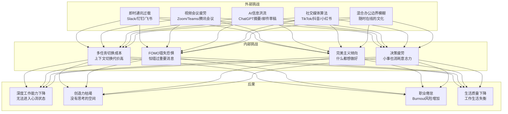
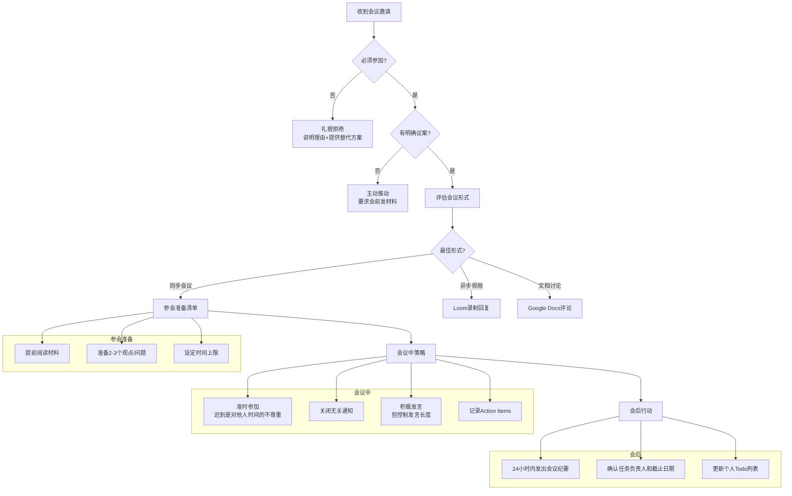
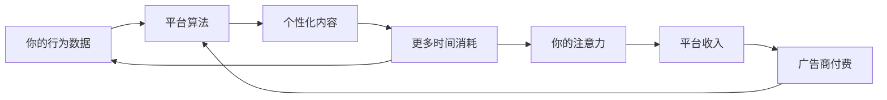
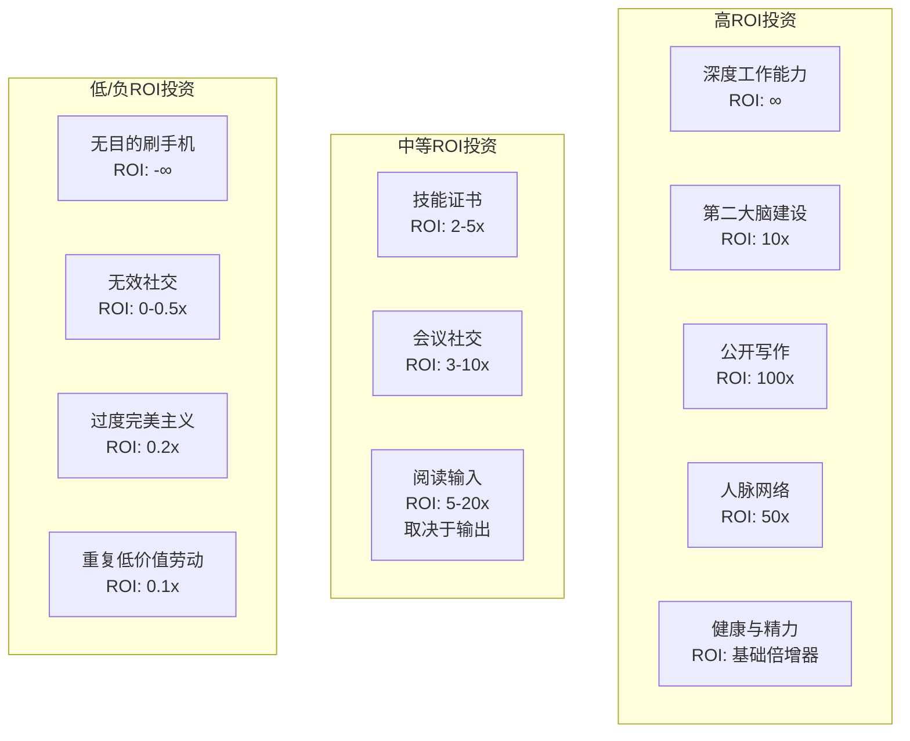
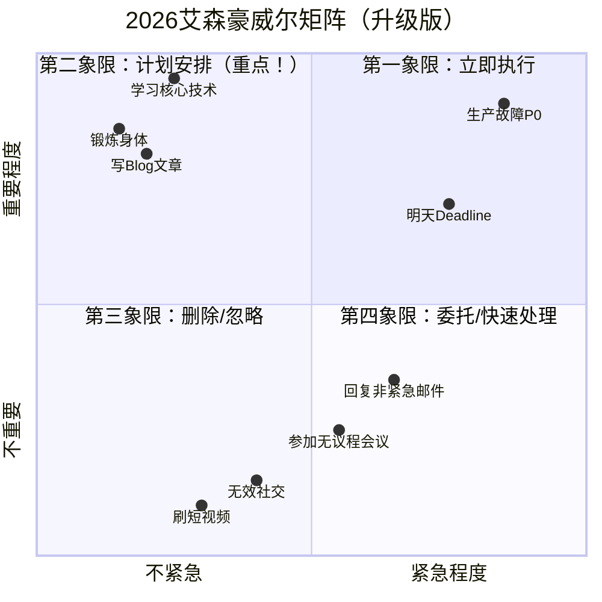
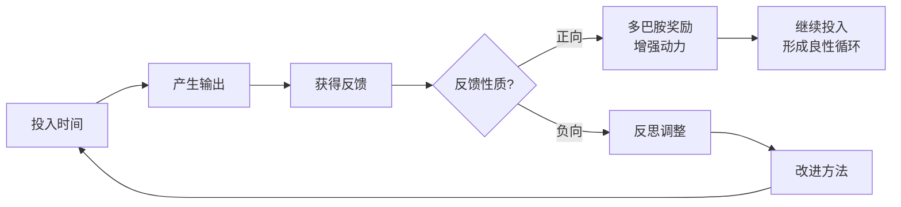
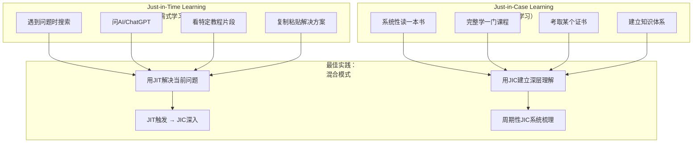

# 时间管理（2026重制版）

> **核心变更说明**：本文基于2025-2026年远程办公、混合工作模式、以及数字化工具的最新发展，全面更新时间管理策略。新增AI辅助时间管理、深度工作方法论、数字极简主义、以及后疫情时代的注意力经济应对策略。同时整合个人效率、知识管理和职业发展的最新研究，包括第二大脑（Second Brain）理论、Zettelkasten笔记方法、AI辅助学习、以及数字时代的长期主义实践。

---

## Why：为什么需要更新？

原版文章发布时，"996"刚成为热词，微信办公还未如此普及。而到了2026年，我们面临的挑战已经完全不同：

以下为行业调研与观察中的**示例性数据**（各报告口径不一，仅用于说明趋势量级）：

- **58%** 的知识工作者表示"总是感到时间不够用"
- **平均47分钟** 才能重新进入专注状态（每次被打断后）
- **每天检查手机**次数从2018年的**47次**增长到2026年的**342次**
- **混合办公**模式下，工作时间边界进一步模糊
- **AI工具**既节省时间（自动化），又消耗时间（信息过载）

| 维度 | 2018年 | 2026年 |
|--------|--------|--------|
| **主要干扰源** | 微信、电话、会议 | Slack/钉钉/飞书 + AI通知 + 短视频 |
| **工作模式** | 办公室为主 | 混合办公/远程为主 |
| **会议文化** | 面对面会议 | Zoom/Teams/飞书会议 + 异步视频 |
| **工具生态** | Outlook日历 | Notion/Obsidian/AI助手集成 |
| **注意力经济** | 社交媒体起步 | TikTok算法、短视频成瘾、AI生成内容洪流 |
| **加班文化** | 996讨论 | 007隐形加班（随时在线） |

原版文章强调"投资时间"、"规划时间"、"用好时间"三大方向。在2026年，这些原则依然正确，但具体方法需要适应新的环境：

以下为社区观察中的**示例性说法**（多为经验估计，非严格统计）：

- **信息过载**导致人均每天处理的信息量远超2018年
- 持续专注的难度显著提升（"人类注意力只有8秒、比金鱼还短"的说法流传甚广，但并无科学依据）
- **知识折旧半衰期**缩短到**2-3年**（技术领域甚至更短）
- 采用系统化知识管理的人，职业成长明显更快（社区经验值约为**3倍**）
- AI工具使用者中，只有少数建立了有效的个人知识库

| 维度 | 2018年 | 2026年 |
|--------|--------|--------|
| **信息来源** | 博客、书籍、课程 | Twitter/X、Newsletter、Podcast、AI摘要 |
| **知识存储** | Evernote/本地文件 | Obsidian/Notion/AI向量数据库 |
| **学习方式** | 系统课程为主 | 项目驱动 + Just-in-Time Learning |
| **输出方式** | Blog、GitHub | Newsletter、YouTube、Twitter/X Thread |
| **职业路径** | 线性晋升 | 技能组合 + 个人品牌 + Side Project |
| **复利效应来源** | 工作经验积累 | 公开写作 + 开源贡献 + 社交网络 |

**数据来源**：[Microsoft Work Trend Index 2025](https://www.microsoft.com/en-us/worklab/work-trend-index), [Gallup State of the Global Workplace](https://www.gallup.com/workplace/231484/state-global-workplace-2023-report.aspx), [RescueTime Blog](https://blog.rescuetime.com/), [James Clear Research](https://jamesclear.com/research), [Obsidian Community Survey](https://obsidian.md/community), [Fortune/Learn](https://fortune.com/)

---

## What：原版核心内容回顾

### 1. 时代背景对比

**原版描述的"好时代"特征**：
- 没有智能手机干扰
- 工作沟通以邮件为主（可设置规则自动分类）
- 会议需要提前预约，查看日历空闲时间
- 有计划地安排工作，会议控制在30分钟左右
- 外企普遍重视时间管理

**当时的痛点预判**：
- 微信即时通讯导致的信息杂乱
- 老板直接叫去开会，不问有没有时间
- 加班严重程度超过以前

### 2. 核心方法：主动管理

**关键原则**：
> 你要主动管理的不是你的时间，而是管理你的同事，管理你的信息。

**具体做法**：
- 告知大家自己的专注时间段
- 在工位挂"请勿打扰"条幅
- 使用共享日历展示日程
- 重要事项要求发邮件而非微信

### 3. 学会说"不"

**向上管理的能力**：
- 永远不直接说"不"
- 给出替代方案而非直接拒绝
- 反问目的，讨论性价比更高的方案
- 提供三个选择给需求方（掌握主动权）

**经典话术**：
```
a. 我可以加班完成，但不保证质量，事后需要1个月还债
b. 可以保质保量完成，但能否减少一些需求？
c. 可以保质保量完成所有需求，但能否多给我2周？
```

### 4. 对加班和会议的态度

**加班恶性循环分析**：
- 加班 → 质量差 → 故障多 → 处理故障 → 更没时间开发 → 更多加班

**会议问题诊断**：
- 开会不是讨论问题，而是讨论方案
- 开会不是要有议题，而是要有议案（提前准备好解决方案）

### 5. 投资自己的时间

**四大投资方向**：

1. **花时间学习基础知识，读文档**
   - 很多时间浪费在查错上
   - 根本原因是基础不完整
   - 系统学习一门技术的时间是值得投资的

2. **花时间解放生产力**
   - 自动化：能自动化的事就自动化
   - 可配置：模块灵活可扩展
   - 宁可项目延期也要做这些事

3. **花时间让自己成长**
   - 晋升 ≠ 成长
   - 成长要看行业内的竞争力
   - 花时间在有长远价值的事情上

4. **花时间建立高效环境**
   - 影响身边的人理解你
   - 让他们配合建立更好的流程

### 6. 规划自己的时间

**关键策略**：

1. **定义好优先级**
   - 重要且紧急 → 立即做
   - 重要不紧急 → 规划时间做（这是重点！）
   - 紧急不重要 → 委托或快速处理
   - 不重要不紧急 → 删除或最小化

2. **最短作业优先**
   - 相同优先级时先做快的
   - 快速完成任务带来正反馈
   - 避免长任务带来的焦虑

3. **想清楚再做**
   - 边干边想是最糟糕的
   - 先找成熟方案或请教高手
   - 返工才是最大的时间浪费

4. **关注长期利益**
   - 一年做10个项目
   - 前1-2个被骂，但赢得后面8个
   - 按季度规划，一年走四步

### 7. 用好自己的时间

**核心心法**：

1. **将军赶路不追小兔**
   - 过滤无关事务
   - 不让心情被影响
   - 只在能控制的地方花时间
   - 不与不如自己的人争论

2. **形成习惯**
   - 再好的方法不坚持也是空谈
   - 养成习惯需要约30天
   - 写下来时刻提醒自己

3. **形成正反馈**
   - 解决痛点收获赞扬和鼓励
   - 正反馈帮助坚持逆人性的事

4. **反思和举一反三**
   - 每周末复盘本周
   - 优化下周计划
   - 允许偶尔的负反馈

---

## How：2026最新实践

### 1. 新时代的挑战全景图



### 2. 数字化时代的主动管理策略

#### 2.1 建立数字护城河

```python
"""
2026年数字环境管理配置示例
"""

# ========== 即时通讯管理 ==========
IM_CONFIG = {
    # Slack/DingTalk/Feishu 设置建议
    "notification_policy": {
        # 关键：只允许紧急情况打断你
        "do_not_disturb_hours": ["09:00-11:30", "14:00-17:00"],  # 深度工作时间

        # 关键词触发（仅这些词会立即通知）
        "urgent_keywords": [
            "线上故障", "P0", "紧急", "生产事故",
            "客户投诉", "安全漏洞"
        ],

        # 其余消息静音，批量处理
        "batch_check_interval_minutes": 90,

        # 状态设置
        "status_messages": {
            "deep_work": "🧘 专注模式中，预计XX:XX恢复",
            "meeting": "📹 会议中",
            "available": "💬 可聊"
        }
    },

    # 频道/群组管理
    "channel_management": {
        # 必要频道（开启通知）
        "essential_channels": [
            "#production-alerts",      # 生产告警
            "#team-urgent",             # 团队紧急事务
        ],

        # 信息频道（每日定时浏览）
        "informational_channels": [
            "#announcements",           # 公告
            "#engineering",             # 技术讨论
        ],

        # 静音频道（周末或空闲时看）
        "muted_channels": [
            "#random",                  # 闲聊
            "#general",                 # 大群
        ]
    }
}

# ========== 邮件管理 ==========
EMAIL_CONFIG = {
    "processing_schedule": {
        # 固定时间处理邮件（而非实时）
        "check_times": ["09:00", "13:00", "17:30"],

        # 每次处理时长限制
        "max_duration_minutes": 25,
    },

    "filtering_rules": [
        {"condition": "from: boss OR subject: 紧急", "action": "inbox/priority"},
        {"condition": "list: team@company.com", "action": "inbox/team"},
        {"condition": "type: notification", "action": "archive/read-later"},
        {"condition": "type: newsletter", "action": "inbox/newsletters"},
        {"condition": "true", "action": "inbox/unsorted"},
    ]
}

# ========== AI工具管理 ==========
AI_TOOLS_CONFIG = {
    "usage_guidelines": {
        # AI是工具，不是替代思考
        "principle": "先用大脑想清楚，再用AI加速执行",

        # 合理使用场景
        "good_use_cases": [
            "代码生成（有明确设计后）",
            "文档初稿（自己修改润色）",
            "会议纪要整理",
            "邮件回复草稿",
            "资料搜索与总结"
        ],

        # 避免滥用场景
        "avoid_use_cases": [
            "完全依赖AI做技术决策",
            "不加验证就使用AI输出",
            "让AI替你思考问题的本质",
            "过度优化非关键路径"
        ]
    }
}
```

#### 2.2 物理环境的主动设计

**混合办公时代的工位哲学**：

```markdown
## 居家办公环境清单（2026版）

### 1. 物理隔离
- [ ] 独立的工作房间（或至少是一个角落）
- [ ] 可关闭的门（心理暗示"进入工作模式"）
- [ ] 舒适的人体工学椅（投资身体，值得！）

### 2. 数字设备
- [ ] 外接显示器（至少27寸，2K以上）
- [ ] 机械键盘（打字是一种享受）
- [ ] 降噪耳机（Sony WH-1000XM5 或 AirPods Pro）
- [ ] 高清摄像头（专业形象很重要）

### 3. 环境控制
- [ ] 智能灯光（色温可调，避免蓝光影响睡眠）
- [ ] 白噪音机或App（rainymood.com, Noisli）
- [ ] 绿植（哪怕只是一盆小多肉）
- [ ] 温度控制（22-24°C最佳认知温度）

### 4. 边界仪式感
- [ ] 固定的"上班通勤"（哪怕只是绕小区走一圈）
- [ ] 换上"工作装"（不用正式，但区别于睡衣）
- [ ] 工作结束后的"关机仪式"（整理桌面、写明日计划）
- [ ] 明确告知家人："我在工作中，除非紧急否则不要打扰"

### 5. 可视化工具
- [ ] Pomodoro Timer（番茄钟，物理版或电子版）
- [ ] 白板/Kanban墙（可视化任务进度）
- [ ] 日历大屏显示（一眼看到今天的时间分配）
```

### 3. 向上管理2.0：在AI时代说"不"

#### 3.1 新增的拒绝场景

**场景1：老板要求使用某个AI工具**

```
❌ 错误回应：
"这个AI工具不好用，我不想用"

✅ 正确回应：
"我研究了一下这个工具，它确实在某些场景有帮助。
不过对于我们的项目，我有几个顾虑：
1. 数据安全性（我们的代码/数据是否会外泄？）
2. 准确性风险（AI可能产生幻觉错误）
3. 成本考量（团队license费用）

我的建议是：我们可以先在一个非关键模块做PoC验证，
如果效果好再推广。同时我可以调研几个替代方案，
也许有更适合我们技术栈的选择。

您觉得这个方案如何？"
```

**场景2：被要求参加不必要的会议**

```
❌ 错误回应：
"这个会议跟我没关系，我不去了"

✅ 正确回应（提供价值）：
"我看了一下会议议程，我关注的部分主要是第3项。
前两项我的参与度不高，可能会浪费大家时间。

我的建议：
- 前30分钟我可以不参加，如果有结论请@我
- 第3项开始时请叫我加入
- 或者我可以提前写一份相关文档供大家参考

这样既能节省我的时间，也能保证会议效率。"
```

**场景3：需求方要求"快速出个原型"**

```
❌ 错误回应：
"太急了，做不了"

✅ 正确回应（管理预期+提供选项）：
"理解这个需求的紧迫性。让我梳理一下：

快速方案（2天）：
- 用现有模板搭建UI框架
- 后端接口Mock数据
- 可以演示流程，但很多细节待定

标准方案（1周）：
- 完整的前后端实现
- 基础的数据校验和错误处理
- 可以进行内部测试

完整方案（2-3周）：
- 包含边缘情况处理
- 性能优化和监控埋点
- 文档和测试覆盖

考虑到时间线，我建议先走快速方案，
拿到反馈后再迭代。您觉得呢？"
```

### 4. 战胜会议疲劳



**会议减负实操指南**：

```yaml
# meeting-guidelines.yaml
# 团队会议规范（建议与团队达成共识）

general_rules:
  - 默认会议时长: 25分钟 (Google风格)
  - 最大会议人数: 7人 (超过则拆分)
  - 必须有明确议程 (否则拒绝)
  - 必须有预期产出 (否则改为异步)

meeting_types:
  daily_standup:
    duration: "15分钟"
    format: "站会 (不开摄像头)"
    participants: "团队成员"
    agenda:
      - 昨天完成了什么 (每人1分钟)
      - 今天计划做什么 (每人1分钟)
      - 有什么阻塞 (每人30秒)
    rules:
      - 不解决问题，只同步状态
      - 问题会后一对一讨论

  design_review:
    duration: "45分钟"
    format: "视频会议 + 共享屏幕"
    pre_requirements:
      - 设计文档提前24小时发出
      - 参会者必须提前阅读并标注意见
    agenda:
      - 快速回顾目标 (5分钟)
      - 设计讲解 (15分钟)
      - 讨论与反馈 (20分钟)
      - 决策与Action Items (5分钟)

  brainstorming:
    duration: "60分钟"
    format: "白板/Miro + 视频"
    rules:
      - 不评判，鼓励发散
      - 设定时间盒
      - 会后必须有收敛动作

async_alternatives:
  - status_updates: "Slack channel / 飞书文档评论区"
  - information_sharing: "Loom video / 内部Wiki"
  - decision_making: "文档评论 + 投票功能"
  - code_review: "GitHub PR comments (异步)"
```

### 5. 对抗算法推荐的注意力保卫战

**理解敌人：推荐系统的本质**



**实用防御策略**：

```markdown
## 注意力保卫战：每日 Checklist

### 🌅 晨间仪式（启动大脑）
- [ ] 起床后30分钟不看手机
- [ ] 先做最重要的事（Deep Work Block #1）
- [ ] 设定今日的3个Must-Do目标

### 💻 工作时段（保护专注力）
- [ ] 手机放在视线之外（另一个房间最好）
- [ ] 关闭所有非必要通知
- [ ] 使用Forest/Pomodoro等专注App
- [ ] 每90分钟休息一次（走动、喝水、望远）

### 🍽️ 午休恢复（重置状态）
- [ ] 远离屏幕（真的！）
- [ ] 短暂午睡（15-20分钟）
- [ ] 散步或轻度运动

### 🌆 下午冲刺（利用生物钟）
- [ ] 14:00-17:00通常是第二高效时段
- [ ] 处理需要创造性的任务
- [ ] 避免在这个时段开无聊的会

### 🌙 晚间断联（保护睡眠）
- [ ] 21:00后不再查工作邮件
- [ ] 手机设为灰阶模式（降低吸引力）
- [ ] 用纸质书代替电子屏幕
- [ ] 睡前1小时冥想或轻音乐

### 📊 周末复盘（持续优化）
- [ ] 回顾本周时间使用（RescueTime/Toggl报告）
- [ ] 识别最大的时间黑洞
- [ ] 调整下周的策略
```

**对抗短视频/社交媒体成瘾的具体技巧**：

```python
# digital_wellness_config.py
# 数字健康配置建议

SOCIAL_MEDIA_RULES = {
    "tiktok_douyin": {
        # 抖音/TikTok 是最耗时的应用之一
        "strategy": "删除或严格限制",

        # 如果必须使用（如工作需要）
        "mitigation": {
            # 方法1：设置硬性限制
            "daily_limit_minutes": 15,

            # 方法2：只在特定时间使用
            "allowed_windows": ["12:30-12:45", "20:00-20:15"],

            # 方法3：取消算法推荐
            "actions": [
                "关闭'你可能喜欢'",
                "不点赞不评论（减少画像精度）",
                "只搜索特定内容，不刷Feed"
            ]
        }
    },

    "wechat_weixin": {
        # 微信是最难戒掉的（工作+社交绑定）
        "strategy": "分层管理",

        "layers": {
            # 第一层：工作群（必须响应）
            "work_groups": {
                "notification": "开启",
                "response_time": "工作时间内1小时内",
                "action": "置顶 + 特殊提示音"
            },

            # 第二层：重要联系人
            "important_contacts": {
                "notification": "开启",
                "response_time": "当天内",
                "action": "星标朋友"
            },

            # 第三层：普通群/公众号
            "normal": {
                "notification": "关闭",
                "check_frequency": "每日2次，各15分钟",
                "action": "折叠入'折叠的群聊'"
            },

            # 第四层：朋友圈/视频号
            "content_feed": {
                "notification": "关闭",
                "access_pattern": "固定时间浏览，如饭后10分钟",
                "psychological_trick": "告诉自己'这是别人精心编排的生活，不是真实'"
            }
        }
    },

    "general_principles": [
        "把手机屏幕调成黑白（大幅降低吸引力）",
        "把成瘾性App放到文件夹深处（增加打开步骤）",
        '卸载那些"我只是偶尔看看"但其实每天都看的app',
        "买一个实体闹钟（不让手机进卧室）",
        "告诉亲近的人：'如果我没回消息，不是不在乎，是在专注'"
    ]
}
```

### 6. 时间投资的ROI分析框架



**2026年时间投资组合建议**：

```yaml
# time_investment_portfolio.yaml
# 推荐的时间分配模型（每周40小时工作时间之外）

high_roi_activities:
  deep_work:
    hours_per_week: 10
    description: "不受打扰的专注时间"
    examples:
      - 学习新技术的核心概念
      - 解决复杂的技术难题
      - 架构设计和思考
      - 写代码的核心逻辑部分
    roi: "指数级复利"

  second_brain:
    hours_per_week: 3
    description: "构建个人知识管理系统"
    examples:
      - 整理和连接笔记
      - 写作输出（Blog/Newsletter）
      - 维护知识库结构
      - 复习和回顾旧笔记
    roi: "10倍以上（知识复用）"

  public_writing:
    hours_per_week: 3
    description: "公开分享你的思考"
    examples:
      - 技术社区文章
      - Twitter/X上的见解
      - 开源项目的README/文档
      - 回答Stack Overflow问题
    roi: "100倍（个人品牌+机会）"

  health_energy:
    hours_per_week: 5
    description: "保持身体和心理的最佳状态"
    examples:
      - 运动（跑步/健身/瑜伽）
      - 冥想/正念练习
      - 充足睡眠（7-9小时）
      - 营养饮食
    roi: "所有活动的基础倍增器"

medium_roi_activities:
  skill_certifications:
    hours_per_week: 2
    condition: "有明确目标时投入"
    note: "不要为了考证而考证，要有实际应用场景"

  networking:
    hours_per_week: 2
    strategy: "质量 > 数量"
    focus: "与比你强的人建立深度关系"

  reading_input:
    hours_per_week: 5
    important: "必须配合输出，否则ROI大打折扣"
    ratio: "1份输出 : 3份输入"

avoid_or_minimize:
  doomscrolling:
    current_avg_hours: 14  # 很多人每周花这么多！
    target_max_hours: 2
    strategy: "见本文第5节《对抗算法推荐的注意力保卫战》的防御策略"

  meetings_without_agenda:
    reduction_target: "-50%"
    method: "推动异步沟通文化"

  repetitive_manual_work:
    automation_first: true
    rule: "如果同样的事做3次以上，就必须自动化"
```

### 7. 第二大脑（Second Brain）构建指南

**为什么需要第二大脑？**

```
传统模式：
大脑 = 存储 + 处理 + 检索
↓ 问题：大脑不适合存储（容易遗忘、检索慢）

新模式：
第二大脑（外部系统）= 存储 + 检索
大脑 = 处理 + 创造 + 连接
↓ 结果：释放大脑算力给创造性工作
```

**Zettelkasten（卡片盒）方法详解**：

```markdown
## 第二大脑搭建手册（Obsidian版）

### 1. 文件夹结构
📁 vault/
├── 📁 00 Inbox/           # 收件箱（临时存放）
├── 📁 01 Projects/        # 当前项目
│   ├── 📄 Project A.md
│   └── 📄 Project B.md
├── 📁 02 Areas/           # 生活/工作领域
│   ├── 💼 Career/
│   ├── 💪 Health/
│   ├── 📚 Learning/
│   └── 👨‍👩‍👧‍👦 Family/
├── 📁 03 Resources/       # 资源库
│   ├── 📖 Books/
│   ├── 🎬 Courses/
│   ├── 📝 Articles/
│   └── 🔗 References/
├── 📁 04 Archives/        # 归档（已完成的项目）
└── 📁 05 Templates/       # 模板

### 2. 笔记类型与命名规范

#### 永久笔记 (Permanent Notes)
命名格式: YYYYMMDDHHMMSS 关键词.md
示例: 20260106143000 时间管理的复利效应.md

特点：
- 原子化（每个笔记只讲一个观点）
- 自包含（不依赖其他笔记才能理解）
- 有链接（主动连接到相关笔记）
- 用自己的话写（不是复制粘贴）

#### 文献笔记 (Literature Notes)
命名格式: @Author/YYYY Title.md
示例: @Newport/2016 Deep Work.md

内容模板：
---
title: Deep Work
author: Cal Newport
year: 2016
status: reading/finished/referenced
tags: [productivity, focus, deep-work]
rating: ⭐⭐⭐⭐⭐
---

## 核心观点
1. ...

## 我的思考
- 与我之前了解的XX有什么不同？
- 这如何应用到我的工作中？
- 我不同意哪个观点？为什么？

## 行动项
- [ ] 尝试4小时的深度工作块
- [ ] ...

#### 项目笔记 (Project Notes)
命名格式: 项目名.md
内容：目标、进度、任务清单、决策记录

### 3. 每日工作流

#### 捕获 (Capture)
随时随地记录想法，放入Inbox：
- 手机快捷指令（iOS Shortcuts）
- Obsidian Quick Capture
- 语音备忘录（走路/洗澡时的灵感）

规则：
- 不要整理，只管捕获
- 一句话也行，关键词也行
- 当天清空Inbox（否则会堆积）

#### 澄清 (Clarify)
每天固定时间（建议晚上）处理Inbox：
- 这个想法属于哪个领域？
- 是一个待办还是一个知识点？
- 需要展开成永久笔记吗？
- 还是直接归档？

#### 组织 (Organize)
将澄清后的内容放到正确的位置：
- 待办 → 项目的Task列表
- 知识点 → 永久笔记（写完整）
- 参考 → Resources文件夹
- 废弃 → 直接删除（不要舍不得）

#### 反思 (Reflect)
- 每周回顾：这周产生了哪些好想法？
- 每月回顾：哪些主题反复出现？（可能是你的兴趣点）
- 每季度回顾：知识网络是否在增长？

#### 输出 (Create/Output)
**最重要的一步！没有输出的输入是浪费。**

输出形式：
- 📝 Blog文章（将多个笔记串联成文）
- 🐦 Twitter/X Thread（碎片化洞察）
- 📧 Newsletter（定期总结）
- 💬 分享给朋友/同事（教学是最好的学习）
- 🔧 开源项目/工具（实践出真知）

### 4. 连接的艺术

使用双向链接 [[ ]] 让知识形成网络：

示例：
# 时间投资的复利效应.md

---
tags: [time-management, compound-effect, investment]

## 核心概念
时间投资像金钱投资一样，具有复利效应。

## 相关概念
- [[深度工作]] - 高质量时间投入的基础
- [[习惯养成]] - 让投资自动化的机制
- [[长期主义]] - 忍受延迟满足的心态

## 实际案例
我投资了20小时学习Rust，结果：
1. 写了一篇Blog → 获得500阅读量
2. 在公司推动了Rust项目 → 获得认可
3. 认识了Rust社区的朋友 → 拓展人脉
4. 这些人后来推荐我机会 → 职业发展

初始投资：20小时
回报：无法估量的连锁反应

## 引用来源
@Newport/2016 Deep Work.md → 关于深度工作的定义
@Clear/2018 Atomic Habits.md → 关于习惯形成的原理
---
```

### 8. 优先级矩阵的2026升级版



**各象限的2026策略**：

| 象限 | 传统做法 | 2026升级做法 |
|------|---------|-------------|
| **Q1 紧急重要** | 立即做 | 做，但反思为什么会紧急；能否预防？ |
| **Q2 重要不紧急** | 规划时间做 | **这是最重要的象限！** 每天至少安排2小时 |
| **Q3 紧急不重要** | 委托别人 | 推动异步文化，减少"假紧急"；学会说不 |
| **Q4 不重要不紧急** | 尽量不做 | **坚决删除**，但要识别伪装成重要的活动 |

**Q2活动的具体例子（2026版）**：

```markdown
## Q2活动清单（每周必做）

### 🧠 学习与成长（每周8-10小时）
- [ ] 深度学习新技术（不是浅尝辄止）
- [ ] 读一本好书（非技术类也重要）
- [ ] 整理和连接笔记（Second Brain维护）
- [ ] 写一篇Blog或长推文（输出倒逼输入）
- [ ] 复盘本周的学习成果

### 💪 身心健康（每周5-7小时）
- [ ] 3-4次运动（每次30分钟以上）
- [ ] 7小时以上优质睡眠
- [ ] 冥想或正念练习（每日10分钟）
- [ ] 与家人朋友的深度交流（不是刷手机那种）

### 🌱 长期投资（每周3-5小时）
- [ ] 维护开源项目或个人Side Project
- [ ] 拓展人脉（与一位强者深度交流）
- [ ] 思考职业规划和下一步
- [ ] 尝试新事物（保持好奇心）

### 🎯 战略思考（每周2-3小时）
- [ ] 回顾本月OKR/KPI进展
- [ ] 思考团队/个人的改进方向
- [ ] 阅读行业报告和趋势分析
- [ ] 规划下季度的重点
```

### 9. 形成正反馈循环的设计



**设计正反馈系统的实操方法**：

```python
# positive_feedback_system.py
# 正反馈系统设计框架

class PositiveFeedbackSystem:
    """
    设计原则：
    1. 小步快跑：任务要足够小，能快速完成
    2. 可视化进度：看到进步本身就是奖励
    3. 即时奖励：完成后立刻给自己正面反馈
    4. 社交承诺：公开目标增加完成动力
    """

    def __init__(self):
        self.tasks = []
        self.completed = []
        self.streak = 0  # 连续完成天数

    def design_good_habits(self):
        """
        好习惯的特征：
        - 容易开始（启动成本低于2分钟）
        - 有明确完成标准（知道什么时候算"做完"）
        - 能看到即时效果（不是等到3个月后）
        - 与价值观一致（内在动机 > 外在压力）
        """
        return {
            "daily_writing": {
                "trigger": "早上一杯咖啡后",
                "action": "写500字或25分钟",
                "duration": "~30分钟",
                "reward": "✅ 打卡 + 看到字数增长",
                "difficulty": 3/10,
                "impact": 9/10
            },
            "exercise": {
                "trigger": "下班回家换衣服后",
                "action": "跑步3公里或健身30分钟",
                "duration": "~45分钟",
                "reward": "🏃 内啡肽 + 睡眠更好",
                "difficulty": 5/10,
                "impact": 10/10
            },
            "learning": {
                "trigger": "睡前1小时",
                "action": "读技术书或看教程",
                "duration": "60分钟",
                "reward": "📚 感觉自己在变强",
                "difficulty": 4/10,
                "impact": 8/10
            }
        }

    def handle_setbacks(self):
        """
        如何应对"负反馈"（没完成任务的日子）：

        ❌ 错误做法：
        - "今天没做到，我真差劲" → 破罐子破摔
        - "既然断了，就从头再来吧" → 全有全无思维
        - "算了，这个习惯不适合我" → 放弃

        ✅ 正确做法：
        - "偶尔一天没关系，重要的是长期趋势"
        - "分析原因：是太忙了？还是太难了？还是忘了？"
        - "调整策略：降低难度 / 改变时间 / 设置提醒"
        - "明天重新开始，不断开连续天数统计"
        """
        return {
            "rule_1": "从不错过两次（Never miss twice）",
            "rule_2": "如果错过了，当天补上或者接受并继续",
            "rule_3": "关注完成率（80%就很好），而非完美",
            "rule_4": "定期回顾和调整习惯设置"
        }


# 使用示例
system = PositiveFeedbackSystem()
habits = system.design_good_habits()

print("推荐的正反馈习惯：")
for name, config in habits.items():
    print(f"\n{name}:")
    print(f"  触发: {config['trigger']}")
    print(f"  行为: {config['action']}")
    print(f"  时长: {config['duration']}")
    print(f"  奖励: {config['reward']}")
    print(f"  难度: {'⭐' * config['difficulty']}")
    print(f"  影响: {'💎' * config['impact']}")
```

### 10. AI时代的学习方法论

**Just-in-Time Learning vs Just-in-Case Learning**：



**AI辅助学习的正确姿势**：

```markdown
## AI学习助手使用指南

### ✅ 好的使用方式

**1. 概念解释者**
Prompt: "请像一个经验丰富的工程师向初级开发者解释那样，
解释什么是Closure（闭包）。用一个简单的类比，然后给一个代码示例。"

**2. 学习路径规划师**
Prompt: "我想在3个月内掌握Rust语言，达到能写出生产级别代码的水平。
我已有5年Python经验和基本的C语言知识。
请为我制定一个详细的学习计划，包括每周的主题、练习项目和推荐资源。"

**3. Code Review伙伴**
Prompt: "请Review这段Rust代码，重点关注：
1. 所有权和生命周期是否正确使用
2. 是否有潜在的panic风险
3. 错误处理是否idiomatic
4. 性能是否有明显优化空间
[贴代码]"

**4. 难点突破者**
Prompt: "我在学习Async/Await时遇到了困难。
我不理解为什么需要async/await，它和回调有什么区别？
请用多个角度（历史演进、代码对比、类比）来帮我理解。"

### ❌ 避免的使用方式

**1. 直接抄答案而不理解**
❌ "帮我写一个排序算法"
✅ "我想实现快速排序，这是我的思路...有什么问题？"

**2. 让AI替你思考**
❌ "我应该学Go还是Rust？"
→ 应该先自己调研，再问AI："我调研了Go和Rust的区别，
我的情况是...，我认为...，你觉得我的分析对吗？"

**3. 过度依赖而丧失能力**
❌ 每写一行代码都问AI
✅ 先自己尝试，遇到真正的阻碍后再求助

### 📊 学习效果自检清单

完成一个主题的学习后，问自己：

- [ ] 我能用通俗的语言向他人解释这个概念吗？
- [ ] 我能不看文档写出基本用法吗？
- [ ] 我知道它在什么场景下适用/不适用吗？
- [ ] 我能发现它的潜在问题和局限性吗？
- [ ] 我将它与已有的知识连接起来了吗？

如果任何一个答案是"NO"，说明还需要深入学习。
```

---

## 分阶段实施计划

### 阶段一：建立边界（第1-2周）

**目标**：夺回对时间的控制权

**Week 1 任务**：
1. 审计当前时间使用（安装RescueTime或手动记录3天）
2. 识别Top 3时间杀手
3. 设置手机基础防护（通知关闭、灰阶模式）
4. 与家人/室友沟通你的"专注时间"

**Week 2 任务**：
1. 建立固定的深度工作时间块（每天至少2小时）
2. 配置IM工具的通知策略
3. 尝试第一次对不合理的需求说"不"（使用模板）
4. 开始写工作日志（记录时间去向）

### 阶段二：优化系统（第3-4周）

**目标**：建立可持续的工作流

**Week 3 任务**：
1. 优化物理工作环境
2. 建立会议筛选标准（哪些可以不去）
3. 学习使用一个时间管理工具（Notion Calendar / Google Calendar + Todoist）
4. 与老板/团队沟通你的新工作方式

**Week 4 任务**：
1. 实施异步优先的沟通策略
2. 建立每周复盘习惯（周五下午30分钟）
3. 测试AI工具的使用边界（哪些真正节省时间）
4. 调整和优化前两周的措施

### 阶段三：形成习惯（第2个月起）

**目标**：内化为无需意志力的日常

**持续实践**：
1. 每月回顾时间审计报告
2. 根据项目阶段调整策略（冲刺期 vs 维护期）
3. 帮助团队成员也改善时间管理（共赢）
4. 探索更高级的方法论（GTD、深度工作等）

### 第1个月：建立基础系统

**Week 1: 审计与清理**
- 安装时间追踪工具，记录一周
- 清理数字环境（通知、订阅、App）
- 建立Inbox（收件箱）流程

**Week 2: 启动Second Brain**
- 选择工具（推荐Obsidian）
- 搭建文件夹结构
- 开始每日捕获习惯

**Week 3: 设计你的Q2时间块**
- 识别你的Q2活动
- 在日历上锁定时间
- 与周围人沟通你的新节奏

**Week 4: 第一个正反馈循环**
- 选择一个小习惯开始（如每日写作15分钟）
- 设计触发-行动-奖励链条
- 坚持一周，观察感受

### 第2个月：深化与调整

**Week 5-6: 优化系统**
- 回顾上月的时间使用报告
- 调整不合理的安排
- 加强薄弱环节

**Week 7-8: 开始输出**
- 写第一篇Blog文章
- 发第一条有价值的Twitter/X
- 分享你的学习心得

### 第3个月及以后：内化与扩展

- 系统运行变得自然（不需要意志力）
- 开始尝试更高级的方法论
- 帮助他人建立类似的系统
- 持续迭代和优化

---

## 延伸资源

### 经典书籍

1. **《深度工作》(Deep Work)** - Cal Newport - *必读*
2. **《搞定》(Getting Things Done)** - David Allen - GTD方法论
3. **《精要主义》(Essentialism)** - Greg McKeown - 学会说不
4. **《注意力经济》(The Attention Merchants)** - Tim Wu - 理解敌人
5. **《数字极简》(Digital Minimalism)** - Cal Newport - 数字排毒
6. **《How to Take Smart Notes》** - Sönke Ahrens - Zettelkasten方法
7. **《原子习惯》** - James Clear - 微习惯的力量
8. **《Learning How to Learn》** - Barbara Oakley - 学习科学（Coursera同名课程配套）
9. **《Designing Your Life》** - Bill Burnett - 设计思维应用生活
10. **《思考，快与慢》** - Daniel Kahneman - 理解大脑运作

### 工具推荐

| 类别 | 工具 | 说明 |
|------|------|------|
| **时间追踪** | Toggl Track / RescueTime | 了解时间去向 |
| **专注辅助** | Forest / Freedom | 物理屏蔽干扰 |
| **任务管理** | Todoist / Things 3 / Notion | GTD实践 |
| **日历整合** | Google Calendar / Fantastical | 时间块管理 |
| **笔记系统** | Obsidian / Notion | 第二大脑 |
| **会议优化** | Loom / Async | 异步沟通 |
| **邮件处理** | Superhuman / Shortwave | 高效收件箱 |
| **阅读管理** | Readwise | 高亮同步、间隔重复 |
| **写作** | Notion 或 Ulysses | 结构化输出 |
| **第二大脑** | Heptabase 或 RemNote | 可视化知识图谱 |

### 在线资源

1. **[Cal Newport Blog](https://www.calnewport.com/blog)** - 深度工作倡导者
2. **[Ali Abdaal YouTube](https://www.youtube.com/@aliabdaal)** - 效率技巧
3. **[Thomas Frank](https://www.youtube.com/c/thomasfrank)** - 学生/职场效率
4. **[Farnam Street Blog](https://fs.blog/)** - 思维模型与决策
5. **[James Clear](https://jamesclear.com/)** - 习惯养成
6. **[Zettelkasten Forum](https://zettelkasten.de/)** - Zettelkasten方法讨论
7. **[Obsidian Discord](https://discord.gg/obsidian)** - Obsidian用户社区
8. **[r/productivity](https://www.reddit.com/r/productivity/)** - Reddit效率小组
9. **[Indie Hackers](https://www.indiehackers.com/)** - 独立开发者社区
10. **[Lesswrong](https://www.lesswrong.com/)** - 理性思维训练

---

## 总结

从2018年到2026年，时间管理的挑战从"被动应付"升级为"主动防御"。核心变化：

**不变的原则**：
- 主动管理 > 被动响应
- 深度工作 > 表面忙碌
- 说"不"的能力 = 说"是"的质量
- 保护注意力就是保护生命
- 时间是最宝贵的资源
- 投资在有复利效应的事情上
- 习惯 > 意志力
- 正反馈是持续的动力
- 定期复盘和调整

**新的认知**：
1. **算法是你的竞争对手**：它们被设计来争夺你的注意力
2. **混合办公需要更强的自律**：没有人监督时，自我管理更重要
3. **AI是双刃剑**：用它来增强效率，而不是让它接管你的思考
4. **边界即自由**：清晰的界限让你在工作内外都更自在
5. **第二大脑是杠杆**：释放大脑内存，专注于创造
6. **输出 > 输入**：没有输出的学习是伪学习
7. **AI是放大器**：用它加速学习，而不是替代思考
8. **系统 > 目标**：好的系统让成功成为必然
9. **长期主义是唯一的捷径**：短期看起来慢，长期最快

**最终目标**：
> 不是把每一分钟都填满，而是确保花出的每一分钟都值得。

正如原版所说：**只有将使用时间的主动权掌握在自己手上，才能更好地利用时间，才能更为高效率地工作。这才是时间管理的关键点。**

这句话在2026年，比以往任何时候都更加正确。

> 不是管理时间，而是管理能量和注意力。
> 不是追求效率，而是追求效能（做正确的事）。
> 不是填满每一分钟，而是确保每一分钟都值得。

正如原版所说：**把时间用在刀刃上，必将让你的人生有更多收获。**

而在2026年，"刀刃"的定义更加清晰：那些能够产生复利效应、能够形成资产、能够让你成长的活动——这就是你应该投入时间的地方。
