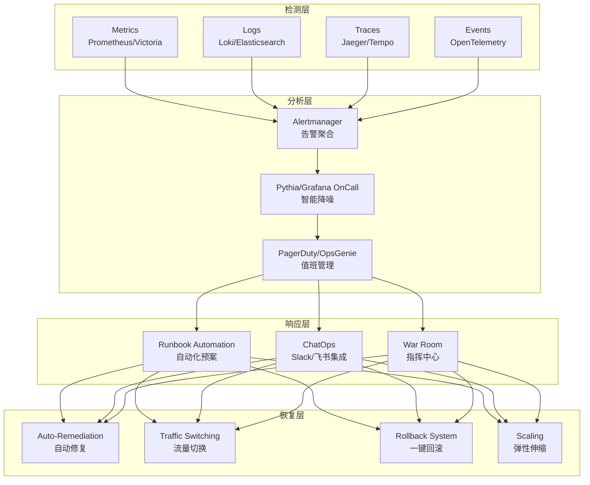
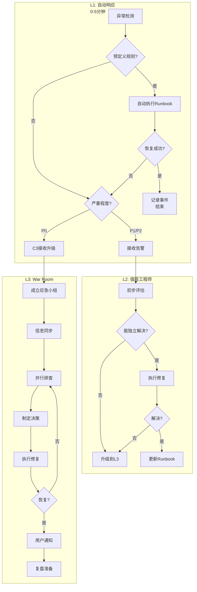
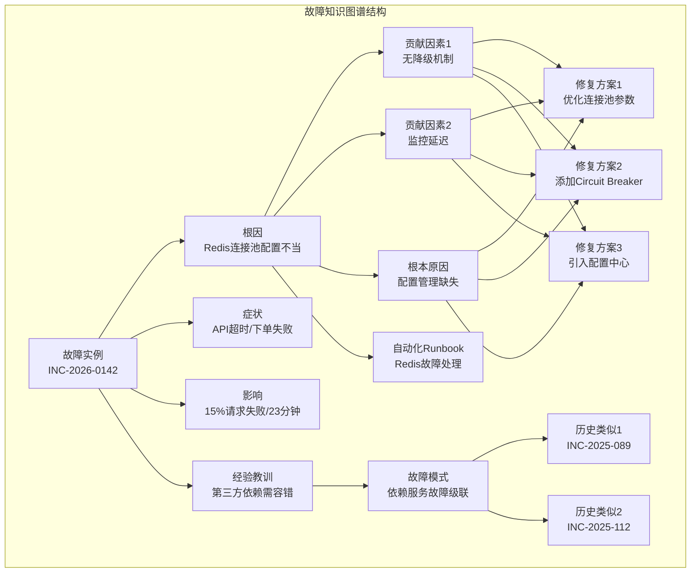
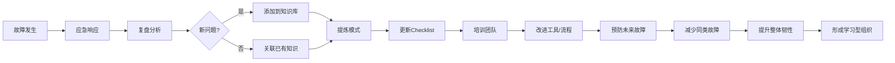

# 故障处理最佳实践（2026重制版）

> **核心变更说明**：本文基于2025-2026年云原生、可观测性、以及SRE（Site Reliability Engineering）的最新实践，全面更新故障应对与改进策略。新增Chaos Engineering、自动故障恢复、AI辅助故障诊断、多集群容灾等现代方案。同时整合故障复盘、持续改进和知识管理的最新实践，包括Blameless Postmortem（无指责复盘）、AI辅助根因分析、组织学习理论应用、以及故障知识图谱构建等现代方法。

---

## Why：为什么需要更新？

原版文章基于亚马逊和阿里的实践经验，核心方法论依然经典。但2026年的技术环境已经发生巨大变化：

以下为行业调研与观察中的**示例性数据**（非官方统计口径，仅用于说明趋势量级）：

- **绝大多数**头部企业已采用云原生架构（Kubernetes为主）
- **平均MTTR（平均修复时间）**相比2018年显著下降
- 越来越多的故障在用户感知前被自动发现
- 采用Chaos Engineering的团队，生产事故明显减少
- AI驱动的根因分析能大幅缩短定位时间

原版文章的核心观点——"惩罚故障责任人非常不认同"——在今天更加重要。以下为社区观察中的**示例性数据**（经验估计）：

- 采用**Blameless Postmortem**文化的团队，故障重复率显著降低
- 大多数生产故障源于系统性问题，而非个人失误
- 拥有完善**故障知识库**的组织，MTTR明显缩短
- AI辅助的根因分析能发现人工遗漏的关联因素
- 将故障经验**系统化沉淀**的团队，工程师成长更快

| 维度 | 2018年 | 2026年 |
|--------|--------|--------|
| **架构模式** | 单体/微服务混合 | 云原生 + Serverless + 多云 |
| **监控手段** | Zabbix/Nagios + 日志 | 可观测性三支柱（指标/日志/追踪） |
| **告警方式** | 邮件 + 短信 | 智能告警 + 自动化Runbook |
| **故障发现** | 用户反馈为主 | 自动化检测 + 异常检测 |
| **恢复手段** | 手动重启/回滚 | 自动扩缩容、流量切换、自动回滚 |
| **复盘工具** | Word文档 | 结构化数据库 + 知识图谱 |
| **复盘文化** | 追责、罚款、扣绩效 | Blameless、学习导向 |
| **文档形式** | Word/PDF | 结构化数据库 + 知识图谱 |
| **分析方法** | 5 Whys（线性） | 5 Whys + 因果图 + 时间线 |
| **改进措施** | 增加流程/审批 | 技术手段优先、简化流程 |
| **跟踪机制** | 靠人记忆/Excel | 自动化Action Item追踪 |
| **价值提取** | 仅团队内部可见 | 组织级知识复用 |

**数据来源**：[CNCF Survey](https://www.cncf.io/reports/cloud-native-survey/), [DORA DevOps Report](https://dora.dev/team/dora-metrics/), [Google SRE Books](https://sre.google/books/), [Google SRE Book](https://sre.google/sre-book/table-of-contents.html), [Postmortems.com](https://postmortems.com/), [IT Revolution](https://itrevolution.com/)

---

## What：原版核心内容回顾

### 1. 故障发生时的处理流程

**亚马逊模式**：
- 每个团队至少一位oncall工程师
- 轮换周期：每人一周
- S1/S2级别故障：提交工单，所有相关团队上线
- 工作流：签到 → 自查 → standby或处理 → 升级（如未解决）

**关键原则**：
> 最重要的是快速恢复，而不是debug故障原因。

**恢复手段优先级**：
1. 重启和限流（解决可用性问题）
2. 回滚操作（解决新代码bug）
3. 降级功能（无法回滚时，挂公告止损）
4. 紧急更新（需要强大的自动化发布系统）

### 2. 故障前的准备工作

**四大准备工作**：

1. **以用户功能为索引的全视图**
   - 前端UI → 后端服务 → 调用关系 → 硬件资源
   - 类似CMDB但更大，以用户功能为索引
   - 由监控系统自动生成

2. **关键指标与运维手册**
   - 每个服务的健康检查方法
   - 关键指标定义
   - 常见故障处理步骤
   - 应急预案（Service Unavailable时的方案）

3. **故障等级设定**
   - P0: 全站不可用
   - P1: 核心功能不可用且无替代
   - P2: 功能不可用但有替代
   - P3: 非功能性故障

4. **故障演练**
   - Netflix: Chaos Monkey（随机杀实例）
   - Facebook: 随机关服务器
   - 目的：提升实战能力

5. **灰度发布系统**
   - 亚马逊Weblab：先发中国 → 日本 → 欧洲 → 美国
   - 减少影响范围

### 3. 故障复盘过程对比

**亚马逊模式（COE - Correction of Errors）**：
1. 故障处理全过程记录
2. 原因分析报告
3. Ask 5 Whys（至少问5个为什么）
4. 后续整改计划
5. 提交VP审查

**阿里模式**：
- 所有相关人员现场复盘
- 加入"故障等级"和"责任人"
- P9/M4承担大故障责任
- 直接工程师有惩罚机制（无加薪升职或罚款）

### 4. 作者立场

**明确反对惩罚责任人**：
- 惩罚与解决故障没有因果关系
- "做得越多，错得越多"
- 导致保守、推诿、恐怖气氛
- 分享代码示例：同库两套线程池的荒诞

**亚马逊 vs 阿里整改差异**：
- 亚马逊：技术手段解决问题，不增加复杂流程
- 阿里：有时会复杂化问题（双人操作、审批环节、新系统看旧系统）

### 5. Ask 5 Whys 实战案例

作者在某公司慢SQL故障中问了近9个为什么：

1. 为什么从故障发生到报警花了27分钟？
2. 为什么15分钟后开发才知道是慢SQL？
3. 为什么监控系统没监测到Nginx 499？
4. 为什么一开始按DDoS处理？
5. 为什么要重启数据库？
6. 为什么之前没发生？（因为刚上首页）
7. 为什么上首页时没做性能测试？
8. 为什么使用高危SQL语句？
9. 为什么上线时没有DBA评审？

### 6. 三条核心原则（Principle）

1. **举一反三解决当下的故障** → 赢得时间
2. **简化复杂、不合理的技术架构、流程和组织** → 不可能在复杂环境下根本解决
3. **全面改善和优化整个系统，包括组织** → 只有简单优雅的东西才能被改善

**深层洞察**：
> 技术问题 → 工程能力问题 → 管理问题 → 公司文化问题 → 创始人的问题

---

## How：2026最新实践

### 1. 现代故障响应体系架构



### 2. 可观测性三支柱的2026实践

#### 2.1 指标（Metrics）

```yaml
# monitoring/slo.yaml
# 服务等级目标（SLO）配置示例

service: user-api
version: "2026.1"

slos:
  availability:
    target: 99.95%          # 月度可用性目标
    window: 30d              # 滚动窗口
    alert_burn_rate: 10%     # 错误预算消耗过快时告警

  latency:
    target:
      p50: "< 100ms"         # 中位数延迟
      p95: "< 500ms"         # 95分位延迟
      p99: "< 2000ms"        # 99分位延迟
    measurement: request_duration_bucket

  error_budget:
    monthly_allowance: 21.6分钟  # 30天 * 0.05%
    current_spent: 12.3分钟
    remaining: 9.6分钟

key_metrics:
  # RED Method (Requests, Errors, Duration)
  business:
    - name: http_requests_total
      labels: [method, endpoint, status]
      type: counter

    - name: http_request_duration_seconds
      labels: [method, endpoint]
      type: histogram
      buckets: [0.1, 0.25, 0.5, 1, 2.5, 5, 10]

    - name: http_errors_total
      labels: [type, endpoint]  # type: 4xx/5xx
      type: counter

  # USE Method (Utilization, Saturation, Errors)
  infrastructure:
    - name: container_cpu_usage_percent
      type: gauge
      threshold_warning: 70
      threshold_critical: 90

    - name: container_memory_working_set_bytes
      type: gauge
      threshold_warning: 80% of limit

    - name: goroutines / thread_count
      type: gauge
      threshold_warning: 10000

  # Custom Business Metrics
  custom:
    - name: user_registration_total
      labels: [source, result]  # source: web/mobile/api; result: success/fail
      type: counter

    - name: order_value_total
      labels: [currency, payment_method]
      type: counter
      unit: currency_minor_units
```

#### 2.2 日志（Logs）

```python
# logging_config.py
# 结构化日志配置（2026最佳实践）

import structlog
import logging.config

LOGGING_CONFIG = {
    "version": 1,
    "disable_existing_loggers": False,
    "formatters": {
        "json": {
            "()": structlog.stdlib.ProcessorFormatter,
            "processor": structlog.dev.ConsoleRenderer(colors=False),
        },
        "console": {
            "()": structlog.stdlib.ProcessorFormatter,
            "processor": structlog.dev.ConsoleRenderer(colors=True),
        }
    },
    "handlers": {
        "default": {
            "level": "INFO",
            "class": "logging.StreamHandler",
            "formatter": "console",
        },
        "file": {
            "level": "DEBUG",
            "class": "logging.handlers.RotatingFileHandler",
            "filename": "/var/log/app/application.log",
            "maxBytes": 10485760,  # 10MB
            "backupCount": 5,
            "formatter": "json",
        }
    },
    "loggers": {
        "": {
            "handlers": ["default", "file"],
            "level": "INFO",
            "propagate": True,
        },
        "uvicorn": {  # 降低框架日志噪音
            "handlers": ["default"],
            "level": "WARNING"
        }
    }
}

def configure_logging():
    """初始化结构化日志"""
    logging.config.dictConfig(LOGGING_CONFIG)

    structlog.configure(
        processors=[
            structlog.contextvars.merge_contextvars,
            structlog.processors.add_log_level,
            structlog.processors.StackInfoRenderer(),
            structlog.processors.format_exc_info,
            structlog.processors.UnicodeDecoder(),
            structlog.processors.TimeStamper(fmt="iso"),
            structlog.dev.ConsoleRenderer()  # 开发环境
            # 生产环境使用: structlog.processors.JSONRenderer()
        ],
        wrapper_class=structlog.make_filtering_bound_logger(logging.INFO),
        context_class=dict,
        logger_factory=structlog.PrintLoggerFactory(),
        cache_logger_on_first_use=True,
    )

# 使用示例
logger = structlog.get_logger()

async def process_order(order_id: str):
    logger.info("order_processing_started", order_id=order_id)

    try:
        order = await fetch_order(order_id)
        logger.debug("order_fetched", order_id=order_id, amount=order.amount)

        result = await payment_service.charge(order)
        logger.info("payment_processed",
                     order_id=order_id,
                     payment_id=result.payment_id,
                     amount=result.amount)

        await notify_user(order.user_id, "payment_success")
        logger.info("user_notified", order_id=order_id, user_id=order.user_id)

    except PaymentError as e:
        logger.error("payment_failed",
                     order_id=order_id,
                     error=str(e),
                     error_code=e.code,
                     exc_info=True)  # 记录完整堆栈
        raise

    except Exception as e:
        logger.critical("unexpected_error",
                        order_id=order_id,
                        error=str(e),
                        exc_info=True)
        raise
```

#### 2.3 追踪（Tracing）

```go
// tracing_middleware.go
// OpenTelemetry 集成中间件

package middleware

import (
	"context"
	"net/http"
	"time"

	"go.opentelemetry.io/otel"
	"go.opentelemetry.io/otel/attribute"
	"go.opentelemetry.io/otel/codes"
	"go.opentelemetry.io/otel/trace"
)

func TracingMiddleware(next http.Handler) http.Handler {
	return http.HandlerFunc(func(w http.ResponseWriter, r *http.Request) {
		ctx := r.Context()
		tracer := otel.Tracer("http-server")

		ctx, span := tracer.Start(ctx, r.URL.Path,
			trace.WithAttributes(
				attribute.String("http.method", r.Method),
				attribute.String("http.url", r.URL.String()),
				attribute.String("http.host", r.Host),
				attribute.String("http.user_agent", r.UserAgent()),
				attribute.String("http.client_ip", getClientIP(r)),
			),
		)
		defer span.End()

		// 包装ResponseWriter以记录状态码和响应大小
		rw := &responseWriter{ResponseWriter: w, statusCode: 200}

		// 记录开始时间
		start := time.Now()

		// 执行请求
		next.ServeHTTP(rw, r.WithContext(ctx))

		// 记录追踪属性
		duration := time.Since(start)
		span.SetAttributes(
			attribute.Int("http.status_code", rw.statusCode),
			attribute.Float64("http.duration_ms", float64(duration.Milliseconds())),
			attribute.Int64("http.response_size", rw.responseSize),
		)

		// 设置span状态
		if rw.statusCode >= 500 {
			span.SetStatus(codes.Error, http.StatusText(rw.statusCode))
		} else if rw.statusCode >= 400 {
			span.SetStatus(codes.Error, http.StatusText(rw.statusCode))
		}

		// 输出到结构化日志（关联trace ID）
		spanCtx := trace.SpanContextFromContext(ctx)
		log.Info("request_completed",
			"trace_id", spanCtx.TraceID().String(),
			"span_id", spanCtx.SpanID().String(),
			"method", r.Method,
			"path", r.URL.Path,
			"status", rw.statusCode,
			"duration_ms", duration.Milliseconds(),
		)
	})
}

// 在业务代码中使用追踪
func (s *UserService) GetUser(ctx context.Context, id string) (*User, error) {
	tracer := otel.Tracer("user-service")
	ctx, span := tracer.Start(ctx, "GetUser")
	defer span.End()

	span.SetAttributes(attribute.String("user.id", id))

	// 子操作：查询缓存
	user, err := s.cache.Get(ctx, id)
	if err == nil && user != nil {
		span.AddEvent("cache_hit")
		return user, nil
	}

	// 子操作：查询数据库
	span.AddEvent("cache_miss")
	user, err = s.db.QueryUser(ctx, id)
	if err != nil {
		span.RecordError(err)
		span.SetStatus(codes.Error, err.Error())
		return nil, err
	}

	// 子操作：写回缓存
	if cacheErr := s.cache.Set(ctx, id, user, time.Hour); cacheErr != nil {
		// 缓存写入失败不影响主流程
		span.AddEvent("cache_write_failed", trace.WithAttributes(
			attribute.String("error", cacheErr.Error()),
		))
	}

	return user, nil
}
```

### 3. 自动化故障恢复系统

```yaml
# auto_remediation/runbooks.yaml
# 自动化Runbook配置

runbooks:
  - name: high_cpu_auto_scaling
    trigger:
      metric: container_cpu_usage_percent
      condition: "> 85%"
      duration: 5m
      severity: warning

    steps:
      - action: check_pod_status
        description: "检查Pod状态"

      - action: get_top_cpu_processes
        description: "获取CPU占用最高的进程"

      - action: scale_horizontal
        params:
          replicas_delta: "+50%"
          max_replicas: 20
        description: "水平扩展Pod数量"

      - action: wait
        params:
          duration: 120s
        description: "等待新Pod就绪"

      - action: verify_recovery
        description: "验证CPU是否恢复正常"

      - on_failure:
        action: escalate_to_human
        params:
          channel: pagerduty
          severity: critical
          message: "自动扩容未能解决高CPU问题"

  - name: database_connection_pool_exhaustion
    trigger:
      metric: db_active_connections
      condition: "> 90% of max_connections"
      severity: critical

    steps:
      - action: identify_slow_queries
        description: "识别慢查询"

      - action: kill_long_running_queries
        params:
          max_duration_seconds: 300
        description: "终止运行超过5分钟的查询"

      - action: enable_read_replica_offload
        description: "将读请求分流到只读副本"

      - action: increase_pool_size
        params:
          new_max_connections: 500
        description: "临时增大连接池上限"

      - action: notify_dba
        params:
          tool: slack
          channel: "#db-oncall"
        description: "通知DBA介入调查"

  - name: memory_leak_detection_and_restart
    trigger:
      metric: container_memory_usage_bytes
      condition: "> 90% of limit AND trending up"
      severity: warning

    analysis:
      - action: check_heap_profile
        description: "获取堆内存快照"

      - action: compare_with_baseline
        description: "与正常基线对比"

    remediation:
      - action: graceful_drain
        description: "优雅排空Pod流量"

      - action: restart_pod
        description: "重启Pod释放内存"

      - action: verify_memory_normalization
        description: "确认内存恢复正常"

      - action: create_incident_ticket
        description: "创建工单以便后续排查根本原因"
```

### 4. Chaos Engineering 实践

```python
# chaos_experiments.py
# Chaos Engineering实验定义

from dataclasses import dataclass
from enum import Enum
import random
import time


class ExperimentSeverity(Enum):
    LOW = "low"        # 只影响少量流量
    MEDIUM = "medium"  # 影响部分用户
    HIGH = "high"      # 可能触发告警


@dataclass
class ChaosExperiment:
    name: str
    description: str
    severity: ExperimentSeverity
    hypothesis: str           # 我们假设什么？
    steady_state_hypothesis: str  # 正常状态的定义
    actions: list             # 要执行的动作列表
    rollback_actions: list    # 回滚动作
    metrics_to_monitor: list  # 监控哪些指标
    success_criteria: dict    # 成功标准
    blast_radius: str         # 影响范围限制


# 预定义实验库
EXPERIMENTS = [
    ChaosExperiment(
        name="pod_kill_random",
        description="随机终止一个Pod，验证系统的自愈能力",
        severity=ExperimentSeverity.LOW,
        hypothesis="系统能够在30秒内自动检测到Pod失败并启动新的Pod替代",
        steady_state_hypothesis="在正常情况下，API成功率 > 99.9%，P99延迟 < 500ms",
        actions=[
            {"action": "random_pod_termination", "namespace": "production", "deployment": "api-server"},
            {"action": "wait", "duration": 60},
        ],
        rollback_actions=[
            {"action": "scale_deployment", "replicas": "original"},
        ],
        metrics_to_monitor=[
            "api_success_rate",
            "api_latency_p99",
            "pod_restart_count",
            "error_rate_5xx",
        ],
        success_criteria={
            "max_api_latency_increase_pct": 50,  # 延迟增加不超过50%
            "min_availability_during_experiment": 99.5,  # 实验期间可用性不低于99.5%
            "recovery_time_seconds": 30,  # 30秒内恢复
        },
        blast_radius="单个Pod (1/N replicas)"
    ),

    ChaosExperiment(
        name="network_partition_partial",
        description="模拟部分网络分区，测试跨可用区容灾能力",
        severity=ExperimentSeverity.HIGH,
        hypothesis="系统能够在网络分区情况下保持核心功能可用",
        steady_state_hypothesis="跨AZ部署下，单AZ故障不影响全局可用性",
        actions=[
            {"action": "add_network_latency", "source": "az-a", "dest": "az-b", "latency_ms": 100},
            {"action": "drop_packets", "source": "az-a", "dest": "az-c", "drop_percentage": 50},
            {"action": "wait", "duration": 300},  # 持续5分钟
        ],
        rollback_actions=[
            {"action": "remove_all_network_rules"},
        ],
        metrics_to_monitor=[
            "cross_az_request成功率",
            "数据一致性状态",
            "leader_election_events",
            "quorum_health",
        ],
        success_criteria={
            "write_availability": 100,  # 写操作仍然可用
            "read_consistency_eventual_ok": True,  # 最终一致性可接受
            "no_data_loss": True,
            "auto_failover_time_seconds": 60,
        },
        blast_radius="跨AZ流量（受控比例）"
    ),

    ChaosExperiment(
        name="dependency_timeout_cascade",
        description="模拟下游依赖超时，验证熔断和降级机制",
        severity=ExperimentSeverity.MEDIUM,
        hypothesis="当依赖服务超时时，系统能正确触发熔断并返回降级结果",
        steady_state_hypothesis="依赖超时不应导致级联故障",
        actions=[
            {"action": "inject_dependency_delay", "service": "payment-gateway", "delay_seconds": 30},
            {"action": "wait", "duration": 120},
        ],
        rollback_actions=[
            {"action": "remove_injected_delay"},
        ],
        metrics_to_monitor=[
            "circuit_breaker_state",
            "fallback_invocation_count",
            "user_visible_error_rate",
            "upstream_service_error_propagation",
        ],
        success_criteria={
            "no_cascade_failure": True,
            "circuit_breaker_opened": True,
            "fallback_served_correctly": True,
            "user_error_rate_increase_pct": 5,  # 用户错误率增加不超过5%
        },
        blast_radius="调用该依赖的服务"
    ),
]


# 执行引擎
class ChaosEngine:
    def __init__(self, k8s_client, prometheus_client, alert_manager):
        self.k8s = k8s_client
        self.prom = prometheus_client
        self.alerts = alert_manager

    def run_experiment(self, experiment: ChaosExperiment, dry_run: bool = True):
        """
        执行混沌实验的标准流程：
        1. 设定基线（记录稳态指标）
        2. 执行混沌动作
        3. 观察系统行为
        4. 判定假设是否成立
        5. 清理和恢复
        """

        print(f"\n{'='*60}")
        print(f"🧪 开始实验: {experiment.name}")
        print(f"{'='*60}")
        print(f"描述: {experiment.description}")
        print(f"严重程度: {experiment.severity.value}")
        print(f"假设: {experiment.hypothesis}")
        print(f"影响范围: {experiment.blast_radius}")

        if dry_run:
            print("\n⚠️  DRY RUN模式 - 不会实际执行")
            for i, action in enumerate(experiment.actions, 1):
                print(f"  Step {i}: {action['action']} - {action}")
            return

        # Step 1: 记录基线
        print("\n📊 Step 1: 记录基线指标...")
        baseline = self._capture_baseline(experiment.metrics_to_monitor)

        # Step 2: 通知相关人员
        print("📢 Step 2: 发送实验通知...")
        self._notify_experiment_start(experiment)

        # Step 3: 执行混沌动作
        print("💥 Step 3: 执行混沌注入...")
        for i, action in enumerate(experiment.actions, 1):
            print(f"  [{i}/{len(experiment.actions)}] {action['action']}")
            self._execute_action(action)

        # Step 4: 观察期
        print(f"⏳ Step 4: 观察系统行为...")
        observations = self._monitor_during_experiment(
            experiment.metrics_to_monitor,
            duration=300  # 5分钟观察期
        )

        # Step 5: 分析结果
        print("\n📈 Step 5: 分析实验结果...")
        result = self._analyze_results(baseline, observations, experiment.success_criteria)

        if result["passed"]:
            print("✅ 实验通过！假设成立。")
        else:
            print("❌ 实验未通过！需要改进。")

        # Step 6: 清理
        print("\n🧹 Step 6: 清理和恢复...")
        for action in experiment.rollback_actions:
            self._execute_action(action)

        # Step 7: 生成报告
        report = self._generate_report(experiment, baseline, observations, result)
        self._save_report(report)

        print(f"\n📄 报告已保存: {report['id']}")
        return report
```

### 5. 多层级故障响应机制



---

## Blameless Postmortem 文化建设

### 1. 复盘文化对比

```mermaid
graph TB
    subgraph "传统复盘文化 ❌"
        T1[故障发生] --> T2[找到责任人]
        T2 --> T3[批评/惩罚]
        T3 --> T4[大家学会隐藏错误]
        T4 --> T5[更多未报告的小故障]
        T5 --> T6[最终爆发大事故]
    end

    subgraph "Blameless复盘文化 ✅"
        B1[故障发生] --> B2[关注系统和流程]
        B2 --> B3[理解"如何"而非"谁"]
        B3 --> B4[大家愿意主动报告]
        B4 --> B5[早期发现潜在问题]
        B5 --> B6[持续改进和预防]
    end

```

**Blameless Postmortem 模板（2026版）**：

```markdown
# 故障复盘报告 (Postmortem)

**文档编号**: INC-2026-0142
**故障标题**: 用户API响应超时导致下单失败
**故障日期**: 2026-01-06
**严重程度**: P1 (核心功能受影响)
**影响时长**: 23分钟 (14:32 - 14:55 UTC+8)
**影响范围**: 约15%的下单请求失败
**撰写人**: @zhangsan (SRE Team)
**审核人**: @lisi (Engineering Manager)

---

## 执行摘要 (Executive Summary)

**一句话总结**: 由于Redis集群主从切换期间连接池配置不当，导致约23分钟内部分API请求超时。

**关键发现**:
1. Redis连接池未配置合理的超时和重试策略
2. 监控告警阈值设置过高，未能及时检测到延迟异常
3. 缺乏Redis故障场景下的自动降级机制

**立即行动**: 已完成连接池配置优化和监控阈值调整 ✅

---

## 时间线 (Timeline)

| 时间 (UTC+8) | 事件 | 持续时间 |
|-------------|------|---------|
| 14:30:00 | Redis Cluster节点A开始内存压力升高 | - |
| 14:31:15 | 触发自动Failover，节点B晋升为主节点 | - |
| 14:31:20 | 应用层检测到连接断开，开始重连 | - |
| 14:32:00 | **用户开始反馈下单失败** ⚠️ | **影响开始** |
| 14:33:45 | 监控检测到error rate上升至2% | 1分45秒后 |
| 14:35:12 | PagerDuty告警触发，oncall工程师介入 | 3分12秒后 |
| 14:38:00 | 初步定位为Redis连接问题 | 6分钟 |
| 14:42:00 | 尝试重启应用Pod（无效） | 10分钟 |
| 14:48:00 | 识别根本原因：连接池配置问题 | 16分钟 |
| 14:50:00 | 实施临时修复：调整连接池参数 | 18分钟 |
| 14:52:00 | 错误率开始下降 | 20分钟 |
| 14:55:00 | **服务完全恢复正常** ✅ | **影响结束** |

**检测到恢复总耗时**: 23分钟
**理想目标**: < 10分钟
**差距**: 需要改进13分钟

---

## 影响分析 (Impact Analysis)

### 业务影响
- 下单请求失败率峰值: 15%
- 受影响订单数: ~2,340笔
- 预估收入损失: ¥XX,XXX (基于历史平均客单价)
- 用户投诉数: 47

### 技术影响
- 涉及服务: user-api, order-service, payment-gateway
- 错误日志量: +340% (相比同时段基线)
- P99延迟: 从200ms飙升至12s

### 团队影响
- Oncall工程师: 1人投入2小时
- 相关团队介入: DBA, Platform, Frontend
- 复盘会议参与: 8人 × 1小时 = 8工时

---

## 根因分析 (Root Cause Analysis)

### 方法1: 5 Whys 分析

```
Why 1: 为什么API请求会超时?
→ 因为Redis读取操作超时，导致请求阻塞在连接等待上。

Why 2: 为什么Redis读取会超时?
→ 因为Redis正在进行主从切换，旧连接失效，新连接建立缓慢。

Why 3: 为什么新连接建立缓慢?
→ 因为连接池配置了过长的connectTimeout(5s)且没有合理的重试策略。

Why 4: 为什么连接池配置不合理?
→ 因为该配置是从其他项目复制过来，未针对当前业务场景调优。
→ 且缺乏配置评审流程。

Why 5: 为什么缺乏配置评审?
→ 因为团队认为"配置不是代码"，不需要Code Review。
→ 配置变更走的是简化的发布流程。

Why 6 (深入): 为什么配置管理如此薄弱?
→ 因为缺乏Infrastructure as Code实践，配置散落在各处。
→ 没有统一的配置中心进行版本管理和审计。
```

### 方法2: 因果图 (Ishikawa/Fishbone)

```
                    Redis连接超时
                         │
         ┌───────────────┼───────────────┐
         │               │               │
    ┌────┴────┐    ┌─────┴─────┐   ┌───┴───┐
    │  人为   │    │   流程    │   │ 技术  │
    └─────────┘    └───────────┘   └───────┘
    • 配置复制  • 无配置Review  • 连接池参数不当
    • 缺乏意识  • 变更流程简化  • 无降级逻辑
    • 经验不足  • 无测试验证    • 监控盲区
                                  • 告警阈值高
```

### 方法3: 贡献因素 (Contributing Factors)

| 因素类别 | 具体因素 | 影响程度 | 证据 |
|---------|---------|---------|------|
| **直接原因** | 连接池timeout设置过长 | 🔴 高 | 配置文件显示5s |
| **促成因素** | 缺乏Redis故障降级 | 🟡 中 | 代码review发现无fallback |
| **促成因素** | 监控告警延迟 | 🟡 中 | 3分钟才触发告警 |
| **根本原因** | 配置管理流程缺失 | 🔴 高 | 无配置变更记录 |
| **系统性问题** | IaC成熟度低 | 🟠 中高 | 配置非版本化管理 |

---

## 改进措施 (Action Items)

### 📋 立即行动 (已完成 ✅)

- [x] **AI-001**: 优化Redis连接池参数
  - connectTimeout: 5s → 500ms
  - maxRetriesPerRequest: 0 → 3
  - 负责人: @zhangsan, 完成: 2026-01-06 16:00

- [x] **AI-002**: 降低P99延迟告警阈值
  - 从2000ms降至800ms
  - 负责人: @wangwu (SRE), 完成: 2026-01-06 17:30

### 📋 短期改进 (1-2周内)

- [ ] **AI-003**: 为Redis依赖添加Circuit Breaker
  - 目标: 在Redis不可用时快速返回降级结果
  - 方案: 使用Resilience4j或Hystrix
  - 截止: 2026-01-20
  - 负责人: @zhaoliu (Backend)

- [ ] **AI-004**: 建立配置文件Code Review规范
  - 要求: 所有配置变更必须经过PR Review
  - 工具: GitOps工作流
  - 截止: 2026-01-15
  - 负责人: @sunqi (Platform)

### 📋 中期改进 (1个月内)

- [ ] **AI-005**: 引入配置中心 (Apollo/Nacos)
  - 统一管理所有服务的配置
  - 版本控制 + 变更审计 + 灰度发布
  - 截止: 2026-02-06
  - 负责人: @PlatformTeam

- [ ] **AI-006**: 实施Chaos Engineering实验
  - 场景: Redis节点故障注入
  - 目标: 验证降级机制有效性
  - 截止: 2026-02-28
  - 负责人: @SRE_Team

### 📋 长期改进 (季度目标)

- [ ] **AI-007**: 推进Infrastructure as Code成熟度
  - Terraform管理基础设施
  - Kustomize/Helm管理应用配置
  - 全链路GitOps
  - 截止: 2026-Q1
  - 负责人: @Engineering

---

## 经验教训 (Lessons Learned)

### ✅ 做得好的地方
1. Oncall工程师响应迅速（3分钟内介入）
2. 团队协作顺畅，DBA和Platform及时支持
3. 临时修复决策正确，避免了更长时间的影响
4. 事后主动复盘，态度端正

### ❌ 需要改进的地方
1. **检测延迟**: 从用户反馈到告警触发间隔太长
2. **配置管理**: 散落式配置是隐患之源
3. **降级能力**: 关键依赖缺少容错设计
4. **测试覆盖**: 未模拟过Redis故障场景

### 💡 可推广的经验
1. 第三方依赖必须有超时和降级策略
2. 配置即代码，需要同等严格的Review
3. 监控应该面向用户体验（用户先感知 vs 告警先触发）

---

## 附录

### A. 相关文档链接
- [Runbook: Redis故障处理](https://wiki.internal/runbooks/redis)
- [架构图: 服务依赖关系](https://wiki.internal/architecture/dependencies)
- [类似故障历史: INC-2025-089, INC-2025-112]

### B. 术语解释
- **P0/P1/P2**: 故障严重等级（P0最严重）
- **MTTR**: Mean Time To Recovery（平均恢复时间）
- **MTTD**: Mean Time To Detect（平均检测时间）
- **Circuit Breaker**: 熔断器模式
- **Blameless**: 无指责文化，聚焦系统和流程改进

### C. 复审计划
- **初审日期**: 2026-01-13 (复盘会后1周)
- **复审日期**: 2026-02-06 (所有Action Item完成后)
- **复审人**: @CTO_Office

---

*本文档遵循Blameless原则，旨在通过此次故障学习并改进系统，而非追究个人责任。*
```

### 2. AI辅助根因分析

```python
# ai_root_cause_analyzer.py
# AI驱动的故障根因分析助手

from dataclasses import dataclass
from datetime import datetime, timezone
from typing import List, Dict, Optional
from openai import AsyncOpenAI


@dataclass
class LogEvent:
    timestamp: str
    service: str
    level: str       # INFO/WARN/ERROR/FATAL
    message: str
    attributes: Dict[str, str]


@dataclass
class MetricAnomaly:
    metric_name: str
    start_time: str
    end_time: str
    expected_range: tuple
    actual_values: list
    severity: str    # low/medium/high/critical


@dataclass
class TraceSpan:
    trace_id: str
    span_id: str
    parent_span_id: Optional[str]
    operation_name: str
    service_name: str
    start_time: float
    duration_ms: float
    status_code: int
    tags: Dict[str, str]


class AIRootCauseAnalyzer:
    """
    利用LLM进行多维度根因分析的框架
    """

    def __init__(self, openai_api_key: str):
        self.client = AsyncOpenAI(api_key=openai_api_key)
        self.system_prompt = """你是一个资深SRE专家和故障诊断顾问。
你的任务是通过分析多维度的可观测性数据，帮助定位故障的根本原因。

分析原则：
1. 关注系统性问题而非个人失误
2. 寻找贡献因素而非单一原因
3. 考虑时间线上的因果关系
4. 识别潜在的次生风险
5. 提供可操作的改进建议

输出格式：
- 根因假设（按可能性排序）
- 每个假设的证据支撑
- 建议的验证步骤
- 预防性改进建议"""

    async def analyze_incident(
        self,
        incident_id: str,
        timeline: List[Dict],
        logs: List[LogEvent],
        anomalies: List[MetricAnomaly],
        traces: List[TraceSpan],
        recent_changes: List[Dict]  # 近期部署/配置变更
    ) -> Dict:
        """
        综合分析故障的多维数据
        """

        # Step 1: 数据预处理与摘要
        logs_summary = self._summarize_logs(logs)
        anomalies_summary = self._summarize_anomalies(anomalies)
        traces_analysis = self._analyze_traces(traces)
        changes_impact = self._assess_changes(recent_changes)

        # Step 2: 构建分析Prompt
        analysis_prompt = f"""
请分析以下故障 #{incident_id} 的根因：

## 时间线事件
{self._format_timeline(timeline)}

## 日志摘要（最近{len(logs)}条相关日志）
{logs_summary}

## 指标异常（{len(anomalies)}个异常点）
{anomalies_summary}

## 分布式追踪分析
{traces_analysis}

## 近期变更（{len(recent_changes)}项）
{changes_impact}

请提供：
1. 最可能的3个根因假设（按可能性排序）
2. 每个假设的关键证据
3. 建议的验证步骤
4. 预防此类故障再次发生的系统性建议
"""

        # Step 3: LLM分析
        response = await self.client.chat.completions.create(
            model="gpt-4o",
            messages=[
                {"role": "system", "content": self.system_prompt},
                {"role": "user", "content": analysis_prompt}
            ],
            temperature=0.3  # 低温度以获得更确定性的回答
        )

        analysis_result = response.choices[0].message.content

        # Step 4: 结构化输出
        structured_result = {
            "incident_id": incident_id,
            "analysis_timestamp": datetime.now(timezone.utc).isoformat(),
            "data_summary": {
                "total_logs_analyzed": len(logs),
                "anomalies_detected": len(anomalies),
                "traces_reviewed": len(traces),
                "recent_changes_considered": len(recent_changes)
            },
            "root_cause_hypotheses": self._parse_hypotheses(analysis_result),
            "raw_analysis": analysis_result,
            "confidence_score": self._calculate_confidence(logs, anomalies, traces),
            "recommended_next_steps": []
        }

        return structured_result

    def _summarize_logs(self, logs: List[LogEvent]) -> str:
        """智能日志摘要：按服务和级别聚合"""
        summary_by_service = {}
        for log in logs[:100]:  # 只取前100条避免token超限
            if log.service not in summary_by_service:
                summary_by_service[log.service] = {"errors": [], "warnings": []}

            if log.level == "ERROR":
                summary_by_service[log.service]["errors"].append(log.message[:100])
            elif log.level == "WARN":
                summary_by_service[log.service]["warnings"].append(log.message[:100])

        output = ""
        for service, counts in summary_by_service.items():
            output += f"\n**{service}**:\n"
            if counts["errors"]:
                output += f"  Errors ({len(counts['errors'])}):\n"
                for msg in counts["errors"][:5]:
                    output += f"    - {msg}\n"
            if counts["warnings"]:
                output += f"  Warnings ({len(counts['warnings'])}):\n"
                for msg in counts["warnings"][:3]:
                    output += f"    - {msg}\n"

        return output

    def _summarize_anomalies(self, anomalies: List[MetricAnomaly]) -> str:
        """指标异常摘要"""
        output = "\n"
        for anomaly in anomalies:
            output += f"- **{anomaly.metric_name}** ({anomaly.severity})\n"
            output += f"  时间: {anomaly.start_time} ~ {anomaly.end_time}\n"
            output += f"  预期范围: {anomaly.expected_range[0]} ~ {anomaly.expected_range[1]}\n"
            output += f"  实际值: {anomaly.actual_values[:5]}...\n\n"

        return output

    def _analyze_traces(self, traces: List[TraceSpan]) -> str:
        """分布式追踪分析：找出瓶颈和异常调用"""
        # 构建调用树
        call_tree = {}
        slow_spans = []

        for span in traces:
            if span.duration_ms > 1000:  # 超过1秒的慢调用
                slow_spans.append(span)

            call_tree.setdefault(span.service_name, []).append({
                "operation": span.operation_name,
                "duration_ms": span.duration_ms,
                "status": "OK" if span.status_code == 200 else f"Error({span.status_code})"
            })

        output = "\n**调用耗时分析:**\n"
        for service, calls in sorted(call_tree.items()):
            total_duration = sum(c["duration_ms"] for c in calls)
            output += f"\n{service} ({len(calls)} calls, total {total_duration:.0f}ms):\n"
            for call in sorted(calls, key=lambda x: x["duration_ms"], reverse=True)[:3]:
                output += f"  - {call['operation']}: {call['duration_ms']:.0f}ms [{call['status']}]\n"

        if slow_spans:
            output += "\n**慢调用Top 5 (>1s):**\n"
            for span in sorted(slow_spans, key=lambda x: x.duration_ms, reverse=True)[:5]:
                output += f"  - {span.service_name}/{span.operation_name}: {span.duration_ms:.0f}ms\n"

        return output

    def _assess_changes(self, changes: List[Dict]) -> str:
        """评估近期变更与故障的关联性"""
        if not changes:
            return "\n近期无显著变更记录。\n"

        output = "\n**近期变更列表:**\n"
        for change in changes:
            risk_indicator = "⚠️" if change.get("risk_level") == "high" else "✅"
            output += f"\n{risk_indicator} **[{change['type']}]** {change['description']}\n"
            output += f"  时间: {change['timestamp']}\n"
            output += f"  作者: {change['author']}\n"
            output += f"  风险: {change.get('risk_level', 'unknown')}\n"

        return output

    async def generate_improvement_suggestions(
        self,
        root_cause_analysis: Dict,
        historical_incidents: List[Dict]  # 历史类似故障
    ) -> List[Dict]:
        """
        基于根因分析和历史数据生成改进建议
        """

        prompt = f"""
基于以下根因分析和历史故障数据，请生成具体的改进建议：

## 当前故障分析
{root_cause_analysis['raw_analysis']}

## 历史类似故障（{len(historical_incidents)}例）
{self._format_historical_incidents(historical_incidents)}

请生成：
1. 立即可执行的改进措施（本周内）
2. 短期改进措施（1个月内）
3. 长期系统性改进（季度规划）
4. 每项措施的预期效果和实施成本估算
"""

        response = await self.client.chat.completions.create(
            model="gpt-4o",
            messages=[{"role": "user", "content": prompt}],
            temperature=0.4
        )

        suggestions = self._parse_suggestions(response.choices[0].message.content)
        root_cause_analysis["recommended_next_steps"] = suggestions

        return suggestions
```

### 3. 故障知识图谱构建



### 4. 组织级学习循环



---

## 分阶段实施建议

### 阶段一：基础建设（第1-2个月）

**Week 1-2: 可观测性基础设施**
1. 部署Prometheus + Grafana（或兼容系统）
2. 集成OpenTelemetry SDK到所有服务
3. 配置核心指标的采集和展示
4. 建立Dashboard模板库

**Week 3-4: 告警系统优化**
1. 配置Alertmanager或同等工具
2. 实施告警降噪（分组、抑制、静默）
3. 与值班系统集成（PagerDuty/OpsGenie/自建）
4. 编写首批Runbook（Top 10常见故障）

**建立Blameless Postmortem基础**：
1. 制定Blameless Postmortem模板
   - 使用本文提供的模板作为起点
   - 根据团队情况定制
   - 获得管理层认可和支持

2. 建立故障数据库
   - 可以用Notion/Airtable/Jira
   - 字段：ID、标题、时间、影响、根因、措施、状态
   - 要求每次P1+故障都必须录入

3. 首次Blameless复盘演练
   - 选择一个已解决的故障（非敏感）
   - 按新流程走一遍
   - 收集团队反馈

### 阶段二：自动化能力（第3-4个月）

**Month 3: 自动恢复**
1. 识别适合自动化的故障模式
2. 开发/引入自动修复脚本
3. 在预发环境充分测试
4. 逐步推广到生产环境

**Month 4: Chaos Engineering起步**
1. 从低风险实验开始（Pod Kill）
2. 建立实验日历（固定时间窗口）
3. 团队成员轮流执行
4. 积累实验数据和改进措施

**深化Blameless实践**：
1. 引入5 Whys + 因果图组合分析
   - 线性追问 + 系统思考结合
   - 培训团队掌握方法

2. 建立Action Item追踪机制
   - 每个Action Item必须有负责人和截止日期
   - 定期Review进度
   - 与OKR/KPI挂钩（可选）

3. 开始积累故障模式库
   - 识别重复出现的模式
   - 归类整理
   - 形成预防性Checklist

### 阶段三：文化深化（持续）

1. **建立无指责文化**（Blameless Postmortem）
2. **定期演练**（每季度一次大规模演练）
3. **知识沉淀**（每次故障都产出可复用的经验）
4. **持续改进**（根据故障数据迭代系统和流程）

**高级能力（第4个月起）**：
1. 引入AI辅助分析工具
   - 日志异常检测
   - 自动化根因假设生成
   - 知识图谱构建

2. 跨团队经验共享
   - 月度Postmortem分享会
   - 最佳实践传播
   - 避免"同样坑踩两次"

3. 度量改进效果
   - 故障频率趋势
   - MTTR变化
   - 同类故障复发率
   - 团队满意度调查

---

## 延伸资源

### 必读书籍

1. **《Site Reliability Engineering》** - Google SRE团队 - *圣经*
2. **《The Site Reliability Workbook》** - Google SRE团队 - 实操手册
3. **《Chaos Engineering》** - Nora Jones等 - 混沌工程指南
4. **《Release It!》** - Michael Nygard - 稳定性模式
5. **《Learning from Incidents》** - Dr. Christina J. Foreman - 复盘方法论
6. **《The Phoenix Project》** - Gene Kim - 小说化的DevOps转型故事
7. **[Blameless Postmortems at Etsy](https://codeascraft.com/2012/05/22/blameless-postmortems/)** - Etsy工程博客
8. **[How to Run a Postmortem](https://postmortems.com/)** - Postmortem最佳实践集合
9. **[Learning from Failures in Distributed Systems](https://www.usenix.org/conference/osdi16/technical-sessions/presentation/alvaro)** - 学术研究

### 开源工具栈

| 类别 | 推荐工具 | 说明 |
|------|---------|------|
| **指标** | Prometheus + VictoriaMetrics | 云原生监控标准 |
| **日志** | Loki / ElasticSearch | 日志聚合与分析 |
| **追踪** | Jaeger / Tempo / Zipkin | 分布式追踪 |
| **可视化** | Grafana | 统一仪表盘 |
| **告警** | Alertmanager / Grafana Alerting | 智能告警 |
| **值班** | OpsGenie / PagerDuty | 值班管理 |
| **Chaos** | Chaos Mesh / Litmus | Kubernetes混沌工程 |
| **Runbook** | Runbook.ai / 自建GitOps | 自动化运维文档 |
| **知识库** | Confluence / Notion / 内部Wiki | 故障知识沉淀 |
| **事后复盘** | Notion / Atlassian Confluence / 内部Wiki | 文档协作 |
| **故障跟踪** | Jira Service Management / PagerDuty | 工单管理 |
| **知识图谱** | Obsidian / Heptabase / 自建Neo4j | 知识关联 |
| **AI分析** | OpenAI API / 自建RAG系统 | 智能分析 |
| **模式识别** | ELK Stack / Splunk / Datadog | 日志分析 |

### 行业标准与框架

1. **[Google SRE Principles](https://sre.google/sre-book/table-of-contents.html)** - SRE原则
2. **[DORA Metrics](https://dora.dev/team/dora-metrics/)** - DevOps效能度量
3. **[CNCF Incubating Projects](https://www.cncf.io/projects/)** - 云原生项目全景
4. **[NIST Cybersecurity Framework](https://www.nist.gov/cyberframework)** - 安全框架参考
5. **[Just Culture Academy](https://justculture.com/)** - 公正文化培训
6. **[Amy Edmondson: Psychological Safety](https://amycedmondson.com/)** - 心理安全权威
7. **[DevOps Institute: DORA Metrics](https://devopsinstitute.com/dora/)** - 效能度量标准

---

## 总结

从原版的"手动+流程驱动"到2026版的"自动化+数据驱动"，故障应对的核心进化：

**不变的原则**：
- 快速恢复 > 根因分析（先止血再治病）
- 准备工作决定响应质量
- 每次故障都是学习机会
- 文化比工具更重要
- **Blameless > Blaming**：追责只会让问题隐藏
- **系统性 > 个人性**：绝大多数故障是系统缺陷
- **技术优先 > 流程堆砌**：能用技术解决的问题不要用流程掩盖
- **简化是前提**：复杂环境下无法干净地解决问题

**新的能力要求**：
1. **可观测性是基础**：没有数据就无法做出正确决策
2. **自动化是必然趋势**：人工响应速度永远跟不上故障扩散速度
3. **混沌工程是必修课**：不主动制造故障，就会被故障打个措手不及
4. **AI辅助正在成熟**：利用ML进行异常检测、根因预测、容量规划
5. **复盘是投资而非负担**：每次故障都是免费的改进机会
6. **知识复用是杠杆**：一次的经验，多次的预防
7. **AI是放大器**：让机器处理信息，让人做判断和决策
8. **文化决定上限**：工具和方法论都需要文化土壤

**最终目标**：
> 构建一个能够自我感知、自我修复、自我优化的系统。
> 让人类从"救火队员"进化为"系统设计师"。

正如原版所说：**只要能做好上面的几点，你处理起故障来就一定会比较游刃有余了。**

而在2026年，"上面的几点"已经演变成一套完整的工程体系——这就是现代SRE的核心价值。

**三条原则的2026诠释**：

> **原则一：举一反三** → 不仅解决当下，更要提炼模式，预防同类
>
> **原则二：简化复杂** → 用技术消除不必要的复杂性，而不是增加流程来应对
>
> **原则三：全面改善** → 从代码到流程，从工具到文化，系统性地提升组织韧性

正如原版深刻指出的：
> **一个技术问题后面隐藏的是工程能力问题，工程能力问题后面隐藏的是管理问题，管理问题后面隐藏的是一个公司文化的问题。**

而在2026年，我们有了更多的方法和工具去践行这一洞察——这就是现代故障处理最佳实践的价值所在。
