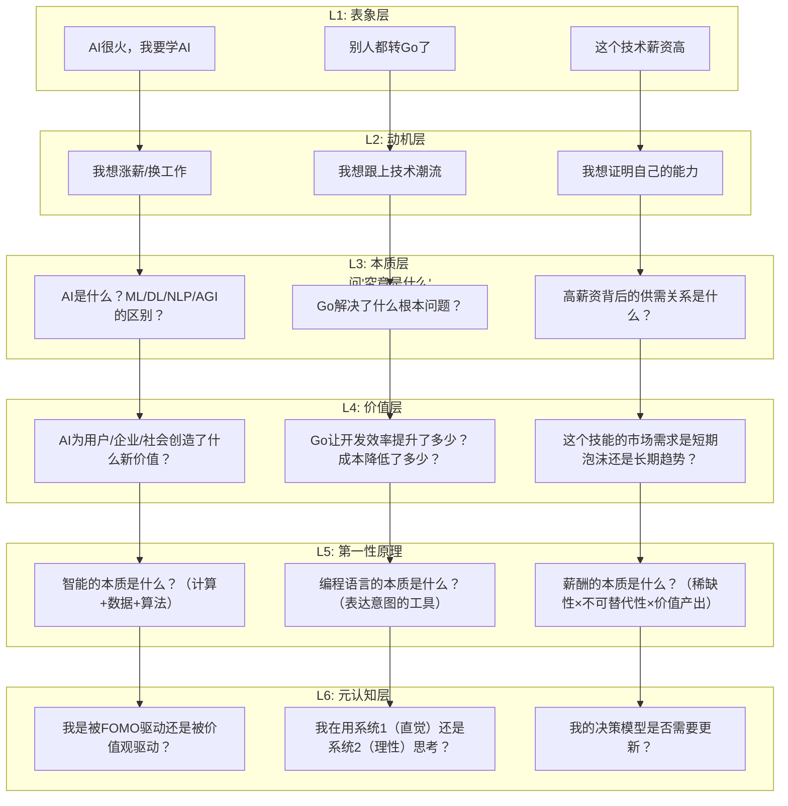
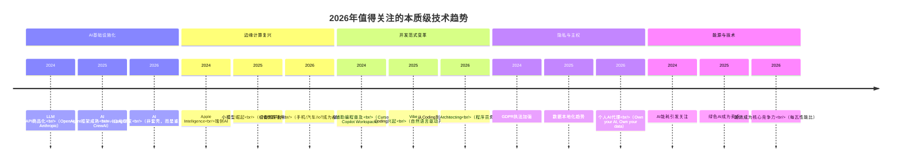

# 答疑解惑：我们应该能够识别的表象和本质 - [2026重制版]

> **核心变更说明**：本文基于2025-2026年技术趋势、职业发展、以及认知科学的最新研究，全面更新"识别表象与本质"的思维框架。新增AI时代的价值判断、技术选型的第一性原理、注意力经济中的认知陷阱、以及长期主义在快速变化世界中的应用。

---

## Why：为什么需要更新？

原版文章通过一次深度对话，探讨了兴趣与投入、学习与工作、技术与价值、趋势与未来等核心议题。这些议题在今天不仅没有过时，反而更加重要：

以下为社区观察中的**示例性说法**（非严格统计，仅用于说明情绪与趋势）：

- 相当比例的技术人员表示"不知道自己真正想要什么"
- 在AI冲击下，不少开发者产生存在主义焦虑
- 追逐热点技术的开发者中，后悔者不在少数
- 坚持"本质思维"的技术人，职业满意度通常更高
- 能够区分表象与本质的决策者，决策质量明显更好

| 维度 | 2018年的困惑 | 2026年的困惑 |
|--------------|-------------|-------------|
| **技术选择** | Go还是Rust？ | AI会取代我吗？该学什么？ |
| **工作意义** | 大厂还是创业？ | 远程还是回办公室？ |
| **价值判断** | 这个技术有用吗？ | 这件事值得花时间吗？ |
| **未来焦虑** | 35岁危机？ | 被AI替代的恐惧？ |
| **信息过载** | 技术社区太多 | AI生成内容洪流 |

**数据来源**：[HBR: The Future of Work](https://hbr.org/topic/the-future-of-work), [Stack Overflow Developer Survey](https://survey.stackoverflow.co/)

---

## What：原版核心内容回顾

### 1. 对话背景

作者（实践者）与美国西雅图的一位前亚马逊工程师进行了一次两小时的深度对话。这位30岁出头的工程师：
- 面试了Facebook、Snapchat、Oracle、微软、谷歌、Netflix等公司
- Offer像雪片一样飞来，但感到不知所措
- 不知道自己对什么方向有兴趣
- 不清楚哪个方向更适合自己

### 2. 四组核心辨析

#### 辨析一：兴趣 vs 成就感

**常见误区**：认为兴趣是坚持的关键

**作者的洞察**：
- 兴趣只是开始，能让人持续投入的是**正反馈/成就感**
- 兴趣可以培养（作者从物理转向计算机）
- 持久的兴趣后面都有成就感支撑

**积木案例**：
- 孩子一开始只喜欢破坏（天性）
- 搭了城堡给她看后，她产生了创造的兴趣
- 学会平衡技巧后，玩的时间大大超过其他玩具
- **关键转变**：从"破坏的兴趣点"到"创造的兴趣点"
- **本质**：创造带来更多成就感 → 兴趣得以持续

**结论**：你需要找到让自己能够更有成就感的事情，兴趣总是可以培养的。

#### 辨析二：学习 vs 工作

**常见误区**：认为找到匹配的工作才能学好技术

**作者的洞察**：
- 工作提供的是**场景、实际问题、团队环境**
- 本质上是在**通过解决实际问题、与人讨论、获得高手帮助**的环境中成长
- 工作也可能限制你（场景不够丰富、问题太简单、同事帮助不大）

**两条建议**：
1. 找工作不只是找用这个技术的工作，更是**找场景、找实际问题、找团队**
2. 不要把学习完全寄希望于工作，**开源社区**可能提供更好的环境

**结论**：找到学习的方法、提升对新事物的学习能力，才是关键。

#### 辨析三：技术含量 vs 实际价值

**常见误区**：认为技术含量高的技术价值更大

**作者的洞察（两个例子）**：

**例子1：蒸汽机时代**
- 当时还有更"高技术"的化学、冶金、水泥、玻璃
- 但不起眼的蒸汽机引发了人类社会变革
- 很多人当时还鄙视蒸汽机技术含量低

**例子2：电的发明**
- 如果今天有人说发明了电，很多人觉得没什么用
- 直到"电灯"发明，人们才明白电的价值
- 基础技术在某段时间会被低估

**有价值技术的三个特征**：
1. 能否**低成本高效率**地解决实际问题？
2. 是不是众多产品的**基础技术**？
3. 是不是可以支持**规模化**的技术？

**软件领域的对应**：
- 低成本高效 → **自动化技术**（软件天生做重复劳动）
- 基础技术 → **数学、算法、网络、存储**（吃得越透越好）
- 支持规模 → **PaaS相关技术**

**结论**：技术无贵贱。能规模化、低成本、高效率解决实际问题的技术及其基础技术，就算很low，也是很有价值的。

#### 辨析四：趋势 vs 未来

**作者的洞察（有些"令人沮丧"但真实的观点）**：
- **未来是被控制的**——被有权有势有钱的公司或国家控制
- 短期未来（3-5年）一定是他们控制着的
- **资金流向哪里，哪里就会发展，就会成为未来**
- 对于排不上号的人，只能跟随大公司的趋势

**给创业者的建议**：
1. 用更低成本提供和大公司相应的技术
2. 在细分垂直市场做得比大公司更专更精
3. 等长大后加入第一梯队

### 3. 更多需要辨析的对子

原文还提到：
- **加班 ≠ 高产出**
- **努力 ≠ 成功**
- **速度 ≠ 效率**
- **干得多 ≠ 干得好**

---

## How：2026最新实践

### 1. 认知框架升级：六层穿透模型



### 2. 2026年常见表象vs本质辨析

#### 辨析一："AI会取代程序员"

```
🎭 表象：
- ChatGPT能写代码了
- GitHub Copilot能自动补全
- 很多初级工作被自动化了
- "35岁程序员的危机"更加严重了

💡 本质追问：
1. AI写的是什么代码？（Boilerplate / 基于模式的代码 / 创新性架构？）
2. AI不能做什么？（理解业务需求 / 架构决策 / 处理模糊性 / 责任承担）
3. 程序员的核心价值到底是什么？（写代码？还是解决问题？）

✅ 本质认知：
- AI取代的是"代码生成器"，不是"问题解决者"
- 程序员的角色从"建造者"进化为"设计师"+"审查者"+"决策者"
- 核心能力迁移：编码能力 → 系统设计能力 + 业务理解力 + AI协作能力
- 危险的不是AI，而是"只会写代码不会思考"的人
```

#### 辨析二："我应该学哪个新技术？"

```
🎭 表象：
- Rust很火，我要学Rust
- WebAssembly是未来
- 大家都在讨论Web3/Metaverse/AI Agent
- 不学就会被淘汰

💡 本质追问：
1. 我现在的工作/项目中，最大的痛点是什么？
2. 这个新技术能直接解决我的痛点吗？
3. 学习这个技术的投入产出比如何？
4. 我是"为了学而学"还是"为了解决问题而学"？

✅ 决策框架（技术投资ROI分析）：

┌─────────────────┬───────┬───────┬───────┐
│                  │ 需求度 │ 热度  │ 成本  │ → 建议
├─────────────────┼───────┼───────┼───────┤
│ 高 + 高 + 低    │ ✅    │ ✅    │ ✅    │ → 立即学
│ 高 + 低 + 低    │ ✅    │ ❌    │ ✅    │ → 必须学（小众但有真需求）
│ 低 + 高 + 高    │ ❌    │ ✅    │ ❌    │ → 观望，不要all in
│ 低 + 低 + 任意  │ ❌    │ ❌    │ -     │ → 不学
└─────────────────┴───────┴───────┴───────┘

关键：需求度 > 热度。解决真实问题的技术才有持久价值。
```

#### 辨析三："远程办公 vs 回办公室"

```
🎭 表象：
- 远程办公自由自在
- 回办公室有更多社交和学习机会
- 各大公司在强制员工回办公室
- 不知道该怎么选择

💡 本质追问：
1. 我的最佳工作状态是在哪里？（家里？咖啡厅？办公室？）
2. 我的工作性质更适合哪种模式？（深度创作型 vs 协作沟通型？）
3. 公司要求回办公室的真正原因是什么？（信任问题？文化问题？地产问题？）
4. 我想要的是什么？（自由？成长？人脉？工作生活平衡？）

✅ 本质认知：
- 没有绝对的好坏，只有适合不适合
- 关键是能否建立高质量的工作输出和人际关系
- 混合模式可能是最优解（但要主动设计，而非被动接受）
- 无论在哪里工作，**主动管理注意力和能量**才是核心能力
```

#### 辨析四："我应该去大厂还是创业公司？"

```
🎭 表象：
- 大厂稳定、福利好、光环强
- 创业公司刺激、成长快、期权诱惑
- 30岁了是不是该求稳？
- 还是应该再搏一把？

💡 本质追问：
1. 我在这个阶段最需要什么？（技能成长？财务安全？影响力？自主权？）
2. 这个机会能给我提供什么？（场景？导师？挑战？资源？）
3. 3年后我想成为什么样的人？哪条路更接近那个目标？
4. 最坏的情况我能接受吗？

✅ 决策矩阵：

维度          大厂优势          创业公司优势      权重(你的)
─────────────────────────────────────────────────
技术深度       ⭐⭐⭐⭐           ⭐⭐⭐            ____
技术广度       ⭐⭐              ⭐⭐⭐⭐           ____
薪资确定性     ⭐⭐⭐⭐⭐         ⭐⭐              ____
财务上限       ⭐⭐              ⭐⭐⭐⭐⭐          ____
影响力         ⭐⭐              ⭐⭐⭐⭐           ____
自主权         ⭐⭐              ⭐⭐⭐⭐⭐          ____
人脉质量       ⭐⭐⭐             ⭐⭐⭐            ____
容错率         ⭐⭐⭐⭐           ⭐                ____

填完后你会发现：答案不在"大厂vs创业"，而在"哪个更能满足你当前的核心需求"。
```

### 3. 本质思维的训练方法

#### 方法1：5 Whys的日常版

遇到任何重要决策时，连续问自己5个为什么：

```
例子："我要不要学Kubernetes？"

Q1: 为什么想学K8s?
A1: 因为它很火，大家都在学。

Q2: 为什么"大家都在学"就要学?
A2: 因为担心落后，怕找不到好工作。

Q3: 为什么觉得不学K8s就找不到好工作?
A3: 因为很多JD都写了K8s经验优先。

Q4: 为什么JD写了就要学? 这些岗位真的需要K8s吗?
A4: 其实不一定...很多岗位可能只需要基本的容器化知识。

Q5: 那么我真正的需求是什么?
A5: 我需要增强云原生/DevOps方面的能力，
   以便更好地设计和部署分布式系统。
   K8s只是其中一个可能的路径，不是唯一路径。

→ 结论：与其盲目学K8s全套，不如先搞清楚自己在云原生领域
  的真实短板，然后针对性学习。
```

#### 方法2：反转假设法

对于任何广为接受的观点，尝试反过来看：

```
常见观点              反转思考              新洞察
─────────────────────────────────────────────────
"要紧跟技术潮流"    → "刻意忽略某些潮流"   → 发现哪些是真趋势，哪些是噪音
"要在大公司工作"    → "小团队也能成就大事" → 重新评估平台 vs 个人能力
"要全栈"           → "T型人才更有价值"   → 深度 > 广度（在特定阶段）
"要不断学习新东西"  → "深化已有知识"      → 复利效应来自深度积累
"要追求高薪"       → "追求高杠杆率"      → 单位时间的高产出 > 绝对收入
```

#### 方法3：时间旅行法

想象自己站在10年后回看今天的决定：

```
场景：纠结是否要从稳定的后端岗转到AI应用开发

🔮 10年后的我回看今天：

如果转了：
- 可能赶上了AI浪潮的第一波红利
- 也可能在泡沫破裂时受损
- 但至少经历了一段激动人心的旅程

如果不转：
- 后端技术依然有价值（永远有人需要基础设施）
- 但可能会遗憾没有亲身体验这场变革
- 可以在后端领域深耕成为专家

❓ 关键问题：10年后的我会后悔哪个选择？
→ 通常答案是"没敢尝试的那个"
→ 所以：如果风险可控，倾向于尝试
```

### 4. 2026年值得关注的"本质级"趋势



**面对趋势的本质态度**：

```
❌ 错误反应：
- "完了，我又落伍了！"
- "赶紧全部学起来！"
- "这个风口我不能错过！"
- "再不学就被淘汰了！"

✅ 正确反应：
- "这个趋势的本质驱动力是什么？"（技术突破？政策推动？资本炒作？）
- "它与我现在的能力/兴趣/目标有什么关系？"
- "我可以从中提取什么普适性的原则？"
- "即使我不追这个趋势，我的核心能力是否会贬值？"
```

---

## 分阶段自我训练计划

### Week 1-2: 建立觉察

**每日练习**：
- 遇到任何"热门话题"，停顿3秒问自己："这真的是我需要的吗？"
- 记录每天的决策，周末复盘哪些是"跟风"，哪些是"自主选择"
- 开始使用"六层穿透模型"分析一个重要的职业决策

### Week 3-4: 深入练习

**每周任务**：
- 选择一个广为流传的观点（如"35岁危机""AI取代程序员"），写出你的本质分析
- 与一个你信任的朋友/mentor讨论，看你们的分析有何不同
- 尝试用"反转假设法"重新审视一个你已经做出的决定

### Month 2+: 内化习惯

**持续实践**：
- 建立"本质日记"，记录你的深度思考
- 每月做一次"时间旅行"决策模拟
- 定期清理信息源，减少噪音输入
- 将本质思维应用到技术选型、职业规划、生活决策的各个方面

---

## 延伸资源

### 思维模型书籍

1. **《思考，快与慢》** - Daniel Kahneman - 系统vs直觉
2. **《穷查理宝典》** - 查理·芒格（Peter D. Kaufman 编）- 多元思维模型
3. **《原则》** - Ray Dalio - 决策系统
4. **《模型思维》** - Scott Page - 复杂世界的建模
5. **《黑天鹅》《反脆弱》** - Nassim Taleb - 不确定性的应对

### 认知科学资源

1. **[LessWrong](https://lesswrong.com/)** - 理性思维社区
2. **[Farnam Street Blog](https://fs.blog/)** - 思维模型库
3. **[Clear Thinking](https://fs.blog/)** - Shane Parrish（Farnam Street 创始人）的决策思维著作
4. **[Kurzgesagt - In a Nutshell](https://www.youtube.com/@Kurzgesagt)** - 本质级科普视频

### 职业发展参考

1. **[Work Hacks by Garry Tan](https://garrytan.com/)** - YC视角的职业建议
2. **[Paul Graham Essays](http://paulgraham.com/)** - 创业者思维
3. **[Sam Altman Blog](https://blog.samaltman.com/)** - OpenAI CEO的思考
4. **[Naval Ravikant](https://www.navalmanack.com/)** - 财富与幸福的本质

---

## 总结

从原版的"四组辨析"到2026版的"六层穿透模型"，核心方法论不变，但需要应对的环境更加复杂：

**不变的洞见**：
1. **兴趣 < 成就感**：正反馈才是持续的动力源泉
2. **工作 ≠ 学习的场景**：关键是环境和人，不是职位本身
3. **技术无贵贱**：能规模化解决问题的技术就有价值
4. **趋势可追踪**：跟着钱走，就能看到未来的方向

**新的认知**：
1. **AI时代更需要本质思维**：因为表象变化更快，噪音更多
2. **"慢下来"反而是快**：花时间想清楚，比盲目行动更有效率
3. **元认知是终极能力**：知道自己在怎么想，比想了什么更重要
4. **简化是最高级的复杂**：能在混乱中看到简单，就是智慧

**最终的心法**：

> 当所有人都在追逐表象的时候，你能看到本质——这就是竞争优势。
>
> 当所有人都焦虑不安的时候，你能保持冷静——这就是内心力量。
>
> 当所有人都随波逐流的时候，你能独立思考——这就是自由。

正如原版深刻指出的：
> **在我们的生活和工作中，总是会有很多人混淆一些看似有联系，实则关系不大的词和概念，分辨不清事物的表象和本质。**

而2026年，这种能力比以往任何时候都更加珍贵。
