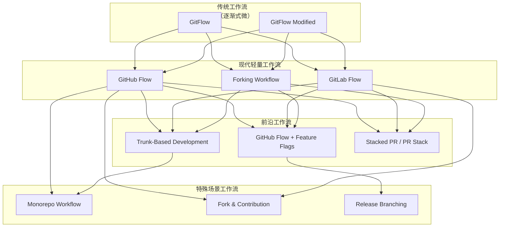
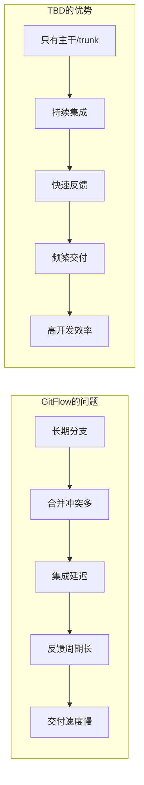
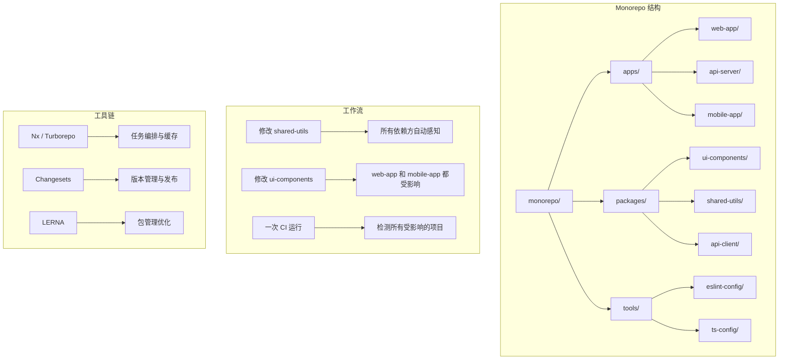
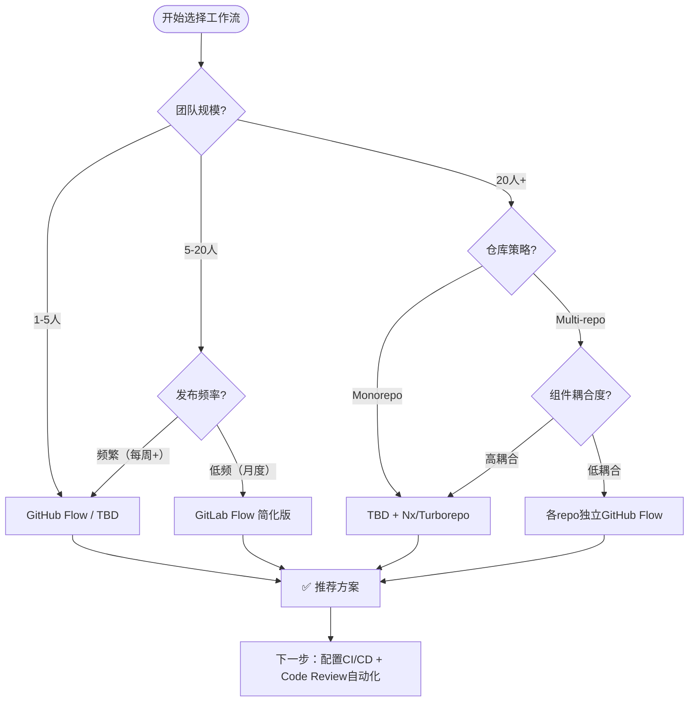

# Git协同工作流，你该怎么选？-[2026重制版]

> **核心变更说明**：本文基于2025-2026年Git生态、DevOps实践、以及分布式团队协作的最新发展，全面更新Git工作流选择指南。新增Trunk-Based Development、GitHub Actions原生CI/CD、Monorepo工具链、以及AI辅助Code Review等现代实践。

---

## Why：为什么需要更新？

原版文章对GitFlow进行了"抨击"，并推荐了更轻量的工作流。2026年的技术环境让这些观点更加成立，同时也带来了新的选择：

以下为行业调研与观察中的**示例性数据**（非官方统计口径，仅用于说明趋势）：

- **绝大多数**开发者使用Git作为版本控制工具
- 相当多团队仍在使用某种变体的GitFlow（尽管很多已简化）
- **Trunk-Based Development**采用率自2018年以来持续上升，已成为高效率团队的常见选择
- **Monorepo**在大型科技公司中广泛使用（Google、Meta等）
- AI Code Review工具能明显缩短Review时间

| 维度 | 2018年 | 2026年 |
|--------|--------|--------|
| **主流工作流** | GitFlow / GitHub Flow | Trunk-Based / GitHub Flow 变体 |
| **代码合并** | 手动PR/MR为主 | 自动化Merge + AI Review |
| **CI/CD** | Jenkins + 脚本 | GitHub Actions / GitLab CI 原生集成 |
| **部署策略** | 按分支发布 | 主干发布 + Feature Flags |
| **仓库策略** | 多Repo为主 | Monorepo趋势明显 |
| **协作规模** | 小团队为主 | 分布式、异步、大规模 |

**数据来源**：[GitHub Blog: The State of Open Source](https://github.blog/category/community/), [GitLab Developer Survey](https://about.gitlab.com/developer-survey/), [Trunk Based Development Resources](https://trunkbaseddevelopment.com/)

---

## What：原版核心内容回顾

### 1. Git的核心优势

- **分布式**：无网络也能commit
- **完整历史**：每次合并保留所有提交记录
- **快速切换**：不需要每个分支一份拷贝
- **强大命令集**：`git stash`, `git cherry-pick`, `git add -p`, `git grep`等

### 2. 三种基础工作流

#### 中心式工作流
```
pull → commit → push (冲突时 pull --rebase)
```
- 适合小团队/小项目
- 问题：主干开发干扰严重

#### 功能分支工作流
```
checkout -b feature → 开发 → push → PR → 合并到master
```
- 隔离不同功能的代码
- 推荐"功能分支"而非"项目分支"
- 理由：短生命周期，减少冲突

#### GitFlow工作流（作者不推荐）
- **5种分支**：Master, Develop, Feature, Release, Hotfix
- 问题：
  - 分支太多，git log混乱
  - `--no-ff`导致历史线复杂
  - 同时维护Master和Develop很无聊
  - 回滚困难

### 3. GitHub/GitLab Flow

**GitHub Flow**（推荐）：
- 从官方库fork或直接建分支
- 本地开发 → push到自己的库/fork
- 发起PR → Code Review → 合并到Master
- Master随时可release

**GitLab Flow**（改进）：
- 引入环境分支（Pre-Production, Production）
- 引入版本稳定分支（2.3.stable, 2.4.stable）
- 解决了环境和版本的对应问题

### 4. 核心结论

> **协同工作流的本质，并不是怎么玩好代码仓库的分支策略，而是玩好我们的软件架构和软件开发流程。**

与其花时间在Git工作流上，不如把时间花在：
- **调整软件架构**（微服务化/SOA）
- **自动化软件生产和运维流程**（DevOps）

---

## How：2026最新实践

### 1. 2026年工作流全景图



### 2. Trunk-Based Development（TBD）详解

**为什么TBD在2026年成为主流？**



**TBD核心原则**：

```yaml
# trunk_based_development.yaml
# TBD核心规则

principles:
  # 规则1：主干始终可发布
  trunk_always_deployable:
    description: "trunk/main分支的代码必须随时可以部署到生产环境"
    enforcement:
      - CI必须全部通过才能合并
      - 必须有至少1个Approval
      - 必须通过自动化测试（单元+集成+E2E）

  # 规则2：短生命周期分支
  short_lived_branches:
    max_lifetime_hours: 24      # 分支存在不超过1天
    max_commits: 10             # 不超过10个commit
    ideal_commits: 1            # 最佳：1个commit完成一个feature
    rationale: "分支越短，冲突越少，集成越快"

  # 规则3：持续集成
  continuous_integration:
    frequency: "每次push触发CI"
    feedback_time_target_minutes: 15  # 目标15分钟内得到CI结果
    test_coverage_threshold: 80     # 新增代码覆盖率不低于80%

  # 规则4：Feature Flags管理未完成的功能
  feature_flags:
    usage: "将未完成的代码合入主干，通过开关控制是否对用户可见"
    tools:
      - LaunchDarkly
      - Unleash
      - Optimizely
      - 自实现（基于配置中心）
    types:
      release_flags: "发布开关（控制新版本灰度）"
      experiment_flags: "实验开关（A/B测试）"
      ops_flags: "运维开关（限流、降级）"
      permission_flags: "权限开关（功能访问控制）"

# TBD工作流示例
workflow:
  step_1:
    action: "从trunk拉取最新代码"
    command: "git checkout main && git pull"

  step_2:
    action: "创建短命分支"
    command: "git checkout -b feature/user-auth-oauth2"
    note: "分支名以feature/fix/hotfix/chore开头"

  step_3:
    action: "开发和提交（尽量少次数）"
    best_practice: |
      完成一个小的、完整的改动
      不要WIP（Work In Progress）提交
      如果改动大，拆分成多个独立的PR

  step_4:
    action: "Push并创建PR"
    command: "git push origin feature/user-auth-oauth2"
    automation: "自动创建Draft PR或直接打开PR"

  step_5:
    action: "CI自动运行"
    checks:
      - Lint检查
      - Unit Tests
      - Integration Tests
      - Security Scan (SAST/DAST)
      - Build Verification

  step_6:
    action: "Code Review"
    reviewers: "至少1人，可以是AI辅助"
    criteria:
      - 逻辑正确性
      - 测试覆盖
      - 性能影响评估
      - 安全性审查

  step_7:
    action: "合并到主干"
    method: "Squash Merge（推荐）或 Rebase Merge"
    automation: "合并后自动触发部署pipeline"

  step_8:
    action: "删除远程分支"
    cleanup: "保持仓库整洁"
```

**TBD vs GitFlow 对比表**：

| 维度 | GitFlow | Trunk-Based |
|------|---------|-------------|
| **分支数量** | 多（5种以上） | 少（主要是feature分支） |
| **分支寿命** | 长（天/周/月） | 短（小时，<1天最佳） |
| **集成频率** | 低（按release周期） | 高（每天多次） |
| **冲突概率** | 高 | 低 |
| **发布节奏** | 按计划（版本驱动） | 随时（功能就绪即发布） |
| **回滚难度** | 中（回滚分支） | 需要Feature Flags配合 |
| **适合场景** | 复杂发布流程、多版本并行 | 快速迭代、CI/CD成熟、小团队 |
| **学习曲线** | 高 | 低 |

### 3. GitHub Flow 2026增强版

```yaml
# github_flow_enhanced.yaml
# 适用于大多数团队的GitHub Flow配置

repository_settings:
  protection_rules:
    main_branch:
      required_status_checks:
        strict: true          # PR必须基于最新的main
        contexts:
          - ci/lint
          - ci/test-unit
          - ci/test-integration
          - ci/test-e2e
          - security/sast
          - security/dependencies
      required_pull_request_reviews:
        dismiss_stale_reviews: true   # 新push后重新review
        require_code_owner_review: false  # 可选：要求代码owner review
        required_approving_review_count: 1
      bypass_pull_request_allowances: []  # 谁可以跳过review（通常为空）

branch_protection:
  - pattern: "main"
    required_status_checks: [see above]
    enforce_admins: true              # 管理员也遵守规则
    allow_force_pushes: false         # 禁止force push到main
    allow_deletions: false            # 禁止删除main

automations:
  on_pull_request:
    - action: "auto-assign-reviewer"
      config:
        strategy: "round-robin"       # 或 "random", "load-balanced"
        exclude_author: true           # 不分配给作者自己
        max_reviewers: 2

    - action: "add-labels-based-on-files"
      config:
        "*.py": ["python", "backend"]
        "*.tsx": ["typescript", "frontend"]
        "Dockerfile*": ["devops", "infrastructure"]

    - action: "ai-code-review"
      tool: "GitHub Copilot Code Review"  # 或其他AI Review工具
      config:
        focus_on:
          - potential_bugs
          - security_issues
          - performance_antipatterns
          - code_style_violations
        language: "zh-CN"               # Review语言

  on_merge:
    - action: "delete-branch"
      config:
        except_branches: ["main", "develop", "staging-*"]

    - action: "trigger-deployment"
      config:
        environment: "staging"          # 先发staging验证
        auto_production: false            # 生产需手动确认

    - action: "update-documentation"
      config:
        generate_changelog: true
        update_api_docs: true

code_review_guidelines:
  checklist:
    - "代码逻辑正确且符合需求？"
    - "有足够的单元测试覆盖新增/修改的逻辑？"
    - "没有引入安全漏洞？（依赖版本、敏感信息硬编码等）"
    - "没有明显的性能问题？（N+1查询、内存泄漏等）"
    - "错误处理完善？（边界条件、异常情况）"
    - "日志和监控埋点充分？"
    - "代码风格一致？（命名、结构、注释）"

  response_sla:
    normal_pr: "24小时内首次响应"
    urgent_pr: "4小时内首次响应"
    blocking_pr: "1小时内响应"
```

### 4. Monorepo 工作流



**Monorepo 配置示例（Nx）**：

```json
// nx.json
{
  "$schema": "./node_modules/nx/schemas/nx-schema.json",
  "namedInputs": {
    "default": ["{projectRoot}/**/*.ts", "{projectRoot}/**/*.tsx"],
    "production": [
      "default",
      "!{projectRoot}/**/*.spec.ts",
      "!{projectRoot}/**/*.test.tsx"
    ]
  },
  "targetDefaults": {
    "build": {
      "dependsOn": ["^build"],
      "inputs": ["production"],
      "cache": true
    },
    "test": {
      "inputs": ["default", "^production"],
      "cache": true
    },
    "lint": {
      "inputs": ["default"]
    }
  },
  "tasksRunnerOptions": {
    "default": {
        "runner": "nx/tasks-runners/default",
        "options": {
          "cacheableOperations": ["build", "test", "lint", "e2e"]
        }
      }
  },
  "affected": {
    "defaultBase": "main"
  },
  "workspaceLayout": {
    "appsDir": "apps",
    "libsDir": "packages"
  },
  "generators": {
    "@nx/react:library": {
      "buildable": true,
      "publishable": true,
      "importPath": "@myorg/shared-{name}"
    }
  }
}
```

**Monorepo 工作流命令**：

```bash
# 只构建受影响的项目
nx affected --target=build

# 只测试受影响的项目
nx affected --target=test

# 查看受本次变更影响的项目列表
nx show projects --affected

# 图形化查看依赖关系
nx graph

# 一次性运行多个项目的任务
nx run-many -t build -p web-app api-server mobile-app
```

### 5. AI辅助Code Review

```yaml
# ai_code_review_config.yaml
# AI Code Review 配置

providers:
  openai:
    model: "gpt-4o"
    system_prompt: |
      你是一个资深代码审查员。请从以下维度审查代码：
      1. 正确性：逻辑是否正确？是否有bug？
      2. 安全性：是否有安全风险？
      3. 性能：是否有明显的性能问题？
      4. 可维护性：代码是否清晰易懂？
      5. 测试：测试覆盖是否充分？

      请用中文回复，格式如下：
      ✅ 做得好的地方：...
      ⚠️ 需要注意的地方：...
      ❌ 建议修改的地方：...

  github_copilot:
    enabled: true
    instructions: |
      - 关注业务逻辑正确性
      - 检查潜在的空指针/越界访问
      - 建议更Pythonic/Rustacean/Idiomatic的写法

  custom_rules:
    - name: "no-hardcoded-secrets"
      pattern: "(password|secret|api_key)\s*=\s*[\"'][^\"']+[\"']"
      severity: "error"
      message: "检测到可能的硬编码密钥，请使用环境变量或密钥管理服务"

    - name: "require-error-handling"
      pattern: "(fetch|axios|request)\("
      check: "后续代码是否包含 .catch( 或 try-catch"
      severity: "warning"
      message: "异步请求缺少错误处理"

review_workflow:
  trigger: "on_pull_request_opened, on_pull_request_synchronize"

  phases:
    - name: "automated_checks"
      actions:
        - run_linter
        - run_unit_tests
        - run_security_scan
        - check_dependencies_vulnerabilities
      timeout: 10min

    - name: "ai_initial_review"
      actions:
        - ai_analyze_diff
        - generate_suggestions
      runs_on: "bot_account"
      timeout: 5min

    - name: "human_review"
      assignees: "auto-selected based on CODEOWNERS file or round-robin"
      requirements:
        - at_least_one_approval
        - no_outstanding_change_requests
      timeout: 48h  # 给人类 reviewer 足够时间

    - name: "ai_final_check"
      trigger: "before_merge"
      actions:
        - verify_all_comments_addressed
        - check_for_regressions
      auto_approve_if: "all automated checks pass AND all suggestions addressed"

output_format:
  inline_comments: true          # 在代码行旁边评论
  summary_comment: true          # PR总体评价
  severity_emoji: true           # 用emoji标识严重程度
  actionable_only: true           # 只给出可操作的建议
```

### 6. 工作流选择决策树



**快速选择指南**：

| 团队特征 | 推荐工作流 | 关键配置 |
|---------|-----------|---------|
| **初创团队（<10人）** | GitHub Flow | 严格Branch Protection，自动CI |
| **快速迭代产品团队** | TBD + Feature Flags | 主干发布，FF控制功能可见性 |
| **平台/基础设施团队** | TBD + Monorepo | Nx/Turborepo，共享代码 |
| **多产品线大团队** | GitLab Flow简化版 | 环境分支，但减少层次 |
| **开源项目** | GitHub Fork + PR | 社区贡献友好 |
| **合规要求高的金融/医疗** | GitFlow精简版 | 完整的审计追踪 |

---

## 分阶段迁移建议

### 从GitFlow迁移到GitHub Flow/TBD

```markdown
## 迁移路线图（建议耗时：2-4周）

### Week 1: 准备阶段
- [ ] 与团队沟通变更原因和收益
- [ ] 更新Branch Protection Rules
- [ ] 配置CI/CD pipeline（确保质量门禁）
- [ ] 选择试点项目/团队

### Week 2: 试点阶段
- [ ] 试点团队切换到新模式
- [ ] 收集反馈和问题
- [ ] 调整配置和流程
- [ ] 编写新的Team Handbook

### Week 3: 全面推广
- [ ] 全团队培训新工作流
- [ ] 清理旧的长期分支
- [ ] 建立Feature Flags机制（如需要）
- [ ] 监控关键指标（合并频率、CI通过率、部署频率）

### Week 4+: 优化阶段
- [ ] 引入AI Code Review
- [ ] 优化CI速度（缓存、并行化）
- [ ] 定期Review工作流效果
- [ ] 持续改进
```

---

## 延伸资源

### 官方文档

1. **[GitHub Flow](https://docs.github.com/en/get-started/quickstart/github-flow)** - GitHub官方指南
2. **[GitLab Flow](https://docs.gitlab.com/ee/topics/gitlab_flow.html)** - GitLab官方文档
3. **[Trunk Based Development](https://trunkbaseddevelopment.com/)** - TBD权威资源站
4. **[Nx Documentation](https://nx.dev/)** - Monorepo工具链
5. **[Turborepo Docs](https://turbo.build/repo/docs)** - 高性能Monorepo构建系统

### 深度阅读

1. **《Continuous Delivery》** - Jez Humble - DevOps圣经
2. **《Team Topologies》** - Matthew Skelton - 团队结构设计
3. **[A Successful Git Branching Model](https://nvie.com/posts/a-successful-git-branching-model/)** - Vincent Driessen的原始GitFlow文章（了解即可，不必照搬）
4. **[Why GitFlow Doesn't Work for Us](https://luci.criosweb.ro/a-real-life-git-workflow-why-git-flow-does-not-work-for-us/)** - GitFlow批评文章合集

### 工具推荐

| 类别 | 工具 | 适用场景 |
|------|------|---------|
| **CI/CD** | GitHub Actions / GitLab CI | 原生集成，零配置起步 |
| **Monorepo管理** | Nx / Turborepo / Lerna | 大型代码库的任务编排 |
| **Feature Flags** | LaunchDarkly / Unleash / Flagr | 功能开关管理 |
| **Code Review** | GitHub Copilot / CodeRabbit / Graphite | AI辅助Review |
| **分支策略执行** | Branch Protector / Policy Bot | 自动化规则执行 |
| **依赖管理** | Dependabot / Renovate | 自动依赖更新 |

---

## 总结

从原版的"抨击GitFlow、推荐GitHub Flow"到2026版的"Trunk-Based Development成为主流"，核心洞察更加清晰：

**不变的原则**：
1. **简单 > 复杂**：能简化的工作流就不要复杂化
2. **自动化 > 流程**：用工具解决问题，而不是用人来堵流程漏洞
3. **架构决定工作流**：微服务化 + DevOps = 可以用更简单的工作流
4. **文化 > 工具**：再好的工具也需要配合正确的文化（Code Review习惯、质量意识）

**新的认知**：
1. **TBD是必然趋势**：CI/CD成熟度和部署能力是前提
2. **Feature Flags是TBD的基石**：没有FF就无法真正做到"主干可发布"
3. **Monorepo vs Multi-Repo不是二选一**：取决于团队规模和产品形态
4. **AI正在改变Code Review**：但人类的判断力仍然不可替代
5. **工作流应该适配团队**，而不是团队适应工作流

**最终结论（与原版一致，但更强）**：

> **协同工作流的本质，并不是怎么玩好代码仓库的分支策略，而是玩好我们的软件架构和软件开发流程。**

而在2026年，这句话的后半句可以扩展为：

> **而是玩好我们的软件架构、开发流程、工程文化、以及——最重要的——人对代码质量的共同守护。**

选择什么工作流不重要，重要的是：
- **每个人都能理解并遵守**
- **工具能够强制执行规则**
- **质量内建于流程之中**
- **持续优化和演进**

这就是2026年Git协同工作流的终极答案。
