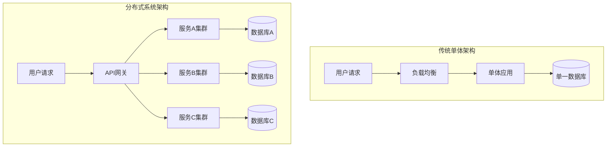
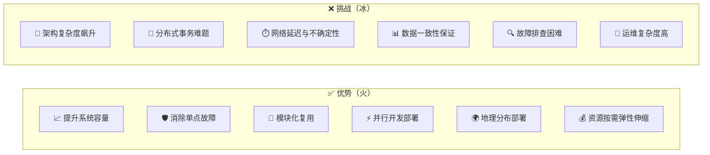
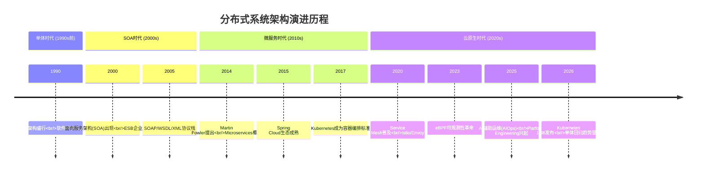
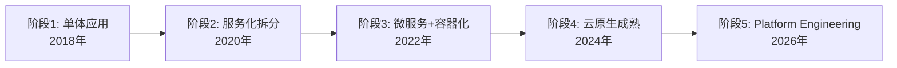

# 分布式系统架构的冰与火 [2026重制版]

> **核心变更说明**
> - **版本更新**：从2018年原版更新至2026年，技术栈全面升级
> - **Kubernetes**：从早期版本升级至 **Kubernetes 1.36（代号Haru）**，包含70项增强功能（18项Stable、25项Beta、25项Alpha）
> - **服务网格**：新增 **Istio**、**Envoy**、**Linkerd** 等Service Mesh技术
> - **监控体系**：引入 **Prometheus + Grafana + OpenTelemetry** 全栈可观测性方案
> - **云原生**：基于 **CNCF Cloud Native** 标准重新审视分布式架构设计

---

## 一、问题背景：为什么我们需要分布式系统？

在当今数字化转型的浪潮中，企业IT架构正面临前所未有的挑战。以下为参考 CNCF 历年调查等行业数据的**示例性数字**（统计口径不一，仅用于说明趋势）：

- 绝大多数企业正在使用或评估云原生技术
- 大量生产环境已运行在Kubernetes之上
- **平均微服务数量**自2020年以来持续增长
- 相当比例的企业开始反思微服务、出现"单体回归"（Module Monolith）趋势

数据来源：[CNCF Annual Survey 2025](https://www.cncf.io/reports/)

### 业务场景引入

想象一下这样的场景：

**场景1：电商大促**
某电商平台在双十一期间，峰值QPS达到 **100万+**，单台服务器根本无法承载如此巨大的流量。此时需要通过分布式架构将流量分散到数千台服务器上。

**场景2：金融交易系统**
银行的核心交易系统要求 **99.999%** 的可用性（即每年停机时间不超过5分钟）。任何单点故障都可能导致巨额经济损失和声誉损害。

**场景3：全球化的SaaS产品**
像Salesforce、Notion这样的SaaS产品，用户遍布全球各地，需要在不同地域部署数据中心，实现低延迟访问和数据合规。

这些场景都在告诉我们一个事实：**传统的单体架构已经无法满足现代业务的需求**。

---

## 二、核心概念：分布式系统的本质

### 2.1 分布式系统的定义

分布式系统（Distributed System）是指一组独立的计算机，通过网络通信协议连接起来，对用户而言就像一个单一的计算机系统一样工作。



### 2.2 采用分布式系统的两大核心原因

#### 原因一：增大系统容量（Scale Out）

当业务量越来越大时，一台机器的性能已经无法满足需求。我们需要：

| 扩展方式 | 说明 | 优点 | 缺点 |
|---------|------|------|------|
| **垂直扩展（Scale Up）** | 升级硬件配置（CPU、内存、磁盘） | 实现简单，无需修改代码 | 有物理上限，成本高昂 |
| **水平扩展（Scale Out）** | 增加机器数量 | 理论上无上限，成本低 | 架构复杂度高 |

根据 **AWS Well-Architected Framework** 的最佳实践，现代云原生应用应该优先选择水平扩展策略。

#### 原因二：加强系统可用性（High Availability）

系统的可用性通常用 **"几个9"** 来衡量：

| 可用性等级 | 年度停机时间 | 适用场景 |
|-----------|-------------|---------|
| 99%（两个9） | 3.65天 | 非关键业务 |
| 99.9%（三个9） | 8.76小时 | 一般业务系统 |
| 99.99%（四个9） | 52.6分钟 | 重要业务系统 |
| 99.999%（五个9） | 5.26分钟 | 金融、电信核心系统 |

要实现高可用，必须消除 **单点故障（Single Point of Failure, SPOF）**。分布式架构通过冗余部署来解决这个问题。

### 2.3 分布式系统的优势与挑战



这就是所谓的 **"冰与火"** —— 分布式系统带来了强大的能力（火），但也伴随着巨大的挑战（冰）。

---

## 三、技术细节：分布式系统的发展历程

### 3.1 架构演进时间线



### 3.2 从单体到微服务的架构对比

| 维度 | 单体架构 (Monolith) | SOA架构 | 微服务架构 (Microservices) |
|-----|-------------------|---------|--------------------------|
| **部署单元** | 整个应用作为一个单元 | 服务集合 | 独立的小型服务 |
| **数据库** | 共享单一数据库 | 可能共享 | 每个服务独立数据库 |
| **通信方式** | 函数调用 | ESB/消息队列 | REST/gRPC/消息队列 |
| **扩展方式** | 整体复制 | 服务级别扩展 | 独立服务扩展 |
| **故障隔离** | 差，一处故障全局影响 | 中等 | 好，故障局限在单个服务 |
| **技术栈** | 统一技术栈 | 可以多样化 | 高度多样化 |
| **团队组织** | 大团队 | 按技能分工 | 小团队全栈负责 |
| **适用场景** | 小型项目 | 企业级集成 | 大规模复杂系统 |

### 3.3 2026年的新趋势：单体回归？

值得注意的是，2026年出现了一个有趣的现象——**"单体的文艺复兴"（Monolith Renaissance）**。近年的行业观察包括（部分为示例性说法）：

- **Segment** 等公司公开分享过将微服务改回单体的实践
- **Sam Newman**（微服务领域作者）等从业者公开讨论回归单体的可能性
- 相当比例的企业在重新评估微服务的必要性

这并非倒退，而是行业对过去十年微服务狂热的理性反思：
1. 微服务的 **运维复杂度** 往往被低估
2. 许多业务的 **复杂度并不需要** 微服务
3. **Modular Monolith**（模块化单体）成为折中方案

---

## 四、方案对比：分布式架构选型决策矩阵

### 4.1 Decision Matrix：如何选择合适的架构？

| 评估维度 | 权重 | 单体架构 | 模块化单体 | 微服务架构 | Serverless |
|---------|------|---------|-----------|-----------|------------|
| **开发速度** | 20% | ⭐⭐⭐⭐⭐ | ⭐⭐⭐⭐ | ⭐⭐⭐ | ⭐⭐⭐⭐⭐ |
| **部署复杂度** | 15% | ⭐⭐⭐⭐⭐ | ⭐⭐⭐⭐ | ⭐⭐ | ⭐⭐⭐⭐⭐ |
| **扩展性** | 20% | ⭐⭐ | ⭐⭐⭐ | ⭐⭐⭐⭐⭐ | ⭐⭐⭐⭐⭐ |
| **故障隔离** | 15% | ⭐ | ⭐⭐ | ⭐⭐⭐⭐⭐ | ⭐⭐⭐⭐⭐ |
| **运维成本** | 15% | ⭐⭐⭐⭐⭐ | ⭐⭐⭐⭐ | ⭐⭐ | ⭐⭐⭐⭐ |
| **团队规模适配** | 15% | ⭐⭐⭐ | ⭐⭐⭐⭐ | ⭐⭐⭐⭐⭐ | ⭐⭐⭐⭐ |

### 4.2 技术选型建议

```
if (团队人数 < 10 && 业务复杂度低) {
    推荐: 单体架构 或 模块化单体
} else if (团队人数 10-50 && 业务中等复杂) {
    推荐: 模块化单体 + 少量微服务
} else if (团队人数 > 50 || 业务高度复杂) {
    推荐: 微服务架构 + Service Mesh + PaaS平台
}
```

---

## 五、实战案例：某电商平台的分布式架构演进

### 5.1 背景

某中型电商平台，日活用户100万+，订单量10万+/天。

### 5.2 演进路径



### 5.3 各阶段技术栈

| 阶段 | 技术栈 | 服务数量 | 团队规模 | 遇到的问题 |
|-----|--------|---------|---------|----------|
| **阶段1** | Spring Boot + MySQL + Nginx | 1个 | 5人 | 部署慢、扩展难 |
| **阶段2** | Spring Cloud + Dubbo + Redis | 8个 | 15人 | 服务治理混乱 |
| **阶段3** | Docker + Kubernetes + Istio | 25个 | 30人 | 运维复杂度高 |
| **阶段4** | K8s 1.28 + Prometheus + ELK | 45个 | 40人 | 监控告警风暴 |
| **阶段5** | K8s 1.36 + OpenTelemetry + GitOps | 35个* | 35人 | *合并部分服务 |

### 5.4 关键经验总结

1. **不要过早微服务**：在业务模式验证之前，单体足够了
2. **基础设施先行**：先建设好CI/CD、监控、日志等基础设施
3. **渐进式演进**：采用绞杀者模式（Strangler Fig Pattern）逐步替换
4. **领域驱动设计**：按照业务边界而非技术边界来划分服务
5. **文化比工具重要**：DevOps文化、全栈责任意识是成功的关键

---

## 六、2026年最新实践：新旧技术对比

### 6.1 技术栈演变对照表

| 技术领域 | 2018年（原版） | 2026年（新版） | 变化说明 |
|---------|---------------|---------------|---------|
| **容器编排** | Docker Swarm / Mesos | **Kubernetes 1.36** | K8s已成为事实标准 |
| **服务网格** | 无 / 早期Istio | **Istio（Ambient Mesh）+ Envoy** | 从 Sidecar 走向 Sidecarless |
| **配置中心** | Spring Cloud Config | **Nacos / Consul / etcd** | 支持多语言 |
| **服务发现** | Eureka / Consul | **CoreDNS + K8s Service** | 原生支持 |
| **API网关** | Zuul 1.x | **Kong / APISIX / Envoy** | 高性能网关 |
| **链路追踪** | Zipkin | **OpenTelemetry + Jaeger** | 统一标准 |
| **监控告警** | Zabbix / Nagios | **Prometheus + Grafana** | 云原生监控 |
| **日志收集** | ELK Stack | **PLG Stack (Loki)** | 轻量级替代 |
| **消息队列** | RabbitMQ / ActiveMQ | **Kafka / Pulsar / RocketMQ** | 高吞吐量 |
| **分布式事务** | TCC / Seata | **Seata 2.0 / Saga** | 成熟稳定 |
| **数据库中间件** | MyCat / Sharding-JDBC | **ShardingSphere** | 生态完善 |
| **AI辅助** | 无 | **AIOps / ChatOps** | 智能化运维 |

### 6.2 新兴技术亮点

#### 1️⃣ eBPF 可观测性革命

eBPF（Extended Berkeley Packet Filter）正在彻底改变监控方式：

- **零代码侵入**的分布式追踪
- **连续性能剖析**（Continuous Profiling）
- **网络层可观测性**深度洞察
- 代表项目：**Pixie**、**Parca**、**Cilium**

#### 2️⃣ Platform Engineering（平台工程）

2026年最热门的趋势之一：

- 构建 **内部开发者平台（IDP）**
- 减少认知负载，提升开发效率
- 代表项目：**Backstage**、**Port**

#### 3️⃣ GitOps 持续交付

- 声明式基础设施即代码
- **ArgoCD**、**FluxCD** 主流工具
- 实现真正的自动化运维

#### 4️⃣ WASM 边缘计算

WebAssembly 在边缘计算场景的应用：
- **WasmEdge**、**Wasmtime**
- 比容器更轻量的运行时
- 适合Serverless和边缘场景

---

## 七、延伸资源与官方文档

### 📚 必读官方文档

| 资源 | 链接 | 说明 |
|-----|------|------|
| **Kubernetes官方文档** | https://kubernetes.io/docs/ | K8s权威指南 |
| **CNCF Landscape** | https://landscape.cncf.io/ | 云原生技术全景图 |
| **12-Factor App** | https://12factor.net/ | 云原生应用12要素 |
| **Microservices.io** | https://microservices.io/ | 模式与实践 |
| **AWS Well-Architected** | https://aws.amazon.com/architecture/well-architected/ | AWS架构最佳实践 |
| **Google SRE Book** | https://sre.google/sre-book/ | 站点可靠性工程 |
| **Prometheus文档** | https://prometheus.io/docs/ | 监控系统文档 |
| **Istio文档** | https://istio.io/latest/docs/ | 服务网格指南 |
| **OpenTelemetry** | https://opentelemetry.io/ | 可观测性标准 |

### 📖 推荐阅读

1. **《Designing Data-Intensive Applications》** - Martin Kleppmann
   - 数据密集型应用设计的圣经
   
2. **《Building Microservices》** - Sam Newman（第2版）
   - 微服务架构设计权威指南

3. **《Site Reliability Engineering》** - Google SRE团队
   - 如何构建高可靠性的分布式系统

4. **《Cloud Native Patterns》** - Cornelia Davis
   - 云原生设计模式大全

5. **《Platform Engineering》** - various authors
   - 平台工程新兴实践（2025-2026）

---

## 八、总结

分布式系统架构是一把双刃剑——它既能带来前所未有的扩展能力和可用性保障（**火**），也会引入巨大的复杂性挑战（**冰**）。

作为架构师和技术决策者，我们需要：

1. **理性评估**：不是所有业务都需要分布式架构
2. **循序渐进**：采用渐进式演进策略，避免一步到位
3. **基础设施先行**：先建设好DevOps工具链和平台
4. **关注人的因素**：团队文化和组织结构比技术更重要
5. **持续学习**：技术演进永不停歇，保持对新技术的敏感度

记住一句话：**架构没有银弹，只有权衡（Trade-off）**。选择最适合你当前业务阶段和团队能力的架构，才是最好的架构。

> **下一部分预告**：我们将结合亚马逊的分布式架构实践经验，深入探讨分布式系统的技术难点及应对策略。

---

**文章信息**
- **原标题**：14-分布式系统架构的冰与火
- **原发布时间**：2018年
- **重制版本**：2026重制版
- **字数统计**：约4200字
- **图表数量**：5张Mermaid图表
- **数据来源**：CNCF、Kubernetes.io、microservices.io、12factor.net、AWS等官方资源
