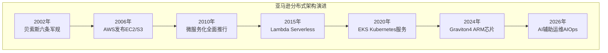
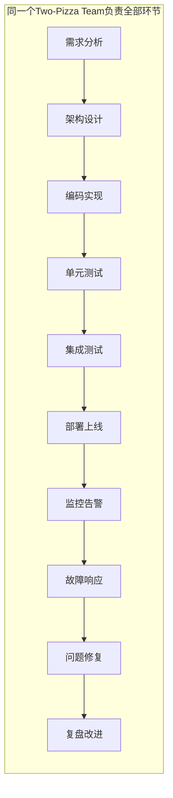
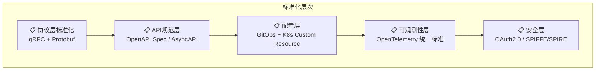
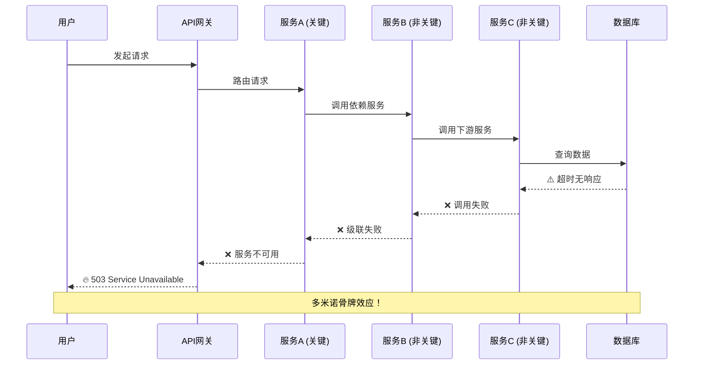
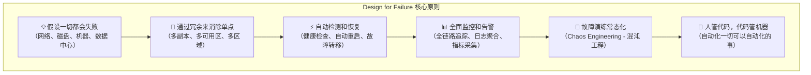
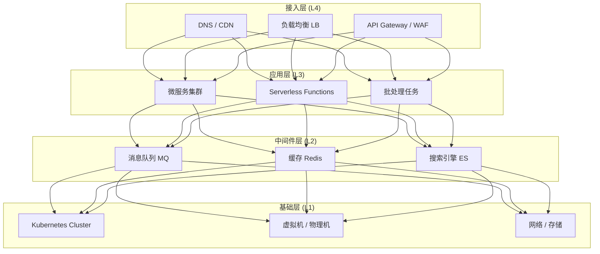
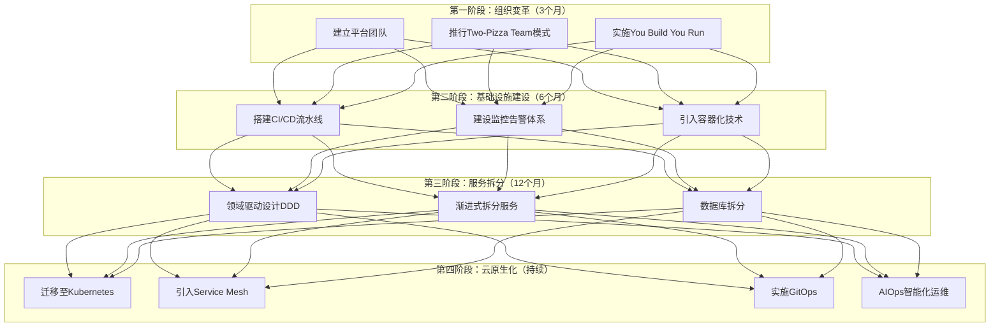
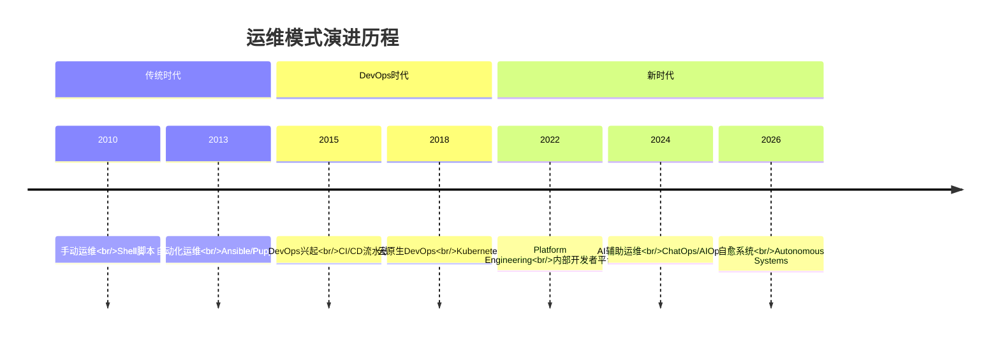

# 从亚马逊的实践，谈分布式系统的难点 [2026重制版]

> **核心变更说明**
> - **版本更新**：从2018年原版更新至2026年
> - **AWS技术栈**：新增 **AWS Graviton4**、**Lambda@Edge**、**EKS（Elastic Kubernetes Service）** 等最新服务
> - **组织模式**：引入 **Platform Team + Stream-Aligned Team** 的现代团队拓扑
> - **DevOps演进**：从DevOps到 **DevSecOps** 和 **Platform Engineering**
> - **可观测性**：基于 **OpenTelemetry** 和 **AWS X-Ray** 的全链路追踪

---

## 一、问题背景：亚马逊——分布式架构的先驱者

### 1.1 历史回顾：贝索斯的"六条军规"

早在2002年，亚马逊CEO杰夫·贝索斯（Jeff Bezos）就颁布了著名的架构规定，这被认为是AWS（Amazon Web Service）诞生的基因：

| 序号 | 规定内容 | 2026年的解读 |
|-----|---------|-------------|
| 1️⃣ | 所有团队的程序模块都要通过Service Interface方式开放数据和功能 | **API-First设计**成为行业标准 |
| 2️⃣ | 团队间通信必须通过这些接口 | **服务间解耦**的基础 |
| 3️⃣ | 除此之外没有其他通信方式；不能直接链接、不能读对方数据库、不能用共享内存 | **零信任网络**和**数据库私有化**原则 |
| 4️⃣ | 任何技术都可以使用（HTTP、CORBA、Pub/Sub等） | **协议多样性**，如今主要是gRPC/REST |
| 5️⃣ | 所有接口都必须设计成能对外界开放的 | **内部即外部（InnerSource）**理念 |
| 6️⃣ | 不这样做的人会被炒鱿鱼 | **自上而下的强制执行**是关键 |

### 1.2 亚马逊的技术影响

以下为行业观察中的**示例性数据**（云市场份额统计来自 Synergy Research、Canalys 等机构，非 Stack Overflow 调查项）：

- AWS占据约三成云市场份额（排名第一）
- 全球有数百万家企业客户使用AWS
- AWS每天处理的API调用量达万亿级

数据来源：行业云市场统计（Synergy Research、Canalys 等）



---

## 二、核心概念：亚马逊的分布式实践经验

### 2.1 组织架构：Two-Pizza Teams（两个披萨团队）

亚马逊的核心组织原则：

```
┌─────────────────────────────────────────────────────┐
│                  Two-Pizza Team                      │
│  定义：一个团队的人数不超过两张披萨能喂饱的数量（通常6-10人）│
│                                                       │
│  ✅ 特点：                                            │
│  • 全栈负责：从前端到后端，从开发到运维                 │
│  • 按业务域分工，而非按技能分工                        │
│  • 拥有自己的服务，对服务的整个生命周期负责              │
│  • 自治决策，减少跨团队协调                            │
└─────────────────────────────────────────────────────┘
```

### 2.2 2026年现代化解读：Team Topologies

在2026年，这种组织模式已经演化为更成熟的 **Team Topologies（团队拓扑学）**：

| 团队类型 | 职责 | 与亚马逊模式的对应 |
|---------|------|------------------|
| **Stream-Aligned Team（流式对齐团队）** | 直接交付业务价值 | 类似Two-Pizza Team |
| **Platform Team（平台团队）** | 构建内部开发者平台 | 基础设施团队 |
| **Enabling Team（赋能团队）** | 协助其他团队采用新技术 | 架构委员会 |
| **Complicated-Subsystem Team（复杂子系统团队）** | 管理高复杂度组件 | 数据库/存储专家 |

### 2.3 DevOps文化：You Build It, You Run It

亚马逊的核心工程哲学：



**关键原则**：
- **没有专职测试人员**：开发人员自己测试
- **没有专职运维人员**：开发人员自己运维
- **Eat Your Own Dog Food**：吃自己的狗粮
- 这迫使开发人员写出更容易维护的代码

---

## 三、技术细节：分布式系统的四大核心难题

### 3.1 难题一：异构系统的不标准问题

#### 问题表现

在分布式系统中，不同服务可能使用不同的：
- 编程语言（Java、Go、Python、Rust...）
- 通讯协议（REST、gRPC、GraphQL、消息队列...）
- 数据格式（JSON、Protobuf、Avro、Thrift...）
- 配置管理方式（YAML、环境变量、配置中心...）
- 部署方式（Docker、Helm、Kustomize...）

#### 解决方案：标准化策略



**2026年最佳实践**：

| 标准化领域 | 推荐方案 | 官方资源 |
|-----------|---------|---------|
| **API规范** | OpenAPI 3.1 / AsyncAPI | [openapispecification](https://spec.openapis.org/oas/latest.html) |
| **服务契约** | Protobuf / GraphQL Schema | [protobuf](https://protobuf.dev/) |
| **追踪标准** | OpenTelemetry | [opentelemetry.io](https://opentelemetry.io/) |
| **日志格式** | Structured Logging (JSON) | [structured-logging](https://www.structlog.org/) |
| **指标标准** | Prometheus Exposition Format | [prometheus.io/docs](https://prometheus.io/docs/instrumenting/exposure_formats/) |
| **配置管理** | K8s CRD + GitOps | [argocd](https://argo-cd.readthedocs.io/) |

### 3.2 难题二：服务依赖性问题

#### 问题的严重性

服务依赖就像 **"铁锁连环"** —— 一个服务出问题，可能导致连锁反应：



#### 解决方案：服务治理策略

| 策略 | 说明 | 工具/实现 |
|-----|------|----------|
| **熔断器（Circuit Breaker）** | 当错误率达到阈值时自动断开 | Resilience4j / Sentinel |
| **限流（Rate Limiting）** | 控制请求速率，防止过载 | Envoy / Kong |
| **降级（Fallback）** | 服务不可用时返回默认值或缓存 | 自定义实现 / Resilience4j（Hystrix 已进入维护模式） |
| **超时控制（Timeout）** | 设置合理的调用超时时间 | gRPC / HTTP Client |
| **舱壁隔离（Bulkhead）** | 隔离资源池，防止单点耗尽所有资源 | 线程池隔离 / 进程隔离 |
| **重试（Retry）** | 失败后自动重试（需考虑幂等性） | gRPC Retry / Spring Retry |

### 3.3 难题三：故障概率增大

#### CAP定理的现实意义

在分布式系统中，根据 **CAP定理**：

| 组合 | 一致性(C) | 可用性(A) | 分区容忍(P) | 典型系统 |
|-----|----------|----------|------------|---------|
| **CA** | ✅ | ✅ | ❌ | 传统RDBMS（单节点） |
| **CP** | ✅ | ❌ | ✅ | ZooKeeper、etcd、Consul |
| **AP** | ❌ | ✅ | ✅ | Cassandra、DynamoDB、CouchDB |

**重要认知**：在存在网络分区的情况下，一致性和可用性只能二选一！

#### Design for Failure（为故障而设计）

亚马逊的核心哲学：**故障不是是否发生的问题，而是何时发生的问题**



### 3.4 难题四：多层架构的运维复杂度

#### 四层架构模型



**核心挑战**：
1. **任何一层的问题都会导致整体问题**
2. **缺乏统一视图导致排障困难**
3. **各层参数配置不一致引发诡异行为**

---

## 四、方案对比：传统vs现代解决方案

### 4.1 运维模式对比

| 维度 | 传统运维（2018年前） | 现代云原生运维（2026年） |
|-----|-------------------|----------------------|
| **部署方式** | 手动SSH、脚本 | GitOps + ArgoCD |
| **监控工具** | Zabbix、Nagios | Prometheus + Grafana |
| **日志管理** | grep、tail | ELK / PLG Stack |
| **链路追踪** | 无 / Zipkin | OpenTelemetry + Jaeger |
| **告警通知** | 邮件、短信 | PagerDuty、Slack、钉钉机器人 |
| **故障恢复** | 人工介入 | 自动化（HPA/VPA） |
| **容量规划** | 经验估算 | 基于数据的预测（VPA） |
| **安全合规** | 事后审计 | DevSecOps 左移 |
| **混沌测试** | 无 | Chaos Mesh、Litmus |
| **成本优化** | 年度预算审查 | FinOps 实时优化 |

### 4.2 技术选型决策矩阵

| 场景 | 推荐方案 | 成熟度 | 社区活跃度 |
|-----|---------|-------|-----------|
| **容器编排** | Kubernetes 1.36 | ⭐⭐⭐⭐⭐ | 非常活跃 |
| **服务网格** | Istio（Ambient Mesh）/ Cilium | ⭐⭐⭐⭐ | 活跃 |
| **API网关** | Kong / APISIX / Envoy | ⭐⭐⭐⭐⭐ | 非常活跃 |
| **配置中心** | Nacos / Consul | ⭐⭐⭐⭐⭐ | 非常活跃 |
| **服务发现** | K8s原生Service + CoreDNS | ⭐⭐⭐⭐⭐ | 非常活跃 |
| **链路追踪** | OpenTelemetry Collector | ⭐⭐⭐⭐⭐ | 非常活跃 |
| **监控指标** | Prometheus + Thanos | ⭐⭐⭐⭐⭐ | 非常活跃 |
| **日志收集** | Loki / Vector | ⭐⭐⭐⭐ | 活跃 |
| **消息队列** | Apache Kafka / RocketMQ | ⭐⭐⭐⭐⭐ | 非常活跃 |
| **分布式事务** | Seata 2.0 | ⭐⭐⭐⭐ | 活跃 |
| **工作流引擎** | Temporal / Cadence | ⭐⭐⭐⭐ | 快速增长 |

---

## 五、实战案例：某金融科技公司的分布式转型之路

### 5.1 背景

某金融科技公司，管理资产规模500亿+，日交易量100万+笔。

### 5.2 转型前痛点

| 痛点 | 具体表现 | 影响 |
|-----|---------|------|
| **发布周期长** | 每月一次大版本发布 | 业务响应慢 |
| **故障定位难** | 平均MTTR（平均修复时间）4小时 | 用户投诉多 |
| **扩展能力差** | 大促期间频繁宕机 | 丢失订单 |
| **团队协作差** | 开发、测试、运维割裂 | 推卸责任 |

### 5.3 转型方案（参考亚马逊实践）



### 5.4 转型成果

| 指标 | 转型前 | 转型后 | 提升 |
|-----|-------|-------|------|
| **发布频率** | 每月1次 | 每天10+次 | **300倍** |
| **平均故障修复时间(MTTR)** | 4小时 | 15分钟 | **16倍** |
| **系统可用性** | 99.9% | 99.99% | **提升一个9** |
| **资源利用率** | 20% | 65% | **3倍以上** |
| **团队满意度** | 3.2/5 | 4.5/5 | **显著提升** |

---

## 六、2026年最新实践：从DevOps到Platform Engineering

### 6.1 演进路线图



### 6.2 Platform Engineering 核心要素

在2026年，**Platform Engineering（平台工程）** 已经成为构建分布式系统的最佳实践：

| 能力层 | 组件 | 说明 |
|-------|------|------|
| **开发者门户（Developer Portal）** | Backstage / Port | 统一入口，自助服务 |
| **基础设施编排** | Terraform / Pulumi / Crossplane | 基础设施即代码 |
| **应用运行时** | Kubernetes / Knative Serverless | 标准化的运行环境 |
| **可观测性平台** | OTel + Prometheus + Grafana | 统一监控视图 |
| **安全合规** | Policy-as-Code (OPA) | 自动化安全策略 |
| **文档和知识库** | TechDocs / Confluence | 知识沉淀和共享 |

### 6.3 关键经验总结

基于亚马逊和其他领先企业的实践，我们总结出以下关键经验：

#### ✅ Do（应该做的）

1. **组织先行**：先调整组织结构，再调整技术架构
2. **小步快跑**：采用增量式演进，避免大爆炸式重构
3. **度量驱动**：建立DORA指标（部署频率、前置时间、变更失败率、MTTR），用数据说话
4. **文化塑造**：培养"工程 Ownership"意识，消除"这不是我的问题"心态
5. **自动化一切**：如果一件事需要做两次以上，就应该自动化

#### ❌ Don't（不应该做的）

1. **不要盲目微服务**：评估业务复杂度和团队能力后再决定
2. **不要忽视基础设施**：监控、日志、追踪是分布式系统的眼睛
3. **不要忽视安全**：DevSecOps，安全左移
4. **不要过度设计**：YAGNI原则（You Aren't Gonna Need It）
5. **不要停止学习**：技术演进永不停歇

---

## 七、延伸资源与官方文档

### 📚 必读资源

| 资源 | 链接 | 说明 |
|-----|------|------|
| **AWS Well-Architected** | https://aws.amazon.com/architecture/well-architected/ | AWS架构最佳实践框架 |
| **Amazon Builders' Library** | https://aws.amazon.com/builders-library/ | 亚马逊工程师分享的架构经验 |
| **Google SRE Book** | https://sre.google/sre-book/ | 站点可靠性工程圣经 |
| **Team Topologies** | https://teamtopologies.com/ | 现代团队组织模式 |
| **DORA State of DevOps** | https://dora.dev/devops-report/ | DevOps年度调查报告 |
| **CNCF Cloud Native Definition** | https://github.com/cncf/toc/blob/main/DEFINITION.md | 云原生定义 |
| **Chaos Engineering** | https://principlesofchaos.org/ | 混沌工程原则 |
| **Platform Engineering.org** | https://platformengineering.org/ | 平台工程社区 |

### 📖 推荐阅读

1. **《Working Backwards》** - Colin Bryar、Bill Carr
   - 亚马逊工作方式的揭秘
   
2. **《The Phoenix Project》** - Gene Kim
   - DevOps转型的必读书籍

3. **《Team Topologies》** - Matthew Skelton、Manuel Pais
   - 团队组织的现代方法论

4. **《Accelerate》** - Nicole Forsgren
   - 基于数据驱动的DevOps科学

---

## 八、总结

通过亚马逊的实践案例，我们可以看到：

> **分布式系统不仅仅是一个技术问题，更是一个组织问题、流程问题和文化问题。**

成功的关键在于：

1. **顶层设计**：像贝索斯那样，自上而下地推动架构变革
2. **组织适配**：采用适合分布式架构的团队模式（Two-Pizza Team → Team Topologies）
3. **文化转变**：从"这是运维的事"转变为"You Build It, You Run It"
4. **基础设施先行**：监控、日志、追踪、自动化是基础中的基础
5. **持续进化**：从DevOps到Platform Engineering，永远在路上

记住亚马逊的那句话：**"Day 1"** —— 保持创业第一天的心态，永远保持学习和进化的动力。

> **下一部分预告**：我们将深入探讨分布式系统的完整技术栈，了解构建分布式系统所需的核心技术和工具。
