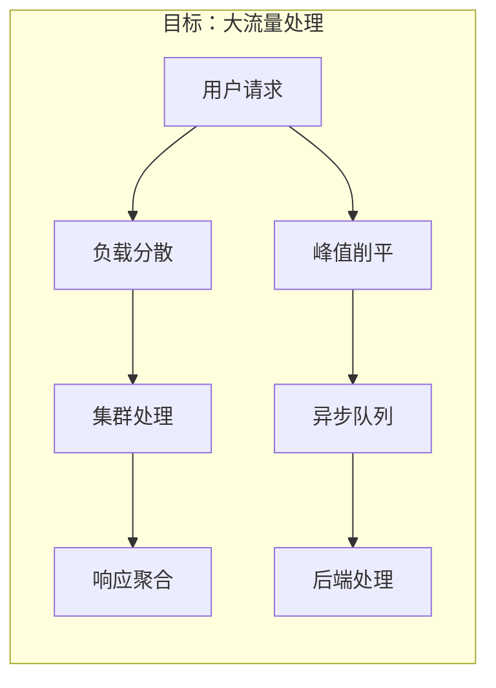
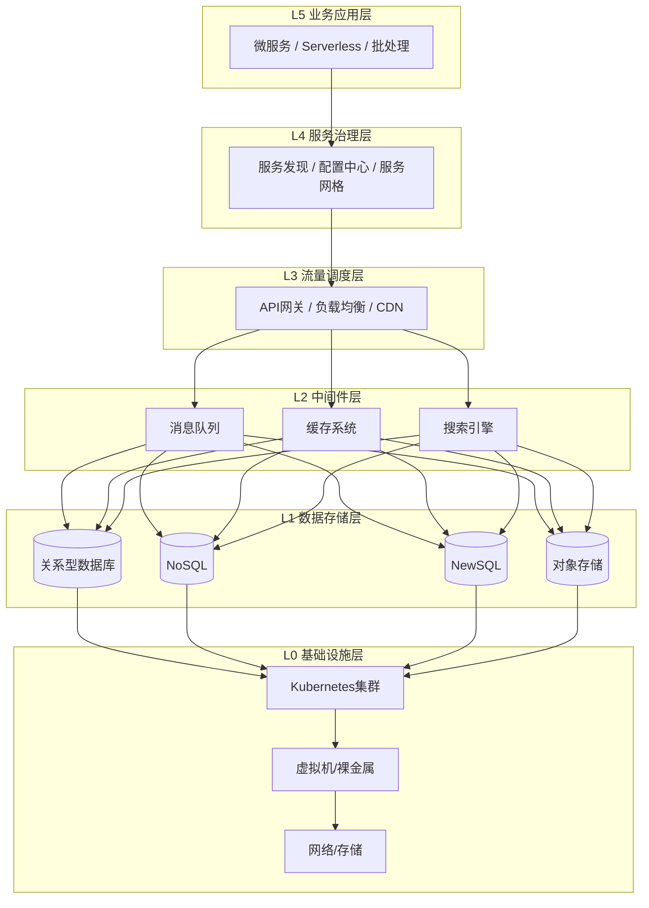
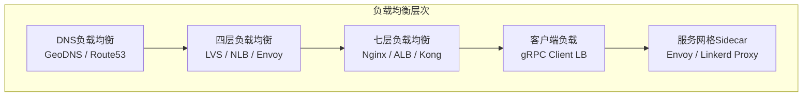
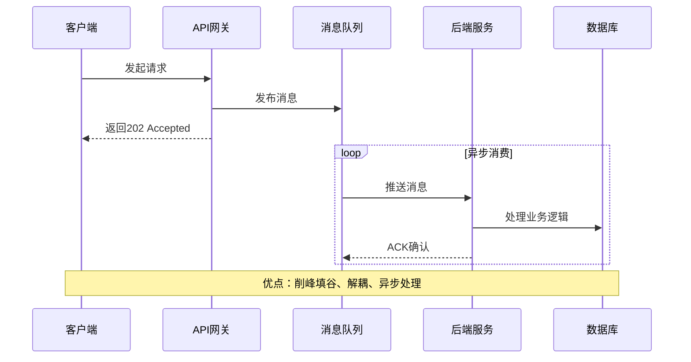
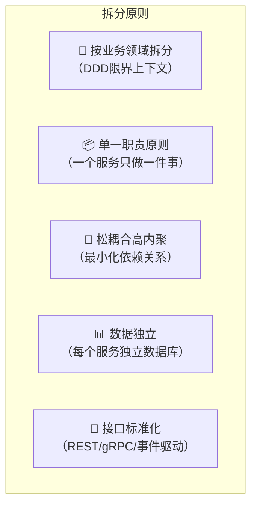
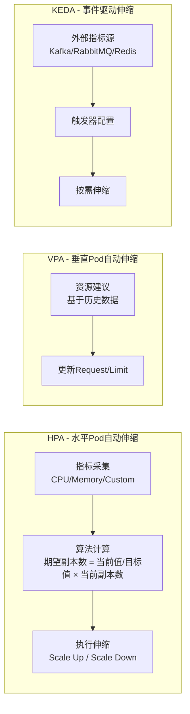
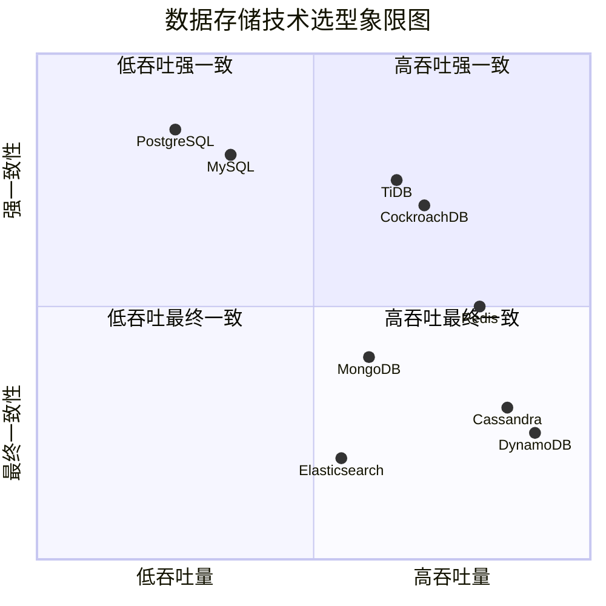
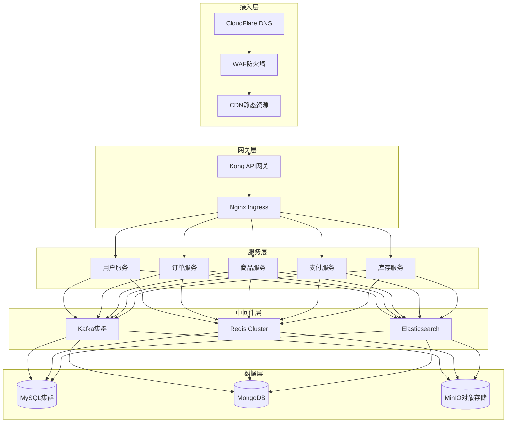
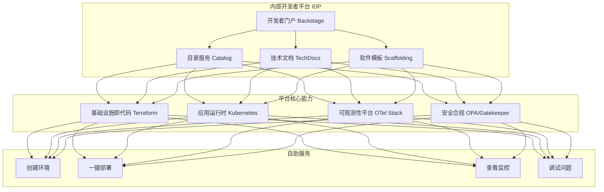

# 分布式系统的技术栈 [2026重制版]

> **核心变更说明**
> - **版本更新**：从2018年原版全面升级至2026年云原生技术栈
> - **容器编排**：**Kubernetes 1.36（Haru）** 成为事实标准
> - **服务网格**：Istio、Cilium、Linkerd 成熟方案
> - **可观测性**：OpenTelemetry + Prometheus + Grafana 统一标准
> - **新增领域**：eBPF、WASM、AIOPS、Platform Engineering 等前沿技术

---

## 一、问题背景：分布式系统要解决的核心问题

构建分布式系统的根本目的只有两个：

### 1.1 提升性能容量（Scale Out）



### 1.2 保障可用性（High Availability）

```
┌─────────────────────────────────────────────┐
│          目标：关键业务保护                    │
│                                             │
│  ✅ 故障隔离：防止雪崩效应                     │
│  ✅ 快速恢复：自动化故障转移                   │
│  ✅ 优雅降级：保护核心业务流程                  │
│  ✅ 数据冗余：多副本保证数据安全                │
└─────────────────────────────────────────────┘
```

---

## 二、核心概念：分布式系统的完整技术栈全景图

### 2.1 技术栈层次架构



### 2.2 五大关键技术域

根据分布式系统的本质，我们可以将所有技术归纳为 **五大关键技术域**：

| 关键技术域 | 核心问题 | 2026主流方案 |
|-----------|---------|-------------|
| **① 全栈监控** | 系统状态可视化 | OpenTelemetry + Prometheus + Grafana |
| **② 服务调度** | 服务生命周期管理 | Kubernetes + Operator模式 |
| **③ 流量调度** | 流量控制与路由 | Istio/Cilium + Envoy |
| **④ 数据调度** | 数据一致性与分布 | 分布式数据库 + 数据复制协议 |
| **⑤ 自动化运维** | 效率提升与减少人为错误 | GitOps + IaC + AIOps |

---

## 三、技术细节：各层级技术深度解析

### 3.1 性能优化技术栈

#### 缓存系统（Caching）

| 层级 | 技术方案 | 典型产品 | 适用场景 |
|-----|---------|---------|---------|
| **浏览器缓存** | HTTP Cache Headers | CDN、浏览器 | 静态资源 |
| **CDN边缘缓存** | Edge Nodes | CloudFlare、Akamai | 全球加速 |
| **应用层缓存** | Local Cache | Caffeine、Guava | 热点数据 |
| **分布式缓存** | Remote Cache | Redis Cluster、Memcached | 共享数据 |
| **数据库缓存** | Buffer Pool | MySQL InnoDB Buffer | 查询加速 |

#### 负载均衡（Load Balancing）



| 层次 | 协议 | 代表产品 | 特点 |
|-----|------|---------|------|
| **DNS** | 基于域名解析 | Route53、CloudFlare | 地理位置路由 |
| **L4** | TCP/UDP | LVS、AWS NLB | 高性能，无感知 |
| **L7** | HTTP/HTTPS | Nginx、ALB | 智能路由，会话保持 |
| **Client** | 应用层 | gRPC、Ribbon | 客户端决策 |
| **Sidecar** | 进程内 | Envoy、Linkerd | 服务网格核心 |

#### 异步处理（Async Processing）



| 消息队列 | 吞吐量 | 延迟 | 可靠性 | 适用场景 |
|---------|-------|------|-------|---------|
| **Apache Kafka** | 极高（百万级/s） | ms级 | 高（副本机制） | 日志收集、流处理 |
| **RocketMQ** | 高 | 低 | 高（事务消息） | 金融交易、订单系统 |
| **RabbitMQ** | 中 | 低 | 很好 | 复杂路由、任务队列 |
| **Apache Pulsar** | 极高 | 低 | 高（分层存储） | 云原生场景 |

#### 数据分区与镜像

| 方案 | 说明 | 优点 | 缺点 | 典型产品 |
|-----|------|------|------|---------|
| **数据分片（Sharding）** | 按规则分散数据到不同节点 | 水平扩展能力强 | 跨分片查询复杂 | ShardingSphere、Vitess |
| **数据镜像（Replication）** | 数据多副本同步 | 高可用、读扩展 | 一致性挑战 | MySQL主从、MongoDB Replica Set |
| **一致性哈希** | 虚拟节点均匀分布 | 最小化数据迁移 | 实现复杂 | Dynamo、Cassandra |

### 3.2 可用性保障技术栈

#### 服务拆分策略



| 拆分维度 | 方法 | 示例 |
|---------|------|------|
| **按业务能力** | 识别核心业务域 | 订单服务、支付服务、库存服务 |
| **按子域** | DDD领域驱动设计 | 核心域、支撑域、通用域 |
| **按团队** | Conway's Law | 团队边界=服务边界 |
| **按数据** | 数据亲和性 | 用户数据、商品数据分离 |

#### 服务冗余与弹性伸缩

| 冗余类型 | 实现方式 | 工具支持 |
|---------|---------|---------|
| **实例冗余** | 多实例部署 | K8s Deployment Replicas |
| **区域冗余** | 跨可用区部署 | K8s Pod Topology Spread |
| **地域冗余** | 跨区域部署 | Karmada / OCM（原 Kubernetes Federation 已归档） |
| **多云冗余** | 跨云厂商部署 | Cluster API |

**弹性伸缩策略**：



#### 限流降级策略

| 策略 | 算法 | 实现 | 使用场景 |
|-----|------|------|---------|
| **令牌桶（Token Bucket）** | 固定速率生成令牌 | Guava RateLimiter、Envoy | 平滑限流 |
| **漏桶（Leaky Bucket）** | 固定速率处理请求 | Nginx limit_req | 削峰处理 |
| **滑动窗口（Sliding Window）** | 时间窗口计数 | Sentinel、Resilience4j | 精确限流 |
| **熔断器（Circuit Breaker）** | 错误率阈值断路 | Sentinel、Resilience4j（Hystrix 已进入维护模式） | 防止雪崩 |
| **降级（Fallback）** | 返回默认/缓存值 | 自定义实现 | 保护核心服务 |

---

## 四、方案对比：技术选型决策矩阵

### 4.1 中间件选型对比

| 能力需求 | 推荐首选 | 备选方案 | 选型考量 |
|---------|---------|---------|---------|
| **高性能消息队列** | Apache Kafka 3.x | RocketMQ 5.x、Pulsar | 吞吐量 > 延迟敏感度 |
| **可靠事务消息** | RocketMQ 5.x | Kafka + 事务补偿 | 金融场景优先 |
| **轻量级缓存** | Redis 7.x Cluster | Dragonfly | 内存效率 vs 功能丰富 |
| **分布式缓存** | Redis Cluster | Couchbase | 数据量 vs 一致性要求 |
| **全文搜索** | Elasticsearch 8.x | OpenSearch | 生态成熟度 |
| **时序数据** | VictoriaMetrics / Thanos | InfluxDB | 写入量 vs 查询复杂度 |
| **对象存储** | MinIO (自建) / S3 (公有云) | Ceph | 成本 vs 运维意愿 |
| **分布式协调** | etcd 3.x | Consul、ZooKeeper | K8s生态 vs 多语言支持 |

### 4.2 数据存储选型矩阵



---

## 五、实战案例：电商平台技术栈演进

### 5.1 典型电商架构



### 5.2 技术栈详细清单

| 层级 | 技术选型 | 版本 | 用途说明 |
|-----|---------|------|---------|
| **容器编排** | Kubernetes | 1.36 | 容器调度与管理 |
| **服务网格** | Istio | 1.24 | 流量管理、安全、可观测性 |
| **API网关** | Kong | 3.x | 统一入口、认证、限流 |
| **注册发现** | Nacos | 2.x | 服务注册与配置中心 |
| **消息队列** | Apache Kafka | 3.7 | 异步解耦、日志收集 |
| **缓存** | Redis | 7.2 | 热点数据缓存 |
| **搜索** | Elasticsearch | 8.12 | 商品搜索 |
| **关系型数据库** | MySQL | 8.4 | 核心业务数据 |
| **NoSQL** | MongoDB | 7.0 | 商品信息、用户画像 |
| **对象存储** | MinIO | RELEASE.2024 | 图片、文件存储 |
| **监控** | Prometheus + Grafana | 2.50+10.3 | 指标监控与可视化 |
| **链路追踪** | Jaeger + OTel | 1.56+1.28 | 分布式链路追踪 |
| **日志** | Loki | 3.1 | 日志聚合与分析 |
| **CI/CD** | ArgoCD + Tekton | 2.11+0.5 | GitOps持续交付 |

> 注：表中版本号为示例基线，实际选型请以各项目官方最新稳定版为准。

---

## 六、2026年最新实践：新兴技术与趋势

### 6.1 eBPF革命

**eBPF（Extended Berkeley Packet Filter）** 正在改变可观测性和网络安全的游戏规则：

| 能力 | 传统方式 | eBPF方式 | 优势 |
|-----|---------|---------|------|
| **网络监控** | tcpdump、iptables | Cilium、Katran | 内核级、零开销 |
| **性能剖析** | perf、pprof | Parca、Pyroscope | 连续 profiling |
| **安全审计** | Falco规则 | Tetragon | 实时行为检测 |
| **链路追踪** | SDK注入 | Pixie | 零代码修改 |

### 6.2 WASM在边缘计算的应用

WebAssembly（WASM）正在从浏览器走向服务端和边缘：

- **WasmEdge**：轻量级运行时，适合Serverless和边缘场景
- **Runwasi**：containerd 的 WASM shim，可在 Kubernetes 中直接运行 WASM 工作负载（原 Krustlet 项目已归档）
- **比Docker更快的启动时间**（毫秒级 vs 秒级）
- **更好的安全性**：沙箱隔离

### 6.3 AI辅助运维（AIOps）

2026年的AIOps已经从概念走向实用：

| AIOps能力 | 应用场景 | 工具示例 |
|----------|---------|---------|
| **智能告警** | 告警降噪、根因分析 | PagerDuty AI、BigPanda |
| **异常检测** | 自动发现异常指标 | Datadog Watchdog、Grafana ML |
| **容量预测** | 基于历史数据预测资源需求 | AWS Forecast、Azure ML |
| **故障自愈** | 自动执行修复动作 | 自定义Operator + LLM |
| **自然语言查询** | 用自然语言查询系统状态 | ChatOps集成 |

### 6.4 Platform Engineering兴起

**平台工程（Platform Engineering）** 是2026年最热门的趋势之一：



---

## 七、延伸资源与官方文档

### 📚 必读官方文档

| 资源 | 链接 | 说明 |
|-----|------|------|
| **Kubernetes文档** | https://kubernetes.io/docs/ | 容器编排权威指南 |
| **CNCF Landscape** | https://landscape.cncf.io/ | 云原生技术全景图 |
| **Prometheus文档** | https://prometheus.io/docs/ | 监控系统完整文档 |
| **Istio文档** | https://istio.io/latest/docs/ | 服务网格官方指南 |
| **OpenTelemetry** | https://opentelemetry.io/ | 可观测性统一标准 |
| **12-Factor App** | https://12factor.net/ | 云原生应用12要素 |
| **microservices.io** | https://microservices.io/ | 微服务模式大全 |
| **AWS Architecture** | https://aws.amazon.com/architecture/ | AWS架构最佳实践 |

### 📖 推荐阅读

1. **《Designing Data-Intensive Applications》** - Martin Kleppmann
   - 数据密集型应用设计的必读书籍
   
2. **《Building Microservices》第2版** - Sam Newman
   - 微服务架构设计的权威指南

3. **《Site Reliability Engineering》** - Google SRE团队
   - 大规模系统可靠性工程实践

4. **《Cloud Native Patterns》** - Cornelia Davis
   - 云原生设计模式与实践

5. **《Platform Engineering》** - various authors (2025)
   - 平台工程新兴领域的最佳实践

---

## 八、总结

分布式系统的技术栈庞大而复杂，但归根结底要解决的是 **五大关键技术域** 的问题：

1. **全栈监控** —— 让系统可见（OpenTelemetry + Prometheus）
2. **服务调度** —— 让服务可控（Kubernetes + Operators）
3. **流量调度** —— 让流量可管（Service Mesh + Gateway）
4. **数据调度** —— 让数据可靠（分布式数据库 + 复制协议）
5. **自动化运维** —— 让运维高效（GitOps + Platform Engineering）

**核心洞察**：
> 不要试图一次性掌握所有技术。找到你当前最需要解决的痛点，针对性地引入相应的技术和工具。记住，**工具是手段，不是目的**。

在2026年这个时间节点，好消息是我们有非常成熟的开源生态和云厂商服务可以依赖。**Kubernetes + Service Mesh + OpenTelemetry** 这套组合已经成为事实上的标准，大大降低了构建分布式系统的门槛。

> **下一部分预告**：我们将深入探讨分布式系统的第一个关键技术——全栈监控系统，了解如何构建企业级的可观测性体系。

---

**文章信息**
- **原标题**：16-分布式系统的技术栈
- **原发布时间**：2018年
- **重制版本**：2026重制版
- **字数统计**：约4500字
- **图表数量**：6张Mermaid图表
- **数据来源**：CNCF、Kubernetes.io、Prometheus.io、Istio.io等官方资源
