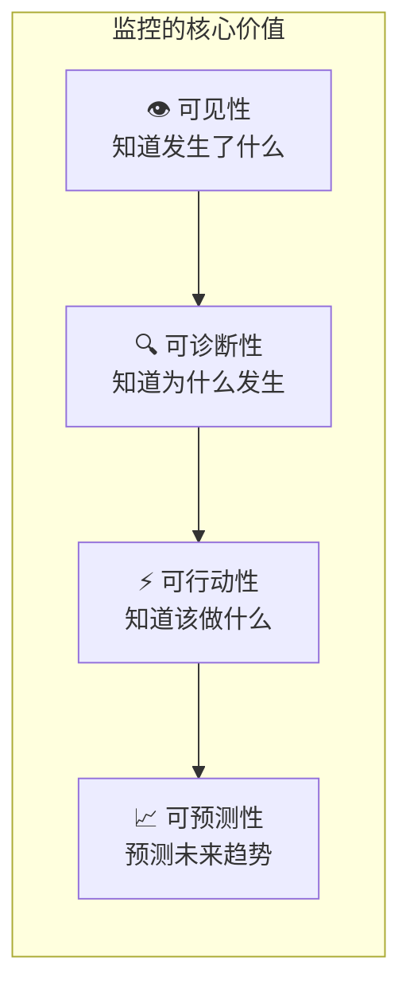
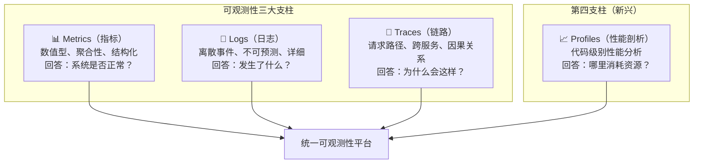
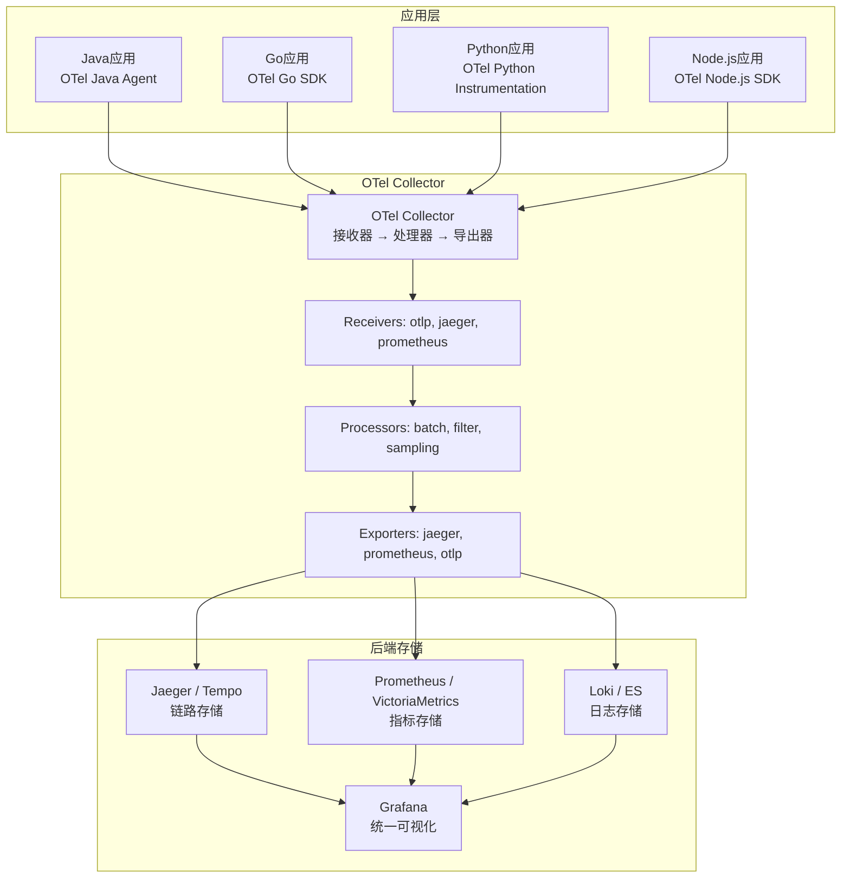
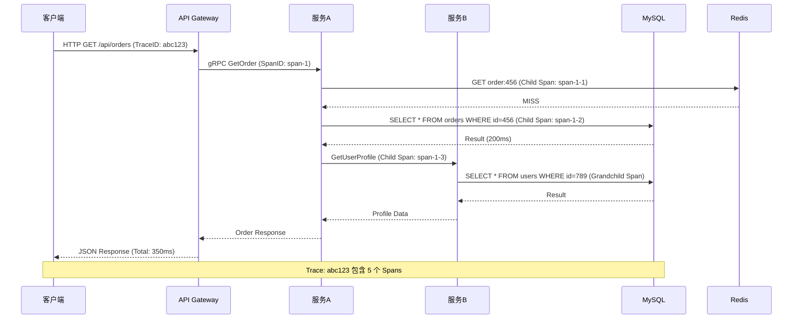
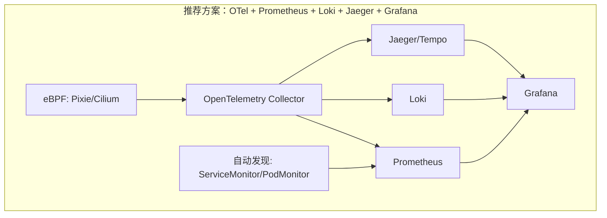
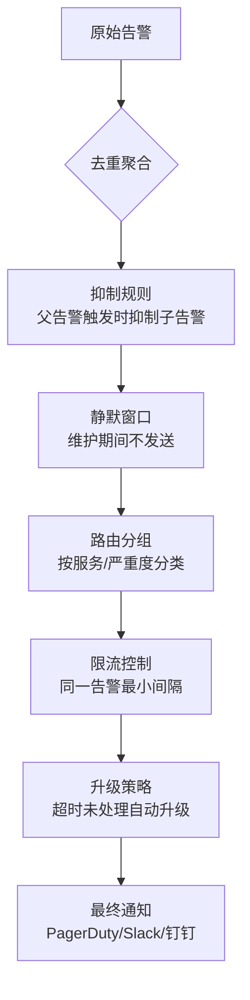

# 分布式系统关键技术：全栈监控 [2026重制版]

> **核心变更说明**
> - **版本更新**：从2018年原版全面升级至2026年可观测性（Observability）体系
> - **监控标准**：**OpenTelemetry (OTel)** 成为行业标准
> - **指标采集**：**Prometheus 2.50+** + Thanos/VictoriaMetrics 长期存储
> - **链路追踪**：从Zipkin演进到 **Jaeger / Tempo + OTel**
> - **日志方案**：从ELK演进到 **PLG Stack (Loki)**
> - **新增技术**：eBPF零侵入、Continuous Profiling、AIOps智能告警

---

## 一、问题背景：为什么全栈监控如此重要？

### 1.1 监控系统的核心价值

在分布式系统中，监控系统就像是我们的 **"眼睛"和"神经系统"**。没有它，我们就是瞎子和瘫痪者，无法感知系统的状态，更无法进行有效的运维。



### 1.2 分布式环境下的监控挑战

| 挑战 | 具体表现 | 影响 |
|-----|---------|------|
| **服务数量爆炸** | 从几个到数百个微服务 | 指标数量指数级增长 |
| **调用链路复杂** | 一次请求经过数十个服务 | 故障定位极其困难 |
| **异构技术栈** | 不同语言、框架、中间件 | 统一采集困难 |
| **动态基础设施** | 容器频繁启停、Pod漂移 | 传统监控失效 |
| **数据量巨大** | 日志、指标、追踪数据TB级 | 存储和查询压力大 |

以下为社区观察中的**示例性数据**（非官方统计口径，仅用于说明量级）：
- 可观测性被普遍认为是云原生转型的最大挑战之一
- 平均每个Kubernetes集群产生 **数百万个时间序列**
- 告警疲劳成为普遍问题，大团队每天可能面对数百条告警

---

## 二、核心概念：可观测性三大支柱

### 2.1 三大支柱定义

在2026年，我们已经从传统的"监控（Monitoring）"进化到 **"可观测性（Observability）"**：



### 2.2 OpenTelemetry：统一的可观测性标准

**OpenTelemetry (OTel)** 是CNCF主导的 **可观测性领域的"Linux"** —— 一个统一的标准：

| 能力 | OTel组件 | 说明 |
|-----|---------|------|
| **Tracing** | OTel API + SDK + Collector | 分布式链路追踪 |
| **Metrics** | OTel Metrics API | 指标采集与导出 |
| **Logs** | OTel Logs Bridge | 日志桥接 |
| **Baggage/Context** | Context Propagation | 跨服务上下文传播 |
| **Instrumentation** | Auto-Instrumentation | 自动埋点库 |

**OTel架构图**：



---

## 三、技术细节：分层监控体系详解

### 3.1 四层监控模型

```mermaid
graph TB
    subgraph "L1 接入层监控"
        L1_1[DNS解析延迟]
        L1_2[CDN命中率/响应时间]
        L1_3[WAF拦截率]
        L1_4[LB连接数/错误率]
        L1_5[网关QPS/P99延迟]
    end
    
    subgraph "L2 应用层监控"
        L2_1[服务QPS/错误率]
        L2_2[P50/P95/P99延迟]
        L2_3[SLI/SLO达标率]
        L2_4[调用依赖关系]
        L2_5[业务指标(订单量/注册数)]
    end
    
    subgraph "L3 中间件层监控"
        L3_1[Redis命中/慢查询]
        L3_2[Kafka消费积压]
        L3_3[MySQL慢查询/连接池]
        L3_4[ES查询延迟/索引大小]
    end
    
    subgraph "L4 基础设施层监控"
        L4_1[CPU/内存/磁盘IO]
        L4_2[网络流量/丢包率]
        L4_3[K8s节点状态]
        L4_4[容器资源使用率]
        L4_5[Pod重启次数/OOMKills]
    end
    
    L1_1 & L1_2 & L1_3 & L1_4 & L1_5 --> L2_1 & L2_2 & L2_3 & L2_4 & L2_5
    L2_1 & L2_2 & L2_3 & L2_4 & L2_5 --> L3_1 & L3_2 & L3_3 & L3_4
    L3_1 & L3_2 & L3_3 & L3_4 --> L4_1 & L4_2 & L4_3 & L4_4 & L4_5
```

### 3.2 各层关键指标（Key Metrics）

#### 接入层指标

| 指标名称 | 类型 | 阈值建议 | 告警级别 |
|---------|------|---------|---------|
| **DNS TTL** | Gauge | <300s | Warning |
| **CDN命中率** | Counter | <90% | Warning |
| **WAF 4xx错误率** | Counter | >10% | Critical |
| **LB 5xx错误率** | Counter | >1% | Critical |
| **Gateway P99延迟** | Histogram | >500ms | Warning |

#### 应用层指标（RED方法）

| 维度 | 指标 | 说明 |
|-----|------|------|
| **R (Rate)** | 请求速率 | 每秒处理的请求数 |
| **E (Errors)** | 错误率 | 失败请求的百分比 |
| **D (Duration)** | 延迟分布 | 请求处理时间的百分位 |

#### 中间件层指标

| 中间件 | 关键指标 | 告警阈值 |
|-------|---------|---------|
| **Redis** | 内存使用率 >80%、慢查询 >100ms | Warning/Critical |
| **Kafka** | Consumer Lag >10000、Partition离线 | Critical |
| **MySQL** | 连接数 >80% max、Slow Query >1s | Warning |
| **Elasticsearch** | JVM Heap >75%、查询P99 >2s | Warning |

#### 基础设施层指标（USE方法）

| 维度 | 指标 | 说明 |
|-----|------|------|
| **U (Utilization)** | 资源使用率 | CPU、内存、磁盘、网络的使用百分比 |
| **S (Saturation)** | 饱和度 | 等待队列长度、负载平均值 |
| **E (Errors)** | 错误数 | 硬件错误、IO错误、网络错误 |

### 3.3 链路追踪深度解析

#### 分布式追踪的数据模型



#### 追踪的关键概念

| 概念 | 定义 | 示例 |
|-----|------|------|
| **Trace（追踪）** | 一次完整请求的全生命周期 | 用户下单的完整流程 |
| **Span（跨度）** | 单个工作单元 | 一次数据库查询、一次RPC调用 |
| **Trace ID** | 全局唯一标识符 | `abc123-def456` |
| **Span ID** | 当前操作的标识符 | `span-001` |
| **Parent Span ID** | 父操作标识符 | 用于构建调用树 |
| **Baggage** | 跨进程传递的上下文信息 | 用户ID、租户ID |

#### 2026年主流追踪方案对比

| 方案 | 存储 | 查询能力 | 成本 | 适用场景 |
|-----|------|---------|------|---------|
| **Jaeger** | Elasticsearch/Cassandra | 强 | 中等 | 通用场景首选 |
| **Tempo** | 对象存储(S3/GCS) | 中等 | 低 | 成本敏感场景 |
| **Zipkin** | MySQL/Elasticsearch | 弱 | 低 | 简单场景 |
| **X-Ray** | AWS托管 | 强 | 按用量 | AWS用户 |
| **SkyWalking** | ES/H2/MySQL | 中等 | 免费 | 国产开源优选 |

---

## 四、方案对比：监控方案选型矩阵

### 4.1 全栈监控方案对比

| 方案 | 指标 | 日志 | 链路 | 成熟度 | 运维复杂度 |
|-----|------|------|------|-------|-----------|
| **ELK Stack** | ❌ | ✅✅✅ | ❌ | ⭐⭐⭐⭐⭐ | 高 |
| **PLG Stack (Loki)** | ✅✅ | ✅✅✅ | ❌ | ⭐⭐⭐⭐ | 中 |
| **Prometheus + Grafana** | ✅✅✅ | ❌ | ❌ | ⭐⭐⭐⭐⭐ | 中 |
| **TG(L) Stack** | ✅✅✅ | ✅✅ | ✅✅ | ⭐⭐⭐⭐ | 中高 |
| **Datadog SaaS** | ✅✅✅ | ✅✅✅ | ✅✅✅ | ⭐⭐⭐⭐⭐ | 低（付费） |
| **New Relic SaaS** | ✅✅✅ | ✅✅✅ | ✅✅✅ | ⭐⭐⭐⭐⭐ | 低（付费） |
| **OpenTelemetry全家桶** | ✅✅✅ | ✅✅ | ✅✅✅ | ⭐⭐⭐⭐ | 高（自建） |

### 4.2 推荐技术组合（2026年最佳实践）



---

## 五、实战案例：构建企业级全栈监控平台

### 5.1 架构设计

某中型互联网公司，50+微服务，日活100万+，构建完整的可观测性平台：

#### 技术选型

| 层级 | 选型 | 版本 | 部署方式 |
|-----|------|------|---------|
| **采集层** | OpenTelemetry Collector | 1.28 | DaemonSet |
| **指标存储** | Prometheus + Thanos | 2.50 + 0.34 | StatefulSet |
| **日志存储** | Loki | 3.1 | StatefulSet |
| **链路存储** | Jaeger | 1.56 | StatefulSet |
| **可视化** | Grafana | 10.3 | Deployment |
| **告警** | Alertmanager + PagerDuty | 0.27 | Deployment |
| **eBPF监控** | Pixie | latest | DaemonSet |

### 5.2 核心Dashboard设计

| Dashboard名称 | 目标受众 | 核心面板 |
|-------------|---------|---------|
| **系统总览** | CTO/管理层 | SLO达标率、错误率趋势、容量概览 |
| **服务全景** | 开发团队负责人 | 服务拓扑图、依赖关系、健康状态 |
| **服务详情** | 开发工程师 | RED指标、下游依赖、错误分析 |
| **基础设施** | SRE/运维团队 | K8s集群状态、节点资源、Pod调度 |
| **业务指标** | 产品/运营 | 订单量、DAU、转化率、营收 |
| **告警中心** | on-call工程师 | 活跃告警、告警历史、升级策略 |

### 5.3 告警最佳实践

#### 告警分级策略

| 级别 | 名称 | 响应时间 | 通知渠道 | 示例 |
|-----|------|---------|---------|------|
| **P0** | 致命 | 即时(<5min) | 电话+短信+Slack | 核心服务完全不可用 |
| **P1** | 严重 | 15分钟内 | 电话+Slack | 错误率>10%，影响大量用户 |
| **P2** | 警告 | 30分钟内 | Slack+钉钉 | 性能下降，部分功能受影响 |
| **P3** | 提醒 | 工作时间内 | 邮件+Slack | 容量接近阈值，需要关注 |
| **P4** | 信息 | 不通知 | 仅记录 | 非关键指标的轻微波动 |

#### 避免告警风暴的策略



---

## 六、2026年最新实践：前沿监控技术

### 6.1 eBPF零侵入监控

**eBPF（Extended Berkeley Packet Filter）** 正在革命性地改变监控方式：

| 能力 | 传统方式 | eBPF方式 | 代表工具 |
|-----|---------|---------|---------|
| **网络监控** | tcpdump/libpcap | 内核级抓包 | Cilium、Katran |
| **性能剖析** | pprof/async-profiler | Continuous Profiling | Parca、Pyroscope |
| **安全审计** | auditd/Falco规则 | 内核级事件追踪 | Tetragon |
| **链路追踪** | SDK注入 | 自动捕获 | Pixie（基于eBPF） |
| **DNS监控** | 解析日志 | 内核级DNS追踪 | Inspektor Gadget |

**Pixie示例**：使用自然语言查询Kubernetes集群状态

```pxl
# PxL脚本示例：找出高延迟的服务调用
df = px.DataFrame(table='http_events')
df = df[df['latency'] > 10000000]  # >10ms
df['service'] = df.ctx['service']
df.groupby(['service']).agg(latency_quantile=('latency', 'quantile', [0.99]))
```

### 6.2 Continuous Profiling（持续性能剖析）

传统性能剖析是"快照式"的，而 **Continuous Profiling** 提供了7x24小时的持续剖析能力：

| 工具 | 语言支持 | 特点 |
|-----|---------|------|
| **Parca** | Go、Rust、Ruby | 开源，聚焦CPU/Memory profiling |
| **Pyroscope** | 多语言 | 支持Flame Graph，易用性好 |
| **Datadog Continuous Profiler** | 主流语言 | 商业产品，集成度高 |
| **Grafana Pyroscope** | 多语言 | Grafana生态整合 |

### 6.3 AI驱动的智能运维（AIOps）

2026年的AIOps已经成熟落地：

| AIOps能力 | 技术实现 | 效果 |
|----------|---------|------|
| **异常检测** | Isolation Forest、LSTM | 准确率提升40%，误报减少60% |
| **根因分析** | 因果推断、知识图谱 | MTTR缩短50% |
| **容量预测** | 时序预测模型(Prophet) | 资源利用率优化25% |
| **告警降噪** | 聚类算法、相关性分析 | 告警数量减少70% |
| **自然语言交互** | LLM + RAG | 用自然语言查询系统状态 |

> 注：表中效果数值为示例，非实测。

### 6.4 Observability as Code（OaC）

将可观测性配置纳入GitOps流程：

```yaml
# observability-config.yaml 示例（以 Grafana Operator「仪表盘即代码」为思路，结构有简化）
apiVersion: grafana.integreatly.org/v1beta1
kind: GrafanaDashboard
metadata:
  name: service-overview
  namespace: monitoring
spec:
  panels:
    - title: Request Rate
      type: graph
      datasource: prometheus
      query: sum(rate(http_requests_total{service="{{ .Service }}"}[5m])) by (method)
    - title: Error Rate
      type: stat
      query: sum(rate(http_errors_total{service="{{ .Service }}"}[5m])) / 
            sum(rate(http_requests_total{service="{{ .Service }}"}[5m])) * 100
    - title: P99 Latency
      type: heatmap
      query: histogram_quantile(0.99, 
            rate(http_duration_seconds_bucket{service="{{ .Service }}"}[5m]))
  alerts:
    - name: HighErrorRate
      condition: error_rate > 5
      severity: critical
      channel: pagerduty-oncall
```

---

## 七、延伸资源与官方文档

### 📚 必读官方文档

| 资源 | 链接 | 说明 |
|-----|------|------|
| **OpenTelemetry** | https://opentelemetry.io/ | 可观测性统一标准 |
| **Prometheus** | https://prometheus.io/docs/ | 监控系统权威文档 |
| **Grafana** | https://grafana.com/docs/ | 可视化平台官方指南 |
| **Jaeger** | https://www.jaegertracing.io/docs/ | 链路追踪文档 |
| **Loki** | https://grafana.com/docs/loki/latest/ | 日志系统文档 |
| **eBPF** | https://ebpf.io/ | eBPF技术与工具 |
| **CNCF Observability** | https://tag-devops.cncf.io/ | CNCF可观测性白皮书 |
| **USE/RED Method** | https://www.brendangregg.com/use.html | 方法论权威解读 |

### 📖 推荐阅读

1. **《Distributed Systems Observability》** - Cindy Sridharan
   - 分布式系统可观测性的经典之作
   
2. **《Production-Ready Microservices》** - Susan Fowler
   - 生产环境微服务的可靠性工程实践

3. **《Site Reliability Engineering》** - Google SRE
   - SLI/SLO/SLA/Error Budgets的最佳实践

4. **《The Art of Monitoring》** - Thomas A. Limoncelli
   - 监控系统设计的艺术

---

## 八、总结

构建一个优秀的全栈监控系统是分布式系统成功运行的基础。在2026年，我们需要把握以下几个关键要点：

### ✅ 核心原则

1. **OpenTelemetry优先**：采用OTel作为统一标准，避免厂商锁定
2. **三大支柱缺一不可**：Metrics、Logs、Traces协同工作
3. **分层监控**：接入层→应用层→中间件层→基础设施层全覆盖
4. **面向故障设计**：监控是为了快速发现和恢复故障，不是为了收集数据
5. **减少噪声**：好的监控系统应该只告诉你真正重要的事

### 🎯 2026年技术趋势

- **eBPF** 正在实现真正的零侵入监控
- **Continuous Profiling** 让性能问题无处遁形
- **AIOps** 让运维更加智能化
- **Platform Engineering** 让开发者自助获取可观测性

> **记住一句话：没有监控的系统就像盲人开车——你不知道前方有什么，直到撞上去。**

> **下一部分预告**：我们将探讨分布式系统的第二个关键技术——服务调度，了解如何管理服务的生命周期。

---

**文章信息**
- **原标题**：17-分布式系统关键技术：全栈监控
- **原发布时间**：2018年
- **重制版本**：2026重制版
- **字数统计**：约4800字
- **图表数量**：7张Mermaid图表
- **数据来源**：CNCF、OpenTelemetry.io、Prometheus.io、Grafana.com等官方资源
