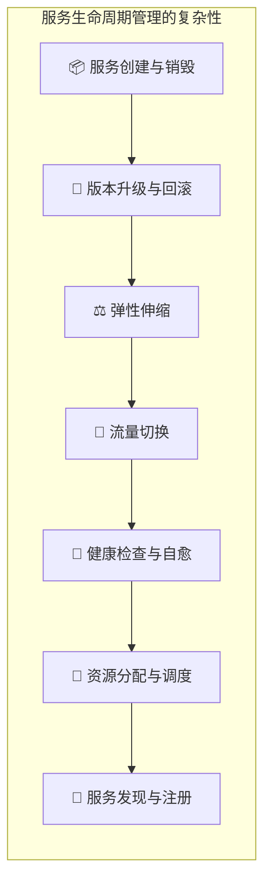
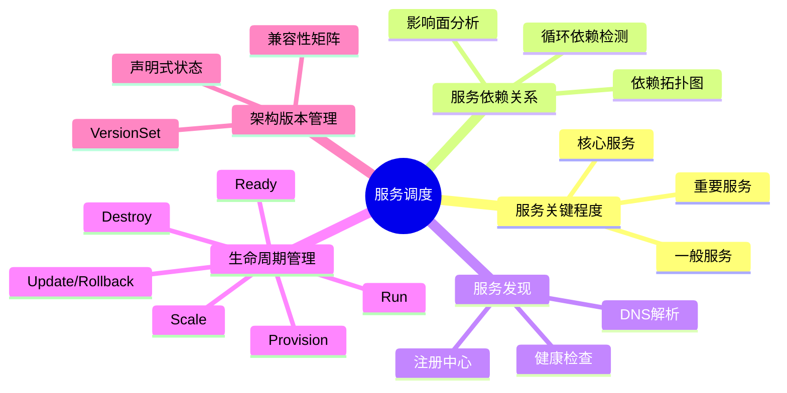
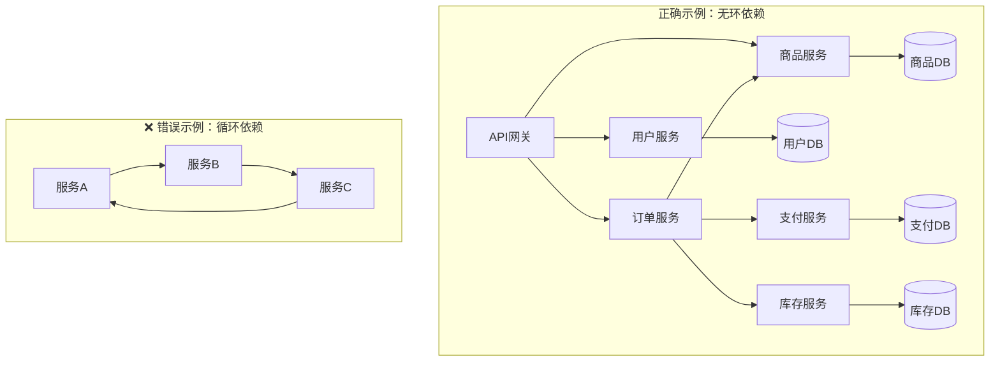
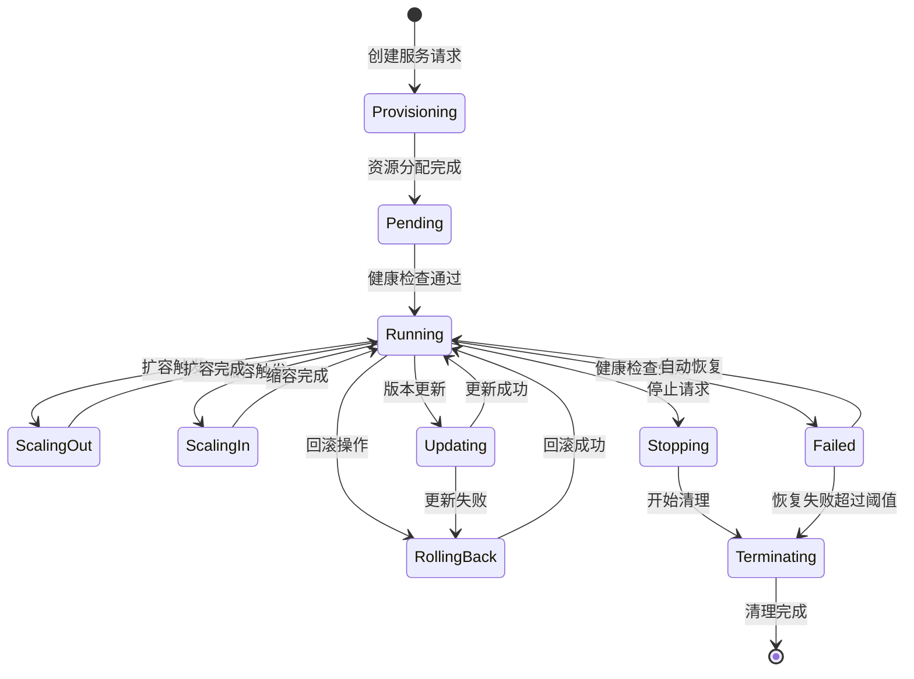
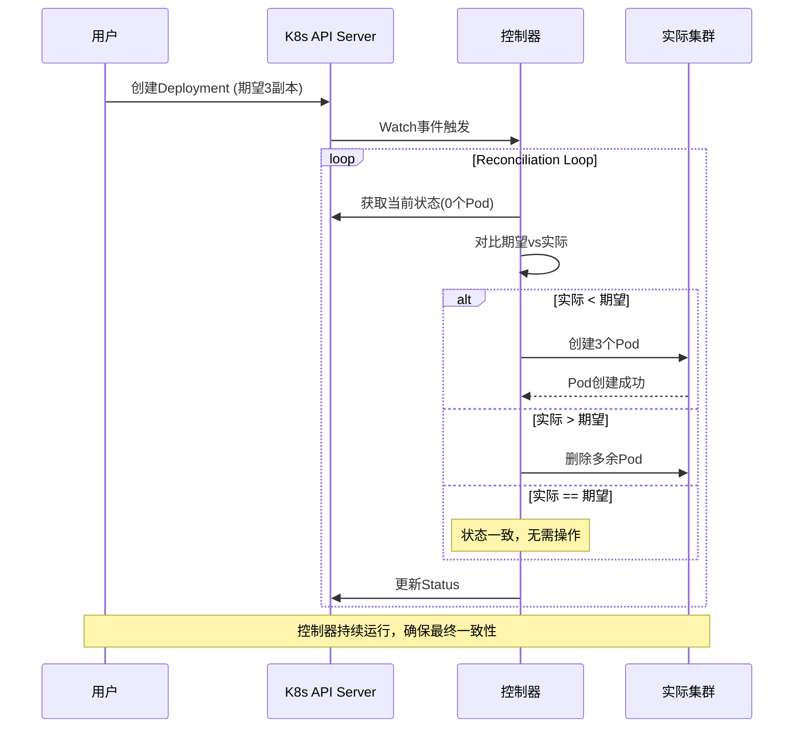
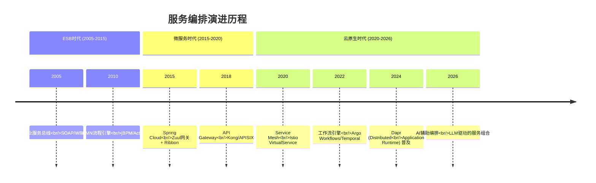
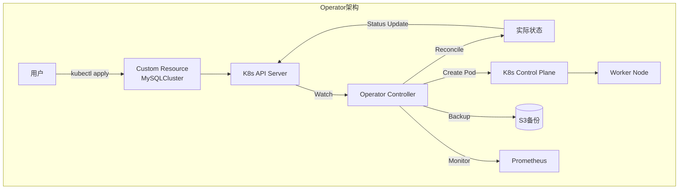
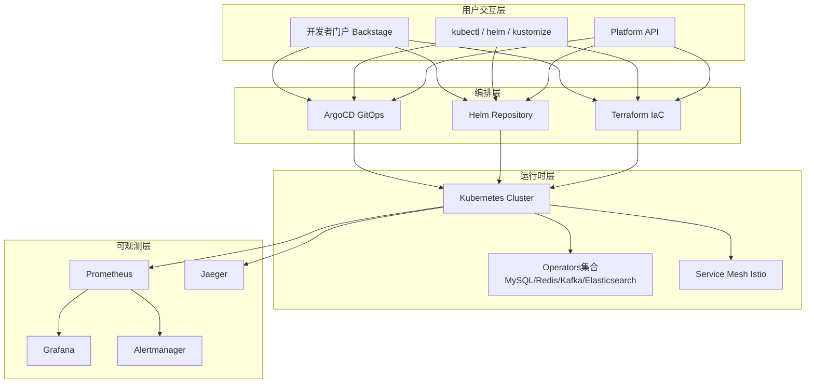
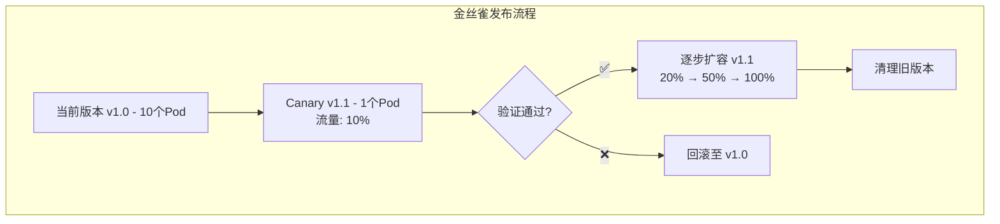

# 分布式系统关键技术：服务调度 [2026重制版]

> **核心变更说明**
> - **版本更新**：从2018年原版升级至2026年云原生服务调度体系
> - **容器编排**：**Kubernetes 1.36（Haru）** 成为标准，深入解析调度器原理
> - **Operator模式**：**Kubernetes Operator SDK** 成为服务管理最佳实践
> - **工作流引擎**：**Argo Workflows / Temporal** 替代传统ESB
> - **新增内容**：Service Mesh Sidecar管理、GitOps声明式部署、多集群调度

---

## 一、问题背景：为什么需要服务调度？

### 1.1 服务调度的核心挑战

在分布式系统中，服务的数量从几个增长到数百甚至数千个。如何高效地管理这些服务的生命周期，成为了一个巨大的挑战：



### 1.2 传统方式的痛点

| 痛点 | 具体表现 | 影响 |
|-----|---------|------|
| **手动运维** | SSH到服务器上手动启停服务 | 效率低下、容易出错 |
| **脚本自动化** | Shell/Ansible脚本管理 | 难以维护、缺乏状态感知 |
| **配置漂移** | 各环境配置不一致 | "在我机器上能跑"问题 |
| **扩展困难** | 新增节点需要大量手工操作 | 无法应对流量突发 |
| **故障恢复慢** | 依赖人工介入 | MTTR长达数小时 |

---

## 二、核心概念：服务治理的五大关键能力

### 2.1 五大关键能力全景图



### 2.2 服务关键程度定义

| 等级 | 定义 | SLA要求 | 示例 |
|-----|------|---------|------|
| **P0-核心** | 业务核心链路，不可用直接影响收入 | 99.99%+ | 支付服务、订单服务 |
| **P1-重要** | 影响用户体验，但非完全阻断 | 99.9%+ | 用户服务、搜索服务 |
| **P2-一般** | 辅助功能，降级后可接受 | 99%+ | 推荐系统、评论服务 |
| **P3-边缘** | 内部工具、后台功能 | 98%+ | 运营后台、日志分析 |

### 2.3 服务依赖关系管理



**循环依赖的危害**：
- 部署顺序无法确定
- 故障会无限传播
- 测试极其困难
- 扩展受限

**解决方案**：
1. **引入事件驱动**：通过消息队列解耦同步调用
2. **抽取公共服务**：将共享逻辑下沉为独立服务
3. **领域事件**：采用DDD的事件风暴模式

---

## 三、技术细节：服务状态管理与生命周期

### 3.1 服务生命周期状态机



### 3.2 Kubernetes中的服务状态拟合（Reconciliation）

**Reconciliation Loop（调和循环）** 是Kubernetes控制器的核心设计模式：



**关键特性**：
- **水平触发（Level Triggered）**：基于状态而非事件
- **最终一致性**：不保证立即达到目标状态
- **幂等性**：重复执行不会产生副作用
- **容错自愈**：自动修复偏离的状态

### 3.3 弹性伸缩策略

#### HPA（Horizontal Pod Autoscaler）

```yaml
# hpa-example.yaml
apiVersion: autoscaling/v2
kind: HorizontalPodAutoscaler
metadata:
  name: api-server-hpa
spec:
  scaleTargetRef:
    apiVersion: apps/v1
    kind: Deployment
    name: api-server
  minReplicas: 3
  maxReplicas: 100
  metrics:
  - type: Resource
    resource:
      name: cpu
      target:
        type: Utilization
        averageUtilization: 70
  - type: Resource
    resource:
      name: memory
      target:
        type: Utilization
        averageUtilization: 80
  - type: Pods
    pods:
      metric:
        name: requests-per-second
      target:
        type: AverageValue
        averageValue: "1k"
  behavior:
    scaleDown:
      stabilizationWindowSeconds: 300
      policies:
      - type: Percent
        value: 10
        periodSeconds: 60
    scaleUp:
      stabilizationWindowSeconds: 0
      policies:
      - type: Percent
        value: 100
        periodSeconds: 15
      selectPolicy: Max
```

#### VPA（Vertical Pod Autoscaler）

| 模式 | 说明 | 适用场景 |
|-----|------|---------|
| **Off** | 仅提供建议，不应用 | 初期观察阶段 |
| **Initial** | 仅对新创建的Pod设置资源 | 新服务上线 |
| **Auto** | 自动更新所有Pod的资源请求 | 成熟稳定的服务 |
| **Recreate** | 通过重建Pod来调整资源 | 可接受短暂中断 |

#### KEDA（Kubernetes Event-driven Autoscaling）

```yaml
# keda-scaler.yaml - 基于Kafka消费者延迟伸缩
apiVersion: keda.sh/v1alpha1
kind: ScaledObject
metadata:
  name: kafka-consumer-scaler
spec:
  scaleTargetRef:
    name: order-processor
  minReplicaCount: 2
  maxReplicaCount: 50
  triggers:
  - type: kafka
    metadata:
      bootstrapServers: kafka-headless:9092
      consumerGroup: order-group
      topic: orders
      lagThreshold: "100"
      offsetResetPolicy: latest
```

---

## 四、技术细节：服务编排与工作流

### 4.1 从ESB到现代编排的演进



### 4.2 Kubernetes原生编排方式

#### Ingress vs Gateway vs Mesh

| 维度 | Ingress (L7) | Gateway API | Service Mesh |
|-----|-------------|------------|--------------|
| **作用域** | 集群北向流量 | 南北向+东西向 | 东西向为主 |
| **协议支持** | HTTP/HTTPS | HTTP/gRPC/TCP/UDP | 全协议 |
| **高级功能** | 基础路由 | 高级路由、Header修改 | 熔断、重试、遥测 |
| **性能影响** | 低 | 中 | 中高(Sidecar) |
| **成熟度** | ⭐⭐⭐⭐⭐ | ⭐⭐⭐⭐ | ⭐⭐⭐⭐ |
| **推荐场景** | 简单HTTP路由 | 复杂API管理 | 微服务内部通信 |

### 4.3 工作流引擎对比

| 引擎 | 类型 | 特点 | 适用场景 |
|-----|------|------|---------|
| **Temporal** | 有状态工作流引擎 | 持久化、可重试、信号机制 | 长运行业务流程 |
| **Cadence** | 有状态工作流引擎 | Uber开源，Temporal前身 | 大规模分布式任务 |
| **Argo Workflows** | K8s原生工作流 | CI/CD、ML Pipeline | K8s生态内批处理 |
| **Apache Airflow** | DAG工作流 | 数据管道、ETL | 数据工程 |
| **Camunda** | BPMN引擎 | 人工审批流程 | 企业级BPM |

#### Temporal工作流示例

```go
// OrderWorkflow.go - 订单处理工作流
func OrderWorkflow(ctx workflow.Context, order Order) error {
    // 步骤1：校验库存
    var inventoryAvailable bool
    err := workflow.ExecuteActivity(ctx, CheckInventory, order.ProductID, order.Quantity).Get(ctx, &inventoryAvailable)
    if err != nil || !inventoryAvailable {
        return errors.New("inventory not available")
    }
    
    // 步骤2：预留库存
    err = workflow.ExecuteActivity(ctx, ReserveInventory, order.ProductID, order.Quantity).Get(ctx, nil)
    if err != nil {
        return err
    }
    
    // 步骤3：处理支付（带超时和重试）
    ctxWithTimeout := WithActivityOptions(ctx, 
        ActivityOptions{
            StartToCloseTimeout: time.Minute * 5,
            RetryPolicy: &RetryPolicy{
                InitialInterval: time.Second,
                BackoffCoefficient: 2.0,
                MaximumAttempts: 3,
            },
        })
    var paymentResult PaymentResult
    err = workflow.ExecuteActivity(ctxWithTimeout, ProcessPayment, order.PaymentInfo).Get(ctx, &paymentResult)
    
    if err != nil || !paymentResult.Success {
        // 补偿：释放库存
        workflow.ExecuteActivity(ctx, ReleaseInventory, order.ProductID, order.Quantity)
        return errors.New("payment failed")
    }
    
    // 步骤4：确认订单
    return workflow.ExecuteActivity(ctx, ConfirmOrder, order.ID).Get(ctx, nil)
}
```

---

## 五、方案对比：服务调度方案选型

### 5.1 编排层选型矩阵

| 方案 | 复杂度 | 灵活性 | 性能 | 社区活跃度 | 适用场景 |
|-----|-------|-------|------|-----------|---------|
| **K8s原生资源** | ⭐ | ⭐⭐ | ⭐⭐⭐⭐⭐ | ⭐⭐⭐⭐⭐ | 简单无状态服务 |
| **Helm Charts** | ⭐⭐ | ⭐⭐⭐ | ⭐⭐⭐⭐⭐ | ⭐⭐⭐⭐⭐ | 标准化应用部署 |
| **Kustomize** | ⭐⭐ | ⭐⭐⭐ | ⭐⭐⭐⭐⭐ | ⭐⭐⭐⭐ | 多环境差异化配置 |
| **Operator模式** | ⭐⭐⭐⭐ | ⭐⭐⭐⭐⭐ | ⭐⭐⭐⭐ | ⭐⭐⭐⭐ | 有状态复杂应用 |
| **Istio VirtualService** | ⭐⭐⭐ | ⭐⭐⭐⭐ | ⭐⭐⭐ | ⭐⭐⭐⭐ | 服务网格流量管理 |
| **Argo CD (GitOps)** | ⭐⭐⭐ | ⭐⭐⭐⭐ | ⭐⭐⭐⭐ | ⭐⭐⭐⭐⭐ | 声明式持续交付 |
| **Crossplane/IaC** | ⭐⭐⭐⭐ | ⭐⭐⭐⭐⭐ | ⭐⭐⭐ | ⭐⭐⭐ | 多云基础设施管理 |

### 5.2 Operator模式深度解析

**什么是Operator？**

Operator是使用 **CRD（Custom Resource Definition）** + **Controller** 模式来扩展Kubernetes API的模式：



**主流Operator框架**：

| 框架 | 语言 | 学习曲线 | 社区 | 代表项目 |
|-----|------|---------|------|---------|
| **Operator SDK (Go)** | Go | 中等 | ⭐⭐⭐⭐⭐ | Prometheus Operator |
| **Java Operator SDK** | Java | 低 | ⭐⭐⭐⭐ | Strimzi (Kafka) |
| **Kopf (Python)** | Python | 低 | ⭐⭐⭐ | 各种自定义Operator |
| **Shell Operator** | Bash | 极低 | ⭐⭐⭐ | 简单脚本化Operator |

---

## 六、实战案例：电商平台服务调度平台

### 6.1 架构设计

某电商平台，50+微服务，构建基于Kubernetes的服务调度平台：



### 6.2 关键实践

#### 1）统一服务模板

```yaml
# service-template.yaml - 标准化服务定义
apiVersion: apps/v1
kind: Deployment
metadata:
  name: {{ .Values.serviceName }}
  labels:
    app: {{ .Values.serviceName }}
    team: {{ .Values.team }}
    tier: application
    criticality: {{ .Values.criticality }}  # P0/P1/P2/P3
spec:
  replicas: {{ .Values.replicas.min }}
  strategy:
    type: RollingUpdate
    rollingUpdate:
      maxSurge: 25%
      maxUnavailable: 0
  selector:
    matchLabels:
      app: {{ .Values.serviceName }}
  template:
    metadata:
      annotations:
        prometheus.io/scrape: "true"
        prometheus.io/port: "{{ .Values.port }}"
        sidecar.istio.io/inject: "true"
    spec:
      serviceAccountName: {{ .Values.serviceName }}
      securityContext:
        runAsNonRoot: true
        runAsUser: 1000
        fsGroup: 1000
      containers:
      - name: app
        image: {{ .Values.image.repository }}:{{ .Values.image.tag }}
        ports:
        - containerPort: {{ .Values.port }}
        resources:
          requests:
            cpu: "{{ .Values.resources.requests.cpu }}"
            memory: "{{ .Values.resources.requests.memory }}"
          limits:
            cpu: "{{ .Values.resources.limits.cpu }}"
            memory: "{{ .Values.resources.limits.memory }}"
        livenessProbe:
          httpGet:
            path: /health/live
            port: {{ .Values.port }}
          initialDelaySeconds: 30
          periodSeconds: 10
        readinessProbe:
          httpGet:
            path: /health/ready
            port: {{ .Values.port }}
          initialDelaySeconds: 5
          periodSeconds: 5
        env:
        - name: SERVICE_NAME
          value: {{ .Values.serviceName }}
        - name: OTEL_EXPORTER_OTLP_ENDPOINT
          value: "otel-collector:4317"
        volumeMounts:
        - name: config
          mountPath: /app/config
          readOnly: true
      volumes:
      - name: config
        configMap:
          name: {{ .Values.serviceName }}-config
```

#### 2）渐进式发布策略



---

## 七、2026年最新实践：前沿趋势

### 7.1 多集群调度（Multi-Cluster）

随着业务规模扩大，单一Kubernetes集群已无法满足需求：

| 方案 | 特点 | 适用场景 |
|-----|------|---------|
| **Karmada** | CNCF孵化项目，开源多集群编排 | 跨云/跨区域部署 |
| **OCM (Open Cluster Management)** | Red Hat主导，企业级 | 大规模混合云 |
| **Rancher Fleet** | GitOps多集群管理 | 已使用Rancher的用户 |
| **Google Anthos** | Google托管的多集群方案 | GCP重度用户 |

### 7.2 智能调度（AI-Powered Scheduling）

传统调度基于静态规则，AI调度可以动态优化：

| 能力 | 传统调度 | AI智能调度 |
|-----|---------|-----------|
| **资源预测** | 基于历史峰值 | 时序模型预测 |
| **负载均衡** | 轮询/随机 | 基于实时负载 |
| **故障预测** | 阈值告警 | 异常检测提前预警 |
| **成本优化** | 手动调整规格 | 自动选择最优实例类型 |
| **调度决策** | 固定优先级 | 强化学习优化 |

### 7.3 WASM与Sidecar演进

WebAssembly正在改变Sidecar的模式：

| 维度 | 传统Sidecar (Envoy) | WASM Sidecar |
|-----|-------------------|-------------|
| **启动时间** | 秒级 | 毫秒级 |
| **内存占用** | 50-100MB | 5-10MB |
| **安全性** | 进程隔离 | 沙箱隔离 |
| **热更新** | 需要重启 | 动态加载 |
| **语言支持** | C++ | Rust/Go/AssemblyScript |
| **代表项目** | Envoy Proxy | Proxy-Wasm、Envoy WASM |

---

## 八、延伸资源与官方文档

### 📚 必读官方文档

| 资源 | 链接 | 说明 |
|-----|------|------|
| **Kubernetes官方文档** | https://kubernetes.io/docs/ | 容器编排权威指南 |
| **Kubernetes Scheduler** | https://kubernetes.io/docs/concepts/scheduling-kube-scheduler/ | 调度器原理详解 |
| **Operator SDK** | https://sdk.operatorframework.io/ | Operator开发指南 |
| **Argo CD** | https://argo-cd.readthedocs.io/ | GitOps持续交付 |
| **Istio文档** | https://istio.io/latest/docs/ | 服务网格完整指南 |
| **Temporal文档** | https://docs.temporal.io/ | 工作流引擎指南 |
| **HPA/VPA** | https://kubernetes.io/docs/tasks/run-application/horizontal-pod-autoscale/ | 自动伸缩文档 |
| **Gateway API** | https://gateway-api.sigs.k8s.io/ | 新一代网关API规范 |

### 📖 推荐阅读

1. **《Kubernetes Patterns》** - Bilgin Ibryam、Roland Huß
   - Kubernetes设计模式的权威书籍
   
2. **《Designing Distributed Systems》** - Brendan Burns
   - 分布式系统设计模式（微软Azure首席架构师）

3. **《Data Patterns on Kubernetes》** - various authors
   - Kubernetes上数据密集型应用的模式

4. **《Managing Kubernetes in Production》** - various authors
   - 生产环境Kubernetes管理实战

---

## 九、总结

服务调度是分布式系统的 **"操作系统内核"** —— 它决定了整个系统的效率、可靠性和可扩展性。

### ✅ 核心要点回顾

1. **服务治理五要素**：关键程度、依赖关系、服务发现、生命周期、版本管理
2. **状态拟合是核心**：学习Kubernetes的Reconciliation Loop模式
3. **声明式优于命令式**：用YAML描述期望状态，让控制器去实现
4. **Operator是终极武器**：将领域知识编码进控制器
5. **GitOps是未来方向**：一切即代码，Git作为唯一真相来源

### 🎯 2026年技术建议

| 场景 | 推荐方案 |
|-----|---------|
| **简单无状态服务** | Deployment + HPA + ArgoCD |
| **有状态数据库** | 专业Operator（如CrunchyData for PostgreSQL） |
| **复杂业务流程** | Temporal/Cadence工作流引擎 |
| **大规模微服务** | Istio Service Mesh + Gateway API |
| **多云/混合云** | Karmada/OCM多集群管理 |
| **极致性能** | WASM Sidecar + eBPF网络 |

> **记住一句话：好的服务调度系统应该像空气一样——你感觉不到它的存在，但一切都井然有序地运转着。**

> **下一部分预告**：我们将探讨分布式系统的第三和第四大关键技术——流量调度与数据调度。

---

**文章信息**
- **原标题**：18-分布式系统关键技术：服务调度
- **原发布时间**：2018年
- **重制版本**：2026重制版
- **字数统计**：约4800字
- **图表数量**：9张Mermaid图表
- **数据来源**：Kubernetes.io、Istio.io、CNCF、Operator Framework等官方资源
