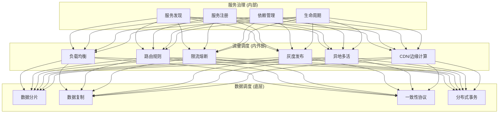
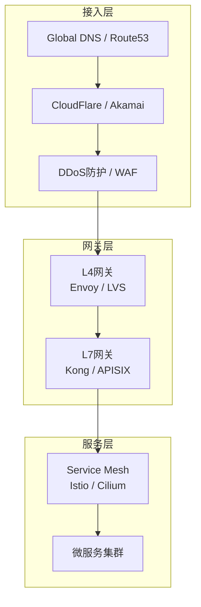
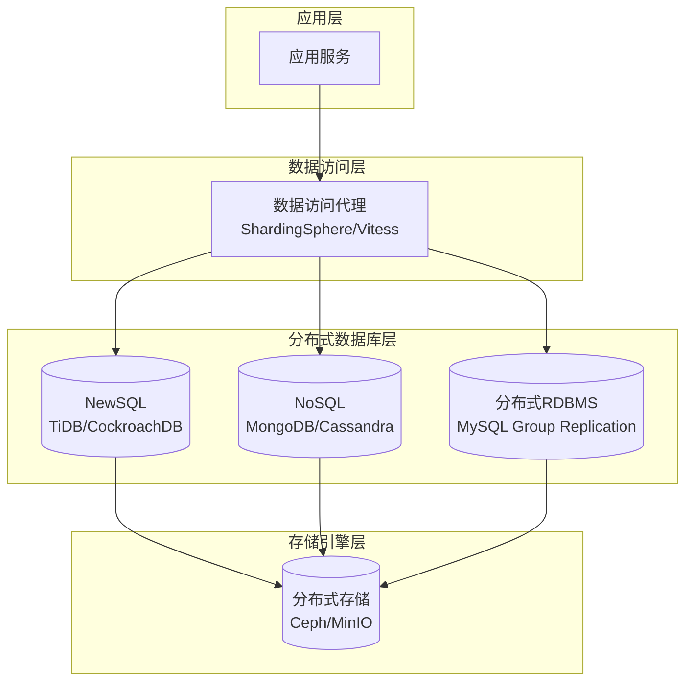
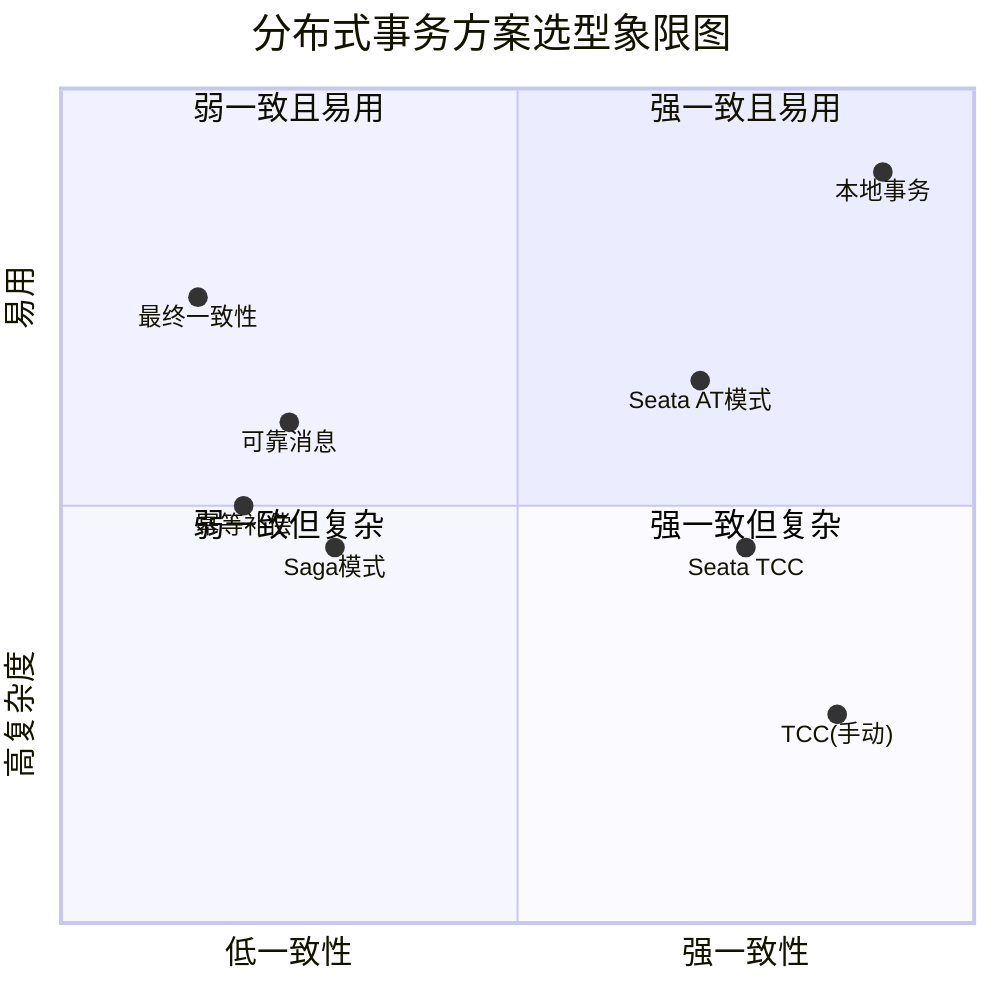
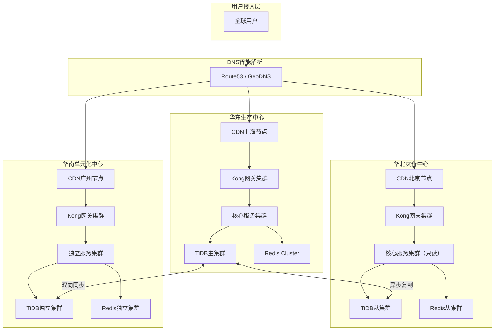
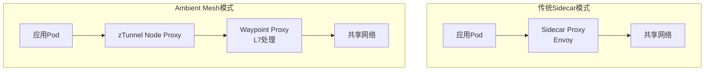
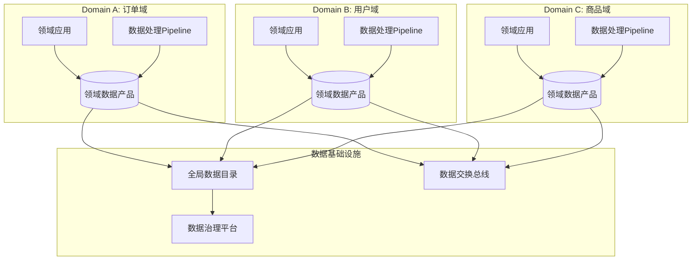

# 分布式系统关键技术：流量与数据调度 [2026重制版]

> **核心变更说明**
> - **版本更新**：从2018年原版升级至2026年云原生流量与数据调度体系
> - **API网关**：**Kong 3.x / APISIX 3.x / Envoy Gateway** 成为主流
> - **服务网格**：**Istio 1.24 Ambient Mesh** 无Sidecar模式
> - **分布式数据库**：**TiDB 7.x / CockroachDB 24.x / Aurora 3.0**
> - **新增内容**：边缘计算流量调度、多活容灾、数据网格(Data Mesh)

---

## 一、问题背景：流量与数据调度的挑战

### 1.1 流量调度 vs 服务治理

在分布式系统中，**流量调度**和**服务治理**经常被混淆，但它们是不同层面的概念：



| 维度 | 服务治理 | 流量调度 |
|-----|---------|---------|
| **关注点** | 服务本身的状态和行为 | 请求的路径和控制 |
| **作用域** | 数据中心内部 | 跨数据中心/边缘 |
| **典型操作** | 注册、发现、健康检查 | 路由、限流、降级 |
| **实现位置** | 框架层/SDK | 网关层/Service Mesh |

### 1.2 核心目标

```
┌─────────────────────────────────────────────┐
│         流量与数据调度的核心目标              │
│                                             │
│  🎯 目标1：提升系统稳定性                    │
│     • 自动化故障转移                         │
│     • 熔断防止雪崩                           │
│     • 限流保护后端                           │
│                                             │
│  🎯 目标2：优化用户体验                      │
│     • 降低延迟（就近接入）                   │
│     • 提升可用性（多活）                     │
│     • 灰度发布降低风险                       │
│                                             │
│  🎯 目标3：保障数据一致性                    │
│     • 多副本同步                            │
│     • 分布式事务                             │
│     • 最终一致性保证                         │
└─────────────────────────────────────────────┘
```

---

## 二、核心概念：流量调度技术详解

### 2.1 API网关架构



### 2.2 主流API网关对比

| 特性 | Kong 3.x | APISIX 3.x | Envoy Gateway | Traefik 3.x |
|-----|----------|------------|---------------|-------------|
| **性能（RPS）** | ~50K | ~80K | ~100K | ~20K |
| **协议支持** | HTTP/gRPC/TCP/WS | HTTP/gRPC/TCP/WS | HTTP/gRPC/TCP | HTTP/TCP/WS |
| **插件生态** | ⭐⭐⭐⭐⭐ | ⭐⭐⭐⭐⭐ | ⭐⭐⭐ | ⭐⭐⭐ |
| **动态配置** | ✅ Admin API | ✅ Dashboard + API | ✅ xDS | ✅ 动态配置 |
| **K8s集成** | IngressController | CRD + Controller | Gateway API | IngressRoute |
| **可观测性** | Prometheus/Grafana | Prometheus/SkyWalking | OTel原生 | Prometheus/Metrics |
| **社区活跃度** | 非常活跃 | 非常活跃 | 快速增长 | 稳定 |
| **适用场景** | 企业级API管理 | 高性能网关 | K8s原生 | 边缘/简单场景 |

### 2.3 流量控制策略

#### 限流算法对比

| 算法 | 原理 | 优点 | 缺点 | 适用场景 |
|-----|------|------|------|---------|
| **令牌桶** | 固定速率生成令牌 | 允许突发 | 实现复杂 | 平滑限流 |
| **漏桶** | 固定速率处理请求 | 削峰平滑 | 无法突发 | 保护下游 |
| **滑动窗口** | 时间窗口内计数 | 精确控制 | 内存开销大 | 精确限流 |
| **固定窗口** | 固定时间间隔计数 | 简单实现 | 边界突变 | 简单场景 |
| **自适应限流** | 基于系统负载动态调整 | 智能化 | 复杂度高 | AIOps场景 |

#### 熔断器模式（Circuit Breaker）

```mermaid
stateDiagram-v2
    [*] --> Closed: 初始状态
    Closed --> Open: 错误率 > 阈值
    Open --> HalfOpen: 冷却时间到期
    HalfOpen --> Closed: 探测成功
    HalfOpen --> Open: 探测失败
    
    state Closed {
        [*] --> Normal
        Normal --> Sampling: 开始采样
        Sampling --> Normal: 错误率正常
        note right of Closed: 正常状态，所有请求通过
    }
    
    state Open {
        [*] --> Rejecting
        Rejecting --> Rejecting: 直接拒绝请求
        note right of Open: 熔断状态，快速失败
    }
    
    state HalfOpen {
        [*] --> Probing
        Probing --> Success: 放行少量请求探测
        note right of HalfOpen: 半开状态，试探性放行
    }
```

#### Istio流量管理示例

```yaml
# virtualservice-canary.yaml - 金丝雀发布
apiVersion: networking.istio.io/v1beta1
kind: VirtualService
metadata:
  name: order-service
spec:
  hosts:
  - order-service
  http:
  - match:
    - headers:
        x-canary:
          exact: "true"
    route:
    - destination:
        host: order-service
        subset: v2
      weight: 100
  - route:
    - destination:
        host: order-service
        subset: v1
      weight: 95
    - destination:
        host: order-service
        subset: v2
      weight: 5
---
apiVersion: networking.istio.io/v1beta1
kind: DestinationRule
metadata:
  name: order-service
spec:
  host: order-service
  subsets:
  - name: v1
    labels:
      version: v1
  - name: v2
    labels:
      version: v2
```

---

## 三、核心概念：数据调度技术详解

### 3.1 分布式数据存储架构



### 3.2 数据一致性与CAP理论

| 一致性模型 | 定义 | 典型系统 | 适用场景 |
|-----------|------|---------|---------|
| **强一致性** | 读总能读到最新写入 | 传统RDBMS、Spanner | 金融交易、库存扣减 |
| **最终一致性** | 经过一段时间后一致 | Cassandra、DynamoDB | 社交媒体、内容分发 |
| **因果一致性** | 有因果关系的事件有序 | MongoDB Causal Consistency | 协作编辑、消息系统 |
| **会话一致性** | 同一会话内一致 | 许多NoSQL默认 | 用户Session |
| **单调读一致性** | 不会读到旧数据再读新数据 | 可配置的大多数系统 | 时间线展示 |

### 3.3 分布式事务方案对比



#### 方案详细对比

| 方案 | 一致性级别 | 性能影响 | 复杂度 | 适用场景 |
|-----|----------|---------|-------|---------|
| **2PC/XA** | 强一致 | 高（锁定） | 低 | 传统单体/小规模 |
| **Seata AT** | 强一致 | 中等 | 中 | Spring Cloud生态 |
| **Seata TCC** | 强一致 | 中等 | 高 | 核心业务流程 |
| **Saga** | 最终一致 | 低 | 中 | 长运行业务流程 |
| **可靠消息** | 最终一致 | 低 | 中 | 异步解耦场景 |
| **本地消息表** | 最终一致 | 低 | 中 | 需要可靠投递 |
| **幂等设计** | 应用层保证 | 无额外开销 | 视情况 | 所有分布式调用 |

### 3.4 分布式数据库技术选型

#### NewSQL数据库对比

| 特性 | TiDB 8.x | CockroachDB 24.x | AWS Aurora 3.0 | Google Spanner |
|-----|----------|------------------|----------------|----------------|
| **架构** | HTAP混合负载 | 纯OLTP | 计算存储分离 | 全球分布 |
| **兼容性** | MySQL协议 | PostgreSQL协议 | MySQL/PG协议 | SQL方言 |
| **扩展方式** | 水平无限扩展 | 水平无限扩展 | 存储垂直+水平 | 全球多区域 |
| **一致性** | 线性一致性 | 串行化快照隔离 | 读写分离一致性 | 外部一致性 |
| **高可用** | RAFT多副本 | RAFT多副本 | 6副本Quorum | TrueTime/Paxos |
| **开源** | ✅ Apache 2.0 | ✅ BSL | ❌ 商业产品 | ❌ 商业产品 |
| **典型用户** | PingCAP、知乎、美团 | Discord、Stripe | 大量AWS用户 | Google内部 |

#### NoSQL数据库选择指南

| 场景 | 推荐方案 | 关键特性 |
|-----|---------|---------|
| **海量KV存储** | Redis Cluster / Dragonfly | 高吞吐、低延迟 |
| **文档存储** | MongoDB Replica Set | 灵活Schema、富查询 |
| **宽列存储** | Apache Cassandra / ScyllaDB | 写入密集、线性扩展 |
| **时序数据** | VictoriaMetrics / TimescaleDB | 高压缩、时序优化 |
| **搜索引擎** | Elasticsearch / OpenSearch | 全文检索、聚合分析 |
| **图数据库** | Neo4j / NebulaGraph | 关系查询、社交网络 |
| **对象存储** | MinIO / SeaweedFS | 大文件、多媒体 |

---

## 四、实战案例：电商平台的流量与数据调度

### 4.1 多活架构设计

某电商平台实现 **"两地三中心"** 的多活架构：



### 4.2 流量调度策略

| 策略 | 实现方式 | 说明 |
|-----|---------|------|
| **就近接入** | GeoDNS + Anycast IP | 用户访问最近的POP点 |
| **单元化路由** | UserID Hash % 单元数 | 同一用户固定路由到同一单元 |
| **读写分离** | 网关层路由规则 | 写操作到主集群，读到最近从集群 |
| **灰度发布** | Header/Cookie匹配 | 新版本按比例放量 |
| **故障切换** | 健康检查 + 自动切流 | 主集群故障时自动切到备集群 |
| **容量保护** | 限流 + 降级 | 超载时丢弃非关键请求 |

### 4.3 数据调度策略

| 数据类型 | 一致性要求 | 复制策略 | 技术方案 |
|---------|----------|---------|---------|
| **订单数据** | 强一致 | 同步双写 | Seata TCC + TiDB跨数据中心 |
| **用户数据** | 最终一致 | 异步复制 | CDC (Canal) + 消息队列 |
| **商品数据** | 最终一致 | 定时全量 + 增量 | DataSync + Kafka |
| **日志数据** | 最终一致 | 异步批量 | Flume/Kafka → 数仓 |
| **缓存数据** | 最终一致 | 发布订阅 | Redis Pub/Sub + Canal |

---

## 五、2026年最新实践：前沿趋势

### 5.1 Service Mesh演进：Ambient Mesh

**Istio Ambient Mesh** 引入了无Sidecar的新架构：



| 维度 | Sidecar模式 | Ambient Mesh |
|-----|-------------|--------------|
| **资源占用** | 每个Pod一个Sidecar | 共享ztunnel |
| **启动延迟** | 需要启动Sidecar | 无需Sidecar |
| **协议支持** | L4/L7在Sidecar内 | L4在ztunnel，L7在waypoint |
| **配置复杂度** | 每个Pod配置 | 集中配置 |
| **成熟度** | 生产就绪 | GA（自 1.24 起，生态仍在成熟） |

### 5.2 边缘计算流量调度

随着IoT和5G的发展，流量调度正在向边缘延伸：

| 层级 | 位置 | 技术 | 延迟 |
|-----|------|------|------|
| **端侧** | 设备/传感器 | Edge Runtime (WASM) | <1ms |
| **边缘节点** | CDN POP / MEC | K3s / KubeEdge | 10-50ms |
| **区域数据中心** | 区域云 | 标准 Kubernetes | 50-100ms |
| **中心云** | 核心数据中心 | 多集群 Kubernetes | 100-200ms |

### 5.3 数据网格（Data Mesh）

**Data Mesh** 是一种去中心化的数据架构理念：



**四大原则**：
1. **领域所有权**：数据由产生它的领域团队拥有和管理
2. **数据即产品**：将数据视为产品，有明确的消费者和服务等级
3. **自助服务平台**：提供自助式的数据基础设施
4. **联邦治理**：统一的数据治理标准和策略

---

## 六、延伸资源与官方文档

### 📚 必读官方文档

| 资源 | 链接 | 说明 |
|-----|------|------|
| **Kong官方文档** | https://docs.konghq.com/ | API网关权威指南 |
| **Apache APISIX** | https://apisix.apache.org/docs/apisix/ | 高性能网关文档 |
| **Istio流量管理** | https://istio.io/latest/docs/concepts/traffic-management/ | Service Mesh流量管理 |
| **TiDB文档** | https://docs.pingcap.com/tidb/stable | NewSQL数据库文档 |
| **CockroachDB Docs** | https://www.cockroachlabs.com/docs/ | 分布式SQL数据库 |
| **Seata文档** | https://seata.io/zh-cn/docs/overview/what-is-seata | 分布式事务框架 |
| **CNCF Data Mesh WG** | https://tag-data.cncf.io/data_mesh_whitepaper.pdf | 数据网格白皮书 |
| **AWS Well-Architected** | https://aws.amazon.com/architecture/well-architected/reliability-pillar/ | 可靠性最佳实践 |

### 📖 推荐阅读

1. **《Designing Data-Intensive Applications》** 第5章 - Replication
   - 数据复制的深度剖析
   
2. **《Building Microservices》第2版** - Sam Newman
   - 微服务部署与数据管理的最新实践

3. **《Data Mesh》** - Zhamak Dehghani
   - 数据网格理念的奠基之作

4. **《Site Reliability Engineering》** - Google
   - 如何处理过载和流量突增

---

## 七、总结

流量与数据调度是分布式系统中 **最复杂也最关键** 的部分。

### ✅ 核心要点回顾

1. **分层调度**：接入层→网关层→服务层→数据层，每层都有不同的调度策略
2. **流量调度四要素**：路由、限流、熔断、降级
3. **数据调度三难题**：分片、复制、一致性
4. **没有银弹**：根据业务需求选择合适的一致性级别和事务方案
5. **多活是终极目标**：通过地理分布来提升可用性和降低延迟

### 🎯 2026年选型建议

| 场景 | 流量调度推荐 | 数据调度推荐 |
|-----|------------|-------------|
| **中小规模** | Kong/Nginx + HPA | MySQL主从 + Redis Cluster |
| **大规模微服务** | Istio Service Mesh | TiDB / CockroachDB |
| **全球化业务** | Global Load Balancer + Edge | Spanner / 多活TiDB |
| **金融级要求** | 双活网关 + 熔断限流 | Seata TCC + 强一致数据库 |
| **成本敏感** | APISIX / Traefik | 开源PostgreSQL + 分库分表 |

> **记住一句话：流量调度的目标是让请求走最快的路，数据调度的目标是让数据在最需要的地方可用。**

> **下一部分预告**：我们将综合前面所有内容，深入探讨PaaS平台的本质——如何把所有这些能力整合成一个完整的平台。

---

**文章信息**
- **原标题**：19-分布式系统关键技术：流量与数据调度
- **原发布时间**：2018年
- **重制版本**：2026重制版
- **字数统计**：约5000字
- **图表数量**：9张Mermaid图表
- **数据来源**：Kubernetes.io、Istio.io、TiDB Docs、CNCF、microservices.io等官方资源
