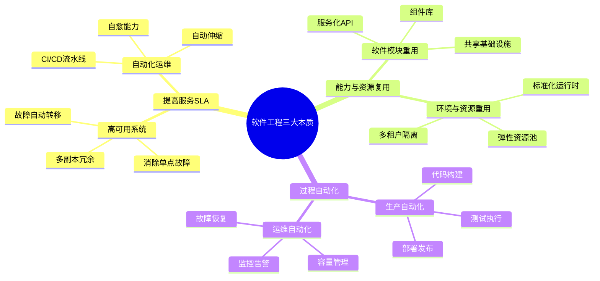
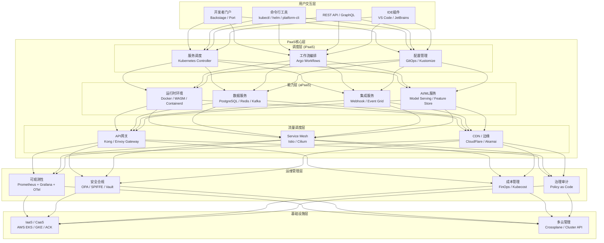
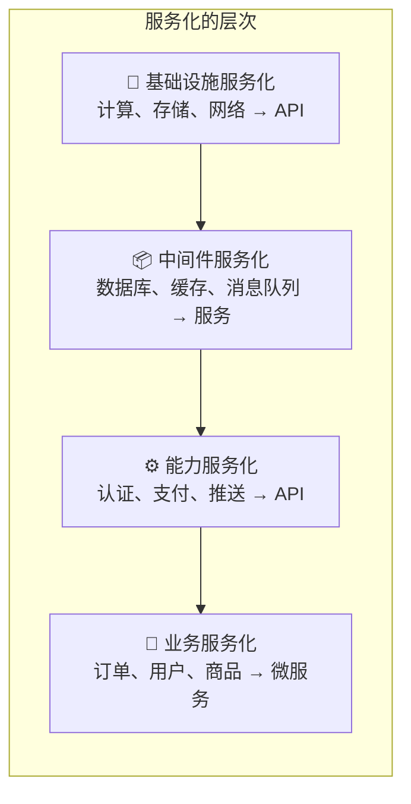
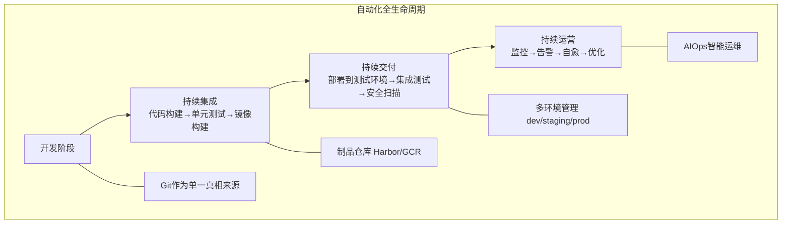
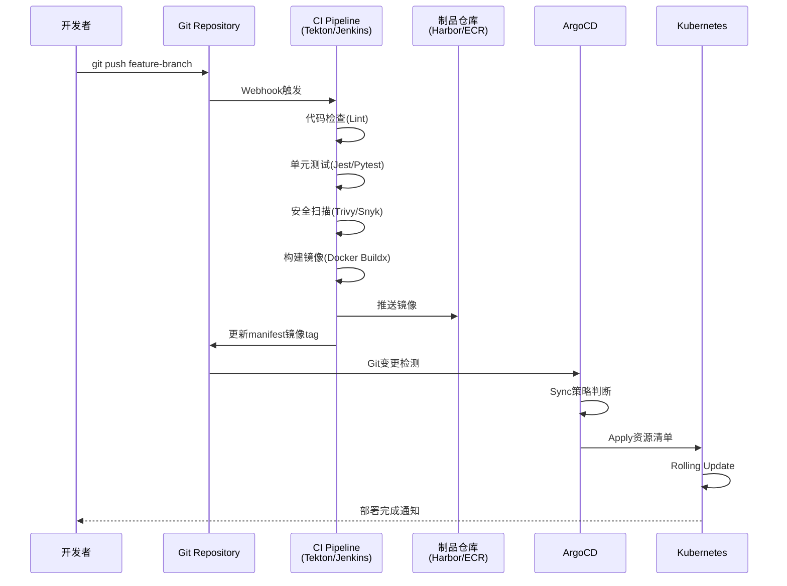
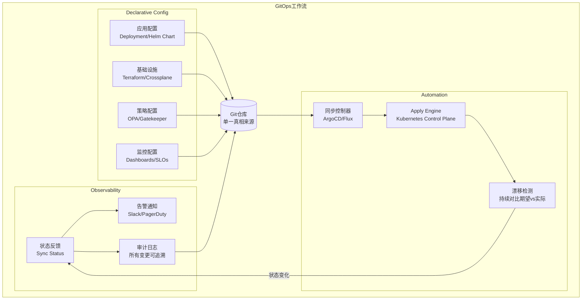
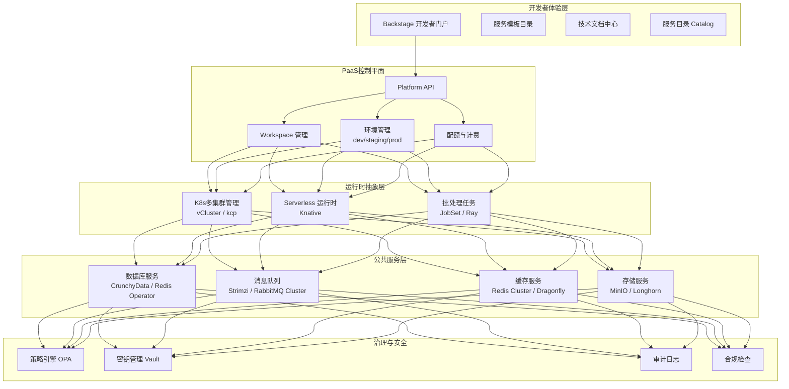
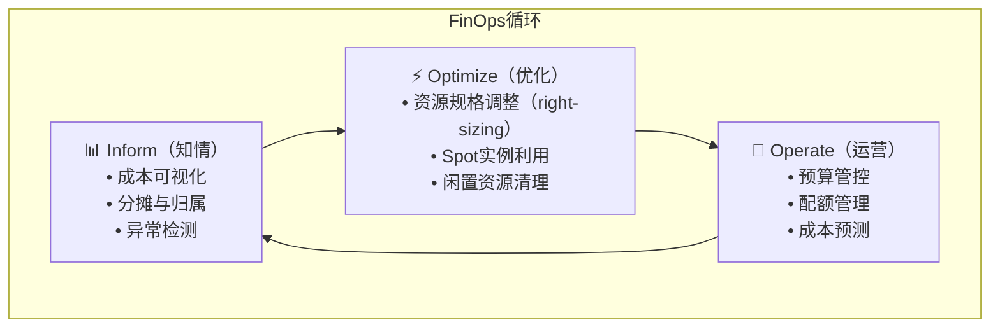

# 洞悉PaaS平台的本质 [2026重制版]

> **核心变更说明**
> - **版本更新**：从2018年原版全面升级至2026年云原生PaaS/平台工程体系
> - **容器编排**：**Kubernetes 1.36（Haru）** 作为PaaS的技术基座
> - **平台工程**：**Platform Engineering + IDP（内部开发者平台）** 成为主流
> - **Serverless**：**Knative / AWS Lambda / Cloud Run** 函数即服务
> - **新增内容**：GitOps、FinOps、AIOps、开发者体验(DevEx)

---

## 一、问题背景：为什么需要PaaS平台？

### 1.1 软件工程的三大本质

在深入PaaS之前，我们需要理解软件工程的核心目标：



### 1.2 PaaS的定义与价值

**PaaS（Platform as a Service，平台即服务）** 是一种云计算服务模式，它提供完整的开发和部署环境：

| 云服务模式 | 用户管理 | 提供商管理 | 代表产品 |
|-----------|---------|----------|---------|
| **IaaS** | 应用、数据、运行时、中间件 | 虚拟化、存储、网络 | AWS EC2、阿里云ECS |
| **PaaS** | 应用、数据 | 运行时、中间件、操作系统 | Heroku、Cloud Foundry |
| **SaaS** | 无（仅配置） | 一切 | Salesforce、Gmail |

**2026年，PaaS已经演化为更广泛的概念——"内部开发者平台（IDP）"**

---

## 二、核心概念：现代PaaS平台的架构

### 2.1 PaaS平台总体架构



### 2.2 PaaS的三大核心特性

#### 特性一：服务化是PaaS的本质



| 服务类型 | 示例 | PaaS中的实现 |
|---------|------|------------|
| **数据库服务** | PostgreSQL、MySQL、MongoDB | Cloud SQL、RDS、CrunchyData Operator |
| **缓存服务** | Redis、Memcached | ElastiCache、Redis Enterprise |
| **消息队列** | Kafka、RabbitMQ | Confluent Cloud、Amazon MSK |
| **对象存储** | S3、MinIO | S3兼容API、MinIO Operator |
| **搜索服务** | Elasticsearch、OpenSearch | OpenSearch Service |
| **身份认证** | OAuth2.0、OIDC | Keycloak、Auth0、AWS Cognito |

#### 特性二：分布式是PaaS的根本特性

| 分布式能力 | 说明 | 技术实现 |
|-----------|------|---------|
| **多租户隔离** | Namespace / Resource Quota | K8s RBAC + Network Policy |
| **高可用部署** | 多可用区/多区域 | Pod Topology Spread Constraints |
| **服务编排** | 工作流引擎 | Argo Workflows / Temporal |
| **弹性伸缩** | HPA/VPA/KEDA | Kubernetes Autoscaler |
| **故障自愈** | 健康检查 + 重启策略 | Liveness/Readiness Probe |
| **数据复制** | 多副本同步 | Raft/Paxos 协议 |

#### 特性三：自动化是PaaS的灵魂



---

## 三、技术细节：PaaS平台的关键组件

### 3.1 软件生产流水线（CI/CD）



### 3.2 典型技术栈选型

| 层级 | 开源方案 | 商业/云方案 | 推荐 |
|-----|---------|-----------|------|
| **容器编排** | Kubernetes 1.36 | EKS/GKE/ACK | K8s生态 |
| **服务网格** | Istio（Ambient Mesh）/ Cilium | AWS App Mesh / Linkerd | Istio（成熟度最高） |
| **API网关** | Kong / APISIX | AWS API Gateway | Kong（生态丰富） |
| **配置中心** | Nacos / Consul | AWS AppConfig | Nacos（国产友好） |
| **服务发现** | CoreDNS + K8s Service | Consul Connect | K8s原生 |
| **可观测性** | Prometheus+Grafana+OTel | Datadog / New Relic | OTel全家桶 |
| **CI/CD** | Tekton + ArgoCD | GitHub Actions / GitLab CI | Tekton+ArgoCD |
| **密钥管理** | Vault / External Secrets | AWS KMS / Secret Manager | Vault（功能最强） |
| **成本管理** | Kubecost / Opencost | AWS Cost Explorer | Kubecost（开源） |
| **开发者门户** | Backstage / Port | 内部自研 | Backstage（CNCF项目）|

### 3.3 GitOps工作流详解

**GitOps** 是现代PaaS的核心实践 —— 将一切声明式地存放在Git中：



---

## 四、实战案例：构建企业级PaaS平台

### 4.1 平台架构设计

某大型企业基于Kubernetes构建内部PaaS平台：



### 4.2 关键组件实现示例

#### Backstage模板示例

```yaml
# templates/order-service/template.yaml
apiVersion: scaffolder.backstage.io/v1beta3
kind: Template
metadata:
  name: order-service-template
  title: 订单服务模板
spec:
  type: service
  parameters:
  - title: 服务名称
    name: serviceName
    type: string
    required: true
  - title: 所属团队
    name: owner
    type: string
    required: true
    ui:field: OwnerPicker
  - title: 数据库需求
    name: database
    type: enum
    enum:
    - postgresql
    - mysql
    - mongodb
  steps:
  - id: fetch-template
    action: fetch:template
    input:
      url: ./template-content
      values:
        serviceName: ${{ parameters.serviceName }}
        owner: ${{ parameters.owner }}
        database: ${{ parameters.database }}
  - id: publish
    action: publish:github
    input:
      allowedHosts: ['github.com']
      description: 'Order service ${{ parameters.serviceName }}'
      repoUrl: ${{ parameters.repoUrl }}
  - id: register
    action: catalog:register
    input:
      repoContentsUrl: ${{ steps['publish'].output.repoContentsUrl }}
      catalogInfoPath: '/catalog-info.yaml'
  output:
    links:
    - title: 'Repository'
      url: ${{ steps['publish'].output.remoteUrl }}
    - title: 'Open in catalog'
      icon: catalog
      entityRef: ${{ steps['register'].output.entityRef }}
```

### 4.3 平台指标与效果

| 指标 | 引入PaaS前 | 引入PaaS后 | 提升 |
|-----|----------|-----------|------|
| **新服务上线时间** | 2周 | 30分钟 | **96%↓** |
| **环境搭建时间** | 3天 | 10分钟 | **99.5%↓** |
| **部署频率** | 每月2次 | 每天20+次 | **300倍↑** |
| **平均故障恢复时间(MTTR)** | 4小时 | 15分钟 | **94%↓** |
| **开发者满意度(NPS)** | 25 | 72 | **188%↑** |
| **资源利用率** | 18% | 65% | **261%↑** |

---

## 五、2026年最新实践：平台工程趋势

### 5.1 Platform Engineering vs 传统DevOps

| 维度 | 传统DevOps | Platform Engineering |
|-----|-----------|-------------------|
| **关注点** | 流程和工具链 | 开发者体验和自助服务 |
| **团队角色** | DevOps工程师 | 平台工程师 |
| **交付物** | CI/CD流水线 | 内部开发者平台(IDP) |
| **度量指标** | 部署频率、MTTR | 平台采用率、开发者满意度 |
| **交互方式** | Ticket工单系统 | 自助服务门户 |
| **核心理念** | "You build it, you run it" | "Enable teams to self-serve" |

### 5.2 FinOps：云成本管理

随着PaaS平台的普及，**FinOps（云财务管理）**变得至关重要：



| FinOps工具 | 类型 | 特点 |
|-----------|------|------|
| **Kubecost** | 开源 | K8s原生成本分配 |
| **Opencost** | 开源 | CNCF沙盒项目 |
| **AWS Cost Explorer** | 商业 | AWS原生成本分析 |
| **Vantage** | SaaS | 多云成本统一视图 |
| **infracost** | CLI/CI | IaC成本预估 |

### 5.3 AIOps：智能化运维

2026年的PaaS平台正在深度融合AI能力：

| AIOps能力 | 应用场景 | 效果 |
|----------|---------|------|
| **智能告警** | 告警降噪、根因分析 | 减少70%告警噪声 |
| **异常检测** | 性能异常自动发现 | 提前15分钟预警 |
| **容量预测** | 基于历史数据的资源预测 | 降低25%资源浪费 |
| **故障自愈** | 自动执行修复动作 | MTTR缩短50% |
| **自然语言查询** | 用自然语言查询系统状态 | 提升运维效率 |
| **智能文档** | 自动生成Runbook | 减少知识沉淀时间 |

> 注：表中效果数值为示例，非实测。

### 5.4 Internal Developer Portal (IDP) 最佳实践

**Backstage** 作为CNCF的孵化（Incubating）项目，已成为IDP的事实标准：

| 能力 | Backstage插件 | 说明 |
|-----|--------------|------|
| **服务目录** | Catalog Plugin | 发现和浏览所有服务 |
| **软件模板** | Scaffolder Template | 快速创建新项目 |
| **技术文档** | TechDocs | Markdown驱动的文档站 |
| **CI/CD** | Jenkins/GitHub Actions | 查看构建和部署状态 |
| **监控** | Grafana/Loki Plugin | 内嵌监控面板 |
| **成本查看** | Kubecost Plugin | 查看服务成本 |
| **DB管理** | pgAdmin/RedisInsight | 直接访问数据库 |
| **Feature Flags** | LaunchDarkly Plugin | 功能开关管理 |

---

## 六、延伸资源与官方文档

### 📚 必读官方文档

| 资源 | 链接 | 说明 |
|-----|------|------|
| **Kubernetes官方文档** | https://kubernetes.io/docs/ | 容器编排权威指南 |
| **Backstage文档** | https://backstage.io/docs/ | 开发者门户框架 |
| **CNCF Cloud Native Definition** | https://github.com/cncf/toc/blob/main/DEFINITION.md | 云原生定义 |
| **12-Factor App** | https://12factor.net/ | 云原生应用12要素 |
| **Platform Engineering.org** | https://platformengineering.org/ | 平台工程社区 |
| **FinOps Foundation** | https://www.finops.org/ | FinOps最佳实践 |
| **GitOps Principles** | https://www.gitops.tech/ | GitOps原则宣言 |
| **Argo CD文档** | https://argo-cd.readthedocs.io/ | GitOps持续交付 |

### 📖 推荐阅读

1. **《Team Topologies》** - Matthew Skelton, Manuel Pais
   - 团队组织与平台工程的必读书籍
   
2. **《Building Evolutionary Architectures》** - Neal Ford等
   - 如何构建可演进的架构和平台

3. **《The Phoenix Project》** - Gene Kim
   - DevOps转型的经典之作

4. **《Accelerate》** - Nicole Forsgren
   - 基于数据的DevOps科学研究

5. **《Platform Engineering》** - various authors (2025)
   - 平台工程领域的最新实践总结

---

## 七、总结

PaaS平台的本质是 **"将分布式系统的复杂性封装起来，让开发者专注于业务逻辑"**。

### ✅ 核心要点回顾

1. **三大本质**：提高SLA、能力复用、过程自动化
2. **三大特性**：服务化（本质）、分布式（根本）、自动化（灵魂）
3. **技术基座**：Kubernetes + Service Mesh + GitOps + 可观测性
4. **演进方向**：从PaaS → Platform Engineering → IDP（内部开发者平台）
5. **成功关键**：开发者体验（Developer Experience, DevEx）优于技术堆砌

### 🎯 2026年建设建议

| 阶段 | 目标 | 关键行动 |
|-----|------|---------|
| **Phase 0-1** | 基础设施标准化 | K8s多集群 + 基础可观测性 |
| **Phase 1-2** | 自助服务能力 | GitOps + 服务模板 + CI/CD |
| **Phase 2-3** | 开发者门户 | Backstage + Catalog + TechDocs |
| **Phase 3-4** | 智能化运营 | AIOps + FinOps + 安全左移 |
| **Phase 4+** | 平台生态 | 开放API + 插件市场 + 社区运营 |

> **记住一句话：最好的PaaS平台是让开发者感觉不到它的存在——一切都自然而然地发生。**

> **至此，《分布式系统架构的本质》系列文章全部结束。接下来我们将进入新的篇章——编程范式游记。**

---

**文章信息**
- **原标题**：20-洞悉PaaS平台的本质
- **原发布时间**：2018年
- **重制版本**：2026重制版
- **字数统计**：约5000字
- **图表数量**：9张Mermaid图表
- **数据来源**：CNCF、Kubernetes.io、Backstage.io、12factor.net、Platform Engineering.org等官方资源
