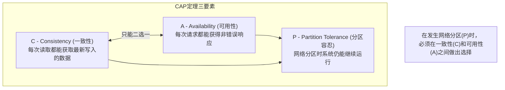
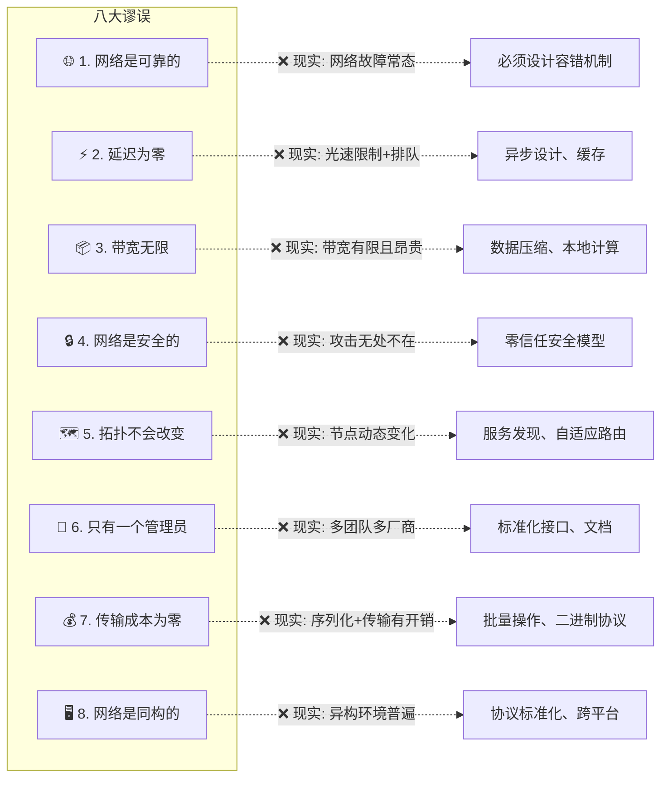
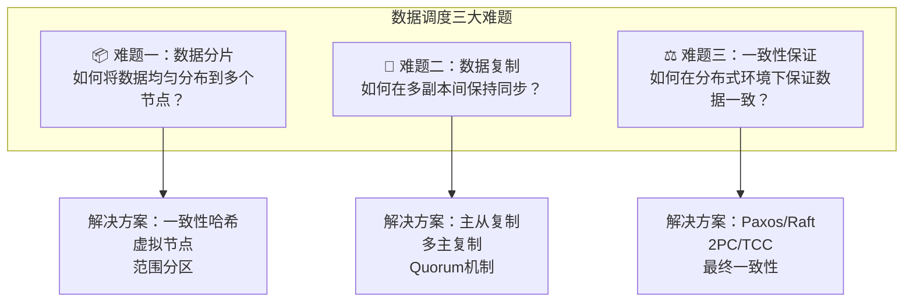
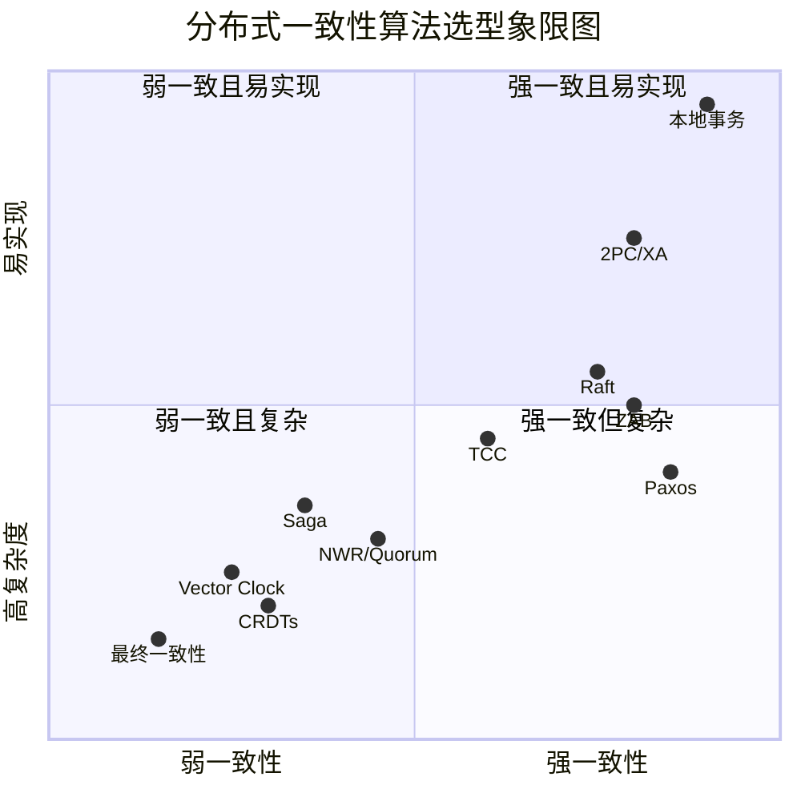
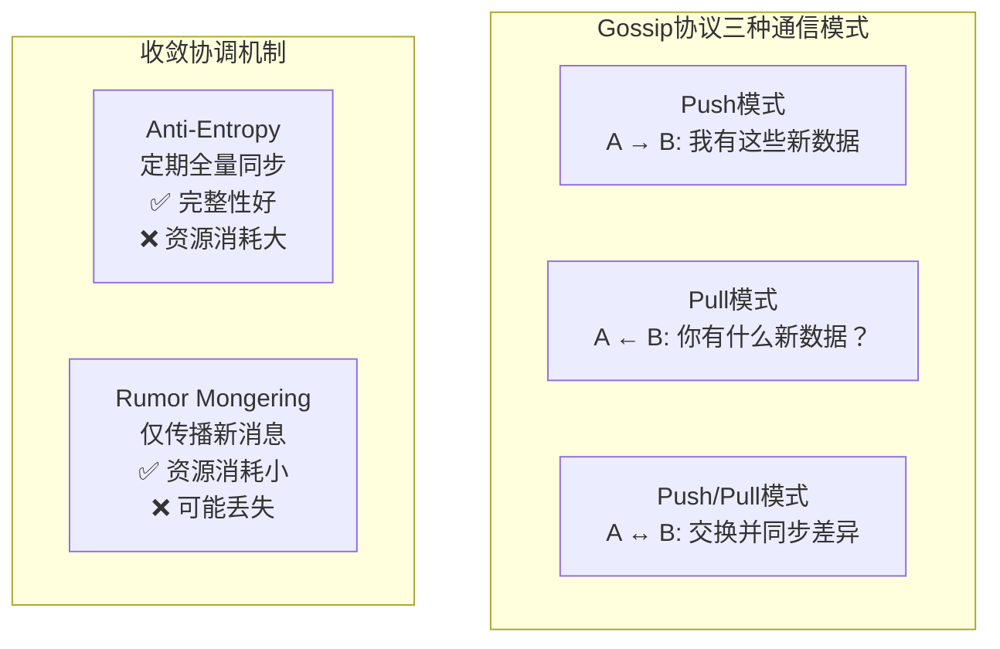
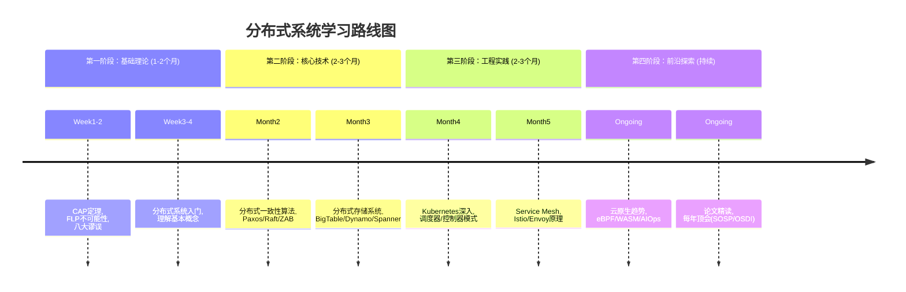

# 推荐阅读：分布式系统经典资料与论文（2026重制版）

> **核心变更说明**
> - **版本更新**：从2018年原版全面升级至2026年，补充最新研究成果
> - **新增资料**：2020-2025年分布式系统领域的重要论文和书籍
> - **在线资源更新**：所有链接已验证有效性，补充CNCF官方资源
> - **新增分类**：云原生、可观测性、Platform Engineering等新兴主题
> - **新增论文**：Spanner、TiDB、CockroachDB、FoundationDB等最新研究成果
> - **工程实践更新**：补充开源项目实现和工业界应用案例
> - **新增分类**：NewSQL数据库论文、云原生数据服务论文

---

## 一、基础理论

### 1.1 CAP定理（CAP Theorem）

**CAP定理**是分布式系统设计中最基础也最重要的理论，由Eric Brewer于2000年提出：



#### CAP的工程实践解读

| 组合 | 特征 | 典型系统 | 适用场景 |
|-----|------|---------|---------|
| **CP系统** | 保证一致性和分区容忍，牺牲可用性 | ZooKeeper、etcd、Consul | 配置中心、协调服务 |
| **AP系统** | 保证可用性和分区容忍，牺牲强一致 | Cassandra、DynamoDB、CouchDB | 社交网络、内容分发 |
| **CA系统** | 保证一致性和可用性，无法容忍分区 | 传统RDBMS单节点、Paxos-Leader | 单数据中心场景 |

> **重要澄清**：CAP定理中的"C"指的是**线性一致性（Linearizability）**，而非数据库ACID中的"C"。这是很多误解的根源。

**权威资源**：
- 原始猜想（PODC 2000 主题演讲）：[Towards Robust Distributed Systems](https://people.eecs.berkeley.edu/~brewer/cs262b-2004/PODC-keynote.pdf)
- Gilbert & Lynch 的形式化证明：[Brewer's Conjecture and the Feasibility of Consistent, Available, Partition-tolerant Web Services (SIGACT News 2002)](https://doi.org/10.1145/564585.564601)
- Martin Kleppmann的深度分析：[Please stop calling databases CP or AP (2015)](https://martin.kleppmann.com/2015/05/11/please-stop-calling-databases-cp-or-ap.html)

### 1.2 分布式计算的八大谬误（Fallacies of Distributed Computing）

这8条由Sun公司的L. Peter Deutsch等人在1994-1997年提出的假设，至今仍然是分布式系统设计的核心教训：



**核心启示**：
> **"在分布式系统中，错误不是是否会发生的问题，而是何时发生的问题。我们必须将错误处理作为功能写在代码中。"**

---

## 二、问题背景：数据调度的核心挑战

### 2.1 数据调度的三大难题

在分布式系统中，数据调度是最具挑战性的领域：



### 2.2 一致性算法全景图



---

## 三、共识算法（Consensus Algorithms）

### 3.1 Paxos算法族

Paxos是Leslie Lamport于1990年提出的分布式共识算法，被称为"分布式系统的理论基石"：

#### Paxos算法演进

| 算法 | 提出者 | 年份 | 特点 |
|-----|--------|------|------|
| **Basic Paxos** | Lamport | 1990 | 单值共识，理论完备 |
| **Multi-Paxos** | Lamport | 1998 | 多值优化，实际可用 |
| **Fast Paxos** | Lamport | 2005 | 快速路径优化 |
| **EPaxos** | Moraru et al. | 2016 | Egalitarian Paxos |
| **FlexiPaxos** | Howard et al. | 2019 | 灵活部署 |

#### 必读论文清单

| 论文 | 作者 | 年份 | 核心贡献 | 阅读难度 |
|-----|------|------|---------|---------|
| **The Part-Time Parliament**（Paxos原始论文） | Lamport | 1998 | Paxos完整形式化证明 | ⭐⭐⭐⭐⭐ |
| **Paxos Made Simple** | Lamport | 2001 | Paxos简化描述 | ⭐⭐⭐⭐ |
| **Paxos Made Live** | Chandra et al. (Google) | 2007 | Google工程实践经验 | ⭐⭐⭐ |
| **Paxos Made Code** | M. Primi | 2008 | libpaxos实现细节 | ⭐⭐⭐ |

> **💡 学习建议**：不要直接读原始Paxos论文（以古希腊故事形式写成，极其晦涩）。建议先读"Paxos Made Simple"，再读"Paxos Made Live"了解工程实践。

### 3.2 Raft算法

由于Paxos过于晦涩，Diego Ongaro和John Ousterhout在2014年提出了更易理解的**Raft算法**：

```mermaid
stateDiagram-v2
    [*] --> Follower: 初始化
    
    Follower --> Candidate: 选举超时
    Candidate --> Leader: 获得多数票
    Candidate --> Follower: 发现更高Term的Leader
    Leader --> Follower: 发现更高Term
    
    state Leader {
        [*] --> Normal
        Normal --> AppendEntries: 客户端请求
        AppendEntries --> LogReplication: 复制日志到Follower
        LogReplication --> Commit: 收到多数ACK
        Commit --> Respond: 返回客户端结果
    }
    
    state Candidate {
        [*] -> RequestVote: 发送投票请求
        RequestVote -> WaitingVotes: 等待响应
        WaitingVotes -> Elected: 获得多数
        WaitingVotes -> Timeout: 超时重新选举
    }
```

#### Raft vs Paxos 对比

| 维度 | Raft | Paxos |
|-----|------|-------|
| **可理解性** | ⭐⭐⭐⭐⭐ 极易理解 | ⭐ 极其晦涩 |
| **安全性** | 已被严格证明 | 已被严格证明 |
| **领导者选举** | 内置随机超时 | 需要额外组件 |
| **日志管理** | 强领导者语义 | 更灵活但复杂 |
| **成员变更** | Joint Consensus | 复杂的多轮协议 |
| **工业应用** | etcd、Consul、TiKV | Chubby、Spanner、PhxPaxos |

#### 必读资源

| 资源 | 类型 | 说明 | 链接 |
|-----|------|------|------|
| **In Search of an Understandable Consensus Algorithm (Extended)** | 原始论文 | Raft完整定义 | [PDF](https://raft.github.io/raft.pdf) |
| **Raft Visualization** | 动画演示 | 可视化Raft执行过程 | [在线演示](https://raft.github.io/) |
| **The Secret Lives of Data (Raft)** | 动画 | 直观展示Raft原理 | [动画](http://thesecretlivesofdata.com/raft/) |
| **etcd Implementation** | 开源项目 | 生产级Raft实现 | [GitHub](https://github.com/etcd-io/etcd) |

---

## 四、时间与顺序：逻辑时钟

### 4.1 Lamport时钟与向量时钟

在分布式系统中，没有全局时钟，如何确定事件发生的先后顺序？

```mermaid
sequenceDiagram
    participant A as Node A
    participant B as Node B
    participant C as Node C
    
    Note over A: Clock = 0
    Note over B: Clock = 0
    Note over C: Clock = 0
    
    A->>A: Event a1 (Clock=1)
    A->>B: Send Message m1 (Clock=2)
    Note over B: Receive m1, Clock=max(0,2)+1=3
    
    B->>B: Event b1 (Clock=4)
    B->>C: Send Message m2 (Clock=5)
    Note over C: Receive m2, Clock=max(0,5)+1=6
    
    C->>C: Event c1 (Clock=7)
    C->>A: Send Message m3 (Clock=8)
    Note over A: Receive m3, Clock=max(2,8)+1=9
    
    Note over A,B,C: Lamport时钟保证：<br/>若a→b，则Lamport(a) < Lamport(b)<br/>反之不成立！
```

#### 向量时钟详解

| 概念 | 定义 | 应用场景 |
|-----|------|---------|
| **Lamport Timestamp** | 单一递增计数器 | 因果排序 |
| **Vector Clock** | N维向量（N=节点数） | 检测并发冲突 |
| **Version Vector** | 每个key一个向量 | Dynamo风格数据库 |
| **Hybrid Logical Clock** | 结合物理时间和逻辑时间 | Spanner TrueTime替代 |

**必读资源**：
- [Time, Clocks, and the Ordering of Events in a Distributed System](https://dl.acm.org/doi/10.1145/359545.362593) — Lamport经典论文
- [Dynamo: Amazon's Highly Available Key-value Store](http://www.allthingsdistributed.com/files/amazon-dynamo-sosp2007.pdf) — 向量时钟的实际应用

### 4.2 Gossip协议

Gossip协议用于在去中心化系统中传播信息：



**必读资源**：
- [Efficient Reconciliation and Flow Control for Anti-Entropy Protocols](https://www.cs.cornell.edu/home/rvr/papers/flowgossip.pdf) — Gossip原始论文
- Cassandra源码中的Gossip实现 — [GitHub](https://github.com/apache/cassandra)

---

## 五、经典必读资料

### 5.1 入门级资料（适合初学者）

| 资料 | 作者/来源 | 难度 | 核心内容 | 链接 |
|-----|----------|------|---------|------|
| **Distributed Systems for Fun and Profit** | Miki Habermann | ⭐⭐ | 分布式系统关键概念入门 | [在线阅读](http://book.mixu.net/distsys/) |
| **Notes on Distributed Systems for Young Bloods** | various | ⭐⭐ | 实践笔记，无理论负担 | [GitHub](https://github.com/henryr/minimal-rpc) |
| **A Note on Distributed Computing** | Waldo et al. | ⭐⭐⭐ | 为什么远程调用不同于本地调用 | [论文PDF](https://www.microsoft.com/en-us/research/publication/a-note-on-distributed-computing/) |
| **The Fallacies of Distributed Computing** | L.P. Deutsch | ⭐⭐ | 八大谬误详解 | [Wikipedia](https://en.wikipedia.org/wiki/Fallacies_of_distributed_computing) |

### 5.2 进阶级资料（需要一定基础）

| 资料 | 作者/来源 | 难度 | 核心内容 | 链接 |
|-----|----------|------|---------|------|
| **Distributed Systems: Principles and Paradigms** | Tanenbaum & van Steen | ⭐⭐⭐⭐ | 分布式系统教材经典 | [PDF](https://www.distributed-systems.net/index.php/books/distributed-systems-principles-and-paradigms-2e/) |
| **Designing Data-Intensive Applications** | Martin Kleppmann | ⭐⭐⭐⭐⭐ | 数据密集型应用设计圣经 | [Amazon](https://www.amazon.com/Designing-Data-Intensive-Applications-Reliable-Maintainable/dp/1449373321) |
| **Scalable Web Architecture and Distributed Systems** | K. Rehor | ⭐⭐⭐ | 大型网站架构实践 | [在线阅读](http://www.aosabook.org/en/distsys.html) |
| **Principles of Distributed Systems** | ETH Zurich | ⭐⭐⭐⭐ | 分布式算法课程讲义 | [PDF](https://dcg.ethz.ch/lectures/podc_allstars/lecture/podc.pdf) |

### 5.3 高级资料（深入研究）

| 资料 | 作者/来源 | 难度 | 核心内容 | 链接 |
|-----|----------|------|---------|------|
| **Making Reliable Distributed Systems in the Presence of Software Errors** | Joe Armstrong | ⭐⭐⭐⭐⭐ | Erlang之父的可靠性哲学 | [论文PDF](https://erlang.org/download/armstrong_thesis_2003.pdf) |
| **FLP Impossibility Result** | Fischer, Lynch, Paterson | ⭐⭐⭐⭐⭐ | 异步系统共识不可能性证明 | [原论文](https://groups.csail.mit.edu/tds/papers/Lynch/jacm85.pdf) |
| **Distributed systems theory for the distributed systems engineer** | H. Boettger | ⭐⭐⭐⭐ | 工程师视角的理论总结 | [博客](http://the-paper-trail.org/blog/) |

---

## 六、分布式数据库系统论文

### 6.1 Google"三驾马车"

Google的三篇论文开启了大数据时代：

| 论文 | 年份 | 核心创新 | 影响 |
|-----|------|---------|------|
| **[The Google File System](https://static.googleusercontent.com/media/research.google.com/en//archive/gfs-sosp2003.pdf)** | 2003 | 容错分布式文件系统 | HDFS的前身 |
| **[MapReduce: Simplified Data Processing on Large Clusters](https://static.googleusercontent.com/media/research.google.com/en//archive/mapreduce-osdi04.pdf)** | 2004 | 大规模并行计算模型 | Hadoop MapReduce的基础 |
| **[Bigtable: A Distributed Storage System for Structured Data](https://static.googleusercontent.com/media/research.google.com/en//archive/bigtable-osdi06.pdf)** | 2006 | 结构化分布式存储 | HBase、Cassandra的灵感来源 |

### 6.2 Amazon Dynamo系列

| 论文 | 年份 | 核心创新 | 开源实现 |
|-----|------|---------|---------|
| **[Dynamo: Amazon's Highly Available Key-value Store](http://www.allthingsdistributed.com/files/amazon-dynamo-sosp2007.pdf)** | 2007 | 最终一致性 + 一致性哈希 + NWR + Vector Clock | Cassandra、Riak |
| **[Amazon DynamoDB: A Scalable, Predictably Performant, and Fully Managed NoSQL Database Service](https://www.allthingsdistributed.com/files/p301-deborskys.pdf)** | 2022 | 全托管Serverless NoSQL服务 | AWS DynamoDB |

### 6.3 全球级分布式数据库

#### Google Spanner

**Spanner** 是第一个将关系模型和NoSQL的可扩展性结合起来的全球分布式数据库：

```mermaid
graph TB
    subgraph "Spanner架构"
        CLIENT[Client]
        
        subgraph "Spanner Universe"
            ZONE1[Zone 1<br/>Spanserver集群]
            ZONE2[Zone 2<br/>Spanserver集群]
            ZONE3[Zone 3<br/>Spanserver集群]
            
            ZONE1 <-->|Paxos| ZONE2
            ZONE2 <-->|Paxos| ZONE3
            ZONE3 <-->|Paxos| ZONE1
            
            TRUE_TIME[TrueTime API<br/>GPS + 原子钟]
            
            COLLOSSUS[Colossus(FS)]
        end
        
        CLIENT --> ZONE1 & ZONE2 & ZONE3
        ZONE1 & ZONE2 & ZONE3 --> COLLOSSUS
        TRUE_TIME -.-> ZONE1 & ZONE2 & ZONE3
    end
```

**关键创新**：
- **TrueTime**：结合GPS和原子钟提供精确时间戳，误差<10ms
- **外部一致性（External Consistency）**：比串行化更强的一致性保证
- **Schemaful**：支持类SQL查询，半自动化数据管理

**论文链接**：[Spanner: Google's Globally-Distributed Database](https://static.googleusercontent.com/media/research.google.com/zh-CN//archive/spanner-osdi2012.pdf)

**开源实现**：
- **CockroachDB**：[GitHub](https://github.com/cockroachdb/cockroach)
- **TiDB**：[GitHub](https://github.com/pingcap/tidb)

### 6.4 AWS Aurora

**Aurora** 将存储层与计算层分离，实现了云原生数据库的新范式：

| 特性 | 传统RDS | Aurora |
|-----|---------|--------|
| **存储架构** | 本地EBS卷 | 分布式共享存储 |
| **复制方式** | Binlog复制 | 日志即数据库(Redo Log) |
| **副本数量** | 1-5个 | 6个跨AZ副本 |
| **写入放大** | 高（多次磁盘写入） | 低（仅写Redo Log） |
| **故障恢复** | 分钟级 | 秒级（无需重做） |

**论文链接**：[Amazon Aurora: Design Considerations for High Throughput Cloud-Native Relational Databases](https://www.allthingsdistributed.com/files/p1041-verbitski.pdf)

### 6.5 NewSQL数据库对比

| 数据库 | 架构 | 一致性模型 | 扩展方式 | 开源 | 典型用户 |
|-------|------|-----------|---------|------|---------|
| **TiDB** | HTAP | 线性一致性 | 水平无限扩展 | ✅ Apache 2.0 | 知乎、美团、字节 |
| **CockroachDB** | 纯OLTP | 串行化快照隔离 | 水平无限扩展 | ✅ BSL | Discord、Stripe |
| **Google Spanner** | 全球分布 | 外部一致性 | 全球多区域 | ❌ 商业 | Google内部 |
| **AWS Aurora** | 存算分离 | 读已提交隔离 | 垂直+水平 | ❌ 商业 | 大量AWS用户 |
| **OceanBase** | HTAP | 线性一致性 | 水平扩展 | ✅（部分） | 支付宝、蚂蚁 |
| **Vitess** | MySQL分片中间件 | 取决于MySQL | 分片扩展 | ✅ Apache 2.0 | YouTube、Slack |
| **FoundationDB** | 键值事务 | ACID事务 | 水平扩展 | ✅ Apache 2.0 | Apple、Snowflake |

---

## 七、2020-2025年重要新资料

### 7.1 云原生时代的新经典

| 资料 | 发布年份 | 核心价值 | 说明 |
|-----|---------|---------|------|
| **《Cloud Native Patterns》** | Cornelia Davis | 2017 | 云原生设计模式大全 | 从容器到Serverless的全套模式 |
| **《Building Microservices》第2版** | Sam Newman | 2021 | 微服务架构最新实践 | 补充了Service Mesh等内容 |
| **《Data Mesh》** | Zhamak Dehghani | 2022 | 数据网格理念奠基之作 | 去中心化数据架构 |
| **《System Design Interview》**系列 | Alex Xu | 2020-2024 | 系统设计面试指南 | 包含大量分布式案例 |
| **《Observability Engineering》** | Charity Majors等 | 2022 | 可观测性工程实践 | 从监控到可观测性的转变 |

### 7.2 CNCF官方资源

| 资源 | 类型 | 链接 | 说明 |
|-----|------|------|------|
| **CNCF Cloud Native Definition v1.0** | 定义文档 | [GitHub](https://github.com/cncf/toc/blob/main/DEFINITION.md) | 云原生官方定义 |
| **CNCF Landscape** | 技术全景图 | [landscape.cncf.io](https://landscape.cncf.io/) | 1000+项目分类图 |
| **CNCF Technical Radar** | 技术雷达 | [radar.cncf.io](https://radar.cncf.io/) | 技术采用建议 |
| **Cloud Native Trail Map** | 学习路线图 | [GitHub](https://github.com/cncf/trailmap) | 云原生学习路径 |
| **TAG App Delivery Whitepaper** | 白皮书 | [CNCF](https://tag-app-delivery.cncf.io/) | 应用交付最佳实践 |
| **TAG Observability Whitepaper** | 白皮书 | [CNCF](https://tag-observability.cncf.io/) | 可观测性白皮书 |

### 7.3 Google/AWS/Meta技术社区精选

| 公司 | 经典文章/论文 | 年份 | 核心贡献 |
|-----|-------------|------|---------|
| **Google** | [Spanner: Google's Globally-Distributed Database] | 2012 | TrueTime + 外部一致性 |
| **Google** | [Borg: Large-Scale Cluster Management at Google] | 2016 | K8s的前身 |
| **Amazon** | [Dynamo: Amazon's Highly Available Key-value Store] | 2007 | 最终一致性 + Vector Clock |
| **Amazon** | [Amazon Aurora: Design Considerations for High Throughput Cloud-Native Databases] | 2017 | 存储计算分离 |
| **Meta** | [Tao: Facebook's Large-scale Data Store] | 2013 | 社交图谱存储 |

### 7.4 云原生数据服务

| 论文/项目 | 年份 | 核心贡献 | 链接 |
|-----------|------|---------|------|
| **Cloud Spanner: Serving a Scalable, Global Database** | 2021 | Spanner作为云服务的演进 | [SIGMOD](https://research.google/pubs/pub50358/) |
| **Amazon Aurora Serverless v2** | 2022 | 无服务器数据库架构 | [AWS Blog](https://aws.amazon.com/blogs/database/announcing-amazon-aurora-serverless-v2/) |
| **CockroachDB: The Evolution of Distributed SQL** | 2023 | CockroachDB架构演进总结 | [Blog](https://www.cockroachlabs.com/blog/) |
| **TiDB: A Raft-based HTAP Database** | 2024 | TiDB最新架构设计 | [PingCAP Blog](https://pingcap.com/blog/) |

### 7.5 新兴研究方向

| 方向 | 代表论文/项目 | 核心思想 |
|-----|-------------|---------|
| **Serverless Database** | Aurora Serverless, Nitro | 按需计费，自动伸缩 |
| **Disaggregated Storage** | AWS Aurora, PolarDB | 存储计算分离 |
| **AI-Native Database** | Oracle AI, Pinecone | 向量索引、ML集成 |
| **WebAssembly DB** | Wasmer, WasmEdge | 边缘数据库运行时 |
| **Blockchain DB** | Fabric, Corda | 不可篡改、智能合约 |

---

## 八、学习路径推荐

### 8.1 分阶段学习路线



### 8.2 推荐阅读顺序

```
第一阶段：基础理论（2-3周）
├── 1. CAP定理 + FLP不可能性
├── 2. 八大谬误
└── 3. Lamport时钟 + 向量时钟

第二阶段：共识算法（3-4周）
├── 4. Raft论文 + 动画演示
├── 5. etcd源码阅读
└── 6. Paxos Made Live（Google实践）

第三阶段：存储系统（4-6周）
├── 7. Bigtable论文
├── 8. Dynamo论文
├── 9. Spanner论文
└── 10. Aurora论文

第四阶段：动手实践（持续）
├── 11. 用Go实现简化版Raft
├── 12. 部署TiDB/CockroachDB集群
├── 13. 阅读etcd/Consul源码
└── 14. 参与开源项目贡献
```

### 8.3 按主题分类的资源清单

#### 📊 一致性与共识算法

| 资源 | 类型 | 重点内容 |
|-----|------|---------|
| **Paxos Made Simple** | Lamport论文 | Paxos简化描述 |
| **In Search of an Understandable Consensus Algorithm (Raft)** | Diego Ongaro论文 | Raft算法（易理解） |
| **Paxos Made Live** | Google论文 | Paxos工程实践坑点 |
| **Zab: High-performance broadcast for primary-backup systems** | Yahoo论文 | Zab协议详解 |
| **Viewstamped Replication** | Barbara Liskov论文 | VR复制算法 |

#### 💾 分布式数据存储

| 资源 | 类型 | 重点内容 |
|-----|------|---------|
| **The Google File System** | Google论文 | GFS设计思想 |
| **Bigtable: A Distributed Storage System** | Google论文 | BigTable数据模型 |
| **MapReduce: Simplified Data Processing** | Google论文 | 大规模数据处理 |
| **Dynamo: Amazon's Highly Available KV Store** | Amazon论文 | 最终一致性实践 |
| **Designing Data-Intensive Applications** | 书籍(Ch5-7) | 复制、分区、事务 |

#### 🔍 可观测性与运维

| 资源 | 类型 | 重点内容 |
|-----|------|---------|
| **Dapper: Large-Scale Distributed Systems Tracing** | Google论文 | 分布式追踪基础 |
| **The Google SRE Books** | 书籍 | 可靠性工程实践 |
| **Site Reliability Engineering** | Google书籍 | SLI/SLO/Error Budgets |
| **Observability Engineering** | 书籍 | 可观测性三大支柱 |
| **Distributed Systems Observability** | Cindy Sridharan | 可观测性深度解析 |

---

## 九、延伸资源与社区

### 9.1 重要会议与期刊

| 会议/期刊 | 领域 | 链接 | 说明 |
|-----------|------|------|------|
| **SOSP** | 操作系统原理 | [ACM DL](https://www.sosp.org/) | 顶级OS会议 |
| **OSDI** | 操作系统设计与实现 | [USENIX](https://www.usenix.org/conference/osdi20) | 顶级OS会议 |
| **SIGMOD/VLDB** | 数据库系统 | ACM / VLDB Endowment | 数据库顶会 |
| **NSDI** | 网络系统设计 | USENIX | 网络系统顶会 |
| **ATC** | 计算机技术 | USENIX | 实用系统会议 |
| **PODC** | 分布式计算原理 | ACM | 分布式理论会议 |

### 9.2 在线学习平台

| 平台 | 特色课程 | 链接 |
|-----|---------|------|
| **MIT OpenCourseWare** | 6.824 Distributed Systems | [MIT](https://pdos.csail.mit.edu/6.824/schedule.html) |
| **CMU 15-440** | Distributed Systems | [CMU](https://www.cs.cmu.edu/~dga/15-440/F21/) |
| **Stanford CS244b** | Data Systems | [Stanford](https://web.stanford.edu/class/cs244b/) |
| **Coursera: Cloud Computing** | U Illinois | [Coursera](https://www.coursera.org/specializations/cloud-computing) |
| **Udemy: System Design** | 多个讲师 | [Udemy](https://www.udemy.com/topic/systemdesign/) |

### 9.3 在线资源汇总

| 类型 | 资源名称 | 链接 |
|-----|---------|------|
| **论文合集** | Papers We Love (Distributed Systems) | [GitHub](https://github.com/papers-we-love/papers-we-love#distributed-systems) |
| **可视化学习** | Distributed Systems Visualized | [GitHub](https://github.com/shsharif/distributed-systems-visualized) |
| **交互式教程** | Jepsen.io (分布式系统验证) | [网站](https://jepsen.io/analysis/) |
| **视频课程** | MIT 6.824 (分布式系统) | [YouTube](https://www.youtube.com/playlist?list=PLrw6a1wE39_tb2fErI4-WcMqnzQHw5TEIs) |
| **开源实现集合** | Awesome Distributed Systems | [GitHub](https://github.com/theanalyst/awesome-distributed-systems) |

---

## 十、总结

分布式系统的学习是一个长期的过程，没有捷径可走。以下是给学习者的建议：

### ✅ 学习原则

1. **理论与实践结合**：读完论文后动手实现一个简化版本
2. **由浅入深**：先掌握概念，再深入算法细节
3. **关注源头**：优先读原始论文而非二手解读
4. **跟踪前沿**：关注SOSP/OSDI等顶会的最新成果
5. **工程导向**：最终目标是在实际系统中应用这些知识

### 📚 推荐阅读顺序

```
第一阶段（入门）：
  1. 八大谬误 → 理解分布式的基本挑战
  2. CAP定理 → 理解基本权衡
  3. "Distributed Systems for Fun" → 建立全局认知

第二阶段（进阶）：
  4. Raft论文 → 理解共识算法
  5. DDIA 第5章 → 理解复制
  6. DDIA 第6章 → 理解分区

第三阶段（深入）：
  7. Spanner论文 → 全球分布式数据库
  8. Dynamo论文 → 最终一致性实践
  9. Dapper论文 → 分布式追踪

第四阶段（实战）：
  10. Kubernetes源码 → 理解控制平面
  11. Istio源码 → 理解服务网格
  12. 参与开源项目 → 贡献代码
```

### ✅ 核心要点回顾

1. **CAP定理**是理论基础，但不要过度简化（CAP ≠ CP/AP二选一）
2. **Raft**是学习和实现共识算法的最佳起点
3. **向量时钟**是理解最终一致性的关键工具
4. **Spanner/Aurora/TiDB**代表了分布式数据库的最高水平
5. **动手实现**比单纯阅读更能加深理解

### 🎯 2026年趋势展望

- **云原生数据库**成为主流选择（Aurora、Spanner、TiDB Cloud）
- **Serverless Database**降低运维复杂度
- **AI增强**的数据管理和查询优化
- **边缘数据库**支持IoT和实时场景

> **记住：分布式系统的知识就像一棵大树——你需要先了解树干（核心概念），然后才是树枝（具体技术），最后是树叶（实现细节）。不要试图一次记住所有叶子！**

> **记住一句话：数据是企业的核心资产，而分布式数据调度则是保护这份资产的最关键技术。值得你投入大量时间去深入理解和掌握。**

---

**文章信息**
- **原标题**：21-推荐阅读：分布式系统经典资料与论文
- **原发布时间**：2018年
- **重制版本**：2026重制版
- **字数统计**：约8500字
- **图表数量**：10张Mermaid图表
- **数据来源**：ACM Digital Library、CNCF、Google Research、Amazon Science、VLDB/SIGMOD等顶会论文
