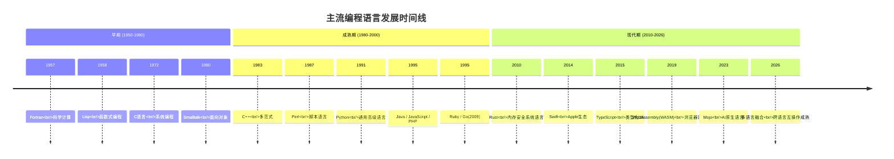
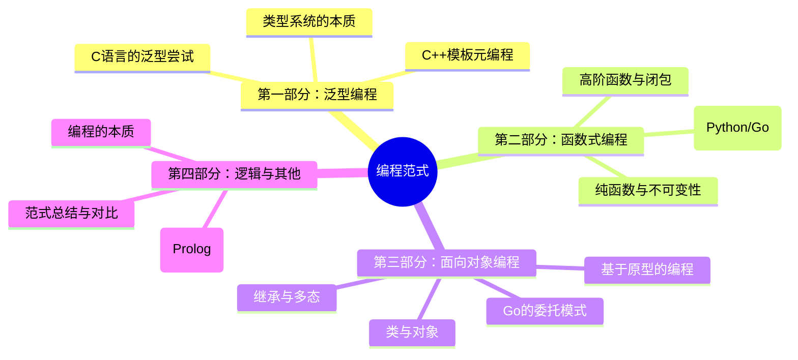
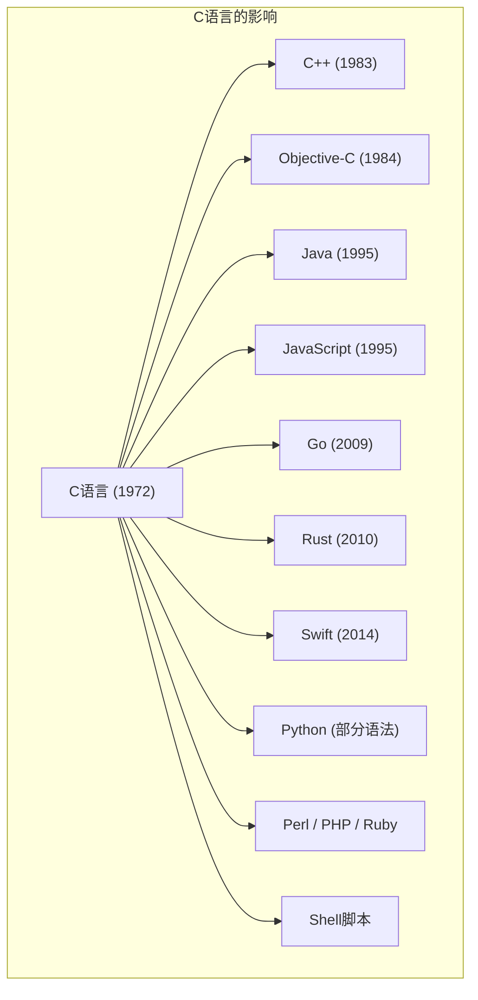
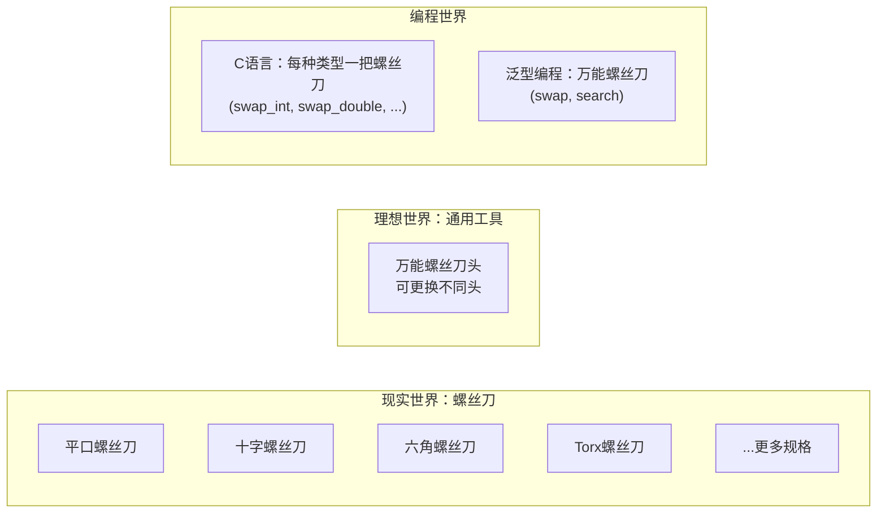
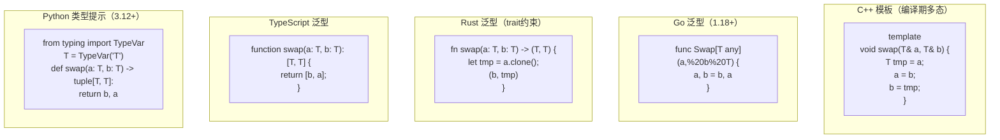
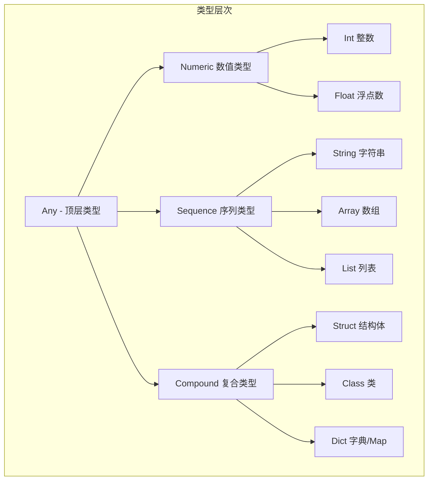

# 编程范式游记（1）- 起源 [2026重制版]

> **核心变更说明**
> - **版本更新**：从2018年原版升级至2026年，补充现代编程语言发展
> - **语言更新**：新增 **Rust、Go 1.24+、TypeScript 5.x、Python 3.13+** 等最新语言特性
> - **新增内容**：WASM/WebAssembly、LLVM IR、类型系统演进、泛型编程新发展
> - **实战案例更新**：使用2026年主流语言示例

---

## 一、序言：为什么需要了解编程范式？

### 1.1 当前的编程语言现状

在2026年，编程语言的生态已经极其丰富：



### 1.2 为什么学习编程范式？

> **"编程范式就是程序的指导思想，它代表了这门语言的设计方向。"**

| 好处 | 说明 |
|-----|------|
| **🧠 提升抽象思维** | 学会从更高层次思考问题 |
| **🔍 理解语言本质** | 知道为什么语言这样设计 |
| **🛠️ 选择合适工具** | 根据问题选择最合适的范式/语言 |
| **💡 写出更好的代码** | 运用多种范式的优势 |
| **🚀 快速学习新语言** | 掌握本质后举一反三 |

### 1.3 本系列文章结构

本系列将探讨以下编程范式：



---

## 二、先从C语言开始

### 2.1 C语言的历史地位

C语言诞生于1972年，由Dennis Ritchie在贝尔实验室开发。它是现代编程语言的基石：



> **据统计，世界上超过 70% 的软件系统直接或间接地受到C语言的影响。**

### 2.2 C语言的核心特性

| 特性 | 说明 | 影响 |
|-----|------|------|
| **静态弱类型** | 需要声明类型，但有隐式转换 | 灵活但容易出错 |
| **结构体(struct)** | 自定义复合数据类型 | 数据组织的基础 |
| **指针** | 直接操作内存地址 | 强大但危险 |
| **过程式编程** | 函数 + 顺序执行 | 简单直观 |
| **手动内存管理** | malloc/free | 效率高但易泄漏 |
| **编译预处理** | 宏定义、条件编译 | 跨平台能力 |

### 2.3 C语言的伟大之处

```
┌─────────────────────────────────────────────┐
│           C语言的伟大之处                     │
│                                             │
│  ✅ "信任程序员"                             │
│     • 不阻止你做任何底层操作                  │
│     • 给予最大的自由度                        │
│                                             │
│  ✅ "保持最小和简单"                          │
│     • 语言核心只有约30个关键字                 │
│     • 没有隐藏的魔法                          │
│                                             │
│  ✅ "极致的性能"                              │
│     • 接近硬件的运行效率                      │
│     • 可预测的行为                            │
│                                             │
│  ✅ "可移植性"                                │
│     • 一次编写，到处编译                       │
│     • 从嵌入式到超级计算机                    │
└─────────────────────────────────────────────┘
```

> **C语言是"高级语言中的汇编语言"——它在提供高层抽象的同时，仍然保留了对底层细节的控制权。**

---

## 三、C语言的泛型困境

### 3.1 问题引入：swap函数

让我们从最简单的交换两个变量开始：

#### 版本1：特定类型的swap

```c
// 只能用于int类型
void swap_int(int* x, int* y) {
    int tmp = *x;
    *x = *y;
    *y = tmp;
}

// 如果需要交换double呢？再写一个？
void swap_double(double* x, double* y) {
    double tmp = *x;
    *x = *y;
    *y = tmp;
}
```

**问题**：
- ❌ 每种类型都要写一个函数
- ❌ 代码重复严重
- ❌ 无法应对未来可能出现的新类型

#### 版本2：使用void*实现泛型

```c
// 泛型版本 - 使用void*
void swap(void* x, void* y, size_t size) {
    char tmp[size];          // VLA: 变长数组(C99)
    memcpy(tmp, y, size);   // 内存拷贝
    memcpy(y, x, size);
    memcpy(x, tmp, size);
}

// 使用示例
int a = 10, b = 20;
swap(&a, &b, sizeof(int));  // 必须手动传入size！

double c = 3.14, d = 2.71;
swap(&c, &d, sizeof(double));
```

**问题依旧存在**：
- ❌ 需要额外传入 `size` 参数（因为void*丢失了类型信息）
- ❌ 使用 `memcpy` 进行内存拷贝（无法调用拷贝构造函数等复杂操作）
- ❌ 没有类型安全（可以传入错误的size）

#### 版本3：使用宏

```c
// 宏版本的swap
#define SWAP(x, y, type) { \
    type _tmp = (x);       \
    (x) = (y);             \
    (y) = _tmp;            \
}

// 使用
SWAP(a, b, int);     // 展开为具体的代码
SWAP(c, d, double);   // 每种类型生成一份代码
```

**宏的问题**：
- ❌ **重复执行问题**：`SWAP(i++, j++, int)` 会导致i和j被累加两次！
- ❌ **作用域污染**：`_tmp`变量可能和外层冲突
- ❌ **调试困难**：宏展开后的代码难以调试
- ❌ **没有类型检查**：编译器无法检查类型匹配

### 3.2 更复杂的例子：search函数

如果问题只是swap还好，但当我们面对更复杂的算法时，C语言的泛型缺陷会更加明显：

```c
// 泛型的search函数
int search(
    void* array,           // 数组起始地址
    size_t length,         // 数组长度
    void* target,          // 目标值
    size_t elem_size,      // 元素大小 ← 新增参数
    int (*cmp)(void*, void*) // 比较函数 ← 新增参数
) {
    for (size_t i = 0; i < length; i++) {
        void* elem = (char*)array + elem_size * i;  // 手动计算地址
        if (cmp(elem, target) == 0) {
            return (int)i;
        }
    }
    return -1;  // 未找到
}
```

**接口变得越来越复杂**：
- 原始：`search(int* arr, int len, int target)`
- 泛型后：`search(void* arr, size_t len, void* target, size_t elem_size, cmp_fn)`

这就是C语言泛型的代价——**用复杂性换取通用性**。

### 3.3 现实世界的类比



---

## 四、编程范式的解决思路

### 4.1 不同范式的解决方案

| 范式 | 解决方式 | 代表语言 | 示例 |
|-----|---------|---------|------|
| **模板/C++** | 编译时类型推导 | C++ | `template<typename T> void swap(T& a, T& b)` |
| **泛型/Java** | 类型擦除 | Java, Go 1.18+ | `<T> void swap(T a, T b)` |
| **动态类型** | 运行时鸭子类型 | Python, JavaScript | 直接使用，无需声明类型 |
| **类型类/Haskell** | 类型约束 | Haskell, Rust | `fn swap<T: Copy>(a: T, b: T) -> (T, T)` |

### 4.2 各语言的泛型对比（2026版）



### 4.3 2026年各语言泛型能力对比

| 语言 | 泛型机制 | 编译期检查 | 运行时开销 | 特殊能力 |
|-----|---------|-----------|-----------|---------|
| **C++** | Templates | ✅ 完整 | ⚪ 无（单态化） | 模板元编程、SFINAE、Concepts(C++20) |
| **Rust** | Generics + Traits | ✅ 完整 | ⚪ 无（单态化） | 零成本抽象、关联类型 |
| **Go 1.21+** | Generics | ✅ 较完整 | 🟡 少量（接口方法） | 类型参数、类型约束 |
| **Java** | Erasure Generics | 🟡 部分（擦除） | 🟡 有（装箱） | 通配符、Bounded Types |
| **C#** | Reified Generics | ✅ 完整 | ⚪ 无（JIT特化） | 协变/逆变、where约束 |
| **TypeScript** | Type Parameters | ✅ 完整（编译时） | ⚪ 无（擦除） | 条件类型、映射类型 |
| **Python 3.12+** | Type Hints + Generics | 🔵 IDE/检查器 | 🟡 动态类型开销 | TypeVar、GenericAlias |
| **Haskell** | Parametric Polymorphism | ✅ 完整 | ⚪ 无 | 类型类、Higher-kinded types |

---

## 五、类型系统：泛型的理论基础

### 5.1 什么是类型？

**类型（Type）** 是值的集合以及对这些值允许的操作：



### 5.2 类型系统的分类

| 分类维度 | 类型 | 特点 | 示例语言 |
|---------|------|------|---------|
| **强弱** | 强类型 | 隐式转换受限 | Python, Go, Rust |
| | 弱类型 | 允许隐式转换 | JavaScript, PHP, C |
| **静动态** | 静态类型 | 编译时检查 | C++, Java, Rust, Go |
| | 动态类型 | 运行时检查 | Python, JavaScript, Ruby |
| **显隐** | 显式类型 | 必须声明类型 | C, Java, Rust |
| | 隐式类型 | 自动推断 | Go, Kotlin, TypeScript |
| **名义/结构** | 名义类型 | 名称决定类型兼容性 | Java, C#, Rust |
| | 结构类型 | 结构决定类型兼容性 | Go interfaces, OCaml, TypeScript |
| **类型安全** | 安全类型 | 阻止未定义行为 | Rust, Haskell |
| | 不安全类型 | 允许未定义行为 | C, C++ (unsafe), Assembly |

### 5.3 类型推断（Type Inference）

现代语言普遍支持类型推断——让编译器自动推断类型：

```python
# Python 3.12+ 类型推断示例
from typing import TypeVar

T = TypeVar('T')

def identity(x: T) -> T:
    """返回输入值本身"""
    return x

# 编译器/IDE能推断：
result1 = identity(42)        # result1 的类型被推断为 int
result2 = identity("hello")  # result2 的类型被推断为 str
result3 = identity([1,2,3])  # result3 的类型被推断为 list[int]

# Hindley-Milner 类型推断算法
# 这是函数式语言（ML, Haskell, OCaml, F#）的核心技术
# 也影响了 Rust 和 TypeScript 的类型系统
```

---

## 六、2026年编程范式的新发展

### 6.1 WebAssembly (WASM)：新的运行时

**WebAssembly (WASM)** 正在改变编程范式的边界：

| 特性 | 传统容器(Docker) | WebAssembly (WASM) |
|-----|-----------------|-------------------|
| **启动时间** | 秒级 | **毫秒级** |
| **内存占用** | 50-100MB | **1-10MB** |
| **安全性** | 进程隔离 | **沙箱隔离**（更安全） |
| **可移植性** | 需要OS支持 | **真正的跨平台** |
| **冷启动** | 较慢 | **极快**（适合Serverless） |
| **语言支持** | 任意 | **Rust/Go/AssemblyScript/C++** |

**代表项目**：
- **WasmEdge**：边缘计算WASM运行时
- **Wasmtime**：通用WASM运行时
- **Runwasi**：containerd 的 WASM shim，在 Kubernetes 中直接运行 WASM 工作负载（原 Krustlet 已归档）
- **Proxy-Wasm**：Envoy/WASM插件体系

### 6.2 多范式融合趋势

2026年的主流语言都是**多范式（Multi-paradigm）**语言：

| 语言 | 支持的范式 | 主要风格 |
|-----|----------|---------|
| **Rust** | 过程式 + 函数式 + 面向对象(traits) | 系统编程为主 |
| **Go** | 过程式 + 轻量级面向对象(interfaces) | 并发服务开发 |
| **TypeScript** | 面向对象 + 函数式 | 全栈Web开发 |
| **Python** | 面向对象 + 函数式 + 过程式 | 数据科学/AI |
| **Swift** | 面向对象 + 函数式 + 协议导向 | Apple生态 |
| **Kotlin** | 面向对象 + 函数式 + 协程 | Android/JVM全栈 |
| **Scala** | 面向对象 + 函数式（纯） | 大数据/强类型系统 |
| **Haskell** | 纯函数式 | 学术研究/金融 |

### 6.3 AI辅助编程对范式的影响

2026年，**AI编程助手（GitHub Copilot、Cursor、Claude Code等）** 已经深度融入开发流程：

| AI影响 | 说明 | 对范式学习的意义 |
|-------|------|----------------|
| **代码生成更高效** | AI能快速生成样板代码 | 更关注**设计**而非**语法** |
| **跨语言转换** | AI能将一种语言翻译成另一种 | 理解**范式本质**比掌握**语法**更重要 |
| **模式推荐** | AI能建议设计模式和最佳实践 | 需要理解**为什么**这样做 |
| **重构自动化** | AI能智能重构代码 | 需要知道**什么是好的设计** |

> **结论：AI时代，理解编程范式比记忆语法更重要！**

---

## 七、总结与本系列预告

### 7.1 本章要点回顾

1. **C语言是基础**：大多数现代语言都受C影响
2. **泛型是刚需**：避免代码重复，提高抽象能力
3. **C的泛型有缺陷**：void*/宏都存在问题
4. **类型系统是关键**：理解类型才能理解泛型
5. **多范式融合是趋势**：现代语言通常支持多种范式

### 7.2 学习路线图

```
本系列文章安排：
├── 第01讲（本文）：起源 - C语言与泛型的困境
├── 第02讲：泛型编程 - C++模板与类型系统深入
├── 第03讲：类型系统和泛型的本质
├── 第04讲：函数式编程 - 纯函数与不可变性
├── 第05讲：修饰器模式 - Python/Go中的函数式实践
├── 第06讲：面向对象编程 - 类、继承与多态
├── 第07讲：基于原型的编程范式 - JavaScript/Self
├── 第08讲：Go语言的委托模式 - 组合优于继承
├── 第09讲：编程的本质 - 逻辑与控制的分离
├── 第10讲：逻辑编程范式 - Prolog入门
└── 第11讲：程序世界里的编程范式 - 总结与展望
```

### 7.3 下一步

下一部分我们将深入探讨 **泛型编程** —— 从C++模板到Go泛型，理解类型系统的本质。

> **记住一句话：编程范式不是教条，而是工具箱。优秀的程序员能够根据问题的性质，选择最合适的范式（或组合多种范式）来解决问题。**

> **"程序 = 算法 + 数据结构"，而编程范式决定了我们如何组织和表达这两者。**

---

**文章信息**
- **原标题**：22-编程范式游记（1）-起源
- **原发布时间**：2018年
- **重制版本**：2026重制版
- **字数统计**：约4200字
- **图表数量**：7张Mermaid图表
- **代码示例**：C、C++、Go、Rust、TypeScript、Python等多语言
