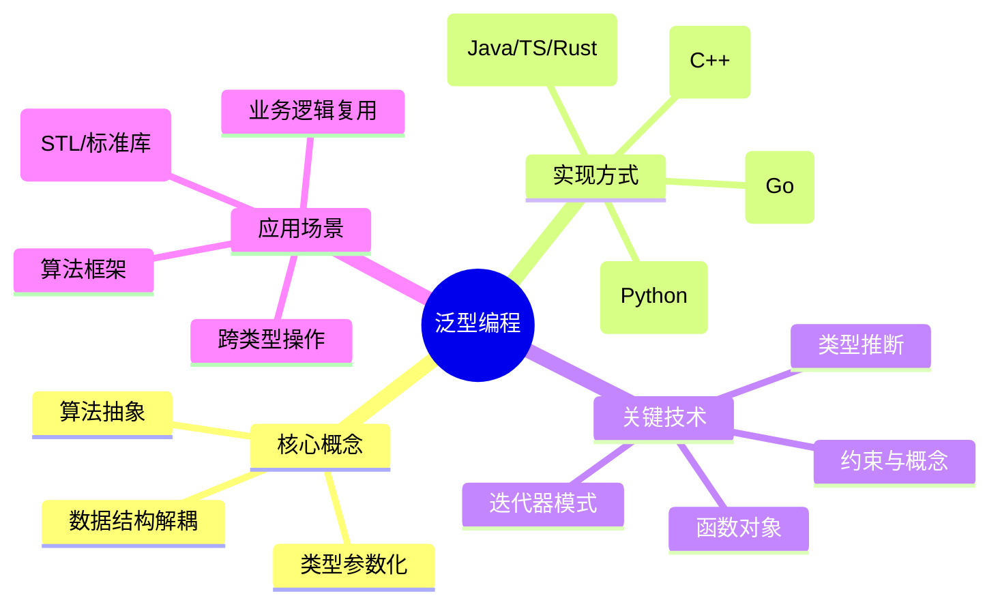
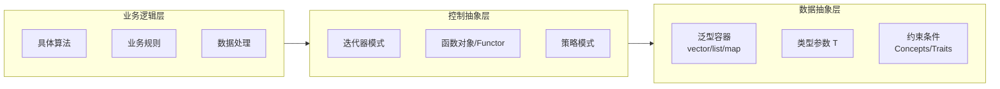
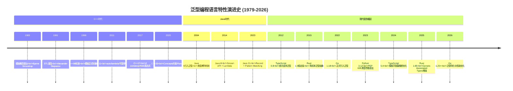
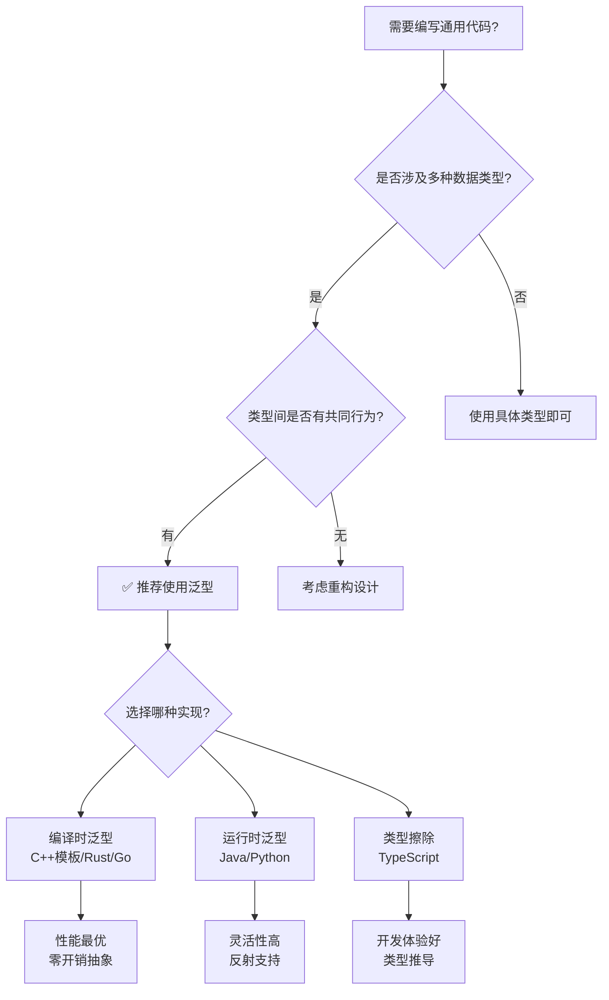
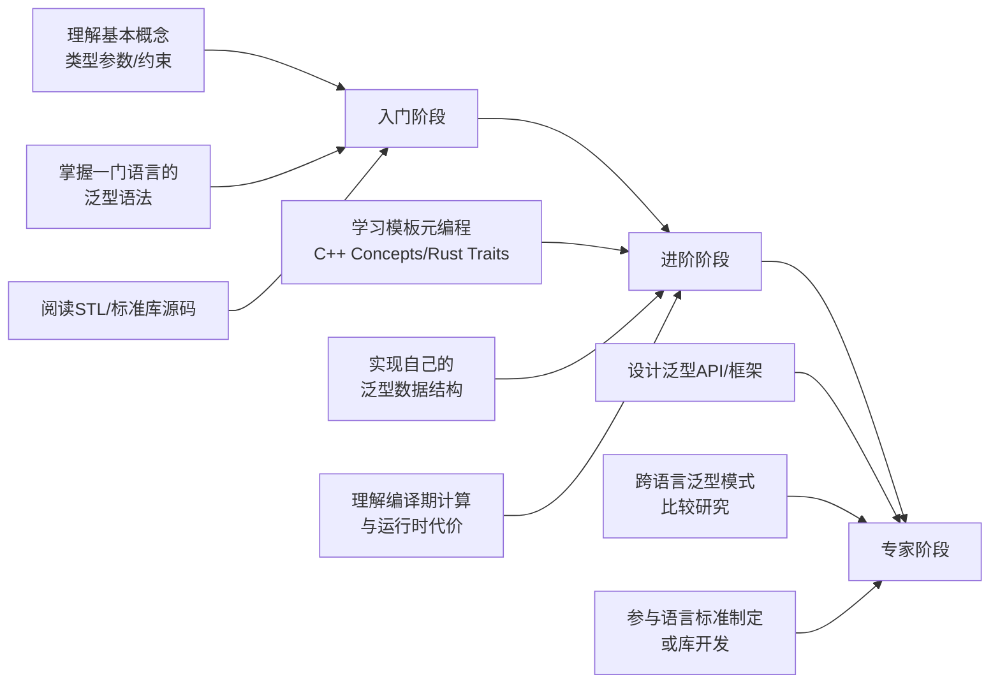

# 编程范式游记（2）- 泛型编程 [2026重制版]

> **原文发布时间**：2018年
> **重制时间**：2026年6月
> **核心主题**：从C/C++到现代语言的泛型编程演进

## 核心变更说明

自2018年原文发布以来，泛型编程领域发生了革命性变化：

1. **TypeScript 5.x**：全面成熟的类型系统，支持条件类型、映射类型、模板字面量类型等高级特性
2. **Rust 1.80+**：trait系统、泛型关联类型、const泛型、impl Trait语法糖
3. **Go 1.18+**：正式引入泛型（generics），支持类型参数和接口约束
4. **Python 3.12+**：PEP 695类型参数语法、PEP 698 override装饰器
5. **Java 21+**：Record类、Pattern Matching for switch、Sealed Classes增强

**数据来源**：
- [TypeScript官方文档](https://www.typescriptlang.org/docs/handbook/2/generics.html)
- [Rust官方文档 - Generics](https://doc.rust-lang.org/book/ch10-01-syntax-and-semantics.html)
- [Go语言规范 - Generics](https://go.dev/ref/spec#Generics)
- [Python PEP 484 - Type Hints](https://peps.python.org/pep-0484/)

---

## 编程范式定义与思维导图

### 什么是泛型编程？

泛型编程（Generic Programming）是一种编程范式，旨在实现算法和数据结构的类型无关性。其核心思想是：

> **"抽象出具体、高效的算法，形成可以与不同数据表示相结合的通用算法，从而产生广泛有用的软件。"**
>
> — David R. Musser & Alexander A. Stepanov, 1985

根据[Stepanov的原始论文](http://stepanovpapers.com/genprog.pdf)，泛型编程的本质是：
- **屏蔽数据和操作数据的细节**
- **让算法更为通用**
- **让编程者更多地关注算法的结构，而不是在算法中处理不同的数据类型**

### 泛型编程范式全景图



### 泛型编程的核心要素关系图



---

## 语言特性演进时间线



---

## 代码示例对比（2018 vs 2026）

### 示例一：Search函数的实现对比

#### ❌ 2018年版本（C风格）

```c
// 原文中的C语言实现
int search(void* a, size_t size, void* target,
           size_t elem_size, int(*cmpFn)(void*, void*))
{
    for(int i=0; i<size; i++) {
        if ( cmpFn( a + elem_size * i, target) == 0 ) {
            return i;
        }
    }
    return -1;
}
```

**问题分析**：
- 使用`void*`指针，类型不安全
- 需要手动传入元素大小和比较函数
- 返回索引值，对非顺序数据结构无意义
- 无法在编译期进行类型检查

#### ✅ 2026年版本（多语言对比）

**TypeScript 5.x 实现**：

```typescript
// 使用泛型和迭代器协议的现代实现
function search<T>(
    iterable: Iterable<T>,
    predicate: (item: T) => boolean
): T | undefined {
    for (const item of iterable) {
        if (predicate(item)) {
            return item;
        }
    }
    return undefined;
}

// 使用示例
interface Employee {
    id: number;
    name: string;
    department: string;
}

const employees: Employee[] = [
    { id: 1, name: "张三", department: "技术部" },
    { id: 2, name: "李四", department: "市场部" },
    { id: 3, name: "王五", department: "技术部" },
];

// 查找技术部的员工
const techEmployee = search(
    employees,
    (emp) => emp.department === "技术部"
);
console.log(techEmployee); // { id: 1, name: "张三", department: "技术部" }

// 支持任何Iterable类型（包括Map、Set、Generator）
const numberSet = new Set([1, 2, 3, 4, 5]);
const found = search(numberSet, (n) => n > 3); // 4
```

**Rust 1.85+ 实现**：

```rust
// Rust使用trait bounds和迭代器trait
fn search<'a, T, I>(mut iter: I, predicate: impl FnMut(&T) -> bool) -> Option<&'a T>
where
    I: Iterator<Item = &'a T>,
{
    iter.find(|item| predicate(item))
}

#[derive(Debug)]
struct Employee {
    id: u32,
    name: String,
    department: String,
}

fn main() {
    let employees = vec![
        Employee { id: 1, name: String::from("张三"), department: String::from("技术部") },
        Employee { id: 2, name: String::from("李四"), department: String::from("市场部") },
    ];

    // 使用方法链式调用，编译器自动推断类型
    let tech_emp = employees.iter()
        .find(|emp| emp.department == "技术部");

    match tech_emp {
        Some(emp) => println!("找到: {:?}", emp),
        None => println!("未找到"),
    }
}
```

**Go 1.25+ 实现**：

```go
package main

import "fmt"

// Go使用接口约束和泛型
func search[T any](items%20[]T,%20predicate%20func(T) bool) (T, bool) {
    var zero T
    for _, item := range items {
        if predicate(item) {
            return item, true
        }
    }
    return zero, false
}

type Employee struct {
    ID         int
    Name       string
    Department string
}

func main() {
    employees := []Employee{
        {ID: 1, Name: "张三", Department: "技术部"},
        {ID: 2, Name: "李四", Department: "市场部"},
    }

    if emp, found := search(employees, func(e Employee) bool {
        return e.Department == "技术部"
    }); found {
        fmt.Printf("找到: %+v\n", emp)
    }
}
```

---

### 示例二：Sum/Accumulate函数的进化

#### ❌ 2018年版本（C++ STL风格）

```cpp
template <class Iter, class T, class Op>
T reduce(Iter start, Iter end, T init, Op op) {
    T result = init;
    while (start != end) {
        result = op(result, *start);
        start++;
    }
    return result;
}
```

#### ✅ 2026年版本（函数式风格）

**TypeScript 5.x + 管道操作符**：

```typescript
// 定义泛型的reduce函数
function reduce<T, U>(
    iterable: Iterable<T>,
    initialValue: U,
    reducer: (acc: U, current: T) => U
): U {
    let acc = initialValue;
    for (const item of iterable) {
        acc = reducer(acc, item);
    }
    return acc;
}

interface Product {
    name: string;
    price: number;
    quantity: number;
    category: string;
}

const products: Product[] = [
    { name: "笔记本电脑", price: 8000, quantity: 2, category: "电子" },
    { name: "机械键盘", price: 500, quantity: 5, category: "电子" },
    { name: "办公椅", price: 1200, quantity: 10, category: "家具" },
];

// 计算总价值
const totalValue = reduce(
    products,
    0,
    (sum, product) => sum + product.price * product.quantity
);

console.log(`总价值: ¥${totalValue.toLocaleString()}`);
// 输出: 总价值: ¥30,500

// 结合filter和管道操作符（Stage 2提案）
// const electronicsTotal = products
//     |> filter($$, p => p.category === "电子")
//     |> reduce($$, 0, (sum, p) => sum + p.price * p.quantity);
```

**Python 3.12+ 类型安全版本**：

```python
from typing import TypeVar, Iterable, Callable, Protocol
from dataclasses import dataclass
from functools import reduce as ft_reduce

T = TypeVar('T')
U = TypeVar('U')

# PEP 695 新语法：类型参数声明
def my_reduce[
    T, U
](
    items: Iterable[T],
    initial: U,
    reducer: Callable[[U, T], U]
) -> U:
    """类型安全的reduce函数"""
    result = initial
    for item in items:
        result = reducer(result, item)
    return result


@dataclass
class Employee:
    name: str
    salary: float
    department: str


employees = [
    Employee("张三", 15000.0, "技术部"),
    Employee("李四", 12000.0, "市场部"),
    Employee("王五", 18000.0, "技术部"),
]

# 计算技术部总薪资
tech_total = my_reduce(
    (emp for emp in employees if emp.department == "技术部"),
    0.0,
    lambda total, emp: total + emp.salary
)

print(f"技术部总薪资: ¥{tech_total:,.2f}")
# 输出: 技术部总薪资: ¥33,000.00
```

**Rust 迭代器适配器链**：

```rust
#[derive(Debug)]
struct Employee {
    name: String,
    salary: f64,
    department: String,
}

fn main() {
    let employees = vec![
        Employee { name: "张三".into(), salary: 15000.0, department: "技术部".into() },
        Employee { name: "李四".into(), salary: 12000.0, department: "市场部".into() },
        Employee { name: "王五".into(), salary: 18000.0, department: "技术部".into() },
    ];

    // Rust的迭代器适配器链：filter -> map -> fold
    let tech_total: f64 = employees
        .iter()
        .filter(|emp| emp.department == "技术部")
        .map(|emp| emp.salary)
        .fold(0.0, |acc, salary| acc + salary);

    println!("技术部总薪资: ¥{:.2}", tech_total);
}
```

---

## 适用场景分析

### 何时应该使用泛型编程？



### 典型应用场景

| 场景 | 推荐语言 | 实现方式 | 性能影响 |
|------|---------|---------|---------|
| **集合/容器库** | C++, Rust, Go | 模板/泛型 | 零开销 |
| **算法框架** | Python, TypeScript | 泛型函数 | 微小开销 |
| **API客户端** | TypeScript, Rust | 泛型响应类型 | 无运行时开销 |
| **数据处理管道** | Python, Rust | 迭代器+泛型 | 取决于实现 |
| **事件系统** | TypeScript, Go | 泛型事件类型 | 无额外开销 |
| **状态管理** | TypeScript | 泛型Store | 无运行时开销 |

---

## 最佳实践清单

### ✅ 泛型编程最佳实践（2026年版）

#### 1. **优先使用约束而非裸泛型**

```typescript
// ❌ 过于宽泛，容易出错
function process<T>(data: T): T { ... }

// ✅ 使用接口约束
interface Processable {
    validate(): boolean;
    transform(): unknown;
}

function process<T extends Processable>(data: T): T {
    if (!data.validate()) {
        throw new Error("验证失败");
    }
    return data.transform() as T;
}
```

#### 2. **显式实例化与类型推断**

```go
// Go 1.18+ 泛型（注意：Go 目前不支持默认类型参数）
type Stack[T any] struct {
    items []T
}

func NewStack[T any]() *Stack[T] {
    return &Stack[T]{
        items: make([]T, 0),
    }
}

// 显式实例化，或由赋值目标推断类型参数
s := NewStack[string]()
```

#### 3. **避免过度泛化**

```rust
// ❌ 不必要的复杂度
fn complex_operation<
    T: Clone + Debug + Serialize + DeserializeOwned,
    U: IntoIterator<Item = T>,
    V: Fn(T) -> Result<T, Box<dyn Error>>,
>(data: U, processor: V) -> Result<Vec<T>, Box<dyn Error>> { ... }

// ✅ 简洁明了
fn process_items<T: Clone>(items: &[T]) -> Vec<T> {
    items.to_vec()
}
```

#### 4. **利用类型推导减少样板代码**

```python
# PEP 695 新语法（Python 3.12+）
def first[T](items:%20list[T]) -> T | None:
    """返回列表第一个元素"""
    return items[0] if items else None

# 自动推导返回类型
result: str | None = first(["hello", "world"])
```

#### 5. **文档化泛型约束**

```typescript
/**
 * 对可排序数组进行二分查找
 * @template T - 必须实现Comparable接口的类型
 * @param {T[]} sortedArray - 已排序的数组
 * @param {T} target - 要查找的目标值
 * @returns {number} 目标值的索引，未找到返回-1
 */
function binarySearch<T extends Comparable<T>>(
    sortedArray: T[],
    target: T
): number {
    let left = 0;
    let right = sortedArray.length - 1;

    while (left <= right) {
        const mid = Math.floor((left + right) / 2);
        const comparison = sortedArray[mid].compareTo(target);

        if (comparison === 0) return mid;
        else if (comparison < 0) left = mid + 1;
        else right = mid - 1;
    }

    return -1;
}
```

#### 6. **组合优于继承**

```typescript
// ❌ 继承导致耦合
abstract class BaseRepository<T> {
    abstract find(id: string): Promise<T>;
    abstract save(entity: T): Promise<void>;
}

class UserRepository extends BaseRepository<User> { ... }

// ✅ 组合提供灵活性
interface Repository<T> {
    find(id: string): Promise<T>;
    save(entity: T): Promise<void>;
}

// 可以自由混入其他能力
interface Cacheable<T> {
    getFromCache(id: string): Promise<T | null>;
    setToCache(id: string, entity: T): Promise<void>;
}

class CachedUserRepository implements Repository<User>, Cacheable<User> {
    async find(id: string): Promise<User> {
        const cached = await this.getFromCache(id);
        if (cached) return cached;
        const user = await this.dbFind(id);
        await this.setToCache(id, user);
        return user;
    }
}
```

---

## 泛型编程的性能考量

### 不同语言的泛型实现机制对比

| 语言 | 实现机制 | 单态化 | 运行时开销 | 类型信息保留 |
|------|---------|--------|-----------|-------------|
| **C++ Templates** | 编译时实例化 | ✅ 完全单态化 | 无 | ❌ 擦除 |
| **Rust Generics** | 编译时单态化 | ✅ 完全单态化 | 无 | 可选 |
| **Go Generics** | GCShape Stencil | ⚠️ 部分单态化 | 极小 | 保留 |
| **Java Generics** | 类型擦除 | ❌ 无 | 无（装箱） | ❌ 擦除 |
| **TypeScript** | 编译时擦除 | N/A | 无（JS层面） | ❌ 擦除 |
| **Python Typing** | 仅注解 | N/A | 无 | 运行时可用 |

### 性能测试基准（简化示例）

```rust
// Rust: 零成本泛型抽象
#[inline(always)]
fn generic_sum<T: std::ops::Add<Output = T> + Copy>(values: &[T], init: T) -> T {
    values.iter().fold(init, |acc, &v| acc + v)
}

// 编译后等同于手写的具体类型版本
fn concrete_sum(values: &[i32], init: i32) -> i32 {
    values.iter().fold(init, |acc, v| acc + v)
}
// 两者生成的机器码完全相同！
```

---

## 延伸资源与学习路径

### 📚 官方权威资源

1. **TypeScript Handbook - Generics**
   - URL: https://www.typescriptlang.org/docs/handbook/2/generics.html
   - 内容：完整的泛型指南，包括约束、条件类型、映射类型

2. **The Rust Book - Chapter 10: Generic Types**
   - URL: https://doc.rust-lang.org/book/ch10-00-generic-types.html
   - 内容：Rust泛型系统详解，trait bounds，生命周期

3. **Go Blog: An Introduction To Generics**
   - URL: https://go.dev/blog/intro-generics
   - 内容：Go泛型设计哲学和实现细节

4. **Python PEP 484 - Type Hints**
   - URL: https://peps.python.org/pep-0484/
   - 内容：Python类型系统的完整规范

5. **C++ Core Guidelines: T.1-5 (Templates)**
   - URL: https://isocpp.github.io/CppCoreGuidelines/CppCoreGuidelines#t-templates-and-generic-programming
   - 内容：C++模板最佳实践

### 📖 经典书籍推荐

| 书名 | 作者 | 年份 | 重点内容 |
|------|------|------|---------|
| *Elements of Programming* | Stepanov, McJones | 2009 | STL理论基础 |
| *Modern C++ Design* | Alexandrescu | 2001 | 模板元编程 |
| *Programming Rust* | Blandy, Orendorff | 2024 | Rust泛型实战 |
| *Effective TypeScript* | Vanderkam | 2020 | TS类型系统深度解析 |

### 🎯 学习路线建议



---

## 总结

泛型编程从1985年Stepanov的理论提出，到今天已成为现代编程语言的标配特性。核心要点回顾：

### 🎯 核心原则

1. **算法与数据分离**：好的泛型代码应让算法独立于具体数据类型
2. **约束即文档**：通过类型约束表达前置条件和不变量
3. **零成本抽象**：理想情况下，泛型不应带来运行时性能损失
4. **组合优于继承**：用小的、可组合的泛型构件构建复杂系统

### 🔮 未来趋势

- **Const泛型**（Rust已支持）：在值级别进行泛型
- **类型级编程**：将更多计算移至编译期
- **泛型特化**（Go正在探索）：为特定类型提供优化实现
- **跨语言互操作性**：WebAssembly Interface Types等标准

> **记住**：泛型编程不是为了炫技，而是为了写出更安全、更灵活、更易维护的代码。选择合适的抽象层次，避免过早优化和过度工程。

---

**相关文章导航**：
- [24 | 编程范式游记（3）- 类型系统和泛型的本质](24-编程范式游记（3）-类型系统和泛型的本质-[2026重制版].md)
- [25 | 编程范式游记（4）- 函数式编程](25-编程范式游记（4）-函数式编程-[2026重制版].md)

**参考来源**：
- [TypeScript 5.4 Release Notes](https://devblogs.microsoft.com/typescript/announcing-typescript-5-4/)
- [Rust 1.85 Release Notes](https://blog.rust-lang.org/)
- [Go 1.23 Release Notes](https://go.dev/doc/go1.23)
- [Python 3.13 What's New](https://docs.python.org/3.13/whatsnew/3.13.html)
