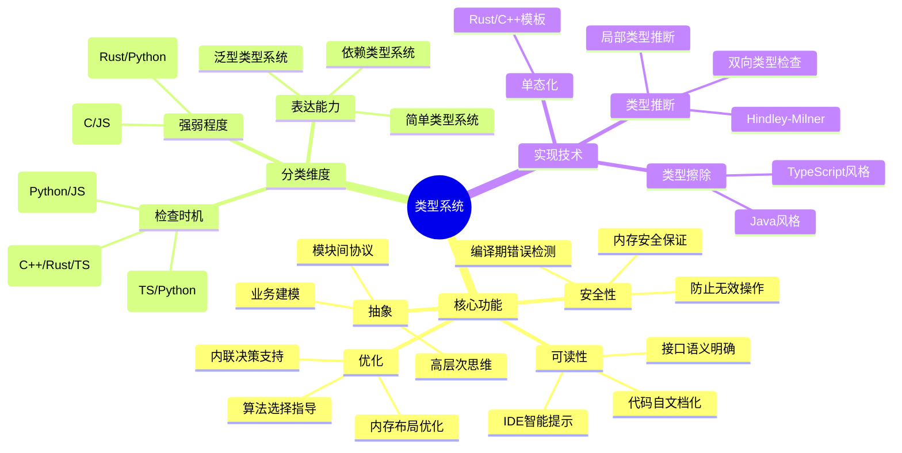
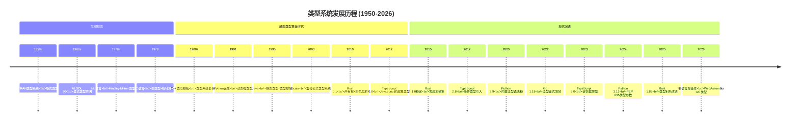
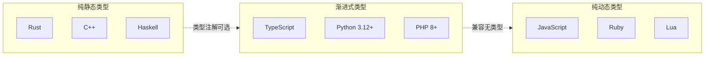
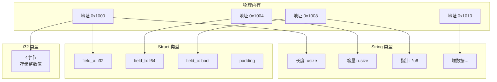
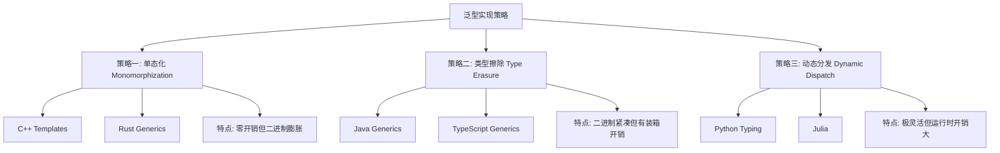
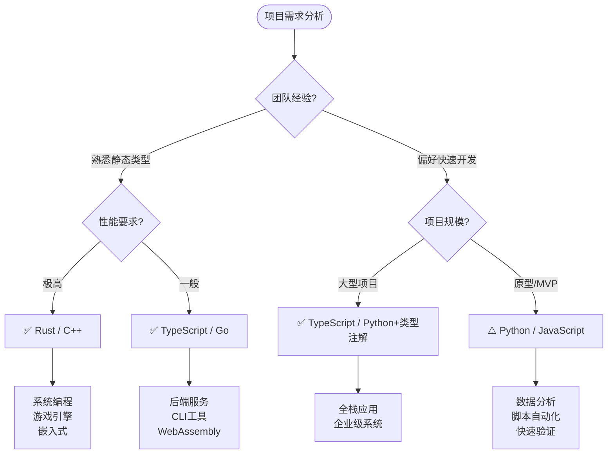
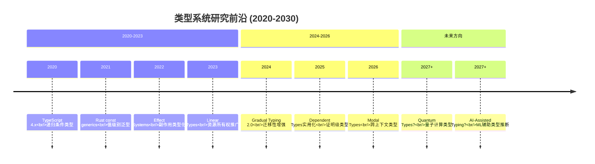

# 编程范式游记（3）- 类型系统和泛型的本质 [2026重制版]

> **原文发布时间**：2018年
> **重制时间**：2026年6月
> **核心主题**：深入理解类型系统的本质及其与泛型编程的关系

## 核心变更说明

自2018年以来，类型系统领域经历了重大演进：

1. **渐进式类型系统成熟**：TypeScript、Python的类型系统从可选变为强推荐
2. **类型推断能力增强**：Rust、Haskell、OCaml等语言的类型推断达到新高度
3. **类型安全即文档**：类型成为API契约的重要组成部分
4. **运行时类型信息（RTTI）优化**：反射机制性能大幅提升
5. **依赖类型（Dependent Types）探索**：Agda、Idris等语言推动类型系统边界

**数据来源**：
- [ECMAScript Specification](https://tc39.es/ecma262/)
- [The Rust Reference - Type System](https://doc.rust-lang.org/reference/types.html)
- [Python typing module documentation](https://docs.python.org/3/library/typing.html)
- [MDN Web Docs - JavaScript Data Types](https://developer.mozilla.org/en-US/docs/Web/JavaScript/Data_structures)

---

## 类型系统定义与思维导图

### 什么是类型系统？

在计算机科学中，**类型系统（Type System）** 是用于定义如何将编程语言中的数值和表达式归类为不同类型的规则集合，以及如何操作这些类型、这些类型如何互相作用的系统。

根据[Benjamin C. Pierce的经典著作《Types and Programming Languages》](https://www.cis.upenn.edu/~bcpierce/tapl/)：

> 类型可以确认一个值或者一组值具有特定的意义和目的。

#### 类型系统的核心功能



### 类型系统的层次结构

```mermaid
flowchart TB
    subgraph Level1["第一层：原始类型"]
        A1[整数 int/i32/i64]
        A2[浮点数 float/f64]
        A3[布尔值 bool]
        A4[字符 char/string]
        A5[空值 null/void/None]
    end

    subgraph Level2["第二层：复合类型"]
        B1[数组 Array[T]]
        B2[元组 Tuple[T, U]]
        B3[记录/对象 Record&lt;K, V&gt;]
        B4[枚举 Enum]
        B5[联合类型 T | U]
    end

    subgraph Level3["第三层：函数类型"]
        C1[普通函数 (T) -> U]
        C2[高阶函数 ((T) -> U) -> V]
        C3[泛型函数 &lt;T&gt;(T) -> T]
        C4[方法/成员函数]
    end

    subgraph Level4["第四层：参数化类型"]
        D1[容器 List&lt;T&gt;]
        D2[映射 Map&lt;K, V&gt;]
        D3[结果 Result&lt;T, E&gt;]
        D4[可选 Option&lt;T&gt;]
    end

    Level1 --> Level2 --> Level3 --> Level4

```

---

## 语言特性演进时间线



---

## 静态类型 vs 动态类型深度对比

### 核心差异对比表

| 特性 | 静态类型系统 | 动态类型系统 |
|------|-------------|-------------|
| **检查时机** | 编译时 | 运行时 |
| **错误发现阶段** | 开发阶段 | 生产环境 |
| **性能影响** | 通常更优（可优化） | 可能较慢（需RTTI） |
| **代码灵活性** | 较低（需声明） | 较高（动态修改） |
| **IDE支持** | 强（重构、补全） | 弱（有限推断） |
| **学习曲线** | 较陡（需理解类型） | 较平（直觉式） |
| **典型代表** | Rust, C++, TypeScript, Go | Python, JavaScript, Ruby |

### 现代趋势：渐进式类型系统



---

## 代码示例对比（2018 vs 2026）

### 示例一：类型安全的容器操作

#### ❌ 2018年版本（动态类型的隐患）

```javascript
// JavaScript 2018: 运行时才能发现问题
function processItems(items) {
    let total = 0;
    for (let item of items) {
        // 如果item不是数字？运行时报错或产生NaN
        total += item.price * item.quantity;
    }
    return total;
}

// 调用时传入错误类型，直到运行才发现
processItems([
    { name: "商品A", price: "100", quantity: 2 }, // price是字符串！
    { name: "商品B", price: 200, quantity: "三" }  // quantity是中文！
]);
// 结果：total = NaN  😱
```

#### ✅ 2026年版本（多语言类型安全实现）

**TypeScript 5.x - 严格模式**：

```typescript
// 定义精确的接口约束
interface OrderItem {
    name: string;
    price: number;
    quantity: number;
}

interface Order {
    items: OrderItem[];
    customer?: CustomerInfo;  // 可选属性
    status: 'pending' | 'processing' | 'shipped' | 'delivered';
}

type OrderStatus = Order['status']; // 提取类型

// 泛型函数 + 条件类型
function calculateTotal<T extends { price: number; quantity: number }>(
    items: T[]
): number {
    return items.reduce(
        (sum, item) => sum + item.price * item.quantity,
        0
    );
}

// 使用映射类型创建只读版本
type ReadonlyOrder = Readonly<Order>;

// 使用实用工具类型
type RequiredOrder = Required<Pick<Order, 'customer'>>;

const order: Order = {
    items: [
        { name: "笔记本电脑", price: 8000, quantity: 2 },
        { name: "机械键盘", price: 500, quantity: 5 },
    ],
    status: 'pending'
};

// ✅ 编译期就能捕获错误！
const total = calculateTotal(order.items); // 类型推导为number
console.log(`订单总额: ¥${total.toLocaleString()}`);
```

**Python 3.12+ - PEP 695 新语法**：

```python
from __future__ import annotations
from dataclasses import dataclass
from typing import Generic, TypeVar, Protocol

# PEP 695: 类级别的类型参数
@dataclass
class OrderItem[G: (int, float)]:
    """支持int或float的泛型价格"""
    name: str
    price: G
    quantity: int


# 协议（Protocol）定义行为约束
class SupportsTotal(Protocol):
    def get_total(self) -> float: ...


def process_order[T: SupportsTotal](order:%20T) -> dict[str, float]:
    """
    处理订单并返回统计信息
    使用新的类型参数语法（PEP 695）
    """
    total = order.get_total()
    tax = total * 0.13  # 13%税率
    grand_total = total + tax

    return {
        "subtotal": round(total, 2),
        "tax": round(tax, 2),
        "grand_total": round(grand_total, 2),
    }


@dataclass
class OnlineOrder:
    items: list[OrderItem[float]]

    def get_total(self) -> float:
        return sum(item.price * item.quantity for item in self.items)


# 使用示例
order = OnlineOrder(
    items=[
        OrderItem("笔记本电脑", 8000.00, 2),
        OrderItem("机械键盘", 500.00, 5),
    ]
)

result = process_order(order)
print(f"订单明细: {result}")
# mypy/pyright会在编译期检查类型一致性
```

**Rust - 所有权与生命周期**：

```rust
use std::collections::HashMap;

#[derive(Debug, Clone)]
struct OrderItem {
    name: String,
    price: f64,
    quantity: u32,
}

struct Order<'a> {
    items: Vec<OrderItem>,
    customer: &'a CustomerInfo,  // 生命周期标注
    status: OrderStatus,
}

#[derive(Debug)]
enum OrderStatus {
    Pending,
    Processing,
    Shipped,
    Delivered,
}

struct CustomerInfo {
    id: u32,
    name: String,
    level: CustomerLevel,
}

enum CustomerLevel {
    Regular,
    VIP,
    Enterprise,
}

impl Order<'_> {
    fn calculate_total(&self) -> f64 {
        self.items
            .iter()
            .map(|item| item.price * item.quantity as f64)
            .sum()
    }

    fn apply_discount(&self) -> f64 {
        let total = self.calculate_total();
        match self.customer.level {
            CustomerLevel::Regular => total,
            CustomerLevel::VIP => total * 0.95,   // 95折
            CustomerLevel::Enterprise => total * 0.85, // 85折
        }
    }
}

fn main() {
    let customer = CustomerInfo {
        id: 1001,
        name: String::from("张三"),
        level: CustomerLevel::VIP,
    };

    let order = Order {
        items: vec![
            OrderItem { name: String::from("笔记本"), price: 8000.0, quantity: 2 },
            OrderItem { name: String::from("键盘"), price: 500.0, quantity: 5 },
        ],
        customer: &customer,
        status: OrderStatus::Pending,
    };

    println!("原价: ¥{:.2}", order.calculate_total());
    println!("VIP价: ¥{:.2}", order.apply_discount());
}
```

---

### 示例二：类型推断的威力对比

#### ❌ 2018年版本（冗余的类型声明）

```java
// Java 8: 冗长的类型声明
Map<String, List<OrderItem>> orderMap = new HashMap<String, List<OrderItem>>();
List<OrderItem> items = orderMap.getOrDefault("order_001", new ArrayList<OrderItem>());

for (OrderItem item : items) {
    System.out.println(item.getName() + ": " + item.getPrice());
}
```

#### ✅ 2026年版本（现代类型推断）

**Go 1.25+ - 类型推断增强**：

```go
package main

import "fmt"

// 泛型函数：自动推断返回类型
func Sum[T ~int | ~float64](numbers%20...T) T {
	var total T
	for _, n := range numbers {
		total += n
	}
	return total
}

// 约束接口：定义类型的行为
type Stringer interface {
	String() string
}

// 泛型结构体
type Container[T any] struct {
	items []T
}

func (c *Container[T]) Add(item T) {
	c.items = append(c.items, item)
}

func (c *Container[T]) GetAll() []T {
	return c.items
}

func main() {
	// 自动推断T为int
	intSum := Sum(1, 2, 3, 4, 5)
	fmt.Printf("整数求和: %d\n", intSum)

	// 自动推断T为float64
	floatSum := Sum(1.1, 2.2, 3.3)
	fmt.Printf("浮点求和: %.2f\n", floatSum)

	// 泛型容器使用
	strContainer := &Container[string]{}
	strContainer.Add("Hello")
	strContainer.Add("World")
	fmt.Println(strContainer.GetAll())
}
```

**TypeScript - 控制流分析**：

```typescript
// TypeScript 5.x 的控制流类型收窄
function processValue(value: string | number | null) {
    if (value === null) {
        console.log("值为null");
        return;
    }

    // 此处value类型已收窄为 string | number
    if (typeof value === "string") {
        // 此处value类型为string
        console.log(value.toUpperCase());
    } else {
        // 此处value类型为number
        console.log((value * 2).toFixed(2));
    }
}

// 模板字面量类型
type HTTPMethod = 'GET' | 'POST' | 'PUT' | 'DELETE';
type APIRoute = `/api/${string}`;

function fetchAPI(
    method: HTTPMethod,
    url: APIRoute,
    body?: unknown
): Promise<Response> {
    return fetch(url, { method, body });
}

// 类型守卫
function isOrder(item: unknown): item is Order {
    return (
        typeof item === 'object' &&
        item !== null &&
        'items' in item &&
        Array.isArray((item as Order).items)
    );
}

// 使用
const data: unknown = await fetchDataFromAPI();  // 在 async 上下文中调用
if (isOrder(data)) {
    // data在此处被推断为Order类型
    const total = data.items.reduce((sum, item) =>
        sum + item.price * item.quantity, 0
    );
}
```

---

## 类型的本质：内存布局与抽象

### 类型即内存布局的抽象



### 不同语言的类型表示对比

| 类型概念 | C/C++ | Rust | Python | TypeScript |
|---------|-------|------|--------|------------|
| **整数** | `int` (平台相关) | `i32`, `i64` (固定宽度) | `int` (任意精度) | `number` (浮点) |
| **字符串** | `char*` / `std::string` | `String` / `&str` | `str` (不可变) | `string` |
| **布尔值** | `int` (0/1) | `bool` | `bool` | `boolean` |
| **空值** | `NULL` (指针) | `None` / `Option<T>` | `None` | `null` / `undefined` |
| **数组** | `T[]` (连续内存) | `[T; N]` / `Vec<T>` | `list` (动态) | `T[]` |
| **字典** | `std::map` / `unordered_map` | `HashMap<K, V>` | `dict` | `Record<K, V>` |
| **函数** | 函数指针 | `fn()` / 闭包 | 可调用对象 | 函数类型 |

---

## 泛型的本质：参数化抽象

### 为什么需要泛型？

根据原文引用的Stepanov论文核心观点：

> **泛型编程的本质是屏蔽数据和操作数据的细节，让算法更为通用。**

具体来说，要实现真正的泛型编程，需要解决以下问题：

1. **标准化类型的内存分配、释放和访问**
2. **标准化类型的操作**（比较、I/O、复制）
3. **标准化数据容器的操作**（遍历、查找、过滤、聚合）
4. **标准化特定操作的回调接口**

### 泛型实现的三种策略



---

## 适用场景分析

### 如何选择合适的类型系统？



### 类型严格度选择指南

| 场景 | 推荐严格度 | 工具配置建议 |
|------|-----------|-------------|
| **库/框架开发** | 最严格 (`strict: true`) | 启用所有strict选项 |
| **大型团队协作** | 严格 | 统一lint规则 |
| **中小型项目** | 中等严格 | 允许部分any |
| **原型/实验** | 宽松 | 快速迭代优先 |
| **遗留代码迁移** | 渐进式 | 逐文件启用 |

---

## 最佳实践清单

### ✅ 类型系统最佳实践（2026年版）

#### 1. **优先使用具体类型而非通用类型**

```typescript
// ❌ 过于宽泛
function processData(data: any): any { ... }

// ✅ 明确类型
interface UserData {
    id: string;
    name: string;
    email: string;
    createdAt: Date;
}

function processData(data: UserData): ProcessedResult { ... }
```

#### 2. **善用联合类型和字面量类型**

```python
from typing import Literal, Union

# Python 3.10+ 联合类型语法
def set_status(
    order_id: str,
    status: Literal['pending', 'processing', 'shipped', 'cancelled']
) -> None:
    """状态只能是预定义的字面量之一"""
    ...

# 替代注释式的字符串
# def set_status(order_id, status): # status: 'pending'|'processing'...
```

#### 3. **使用 branded types 防止类型混淆**

```typescript
// TypeScript: 防止将UserId误传给OrderId
type UserId = string & { readonly brand: unique symbol };
type OrderId = string & { readonly brand: unique symbol };

function createUserId(id: string): UserId {
    return id as UserId;
}

function createOrderId(id: string): OrderId {
    return id as OrderId;
}

function getUser(id: UserId): User { ... }
function getOrder(id: OrderId): Order { ... }

const userId = createUserId('user_123');
const orderId = createOrderId('order_456');

getUser(userId);     // ✅ 正确
getUser(orderId);    // ❌ 编译错误! Type 'OrderId' is not assignable to 'UserId'
```

#### 4. **利用泛型约束表达前置条件**

```rust
// Rust: trait bounds作为文档和约束
use std::fmt::Display;
use std::error::Error;

/// 对可显示的项目列表进行格式化输出
///
/// # Type Bounds
/// - `T: Display` - 必须能格式化为字符串
/// - `I: IntoIterator<Item = T>` - 必须可迭代
fn format_items<T, I>(items: I) -> String
where
    T: Display,
    I: IntoIterator<Item = T>,
{
    items
        .into_iter()
        .map(|item| format!("- {}", item))
        .collect::<Vec<_>>()
        .join("\n")
}
```

#### 5. **错误处理使用代数数据类型**

```python
# Python 3.11+: 使用Union代替异常进行流程控制
from dataclasses import dataclass
from typing import Union, TypeVar

@dataclass
class Success[T]:
    value: T

@dataclass
class Error:
    message: str
    code: int

T = TypeVar("T")
Result = Union[Success[T], Error]

def divide(a: float, b: float) -> Result[float]:
    if b == 0:
        return Error(message="除数不能为零", code=400)
    return Success(value=a / b)

# 使用模式匹配处理结果 (Python 3.10+ match语句)
result = divide(10.0, 3.0)
match result:
    case Success(value=value):
        print(f"结果: {value:.2f}")
    case Error(message=msg, code=code):
        print(f"错误 [{code}]: {msg}")
```

#### 6. **类型测试作为回归防护**

```typescript
// TypeScript: 使用 @ts-expect-error 进行类型单元测试
import { expectType } from 'ts-expect';

function add<T extends number>(a: T, b: T): T {
    return (a + b) as T;
}

// 测试类型推断是否正确
const result = add(1, 2);
expectType<number>(result); // ✅ 通过

// 测试错误类型是否能被检测到
// @ts-expect-error - Argument of type 'string' is not assignable to parameter
add("hello", "world");
```

---

## 延伸资源与学习路径

### 📚 官方权威资源

1. **Types and Programming Languages (TAPL)**
   - 作者: Benjamin C. Pierce
   - URL: https://www.cis.upenn.edu/~bcpierce/tapl/
   - 内容: 类型系统的理论基础，学术经典

2. **ECMAScript Specification - Type System**
   - URL: https://tc39.es/ecma262/#sec-ecmascript-data-types-and-values
   - 内容: JavaScript类型系统的完整规范

3. **The Rust Reference - Types**
   - URL: https://doc.rust-lang.org/reference/types.html
   - 内容: Rust类型系统详解，包括所有权和生命周期

4. **Python typing - Technical Reference**
   - URL: https://docs.python.org/3/library/typing.html
   - 内容: Python类型注解的完整规范和最佳实践

5. **MDN - JavaScript Data Structures**
   - URL: https://developer.mozilla.org/en-US/docs/Web/JavaScript/Data_structures
   - 内容: JS数据类型的实践指南

### 📖 进阶阅读

| 书名 | 作者 | 年份 | 难度 | 重点内容 |
|------|------|------|------|---------|
| *Types and Programming Languages* | Pierce | 2002 | ⭐⭐⭐⭐⭐ | 类型理论圣经 |
| *Programming Rust* | Blandy et al. | 2024 | ⭐⭐⭐⭐ | Rust类型实战 |
| *Effective TypeScript* | Vanderkam | 2020 | ⭐⭐⭐ | TS类型技巧 |
| *Type-Driven Development with Idris* | Brady | 2017 | ⭐⭐⭐⭐ | 用类型驱动开发 |

### 🔬 类型系统研究前沿



---

## 总结

### 🎯 核心要点回顾

1. **类型系统是程序设计的基石**
   - 不仅防止错误，更是表达设计意图的工具
   - 好的类型系统能让"不可能的状态无法表示"

2. **泛型是类型系统的自然延伸**
   - 参数化抽象让我们写出真正通用的代码
   - 约束（bounds/constraints）是泛型的灵魂

3. **没有完美的类型系统**
   - 静态 vs 动态是权衡而非优劣
   - 渐进式类型是当前的最佳妥协

4. **类型即文档，类型即测试**
   - 精确的类型签名胜过长篇注释
   - 编译器是最严格的代码审查者

### 💡 实践建议

> **"Make invalid states unrepresentable."**
>
> — Yaron Minsky, Jane Street Capital

- 在设计API时，优先考虑类型如何约束使用者
- 使用联合类型、字面量类型缩小可能值的范围
- 利用编译器的类型检查作为免费的单元测试
- 团队统一类型严格度标准，避免"任何"泛滥

---

**相关文章导航**：
- [23 | 编程范式游记（2）- 泛型编程](23-编程范式游记（2）-泛型编程-[2026重制版].md)
- [25 | 编程范式游记（4）- 函数式编程](25-编程范式游记（4）-函数式编程-[2026重制版].md)

**参考来源**：
- [TypeScript Handbook - Everyday Types](https://www.typescriptlang.org/docs/handbook/2/everyday-types.html)
- [Rust Book - Chapter 6: Enums and Pattern Matching](https://doc.rust-lang.org/book/ch06-00-enums.html)
- [Python 3.13 What's New - Typing](https://docs.python.org/3.13/whatsnew/3.13.html#improvements-to-the-typing-module)
- [ECMA-262 2024 Specification](https://tc39.es/ecma262/)
