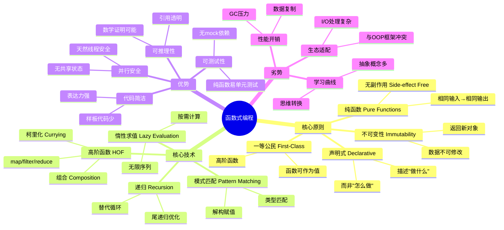
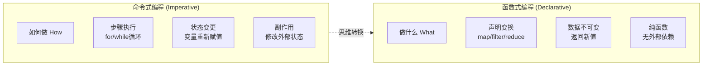
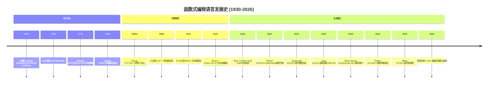
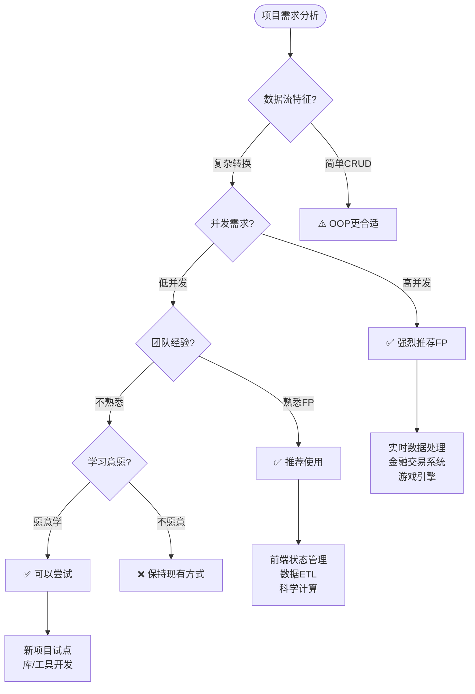
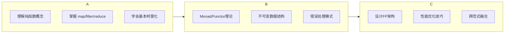

# 编程范式游记（4）- 函数式编程 [2026重制版]

> **原文发布时间**：2018年
> **重制时间**：2026年6月
> **核心主题**：函数式编程的核心理念与现代实践

## 核心变更说明

自2018年以来，函数式编程（FP）从学术象牙塔走向主流：

1. **React Hooks普及**：函数组件+Hooks成为React主导模式
2. **RxJS成熟**：响应式编程在Angular、前端广泛采用
3. **Rust影响扩散**：所有权模式启发FP在系统语言中的应用
4. **Python 3.10+**：match/case语句、结构化模式匹配
5. **TypeScript 4.x+**：`satisfies`操作符、`const`类型参数、`infer`增强
6. **函数式成为多范式语言的标配特性**

**数据来源**：
- [MDN Web Docs - Functional Programming](https://developer.mozilla.org/en-US/docs/Web/JavaScript/Guide/Functions)
- [Functional Programming in JavaScript](https://javascript.info/functional-programming)
- [Python 3.10 Pattern Matching](https://docs.python.org/3/whatsnew/3.10.html#pep-634-structural-pattern-matching)
- [Rust Book - Chapter 13: Functional Language Features](https://doc.rust-lang.org/book/ch13-00-functional-features.html)

---

## 函数式编程定义与思维导图

### 什么是函数式编程？

函数式编程（Functional Programming, FP）是一种编程范式，它将计算视为数学函数的评估，避免改变状态和可变数据。

根据原文引用的λ演算（Lambda Calculus）理论——由Alonzo Church和Stephen Cole Kleene在20世纪30年代提出：

> **函数式编程的核心精神是stateless（无状态）和immutable（不可变），只关心定义输入数据和输出数据的关系，用数学表达式描述映射关系。**

#### 函数式编程的核心原则



### 函数式编程 vs 命令式编程对比图



---

## 语言特性演进时间线



---

## 代码示例对比（2018 vs 2026）

### 示例一：赛车游戏模拟器

#### ❌ 2018年版本（命令式风格）

```python
# 原文中的命令式实现
from random import random

time = 5
car_positions = [1, 1, 1]

while time:
    time -= 1
    print('')
    for i in range(len(car_positions)):
        if random() > 0.3:
            car_positions[i] += 1
        print('-' * car_positions[i])
```

**问题分析**：
- 使用全局可变状态 `car_positions`
- 循环和条件嵌套，逻辑交织
- 难以并行化（共享状态）
- 不易测试（依赖随机数和打印）

#### ✅ 2026年版本（纯函数式实现）

**TypeScript 5.x + Immer（不可变更新）**：

```typescript
import { produce } from 'immer';

// 定义不可变类型
interface CarState {
    position: number;
}

interface RaceState {
    timeLeft: number;
    cars: CarState[];
}

// 纯函数：移动一辆车
function moveCar(car: CarState): CarState {
    return Math.random() > 0.3
        ? { ...car, position: car.position + 1 }
        : car;
}

// 纯函数：执行一轮比赛
function runStep(state: RaceState): RaceState {
    if (state.timeLeft <= 0) return state;

    return produce(state, (draft) => {
        draft.timeLeft -= 1;
        draft.cars = draft.cars.map(moveCar);
    });
}

// 纯函数：渲染赛道
function renderTrack(state: RaceState): string {
    return state.cars
        .map((car) => '-'.repeat(car.position))
        .join('\n');
}

// 纯函数：运行完整比赛（迭代推进状态）
function runRace(state: RaceState): RaceState[] {
    const states: RaceState[] = [state];
    let current = state;

    while (current.timeLeft > 0) {
        current = runStep(current);
        states.push(current);
    }

    return states;
}

// 初始状态
const initialState: RaceState = {
    timeLeft: 5,
    cars: [
        { position: 1 },
        { position: 1 },
        { position: 1 },
    ],
};

// 执行并渲染
const raceHistory = runRace(initialState);
raceHistory.forEach((state, index) => {
    console.log(`\n=== 第 ${index + 1} 秒 ===`);
    console.log(renderTrack(state));
});
```

**Python 3.12+ - dataclass + match/case**：

```python
from __future__ import annotations
from dataclasses import dataclass
from typing import NamedTuple
import random


@dataclass(frozen=True)
class CarState:
    """不可变的赛车状态"""
    position: int


@dataclass(frozen=True)
class RaceState:
    """不可变的比赛状态"""
    time_left: int
    cars: tuple[CarState, ...]


def move_car(car: CarState) -> CarState:
    """纯函数：移动赛车"""
    if random.random() > 0.3:
        return CarState(position=car.position + 1)
    return car


def run_step(state: RaceState) -> RaceState:
    """纯函数：执行一步"""
    if state.time_left <= 0:
        return state

    new_cars = tuple(move_car(car) for car in state.cars)
    return RaceState(time_left=state.time_left - 1, cars=new_cars)


def render_track(state: RaceState) -> str:
    """纯函数：渲染赛道"""
    return '\n'.join(
        '-' * car.position for car in state.cars
    )


# Python 3.10+ 结构化模式匹配
def process_result(result: RaceState | None) -> str:
    """使用模式匹配处理结果"""
    match result:
        case RaceState(time_left=0):
            return "🏁 比赛结束!"
        case RaceState(time_left=t, cars=cars) if t > 0:
            return f"⏱️ 剩余 {t} 秒，{len(cars)} 辆车参赛"
        case None:
            return "❓ 未知状态"
        case _:
            return "⚠️ 无法识别的状态"


# 初始状态
initial_state = RaceState(
    time_left=5,
    cars=(
        CarState(position=1),
        CarState(position=1),
        CarState(position=1),
    )
)

# 执行比赛（使用递归）
def run_race(state: RaceState, history: list[RaceState] | None = None) -> list[RaceState]:
    """递归运行完整比赛"""
    if history is None:
        history = []

    history.append(state)

    if state.time_left <= 0:
        return history

    next_state = run_step(state)
    return run_race(next_state, history)


# 执行并输出
race_history = run_race(initial_state)

for idx, state in enumerate(race_history, 1):
    print(f"\n{'='*20} 第{idx}秒 {'='*20}")
    print(render_track(state))
    print(process_result(state))
```

**Rust - 迭代器 + 函数式链**：

```rust
use rand::Rng;

#[derive(Debug, Clone, Copy)]
struct Car {
    position: u32,
}

#[derive(Debug)]
struct RaceState {
    time_left: u32,
    cars: Vec<Car>,
}

fn move_car(mut car: Car) -> Car {
    let mut rng = rand::thread_rng();
    if rng.gen::<f64>() > 0.3 {
        car.position += 1;
    }
    car
}

fn run_step(state: &RaceState) -> RaceState {
    if state.time_left == 0 {
        return state.clone();
    }

    RaceState {
        time_left: state.time_left - 1,
        cars: state.cars.iter().map(|&car| move_car(car)).collect(),
    }
}

fn render_track(state: &RaceState) -> String {
    state.cars
        .iter()
        .map(|car| "-".repeat(car.position as usize))
        .collect::<Vec<_>>()
        .join("\n")
}

fn main() {
    let initial_state = RaceState {
        time_left: 5,
        cars: vec![
            Car { position: 1 },
            Car { position: 1 },
            Car { position: 1 },
        ],
    };

    // 函数式链：scan保存中间状态
    let race_history: Vec<RaceState> = std::iter::successors(Some(initial_state), |state| {
        if state.time_left > 0 {
            Some(run_step(state))
        } else {
            None
        }
    }).collect();

    for (idx, state) in race_history.iter().enumerate() {
        println!("\n{} 第{}秒 {}", "=".repeat(20), idx + 1, "=".repeat(20));
        println!("{}", render_track(state));
    }
}
```

---

### 示例二：数据处理管道（Map/Reduce/Filter）

#### ❌ 2018年版本（传统循环）

```javascript
// 计算数组中正数的平均值
var num = [2, -5, 9, 7, -2, 5, 3, 1, 0, -3, 8];
var positive_num_cnt = 0;
var positive_num_sum = 0;

for (var i = 0; i < num.length; i++) {
    if (num[i] > 0) {
        positive_num_cnt += 1;
        positive_num_sum += num[i];
    }
}

if (positive_num_cnt > 0) {
    var average = positive_num_sum / positive_num_cnt;
}
console.log(average);
```

#### ✅ 2026年版本（函数式管道）

**TypeScript - 管道操作符提案**：

```typescript
interface Product {
    id: number;
    name: string;
    price: number;
    category: string;
    rating: number;
}

const products: Product[] = [
    { id: 1, name: "笔记本电脑", price: 8000, category: "电子", rating: 4.8 },
    { id: 2, name: "机械键盘", price: 500, category: "电子", rating: 4.5 },
    { id: 3, name: "办公椅", price: 1200, category: "家具", rating: 4.2 },
    { id: 4, name: "显示器", price: 3000, category: "电子", rating: 4.6 },
    { id: 5, name: "台灯", price: 200, category: "家具", rating: 3.9 },
];

// 传统写法：嵌套调用
const result1 = products
    .filter((p) => p.category === "电子")
    .filter((p) => p.rating >= 4.5)
    .map((p) => ({ ...p, priceWithTax: p.price * 1.13 }))
    .reduce(
        (stats, product) => ({
            count: stats.count + 1,
            total: stats.total + product.priceWithTax,
            items: [...stats.items, product.name],
        }),
        { count: 0, total: 0, items: [] as string[] }
    );

console.log(`高评分电子产品统计:`);
console.log(`数量: ${result1.count}`);
console.log(`含税总价: ¥${result1.total.toLocaleString()}`);
console.log(`商品列表: ${result1.items.join(', ')}`);

// 未来管道操作符写法（Stage 2 Proposal）
/*
const result2 = products
    |> filter($$, (p: Product) => p.category === "电子")
    |> filter($$, (p: Product) => p.rating >= 4.5)
    |> map($$, (p: Product) => ({ ...p, priceWithTax: p.price * 1.13 }))
    |> reduce($$, { count: 0, total: 0 }, (acc, p) => ({
        count: acc.count + 1,
        total: acc.total + p.priceWithTax,
    }));
*/
```

**Python 3.12+ - Generator管道**：

```python
from __future__ import annotations
from dataclasses import dataclass
from typing import Iterable, TypeVar, Callable

T = TypeVar('T')
U = TypeVar('U')


@dataclass(frozen=True)
class Product:
    """不可变产品"""
    id: int
    name: str
    price: float
    category: str
    rating: float


# 纯函数：过滤器
def filter_by_category(products: Iterable[Product], category: str) -> Iterable[Product]:
    """过滤指定类别的产品"""
    return (p for p in products if p.category == category)


def filter_by_min_rating(products: Iterable[Product], min_rating: float) -> Iterable[Product]:
    """过滤最低评分的产品"""
    return (p for p in products if p.rating >= min_rating)


# 纯函数：映射器
def add_tax(product: Product, rate: float = 0.13) -> dict[str, object]:
    """添加税费信息"""
    return {
        **product.__dict__,
        "price_with_tax": round(product.price * (1 + rate), 2),
    }


# 纯函数：聚合器
def calculate_stats(
    products: Iterable[dict],
) -> dict[str, int | float | list[str]]:
    """计算统计数据"""
    items_list: list[str] = []
    total = 0.0
    count = 0

    for product in products:
        count += 1
        total += product["price_with_tax"]  # type: ignore
        items_list.append(product["name"])  # type: ignore

    return {
        "count": count,
        "total": round(total, 2),
        "items": items_list,
    }


# 组合管道
def process_products(
    products: Iterable[Product],
    category: str,
    min_rating: float,
) -> dict[str, int | float | list[str]]:
    """完整的处理管道"""
    return calculate_stats(
        add_tax(p)
        for p in filter_by_min_rating(
            filter_by_category(products, category),
            min_rating,
        )
    )


# 数据源
products = [
    Product(1, "笔记本电脑", 8000, "电子", 4.8),
    Product(2, "机械键盘", 500, "电子", 4.5),
    Product(3, "办公椅", 1200, "家具", 4.2),
    Product(4, "显示器", 3000, "电子", 4.6),
    Product(5, "台灯", 200, "家具", 3.9),
]

# 执行管道
result = process_products(products, category="电子", min_rating=4.5)

print("高评分电子产品统计:")
print(f"数量: {result['count']}")
print(f"含税总价: ¥{result['total']:,.2f}")
print(f"商品列表: {', '.join(result['items'])}")  # type: ignore
```

**Rust - Iterator适配器链**：

```rust
#[derive(Debug, Clone)]
struct Product {
    id: u32,
    name: String,
    price: f64,
    category: String,
    rating: f64,
}

#[derive(Debug)]
struct ProductStats {
    count: usize,
    total: f64,
    items: Vec<String>,
}

fn main() {
    let products = vec![
        Product { id: 1, name: "笔记本".into(), price: 8000.0, category: "电子".into(), rating: 4.8 },
        Product { id: 2, name: "键盘".into(), price: 500.0, category: "电子".into(), rating: 4.5 },
        Product { id: 3, name: "椅子".into(), price: 1200.0, category: "家具".into(), rating: 4.2 },
        Product { id: 4, name: "显示器".into(), price: 3000.0, category: "电子".into(), rating: 4.6 },
    ];

    // Rust的迭代器链：零成本抽象
    let stats: ProductStats = products
        .into_iter()
        .filter(|p| p.category == "电子")       // filter
        .filter(|p| p.rating >= 4.5)             // filter again
        .map(|p| {                               // map with tax
            let price_with_tax = p.price * 1.13;
            (p.name.clone(), price_with_tax)
        })
        .fold(
            ProductStats { count: 0, total: 0.0, items: vec![] },
            |mut acc, (name, price)| {
                acc.count += 1;
                acc.total += price;
                acc.items.push(name);
                acc
            },
        );

    println!("高评分电子产品统计:");
    println!("数量: {}", stats.count);
    println!("含税总价: ¥{:.2}", stats.total);
    println!("商品列表: {}", stats.items.join(", "));
}
```

---

### 示例三：柯里化与函数组合

#### ❌ 2018年版本（硬编码参数）

```python
# 原文中的简单例子
def inc(x):
    def incx(y):
        return x+y
    return incx

inc2 = inc(2)
inc5 = inc(5)

print(inc2(5))  # 输出 7
print(inc5(5))  # 输出 10
```

#### ✅ 2026年版本（高级函数组合）

**TypeScript - 实用函数组合工具**：

```typescript
// 通用的柯里化函数
function curry<A, B, C>(fn: (a: A, b: B) => C): (a: A) => (b: B) => C {
    return (a: A) => (b: B) => fn(a, b);
}

// 通用的函数组合（从右到左）
function compose<T>(...fns: Array<(arg: T) => T>): (arg: T) => T {
    return (arg: T) => fns.reduceRight((acc, fn) => fn(acc), arg);
}

// 通用的管道（从左到右）
function pipe<T>(...fns: Array<(arg: T) => T>): (arg: T) => T {
    return (arg: T) => fns.reduce((acc, fn) => fn(acc), arg);
}

// 实际应用：构建数据处理流水线

type User = {
    name: string;
    age: number;
    email: string;
    role: 'admin' | 'user' | 'guest';
};

// 纯函数：提取成年用户
const adultsOnly = (users: User[]): User[] =>
    users.filter((u) => u.age >= 18);

// 纯函数：按角色筛选
const byRole = curry((role: User['role'], users: User[]) =>
    users.filter((u) => u.role === role)
);

// 纯函数：匿名化邮箱
const anonymizeEmail = (users: User[]): User[] =>
    users.map((u) => ({
        ...u,
        email: u.email.replace(/(.*)@/, '***@'),
    }));

// 纯函数：排序
const sortByName = (users: User[]): User[] =>
    [...users].sort((a, b) => a.name.localeCompare(b.name));

// 组合成管道
const processAdminUsers = pipe(
    adultsOnly,
    byRole('admin'),  // 柯里化的部分应用
    anonymizeEmail,
    sortByName
);

// 使用
const users: User[] = [
    { name: "张三", age: 25, email: "zhangsan@example.com", role: "admin" },
    { name: "李四", age: 17, email: "lisi@example.com", role: "user" },
    { name: "王五", age: 30, email: "wangwu@example.com", role: "admin" },
    { name: "赵六", age: 16, email: "zhaoliu@example.com", role: "guest" },
];

const processedUsers = processAdminUsers(users);
console.log(JSON.stringify(processedUsers, null, 2));
```

**Python 3.12+ - functools工具**：

```python
from functools import partial, reduce
from typing import TypeVar, Callable, ParamSpec
from operator import add, mul

P = ParamSpec('P')
T = TypeVar('T')
U = TypeVar('U')


def compose(*funcs: Callable[[T], T]) -> Callable[[T], T]:
    """
    函数组合：从右到左执行
    compose(f, g)(x) == f(g(x))
    """
    def wrapper(x: T) -> T:
        result: T | None = x
        for func in reversed(funcs):
            result = func(result)  # type: ignore
        return result  # type: ignore
    return wrapper


def pipe(*funcs: Callable[[T], T]) -> Callable[[T], T]:
    """
    管道操作：从左到右执行
    pipe(f, g)(x) == g(f(x))
    """
    def wrapper(x: T) -> T:
        result: T | None = x
        for func in funcs:
            result = func(result)  # type: ignore
        return result  # type: ignore
    return wrapper


# 柯里化示例
def add(a: int, b: int) -> int:
    return a + b


add_5 = partial(add, 5)  # 固定第一个参数
multiply_by_2 = partial(mul, 2)  # 固定第一个参数

# 构建数据处理管道
def double(x: int) -> int:
    return x * 2


def increment(x: int) -> int:
    return x + 1


def square(x: int) -> int:
    return x ** 2


# 组合使用
process_number = compose(square, increment, double)  # 先double，再increment，最后square

result = process_number(5)
# 计算过程: 5 -> 10 -> 11 -> 121
print(f"结果: {result}")  # 输出: 121

# 另一个例子：字符串处理
def to_upper(s: str) -> str:
    return s.upper()


def trim(s: str) -> str:
    return s.strip()


def add_exclamation(s: str) -> str:
    return s + "!"


process_string = pipe(trim, to_upper, add_exclamation)

text = "   hello world   "
processed = process_string(text)
print(f"'{text}' -> '{processed}'")  # 输出: 'HELLO WORLD!'
```

---

## 适用场景分析

### 何时选择函数式编程？



### FP典型应用场景

| 场景 | 推荐程度 | 典型技术 | 代表框架 |
|------|---------|---------|---------|
| **前端状态管理** | ⭐⭐⭐⭐⭐ | Immutable数据、Reducer | Redux, Zustand |
| **数据转换/ETL** | ⭐⭐⭐⭐⭐ | Map/Reduce/Filter | Pandas, Polars |
| **异步事件处理** | ⭐⭐⭐⭐⭐ | Promise/Future/Monad | RxJS, Effect-TS |
| **并发编程** | ⭐⭐⭐⭐⭐ | 无状态函数、Actor模型 | Erlang, Akka |
| **科学计算** | ⭐⭐⭐⭐ | 纯函数、惰性求值 | NumPy, JAX |
| **API层设计** | ⭐⭐⭐⭐ | 函数路由、中间件 | Express, FastAPI |

---

## 最佳实践清单

### ✅ 函数式编程最佳实践（2026年版）

#### 1. **优先编写纯函数**

```typescript
// ❌ 有副作用的函数
let counter = 0;
function increment(): number {
    counter++;
    return counter;  // 依赖外部状态
}

// ✅ 纯函数版本
function increment(count: number): number {
    return count + 1;  // 只依赖输入
}

// 使用时传入状态
const newState = increment(previousState);
```

#### 2. **使用不可变数据结构**

```rust
// Rust: 默认不可变绑定
let config = Config::new();

// 需要修改时，显式创建新实例
let updated_config = config.with_timeout(Duration::from_secs(30));

// 或者使用结构体更新语法
let updated = Config {
    timeout: Duration::from_secs(60),
    ..config  // 其余字段保持不变
};
```

#### 3. **避免过长的函数链**

```python
# ❌ 过长的链难以调试
result = (
    data
    .filter(lambda x: x > 0)
    .map(lambda x: x * 2)
    .filter(lambda x: x < 100)
    .map(lambda x: x + 1)
    .reduce(lambda a, b: a + b)
)

# ✅ 分解为有意义的命名函数
def positive_only(nums):
    return (n for n in nums if n > 0)

def double_and_cap(nums, max_val=100):
    return (min(n * 2, max_val) for n in nums)

def sum_incremented(nums):
    return sum(n + 1 for n in nums)

result = compose(sum_incremented, double_and_cap, positive_only)(data)
```

#### 4. **正确处理副作用**

```typescript
// 将副作用隔离到边缘
async function pureBusinessLogic(order: Order): OrderResult {
    // 纯业务逻辑
    const subtotal = calculateSubtotal(order.items);
    const tax = calculateTax(subtotal, order.region);
    const discount = applyDiscount(subtotal, order.customerLevel);

    return { subtotal, tax, discount };
}

// 副作用只在最外层
async function processOrder(orderId: string): Promise<void> {
    const order = await fetchOrder(orderId);           // IO
    const result = await pureBusinessLogic(order);     // 纯计算
    await saveOrderResult(orderId, result);              // IO
    await sendConfirmationEmail(order.customerEmail);   // IO
}
```

#### 5. **善用Option/Result类型处理错误**

```python
from typing import Union, TypeVar

T = TypeVar('T')
E = TypeVar('E')

class Success(Generic[T]):
    def __init__(self, value: T):
        self.value = value

class Failure(Generic[E]):
    def __init__(self, error: E):
        self.error = error

Result = Union[Success[T], Failure[E]]


def safe_divide(a: float, b: float) -> Result[float, str]:
    """返回Result而非抛异常"""
    if b == 0:
        return Failure(error="除数不能为零")
    return Success(value=a / b)


# 使用模式匹配处理
def handle_division(result: Result[float, str]) -> str:
    match result:
        case Success(value=v):
            return f"结果: {v:.2f}"
        case Failure(error=e):
            return f"错误: {e}"


result = safe_divide(10.0, 3.0)
print(handle_division(result))  # 结果: 3.33
```

#### 6. **使用函数组合替代继承**

```typescript
// ❌ OOP: 继承导致紧耦合
abstract class Animal {
    abstract makeSound(): string;
}

class Dog extends Animal {
    makeSound(): string { return "汪汪"; }
}

class Cat extends Animal {
    makeSound(): string { return "喵喵"; }
}

// ✅ FP: 组合行为
type SoundMaker = () => string;

const dogSounds: SoundMaker = () => "汪汪";
const catSounds: SoundMaker = () => "喵喵";

function createAnimal(name: string, makeSound: SoundMaker) {
    return {
        name,
        makeSound,
        greet: () => `${name}: ${makeSound()}!`,
    };
}

const dog = createAnimal("旺财", dogSounds);
const cat = createAnimal("咪咪", catSounds);

console.log(dog.greet());  // 旺财: 汪汪!
console.log(cat.greet());  // 咪咪: 喵喵!
```

---

## 函数式编程的性能考量

### 常见性能误区

| 误区 | 真相 | 解决方案 |
|------|------|---------|
| **FP一定慢** | 编译器可优化纯函数 | Rust/Haskell接近C性能 |
| **不可变意味着大量复制** | 结构共享减少复制 | Imm.js/Persistent数据结构 |
| **递归会栈溢出** | 尾递归优化(TCO) | 使用累加器模式 |
| **GC压力大** | 对象生命周期短利于GC | 分代GC优化短命对象 |

### 性能优化策略

```rust
// Rust: 零成本抽象示例
// 以下两种写法生成的机器码完全相同！

// 写法1：手写循环（命令式）
fn sum_manual(numbers: &[i32]) -> i32 {
    let mut total = 0;
    for &n in numbers {
        total += n;
    }
    total
}

// 写法2：函数式迭代器
fn sum_functional(numbers: &[i32]) -> i32 {
    numbers.iter().sum()
}

// 编译后两者完全一致！
```

---

## 延伸资源与学习路径

### 📚 官方权威资源

1. **MDN - JavaScript Guide: Functions**
   - URL: https://developer.mozilla.org/en-US/docs/Web/JavaScript/Guide/Functions
   - 内容：JavaScript函数完整指南，包括箭头函数、闭包

2. **Functional Programming in Rust**
   - URL: https://doc.rust-lang.org/book/ch13-00-functional-features.html
   - 内容：Rust中的迭代器、闭包、模式匹配

3. **Python 3.10 Pattern Matching Tutorial**
   - URL: https://docs.python.org/3/tutorial/controlflow.html#match-statements
   - 内容：Python结构化模式匹配详解

4. **Mostly Adequate Guide to FP** (开源书籍)
   - URL: https://mostly-adequate.gitbook.io/mostly-adequate-guide/
   - 内容：以JavaScript为例的FP入门经典

### 📖 经典书籍推荐

| 书名 | 作者 | 年份 | 难度 | 特点 |
|------|------|------|------|------|
| *Learn You a Haskell* | Lipovača | 2011 | ⭐⭐⭐ | 通俗易懂的Haskell入门 |
| *Functional Programming in Scala* | Chiusano, Bjarnason | 2014 | ⭐⭐⭐⭐⭐ | 红宝书，深度理论+实践 |
| *JavaScript Allongé* | Braithwaite | 2013 | ⭐⭐⭐⭐ | JS中的FP深度实践 |
| *Thinking with Types* | Maguire | 2018 | ⭐⭐⭐⭐⭐ | 类型级编程前沿 |

### 🎯 学习路线建议



---

## 总结

### 🎯 函数式编程核心要点

1. **纯函数是基石**
   - 相同输入永远产生相同输出
   - 无副作用使代码可预测、可测试

2. **不可变性带来安全**
   - 消除竞态条件和数据竞争
   - 使并发编程变得简单

3. **声明式表达意图**
   - 关注"做什么"而非"怎么做"
   - 代码即文档，自解释性强

4. **组合优于继承**
   - 小函数组合成复杂功能
   - 高内聚、低耦合

### 💡 2026年的FP趋势

- **Effect Systems成熟化**：如Effect-TS、ZIO，将副作用类型化
- **响应式编程标准化**：Observable成为异步标准原语
- **AI辅助FP开发**：LLM擅长生成符合FP范式的代码
- **跨语言互操作**：WebAssembly GC支持FP语言编译到浏览器

> **记住**：函数式编程不是要取代面向对象，而是提供另一种思考问题的方式。最好的程序员能够根据问题特点，灵活选择或组合不同的范式。

---

**相关文章导航**：
- [32 | 编程范式游记（3）- 类型系统和泛型的本质](24-编程范式游记（3）-类型系统和泛型的本质-[2026重制版].md)
- [34 | 编程范式游记（5）- 修饰器模式](26-编程范式游记（5）-修饰器模式-[2026重制版].md)

**参考来源**：
- [React Docs - Thinking in React](https://react.dev/thinking-in-react)
- [RxJS Documentation](https://rxjs.dev/guide/overview)
- [Effect-TS Documentation](https://effect.website/)
- [Python 3.13 Pattern Matching Enhancements](https://docs.python.org/3.13/whatsnew/3.13.html#pep-634-structural-pattern-matching)
