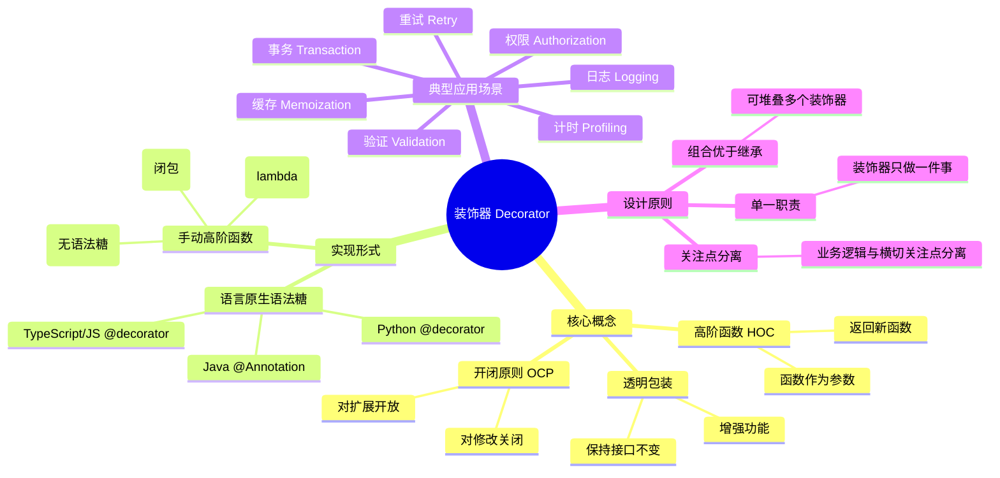
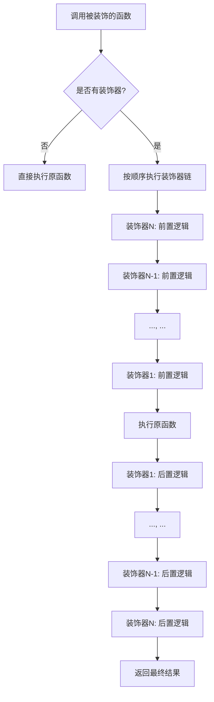
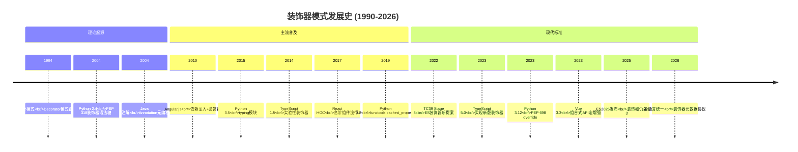
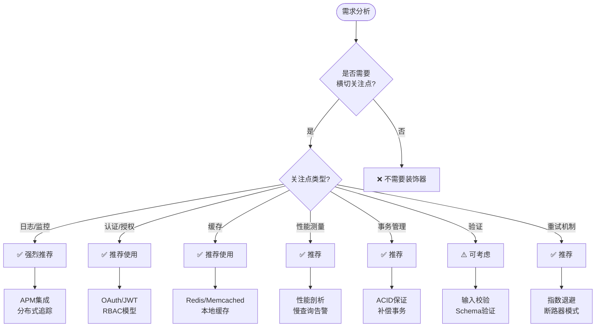

# 编程范式游记（5）- 修饰器模式 [2026重制版]

> **原文发布时间**：2018年
> **重制时间**：2026年6月
> **核心主题**：装饰器/修饰器模式的现代实践与跨语言实现

## 核心变更说明

自2018年以来，装饰器（Decorator）模式发生了重大演进：

1. **TypeScript 5.x**：实现对Stage 3版ECMAScript装饰器的支持（截至2026年9月该提案仍为Stage 3，尚未进入年度标准），支持自动访问器装饰器、装饰器元数据
2. **Python 3.12+**：PEP 698 - `override`装饰器、参数规范增强、`typing.override`
3. **Java 21+**：注解（Annotation）处理器成熟，Spring 6.x AOP增强
4. **Go 1.18+泛型+反射**：更优雅的装饰器实现方式
5. **前端框架统一**：Angular、NestJS 等框架原生支持装饰器

**数据来源**：
- [TC39 Proposal - Decorators](https://github.com/tc39/proposal-decorators)
- [Python PEP 698 - Override Decorator](https://peps.python.org/pep-0698/)
- [MDN Web Docs - Expressions and operators: Decorator](https://developer.mozilla.org/en-US/docs/Web/JavaScript/Reference/Operators/decorators)
- [Angular Documentation - Decorators](https://angular.io/guide/decorator-decorators)

---

## 修饰器模式定义与思维导图

### 什么是装饰器模式？

装饰器（Decorator）模式是一种结构型设计模式，它允许向一个现有的对象添加新的功能，同时又不改变其结构。这种模式创建了一个装饰类，用来包装原有的类，并在保持类方法签名完整性的前提下，提供了额外的功能。

根据原文的核心观点：

> **装饰器模式本质上是用函数来构造另一个函数（高阶函数），在不修改原函数代码的情况下，动态地扩展函数的功能。**

#### 装饰器模式分类与关系图



### 装饰器执行流程图



---

## 语言特性演进时间线



---

## 代码示例对比（2018 vs 2026）

### 示例一：基础装饰器Hello World

#### ❌ 2018年版本（Python 2风格）

```python
# 原文中的Python 2实现
def hello(fn):
    def wrapper():
        print "hello, %s" % fn.__name__
        fn()
        print "goodbye, %s" % fn.__name__
    return wrapper

@hello
def Hao():
    print "i am Hao Chen"

Hao()
# 输出:
# hello, Hao
# i am Hao Chen
# goodbye, Hao
```

**问题分析**：
- 使用Python 2 print语句（已过时）
- 没有类型注解
- 不保留原函数元数据（需要手动wraps）
- 不支持异步函数

#### ✅ 2026年版本（多语言现代实现）

**TypeScript 5.x - Stage 3标准装饰器**：

```typescript
// TypeScript 5.0+ 支持新版ECMA装饰器提案

// 1. 类方法装饰器（自动访问器装饰器）
function log(
    target: ClassAccessorDecoratorTarget,
    context: ClassAccessorDecoratorContext
): ClassAccessorDecoratorResult {
    const name = String(context.name);

    return {
        get(this: unknown) {
            console.log(`📖 Getting ${name}`);
            // 调用原始getter
            return target.get.call(this);
        },
        set(this: unknown, value: unknown) {
            console.log(`✏️ Setting ${name} to`, value);
            // 调用原始setter
            target.set.call(this, value);
        }
    };
}

// 2. 方法装饰器
function measure(
    target: any,
    context: ClassMethodDecoratorContext
): (...args: any[]) => any {
    return function (this: any, ...args: any[]) {
        const start = performance.now();
        const result = target.call(this, ...args);
        const duration = performance.now() - start;
        console.log(`⏱️ ${String(context.name)} took ${(duration).toFixed(2)}ms`);
        return result;
    };
}

// 3. 类装饰器
function entity(tableName: string) {
    return <T extends new (...args: any[]) => any>(constructor: T) => {
        return class extends constructor {
            _tableName = tableName;

            getTableName() {
                return this._tableName;
            }
        };
    };
}

// 使用示例
@entity('users')
class User {
    constructor(private id: number, private name: string) {}

    @log
    accessor fullName: string = '';

    @measure
    greet(greeting: string = 'Hello') {
        return `${greeting}, my name is ${this.name}!`;
    }

    @measure
    async fetchProfile(): Promise<{ bio: string; avatar: string }> {
        // 模拟API调用
        await new Promise(resolve => setTimeout(resolve, 100));
        return { bio: 'Software Engineer', avatar: '/avatar.jpg' };
    }
}

// 使用
const user = new User(1, '张三');
user.fullName = 'Zhang San';  // 触发 setter 日志
console.log(user.fullName);   // 触发 getter 日志
console.log(user.greet('你好'));
await user.fetchProfile();     // 自动计时
console.log(`Table: ${(user as any).getTableName()}`);
```

**Python 3.12+ - 类型安全装饰器**：

```python
from __future__ import annotations
import functools
import time
from typing import (
    TypeVar,
    Callable,
    ParamSpec,
    Any,
    override,
)
from dataclasses import dataclass
from enum import Enum


P = ParamSpec('P')
R = TypeVar('R')


# 通用日志装饰器（带类型推断）
def log_execution[
    **P, R
](
    func: Callable[P, R],
) -> Callable[P, R]:
    """
    记录函数执行的装饰器
    使用 PEP 695 新语法进行泛型声明
    """
    @functools.wraps(func)
    def wrapper(*args: P.args, **kwargs: P.kwargs) -> R:
        func_name = func.__qualname__
        print(f"🚀 开始执行: {func_name}")
        print(f"   参数: args={args}, kwargs={kwargs}")

        start_time = time.perf_counter()
        try:
            result = func(*args, **kwargs)
            duration = time.perf_counter() - start_time
            print(f"✅ 执行成功: {func_name} ({duration:.4f}s)")
            return result
        except Exception as e:
            duration = time.perf_counter() - start_time
            print(f"❌ 执行失败: {func_name} ({duration:.4f}s)")
            print(f"   错误: {e}")
            raise

    return wrapper


# 缓存装饰器（带TTL）
def cache[T](ttl_seconds:%20float%20=%2060.0):
    """
    带过期时间的缓存装饰器
    使用泛型约束返回类型
    """
    cache_dict: dict[tuple, tuple[T, float]] = {}

    def decorator(func: Callable[..., T]) -> Callable[..., T]:
        @functools.wraps(func)
        def wrapper(*args, **kwargs) -> T:
            # 创建可哈希的键
            key = (args, frozenset(kwargs.items()))

            current_time = time.time()

            if key in cache_dict:
                cached_result, cached_time = cache_dict[key]
                if current_time - cached_time < ttl_seconds:
                    print(f"🎯 命中缓存: {func.__name__}{args}")
                    return cached_result

            # 未命中，执行函数
            result = func(*args, **kwargs)
            cache_dict[key] = (result, current_time)
            return result

        # 提供清除缓存的方法
        wrapper.clear_cache = lambda: cache_dict.clear()  # type: ignore
        return wrapper

    return decorator


# 权限检查装饰器
class Permission(Enum):
    READ = "read"
    WRITE = "write"
    ADMIN = "admin"


def require_permission(permission: Permission):
    """权限检查装饰器"""
    def decorator(func):
        @functools.wraps(func)
        def wrapper(self, *args, **kwargs):
            if not hasattr(self, '_permissions'):
                raise PermissionError("对象没有权限属性")

            if permission not in self._permissions:
                current_user = getattr(self, '_current_user', 'anonymous')
                raise PermissionError(
                    f"用户 '{current_user}' 没有 {permission.value} 权限"
                )

            return func(self, *args, **kwargs)

        return wrapper
    return decorator


# PEP 698: override 装饰器
class BaseService:
    """基类"""
    def process(self, data: dict[str, Any]) -> dict[str, Any]:
        """处理数据的基础实现"""
        return {"status": "processed", "data": data}


class AdvancedService(BaseService):
    """子类 - 重写父类方法"""

    @override  # PEP 698: 明确标记这是重写
    def process(self, data: dict[str, Any]) -> dict[str, Any]:
        """增强的处理逻辑"""
        enriched_data = {**data, "timestamp": time.time()}
        return super().process(enriched_data)


# 使用示例
@log_execution
@cache(ttl_seconds=30)
def fetch_user_profile(user_id: int) -> dict[str, str]:
    """获取用户信息（模拟API调用）"""
    print(f"📡 正在从数据库获取用户 {user_id} 的信息...")
    time.sleep(0.1)  # 模拟网络延迟
    return {
        "id": str(user_id),
        "name": f"用户{user_id}",
        "email": f"user{user_id}@example.com",
    }


# 测试
if __name__ == "__main__":
    # 第一次调用（未命中缓存）
    profile1 = fetch_user_profile(123)
    print(f"结果: {profile1}\n")

    # 第二次调用（命中缓存）
    profile2 = fetch_user_profile(123)
    print(f"结果: {profile2}\n")

    # 清除缓存后再调用
    fetch_user_profile.clear_cache()  # type: ignore
    profile3 = fetch_user_profile(456)
    print(f"结果: {profile3}")
```

**Go 1.25+ - 泛型装饰器**：

```go
package main

import (
	"fmt"
	"time"
)

// 泛型装饰器函数类型
type DecoratorFunc[T any] func(T) T

// 日志装饰器
func WithLogging[T any](fn%20func(...any) T) func(...any) T {
	return func(args ...any) T {
		fmt.Printf("🚀 开始执行: %v\n", args)
		start := time.Now()

		result := fn(args...)

		duration := time.Since(start)
		fmt.Printf("✅ 完成 (%v)\n", duration)
		return result
	}
}

// 重试装饰器
func WithRetry[T any](maxRetries%20int,%20fn%20func(...any) T) func(...any) T {
	return func(args ...any) T {
		var result T

		for attempt := 1; attempt <= maxRetries; attempt++ {
			result = fn(args...)
			// 示例简化：实际应由业务结果判断是否重试，这里演示重试间隔
			if attempt < maxRetries {
				fmt.Printf("⚠️ 第%d次重试...\n", attempt)
				time.Sleep(time.Duration(attempt) * 100 * time.Millisecond)
			}
		}

		return result
	}
}

// 计时装饰器
func WithTiming[T any](label%20string,%20fn%20func(...any) T) func(...any) T {
	return func(args ...any) T {
		start := time.Now()
		result := fn(args...)
		duration := time.Since(start)
		fmt.Printf("⏱️ [%s] 耗时: %v\n", label, duration)
		return result
	}
}

// 业务函数
func FetchUserData(args ...any) map[string]interface{} {
	userID, _ := args[0].(int)
	time.Sleep(50 * time.Millisecond) // 模拟延迟
	return map[string]interface{}{
		"id":        userID,
		"name":      fmt.Sprintf("User_%d", userID),
		"fetchedAt": time.Now().Format(time.RFC3339),
	}
}

func CalculateSum(args ...any) int {
	sum := 0
	for _, n := range args {
		if v, ok := n.(int); ok {
			sum += v
		}
	}
	return sum
}

func main() {
	// 装饰业务函数
	loggedFetch := WithLogging(FetchUserData)
	timedFetch := WithTiming("fetch_user", loggedFetch)
	retriedFetch := WithRetry(3, timedFetch)

	// 使用装饰后的函数
	userData := retriedFetch(42)
	fmt.Printf("用户数据: %+v\n\n", userData)

	// 另一个例子：计算求和
	timedCalc := WithTiming("calculate_sum", WithLogging(CalculateSum))
	result := timedCalc(1, 2, 3, 4, 5)
	fmt.Printf("计算结果: %d\n", result)
}
```

---

### 示例二：HTTP中间件管道（实战应用）

#### ❌ 2018年版本（嵌套调用）

```python
# 原文中的Go HTTP中间件
http.HandleFunc("/v1/hello", WithServerHeader(WithAuthCookie(hello)))
http.HandleFunc("/v2/hello", WithServerHeader(WithBasicAuth(hello)))
http.HandleFunc("/v3/hello", WithServerHeader(WithBasicAuth(WithDebugLog(hello))))
```

**问题分析**：
- 嵌套层次深时难以阅读
- 装饰顺序不直观
- 无法动态组合中间件

#### ✅ 2026年版本（声明式管道）

**TypeScript - Express/Fastify风格中间件**：

```typescript
import { Request, Response, NextFunction } from 'express';

// 中间件类型定义
type Middleware = (req: Request, res: Response, next: NextFunction) => void | Promise<void>;

// 装饰器工厂：创建中间件
function createMiddleware(config: {
    name: string;
    before?: (req: Request) => void | Promise<void>;
    after?: (req: Request, res: Response) => void | Promise<void>;
}): Middleware {
    return async (req, res, next) => {
        const startTime = Date.now();

        // 前置逻辑
        if (config.before) {
            await config.before(req);
        }

        // 执行下一个中间件
        await new Promise<void>((resolve, reject) => {
            next();
            resolve();
        });

        // 后置逻辑
        if (config.after) {
            await config.after(req, res);
        }

        const duration = Date.now() - startTime;
        console.log(`[${config.name}] ${req.method} ${req.path} (${duration}ms)`);
    };
}

// 预定义中间件
const withCORS = createMiddleware({
    name: 'CORS',
    before: (req) => {
        console.log('设置CORS头');
    }
});

const withAuth = createMiddleware({
    name: 'AUTH',
    before: async (req) => {
        const token = req.headers.authorization?.replace('Bearer ', '');
        if (!token) {
            throw new Error('未授权');
        }
        console.log(`验证Token: ${token.substring(0, 10)}...`);
    }
});

const withRateLimit = createMiddleware({
    name: 'RATE_LIMIT',
    before: (req) => {
        console.log('检查速率限制');
    }
});

const withLogging = createMiddleware({
    name: 'LOGGING',
});

// 管道组合函数
function composeMiddleware(middlewares: Middleware[]): Middleware {
    return (req, res, next) => {
        let index = 0;

        const dispatch = (i: number): void => {
            if (i >= middlewares.length) {
                return next();
            }
            middlewares[i](req,%20res,%20() => dispatch(i + 1));
        };

        dispatch(0);
    };
}

// 声明式组装路由
const apiPipeline = composeMiddleware([
    withLogging,
    withCORS,
    withAuth,
    withRateLimit,
]);

const publicPipeline = composeMiddleware([
    withLogging,
    withCORS,
]);

// 使用
app.use('/api/*', apiPipeline);
app.use('/public/*', publicPipeline);
```

**Python 3.11+ - FastAPI风格依赖注入**：

```python
from __future__ import annotations
import functools
import time
from typing import Callable, ParamSpec, TypeVar, Any
from dataclasses import dataclass
from enum import Enum

P = ParamSpec('P')
R = TypeVar('R')


class HttpMethod(Enum):
    GET = "GET"
    POST = "POST"
    PUT = "PUT"
    DELETE = "DELETE"


@dataclass
class RequestContext:
    """请求上下文"""
    method: HttpMethod
    path: str
    headers: dict[str, str]
    user: dict[str, Any] | None = None
    metadata: dict[str, Any] | None = None

    def __post_init__(self):
        if self.metadata is None:
            self.metadata = {}


# 中间件类型
Middleware = Callable[[Callable[P, R]], Callable[P, R]]


def middleware(name: str) -> Callable[[Callable], Middleware]:
    """中间件装饰器工厂"""
    def decorator(factory_func: Callable[..., Middleware]) -> Middleware:
        @functools.wraps(factory_func)
        def wrapper(*args, **kwargs) -> Middleware:
            mid = factory_func(*args, **kwargs)
            mid._middleware_name = name  # type: ignore
            return mid
        return wrapper
    return decorator


@middleware("auth")
def require_auth(roles: list[str] | None = None) -> Middleware:
    """认证中间件"""
    def decorator(func: Callable[P, R]) -> Callable[P, R]:
        @functools.wraps(func)
        async def wrapper(*args: P.args, **kwargs: P.kwargs) -> R:
            ctx: RequestContext = kwargs.get('context')

            if not ctx or not ctx.user:
                raise PermissionError("未认证用户")

            if roles and ctx.user.get('role') not in roles:
                raise PermissionError(f"权限不足，需要: {roles}")

            print(f"✅ 用户认证通过: {ctx.user['username']}")
            return func(*args, **kwargs)

        return wrapper
    return decorator


@middleware("rate_limit")
def rate_limit(requests_per_minute: int = 60) -> Middleware:
    """速率限制中间件"""
    def decorator(func: Callable[P, R]) -> Callable[P, R]:
        @functools.wraps(func)
        async def wrapper(*args: P.args, **kwargs: P.kwargs) -> R:
            ctx: RequestContext = kwargs.get('context')
            client_ip = ctx.headers.get('x-forwarded-for', 'unknown') if ctx else 'unknown'

            print(f"🔢 检查速率限制: {client_ip} ({requests_per_minute}/min)")

            start_time = time.perf_counter()
            result = func(*args, **kwargs)
            duration = time.perf_counter() - start_time

            if duration > 1.0:
                print(f"⚠️ 慢请求警告: {duration:.2f}s")

            return result

        return wrapper
    return decorator


@middleware("cache")
def cache_response(ttl_seconds: int = 300) -> Middleware:
    """响应缓存中间件"""
    cache_store: dict[str, tuple[R, float]] = {}

    def decorator(func: Callable[P, R]) -> Callable[P, R]:
        @functools.wraps(func)
        async def wrapper(*args: P.args, **kwargs: P.kwargs) -> R:
            cache_key = f"{func.__qualname__}:{args}:{kwargs}"
            current_time = time.time()

            if cache_key in cache_store:
                cached_result, cached_at = cache_store[cache_key]
                if current_time - cached_at < ttl_seconds:
                    print(f"🎯 命中缓存: {func.__name__}")
                    return cached_result

            result = func(*args, **kwargs)
            cache_store[cache_key] = (result, current_time)
            return result

        # 附加清除缓存的方法
        wrapper.clear_cache = lambda: cache_store.clear()  # type: ignore
        return wrapper
    return decorator


# 业务处理函数
@require_auth(roles=["admin", "editor"])
@rate_limit(requests_per_minute=30)
@cache_response(ttl_seconds=60)
async def get_dashboard_stats(
    date_range: str,
    *,
    context: RequestContext,
) -> dict[str, Any]:
    """获取仪表盘统计数据"""
    print(f"📊 生成报表: {date_range}")

    # 模拟数据处理
    await asyncio.sleep(0.05)  # type: ignore

    return {
        "total_users": 12580,
        "active_sessions": 342,
        "revenue_today": 45678.90,
        "generated_at": time.strftime("%Y-%m-%d %H:%M:%S"),
    }


# 模拟使用
async def main():
    ctx = RequestContext(
        method=HttpMethod.GET,
        path="/api/dashboard/stats",
        headers={"x-forwarded-for": "192.168.1.100"},
        user={"username": "admin_zhang", "role": "admin"},
    )

    stats = await get_dashboard_stats("2026-06-01:2026-06-06", context=ctx)
    print(f"\n📈 统计数据:\n{stats}")

    # 再次调用（应命中缓存)
    stats2 = await get_dashboard_stats("2026-06-01:2026-06-06", context=ctx)
    print(f"\n📈 缓存数据:\n{stats2}")


import asyncio
asyncio.run(main())
```

---

### 示例三：类装饰器与元数据

#### ❌ 2018年版本（简单类装饰器）

```python
# 原文中的简单类装饰器
class myDecorator(object):
    def __init__(self, fn):
        print "inside myDecorator.__init__()"
        self.fn = fn

    def __call__(self):
        self.fn()
        print "inside myDecorator.__call__()"

@myDecorator
def aFunction():
    print "inside aFunction()"
```

#### ✅ 2026年版本（元数据驱动的类装饰器）

**TypeScript - 元数据反射系统**：

```typescript
import 'reflect-metadata';

// 自定义装饰器元数据的Key
const METADATA_KEYS = {
    ROUTE: 'route',
    VALIDATE: 'validate',
    ROLE: 'required_role',
    CACHE: 'cache_config',
} as const;

// 路由装饰器
function Get(path: string) {
    return function (target: any, propertyKey: string, descriptor: PropertyDescriptor) {
        Reflect.defineMetadata(METADATA_KEYS.ROUTE, { method: 'GET', path }, target, propertyKey);
    };
}

function Post(path: string) {
    return function (target: any, propertyKey: string, descriptor: PropertyDescriptor) {
        Reflect.defineMetadata(METADATA_KEYS.ROUTE, { method: 'POST', path }, target, propertyKey);
    };
}

// 参数验证装饰器
function Validate(rules: Record<string, any>) {
    return function (target: any, propertyKey: string, parameterIndex: number) {
        const existingRules = Reflect.getOwnMetadata(METADATA_KEYS.VALIDATE, target, propertyKey) || [];
        existingRules[parameterIndex] = rules;
        Reflect.defineMetadata(METADATA_KEYS.VALIDATE, existingRules, target, propertyKey);
    };
}

// 角色要求装饰器
function RequireRole(role: string) {
    return function (target: any, propertyKey: string, descriptor: PropertyDescriptor) {
        Reflect.defineMetadata(METADATA_KEYS.ROLE, role, target, propertyKey);
    };
}

// 缓存配置装饰器
function Cacheable(options: { ttl: number; keyGenerator?: string }) {
    return function (target: any, propertyKey: string, descriptor: PropertyDescriptor) {
        Reflect.defineMetadata(METADATA_KEYS.CACHE, options, target, propertyKey);
    };
}

// 控制器类装饰器
function Controller(prefix: string) {
    return function <T extends { new (...args: any[]): {} }>(constructor: T) {
        return class extends constructor {
            _prefix = prefix;

            getPrefix() {
                return this._prefix;
            }
        };
    };
}

// 使用示例
@Controller('/api/v1/users')
class UserController {

    @Get('/')
    @RequireRole('admin')
    @Cacheable({ ttl: 300 })
    async getAllUsers(): Promise<User[]> {
        return [];
    }

    @Post('/')
    @Validate({ username: { type: 'string', minLength: 3 }, email: { type: 'email' }})
    async createUser(
        @Validate({ type: 'uuid'}) userId: string,
        body: CreateUserDTO
    ): Promise<User> {
        return {} as User;
    }

    @Get('/:id')
    async getUserById(@Validate({ type: 'string', format: 'uuid'}) id: string): Promise<User> {
        return {} as User;
    }
}

// 元数据读取工具
function getRouteMetadata(target: any, propertyKey: string) {
    return Reflect.getMetadata(METADATA_KEYS.ROUTE, target, propertyKey);
}

function getValidationMetadata(target: any, propertyKey: string) {
    return Reflect.getMetadata(METADATA_KEYS.VALIDATE, target, propertyKey);
}

// 读取并打印所有路由
for (const key of Object.getOwnPropertyNames(UserController.prototype)) {
    if (key !== 'constructor') {
        const routeMeta = getRouteMetadata(UserController.prototype, key);
        const validationMeta = getValidationMetadata(UserController.prototype, key);

        console.log(`路由: ${JSON.stringify(routeMeta)}`);
        console.log(`验证规则: ${JSON.stringify(validationMeta)}`);
    }
}
```

---

## 适用场景分析

### 装饰器模式适用场景决策树



### 常见装饰器模式库

| 库名/框架 | 语言 | 用途 | 特点 |
|----------|------|------|------|
| **Express/Koa中间件** | Node.js | HTTP处理 | 异步管道 |
| **Django装饰器** | Python | Web开发 | 内置丰富 |
| **Spring AOP** | Java | 企业级 | 注解驱动 |
| **FastAPI Depends** | Python | API开发 | 依赖注入 |
| **tsyringe** | TypeScript | DI容器 | 装饰器注入 |
| **inversify** | TypeScript | IoC容器 | 完整DI方案 |

---

## 最佳实践清单

### ✅ 装饰器最佳实践（2026年版）

#### 1. **始终使用functools.wraps / 保留元数据**

```python
# ❌ 丢失原函数信息
def bad_decorator(func):
    def wrapper(*args, **kwargs):
        return func(*args, **kwargs)
    return wrapper

# ✅ 保留元数据
import functools

def good_decorator[T: Callable](func:%20T) -> T:
    @functools.wraps(func)
    def wrapper(*args, **kwargs):
        return func(*args, **kwargs)
    return wrapper  # type: ignore
```

#### 2. **保持装饰器的单一职责**

```typescript
// ❌ 一个装饰器做太多事
function badDecorator(target: any, context: any) {
    // 同时做日志、验证、缓存、权限...
}

// ✅ 每个装饰器只做一件事
function log() { /* 只记录日志 */ }
function validate(schema: object) { /* 只做验证 */ }
function cache(options: CacheOptions) { /* 只做缓存 */ }
function auth(role: string) { /* 只检查权限 */ }

// 组合使用
class MyService {
    @log()
    @auth('admin')
    @cache({ ttl: 300 })
    @validate(userSchema)
    async getUser(id: string) { ... }
}
```

#### 3. **支持异步函数**

```python
# 支持 sync 和 async 的通用装饰器
import functools
import inspect
import asyncio
from typing import Callable, TypeVar, ParamSpec

P = ParamSpec('P')
R = TypeVar('R')


def universal_decorator[
    **P, R
](func:%20Callable[P,%20R]) -> Callable[P, R]:
    """
    同时支持同步和异步函数的装饰器
    """
    @functools.wraps(func)
    async def async_wrapper(*args: P.args, **kwargs: P.kwargs) -> R:
        print("前置逻辑 (async)")
        if inspect.iscoroutinefunction(func):
            result = await func(*args, **kwargs)
        else:
            result = func(*args, **kwargs)
        print("后置逻辑 (async)")
        return result  # type: ignore

    @functools.wraps(func)
    def sync_wrapper(*args: P.args, **kwargs: P.kwargs) -> R:
        print("前置逻辑 (sync)")
        result = func(*args, **kwargs)
        print("后置逻辑 (sync)")
        return result  # type: ignore

    # 根据原函数类型返回对应的wrapper
    if inspect.iscoroutinefunction(func):
        return async_wrapper  # type: ignore
    return sync_wrapper  # type: ignore
```

#### 4. **提供配置和禁用能力**

```typescript
// 可配置的装饰器
interface RetryOptions {
    maxAttempts: number;
    backoffMs: number;
    retryableErrors: string[];
    enabled?: boolean;  // 支持禁用
}

function Retry(options: Partial<RetryOptions> = {}) {
    const defaults: RetryOptions = {
        maxAttempts: 3,
        backoffMs: 1000,
        retryableErrors: ['ECONNREFUSED', 'ETIMEDOUT', '5xx'],
        enabled: true,
    };

    const config = { ...defaults, ...options };

    return function (
        target: any,
        propertyKey: string,
        descriptor: PropertyDescriptor
    ) {
        if (!config.enabled) {
            return descriptor;  // 直接返回，不包装
        }

        const originalMethod = descriptor.value;

        descriptor.value = async function (...args: any[]) {
            let lastError: Error;

            for (let attempt = 1; attempt <= config.maxAttempts; attempt++) {
                try {
                    return await originalMethod.apply(this, args);
                } catch (error: any) {
                    lastError = error;
                    if (attempt < config.maxAttempts && isRetryable(error)) {
                        const delay = config.backoffMs * Math.pow(2, attempt - 1);
                        await sleep(delay);
                        continue;
                    }
                    throw lastError;
                }
            }
        };

        return descriptor;
    };
}
```

#### 5. **错误处理要完善**

```go
// Go: 装饰器中的错误传播
func WithErrorHandling[T any](fn%20func(...any) (T, error)) func(...any) (T, error) {
	return func(args ...any) (T, error) {
		var zero T

		result, err := fn(args...)
		if err != nil {
			// 记录错误上下文
			fmt.Printf("❌ 错误发生: %v (参数: %v)\n", err, args)

			// 可以选择：包装错误、转换错误类型、或恢复默认值
			return zero, fmt.Errorf("operation failed: %w", err)
		}

		return result, nil
	}
}
```

---

## 延伸资源与学习路径

### 📚 官方权威资源

1. **TC39 Decorators Proposal**
   - URL: https://github.com/tc39/proposal-decorators
   - 内容：ECMAScript装饰器官方提案文档

2. **Python PEP 318 - Decorators for Functions and Methods**
   - URL: https://peps.python.org/pep-0318/
   - 内容：Python装饰器语法的原始提案

3. **Python PEP 698 - Override Decorator**
   - URL: https://peps.python.org/pep-0698/
   - 内容：Python 3.12新增的override装饰器

4. **Angular Decorators Guide**
   - URL: https://angular.io/guide/decorator-decorators
   - 内容：Angular中装饰器的完整指南

### 📖 经典书籍推荐

| 书名 | 作者 | 年份 | 重点内容 |
|------|------|------|---------|
| *Design Patterns* | GoF | 1994 | 装饰器模式原始定义 |
| *Python Cookbook* | Beazley, Jones | 2013 | 大量装饰器实践 |
| *Learning JavaScript Design Patterns* | Osmani | 2012 | JS中的设计模式 |
| *Refactoring to Patterns* | Kerievsky | 2004 | 重构到模式 |

---

## 总结

### 🎯 装饰器模式核心要点

1. **开闭原则的最佳实践**
   - 不修改原有代码即可扩展功能
   - 通过组合而非继承实现复用

2. **横切关注点的解决方案**
   - 日志、监控、认证、缓存等
   - 与业务逻辑解耦

3. **声明式的元编程**
   - 配置即代码
   - 运行时可读的意图表达

4. **可堆叠、可组合**
   - 多个装饰器可以叠加使用
   - 动态调整装饰器顺序

### 💡 2026年的趋势

- **元数据标准化**：Reflect Metadata成为事实标准
- **AOT编译优化**：装饰器在编译期展开以提升性能
- **AI辅助生成**：LLM能根据注释自动生成装饰器
- **跨框架统一**：装饰器元数据协议趋于一致

> **记住**：装饰器是"语法糖"，其本质仍是高阶函数。理解底层原理后，即使语言不支持装饰器语法糖，也能用函数组合实现相同效果。

---

**相关文章导航**：
- [33 | 编程范式游记（4）- 函数式编程](25-编程范式游记（4）-函数式编程-[2026重制版].md)
- [35 | 编程范式游记（6）- 面向对象编程](27-编程范式游记（6）-面向对象编程-[2026重制版].md)

**参考来源**：
- [TypeScript 5.0 Release Notes - Decorators](https://devblogs.microsoft.com/typescript/announcing-typescript-5-0/)
- [Python 3.12 What's New - PEP 698](https://docs.python.org/3.12/whatsnew/3.12.html#pep-698-override-decorator)
- [TC39 Proposals Tracker - Stage 3 Decorators](https://github.com/tc39/proposals)
- [Go Blog: Generics](https://go.dev/blog/generics-proposal)
