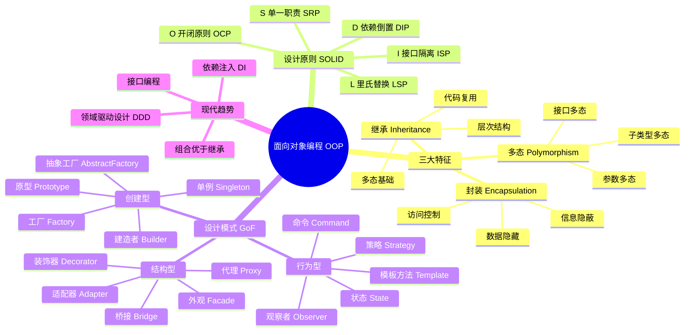
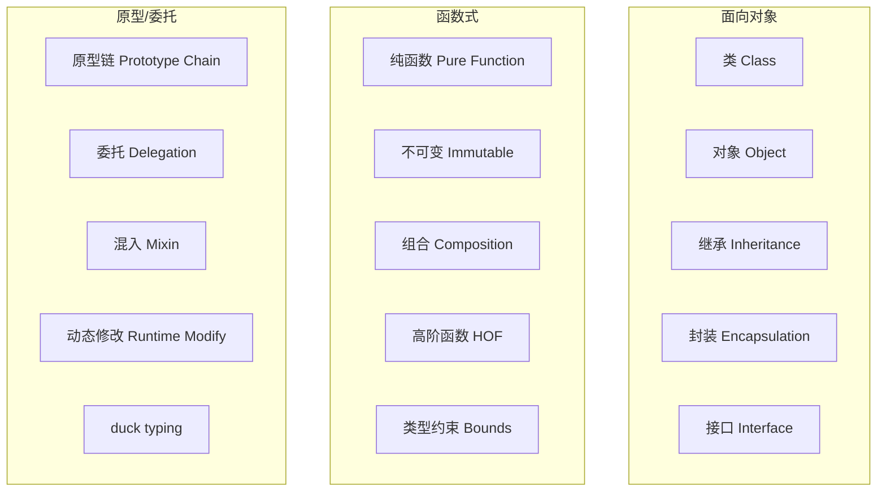
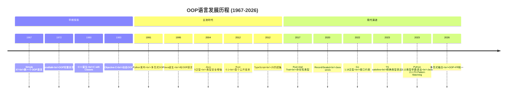
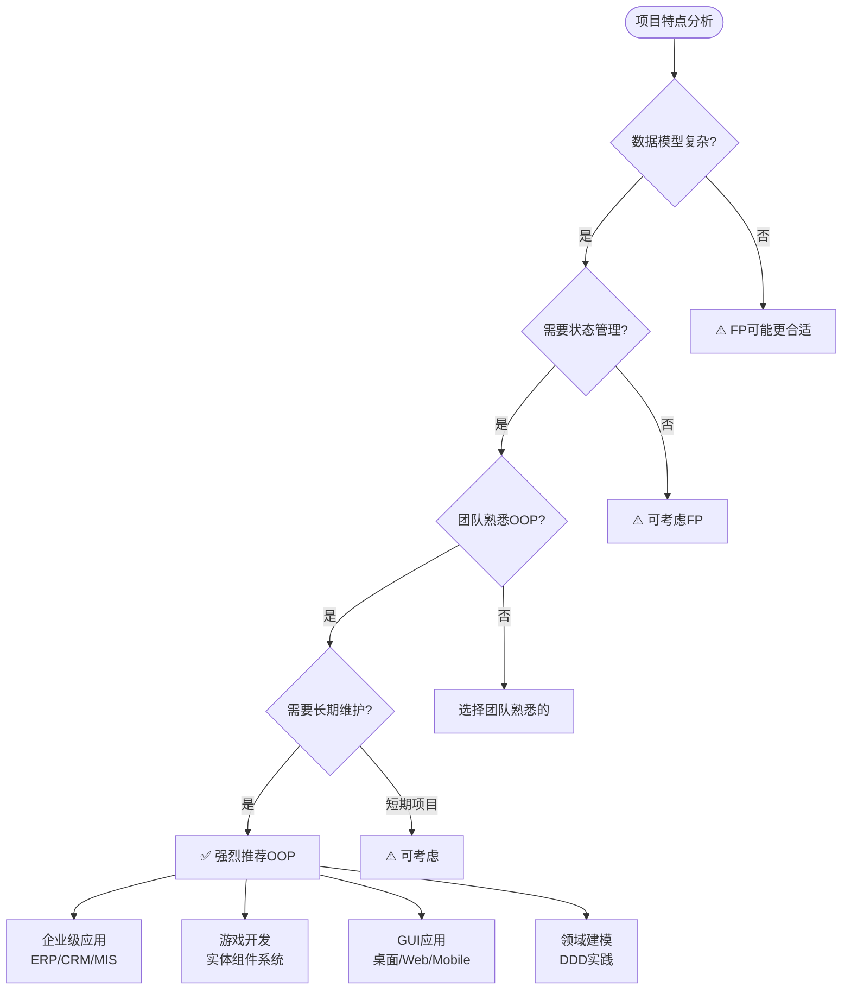

# 编程范式游记（6）- 面向对象编程 [2026重制版]

> **原文发布时间**：2018年
> **重制时间**：2026年6月
> **核心主题**：面向对象编程的现代实践与设计模式演进

## 核心变更说明

自2018年以来，OOP领域发生了重要演进：

1. **TypeScript 5.x**：`satisfies`操作符、`using`声明、装饰器（Stage 3提案）支持
2. **Rust 1.80+**：trait系统成熟、async trait、GATs（泛型关联类型）
3. **Java 21+**：Record类、Sealed Classes、Pattern Matching for switch、虚拟线程
4. **Python 3.12+**：Protocol classes增强、dataclass改进、Type Parameter Syntax (PEP 695)
5. **Go 1.21+**：结构化日志（slog）、泛型与接口推断持续增强

**数据来源**：
- [OOP Principles - Wikipedia](https://en.wikipedia.org/wiki/Object-oriented_programming)
- [Design Patterns: Elements of Reusable OO Software](https://en.wikipedia.org/wiki/Design_Patterns)
- [SOLID Principles - Robert C. Martin](https://butunclebob.com/ArticleTitle.S.I.L.I.D.Principles)
- [Rust Book - Chapter 10: OOP](https://doc.rust-lang.org/book/ch10-02-traits.html)

---

## 面向对象编程定义与思维导图

### 什么是面向对象编程？

面向对象编程（Object-Oriented Programming, OOP）是一种基于"对象"概念的编程范式，它将数据（属性）和代码（方法）封装在对象中，并通过对象之间的交互来设计程序。

根据原文引用的GoF《设计模式》核心理念：

> **1. "Program to an 'interface', not an 'implementation'."**
> **2. "Favor 'object composition' over 'class inheritance'."**

#### OOP核心概念全景图



### OOP vs 函数式 vs 原型对比图



---

## 语言特性演进时间线



---

## 代码示例对比（2018 vs 2026）

### 示例一：策略模式（订单计价）

#### ❌ 2018年版本（传统Java风格）

```java
// 原文中的Java实现
interface BillingStrategy {
    public double getActPrice(double rawPrice);
}

class NormalStrategy implements BillingStrategy {
    @Override
    public double getActPrice(double rawPrice) {
        return rawPrice;
    }
}

class HappyHourStrategy implements BillingStrategy {
    @Override
    public double getActPrice(double rawPrice) {
        return rawPrice * 0.5;
    }
}
```

#### ✅ 2026年版本（现代多语言实现）

**TypeScript 5.x - 泛型 + 联合类型**：

```typescript
// 定义价格策略接口
interface PricingStrategy {
    name: string;
    calculate(originalPrice: number): number;
    description?: string;
}

// 具体策略实现
const strategies = {
    normal: {
        name: '正常价格',
        calculate: (price: number) => price,
        description: '原价销售',
    } satisfies PricingStrategy,

    happyHour: {
        name: '欢乐时光',
        calculate: (price: number) => price * 0.5,
        description: '50%折扣',
    } satisfies PricingStrategy,

    vipDiscount: {
        name: 'VIP折扣',
        calculate: (price: number) => {
            if (price > 1000) return price * 0.85; // 大额85折
            if (price > 500) return price * 0.9;   // 中额9折
            return price * 0.95;                    // 小额95折
        },
        description: '阶梯式VIP优惠',
    } satisfies PricingStrategy,

    seasonalPromotion: {
        name: '季节促销',
        calculate: (price: number, season?: string) => {
            const multipliers: Record<string, number> = {
                summer: 0.7,
                winter: 0.8,
                spring: 0.9,
                autumn: 0.85,
            };
            const multiplier = season ? (multipliers[season] ?? 1) : 0.75;
            return price * multiplier;
        },
        description: '按季节浮动',
    } satisfies PricingStrategy,
};

type StrategyName = keyof typeof strategies;

// 使用联合类型约束
class OrderProcessor<T extends StrategyName = StrategyName> {
    private items: OrderItem[] = [];
    private defaultStrategy: T;

    constructor(defaultStrategy: T) {
        this.defaultStrategy = defaultStrategy;
    }

    addItem(item: OrderItem): void {
        this.items.push(item);
    }

    calculateTotal(strategyOverride?: T): OrderSummary {
        const strategy = strategyOverride ?? this.defaultStrategy;
        const pricingFn = strategies[strategy];

        let subtotal = 0;
        const details = this.items.map(item => {
            const originalTotal = item.price * item.quantity;
            const discountedTotal = pricingFn.calculate(originalTotal);
            subtotal += discountedTotal;

            return {
                name: item.name,
                original: originalTotal,
                discounted: discountedTotal,
                strategy: strategy,
            };
        });

        const tax = subtotal * 0.13;
        const grandTotal = subtotal + tax;

        return {
            strategyUsed: pricingFn.name,
            items: details,
            subtotal: Math.round(subtotal * 100) / 100,
            tax: Math.round(tax * 100) / 100,
            grandTotal: Math.round(grandTotal * 100) / 100,
        };
    }
}

// 类型定义
interface OrderItem {
    name: string;
    price: number;
    quantity: number;
}

interface ItemDetail {
    name: string;
    original: number;
    discounted: number;
    strategy: StrategyName;
}

interface OrderSummary {
    strategyUsed: string;
    items: ItemDetail[];
    subtotal: number;
    tax: number;
    grandTotal: number;
}

// 使用示例
const processor = new OrderProcessor('normal');

processor.addItem({ name: '笔记本电脑', price: 8000, quantity: 1 });
processor.addItem({ name: '机械键盘', price: 500, quantity: 2 });
processor.addItem({ name: '鼠标', price: 200, quantity: 3 });

console.log('=== 正常价格 ===');
console.log(processor.calculateTotal());

console.log('\n=== 欢乐时光 ===');
console.log(processor.calculateTotal('happyHour'));

console.log('\n=== VIP折扣 ===');
console.log(processor.calculateTotal('vipDiscount'));
```

**Rust - Trait系统（零成本抽象）**：

```rust
use std::fmt;

/// 价格策略Trait（类似接口）
trait PricingStrategy: fmt::Debug {
    fn name(&self) -> &str;
    fn calculate(&self, original_price: f64) -> f64;
    fn description(&self) -> &str { "默认策略" }
}

/// 正常价格策略
#[derive(Debug)]
struct NormalPricing;

impl PricingStrategy for NormalPricing {
    fn name(&self) -> &str { "正常价格" }
    fn calculate(&self, price: f64) -> f64 { price }
}

/// VIP折扣策略
#[derive(Debug)]
struct VipDiscount { level: VipLevel }

#[derive(Debug, Clone, Copy)]
enum VipLevel { Regular, Gold, Platinum }

impl PricingStrategy for VipDiscount {
    fn name(&self) -> &str { "VIP折扣" }
    fn description(&self) -> &str { "阶梯式VIP优惠" }

    fn calculate(&self, price: f64) -> f64 {
        match self.level {
            VipLevel::Regular => price * 0.95,
            VipLevel::Gold => price * 0.90,
            VipLevel::Platinum => price * 0.85,
        }
    }
}

/// 季节促销策略
#[derive(Debug)]
struct SeasonalPromotion { season: Season }

#[derive(Debug, Clone, Copy)]
enum Season { Summer, Winter, Spring, Autumn }

impl PricingStrategy for SeasonalPromotion {
    fn name(&self) -> &str { "季节促销" }
    fn description(&self) -> &str { "按季节浮动" }

    fn calculate(&self, price: f64) -> f64 {
        let multiplier = match self.season {
            Season::Summer => 0.70,
            Season::Winter => 0.80,
            Season::Spring => 0.90,
            Season::Autumn => 0.85,
        };
        price * multiplier
    }
}

/// 订单项
#[derive(Debug, Clone)]
struct OrderItem {
    name: String,
    price: f64,
    quantity: u32,
}

/// 订单处理器（使用泛型约束）
struct OrderProcessor<S: PricingStrategy> {
    items: Vec<OrderItem>,
    strategy: S,
}

impl<S: PricingStrategy> OrderProcessor<S> {
    fn new(strategy: S) -> Self {
        Self { items: Vec::new(), strategy }
    }

    fn add_item(&mut self, item: OrderItem) {
        self.items.push(item);
    }

    fn calculate_total(&self) -> OrderSummary {
        let mut details = Vec::new();
        let mut subtotal = 0.0;

        for item in &self.items {
            let original = item.price * item.quantity as f64;
            let discounted = self.strategy.calculate(original);
            subtotal += discounted;

            details.push(ItemDetail {
                name: item.name.clone(),
                original,
                discounted,
            });
        }

        let tax = subtotal * 0.13;
        let grand_total = subtotal + tax;

        OrderSummary {
            strategy_name: self.strategy.name().to_string(),
            items: details,
            subtotal: (subtotal * 100.0).round() / 100.0,
            tax: (tax * 100.0).round() / 100.0,
            grand_total: (grand_total * 100.0).round() / 100.0,
        }
    }
}

#[derive(Debug)]
struct ItemDetail {
    name: String,
    original: f64,
    discounted: f64,
}

#[derive(Debug)]
struct OrderSummary {
    strategy_name: String,
    items: Vec<ItemDetail>,
    subtotal: f64,
    tax: f64,
    grand_total: f64,
}

fn main() {
    let mut processor = OrderProcessor::new(NormalPricing);

    processor.add_item(OrderItem {
        name: "笔记本".into(), price: 8000.0, quantity: 1,
    });
    processor.add_item(OrderItem {
        name: "键盘".into(), price: 500.0, quantity: 2,
    });
    processor.add_item(OrderItem {
        name: "鼠标".into(), price: 200.0, quantity: 3,
    });

    println!("=== 正常价格 ===\n{:#?}", processor.calculate_total());

    let mut vip_processor = OrderProcessor::new(VipDiscount { level: VipLevel::Platinum });
    vip_processor.add_item(OrderItem {
        name: "笔记本".into(), price: 8000.0, quantity: 1,
    });
    vip_processor.add_item(OrderItem {
        name: "键盘".into(), price: 500.0, quantity: 2,
    });

    println!("\n=== VIP白金折扣 ===\n{:#?}", vip_processor.calculate_total());
}
```

**Python 3.12+ - Protocol + dataclass**：

```python
from __future__ import annotations
from abc import ABC, abstractmethod
from dataclasses import dataclass, field
from enum import Enum
from typing import Protocol, runtime_checkable


class StrategyName(str, Enum):
    NORMAL = "normal"
    HAPPY_HOUR = "happy_hour"
    VIP_DISCOUNT = "vip_discount"
    SEASONAL = "seasonal"


@runtime_checkable
class PricingStrategy(Protocol):
    """价格策略协议（接口）"""
    @property
    def name(self) -> str: ...
    def calculate(self, original_price: float) -> float: ...


@dataclass(frozen=True)
class NormalPricing:
    """正常价格策略"""
    name: str = field(default="正常价格", init=False)

    def calculate(self, original_price: float) -> float:
        return original_price


@dataclass(frozen=True)
class VipDiscount:
    """VIP折扣策略"""
    level: str  # regular, gold, platinum
    name: str = field(default="VIP折扣", init=False)

    def calculate(self, original_price: float) -> float:
        discounts = {"regular": 0.95, "gold": 0.90, "platinum": 0.85}
        multiplier = discounts.get(self.level, 1.0)
        return original_price * multiplier


@dataclass(frozen=True)
class OrderItem:
    """订单项"""
    name: str
    price: float
    quantity: int


@dataclass
class OrderSummary:
    """订单汇总"""
    strategy_used: str
    items: list[dict[str, object]]
    subtotal: float
    tax: float
    grand_total: float


class OrderProcessor:
    """订单处理器"""

    def __init__(self, strategy: PricingStrategy):
        self._items: list[OrderItem] = []
        self._strategy = strategy

    def add_item(self, item: OrderItem) -> None:
        self._items.append(item)

    def calculate_total(
        self, override_strategy: PricingStrategy | None = None
    ) -> OrderSummary:
        strategy = override_strategy or self._strategy
        details = []
        subtotal = 0.0

        for item in self._items:
            original = item.price * item.quantity
            discounted = strategy.calculate(original)
            subtotal += discounted

            details.append({
                "name": item.name,
                "original": round(original, 2),
                "discounted": round(discounted, 2),
            })

        tax = subtotal * 0.13
        grand_total = subtotal + tax

        return OrderSummary(
            strategy_used=strategy.name,
            items=details,
            subtotal=round(subtotal, 2),
            tax=round(tax, 2),
            grand_total=round(grand_total, 2),
        )


# 使用示例
def main():
    processor = OrderProcessor(NormalPricing())

    processor.add_item(OrderItem("笔记本电脑", 8000.0, 1))
    processor.add_item(OrderItem("机械键盘", 500.0, 2))
    processor.add_item(OrderItem("鼠标", 200.0, 3))

    print("=== 正常价格 ===")
    summary = processor.calculate_total()
    print(f"策略: {summary.strategy_used}")
    print(f"小计: ¥{summary.subtotal:,.2f}")
    print(f"税费: ¥{summary.tax:,.2f}")
    print(f"总计: ¥{summary.grand_total:,.2f}")

    print("\n=== VIP白金折扣 ===")
    vip_summary = processor.calculate_total(VipDiscount(level="platinum"))
    print(f"策略: {vip_summary.strategy_used}")
    print(f"总计: ¥{vip_summary.grand_total:,.2f}")


if __name__ == "__main__":
    main()
```

---

### 示例二：资源管理（RAII模式）

#### ❌ 2018年版本（手动资源管理）

```cpp
// 原文中的问题代码
mutex m;

void foo() {
    m.lock();
    Func();
    if ( ! everythingOk() ) return;  // 忘记unlock！
    m.unlock();
}
```

#### ✅ 2026年版本（现代资源管理模式）

**TypeScript - using声明与Disposable**：

```typescript
// TypeScript 5.2+: Explicit Resource Management
interface Disposable {
    [Symbol.dispose](): void;
}

// 数据库连接池
class DatabaseConnection implements Disposable {
    private pool: ConnectionPool;
    private connectionId: string;
    private isReleased = false;

    constructor(pool: ConnectionPool) {
        this.pool = pool;
        this.connectionId = pool.acquire();
        console.log(`📡 获取连接: ${this.connectionId}`);
    }

    query<T>(sql: string, params?: unknown[]): Promise<T[]> {
        if (this.isReleased) {
            throw new Error('连接已释放');
        }
        console.log(`🔍 执行查询: ${sql}`);
        return this.pool.execute<T>(this.connectionId, sql, params);
    }

    // 实现Disposable接口
    [Symbol.dispose](): void {
        if (!this.isReleased) {
            console.log(`🔒 释放连接: ${this.connectionId}`);
            this.pool.release(this.connectionId);
            this.isReleased = true;
        }
    }
}

// 使用using自动管理资源
async function processUserOrder(userId: string) {
    // 连接会在作用域结束时自动释放
    using db = new DatabaseConnection(connectionPool);

    try {
        const user = await db.query<User>(
            'SELECT * FROM users WHERE id = $1',
            [userId]
        );

        const orders = await db.query<Order>(
            'SELECT * FROM orders WHERE user_id = $1',
            [userId]
        );

        // 处理业务逻辑...
        return { user, orders };

    } catch (error) {
        // 即使抛出异常，连接也会被正确释放
        console.error('处理失败:', error);
        throw error;
    }
    // ← 此处自动调用 db[Symbol.dispose]()
}
```

**Rust - 所有权系统（编译期保证）**：

```rust
/// 文件句柄包装器（RAII）
struct FileHandle {
    path: std::path::PathBuf,
    file: Option<std::fs::File>,
}

impl FileHandle {
    fn new(path: impl Into<std::path::PathBuf>) -> std::io::Result<Self> {
        let path = path.into();
        let file = std::fs::OpenOptions::new()
            .read(true)
            .write(true)
            .create(true)
            .open(&path)?;

        Ok(Self {
            path,
            file: Some(file),
        })
    }

    fn write_line(&mut self, content: &str) -> std::io::Result<()> {
        if let Some(ref mut file) = self.file {
            use std::io::Write;
            writeln!(file, "{}", content)?;
        }
        Ok(())
    }

    fn read_content(&self) -> std::io::Result<String> {
        if let Some(ref file) = self.file {
            use std::io::Read;
            let mut content = String::new();
            file.take(1024).read_to_string(&mut content)?;
            Ok(content)
        } else {
            Ok(String::new())
        }
    }
}

/// RAII: Drop trait 在作用域结束时自动调用
impl Drop for FileHandle {
    fn drop(&mut self) {
        if let Some(file) = self.file.take() {
            println!("🔒 自动关闭文件: {}", self.path.display());
            // file 在这里被drop，资源被释放
        }
    }
}

fn process_data() -> std::io::Result<()> {
    // 创建文件句柄
    let mut handle = FileHandle::new("/tmp/data.txt")?;

    handle.write_line("Hello, RAII!")?;
    handle.write_line("资源自动管理")?;

    // 即使这里提前返回或panic，
    // Drop trait也会确保文件被关闭
    let content = handle.read_content()?;
    println!("文件内容: {}", content);

    Ok(())
    // ← handle 在这里被drop，文件自动关闭
}

fn main() {
    match process_data() {
        Ok(_) => println!("✅ 处理成功"),
        Err(e) => println!("❌ 处理失败: {}", e),
    }

    println!("程序结束");
}
```

---

## 适用场景分析

### OOP适用场景决策树



---

## 最佳实践清单

### ✅ OOP最佳实践（2026年版）

#### 1. **优先组合而非继承**

```typescript
// ❌ 深层继承导致脆弱
class Animal { ... }
class Mammal extends Animal { ... }
class Dog extends Mammal { ... }
class GoldenRetriever extends Dog { ... }

// ✅ 组合提供灵活性
interface CanBark { bark(): void }
interface CanSwim { swim(): void }
interface CanFetch { fetch(item: string): void }

class Dog implements CanBark, CanSwim, CanFetch {
    constructor(private abilities: Set<string>) {}

    bark() { console.log("汪汪!"); }
    swim() { console.log("狗刨式..."); }
    fetch(item: string) { console.log(`取回 ${item}`); }
}
```

#### 2. **依赖倒置原则（DIP）**

```python
# ❌ 直接依赖具体实现
class UserService:
    def __init__(self):
        self.db = MySQLDatabase()  # 紧耦合！

# ✅ 依赖抽象（接口）
class UserRepository(Protocol):
    def get_by_id(self, user_id: int) -> User | None: ...
    def save(self, user: User) -> None: ...


class UserService:
    def __init__(self, repo: UserRepository):
        self._repo = repo  # 依赖注入

# 可以注入任何实现
mysql_service = UserService(MySQLRepository())
postgres_service = UserService(PostgresRepository())
in_memory_service = UserService(InMemoryRepository())  # 测试用
```

#### 3. **使用Record/DataClass减少样板代码**

```java
// Java 21: Record类
public record User(
    String id,
    String name,
    String email,
    LocalDateTime createdAt
) {
    // 自动生成: equals, hashCode, toString, getters
    // 不可变（字段是final的）

    // 可以添加验证逻辑
    public User {
        Objects.requireNonNull(name, "名称不能为空");
        if (!email.contains("@")) {
            throw new IllegalArgumentException("邮箱格式无效");
        }
    }

    // 可以添加方法
    public boolean isAdult() {
        return ChronoUnit.YEARS.between(
            createdAt.toLocalDate(),
            LocalDate.now()
        ) >= 18;
    }
}
```

#### 4. **Sealed Classes限制继承范围**

```typescript
// TypeScript: 模拟sealed class（使用联合类型+never）
type Shape =
    | { kind: 'circle'; radius: number }
    | { kind: 'rectangle'; width: number; height: number }
    | { kind: 'triangle'; base: number; height: number };

function area(shape: Shape): number {
    switch (shape.kind) {
        case 'circle':
            return Math.PI * shape.radius ** 2;
        case 'rectangle':
            return shape.width * shape.height;
        case 'triangle':
            return (shape.base * shape.height) / 2;
        default:
            // TypeScript确保穷举检查
            const _exhaustive: never = shape;
            return _exhaustive;
    }
}
```

---

## 延伸资源与学习路径

### 📚 官方权威资源

1. **SOLID Principles - Uncle Bob**
   - URL: https://butunclebob.com/ArticleTitle.S.I.L.I.D.Principles
   - 内容：SOLID五大原则的权威解释

2. **Design Patterns - GoF**
   - URL: https://en.wikipedia.org/wiki/Design_Patterns
   - 内容：23种经典设计模式的完整参考

3. **Rust Book - Chapter 10: Generic Types, Traits, and Lifetime**
   - URL: https://doc.rust-lang.org/book/ch10-00-generic-types.html
   - 内容：Rust中OOP的实现方式

4. **Python Data Classes Documentation**
   - URL: https://docs.python.org/3/library/dataclasses.html
   - 内容：Python中简化类定义的工具

### 📖 经典书籍推荐

| 书名 | 作者 | 年份 | 重点内容 |
|------|------|------|---------|
| *Design Patterns* | GoF | 1994 | 23种经典模式 |
| *Clean Architecture* | R.C.Martin | 2017 | 架构与OOP原则 |
| *Domain-Driven Design* | Evans | 2003 | 领域驱动设计 |
| *Effective Java* | Bloch | 2018 | Java最佳实践 |
| *Programming Rust* | Blandy et al. | 2021 | Rust中的OOP |

---

## 总结

### 🎯 OOP核心要点回顾

1. **封装保护内部状态**
   - 通过访问控制隐藏实现细节
   - 提供稳定的公共接口

2. **组合优于继承**
   - 减少耦合度
   - 提高灵活性

3. **针对接口编程**
   - 解耦实现细节
   - 便于测试和替换

4. **单一职责原则**
   - 每个类只做一件事
   - 高内聚低耦合

### 💡 2026年的OOP趋势

- **Record/Value Objects普及**：不可变数据结构成为首选
- **Pattern Matching增强**：switch表达式更强大
- **多范式融合**：OOP + FP + PP混合使用
- **AI辅助设计**：LLM帮助生成符合SOLID的代码

> **记住**：OOP不是银弹，而是工具箱中的一件工具。最好的程序员能够根据问题特点，灵活选择最合适的范式。

---

**相关文章导航**：
- [34 | 编程范式游记（5）- 修饰器模式](26-编程范式游记（5）-修饰器模式-[2026重制版].md)
- [36 | 编程范式游记（7）- 基于原型的编程范式](28-编程范式游记（7）-基于原型的编程范式-[2026重制版].md)

**参考来源**：
- [TypeScript Handbook - Classes](https://www.typescriptlang.org/docs/handbook/2/classes.html)
- [Rust Book - Chapter 17: OOP](https://doc.rust-lang.org/book/ch17-00-oop.html)
- [Java 21 Documentation - Records](https://docs.oracle.com/en/java/javase/21/docs/records/index.html)
- [Python 3.13 Data Classes Enhancements](https://docs.python.org/3.13/library/dataclasses.html)
