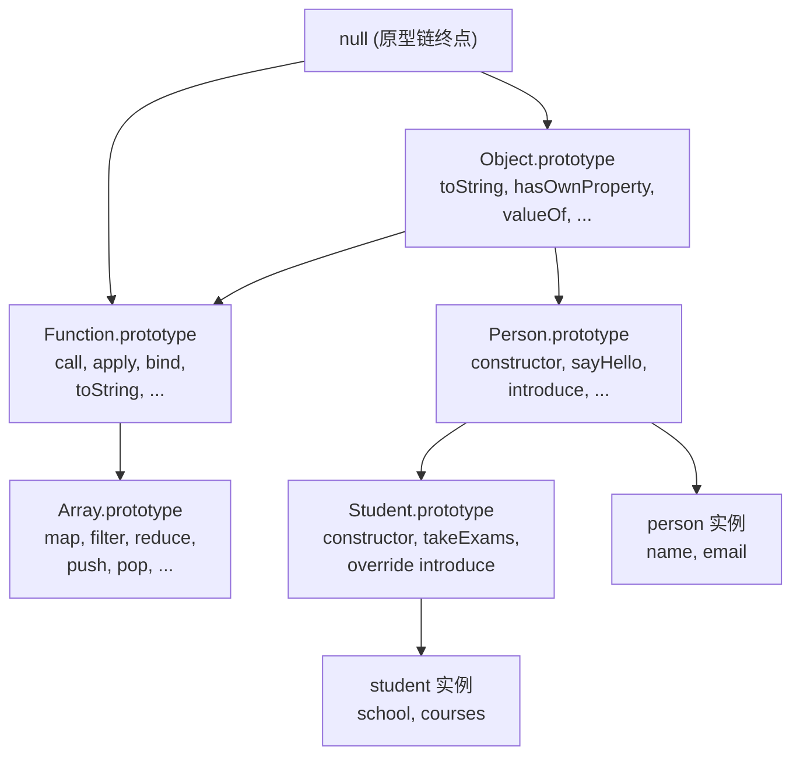
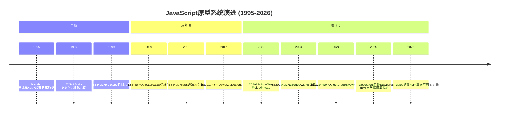
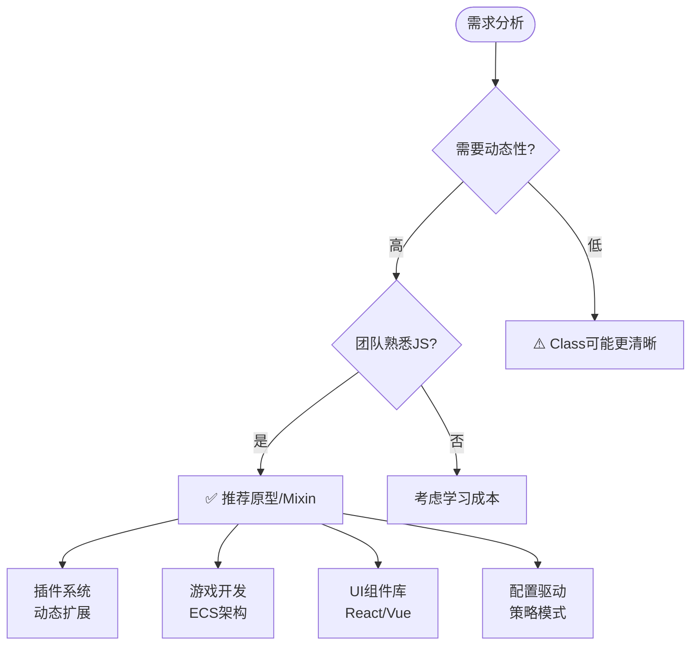

# 编程范式游记（7）- 基于原型的编程范式 [2026重制版]

> **原文发布时间**：2018年
> **重制时间**：2026年6月
> **核心主题**：原型继承、委托模式与现代JavaScript/TypeScript实践

## 核心变更说明

自2018年以来，基于原型的编程发生了重大变化：

1. **ECMAScript 2022+**：Class Fields、Private Methods、Static Initialization Blocks正式标准化
2. **TypeScript 5.x**：`satisfies`操作符、`using`声明、装饰器增强
3. **JavaScript引擎优化**：V8/SpiderMonkey对原型链访问性能大幅提升
4. **Proxy/Reflect API成熟**：元编程能力增强
5. **Object.groupBy()**：ES2024新增实用方法

**数据来源**：
- [ECMAScript Specification](https://tc39.es/ecma262/)
- [MDN Web Docs - Inheritance and the prototype chain](https://developer.mozilla.org/en-US/docs/Web/JavaScript/Inheritance_and_the_prototype_chain)
- [JavaScript: The Core - Dmitry Soshnikov](http://dmitrysoshnikov.com/ecmascript/javascript-the-core/)
- [You Don't Know JS: this & Object Prototypes](https://github.com/getify/You-Dont-Know-JS/tree/1st-ed/this%20%26%20object%20prototypes)

---

## 原型编程定义与思维导图

### 什么是基于原型的编程？

基于原型的编程（Prototype-based Programming）是一种OOP的实现方式，它不使用类（class）来定义对象的结构和行为，而是通过**克隆（cloning）现有的对象**来创建新对象，并通过**原型链（prototype chain）**实现属性和方法的共享与继承。

根据原文核心观点：

> **原型编程不使用类化的方式，直接在对象上进行修改和扩展，通过委托（delegation）机制在运行时查找属性和方法。**

#### 原型编程 vs 基于类的编程

```mermaid
flowchart LR
    subgraph ClassBased["基于类的编程 Class-Based"]
        direction TB
        C1[定义类 Class<br/>蓝图/模板]
        C2[实例化 new()<br/>创建对象]
        C3[继承 extends<br/>类层次结构]
        C4[静态类型检查<br/>编译时确定]
    end

    subgraph PrototypeBased["基于原型的编程 Prototype-Based"]
        direction TB
        P1[直接创建对象<br/>Object Literal]
        P2[克隆/委托<br/>__proto__/prototype]
        P3[动态修改<br/>运行时扩展]
        P4[动态类型<br/>运行时确定]
    end

    ClassBased -.->|ES6+语法糖| PrototypeBased

```

### JavaScript原型系统全景图

```mermaid
mindmap
  root((JavaScript原型系统))
    核心概念
      __proto__
        对象内部指针
        指向原型对象
        [[Prototype]]
      prototype
        函数的属性
        用于new构造
        构造器原型
      constructor
        prototype上的引用
        指向构造函数

    原型链查找
      属性访问 obj.prop
        先查自身属性
        再查__proto__
        递归直到null
      方法调用 obj.method()
        this指向调用者
        遵循原型链

    创建对象的方式
      字面量 {}
        Object.prototype
      new 构造函数
        Constructor.prototype
      Object.create()
        指定原型
      class语法糖
        底层仍是原型

    继承方式
      原型链继承
        Child.prototype = new Parent()
      构造函数借用
        Parent.call(this)
      组合继承
        以上两者结合
      ES6 class extends
        语法糖简化
      Object.setPrototypeOf()
        运行时修改
```

### 原型链示意图



---

## 语言特性演进时间线



---

## 代码示例对比（2018 vs 2026）

### 示例一：Person → Student 继承

#### ❌ 2018年版本（传统原型写法）

```javascript
// 原文中的ES5风格
function Person(fullName, email) {
    this.fullName = fullName;
    this.email = email;

    this.speak = function(){
        console.log("I speak English!");
    };
    this.introduction = function(){
        console.log("Hi, I am " + this.fullName);
    };
}

function Student(fullName, email, school, courses) {
    Person.call(this, fullName, email);
    this.school = school;
    this.courses = courses;

    this.introduction= function(){
        console.log("Hi, I am " + this.fullName +
            ". I am a student of " + this.school +
            ", I study "+ this.courses +".");
    };

    this.takeExams = function(){
        console.log("This is my exams time!");
    };
}

Student.prototype = Object.create(Person.prototype);
Student.prototype.constructor = Student;
```

**问题分析**：
- 手动管理原型链容易出错
- `call()`绑定this不够优雅
- 方法重复定义浪费内存
- 缺乏类型安全

#### ✅ 2026年版本（现代TypeScript + ES2022+）

**TypeScript 5.x - 完整类型安全的类继承**：

```typescript
// 使用ES2022+ Class Features + TypeScript 5.x 类型系统

/**
 * 基础人员接口
 */
interface IPerson {
    readonly id: string;
    fullName: string;
    email: string;
    createdAt: Date;

    speak(): void;
    introduce(): string;
}

/**
 * 抽象基类 - 使用abstract约束子类行为
 */
abstract class BasePerson implements IPerson {
    // Public fields (ES2022)
    readonly id: string;
    fullName: string;
    email: string;
    readonly createdAt: Date;

    // Private field (ES2022 #private)
    #internalNotes: string[] = [];

    constructor(id: string, fullName: string, email: string) {
        this.id = id;
        this.fullName = fullName;
        this.email = email;
        this.createdAt = new Date();
    }

    // 抽象方法 - 子类必须实现
    abstract speak(): void;

    // 具体方法 - 可被重写
    introduce(): string {
        return `你好，我是 ${this.fullName}！`;
    }

    // Protected method - 子类可访问
    protected addNote(note: string): void {
        this.#internalNotes.push(`[${new Date().toISOString()}] ${note}`);
    }

    // Getter for notes (只读暴露)
    get notes(): ReadonlyArray<string> {
        return this.#internalNotes;
    }

    // Static factory method
    static create(id: string, name: string, email: string): BasePerson {
        throw new Error('必须在子类中实现');
    }
}

/**
 * 学生类 - 继承BasePerson
 */
class Student extends BasePerson {
    // 新增属性
    school: string;
    major: string;
    #gpa: number;  // 私有字段
    #courses: Map<string, number>;  // 课程及成绩

    constructor(
        id: string,
        fullName: string,
        email: string,
        school: string,
        major: string
    ) {
        super(id, fullName, email);
        this.school = school;
        this.major = major;
        this.#gpa = 0.0;
        this.#courses = new Map();
    }

    // 实现抽象方法
    speak(): void {
        console.log(`${this.fullName} 说：我会说英语和中文！`);
    }

    // 重写父类方法（override关键字）
    override introduce(): string {
        return `${super.introduce()} 我就读于 ${this.school}，主修 ${this.major} 专业。`;
    }

    // 新增方法
    enroll(courseName: string, credits: number): void {
        if (this.#courses.has(courseName)) {
            console.log(`⚠️ 已选修课程: ${courseName}`);
            return;
        }
        this.#courses.set(courseName, credits);
        this.addNote(`选修课程: ${courseName} (${credits}学分)`);
        console.log(`✅ 选课成功: ${courseName}`);
    }

    takeExam(courseName: string, score: number): void {
        if (!this.#courses.has(courseName)) {
            throw new Error(`未选修课程: ${courseName}`);
        }

        const maxScore = 100;
        if (score < 0 || score > maxScore) {
            throw new Error('成绩必须在0-100之间');
        }

        this.addNote(`考试完成: ${courseName} - ${score}分`);
        this.#recalculateGPA();
    }

    // 私有辅助方法
    #recalculateGPA(): void {
        if (this.#courses.size === 0) {
            this.#gpa = 0.0;
            return;
        }

        let totalPoints = 0;
        let totalCredits = 0;

        // 假设所有课程都是4.0制
        for (const [_, credits] of this.#courses) {
            totalCredits += credits;
            totalPoints += 4.0 * credits;  // 简化计算
        }

        this.#gpa = totalPoints / totalCredits;
    }

    // 公开getter
    get gpa(): number {
        return Math.round(this.#gpa * 100) / 100;
    }

    get courseCount(): number {
        return this.#courses.size;
    }

    // 静态工厂方法
    static create(
        id: string,
        name: string,
        email: string,
        school: string,
        major: string
    ): Student {
        return new Student(id, name, email, school, major);
    }

    // 类方法 - 从JSON重建实例
    static fromJSON(data: Record<string, unknown>): Student {
        const student = Student.create(
            data.id as string,
            data.fullName as string,
            data.email as string,
            data.school as string,
            data.major as string
        );

        // 恢复私有状态（通过内部API）
        if (data.courses) {
            for (const [course, credits] of Object.entries(data.courses as Record<string, number>)) {
                student.enroll(course, credits);
            }
        }

        return student;
    }
}

// ==================== 使用示例 ====================

// 创建学生实例
const student = Student.create(
    'stu-001',
    '张三',
    'zhangsan@example.com',
    '北京大学',
    '计算机科学与技术'
);

// 调用方法
student.speak();
console.log(student.introduce());

// 选课
student.enroll('数据结构与算法', 4);
student.enroll('操作系统', 3);
student.enroll('计算机网络', 3);

// 参加考试
student.takeExam('数据结构与算法', 92);
student.takeExam('操作系统', 88);

// 访问公开信息
console.log('\n📊 学生信息:');
console.log(`姓名: ${student.fullName}`);
console.log(`学校: ${student.school}`);
console.log(`专业: ${student.major}`);
console.log(`已选课程数: ${student.courseCount}`);
console.log(`GPA: ${student.gpa}`);

// 访问笔记（只读）
console.log('\n📝 操作日志:');
for (const note of student.notes) {
    console.log(`  ${note}`);
}

// 序列化为JSON
const jsonStr = JSON.stringify(student, null, 2);
console.log('\n💾 JSON序列化:');
console.log(jsonStr.substring(0, 200) + '...');

// 从JSON恢复
const restored = Student.fromJSON(JSON.parse(jsonStr));
console.log('\n♻️ 恢复后:');
console.log(restored.introduce());
```

**纯JavaScript (ES2022+) - 无需编译的现代写法**：

```javascript
// 使用最新的ECMAScript特性（无需TypeScript）

class Person {
    // 公共字段声明 (ES2022)
    id;
    fullName;
    email;
    #createdAt;  // 私有字段

    // 静态字段
    static instanceCount = 0;

    constructor(id, fullName, email) {
        this.id = id;
        this.fullName = fullName;
        this.email = email;
        this.#createdAt = new Date();
        Person.instanceCount++;
    }

    // 方法
    speak() {
        console.log(`${this.fullName}: Hello!`);
    }

    introduce() {
        return `我是 ${this.fullName}`;
    }

    // Getter
    get age() {
        return Date.now() - this.#createdAt.getTime();
    }

    // 静态方法
    static compare(a, b) {
        return a.fullName.localeCompare(b.fullName);
    }

    // 私有方法
    #validateEmail(email) {
        return /^[^\s@]+@[^\s@]+\.[^\s@]+$/.test(email);
    }
}

class Student extends Person {
    #gpa;
    #grades = new Map();

    constructor(id, fullName, email, school, major) {
        super(id, fullName, email);
        this.school = school;
        this.major = major;
        this.#gpa = 0;
    }

    // 重写方法
    introduce() {
        return `${super.introduce()}，我就读于${this.school}`;
    }

    // 新方法
    addGrade(course, grade) {
        this.#grades.set(course, grade);
        this.#calculateGPA();
    }

    #calculateGPA() {
        if (this.#grades.size === 0) {
            this.#gpa = 0;
            return;
        }
        let sum = 0;
        for (const grade of this.#grades.values()) {
            sum += grade;
        }
        this.#gpa = sum / this.#grades.size;
    }

    get gpa() {
        return Math.round(this.#gpa * 100) / 100;
    }
}

// 使用
const s = new Student('1', '李四', 'li@test.com', '清华', 'CS');
s.speak();
console.log(s.introduce());
s.addGrade('数学', 95);
s.addGrade('英语', 88);
console.log(`GPA: ${s.gpa}`);

// 原型链验证
console.log(s instanceof Student);     // true
console.log(s instanceof Person);       // true
console.log(Student.prototype instanceof Person.prototype.constructor); // true
```

---

### 示例二：动态原型修改与Mixin

#### ❌ 2018年版本（直接修改原型）

```javascript
// 原文中的直接修改方式
var foo = {name: "foo", one: 1, two: 2};
var bar = {three: 3};
bar.__proto__ = foo;  // 直接设置原型
bar.one;              // 1 (从原型获取)
```

**问题分析**：
- 直接操作`__proto__`影响性能
- 不符合最佳实践
- 在严格模式下可能受限

#### ✅ 2026年版本（Proxy + Mixin组合）

**TypeScript - Mixin模式（组合优于继承）**：

```typescript
// ====== Mixin 工具函数 ======

// Type-safe mixin工厂函数
type Constructor<T = object> = new (...args: any[]) => T;

// Timestampable Mixin - 添加时间戳功能
function Timestamped<TBase extends Constructor>(Base: TBase) {
    return class Timestamped extends Base {
        #timestamp!: number;

        constructor(...args: any[]) {
            super(...args);
            this.#timestamp = Date.now();
        }

        get timestamp(): number {
            return this.#timestamp;
        }

        get age(): number {
            return Date.now() - this.#timestamp;
        }

        refresh(): void {
            this.#timestamp = Date.now();
        }
    };
}

// Serializable Mixin - 添加序列化功能
function Serializable<TBase extends Constructor>(Base: TBase) {
    return class Serializable extends Base {
        serialize(): string {
            return JSON.stringify(this);
        }

        static deserialize<T>(json: string): T {
            const obj = JSON.parse(json);
            return Object.assign(new (this as any)(), obj);
        }
    };
}

// Validatable Mixin - 添加验证功能
function Validatable<TBase extends Constructor>(Base: TBase) {
    return class Validatable extends Base {
        #errors: string[] = [];
        #rules: Map<keyof this, (value: any) => string | null> = new Map();

        addRule<K extends keyof this>(
            property: K,
            validator: (value: this[K]) => string | null
        ): void {
            this.#rules.set(property, validator as any);
        }

        validate(): boolean {
            this.#errors = [];
            let isValid = true;

            for (const [property, validator] of this.#rules) {
                const error = validator(this[property]);
                if (error) {
                    this.#errors.push(error);
                    isValid = false;
                }
            }

            return isValid;
        }

        get errors(): ReadonlyArray<string> {
            return [...this.#errors];
        }
    };
}

// ====== 使用Mixins构建实体类 ======

// 基础实体
class BaseEntity {
    id: string;
    version: number;

    constructor(id: string) {
        this.id = id;
        this.version = 1;
    }

    incrementVersion(): void {
        this.version++;
    }
}

// 组合多个Mixins
const EnhancedEntity = Timestamped(Serializable(Validatable(BaseEntity)));

// 用户实体
class User extends EnhancedEntity {
    name: string;
    email: string;
    role: 'admin' | 'user' | 'guest';

    constructor(id: string, name: string, email: string, role: User['role']) {
        super(id);
        this.name = name;
        this.email = email;
        this.role = role;

        // 添加验证规则
        this.addRule('email', (value: string) => {
            if (!/^[^\s@]+@[^\s@]+\.[^\s@]+$/.test(value)) {
                return '邮箱格式无效';
            }
            return null;
        });

        this.addRule('name', (value: string) => {
            if (value.length < 2) {
                return '名称至少2个字符';
            }
            return null;
        });
    }

    // 自定义序列化逻辑
    override serialize(): string {
        const data = {
            id: this.id,
            name: this.name,
            email: this.email,
            role: this.role,
            version: this.version,
            createdAt: this.timestamp,
        };
        return JSON.stringify(data);
    }
}

// ==================== 使用示例 ====================

const user = new User('user-001', '王五', 'wangwu@test.com', 'admin');

console.log('=== 用户信息 ===');
console.log(`ID: ${user.id}`);
console.log(`名称: ${user.name}`);
console.log(`邮箱: ${user.email}`);
console.log(`角色: ${user.role}`);
console.log(`版本: ${user.version}`);
console.log(`创建时间: ${new Date(user.timestamp).toLocaleString()}`);
console.log(`存活时间: ${(user.age / 1000).toFixed(0)}秒`);

// 验证
console.log('\n=== 验证测试 ===');
console.log(`验证结果: ${user.validate() ? '✅ 通过' : '❌ 失败'}`);
if (user.errors.length > 0) {
    console.log('错误:', user.errors);
}

// 序列化
console.log('\n=== 序列化 ===');
const json = user.serialize();
console.log(json);

// 反序列化
console.log('\n=== 反序列化 ===');
const restored = User.deserialize<User>(json);
console.log(restored.name);  // "王五"
console.log(restored.email); // "wangwu@test.com"
```

**Proxy API - 元编程能力**：

```typescript
// 使用Proxy实现观察者模式
function makeObservable<T extends object>(target: T): T {
    const listeners = new Map<string, Set<Function>>();

    const handler: ProxyHandler<T> = {
        set(obj, prop, value) {
            const oldValue = (obj as any)[prop];
            const result = Reflect.set(obj, prop, value);

            // 触发变化通知
            if (result && oldValue !== value) {
                const propListeners = listeners.get(String(prop));
                if (propListeners) {
                    propListeners.forEach(listener =>
                        listener(prop, oldValue, value)
                    );
                }

                // 通用变化监听器
                const globalListeners = listeners.get('*');
                if (globalListeners) {
                    globalListeners.forEach(listener =>
                        listener(prop, oldValue, value)
                    );
                }
            }

            return result;
        },
    };

    const proxy = new Proxy(target, handler);

    // 添加订阅方法
    (proxy as any).subscribe = (
        property: string | '*',
        callback: (prop: string, oldVal: any, newVal: any) => void
    ) => {
        if (!listeners.has(property)) {
            listeners.set(property, new Set());
        }
        listeners.get(property)!.add(callback);

        // 返回取消订阅函数
        return () => {
            listeners.get(property)?.delete(callback);
        };
    };

    return proxy;
}

// 使用
const state = makeObservable({
    user: { name: '初始用户', count: 0 },
    theme: 'light',
});

// 订阅变化
const unsubUser = state.subscribe('user', (prop, oldVal, newVal) => {
    console.log(`📢 ${prop} 变化:`, oldVal, '→', newVal);
});

const unsubAny = state.subscribe('*', (prop, oldVal, newVal) => {
    console.log(`🔔 任何属性变化: ${prop}`);
});

// 修改状态
state.user = { name: '新用户', count: 10 };  // 触发两个监听器
state.theme = 'dark';  // 只触发通用监听器

// 取消订阅
unsubUser();
state.user = { name: '再次变化', count: 20 };  // 只触发通用监听器
```

---

## 适用场景分析

### 何时选择原型/委托模式？



### 原型模式的典型应用

| 场景 | 推荐程度 | 实现方式 | 代表框架 |
|------|---------|---------|---------|
| **UI组件继承** | ⭐⭐⭐⭐⭐ | Class + Mixin | React, Vue |
| **插件架构** | ⭐⭐⭐⭐⭐ | Prototype chain | VSCode, Webpack |
| **游戏实体** | ⭐⭐⭐⭐ | ECS + Components | Unity ECS, Bevy |
| **API客户端** | ⭐⭐⭐⭐ | Class extends | Axios封装 |
| **配置对象** | ⭐⭐⭐⭐ | Object.create | 各种SDK |

---

## 最佳实践清单

### ✅ 原型编程最佳实践（2026年版）

#### 1. **优先使用class语法糖**

```typescript
// ❌ 手动操作原型链（过时）
function Animal(name) {
    this.name = name;
}
Animal.prototype.speak = function() { ... };

function Dog(name, breed) {
    Animal.call(this, name);
    this.breed = breed;
}
Dog.prototype = Object.create(Animal.prototype);
Dog.prototype.constructor = Dog;
Dog.prototype.bark = function() { ... };

// ✅ 使用class（更清晰）
class Animal {
    constructor(public name: string) {}
    speak(): void { ... }
}

class Dog extends Animal {
    constructor(name: string, public breed: string) {
        super(name);
    }
    bark(): void { ... }
}
```

#### 2. **善用组合（Mixin）替代深层继承**

```typescript
// ✅ Mixin模式提供灵活性
const CanFly = (Base: typeof GameObject) => class extends Base {
    fly(): void { console.log('飞行中...'); }
};

const CanSwim = (Base: typeof GameObject) => class extends Base {
    swim(): void { console.log('游泳中...'); }
};

// 按需组合
class Duck extends CanSwim(CanFly(GameObject)) {
    quack(): void { console.log('嘎嘎!'); }
}

class Penguin extends CanSwim(GameObject) {
    waddle(): void { console.log('摇摇摆摆...'); }
}
```

#### 3. **使用Private字段保护封装**

```javascript
// ES2022+: 真正的私有字段（#）
class BankAccount {
    #balance = 0;
    #owner;
    #transactionHistory = [];

    constructor(owner, initialBalance) {
        this.#owner = owner;
        this.#balance = initialBalance;
    }

    deposit(amount) {
        if (amount <= 0) throw new Error('金额必须为正');
        this.#balance += amount;
        this.#logTransaction('deposit', amount);
    }

    withdraw(amount) {
        if (amount > this.#balance) throw new Error('余额不足');
        this.#balance -= amount;
        this.#logTransaction('withdraw', amount);
    }

    get balance() {
        return this.#balance;  // 只读访问
    }

    #logTransaction(type, amount) {
        this.#transactionHistory.push({ type, amount, date: new Date() });
    }
}
```

#### 4. **避免直接修改内置原型**

```typescript
// ❌ 危险：污染全局原型
Array.prototype.first = function() {
    return this[0];
};

// ✅ 安全：使用工具函数或扩展
function first<T>(arr: T[]): T | undefined {
    return arr[0];
}

// 或者使用模块扩展
declare global {
    interface Array<T> {
        myCustomMethod(): T[];
    }
}
Array.prototype.myCustomMethod = function() { /* ... */ };
```

---

## 延伸资源与学习路径

### 📚 官方权威资源

1. **MDN - Inheritance and the prototype chain**
   - URL: https://developer.mozilla.org/en-US/docs/Web/JavaScript/Inheritance_and_the_prototype_chain
   - 内容：完整的原型继承教程

2. **ECMAScript Specification - Objects**
   - URL: https://tc39.es/ecma262/#sec-objects
   - 内容：对象模型的完整规范

3. **You Don't Know JS: this & Object Prototypes**
   - URL: https://github.com/getify/You-Dont-Know-JS
   - 内容：Kyle Simpson的经典免费书籍

4. **JavaScript: The Core**
   - URL: http://dmitrysoshnikov.com/ecmascript/javascript-the-core/
   - 内容：Dmitry Soshnikov的深度技术文章

---

## 总结

### 🎯 原型编程核心要点

1. **原型链是JavaScript的灵魂**
   - 理解`__proto__`、`prototype`、`constructor`三者的关系
   - 属性查找沿原型链向上进行

2. **Class是语法糖**
   - 底层仍然是原型继承
   - 但提供了更清晰的语法和更好的工具支持

3. **组合优于多层继承**
   - Mixin模式提供灵活的代码复用
   - 避免菱形继承等问题

4. **ES2022+ Private Fields是真私有**
   - 使用`#`前缀的字段外部无法访问
   - 比闭包模拟的"私有"更可靠

### 💡 2026年的趋势

- **Records & Tuples (Stage 2)**：真正的不可变值类型
- **Decorator Metadata Protocol**：统一的元数据标准
- **Pattern Matching增强**：switch表达式支持对象匹配
- **ShadowRealms (Stage 2.7)**：域内原型隔离

> **记住**：原型编程的核心思想是"委托而非继承"。理解这一点，就能写出更灵活、更符合JavaScript哲学的代码。

---

**相关文章导航**：
- [35 | 编程范式游记（6）- 面向对象编程](27-编程范式游记（6）-面向对象编程-[2026重制版].md)
- [37 | 编程范式游记（8）- Go语言的委托模式](29-编程范式游记（8）-Go语言的委托模式-[2026重制版].md)

**参考来源**：
- [MDN - Classes](https://developer.mozilla.org/en-US/docs/Web/JavaScript/Reference/Classes)
- [TypeScript Handbook - Classes](https://www.typescriptlang.org/docs/handbook/2/classes.html)
- [V8 Blog: Fast Properties](https://v8.dev/blog/fast-properties)
- [TC39 Proposal - Class Fields](https://github.com/tc39/proposal-class-fields)
