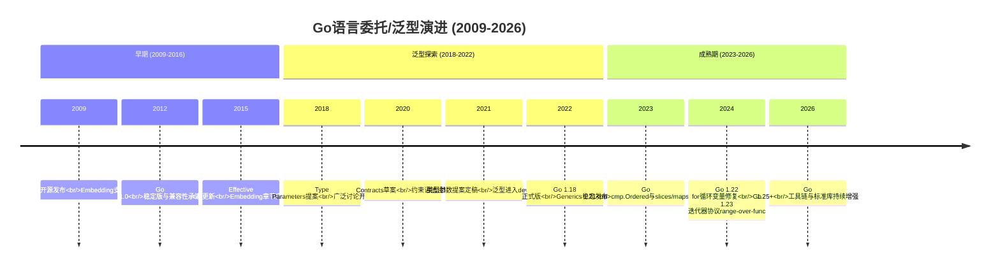
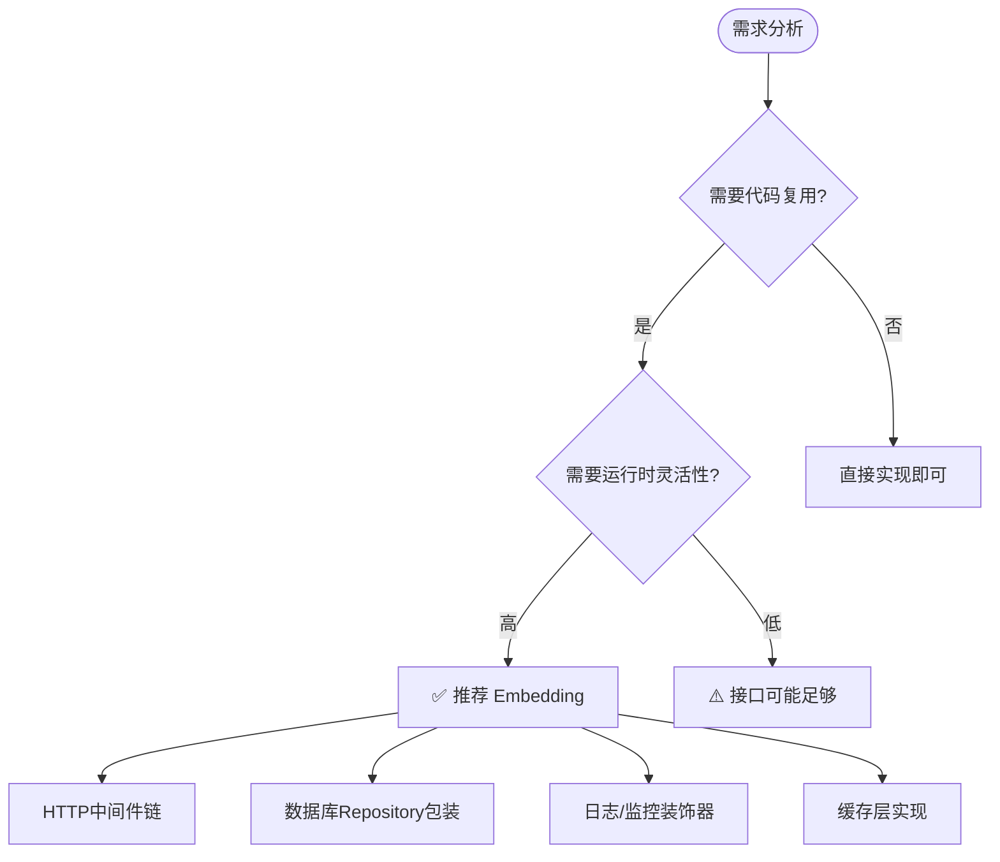

# 编程范式游记（8）- Go语言的委托模式 [2026重制版]

> **原文发布时间**：2018年
> **重制时间**：2026年6月
> **核心主题**：Go语言嵌入（Embedding）与泛型委托模式的现代实践

## 核心变更说明

自2018年以来，Go语言的委托/嵌入模式发生了重大演进：

1. **Go 1.18+ 泛型正式落地**：类型参数、接口约束、类型推断
2. **Go 1.21+ 新增内置函数**：min, max, clear等
3. **Go 1.22+ for循环变量语义修复**：不再共享循环变量
4. **Go 1.23+ 迭代器协议**：range-over-func、迭代器适配器
5. **Go 1.25**：当前稳定版本（注意：Go 仍不支持方法级类型参数，即"泛型方法"）
6. **社区工具成熟**：go generate、wire、dig等DI工具

**数据来源**：
- [Go Language Specification - Struct types](https://go.dev/ref/spec#Struct_types)
- [Go Blog: An Introduction to Generics](https://go.dev/blog/generics-proposal)
- [Effective Go - Embedding](https://go.dev/doc/effective_go#embedding)
- [Go 1.23 Release Notes](https://go.dev/doc/go1.23)

---

## 委托模式定义与思维导图

### 什么是委托模式？

委托（Delegation）是一种设计模式，一个对象将部分职责委托给另一个对象来处理。在Go语言中，通过**结构体嵌入（Struct Embedding）**实现委托——将一个匿名结构体嵌入到另一个结构体中，从而自动获得被嵌入类型的方法和字段。

根据原文核心观点：

> **Go语言的委托模式通过struct embedding实现，类似于OOP中的继承，但更强调组合和显式接口。**

#### Go委托模式全景图

```mermaid
mindmap
  root((Go语言委托模式))
    核心概念
      结构体嵌入 Embedding
        匿名字段
        自动提升方法
        字段冲突需显式指定
      接口满足 Implicit
        Duck Typing
        无需implements关键字
        编译期检查
      方法集 Method Set
        值接收者 vs 指针接收器
        接口隐式满足

    实现方式
      直接嵌入
        type Label struct { Widget }
      指针嵌入
        type Button struct { *Label }
      接口嵌入
        type ReadWriter interface { Reader; Writer }

    设计原则
      组合优于继承 Prefer composition
      接口小而清晰 Small interfaces
      显式优于 implicit Accept interfaces
      面向接口编程 Program to interface

    应用场景
      装饰器 Decorator
        HTTP中间件
        日志包装
      策略模式 Strategy
        算法切换
        格式化输出
      代理模式 Proxy
        缓存层
        访问控制
      Mixin复用
        功能组合
        能力扩展
```

### Go嵌入 vs 传统继承对比图

```mermaid
flowchart LR
    subgraph JavaInheritance["Java/C++ 继承"]
        J1[class Parent]
        J2[class Child extends Parent]
        J3[is-a 关系<br/>子类是父类的一种]
        J4[运行时多态<br/>虚函数表]
    end

    subgraph GoEmbedding["Go 嵌入/委托"]
        G1[type Widget struct]
        G2[type Label struct { Widget }]
        G3[has-a 关系<br/>Label拥有Widget的能力]
        G4[编译时确定<br/>无虚函数开销]
    end

```

---

## 语言特性演进时间线



---

## 代码示例对比（2018 vs 2026）

### 示例一：UI组件嵌入体系

#### ❌ 2018年版本（基础嵌入）

```go
// 原文中的简单示例
type Widget struct {
    X, Y int
}

type Label struct {
    Widget        // Embedding (delegation)
    Text   string // Aggregation
    X int         // Override
}

func (label Label) Paint() {
    fmt.Printf("[%p] - Label.Paint(%q)\n", &label, label.Text)
}
```

#### ✅ 2026年版本（泛型 + 接口 + 组合）

```go
package main

import (
	"fmt"
	"strings"
)

// ==================== 基础组件 ====================

// Point 表示二维坐标
type Point struct {
	X, Y int
}

func (p Point) String() string {
	return fmt.Sprintf("(%d,%d)", p.X, p.Y)
}

// Size 表示尺寸
type Size struct {
	Width, Height int
}

func (s Size) String() string {
	return fmt.Sprintf("%dx%d", s.Width, s.Height)
}

// ==================== 基础Widget ====================

// Widget 基础控件接口
type Widget interface {
	Paint()
	GetPosition() Point
	GetSize() Size
	SetVisible(bool)
	IsVisible() bool
}

// BaseWidget 基础控件实现（可嵌入）
type BaseWidget struct {
	Position Point
	Size     Size
	visible  bool
	ID       string
}

func NewBaseWidget(id string, pos Point, size Size) *BaseWidget {
	return &BaseWidget{
		Position: pos,
		Size:     size,
		visible:  true,
		ID:       id,
	}
}

func (w *BaseWidget) GetPosition() Point { return w.Position }
func (w *BaseWidget) GetSize() Size     { return w.Size }
func (w *BaseWidget) SetVisible(v bool)  { w.visible = v }
func (w *BaseWidget) IsVisible() bool    { return w.visible }
func (w *BaseWidget) Paint() {
	fmt.Printf("  [%s] at %s size %s\n", w.ID, w.Position, w.Size)
}

// ==================== 具体组件 ====================

// Label 标签控件（嵌入BaseWidget）
type Label struct {
	*BaseWidget          // 嵌入基础控件
	Text        string
	FontSize    int
	TextColor   string // "#RRGGBB"
	Alignment   string // "left"|"center"|"right"
}

func NewLabel(id string, pos Point, text string) *Label {
	return &Label{
		BaseWidget: NewBaseWidget(id, pos, Size{Width: len(text) * 8, Height: 16}),
		Text:       text,
		FontSize:   12,
		TextColor:  "#000000",
		Alignment:  "left",
	}
}

func (l *Label) Paint() {
	if !l.IsVisible() {
		return
	}
	padding := strings.Repeat(" ", l.Position.X)
	fmt.Printf("%s📝 Label[%s]: \"%s\" (font:%dpx, color:%s)\n",
		padding, l.ID, l.Text, l.FontSize, l.TextColor)
}

// Button 按钮控件（嵌入Label）
type Button struct {
	*Label                // 嵌入标签（间接嵌入了BaseWidget）
	OnClick     func()    // 回调函数
	IsDisabled  bool
	HoverStyle  bool
}

func NewButton(id string, pos Point, text string, onClick func()) *Button {
	return &Button{
		Label:    NewLabel(id, pos, text),
		OnClick:  onClick,
	}
}

func (b *Button) Paint() {
	if !b.IsVisible() {
		return
	}
	state := "🔘"
	if b.IsDisabled {
		state = "🚫"
	} else if b.HoverStyle {
		state = "🔳"
	}
	padding := strings.Repeat(" ", b.GetPosition().X)
	fmt.Printf("%s%s Button[%s]: \"%s\"\n", padding, state, b.ID, b.Text)
}

func (b *Button) Click() {
	if b.IsDisabled || b.OnClick == nil {
		return
	}
	b.OnClick()
}

// ListBox 列表框控件
type ListBox struct {
	*BaseWidget
	Items    []string
	Selected int // -1表示未选中
	MultiSelect bool
}

func NewListBox(id string, pos Point, items []string) *ListBox {
	height := len(items) * 24
	if height > 200 {
		height = 200
	}
	return &ListBox{
		BaseWidget: NewBaseWidget(id, pos, Size{Width: 200, Height: height}),
		Items:      items,
		Selected:   -1,
	}
}

func (lb *ListBox) Paint() {
	if !lb.IsVisible() {
		return
	}
	padding := strings.Repeat(" ", lb.GetPosition().X)
	fmt.Printf("%s📋 ListBox[%s]:\n", padding, lb.ID)
	for i, item := range lb.Items {
		marker := "  "
		if i == lb.Selected {
			marker = "▶ "
		}
		fmt.Printf("%s  %s%s\n", padding, marker, item)
	}
}

func (lb *ListBox) Select(index int) error {
	if index < -1 || index >= len(lb.Items) {
		return fmt.Errorf("index out of range")
	}
	lb.Selected = index
	return nil
}

// ==================== 接口多态演示 ====================

// Painter 可绘制接口
type Painter interface {
	Paint()
}

// Clicker 可点击接口
type Clicker interface {
	Click()
}

// 渲染一组控件
func RenderWidgets(widgets []Painter) {
	fmt.Println("\n=== 渲染控件 ===")
	for _, w := range widgets {
		w.Paint()
	}
}

// 处理点击事件
func HandleClicks(widgets []Clicker) {
	fmt.Println("\n=== 处理点击 ===")
	for _, w := range widgets {
		if clicker, ok := w.(Clicker); ok {
			clicker.Click()
		}
	}
}

// ==================== 使用示例 ====================

func main() {
	// 创建各种控件
	title := NewLabel("title", Point{10, 10}, "用户管理系统 v2.0")
	nameInput := NewLabel("name_label", Point{50, 60}, "用户名:")

	submitBtn := NewButton("submit_btn", Point{200, 100}, "登录", func() {
		fmt.Println("  ✅ 登录按钮被点击！验证凭据...")
	})

	cancelBtn := NewButton("cancel_btn", Point{300, 100}, "取消", func() {
		fmt.Println("  ❌ 取消操作")
	})
	cancelBtn.IsDisabled = true // 禁用取消按钮

	userList := NewListBox(
		"user_list",
		Point{50, 150},
		[]string{"管理员-张三", "编辑-李四", "访客-王五", "运维-赵六"},
	)
	userList.Select(0) // 默认选中第一项

	// 多态容器
	var widgets []Painter = []Painter{title, nameInput, submitBtn, cancelBtn, userList}

	// 渲染所有控件
	RenderWidgets(widgets)

	// 处理可点击的控件
	var clickable []Clicker
	for _, w := range widgets {
		if c, ok := w.(Clicker); ok {
			clickable = append(clickable, c)
		}
	}
	HandleClicks(clickable)

	// 类型断言获取具体功能
	fmt.Println("\n=== 特定操作 ===")
	if listBox, ok := widgets[4].(*ListBox); ok {
		listBox.Select(2)
		listBox.Paint()
	}
}
```

---

### 示例二：Undo系统（泛型 + 函数式）

#### ❌ 2018年版本（特定类型UndoableIntSet）

```go
// 原文中的特定类型实现
type UndoableIntSet struct {
    IntSet    // Embedding
    functions []func()
}
```

**问题分析**：
- 只能用于IntSet类型
- 无法复用到其他数据结构
- 代码重复度高

#### ✅ 2026年版本（泛型Undo框架）

```go
package main

import (
	"errors"
	"fmt"
)

// ==================== 泛型Undo框架 ====================

// UndoAction 表示一个撤销动作
type UndoAction func()

// UndoStack 泛型撤销栈
type UndoStack struct {
	actions []UndoAction
	maxSize int
}

func NewUndoStack(maxSize int) *UndoStack {
	if maxSize <= 0 {
		maxSize = 100 // 默认最大100步
	}
	return &UndoStack{
		actions: make([]UndoAction, 0, maxSize),
		maxSize: maxSize,
	}
}

// Push 添加撤销动作
func (u *UndoStack) Push(action UndoAction) error {
	if len(u.actions) >= u.maxSize {
		return errors.New("undo stack overflow")
	}
	u.actions = append(u.actions, action)
	return nil
}

// Undo 执行撤销
func (u *UndoStack) Undo() error {
	if len(u.actions) == 0 {
		return errors.New("nothing to undo")
	}

	// 弹出最后一个动作
	index := len(u.actions) - 1
	action := u.actions[index]

	// 执行撤销
	action()

	// 从栈中移除
	u.actions = u.actions[:index]
	return nil
}

// CanUndo 是否可以撤销
func (u *UndoStack) CanUndo() bool {
	return len(u.actions) > 0
}

// Count 待撤销的操作数
func (u *UndoStack) Count() int {
	return len(u.actions)
}

// Clear 清空撤销栈
func (u *UndoStack) Clear() {
	u.actions = u.actions[:0]
}

// ==================== 泛型集合接口 ====================

// Collection 泛型集合接口（约束）
type Collection[T any] interface {
	Add(item T)
	Remove(item T) bool
	Contains(item T) bool
	Len() int
	Clear()
	ForEach(fn func(T))
}

// ==================== 具体集合实现 ====================

// IntSet 整数集合
type IntSet struct {
	data map[int]bool
	undo *UndoStack
}

func NewIntSet() *IntSet {
	return &IntSet{
		data: make(map[int]bool),
		undo: NewUndoStack(50),
	}
}

func (s *IntSet) Add(x int) {
	if s.Contains(x) {
		s.undo.Push(func() {}) // 空操作，已存在
		return
	}
	s.data[x] = true
	s.undo.Push(func() { delete(s.data, x) })
}

func (s *IntSet) Remove(x int) bool {
	if !s.Contains(x) {
		s.undo.Push(func() {})
		return false
	}
	delete(s.data, x)
	s.undo.Push(func() { s.data[x] = true })
	return true
}

func (s *IntSet) Contains(x int) bool {
	return s.data[x]
}

func (s *IntSet) Len() int {
	return len(s.data)
}

func (s *IntSet) Clear() {
	s.data = make(map[int]bool)
}

func (s *IntSet) ForEach(fn func(int)) {
	for k := range s.data {
		fn(k)
	}
}

func (s *IntSet) Undo() error {
	return s.undo.Undo()
}

func (s *IntSet) String() string {
	items := make([]int, 0, len(s.data))
	for k := range s.data {
		items = append(items, k)
	}
	return fmt.Sprintf("{%v}", items)
}

// StringSet 字符串集合（展示泛型的威力）
type StringSet struct {
	data map[string]bool
	undo *UndoStack
}

func NewStringSet() *StringSet {
	return &StringSet{
		data: make(map[string]bool),
		undo: NewUndoStack(50),
	}
}

func (s *StringSet) Add(x string) {
	if s.Contains(x) {
		s.undo.Push(func() {})
		return
	}
	s.data[x] = true
	s.undo.Push(func() { delete(s.data, x) })
}

func (s *StringSet) Remove(x string) bool {
	if !s.Contains(x) {
		s.undo.Push(func() {})
		return false
	}
	delete(s.data, x)
	s.undo.Push(func() { s.data[x] = true })
	return true
}

func (s *StringSet) Contains(x string) bool {
	return s.data[x]
}

func (s *StringSet) Len() int           { return len(s.data) }
func (s *StringSet) Clear()            { s.data = make(map[string]bool) }
func (s *StringSet) ForEach(fn func(string)) {
	for k := range s.data {
		fn(k)
	}
}
func (s *StringSet) Undo() error         { return s.undo.Undo() }
func (s *StringSet) String() string {
	items := make([]string, 0, len(s.data))
	for k := range s.data {
		items = append(items, k)
	}
	return fmt.Sprintf("{%v}", items)
}

// ==================== 泛型事务管理器 ====================

// TransactionalCollection 支持事务的集合装饰器
type TransactionalCollection[T comparable] struct {
	collection Collection[T]
	undo        *UndoStack
	inTxn       bool
	txnActions  []UndoAction
}

func NewTransactionalCollection[T comparable](c%20Collection[T]) *TransactionalCollection[T] {
	return &TransactionalCollection[T]{
		collection: c,
		undo:       NewUndoStack(100),
		inTxn:      false,
		txnActions: make([]UndoAction, 0),
	}
}

func (tc *TransactionalCollection[T]) Add(item T) {
	action := func() { tc.collection.Remove(item) }

	tc.collection.Add(item)

	if tc.inTxn {
		tc.txnActions = append(tc.txnActions, action)
	} else {
		tc.undo.Push(action)
	}
}

func (tc *TransactionalCollection[T]) Remove(item T) bool {
	if !tc.collection.Contains(item) {
		return false
	}

	action := func() { tc.collection.Add(item) }
	tc.collection.Remove(item)

	if tc.inTxn {
		tc.txnActions = append(tc.txnActions, action)
	} else {
		tc.undo.Push(action)
	}
	return true
}

func (tc *TransactionalCollection[T]) BeginTransaction() {
	tc.inTxn = true
	tc.txnActions = tc.txnActions[:0]
	fmt.Println("📝 开始事务...")
}

func (tc *TransactionalCollection[T]) CommitTransaction() {
	if !tc.inTxn {
		return
	}

	// 将事务内的所有动作推入全局撤销栈
	for i := len(tc.txnActions) - 1; i >= 0; i-- {
		tc.undo.Push(tc.txnActions[i])
	}

	tc.inTxn = false
	tc.txnActions = tc.txnActions[:0]
	fmt.Println("✅ 事务提交成功")
}

func (tc *TransactionalCollection[T]) RollbackTransaction() {
	if !tc.inTxn {
		return
	}

	// 反向执行所有事务内操作
	for i := len(tc.txnActions) - 1; i >= 0; i-- {
		tc.txnActions[i]()
	}

	tc.inTxn = false
	tc.txnActions = tc.txnActions[:0]
	fmt.Println("❌ 事务已回滚")
}

func (tc *TransactionalCollection[T]) Undo() error {
	return tc.undo.Undo()
}

func (tc *TransactionalCollection[T]) Contains(item T) bool {
	return tc.collection.Contains(item)
}

func (tc *TransactionalCollection[T]) Len() int {
	return tc.collection.Len()
}

func (tc *TransactionalCollection[T]) ForEach(fn func(T)) {
	tc.collection.ForEach(fn)
}

// ==================== 使用示例 ====================

func main() {
	fmt.Println("===== 整数集合 Undo 演示 =====")

	intSet := NewIntSet()

	// 添加元素
	fmt.Println("\n添加元素:")
	for _, n := range []int{1, 3, 5, 7, 9} {
		intSet.Add(n)
		fmt.Printf("  Add(%d) → %s\n", n, intSet)
	}

	// 删除元素
	fmt.Println("\n删除元素:")
	for _, n := range []int{3, 7} {
		intSet.Remove(n)
		fmt.Printf("  Remove(%d) → %s\n", n, intSet)
	}

	// Undo操作
	fmt.Println("\n执行 Undo:")
	for i := 0; i < 3; i++ {
		if err := intSet.Undo(); err != nil {
			fmt.Printf("  Undo #%d: %v\n", i+1, err)
			break
		}
		fmt.Printf("  Undo #%d → %s\n", i+1, intSet)
	}

	// 继续Undo到清空
	fmt.Println("\n全部 Undo:")
	for intSet.Undo() == nil {
		fmt.Printf("  ... → %s\n", intSet)
	}

	// ========== 字符串集合 ==========
	fmt.Println("\n===== 字符串集合 Undo 演示 =====")

	strSet := NewStringSet()
	strings := []string{"apple", "banana", "cherry", "date", "elderberry"}

	fmt.Println("\n添加水果:")
	for _, s := range strings {
		strSet.Add(s)
		fmt.Printf("  Add(%q) → %s\n", s, strSet)
	}

	// 移除一些
	fmt.Println("\n移除水果:")
	strSet.Remove("banana")
	strSet.Remove("date")
	fmt.Printf("  当前状态: %s\n", strSet)

	// Undo
	fmt.Println("\nUndo 两次:")
	strSet.Undo()
	fmt.Printf("  After Undo #1: %s\n", strSet)
	strSet.Undo()
	fmt.Printf("  After Undo #2: %s\n", strSet)

	// ========== 事务演示 ==========
	fmt.Println("\n===== 事务演示 =====")

	txIntSet := NewTransactionalCollection[int](NewIntSet())

	txIntSet.BeginTransaction()
	fmt.Println("\n事务中操作:")
	txIntSet.Add(10)
	txIntSet.Add(20)
	txIntSet.Add(30)
	txIntSet.Remove(20)
	fmt.Printf("  事务内状态: 元素数=%d\n", txIntSet.Len())

	// 提交事务
	fmt.Println("\n提交事务:")
	txIntSet.CommitTransaction()
	fmt.Printf("  提交后状态: 元素数=%d\n", txIntSet.Len())

	// 可以Undo整个事务
	fmt.Println("\nUndo事务:")
	txIntSet.Undo()
	txIntSet.Undo()
	txIntSet.Undo()
	fmt.Printf("  Undo后状态: 元素数=%d\n", txIntSet.Len())

	// ========== 回滚演示 ==========
	fmt.Println("\n===== 回滚演示 =====")

	txStrSet := NewTransactionalCollection[string](NewStringSet())
	txStrSet.BeginTransaction()

	txStrSet.Add("red")
	txStrSet.Add("green")
	txStrSet.Add("blue")
	fmt.Printf("  事务内: %d\n", txStrSet.Len()) // 3个

	fmt.Println("回滚事务:")
	txStrSet.RollbackTransaction()
	fmt.Printf("  回滚后: %d\n", txStrSet.Len()) // 0个
}
```

---

## 适用场景分析

### Go委托模式适用场景



---

## 最佳实践清单

### ✅ Go委托模式最佳实践（2026年版）

#### 1. **使用接口而非具体类型**

```go
// ❌ 依赖具体类型
func ProcessUser(db *MySQLDB) { ... }

// ✅ 依赖接口
type UserRepository interface {
    GetUser(id string) (*User, error)
    SaveUser(user *User) error
}

func ProcessUser(repo UserRepository) { ... }
```

#### 2. **小接口原则（Small Interfaces）**

```go
// ❌ 大接口（违反ISP）
type Manager interface {
    Manage()
    Lead()
    Code()
    Design()
    Test()
    Deploy()
}

// ✅ 小接口组合
type Coder interface { Code() }
type Leader interface { Lead() }
type Manager interface {
    Coder
    Leader
}
```

#### 3. **善用泛型减少重复**

```go
// Go 1.18+: 泛型函数
func First[T any](items%20[]T) (T, bool) {
    var zero T
    if len(items) == 0 {
        return zero, false
    }
    return items[0], true
}

// 使用
nums := []int{1, 2, 3}
firstNum, ok := First(nums)

strs := []string{"a", "b"}
firstStr, ok := First(strs)
```

#### 4. **避免过度嵌入**

```go
// ❌ 过深的嵌入层次
type UltraButton struct {
    *AdvancedButton // 嵌入
}
type AdvancedButton struct {
    *StyledButton // 嵌入
}
type StyledButton struct {
    *BaseButton // 嵌入
}
// 维护噩梦！

// ✅ 扁平化 + 组合
type Button struct {
    base    *BaseWidget
    actions ActionHandlers
}
```

---

## 延伸资源

### 📚 官方资源

1. **Effective Go - Embedding**
   - URL: https://go.dev/doc/effective_go#embedding
   - 内容：Go官方推荐的嵌入使用指南

2. **Go Blog: Generics**
   - URL: https://go.dev/blog/generics-proposal
   - 内容：Go泛型设计的完整说明

3. **Go 1.23 Release Notes - Iterators**
   - URL: https://go.dev/doc/go1.23
   - 内容：迭代器协议新特性

---

## 总结

### 🎯 Go委托模式要点

1. **Embedding ≠ Inheritance**
   - Go的嵌入是"has-a"关系，不是"is-a"
   - 更灵活的组合方式

2. **Interface Satisfaction is Implicit**
   - 不需要显式声明implements
   - Duck typing在编译期检查

3. **泛型让委托更强大**
   - Go 1.18+的类型参数减少了代码重复
   - 约束（constraints）提供类型安全

4. **Keep Interfaces Small**
   - 单一职责接口更容易满足
   - 组合小接口构建大能力

### 💡 2026年的Go趋势

- **Iterators (range-over-func)**：函数式风格的迭代
- **Generics Evolution**：泛型函数与约束持续增强（方法级类型参数仍未支持）
- **Better Error Handling**：error wrapping/is patterns
- **Tooling Maturation**：wire/dig等DI工具与slog等标准库持续完善

---

**相关文章导航**：
- [36 | 编程范式游记（7）- 基于原型的编程范式](28-编程范式游记（7）-基于原型的编程范式-[2026重制版].md)
- [38 | 编程范式游记（9）- 编程的本质](30-编程范式游记（9）-编程的本质-[2026重制版].md)

**参考来源**：
- [Go Language Specification](https://go.dev/ref/spec)
- [Go by Example: Embedding](https://gobyexample.com/embedding-interfaces)
- [Go 1.18 Release Notes](https://go.dev/doc/go1.18)
