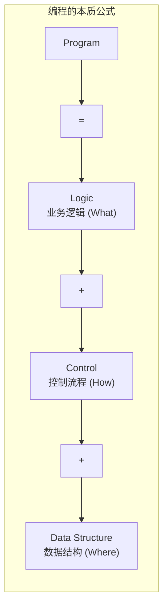
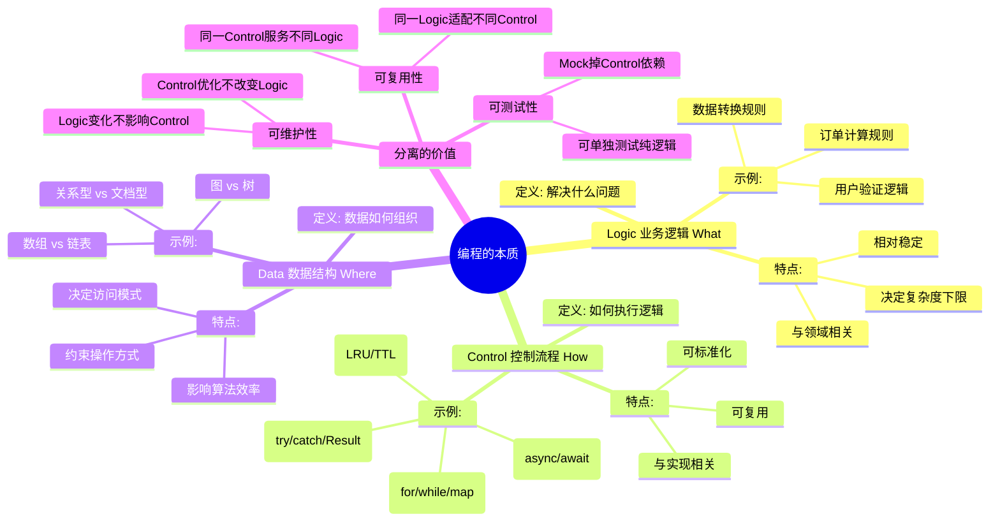
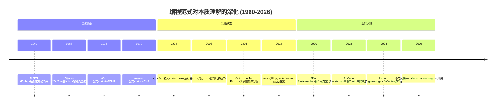
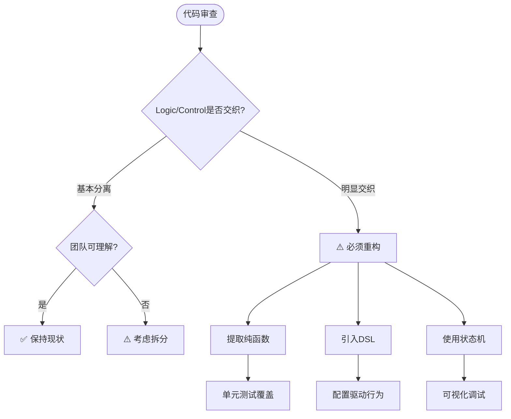

# 编程范式游记（9）- 编程的本质 [2026重制版]

> **原文发布时间**：2018年
> **重制时间**：2026年6月
> **核心主题**：Logic + Control + Data = Program 的深刻理解

## 核心变更说明

自2018年原文发布以来，"编程的本质"这一主题在以下方面有了新的认识：

1. **AI辅助编程的冲击**：ChatGPT/Copilot改变了我们对"什么是编程"的理解
2. **低代码/无代码平台成熟**：将Control层进一步标准化和可视化
3. **领域特定语言（DSL）普及**：SQL、GraphQL、Terraform等声明式语言成为主流
4. **函数式+响应式融合**：Effect Systems、Algebraic Effects让副作用管理更优雅
5. **WebAssembly与跨平台**：Control层的抽象可以跨越语言边界

**数据来源**：
- [Niklaus Wirth - Algorithms + Data Structures = Programs](https://inf.ethz.ch/personal/wirth/)
- [Robert Kowalski - Algorithm = Logic + Control](https://www.doc.ic.ac.uk/~rak/papers/)
- [Out of the Tar Pit - M. R. Jackson](https://archive.is/WOuev)

---

## 编程本质的核心公式

### 两大经典公式的统一

根据原文引用的两篇奠基性论文：

**1976 - Niklaus Wirth (Pascal之父)**：
```
Programs = Algorithms + Data Structures
```

**1979 - Robert Kowalski (逻辑编程先驱)**：
```
Algorithm = Logic + Control
```

**综合得出编程的本质**：



### 三要素详解思维导图



---

## 语言特性演进：从混乱到清晰

### 历史演进时间线



---

## 代码示例对比（2018 vs 2026）

### 示例一：通配符匹配问题（原文案例）

#### ❌ 2018年版本（Logic与Control混杂）

```c
// 原文中的"混乱代码"
bool isMatch(const char *s, const char *p) {
	const char *last_s = NULL;
	const char *last_p = NULL;

	while ( *s != '\0' ) {
		if ( *p == '*' ) {
			p++;
			if ( *p == '\0' ) return true;
			last_s = s;
			last_p = p;
		} else if ( *p == '?' || *s == *p ) {
			s++;
			p++;
		} else if ( last_s != NULL ) {
			p = last_p;
			s = ++last_s;
		} else {
			return false;
		}
	}
	while ( *p == '*' ) p++;
	return *p == '\0';
}
```

**问题分析**（原文作者自述）：
- "我也不知道我怎么写出来的...两三天以后，我回头看，我到底写的什么..."
- Logic（匹配规则）和Control（遍历、回溯、状态保存）完全纠缠在一起
- 无法单独测试匹配逻辑
- 无法替换遍历策略

#### ✅ 2026年版本（Logic/Control/Data分离）

**TypeScript - 使用状态机分离关注点**：

```typescript
// ==================== Logic层：纯粹的匹配规则 ====================

/**
 * 通配符匹配规则定义（纯函数，无副作用）
 */
type MatchResult =
    | { status: 'matched'; remainingPattern: string }
    | { status: 'not_matched' }
    | { status: 'incomplete'; needMoreInput: true };

interface MatchRule {
    name: string;
    /** 尝试匹配当前位置的字符 */
    match(input: string, pattern: string, inputPos: number, patternPos: number): MatchResult;
}

// 具体字符匹配规则
const LiteralCharMatch: MatchRule = {
    name: 'literal',
    match(input, pattern, iPos, pPos) {
        if (iPos >= input.length) return { status: 'incomplete', needMoreInput: true };
        if (pPos >= pattern.length) return { status: 'not_matched' };

        const pChar = pattern[pPos];
        const iChar = input[iPos];

        if (pChar === '?' || pChar === iChar) {
            return {
                status: 'matched',
                remainingPattern: pattern.slice(pPos + 1)
            };
        }
        return { status: 'not_matched' };
    }
};

// 星号(*) 匹配规则：匹配任意序列（包括空）
const StarMatch: MatchRule = {
    name: 'star',
    match(input, pattern, iPos, pPos) {
        // '*' 可以匹配剩余所有输入
        return {
            status: 'matched',
            remainingPattern: pattern.slice(pPos + 1)
        };
    }
};

// ==================== Control层：状态机引擎 ====================

type MatcherState = {
    inputPos: number;
    patternPos: number;
    starPatternPos: number; // 最后遇到的*位置
    starInputPos: number;   // 遇到*时的输入位置
};

class WildcardMatcher {
    private rules: Map<string, MatchRule>;

    constructor() {
        this.rules = new Map([
            ['*', StarMatch],
            ['default', LiteralCharMatch],
        ]);
    }

    /**
     * 执行匹配（控制流程）
     */
    match(pattern: string, input: string): boolean {
        const initialState: MatcherState = {
            inputPos: 0,
            patternPos: 0,
            starPatternPos: -1,
            starInputPos: -1,
        };

        return this.execute(initialState, pattern, input);
    }

    private execute(state: MatcherState, pattern: string, input: string): boolean {
        while (state.patternPos < pattern.length && state.inputPos <= input.length) {
            const currentPatternChar = pattern[state.patternPos];

            if (currentPatternChar === '*') {
                // 记录星号位置，用于回溯
                state.starPatternPos = state.patternPos;
                state.starInputPos = state.inputPos;
                state.patternPos++; // 跳过*，先尝试匹配0个字符
                continue;
            }

            if (state.inputPos >= input.length) {
                // 输入已耗尽，检查剩余pattern是否全是*
                this.skipTrailingStars(state, pattern);
                break;
            }

            // 获取匹配规则
            const rule = currentPatternChar === '?'
                ? this.rules.get('default')!
                : this.rules.get(currentPatternChar)
                ?? this.rules.get('default')!;

            const result = rule.match(input, pattern, state.inputPos, state.patternPos);

            switch (result.status) {
                case 'matched':
                    state.inputPos++;
                    state.patternPos += 1;
                    break;

                case 'not_matched':
                    // 如果之前有*，尝试回溯到*处，让*多匹配一个字符
                    if (state.starPatternPos >= 0) {
                        state.starInputPos++;
                        state.inputPos = state.starInputPos;
                        state.patternPos = state.starPatternPos + 1; // 回到*之后
                        continue;
                    }
                    return false;

                case 'incomplete':
                    // 输入不足，但pattern还有非*内容
                    return false;
            }
        }

        // 模式耗尽但输入还有剩余：回溯到最近的*，让它多匹配一个字符后重试
        while (state.patternPos >= pattern.length && state.inputPos < input.length && state.starPatternPos >= 0) {
            state.starInputPos++;
            state.inputPos = state.starInputPos;
            state.patternPos = state.starPatternPos + 1;
            if (this.execute(state, pattern, input)) return true;
        }

        // 检查是否完全匹配（跳过末尾的*）
        this.skipTrailingStars(state, pattern);
        return state.patternPos >= pattern.length && state.inputPos >= input.length;
    }

    private skipTrailingStars(state: MatcherState, pattern: string): void {
        while (state.patternPos < pattern.length && pattern[state.patternPos] === '*') {
            state.patternPos++;
        }
    }
}

// ==================== 使用示例 ====================

const matcher = new WildcardMatcher();

const testCases: Array<[string, string, boolean]> = [
    ["aa", "a", false],
    ["aa", "aa", true],
    ["aaa", "aa", false],
    ["aa", "*", true],
    ["aa", "a*", true],
    ["ab", "?*", true],
    ["aab", "c*a*b", false],
    ["abcde", "a*e", true],
    ["hello-world", "h*o*w?rld", true],
    ["test123", "test*", true],
    ["", "*", true],  // 空字符串匹配*
    ["abc", "???", true],
];

console.log("===== 通配符匹配测试 =====\n");

for (const [input, pattern, expected] of testCases) {
    const result = matcher.match(pattern, input);
    const status = result ? "✅" : "❌";
    const matchStr = result ? "MATCH" : "NO MATCH";

    console.log(`${status} isMatch("${input}", "${pattern}") → ${matchStr}`);

    if (result !== expected) {
        console.log(`   ⚠️ 预期: ${expected}, 实际: ${result}`);
    }
}
```

**Python 3.12+ - 使用正则表达式编译器思路**：

```python
from __future__ import annotations
from dataclasses import dataclass
from typing import Protocol


# ==================== Logic层：Token定义 ====================

@dataclass(frozen=True)
class Token:
    """通配符模式的Token"""
    kind: str  # 'literal', 'star', 'question'
    value: str = ""


def tokenize_pattern(pattern: str) -> list[Token]:
    """
    将通配符模式解析为Token列表
    这是纯逻辑，不涉及任何控制流
    """
    tokens: list[Token] = []
    i = 0

    while i < len(pattern):
        char = pattern[i]

        if char == '*':
            tokens.append(Token(kind='star'))
        elif char == '?':
            tokens.append(Token(kind='question'))
        else:
            # 合并连续的字面量字符
            literal_chars = char
            while i + 1 < len(pattern) and pattern[i + 1] not in ('*', '?'):
                i += 1
                literal_chars += pattern[i]
            tokens.append(Token(kind='literal', value=literal_chars))

        i += 1

    return tokens


# ==================== Control层：NFA模拟器 ====================

class NFASimulator:
    """非确定有限自动机模拟器"""

    def __init__(self, tokens: list[Token]):
        self.tokens = tokens
        self.star_positions: list[int] = []  # 记录*的位置

    def matches(self, input_str: str) -> bool:
        """
        使用递归+备忘录的方式尝试匹配
        将控制逻辑封装在此处
        """
        # 预处理：记录*位置
        for idx, token in enumerate(self.tokens):
            if token.kind == 'star':
                self.star_positions.append(idx)

        memo: dict[tuple[int, int], bool] = {}

        result = self._match_from(0, 0, input_str, memo)
        return result

    def _match_from(
        self,
        token_idx: int,
        input_idx: int,
        input_str: str,
        memo: dict[tuple[int, int], bool]
    ) -> bool:
        """从指定位置开始匹配"""

        state = (token_idx, input_idx)
        if state in memo:
            return memo[state]

        # Base case: token耗尽
        if token_idx >= len(self.tokens):
            # 检查剩余tokens是否都是*（可跳过）
            remaining_all_stars = all(
                t.kind == 'star' for t in self.tokens[token_idx:]
            )
            result = remaining_all_stars and input_idx >= len(input_str)
            memo[state] = result
            return result

        token = self.tokens[token_idx]

        if token.kind == 'star':
            # * 可以匹配0个或多个字符
            # 尝试匹配0个
            if self._match_from(token_idx + 1, input_idx, input_str, memo):
                memo[state] = True
                return True

            # 尝试匹配1个或多个
            for next_input in range(input_idx, len(input_str) + 1):
                if self._match_from(token_idx + 1, next_input, input_str, memo):
                    memo[state] = True
                    return True

            memo[state] = False
            return False

        elif token.kind == 'question':
            # ? 匹配恰好1个任意字符
            if input_idx >= len(input_str):
                memo[state] = False
                return False

            if self._match_from(token_idx + 1, input_idx + 1, input_str, memo):
                memo[state] = True
                return True

            memo[state] = False
            return False

        elif token.kind == 'literal':
            # 字面量匹配
            remaining_input = input_str[input_idx:]

            if remaining_input.startswith(token.value):
                new_input_idx = input_idx + len(token.value)
                if self._match_from(token_idx + 1, new_input_idx, input_str, memo):
                    memo[state] = True
                    return True

            memo[state] = False
            return False

        memo[state] = False
        return False


def wildcard_match(pattern: str, input_str: str) -> bool:
    """
    通配符匹配入口
    Logic: tokenize_pattern (解析规则)
    Control: NFASimulator (执行匹配)
    Data: Token list + input string
    """
    tokens = tokenize_pattern(pattern)
    simulator = NFASimulator(tokens)
    return simulator.matches(input_str)


# ==================== 使用示例 ====================

if __name__ == "__main__":
    test_cases = [
        ("aa", "a", False),
        ("aa", "aa", True),
        ("aaa", "aa", False),
        ("aa", "*", True),
        ("aa", "a*", True),
        ("ab", "?*", True),
        ("aab", "c*a*b", False),
        ("abcde", "a*e", True),
        ("", "*", True),
        ("test", "t*st", True),
        ("hello world", "h*o*w?rld", True),
    ]

    print("=" * 50)
    print("通配符匹配测试 (Python版本)")
    print("=" * 50)

    for input_str, pattern, expected in test_cases:  # 与上方数据一致：(输入, 模式, 期望)
        result = wildcard_match(pattern, input_str)
        status = "✅" if result else "❌"
        match_str = "MATCH" if result else "NO MATCH"

        print(f"{status} isMatch('{input_str}', '{pattern}') → {match_str}")

        if result != expected:
            print(f"   ⚠️ 预期: {expected}, 实际: {result}")
```

---

### 示例二：表单验证（DSL vs 过程式）

#### ❌ 2018年版本（过程式）

```javascript
function check_form_x() {
    var name = $('#name').val();
    if (null == name || name.length <= 3) {
        return { status : 1, message: 'Invalid name' };
    }
    var password = $('#password').val();
    if (null == password || password.length <= 8) {
        return { status : 2, message: 'Invalid password' };
    }
    ...
    return { status : 0, message: 'OK' };
}
```

#### ✅ 2026年版本（声明式Schema + 泛型验证引擎）

**TypeScript - Schema-Driven Validation**：

```typescript
// ==================== Logic层：验证规则定义 ====================

/** 验证结果 */
type ValidationResult<T> =
    | { success: true; data: T }
    | { success: false; errors: FieldError[] };

interface FieldError {
    field: string;
    message: string;
    code: string;
}

/** 验证器接口 */
interface Validator<T> {
    validate(value: unknown): ValidationResult<T>;
}

/** 字段级验证规则 */
interface FieldRule<T> {
    required?: boolean;
    minLength?: number;
    maxLength?: number;
    min?: number;
    max?: number;
    pattern?: RegExp;
    custom?: (value: T) => string | null;
    message?: string;
}

// ==================== 具体验证器实现 ====================

class StringValidator implements Validator<string> {
    constructor(private rules: FieldRule<string>) {}

    validate(value: unknown): ValidationResult<string> {
        const errors: FieldError[] = [];

        if (typeof value !== 'string') {
            return { success: false, errors: [{ field: '', message: '必须是字符串', code: 'TYPE_ERROR' }] };
        }

        const str = value as string;

        if (this.rules.required !== false && (!str || str.trim().length === 0)) {
            errors.push({ field: '', message: this.rules.message || '不能为空', code: 'REQUIRED' });
        }

        if (this.rules.minLength !== undefined && str.length < this.rules.minLength) {
            errors.push({ field: '', message: `至少${this.rules.minLength}个字符`, code: 'MIN_LENGTH' });
        }

        if (this.rules.maxLength !== undefined && str.length > this.rules.maxLength) {
            errors.push({ field: '', message: `最多${this.rules.maxLength}个字符`, code: 'MAX_LENGTH' });
        }

        if (this.rules.pattern && !this.rules.pattern.test(str)) {
            errors.push({ field: '', message: '格式不符合要求', code: 'PATTERN_MISMATCH' });
        }

        if (this.rules.custom) {
            const customError = this.rules.custom(str);
            if (customError) {
                errors.push({ field: '', message: customError, code: 'CUSTOM_FAILED' });
            }
        }

        return errors.length > 0
            ? { success: false, errors }
            : { success: true, data: str };
    }
}

class NumberValidator implements Validator<number> {
    constructor(private rules: FieldRule<number>) {}

    validate(value: unknown): ValidationResult<number> {
        const errors: FieldError[] = [];

        if (typeof value !== 'number' || isNaN(value)) {
            return { success: false, errors: [{ field: '', message: '必须是有效数字', code: 'TYPE_ERROR' }] };
        }

        if (this.rules.min !== undefined && value < this.rules.min) {
            errors.push({ field: '', message: `不能小于${this.rules.min}`, code: 'MIN_VALUE' });
        }

        if (this.rules.max !== undefined && value > this.rules.max) {
            errors.push({ field: '', message: `不能大于${this.rules.max}`, code: 'MAX_VALUE' });
        }

        if (this.rules.custom) {
            const customError = this.rules.custom(value);
            if (customError) {
                errors.push({ field: '', message: customError, code: 'CUSTOM_FAILED' });
            }
        }

        return errors.length > 0
            ? { success: false, errors }
            : { success: true, data: value };
    }
}

// ==================== Control层：Schema驱动验证引擎 ====================

interface SchemaDefinition {
    [fieldName: string]: FieldRule<any>;
}

class FormValidator {
    private schema: SchemaDefinition;
    private validators: Map<string, Validator<any>>;

    constructor(schema: SchemaDefinition) {
        this.schema = schema;
        this.validators = new Map();

        // 根据规则自动创建验证器
        for (const [field, rules] of Object.entries(schema)) {
            if (rules instanceof StringValidator || typeof rules?.validate === 'function') {
                this.validators.set(field, rules as Validator<any>);
            } else if (rules.min !== undefined || rules.max !== undefined) {
                this.validators.set(field, new NumberValidator(rules));
            } else {
                this.validators.set(field, new StringValidator(rules));
            }
        }
    }

    validate(formData: Record<string, unknown>): {
        valid: boolean;
        data: Record<string, any>;
        errors: FieldError[];
    } {
        const errors: FieldError[] = [];
        const data: Record<string, any> = {};

        for (const [field, validator] of this.validators) {
            const value = formData[field];
            const result = validator.validate(value);

            if (result.success) {
                data[field] = result.data;
            } else {
                errors.push(...result.errors.map(e => ({ ...e, field })));
            }
        }

        return {
            valid: errors.length === 0,
            data,
            errors,
        };
    }
}

// ==================== 使用示例 ====================

// 定义用户注册表单的Schema（Logic层：声明式配置）
const userRegistrationSchema: SchemaDefinition = {
    username: {
        required: true,
        minLength: 3,
        maxLength: 20,
        pattern: /^[a-zA-Z0-9_]+$/,
        message: '用户名需为3-20位字母数字下划线',
    },
    email: {
        required: true,
        pattern: /^[^\s@]+@[^\s@]+\.[^\s@]+$/,
        message: '请输入有效的邮箱地址',
    },
    age: {
        required: true,
        min: 18,
        max: 120,
        custom: (val: number) => val >= 18 ? null : '必须年满18岁',
    },
    password: {
        required: true,
        minLength: 8,
        custom: (val: string) => {
            if (!/[A-Z]/.test(val)) return '需包含大写字母';
            if (!/[a-z]/.test(val)) return '需包含小写字母';
            if (!/[0-9]/.test(val)) return '需包含数字';
            return null;
        },
    },
    confirmPassword: {
        required: true,
        custom: (val: string, ctx?: any) => {
            if (ctx?.password && val !== ctx.password) {
                return '两次密码输入不一致';
            }
            return null;
        },
    },
};

// 创建验证器实例（Control层：引擎）
const validator = new FormValidator(userRegistrationSchema);

// 测试数据
const testData = [
    {
        username: 'zhangsan2024',
        email: 'zhangsan@example.com',
        age: 25,
        password: 'Abc12345!',
        confirmPassword: 'Abc12345!',
    },
    {
        username: 'a',           // 太短
        email: 'invalid-email', // 格式错误
        age: 15,                 // 未成年
        password: 'weak',       // 不满足复杂度
        confirmPassword: 'diff', // 不一致
    },
];

console.log('===== 表单验证测试 =====\n');

for (let i = 0; i < testData.length; i++) {
    const data = testData[i];
    console.log(`--- 测试用例 #${i + 1} ---`);

    const result = validator.validate(data);

    if (result.valid) {
        console.log('✅ 验证通过！');
        console.log('清洗后数据:', JSON.stringify(result.data, null, 2));
    } else {
        console.log(`❌ 验证失败 (${result.errors.length} 个错误):`);
        for (const err of result.errors) {
            console.log(`  • [${err.code}] ${err.field}: ${err.message}`);
        }
    }
    console.log('');
}
```

---

## 适用场景：何时需要分离？

### 分离决策树



---

## 最佳实践清单

### ✅ Logic/Control分离最佳实践

#### 1. **识别并提取纯逻辑**

```typescript
// ❌ 混合写法
async function processOrder(orderId: string) {
    const order = await db.find(orderId);     // IO (Control)
    const total = order.items.reduce((s, item) =>  // Logic
        s + item.price * item.quantity, 0
    );
    const tax = total * getTaxRate(order.region);  // Logic
    await db.update(orderId, { total, tax });       // IO (Control)
}

// ✅ 分离写法
function calculateOrderTotal(order: Order): OrderTotals {
    // 纯Logic，可独立测试
    const subtotal = order.items.reduce((sum, item) =>
        sum + item.price * item.quantity, 0
    );
    const tax = subtotal * TAX_RATES[order.region];
    const discount = applyDiscount(subtotal, order.customerLevel);
    return { subtotal, tax, discount, grandTotal: subtotal + tax - discount };
}

async function persistOrder(orderId: string, totals: OrderTotals): Promise<void> {
    // 纯Control，只关心IO
    await db.update(orderId, totals);
}
```

#### 2. **使用DSL表达Logic**

```yaml
# validation_rules.yaml (Logic as Data)
user_registration:
  username:
    required: true
    min_length: 3
    max_length: 20
    pattern: "^[a-zA-Z0-9_]+$"
  email:
    required: true
    format: email
  age:
    required: true
    min: 18
    type: integer
```

#### 3. **Control层使用标准模式**

```go
// Control层使用Strategy/Template Method等标准模式
type ExecutionStrategy interface {
    Execute(ctx Context) error
    Rollback(ctx Context) error
}

type SequentialExecution struct{}
func (s *SequentialExecution) Execute(ctx Context) error {
    for _, step := range ctx.Steps {
        if err := step.Run(); err != nil {
            return err
        }
    }
    return nil
}
```

---

## 总结

### 🎯 编程本质核心要点

1. **Program = Logic + Control + Data**
   - Logic决定**做什么**（What）
   - Control决定**怎么做**（How）
   - Data决定**在哪里做**（Where）

2. **分离带来质量**
   - Logic可独立测试、可复用
   - Control可标准化、可优化
   - Data可选择最优结构

3. **复杂度的来源**
   - Logic本身复杂 → 业务固有的复杂度
   - Control复杂度 → 工程问题，可通过工具解决
   - 两者交织 → 最糟糕的情况，难以维护

4. **现代趋势**
   - AI降低Control编写成本
   - 平台工程将Control产品化
   - DSL让Logic更易表达

> **记住**：好的架构能让Logic保持纯粹，让Control变得透明，让Data选择自由。这就是编程的艺术。

---

**相关文章导航**：
- [37 | 编程范式游记（8）- Go语言的委托模式](29-编程范式游记（8）-Go语言的委托模式-[2026重制版].md)
- [39 | 编程范式游记（10）- 逻辑编程范式](31-编程范式游记（10）-逻辑编程范式-[2026重制版].md)

**参考来源**：
- [Algorithms + Data Structures = Programs - Niklaus Wirth](https://inf.ethz.ch/personal/wirth/)
- [Out of the Tar Pit - Jackson](https://archive.is/WOuev)
- [React Documentation - Thinking in React](https://react.dev/thinking-in-react)
