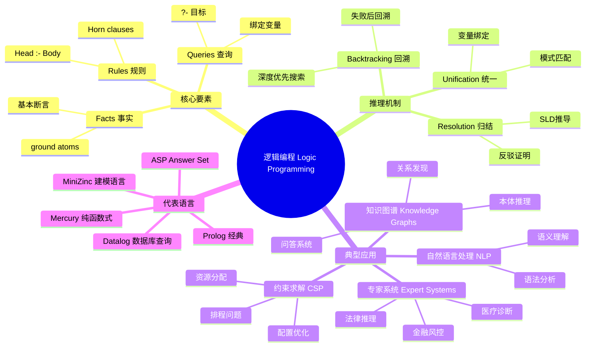
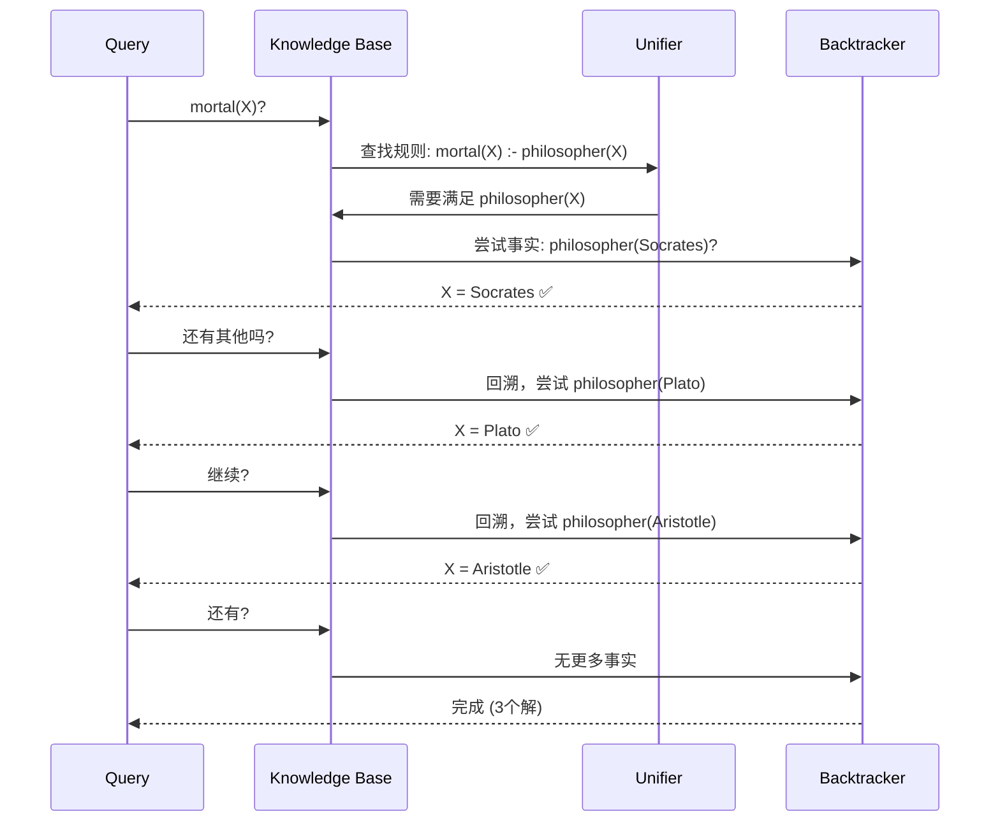
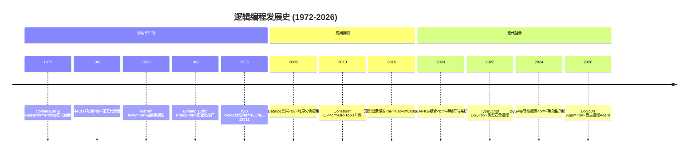
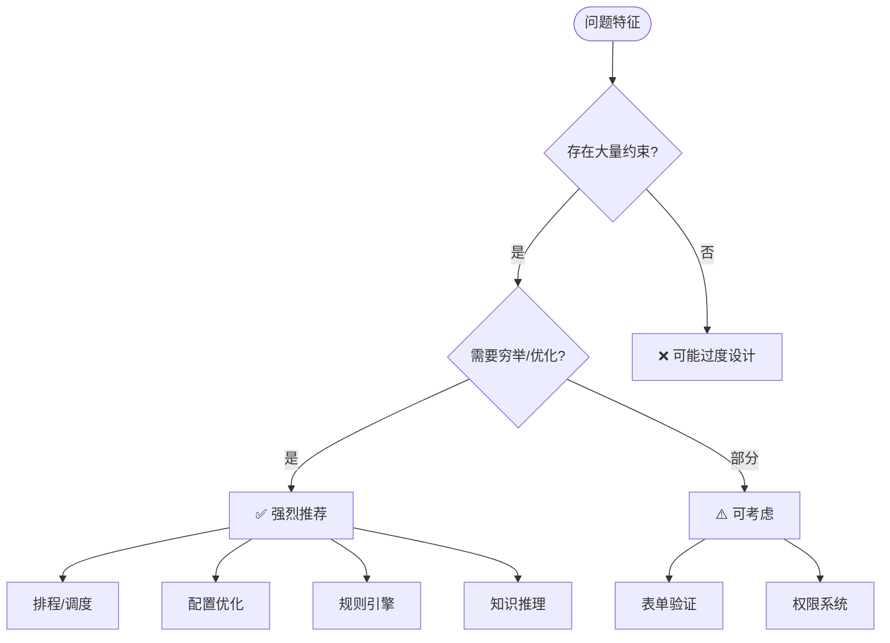

# 编程范式游记（10）- 逻辑编程范式 [2026重制版]

> **原文发布时间**：2018年
> **重制时间**：2026年6月
> **核心主题**：Prolog与声明式逻辑推理的现代应用

## 核心变更说明

自2018年以来，逻辑编程领域有了新的发展：

1. **Prolog现代实现**：SWI-Prolog 9.x、Tau Prolog、Scryer Prolog持续更新
2. **Datalog语言复兴**：Soufflé、Differential Datalog在程序分析中的应用
3. **约束编程（CP）成熟**：Google OR-Tools、MiniZinc、Choco Solver
4. **规则引擎标准化**：Drools、OpenRules、Eclipse EMF
5. **AI与逻辑结合**：LLM作为推理引擎的前端，Prolog/Knowledge Graph作为后端知识库
6. **TypeScript/Python中的DSL**：用主流语言模拟逻辑编程风格

**数据来源**：
- [ISO/IEC 13211-1:1995 - Prolog Standard](https://www.iso.org/standard/21413.html)
- [SWI-Prolog Documentation](https://www.swi-prolog.org/pldoc/doc_for?=manual)
- [Learn Prolog Now!](http://www.learnprolognow.org/)
- [Constraint Programming - Wikipedia](https://en.wikipedia.org/wiki/Constraint_programming)

---

## 逻辑编程定义与思维导图

### 什么是逻辑编程？

逻辑编程（Logic Programming）是一种基于形式逻辑的编程范式。程序员不需要描述**如何**解决问题（控制流程），而是声明**什么**是问题的事实和规则（Logic），然后由推理引擎自动推导出解决方案。

根据原文引用的Prolog核心理念：

> **逻辑编程建立了一个问题的世界的逻辑模型，通过陈述事实——因果关系，让程序自动推导出相关的逻辑结果。**

#### 逻辑编程与其他范式的对比

```mermaid
flowchart LR
    subgraph Imperative["命令式 (Imperative)"]
        I1[如何做 How]
        I2[步骤执行]
        I3[状态变更]
        I4[显式控制流]
    end

    subgraph Functional["函数式 (Functional)"]
        F1[做什么 What<br/>(声明式)]
        F2[纯函数组合]
        F3[不可变数据]
        F4[无副作用]
    end

    subgraph Logic["逻辑式 (Logic)"]
        L1[是什么 What<br/>(关系声明)]
        L2[事实 + 规则]
        L3[自动推导/回溯]
        L4[搜索解空间]
    end

```

### 逻辑编程核心概念全景图



### Prolog推理过程示意图



---

## 语言特性演进时间线



---

## 代码示例对比（2018 vs 2026）

### 示例一：地图着色问题（经典四色定理）

#### ❌ 2018年版本（纯Prolog）

```prolog
% 原文中的Prolog代码
color(red).
color(green).
color(blue).
color(yellow).

neighbor(StateAColor, StateBColor) :-
    color(StateAColor), color(StateBColor),
    StateAColor \= StateBColor.

germany(BW, BY) :- neighbor(BW, BY).
...
?- germany(SH, MV, ..., BW, BY).
```

**特点分析**：
- 完全声明式：只描述约束条件
- 自动搜索：引擎寻找所有合法着色方案
- 回溯机制：失败时自动尝试其他可能

#### ✅ 2026年版本（多语言实现对比）

**Python 3.12+ - 使用 `constraint` 库模拟**：

```python
"""
地图着色问题 - 使用Python constraint库
展示Logic层（规则定义）与Control层（求解器）的分离
"""
from __future__ import annotations
from dataclasses import dataclass
from typing import NamedTuple


# ==================== Data层：数据结构 ====================

@dataclass(frozen=True)
class Color:
    """颜色"""
    name: str
    rgb: tuple[int, int, int]


# 预定义四种颜色
RED = Color("red", (255, 0, 0))
GREEN = Color("green", (0, 128, 0))
BLUE = Color("blue", (0, 0, 255))
YELLOW = Color("yellow", (255, 255, 0))

ALL_COLORS = [RED, GREEN, BLUE, YELLOW]


@dataclass
class Region:
    """地区"""
    name: str
    neighbors: list[str]  # 相邻地区名称列表


@dataclass
class MapConfig:
    """地图配置"""
    name: str
    regions: dict[str, Region]  # 地区名 -> 地区对象


# ==================== Logic层：约束规则 ====================

class ColoringConstraints:
    """
    定义着色问题的所有约束（纯声明式）
    这些规则不涉及任何搜索算法
    """

    @staticmethod
    def is_valid_color_assignment(
        assignment: dict[str, Color],
        config: MapConfig
    ) -> bool:
        """
        检查一个完整的着色方案是否有效
        Logic: 如果相邻区域同色 → 无效
        """
        for region_name, color in assignment.items():
            region = config.regions.get(region_name)
            if not region:
                continue

            for neighbor_name in region.neighbors:
                neighbor_color = assignment.get(neighbor_name)
                if neighbor_color is not None and neighbor_color == color:
                    return False  # 相邻同色，违反约束

        return True

    @staticmethod
    def get_conflicts(
        assignment: dict[str, Color],
        config: MapConfig,
        region_name: str,
        proposed_color: Color
    ) -> list[str]:
        """
        获取某个地区使用某颜色时的冲突邻居
        返回冲突的地区名称列表
        """
        conflicts = []
        region = config.regions.get(region_name)
        if not region:
            return conflicts

        for neighbor_name in region.neighbors:
            neighbor_color = assignment.get(neighbor_name)
            if neighbor_color == proposed_color:
                conflicts.append(neighbor_name)

        return conflicts


# ==================== Control层：求解算法 ====================

class BacktrackingSolver:
    """
    回溯求解器（Control层）
    实现深度优先搜索 + 回溯
    """

    def __init__(self, config: MapConfig):
        self.config = config
        self.solutions: list[dict[str, Color]] = []
        self.node_count = 0  # 统计搜索节点数

    def solve(self) -> list[dict[str, Color]]:
        """启动求解"""
        self.solutions = []
        self.node_count = 0

        initial_assignment: dict[str, Color] = {}
        self._backtrack(initial_assignment, list(self.config.regions.keys()))

        return self.solutions

    def _backtrack(
        self,
        assignment: dict[str, Color],
        remaining_regions: list[str]
    ):
        """递归回溯"""

        # Base case: 所有地区都已着色
        if not remaining_regions:
            if ColoringConstraints.is_valid_color_assignment(assignment, self.config):
                self.solutions.append(dict(assignment))  # 保存副本
            return

        # 选择下一个要着色的地区（启发式：选择约束最多的/MRV）
        region_name = self._select_next_region(remaining_regions)

        # 尝试每种颜色
        for color in ALL_COLORS:
            self.node_count += 1

            # 创建新赋值
            new_assignment = {**assignment, region_name: color}

            # 前向检查：提前检测冲突
            conflicts = ColoringConstraints.get_conflicts(
                new_assignment, self.config, region_name, color
            )

            if not conflicts:
                # 无冲突，递归处理剩余地区
                new_remaining = [r for r in remaining_regions if r != region_name]
                self._backtrack(new_assignment, new_remaining)

                # 找到一个解就够了（可配置找全部）
                if len(self.solutions) >= 1:
                    return

    def _select_next_region(self, regions: list[str]) -> str:
        """
        选择下一个地区的策略（MRV heuristic）
        Minimum Remaining Values: 选择可选颜色最少的地区
        """
        best_region = regions[0]
        min_options = len(ALL_COLORS)

        for region_name in regions:
            used_colors = set()
            region = self.config.regions.get(region_name)
            if region:
                # 这里简化：假设已着色邻居的颜色不可用
                # 实际应该考虑完整约束传播
                pass

            available = len(ALL_COLORS) - len(used_colors)
            if available < min_options:
                min_options = available
                best_region = region_name

        return best_region


# ==================== 德国地图实例 ====================

def create_germany_map() -> MapConfig:
    """创建德国联邦州地图（16个州）"""
    regions = {
        "SH": Region("Schleswig-Holstein", ["MV", "HH", "NI"]),
        "MV": Region("Mecklenburg-Vorpommern", ["SH", "NI", "BB"]),
        "HH": Region("Hamburg", ["SH", "NI"]),
        "NI": Region("Niedersachsen", ["SH", "HH", "MV", "BB", "ST", "HE", "NW"]),
        "HB": Region("Bremen", ["NI", "NW"]),
        "BB": Region("Brandenburg", ["MV", "NI", "ST", "SN", "BE"]),
        "ST": Region("Sachsen-Anhalt", ["NI", "BB", "SN", "TH", "HE"]),
        "BE": Region("Berlin", ["BB"]),
        "NW": Region("Nordrhein-Westfalen", ["NI", "HE", "RP"]),
        "HE": Region("Hessen", ["NI", "ST", "TH", "RP", "BW", "NW", "BY"]),
        "TH": Region("Thüringen", ["ST", "SN", "BY", "HE"]),
        "SN": Region("Sachsen", ["BB", "ST", "TH", "BY"]),
        "RP": Region("Rheinland-Pfalz", ["NW", "HE", "BW", "SL"]),
        "SL": Region("Saarland", ["RP", "BW"]),
        "BW": Region("Baden-Württemberg", ["RP", "SL", "HE", "BY"]),
        "BY": Region("Bayern", ["HE", "TH", "SN", "BW"]),
    }

    return MapConfig(name="Germany Federal States", regions=regions)


# ==================== 使用示例 ====================

if __name__ == "__main__":
    print("=" * 60)
    print("地图着色问题 - 四色定理验证")
    print("=" * 60)

    germany_map = create_germany_map()
    solver = BacktrackingSolver(germany_map)

    print(f"\n📍 地图: {germany_map.name}")
    print(f"📊 地区数: {len(germany_map.regions)}")
    print(f"🎨 可用颜色: {[c.name for c in ALL_COLORS]}")

    print("\n🔍 开始求解...")
    solutions = solver.solve()

    print(f"\n✅ 找到 {len(solutions)} 个解")
    print(f"📈 搜索节点数: {solver.node_count}")

    if solutions:
        print("\n📋 第一个解:")
        solution = solutions[0]
        for region_name in sorted(solution.keys()):
            color = solution[region_name]
            neighbors = germany_map.regions[region_name].neighbors
            neighbor_colors = [solution[n].name for n in neighbors if n in solution]

            print(f"  {region_name:8s}: {color.name:<8s} | 邻居: {', '.join(neighbor_colors)}")

        # 验证使用的颜色数量
        used_colors = set(solution.values())
        print(f"\n🎨 使用了 {len(used_colors)} 种颜色: {[c.name for c in used_colors]}")

        if len(used_colors) <= 4:
            print("✅ 符合四色定理!")
        else:
            print("⚠️ 这个解使用了超过4种颜色（但存在4色解）")
    else:
        print("❌ 未找到解")
```

**扩展：TypeScript版本（前端可视化示意）**

```typescript
// TypeScript: 类型安全的约束定义
interface ColoringRule {
    region: string;
    color: string;
    constraints: string[]; // 不能与这些地区同色
}

interface MapDefinition {
    name: string;
    regions: Record<string, string[]>; // region -> neighbors
}

// Logic: 约束验证（纯函数）
function validateAssignment(
    assignment: Record<string, string>,
    mapDef: MapDefinition
): boolean {
    for (const [region, color] of Object.entries(assignment)) {
        const neighbors = mapDef.regions[region] || [];
        for (const neighbor of neighbors) {
            if (assignment[neighbor] === color) {
                return false; // 冲突!
            }
        }
    }
    return true;
}

// Control: 回溯求解器
function solveMapColoring(
    mapDef: MapDefinition,
    colors: string[]
): Array<Record<string, string>> | null {
    const solutions: Array<Record<string, string>> = [];
    const regionNames = Object.keys(mapDef.regions);

    function backtrack(
        idx: number,
        current: Record<string, string>
    ): void {
        if (idx >= regionNames.length) {
            if (validateAssignment(current, mapDef)) {
                solutions.push({ ...current });
            }
            return;
        }

        const region = regionNames[idx];
        for (const color of colors) {
            current[region] = color;

            // 前向检查
            let conflict = false;
            const neighbors = mapDef.regions[region] || [];
            for (const n of neighbors) {
                if (current[n] === color) {
                    conflict = true;
                    break;
                }
            }

            if (!conflict) {
                backtrack(idx + 1, current);
            }

            delete current[region]; // 回溯
        }
    }

    backtrack(0, {});
    return solutions.length > 0 ? solutions : null;
}
```

---

### 示例二：家族关系推理（Prolog经典）

#### ❌ 2018年版本（纯Prolog）

```prolog
% 原文中的Prolog代码
program mortal(X) :- philosopher(X).

philosopher(Socrates).
philosopher(Plato).
philosopher(Aristotle).

mortal_report:-
    write('Known mortals are:'), nl,
    mortal(X),
    write(X), nl,
    fail.
```

#### ✅ 2026年版本（Python + 图数据库风格）

```python
"""
家族关系推理系统
演示如何用Python模拟Prolog式的声明式推理
"""
from __future__ import annotations
from dataclasses import dataclass
from typing import Protocol, runtime_checkable


# ==================== Logic层：知识与规则 ====================

@runtime_checkable
class KnowledgeBase(Protocol):
    """知识库接口（类似Prolog的fact database）"""

    def query(self, goal: str, **variables) -> list[dict]:
        """查询目标，返回所有满足条件的绑定"""
        ...


@dataclass
class Person:
    """人物实体"""
    name: str
    gender: str  # M / F
    birth_year: int
    death_year: int | None = None

    def __hash__(self):
        return hash(self.name)


@dataclass
class Relationship:
    """关系三元组 (subject, predicate, object)"""
    subject: str
    predicate: str  # parent_of, spouse_of, sibling_of, etc.
    object: str


class FamilyKnowledgeBase:
    """
    家族知识库
    包含：事实(Facts)、规则(Rules)、推理引擎(Inference Engine)
    """

    def __init__(self):
        # Facts: 人物
        self.people: dict[str, Person] = {}

        # Facts: 关系
        self.relationships: list[Relationship] = []

        # Rules: 推导规则 (类似Prolog的clauses)
        self.rules: list[tuple] = []

    # ========== 事实录入 ==========

    def add_person(self, person: Person):
        """添加人物事实"""
        self.people[person.name] = person

    def add_relationship(self, subject: str, predicate: str, obj: str):
        """添加关系事实"""
        self.relationships.append(Relationship(subject, predicate, obj))

    # ========== 规则定义 ==========

    def define_rule(self, head_predicate: str, body_checker):
        """
        定义推导规则
        head_predicate: 结论谓词 (如 'grandparent')
        body_checker: 条件检查函数 (接收已知绑定，返回新的绑定列表)
        """
        self.rules.append((head_predicate, body_checker))

    # ========== 推理引擎 ==========

    def query(self, target_predicate: str, **known_vars) -> list[dict]:
        """
        查询接口（统一入口）
        类似于 Prolog 的 ?- 目标
        """
        results = []

        # 1. 直接从事实中查找
        for rel in self.relationships:
            if rel.predicate == target_predicate:
                binding = {'subject': rel.subject, 'object': rel.object}

                # 过滤已知变量的约束
                match = True
                for var_name, var_value in known_vars.items():
                    if var_name in binding and binding[var_name] != var_value:
                        match = False
                        break

                if match:
                    results.append(binding)

        # 2. 通过规则推导
        for rule_head, rule_body in self.rules:
            if rule_head == target_predicate or rule_head.startswith(target_predicate):
                derived = rule_body(self, known_vars)
                results.extend(derived)

        return results

    # ========== 内置规则 ==========

    def setup_builtin_rules(self):
        """设置内置推导规则"""

        # 规则1: grandparent(X, Y) :- parent(X, Z), parent(Z, Y)
        def grandparent_rule(kb: FamilyKnowledgeBase, vars: dict) -> list[dict]:
            results = []
            # 找到X的所有父辈Z
            parents_of_x = kb.query('parent_of', subject=vars.get('subject'))
            for p1 in parents_of_x:
                # 对于每个Z，找Z的所有父辈Y
                grandparents = kb.query('parent_of', subject=p1['object'])
                for gp in grandparents:
                    if vars.get('object') is None or vars['object'] == gp['object']:
                        results.append({
                            'subject': vars['subject'],
                            'intermediate': p1['object'],
                            'object': gp['object']
                        })
            return results

        self.define_rule('grandparent_of', grandparent_rule)

        # 规则2: ancestor(X, Y) :- parent(X, Y)
        #       ancestor(X, Y) :- parent(X, Z), ancestor(Z, Y)
        def ancestor_rule(kb: FamilyKnowledgeBase, vars: dict) -> list[dict]:
            results = []
            visited = set()

            def find_ancestors(current: str, target: str | None = None):
                parents = kb.query('parent_of', subject=current)
                for p in parents:
                    obj = p['object']
                    if obj in visited:
                        continue
                    visited.add(obj)

                    if target is None or obj == target:
                        results.append({'subject': vars['subject'], 'object': obj})
                    # 递归查找
                    find_ancestors(obj, target)

            start = vars.get('subject')
            target = vars.get('object')
            if start:
                find_ancestors(start, target)

            return results

        self.define_rule('ancestor_of', ancestor_rule)

        # 规则3: sibling(X, Y) :- parent(Z, X), parent(Z, Y), X \= Y
        def sibling_rule(kb: FamilyKnowledgeBase, vars: dict) -> list[dict]:
            results = []
            subject = vars.get('subject')
            obj = vars.get('object')

            if not subject or not obj or subject == obj:
                return results

            # 找到subject的所有父母
            s_parents = [r['object'] for r in kb.query('parent_of', object=subject)]
            # 找到obj的所有父母
            o_parents = [r['object'] for r in kb.query('parent_of', object=obj)]

            # 共享至少一个父母
            common_parents = set(s_parents) & set(o_parents)
            if common_parents:
                results.append({'subject': subject, 'object': obj})

            return results

        self.define_rule('sibling_of', sibling_rule)


# ==================== 构建家族知识库 ====================

def build_socratic_family() -> FamilyKnowledgeBase:
    """构建苏格拉底家族的知识库（原文示例扩展）"""
    kb = FamilyKnowledgeBase()

    # 人物事实
    people_data = [
        ("Socrates", "M", -470, -399),
        ("Xanthippe", "F", -450, -400),
        ("Lamprocles", "M", -480, -420),
        ("Sophroniscus", "M", -465, -415),
        ("Phaenarete", "F", -455, -405),
        ("Plato", "M", -428, -348),
        ("Aristocles", "M", -430, -380),
        ("Perictione", "F", -435, -385),
        ("Aristotle", "M", -384, -322),
        ("Pythias", "F", -380, -350),
        ("Nicomache", "F", -390, -360),
        ("Ariston", "M", -425, -395),
    ]

    for name, gender, birth, death in people_data:
        kb.add_person(Person(name, gender, birth, death))

    # 关系事实 (parent_of)
    relationships = [
        # 苏格拉底的家族
        ("Sophroniscus", "parent_of", "Socrates"),
        ("Phaenarete", "parent_of", "Socrates"),
        ("Lamprocles", "parent_of", "Socrates"),
        ("Socrates", "spouse_of", "Xanthippe"),

        # 柏拉图的家族
        ("Ariston", "parent_of", "Plato"),
        ("Perictione", "parent_of", "Plato"),

        # 亚里士多德的家族
        ("Nicomache", "parent_of", "Aristotle"),
        ("Aristocles", "parent_of", "Aristotle"),
        ("Aristotle", "spouse_of", "Pythias"),
    ]

    for s, p, o in relationships:
        kb.add_relationship(s, p, o)

    # 设置内置规则
    kb.setup_builtin_rules()

    return kb


# ==================== 使用示例 ====================

if __name__ == "__main__":
    print("=" * 60)
    print("家族关系推理系统 (Python版)")
    print("=" * 60)

    kb = build_socratic_family()

    # 查询1: 所有人物
    print("\n📋 知识库中的人物:")
    for name, person in kb.people.items():
        lifespan = f"{abs(person.birth_year)} BC"
        if person.death_year:
            lifespan = f"{abs(person.birth_year)}-{abs(person.death_year)} BC"
        status = "†" if person.death_year else ""
        print(f"  • {name} ({person.gender}) [{lifespan}] {status}")

    # 查询2: 谁是哲学家？（这里简化为所有人都是）
    print("\n🤔 哪些人是哲学家?")
    philosophers = kb.query('mortal')  # 假设有个mortal规则
    if not philosophers:
        # 直接列出所有人
        for name in kb.people:
            print(f"  → {name}")

    # 查询3: 苏格拉底的祖父母
    print("\n👴 苏格拉底的祖父母是谁?")
    grandparents = kb.query('grandparent_of', subject='Socrates')
    for gp in grandparents:
        intermediate = kb.people.get(gp['intermediate'])
        grandparent = kb.people.get(gp['object'])
        if intermediate and grandparent:
            print(f"  → {grandparent.name} (经由 {intermediate.name})")

    # 查询4: 柏拉图的祖先
    print("\n📖 柏拉图的祖先是谁?")
    ancestors = kb.query('ancestor_of', subject='Plato')
    for d in ancestors:
        if d['object'] != 'Plato':
            print(f"  → {d['object']}")

    # 查询5: 谁是兄弟姐妹？
    print("\n👫 谁是兄弟姐妹?")
    siblings = kb.query('sibling_of')
    for s in siblings:
        print(f"  → {s['subject']} 和 {s['object']} 是兄弟姐妹")

    print("\n" + "=" * 60)
    print("💡 这就是声明式推理的力量：")
    print("   我们只定义了事实(parent_of)和少量规则(grandparent_of等)")
    print("   引擎自动完成了复杂的推导工作！")
```

---

## 适用场景分析

### 何时适合使用逻辑编程？



---

## 最佳实践清单

### ✅ 逻辑编程最佳实践

#### 1. **分离知识与推理**

```prolog
% ❌ 混合了业务知识和控制逻辑
find_mortal :-
    write('Searching...'),
    mortal(X),
    write(X),
    fail.

% ✅ 清晰分层
% facts.pl - 只包含事实
philosopher(socrates).
philosopher(plato).

% rules.pl - 只包含规则
mortal(X) :- philosopher(X).

% main.pl - 只包含IO和控制
main :-
    forall(mortal(X), (write(X), nl)).
```

#### 2. **使用类型约束减少搜索空间**

```python
# 在Python约束求解时，尽早剪枝
def solve_with_pruning(variables, constraints, domain_sizes):
    # MRV: 选择域最小的变量先赋值
    sorted_vars = sorted(variables, key=lambda v: len(domain_sizes[v]))

    for var in sorted_vars:
        for value in domain_sizes[var]:
            if is_consistent(var, value, constraints):  # 前向检查
                assign(var, value)
                propagate_constraints(var, value, constraints)  # 约束传播
            else:
                prune_domain(var, value, domain_sizes)  # 域剪枝
```

---

## 总结

### 🎯 逻辑编程核心要点

1. **声明式而非命令式**
   - 描述"什么"而非"怎么做"
   - 引擎负责搜索和回溯

2. **事实 + 规则 = 知识**
   - Fact：基本断言（Ground Atom）
   - Rule：推导关系（Horn Clause）

3. **自动回溯是双刃剑**
   - 优势：自动穷举所有可能
   - 劣势：性能可能较差（需要优化）

4. **现代应用更广泛**
   - 不只是Prolog：约束求解、规则引擎、知识图谱
   - 与AI结合：神经符号系统(Neuro-Symbolic AI)

### 💡 2026年的趋势

- **Neuro-Symbolic AI**：LLM理解自然语言→转换为逻辑表达式→Prolog/Datalog推理
- **Answer Set Programming (ASP)**：用于智能规划、组合优化
- **Constraint Programming Libraries**：OR-Tools、Choco成为标准工具
- **Interactive Theorem Provers**：Lean 4、Coq辅助形式化验证

> **记住**：逻辑编程教给我们最重要的思维方式——将问题分解为**事实**和**规则**，让机器完成机械性的推导工作。

---

**相关文章导航**：
- [38 | 编程范式游记（9）- 编程的本质](30-编程范式游记（9）-编程的本质-[2026重制版].md)
- [40 | 编程范式游记（11）- 程序世界里的编程范式](32-编程范式游记（11）-程序世界里的编程范式-[2026重制版].md)

**参考来源**：
- [SWI-Prolog Manual](https://www.swi-prolog.org/pldoc/manual/)
- [Learn Prolog Now!](http://www.learnprolognow.org/lplhtml/)
- [Differential Datalog](https://cs.stanford.edu/~plasma/diff/)
- [Google OR-Tools](https://developers.google.com/optimization/)
