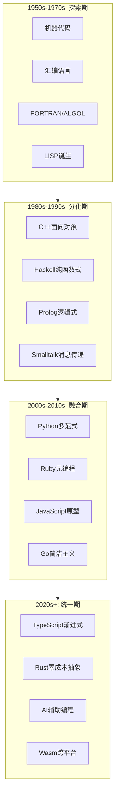
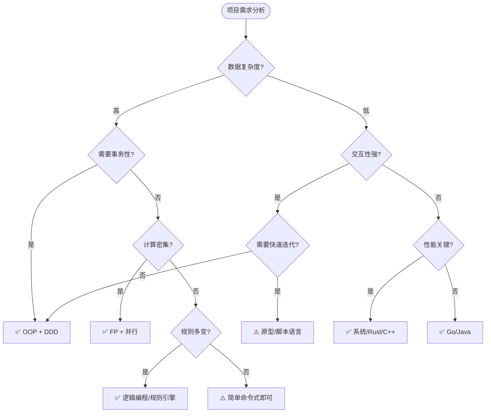
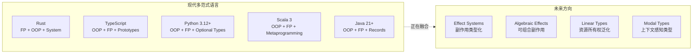
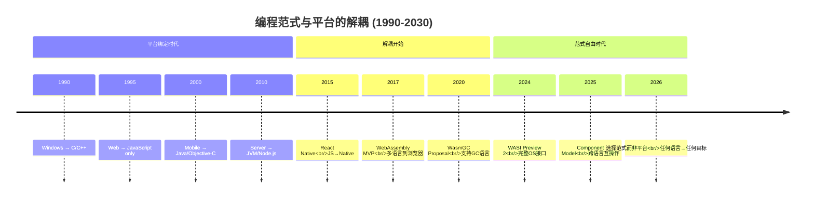
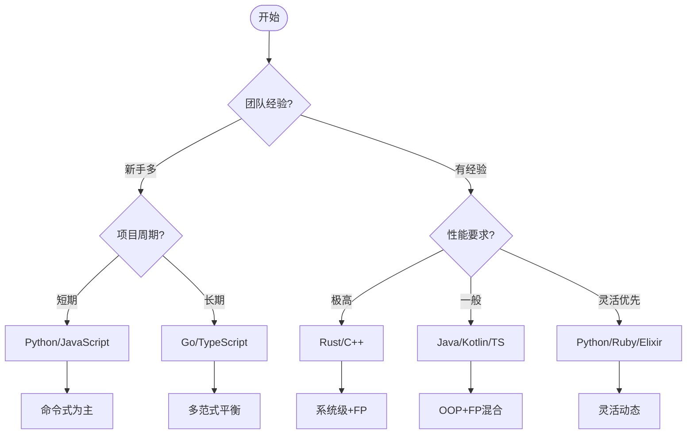
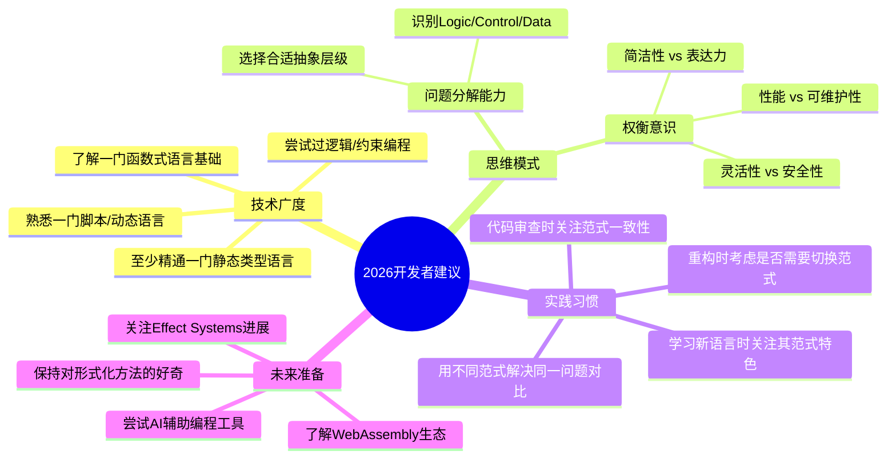
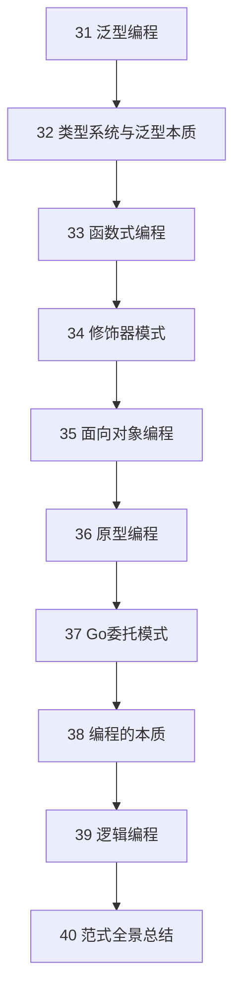

# 编程范式游记（11）- 程序世界里的编程范式 [2026重制版]

> **原文发布时间**：2018年
> **重制时间**：2026年6月
> **核心主题**：编程范式的全景总结与未来展望

## 核心变更说明

自2018年原文发布以来，编程范式领域经历了深刻变革：

1. **多范式融合成为主流**：Rust、TypeScript、Python 3.12+ 都支持多种范式混合使用
2. **AI改变编程方式**：Copilot/Cursor等工具让"如何实现"变得次要，"要做什么"成为核心
3. **WebAssembly扩展边界**：WasmGC支持更多语言编译到浏览器，范式选择不再受平台限制
4. **Effect Systems成熟化**：Effect-TS、ZIO等库将副作用类型化
5. **并发模型统一**：Async/Await、Actor Model、Structured Concurrency（结构化并发）成为跨语言标准
6. **声明式UI统治前端**：React/Vue/Svelte的组件模型本质是函数式+响应式

**数据来源**：
- [Paradigms of AI Programming - Peter Norvig](https://norvig.com/paip.html)
- [Wikipedia - Programming Paradigm](https://en.wikipedia.org/wiki/Programming_paradigm)
- [The Pragmatic Programmer - Hunt, Thomas](https://pragprog.com/titles/tpp20/)
- [Seven More Languages in Seven Weeks - Tate](https://pragprog.com/titles/7lang2/)

---

## 编程范式全景图

### 所有范式的关系与分类

```mermaid
mindmap
  root((编程范式全景))
    按执行模型
      命令式 Imperative
        过程式 Procedural
          C, Pascal, Go
        面向对象 OOP
          Java, C++, Rust
      声明式 Declarative
        函数式 FP
          Haskell, Elm, PureScript
        逻辑式 Logic
          Prolog, Datalog
        数据流 Dataflow
          LabVIEW, Spark
      并发模型
        Actor Model
          Erlang, Akka
        CSP (Channel)
          Go, Clojure core.async

    按抽象层次
      低级 Low-Level
        汇编 Assembler
        系统语言 System
          C, Rust, Zig
      中级 Mid-Level
        应用语言 Application
          Python, Java, TypeScript
      高级 High-Level
        DSL 领域特定
          SQL, Regex, Terraform
        规则引擎 Rules
          Drools, CLIPS

    按类型系统
      动态 Dynamic
        JavaScript, Ruby, Python(默认)
      静态 Static
        Rust, Haskell, Java
      渐进式 Gradual
        TypeScript, Python(可选), PHP 8+
      类型推断 Inferred
        OCaml, F#, Swift

    按内存管理
      手动 Manual
        C, C++, Rust(部分)
      GC 自动回收
        Java, Python, Go
      引用计数 RC
        Swift, Objective-C
      所有权 Ownership
        Rust, Cyclone

    现代2026趋势
      多范式融合
        一语言多范式
      Effect Systems
        副作用类型化
      AI辅助生成
        LLM + Human-in-loop
      平台无关
        WebAssembly Wasm
```

### 范式演进路线图



---

## 各范式核心特征对比表

| 特征 | 命令式 | 函数式 | 面向对象 | 逻辑式 | 原型/委托 |
|------|--------|--------|---------|--------|----------|
| **核心单元** | 语句/过程 | 函数 | 对象/类 | 谓词/规则 | 对象/原型 |
| **状态管理** | 可变变量 | 不可变数据 | 封装字段 | 无显式状态 | 动态属性 |
| **控制流** | if/for/while | 递归/map/filter | 方法调用 | 统一/回溯 | 委托链 |
| **主要优势** | 直观易懂 | 并行安全 | 建模自然 | 声明式 | 灵活动态 |
| **典型劣势** | 并发困难 | 学习曲线 | 继承滥用 | 性能问题 | 类型安全弱 |
| **代表语言** | C, Go | Haskell, Elm | Java, C++ | Prolog, Datalog | JS, Lua |
| **适用场景** | 系统编程 | 数据处理 | 企业应用 | 规则引擎 | 快速原型 |

---

## 代码示例：同一问题的多范式解法

### 问题：过滤并转换用户列表

#### 1️⃣ 命令式风格（C/Go风格）

```go
// Go: 典型的命令式风格
func processUsers(users []User) []UserInfo {
    var result []UserInfo

    for i := 0; i < len(users); i++ {
        user := users[i]

        // 过滤条件
        if user.Age < 18 {
            continue
        }
        if !user.IsActive {
            continue
        }

        // 变换数据
        info := UserInfo{
            Name:     strings.ToUpper(user.Name),
            Email:    strings.ToLower(user.Email),
            AgeGroup: getAgeGroup(user.Age),
            Score:    calculateScore(user),
        }

        result = append(result, info)
    }

    return result
}
```

#### 2️⃣ 函数式风格（Haskell/Rust风格）

```rust
// Rust: 函数式迭代器链
fn process_users(users: &[User]) -> Vec<UserInfo> {
    users
        .iter()
        .filter(|u| u.age >= 18)           // filter
        .filter(|u| u.is_active)            // filter again
        .map(|u| {                          // map/transform
            UserInfo {
                name: u.name.to_uppercase(),
                email: u.email.to_lowercase(),
                age_group: age_group(u.age),
                score: calculate_score(u),
            }
        })
        .collect()                           // 收集为Vec
}
```

#### 3️⃣ 面向对象风格（Java/TypeScript风格）

```typescript
// TypeScript: OOP with Strategy Pattern
interface UserFilterStrategy {
    shouldInclude(user: User): boolean;
}

class AdultOnlyFilter implements UserFilterStrategy {
    shouldInclude(user: User): boolean {
        return user.age >= 18;
    }
}

class ActiveUserFilter implements UserFilterStrategy {
    shouldInclude(user: User): boolean {
        return user.isActive;
    }
}

class UserProcessor {
    private filters: UserFilterStrategy[] = [];
    private transformer: UserTransformer;

    addFilter(filter: UserFilterStrategy): void {
        this.filters.push(filter);
    }

    process(users: User[]): UserInfo[] {
        return users
            .filter(user => this.filters.every(f => f.shouldInclude(user)))
            .map(user => this.transformer.transform(user));
    }
}

// 使用
const processor = new UserProcessor();
processor.addFilter(new AdultOnlyFilter());
processor.addFilter(new ActiveUserFilter());
const results = processor.process(userList);
```

#### 4️⃣ 声明式/SQL风格（数据库查询）

```sql
-- SQL: 最纯粹的声明式
SELECT
    UPPER(u.name) AS name,
    LOWER(u.email) AS email,
    CASE
        WHEN u.age BETWEEN 18 AND 30 THEN 'young'
        WHEN u.age BETWEEN 31 AND 50 THEN 'middle'
        ELSE 'senior'
    END AS age_group,
    (u.activity_score * u.engagement_rate) * 100 AS score
FROM users u
WHERE u.age >= 18
  AND u.is_active = TRUE
ORDER BY score DESC;
```

#### 5️⃣ 逻辑式风格（Prolog/Datalog伪代码）

```prolog
% Prolog/Datalog: 声明式规则
process_user(Name, Email, AgeGroup, Score) :-
    user(Name, _, Age, Email, IsActive, ActivityScore, EngagementRate),
    Age >= 18,
    IsActive = true,
    upper_case(Name, UpperName),
    lower_case(Email, LowerEmail),
    determine_age_group(Age, AgeGroup),
    Score is ActivityScore * EngagementRate * 100.

determine_age_group(Age, young) :- Age >= 18, Age =< 30.
determine_age_group(Age, middle) :- Age >= 31, Age =< 50.
determine_age_group(Age, senior) :- Age > 50.

?- process_user(N, E, AG, S).
```

---

## 各范式的适用场景决策树



---

## 2026年编程范式发展趋势

### 趋势一：多范式融合



**具体表现**：
- **Rust**：函数式迭代器 + trait-based OOP + 无GC系统编程
- **TypeScript**：class语法糖 + 函数式管道 + 原型链底层
- **Python**：dataclass(OOP) + typing(FP) + Protocol(Duck Typing)
- **Java**：Record(值对象) + Stream API(FP) + Sealed Classes(代数类型)

### 趋势二：AI辅助降低Control层成本

```
过去 (2018):
┌─────────────────────────────────────┐
│ 开发者手写所有代码                    │
│ ├── Logic (业务逻辑)   ← 难以自动化  │
│ ├── Control (控制流程) ← 大量重复    │
│ └── Data (数据结构)   ← 相对固定    │
└─────────────────────────────────────┘

现在 (2026):
┌─────────────────────────────────────┐
│ 人机协作开发                         │
│ ├── Logic (业务逻辑)   ← 人类主导   │
│ ├── Control (控制流程) ← AI生成     │
│ │   (循环、错误处理、样板代码)       │
│ └── Data (数据结构)   ← AI建议      │
└─────────────────────────────────────┘

未来 (2030?):
┌─────────────────────────────────────┐
│ 自然语言驱动的开发                   │
│ ├── Intent (意图描述)  ← 人类输入   │
│ ├── Logic (自动推导)   ← AI理解    │
│ ├── Control (自动优化) ← AI生成    │
│ └── Verification (形式化证明) ← AI验证│
└─────────────────────────────────────┘
```

### 趋势三：平台无关的范式自由



---

## 如何选择合适的范式？

### 决策框架



### 实用建议清单

| 场景 | 推荐范式 | 推荐语言 | 理由 |
|------|---------|---------|------|
| **Web全栈** | OOP + FP | TypeScript | 类型安全 + React生态 |
| **后端服务** | OOP | Go / Java | 成熟生态 / 企业级 |
| **数据处理** | FP | Python / Rust | Pandas / Polars 性能 |
| **系统编程** | Imperative + FP | Rust | 内存安全 + 零成本抽象 |
| **游戏引擎** | ECS (Data-Oriented) | Rust / C++ | 高性能实体组件 |
| **AI/ML** | FP + Array | Python(JAX) / Julia | 数组编程 + 自动微分 |
| **嵌入式** | Imperative | C / Zig / Rust | 硬件直接控制 |
| **规则引擎** | Logic | Prolog / Drools | 声明式推理 |
| **快速原型** | Prototype-based | JavaScript / Lua | 动态灵活性 |

---

## 总结：编程范式的哲学思考

### 🎯 核心观点回顾

根据本系列文章（31-40）的探讨：

1. **没有银弹，只有权衡**
   - 每种范式解决一类特定问题
   - 最好的程序员掌握多种范式

2. **分离关注点是永恒原则**
   - Logic vs Control vs Data（第38篇）
   - 业务逻辑与技术实现的分离

3. **抽象层级决定表达力**
   - 低级：精确控制但繁琐
   - 高级：简洁优雅但有约束
   - 选择适合问题复杂度的抽象级别

4. **2026年的新认知**
   - **AI降低了Control层的编写成本**
   - **平台不再是范式选择的限制因素**
   - **多范式融合是主流语言的必然方向**

### 💡 给开发者的建议



### 📚 本系列文章导航



| 文章编号 | 核心主题 | 关键收获 |
|---------|---------|---------|
| **31** | 泛型编程 | 参数化抽象、算法与数据分离 |
| **32** | 类型系统 | 类型即契约、泛型的本质是参数化 |
| **33** | 函数式编程 | 纯函数、不可变性、声明式思维 |
| **34** | 修饰器模式 | 横切关注点、AOP、高阶函数 |
| **35** | 面向对象 | SOLID原则、组合优于继承 |
| **36** | 原型编程 | 委托机制、Mixin、动态扩展 |
| **37** | Go委托 | Embedding、接口隐式满足、泛型增强 |
| **38** | 编程本质 | Program = Logic + Control + Data |
| **39** | 逻辑编程 | 声明式推理、事实+规则=知识 |
| **40** | **范式全景** | **多范式融合、选择策略、未来趋势** |

---

## 最终寄语

> **"The best programmers are not those who know the most syntax, but those who can think in multiple paradigms and choose the right tool for each problem."**
>
> — 改编自《Pragmatic Programmer》

在2026年这个AI辅助编程的时代：

- **不要被单一范式束缚思维**
- **学会识别问题的本质（Logic/Control/Data）**
- **拥抱多范式融合的趋势**
- **保持对编程本质的好奇心和敬畏心**

编程范式不是宗教信仰，而是解决问题的工具箱。最好的架构师能够根据问题的特点，从工具箱中挑选最合适的工具——甚至创造新的工具。

---

**系列完结 🎉**

**参考来源**：
- [Wikipedia - Programming Paradigm](https://en.wikipedia.org/wiki/Programming_paradigm)
- [Seven Languages in Seven Weeks - Bruce Tate](https://pragprog.com/titles/7lang/)
- [The Pragmatic Programmer 20th Anniversary](https://pragprog.com/titles/tpp20/)
- [Out of the Tar Pit](https://archive.is/WOuev)
- [Rust Book - Fearless Concurrency](https://doc.rust-lang.org/book/ch16-00-concurrency.html)
