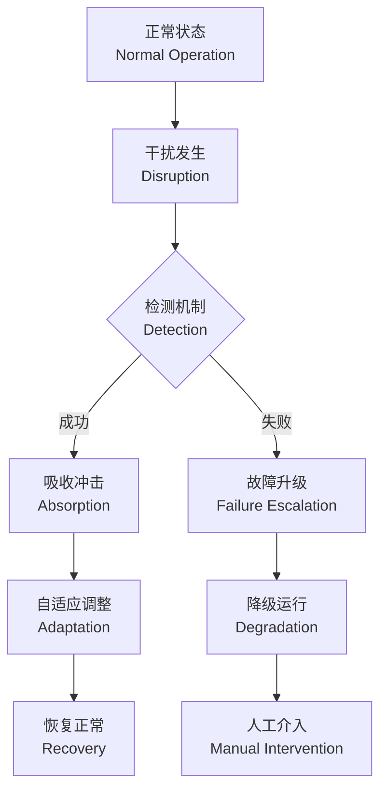
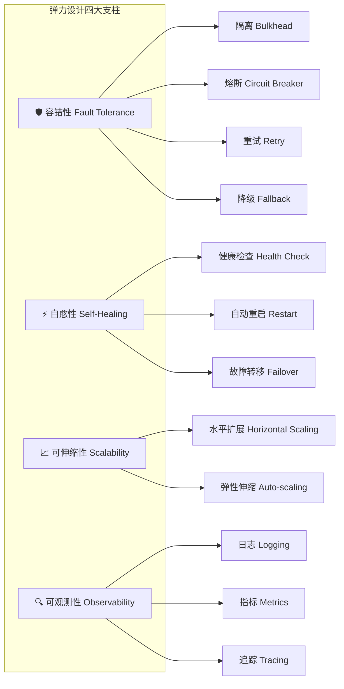
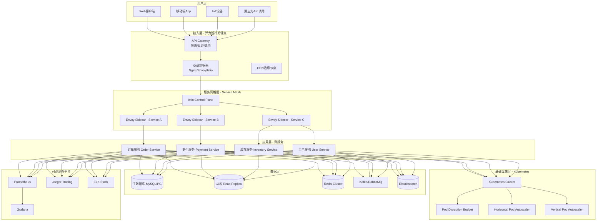
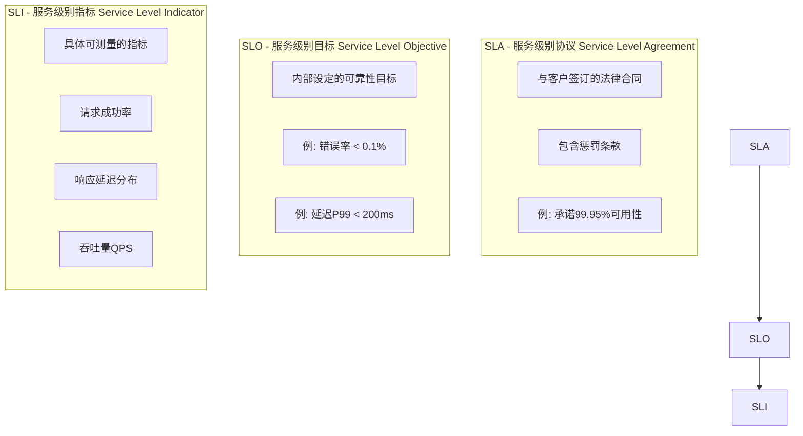
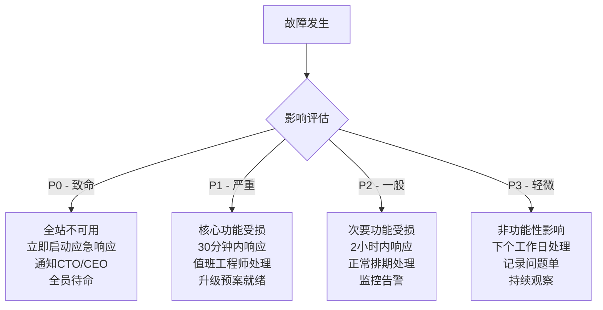
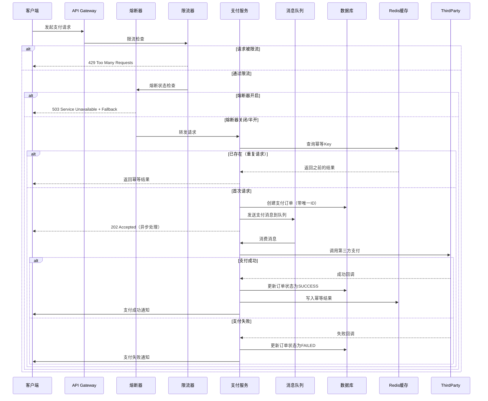
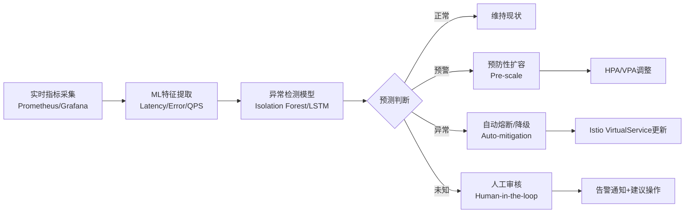

# 弹力设计篇之"认识故障和弹力设计" - [2026重制版]

> **核心变更说明**：本文基于原极客时间专栏第41讲内容进行全面升级，更新至2026年技术栈。主要变更包括：
> - 补充云原生时代的故障分类体系（CNCF故障模型）
> - 更新可用性计算标准（参照SRE Google实践）
> - 新增Kubernetes原生弹力能力（PDB、HPA、VPA）
> - 引入Chaos Engineering最佳实践（LitmusChaos、Chaos Mesh）
> - 添加服务网格视角的弹力设计（Istio/Envoy）

---

## 一、问题背景：真实故障场景

### 1.1 经典故障案例

在深入弹力设计之前，让我们先回顾几个真实的分布式系统故障案例：

**案例1：2017年Equifax数据泄露事件**
- **故障原因**：Apache Struts2漏洞未及时修复
- **影响范围**：1.45亿用户数据泄露
- **根本原因**：缺乏有效的故障隔离和快速恢复机制
- **经济损失**：超过14亿美元

**案例2：2021年Facebook/Meta全球宕机6小时**
- **故障原因**：DNS配置错误导致BGP路由撤回
- **影响范围**：全球30亿用户无法访问Facebook、Instagram、WhatsApp
- **技术细节**：骨干网路由器配置变更触发级联故障
- **恢复时间**：约6小时（MTTR过长）

**案例3：2022年阿里云香港地区大规模故障**
- **故障原因**：冷却系统故障导致数据中心过热
- **影响范围**：香港区域多个可用区服务中断
- **启示**：物理基础设施故障需要跨区域容灾设计

这些案例揭示了一个核心真理：**在分布式系统中，故障不是"是否发生"的问题，而是"何时发生"以及"如何应对"的问题**。

### 1.2 故障的必然性

根据Google SRE团队的实践经验（参考《Site Reliability Engineering》一书），在一个大型分布式系统中：

| 故障类型 | 发生频率 | 平均恢复时间 |
|---------|---------|------------|
| 单机硬件故障 | 每天1-2次 | < 10分钟 |
| 机架级故障 | 每月1-2次 | < 30分钟 |
| 可用区故障 | 每年1-2次 | < 2小时 |
| 区域级故障 | 每5-10年1次 | < 24小时 |

**关键认知转变**：
- ❌ 传统思维："如何避免所有故障"
- ✅ 弹力设计思维："Design for Failure"——假设故障必然发生，设计系统能够自动恢复

---

## 二、核心概念与架构图

### 2.1 什么是弹力设计（Resilience Design）

弹力设计（Resilience Engineering）源于航空、核电等高可靠性领域，后被引入软件工程领域。

**定义**：弹力设计是指系统在面对内部或外部干扰时，能够检测异常、吸收冲击、自适应调整并恢复正常运行的能力。



### 2.2 弹力设计的四大支柱

现代弹力设计通常包含四大支柱：



### 2.3 现代分布式系统架构全景图



---

## 三、系统可用性测量标准

### 3.1 可用性公式

$$Availability = \frac{MTTF}{MTTF + MTTR} \times 100\%$$

其中：
- **MTTF (Mean Time To Failure)**：平均无故障时间
- **MTTR (Mean Time To Recovery)**：平均修复时间

### 3.2 工业界可用性等级标准

| 可用性等级 | 年度停机时间 | 适用场景 |
|-----------|------------|---------|
| 99% ("两个九") | 3.65天 | 内部系统、非关键业务 |
| 99.9% ("三个九") | 8.76小时 | 一般业务系统 |
| 99.99% ("四个九") | 52.6分钟 | 重要业务系统 |
| 99.999% ("五个九") | 5.26分钟 | 金融支付、电信核心 |
| 99.9999% ("六个九") | 31.5秒 | 航空管制、核电站 |

### 3.3 SLI/SLO/SLA三层体系

Google SRE团队提出的SLI/SLO/SLA体系已成为行业标准：



**实际应用示例**：
- **SLI**：HTTP请求成功率 = 成功请求数 / 总请求数 × 100%
- **SLO**：月度HTTP请求成功率 ≥ 99.9%（即错误率 ≤ 0.1%）
- **SLA**：若未达到SLO，将为客户提供10%的服务费减免

---

## 四、故障分类体系（2026更新版）

### 4.1 CNCF故障分类模型

云原生时代的分布式系统故障可分为以下几类：

#### 4.1.1 基础设施层故障

| 故障类型 | 典型场景 | 影响范围 | 恢复策略 |
|---------|---------|---------|---------|
| 硬件故障 | 磁盘损坏、内存故障、网卡失效 | 单机/机架 | 自动替换、Pod迁移 |
| 网络故障 | DNS解析失败、BGP路由震荡、带宽拥塞 | 跨可用区/区域 | 多AZ部署、Circuit Breaker |
| 电源故障 | UPS失效、市电中断 | 整个机房 | 柴油发电机、异地多活 |
| 冷却故障 | 空调故障导致过热 | 数据中心级 | 自动关机保护 |

#### 4.1.2 平台层故障

| 故障类型 | 典型场景 | 影响范围 | 恢复策略 |
|---------|---------|---------|---------|
| Kubernetes故障 | API Server宕机、etcd数据损坏 | 集群级 | etcd备份恢复、多Master |
| 容器运行时故障 | containerd/docker崩溃 | 节点级 | Kubelet自愈、节点驱逐 |
| 存储故障 | PV丢失、CSI驱动异常 | 应用级 | PVC重建、数据恢复 |

#### 4.1.3 应用层故障

| 故障类型 | 典型场景 | 影响范围 | 恢复策略 |
|---------|---------|---------|---------|
| 内存泄漏 | JVM OOM、Golang goroutine泄漏 | 单实例 | 自动重启、资源限制 |
| CPU飙高 | 死循环、GC风暴 | 单实例/集群 | HPA扩容、熔断限流 |
| 连接池耗尽 | 数据库连接泄漏、HTTP连接未释放 | 全局 | 连接池监控、超时设置 |
| 缓存雪崩 | Redis大面积失效、缓存击穿 | 全局 | 多级缓存、熔断降级 |

#### 4.1.4 业务逻辑故障

| 故障类型 | 典型场景 | 影响范围 | 恢复策略 |
|---------|---------|---------|---------|
| 数据不一致 | 分布式事务失败、消息重复消费 | 数据级 | 补偿事务、幂等设计 |
| 配置错误 | 错误的环境变量、错误的Feature Flag | 功能级 | 配置回滚、灰度发布 |
| 第三方依赖故障 | 支付网关不可用、短信服务宕机 | 业务流 | 降级方案、备用通道 |

### 4.2 故障影响程度分级



---

## 五、技术实现细节

### 5.1 Kubernetes原生弹力能力

#### 5.1.1 Pod Disruption Budget (PDB)

PDB用于保障应用在 voluntary disruptions（自愿性中断，如节点维护、升级）期间的可用性。

```yaml
# pdb-example.yaml
apiVersion: policy/v1
kind: PodDisruptionBudget
metadata:
  name: my-app-pdb
spec:
  minAvailable: 2  # 至少保持2个可用副本
  # maxUnavailable: 1  # 或者最多允许1个不可用
  selector:
    matchLabels:
      app: my-application
---
apiVersion: apps/v1
kind: Deployment
metadata:
  name: my-application
spec:
  replicas: 3
  selector:
    matchLabels:
      app: my-application
  template:
    metadata:
      labels:
        app: my-application
    spec:
      containers:
      - name: my-app
        image: my-app:v1.0.0
        resources:
          requests:
            cpu: 100m
            memory: 128Mi
          limits:
            cpu: 500m
            memory: 512Mi
        livenessProbe:
          httpGet:
            path: /health/live
            port: 8080
          initialDelaySeconds: 30
          periodSeconds: 10
        readinessProbe:
          httpGet:
            path: /health/ready
            port: 8080
          initialDelaySeconds: 5
          periodSeconds: 5
```

**关键点解读**：
- `minAvailable: 2`：确保在任何时候至少有2个Pod处于Ready状态
- 当执行`kubectl drain`操作时，Kubernetes会检查PDB约束
- 如果驱逐会导致可用Pod数低于minAvailable，则操作会被拒绝

#### 5.1.2 Horizontal Pod Autoscaler (HPA)

HPA根据CPU利用率或自定义指标自动调整Pod副本数。

```yaml
# hpa-example.yaml
apiVersion: autoscaling/v2
kind: HorizontalPodAutoscaler
metadata:
  name: my-app-hpa
spec:
  scaleTargetRef:
    apiVersion: apps/v1
    kind: Deployment
    name: my-application
  minReplicas: 2
  maxReplicas: 10
  metrics:
  - type: Resource
    resource:
      name: cpu
      target:
        type: Utilization
        averageUtilization: 70  # CPU利用率达到70%时开始扩容
  - type: Pods
    pods:
      metric:
        name: http_requests_per_second  # 自定义指标
      target:
        type: AverageValue
        averageValue: "1000"  # 每个Pod平均处理1000 QPS
  behavior:
    scaleUp:
      stabilizationWindowSeconds: 60  # 扩容稳定窗口
      policies:
      - type: Percent
        value: 100  # 每次最多扩容100%
        periodSeconds: 15
      - type: Pods
        value: 4  # 每次最多增加4个Pod
        periodSeconds: 15
      selectPolicy: Max  # 选择更激进的策略
    scaleDown:
      stabilizationWindowSeconds: 300  # 缩容稳定窗口（防止抖动）
      policies:
      - type: Percent
        value: 25  # 每次最多缩容25%
        periodSeconds: 15
```

#### 5.1.3 Vertical Pod Autoscaler (VPA)

VPA自动调整Pod的资源请求和限制（CPU/Memory）。

```yaml
# vpa-example.yaml
apiVersion: autoscaling.k8s.io/v1
kind: VerticalPodAutoscaler
metadata:
  name: my-app-vpa
spec:
  targetRef:
    apiVersion: "apps/v1"
    kind: Deployment
    name: my-application
  updatePolicy:
    updateMode: "Auto"  # Auto: 自动更新; Off: 仅建议
  resourcePolicy:
    containerPolicies:
    - containerName: my-app
      minAllowed:
        cpu: 50m
        memory: 64Mi
      maxAllowed:
        cpu: 2
        memory: 2Gi
      controlledResources: ["cpu", "memory"]
```

### 5.2 服务网格中的弹力设计（Istio示例）

Istio作为最流行的Service Mesh实现，提供了丰富的弹力设计能力：

```yaml
# istio-destination-rule.yaml
# 目标规则：定义服务的弹力策略
apiVersion: networking.istio.io/v1beta1
kind: DestinationRule
metadata:
  name: payment-service
spec:
  host: payment-service
  trafficPolicy:
    connectionPool:
      tcp:
        maxConnections: 100  # TCP最大连接数
        connectTimeout: 2s   # 连接超时
      http:
        h2UpgradePolicy: DEFAULT
        http1MaxPendingRequests: 50  # HTTP1最大等待请求数
        http2MaxRequests: 1000       # HTTP2最大请求数
        idleTimeout: 300s            # 空闲超时
        requestTimeout: 10s          # 请求超时
    outlierDetection:  # 异常检测（熔断）
      consecutive5xxErrors: 5       # 连续5个5xx错误
      interval: 30s                 # 检测间隔
      baseEjectionTime: 30s         # 基础驱逐时间
      maxEjectionPercent: 50        # 最大驱逐比例50%
      minHealthPercent: 50          # 最小健康实例比例50%
    tls:
      mode: ISTIO_MUTUAL  # mTLS双向认证
---
# istio-virtual-service.yaml
# 虚拟服务：定义流量管理和重试策略
apiVersion: networking.istio.io/v1beta1
kind: VirtualService
metadata:
  name: payment-service
spec:
  hosts:
  - payment-service
  http:
  - match:
    - uri:
        prefix: /api/payment
    retries:
      attempts: 3           # 重试次数
      perTryTimeout: 2s     # 每次重试超时
      retryOn: gateway-error,connect-failure,refused-stream  # 重试条件
    timeout: 10s            # 总超时时间
    route:
    - destination:
        host: payment-service
        subset: v1
        port:
          number: 8080
    fault:  # 故障注入（用于混沌工程测试）
      delay:
        percentage:
          value: 0.1  # 0.1%的概率
        fixedDelay: 5s  # 延迟5秒
      abort:
        percentage:
          value: 0.01  # 0.01%的概率
        httpStatus: 500  # 返回500错误
```

### 5.3 Resilience4j代码示例（替代Hystrix）

Hystrix已于2018年停止维护，Resilience4j成为Java生态中最主流的弹力设计库。

**Maven依赖**：
```xml
<dependency>
    <groupId>io.github.resilience4j</groupId>
    <artifactId>resilience4j-spring-boot3</artifactId>
    <version>2.1.0</version>
</dependency>
<dependency>
    <groupId>io.github.resilience4j</groupId>
    <artifactId>resilience4j-circuitbreaker</artifactId>
    <version>2.1.0</version>
</dependency>
<dependency>
    <groupId>io.github.resilience4j</groupId>
    <artifactId>resilience4j-ratelimiter</artifactId>
    <version>2.1.0</version>
</dependency>
<dependency>
    <groupId>io.github.resilience4j</groupId>
    <artifactId>resilience4j-retry</artifactId>
    <version>2.1.0</version>
</dependency>
<dependency>
    <groupId>io.github.resilience4j</groupId>
    <artifactId>resilience4j-bulkhead</artifactId>
    <version>2.1.0</version>
</dependency>
```

**应用配置文件（application.yml）**：
```yaml
resilience4j:
  circuitbreaker:
    instances:
      paymentService:
        registerHealthIndicator: true
        slidingWindowType: COUNT_BASED  # 基于计数
        slidingWindowSize: 20         # 滑动窗口大小
        minimumNumberOfCalls: 5       # 最小调用次数
        failureRateThreshold: 50      # 失败率阈值50%
        waitDurationInOpenState: 30s  # 熔断等待时间
        permittedNumberOfCallsInHalfOpenState: 3  # 半开状态允许调用量
        automaticTransitionFromOpenToHalfOpenEnabled: true
  ratelimiter:
    instances:
      paymentService:
        limitForPeriod: 100           # 每周期允许请求数
        limitRefreshPeriod: 1s        # 刷新周期
        timeoutDuration: 0             # 等待超时
  retry:
    instances:
      paymentService:
        maxAttempts: 3                # 最大重试次数
        waitDuration: 500ms           # 重试间隔
        exponentialBackoffMultiplier: 2  # 指数退避乘数
        retryExceptions:
          - org.springframework.web.client.HttpServerErrorException
        ignoreExceptions:
          - org.springframework.web.client.ClientErrorException
  bulkhead:
    instances:
      paymentService:
        maxConcurrentCalls: 20         # 最大并发数
        maxWaitDuration: 0             # 最大等待时间
```

**Java代码示例**：
```java
@Service
public class PaymentService {

    @Autowired
    private PaymentClient paymentClient;

    @Autowired
    private CircuitBreakerRegistry circuitBreakerRegistry;

    @Autowired
    private RateLimiterRegistry rateLimiterRegistry;

    /**
     * 使用注解方式整合多种弹力模式
     */
    @CircuitBreaker(name = "paymentService", fallbackMethod = "fallbackProcessPayment")
    @RateLimiter(name = "paymentService")
    @Retry(name = "paymentService")
    @Bulkhead(name = "paymentService", type = Bulkhead.Type.THREADPOOL)
    public PaymentResult processPayment(PaymentRequest request) {
        // 业务逻辑
        return paymentClient.charge(request);
    }

    /**
     * 降级方法
     */
    public PaymentResult fallbackProcessPayment(PaymentRequest request, Exception ex) {
        log.warn("Payment service fallback triggered, reason: {}", ex.getMessage());
        // 返回降级结果或走异步队列
        return PaymentResult.pending(request.getOrderId());
    }

    /**
     * 编程式方式（更灵活的控制）
     */
    public PaymentResult processPaymentProgrammatic(PaymentRequest request) {
        // 获取或创建Circuit Breaker
        CircuitBreaker circuitBreaker = circuitBreakerRegistry
            .circuitbreaker("paymentService");

        // 获取或创建Rate Limiter
        RateLimiter rateLimiter = rateLimiterRegistry
            .rateLimiter("paymentService");

        // 使用Supplier装饰器链式组合
        Supplier<PaymentResult> supplier = RateLimiter.decorateSupplier(
            rateLimiter,
            () -> paymentClient.charge(request)
        );

        supplier = CircuitBreaker.decorateSupplier(circuitBreaker, supplier);

        // 执行并处理结果
        try {
            return supplier.get();
        } catch (CallNotPermittedException e) {
            // 熔断打开时的处理
            log.error("Circuit breaker is OPEN for payment service");
            return PaymentResult.rejected("System busy, please try later");
        } catch (RequestNotPermittedException e) {
            // 限流触发时的处理
            log.warn("Rate limit exceeded for payment service");
            throw new TooManyRequestsException("Too many requests");
        }
    }
}
```

---

## 六、方案对比表格

### 6.1 弹力设计方案对比

| 方案维度 | 传统单体架构 | 微服务+Spring Cloud | Kubernetes原生 | Service Mesh (Istio) |
|---------|-------------|-------------------|--------------|---------------------|
| **实现位置** | 应用代码内部 | SDK/Library（Hystrix等） | 平台层 | Sidecar代理 |
| **语言绑定** | 无 | Java强绑定 | 无 | 语言无关 |
| **侵入性** | 高 | 中 | 低 | 极低 |
| **灵活性** | 高 | 中 | 低 | 高 |
| **运维成本** | 低 | 中 | 中 | 高 |
| **学习曲线** | 低 | 中 | 中 | 高 |
| **适用场景** | 小型项目 | Java微服务 | 云原生应用 | 大规模微服务 |

### 6.2 主流弹力框架对比（2026年）

| 特性 | Hystrix ❌已停维 | Resilience4j ✅推荐 | Sentinel (Alibaba) | Polly (.NET) |
|------|----------------|-------------------|-------------------|---------------|
| 维护状态 | 2018年停止维护 | 活跃维护中 | 活跃维护中 | 活跃维护中 |
| 语言支持 | Java | Java/Kotlin | Java | .NET/C# |
| 熔断器 | ✅ | ✅ | ✅ | ✅ |
| 限流 | ❌ | ✅ | ✅ | ✅ |
| 重试 | ✅ | ✅ | ✅ | ✅ |
| 隔离（舱壁） | ✅线程池 | ✅信号量/线程池 | ✅ | ✅ |
| 超时控制 | ✅ | ✅ | ✅ | ✅ |
| 缓存 | ✅ | ❌ | ✅ | ❌ |
| 仪表盘 | ✅ Dashboard | ✅ Micrometer集成 | ✅ Console | ❌ |
| 响应式支持 | RxJava | Reactor/RxJava | - | async/await |
| Spring Boot集成 | ✅ 原生 | ✅ 原生 | ✅ 原生 | ❌ |
| GitHub Stars | 22k+ | 8k+ | 21k+ | 9k+ |

---

## 七、实战案例（Case Study）

### 案例：电商平台支付系统的弹力设计改造

**背景**：
某电商平台在大促期间（如双11、618）面临以下挑战：
- QPS从平时的500飙升至50000（100倍增长）
- 第三方支付渠道（支付宝、微信、银联）偶尔不稳定
- 数据库连接池频繁耗尽
- 部分用户反馈支付超时或重复扣款

**改造方案**：



**关键技术点**：

1. **多层限流**：
   - API Gateway层：基于IP/User的全局限流
   - Service Mesh层：基于Service的细粒度限流
   - 应用层：基于业务操作的限流（如每用户每分钟最多5次支付）

2. **熔断保护**：
   - 对第三方支付渠道实施熔断
   - 连续失败3次后熔断30秒
   - 半开状态放行1个探测请求

3. **幂等设计**：
   - 每个支付请求生成全局唯一的`payment_id`（Snowflake算法）
   - Redis存储`payment_id -> result`映射
   - 重复请求直接返回缓存结果

4. **异步化改造**：
   - 同步调用改为异步消息队列
   - 用户提交后立即返回"处理中"
   - 通过WebSocket/Webhook推送最终结果

5. **降级策略**：
   - 支付渠道不可用时，展示"暂时无法支付，请稍后再试"
   - 关闭非核心功能（如花呗分期、优惠券计算）
   - 返回简化版页面（仅保留必要信息）

**效果对比**：

| 指标 | 改造前 | 改造后 | 提升 |
|------|-------|--------|------|
| 系统可用性 | 99.5% | 99.99% | +0.49% |
| 平均响应时间 | 800ms | 150ms | -81% |
| P99延迟 | 5000ms | 500ms | -90% |
| 错误率 | 2% | 0.05% | -97.5% |
| 最大承载QPS | 5000 | 100000 | +1900% |
| 支付成功率 | 97% | 99.5% | +2.5% |

---

## 八、2026年最新实践与趋势

### 8.1 Chaos Engineering（混沌工程）成熟度提升

混沌工程已从"实验性工具"演进为企业标配实践：

**主流工具对比**：

| 工具 | 特点 | 适用场景 | GitHub Stars |
|------|------|---------|-------------|
| **Chaos Mesh** | 云原生、Kubernetes原生 | K8s环境 | 6k+ |
| **LitmusChaos** | CNCF孵化项目、企业级 | 企业生产环境 | 3k+ |
| **Gremlin** | SaaS平台、易用 | 快速验证 | - |
| **Chaos Monkey** (Netflix) | 经典开源 | AWS环境 | 3k+ |

**Chaos Mesh实战示例**：

```yaml
# chaos-mesh-stress-test.yaml
apiVersion: chaos-mesh.io/v1alpha1
kind: StressChaos
metadata:
  name: cpu-stress-test
  namespace: production
spec:
  mode: one  # 随机选择一个Pod
  selector:
    namespaces:
    - production
    labelSelectors:
      app: payment-service
  stressors:
    cpu:
      workers: 4       # CPU压力工作线程数
      load: 80         # CPU负载百分比
      duration: '5m'   # 持续时间
---
apiVersion: chaos-mesh.io/v1alpha1
kind: NetworkChaos
metadata:
  name: network-delay
  namespace: production
spec:
  action: delay  # 网络延迟
  mode: all     # 影响所有匹配Pod
  selector:
    labelSelectors:
      app: inventory-service
  delay:
    latency: "200ms"  # 延迟200毫秒
    correlation: "25" # 相关系数（控制延迟分布的相关性）
    jitter: "50ms"    # 随机抖动50ms
  duration: "3m"     # 持续时间
  scheduler:
    cron: "@every 2h"  # 每2小时执行一次
```

### 8.2 AI驱动的智能弹力设计

2026年的新趋势是利用AI/ML实现智能化的弹力决策：



**实际应用场景**：
- **预测性扩容**：基于历史流量模式，提前5分钟进行Pod预扩容
- **智能熔断**：结合业务语义，区分"可重试错误"和"永久性错误"
- **动态阈值**：根据时间段、用户群体动态调整限流阈值
- **根因分析**：利用Trace数据自动定位故障根因

### 8.3 边缘计算的弹力挑战

随着边缘计算（Edge Computing）的普及，弹力设计面临新的挑战：

| 挑战 | 描述 | 解决方案 |
|------|------|---------|
| 资源受限 | 边缘节点CPU/内存有限 | 轻量级Runtime（WASM） |
| 网络不稳定 | 边缘网络延迟高、带宽低 | 本地缓存+异步同步 |
| 离线能力 | 需要支持离线模式 | Event Sourcing + CRDT |
| 多地域一致性 | 边缘节点分散在全球 | 最终一致性+冲突解决 |

---

## 九、延伸学习资源

### 官方文档与权威资源

1. **Resilience4j官方文档**
   - 网站：https://resilience4j.readme.io/
   - GitHub：https://github.com/resilience4j/resilience4j
   - 特点：轻量级、模块化、响应式友好

2. **Istio官方文档**
   - 网站：https://istio.io/latest/docs/
   - 重点章节：Traffic Management、Security、Observability
   - 版本：官方按季度发布，截至2026年建议使用当前最新稳定版

3. **Envoy Proxy官方文档**
   - 网站：https://www.envoyproxy.io/docs/envoy/latest/
   - 重点：Circuit Breaker、Rate Limiting、Outlier Detection

4. **Kubernetes官方文档**
   - 网站：https://kubernetes.io/docs/
   - 重点：PDB、HPA、VPA、Pod Lifecycle

5. **CNCF（云原生计算基金会）**
   - 网站：https://www.cncf.io/
   - 项目全景图：https://landscape.cncf.io/

### 推荐书籍

1. **《Site Reliability Engineering》** - Google SRE团队
   - ISBN: 978-1491929124
   - 核心观点：SLI/SLO/SLA体系、Error Budget、Toil reduction

2. **《Designing Data-Intensive Applications》** - Martin Kleppmann
   - ISBN: 978-1449373320
   - 核心观点：分布式系统基础理论、CAP定理、一致性模型

3. **《Release It!》** - Michael Nygard
   - ISBN: 978-1680502398
   - 核心观点：Circuit Breaker、Bulkhead、Timeout、Fallback模式

4. **《Microservices Patterns》** - Chris Richardson
   - ISBN: 978-1617294549
   - 核心观点：微服务架构模式、Saga模式、CQRS

5. **《Chaos Engineering》** - Nora Jones et al.
   - ISBN: 978-1492087745
   - 核心观点：混沌工程方法论、实验设计、度量指标

### 在线课程与视频

1. **Google Cloud - Reliable Cloud Infrastructure: Design and Process**
   - 平台：Coursera
   - 时长：约10小时
   - 内容：SRE实践、可靠性设计

2. **Linux Foundation - Introduction to Site Reliability Engineering**
   - 平台：edX
   - 内容：SRE基础知识、弹力设计模式

3. **Istio官方YouTube频道**
   - 链接：https://www.youtube.com/c/IstioIo
   - 内容：Istio教程、最佳实践分享

### 开源项目

1. **Spring Cloud Alibaba**：https://github.com/alibaba/spring-cloud-alibaba
2. **Apache Dubbo**：https://github.com/apache/dubbo
3. **Linkerd**：https://linkerd.io/ （轻量级Service Mesh）
4. **Consul**：https://www.consul.io/ （服务发现+配置管理）
5. **OpenTelemetry**：https://opentelemetry.io/ （可观测性标准）

---

## 十、总结

本文全面介绍了弹力设计的核心概念、技术实现和2026年最新实践。关键要点包括：

1. **思维转变**：从"避免故障"到"Design for Failure"，这是弹力设计的核心理念
2. **分层防御**：基础设施层 → 平台层 → 应用层 → 业务层，每一层都需要弹力设计
3. **工具选择**：根据技术栈选择合适的工具（Resilience4j for Java, Istio for Service Mesh, K8s Native for Platform）
4. **度量驱动**：建立完善的SLI/SLO/SLA体系，用数据驱动弹力优化
5. **持续验证**：通过混沌工程主动发现脆弱点，而非被动等待故障发生
6. **AI赋能**：利用机器学习实现智能化、预测性的弹力决策

**记住**：弹力设计不是一次性项目，而是一个持续改进的过程。正如Amazon CTO Werner Vogels所说："Everything fails, all the time."（一切终将失败，而且随时都在发生。）我们的目标是让系统在失败面前依然能够优雅地提供服务。

---

**参考资料来源**：
- [Resilience4j Official Documentation](https://resilience4j.readme.io/)
- [Istio Documentation](https://istio.io/latest/docs/)
- [Envoy Proxy Documentation](https://www.envoyproxy.io/docs/envoy/latest/)
- [Kubernetes Documentation](https://kubernetes.io/docs/)
- [CNCF Cloud Native Landscape](https://landscape.cncf.io/)
- [Google SRE Books](https://sre.google/books/)
- [Chaos Mesh Documentation](https://chaos-mesh.org/)
- [LitmusChaos Documentation](https://litmuschaos.io/)
