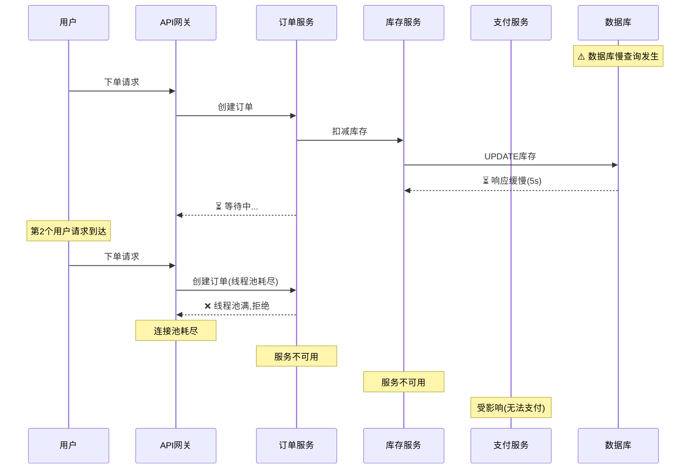
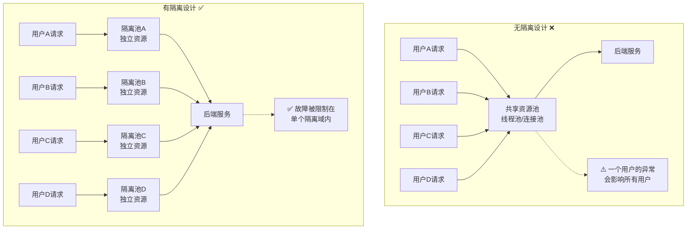
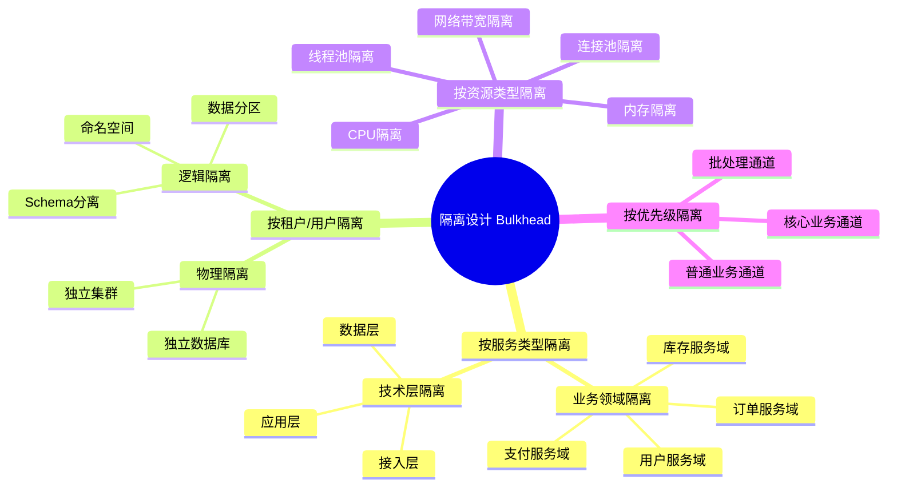
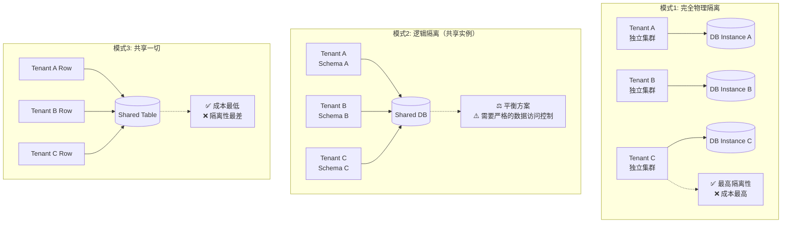
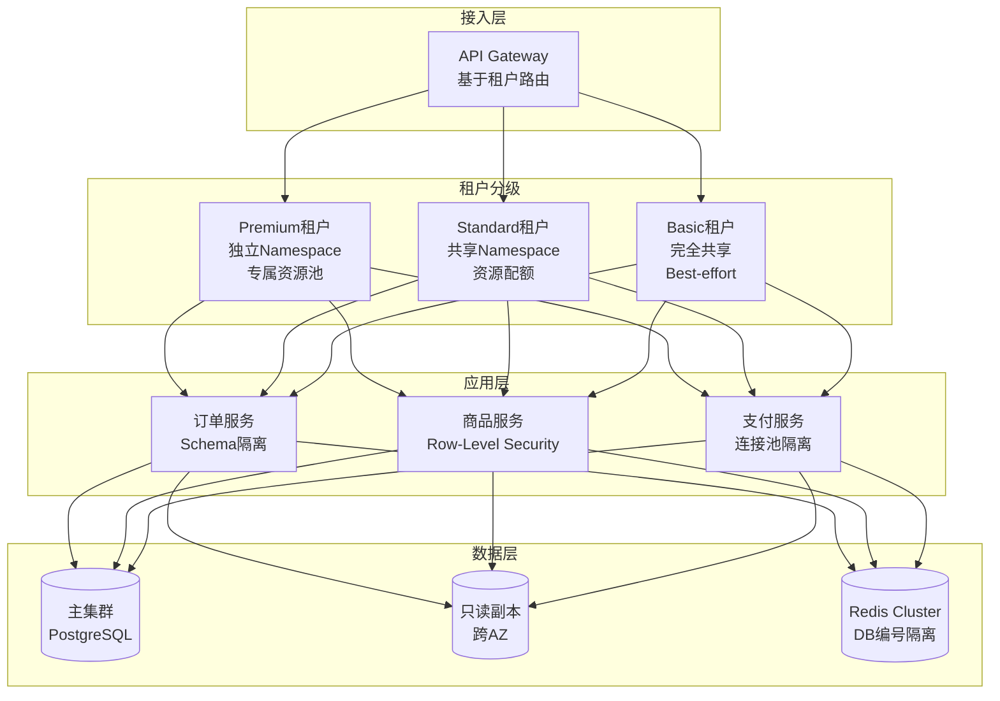
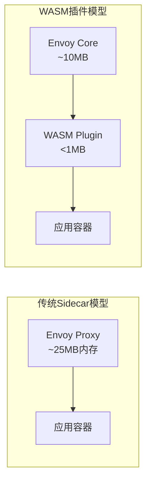

# 弹力设计篇之"隔离设计" - [2026重制版]

> **核心变更说明**：本文基于原极客时间专栏第42讲内容进行全面升级，更新至2026年技术栈。主要变更包括：
> - 补充Kubernetes Namespace/ResourceQuota隔离机制
> - 新增Service Mesh中的隔离策略（Istio DestinationRule）
> - 引入容器运行时隔离（gVisor、Kata Containers）
> - 更新多租户架构最佳实践
> - 添加真实故障案例分析

---

## 一、问题背景：为什么需要隔离设计

### 1.1 泰坦尼克号的教训

隔离设计（Bulkhead Pattern）的概念来源于造船业。船体被分隔成多个水密舱（Bulkheads），当某个舱室进水时，水不会蔓延到其他舱室，从而保证船只不会沉没。

**经典案例对比**：

| 船只 | 隔离设计 | 结果 |
|------|---------|------|
| **泰坦尼克号** (1912) | 有隔板但未延伸到完整高度 | 撞冰山后水漫过隔板，整船沉没 |
| **现代邮轮** | 完整的水密舱设计 | 即使多个舱室受损仍能保持浮力 |

这个历史教训告诉我们：**隔离设计的完整性至关重要，部分隔离等于没有隔离**。

### 1.2 分布式系统中的"多米诺骨牌效应"

在软件系统中，如果没有适当的隔离，一个服务的故障会像多米诺骨牌一样级联传播：



**真实故障案例**：

**案例1：2020年微服务雪崩事故**
- **场景**：某电商平台在大促期间
- **原因**：推荐服务响应变慢（从100ms→3s），导致调用方线程池耗尽
- **影响范围**：
  - 推荐服务 → 商品详情页 → 搜索服务 → 购物车 → 下单流程
  - 最终导致全站不可用约15分钟
- **损失估算**：约500万GMV损失

**案例2：Noisy Neighbor问题**
- **场景**：多租户SaaS平台
- **原因**：某个大客户发起大量数据导出任务
- **影响**：
  - CPU利用率飙升至95%
  - 其他租户的API响应时间从200ms→5s+
  - 数据库连接池被占满
- **解决方式**：实施资源配额和命名空间隔离

---

## 二、核心概念与架构图

### 2.1 隔离设计的核心思想



### 2.2 隔离的维度分类



---

## 三、技术实现细节

### 3.1 Kubernetes层面的隔离实现

#### 3.1.1 Namespace + ResourceQuota（命名空间隔离）

```yaml
# namespace-tenant-a.yaml
apiVersion: v1
kind: Namespace
metadata:
  name: tenant-a
  labels:
    purpose: production
    tenant: premium  # 高价值客户
---
# resource-quota-tenant-a.yaml
apiVersion: v1
kind: ResourceQuota
metadata:
  name: compute-quota
  namespace: tenant-a
spec:
  hard:
    requests.cpu: "20"
    requests.memory: 40Gi
    limits.cpu: "40"
    limits.memory: 80Gi
    persistentvolumeclaims: "10"
    pods: "50"
    services: "20"
    secrets: "100"
    configmaps: "100"
---
# limit-range-tenant-a.yaml
apiVersion: v1
kind: LimitRange
metadata:
  name: limit-range
  namespace: tenant-a
spec:
  limits:
  - default:  # 默认Limit
      cpu: 500m
      memory: 512Mi
    defaultRequest:  # 默认Request
      cpu: 100m
      memory: 128Mi
    max:  # 最大限制
      cpu: "2"
      memory: 2Gi
    min:  # 最小保证
      cpu: 50m
      memory: 64Mi
    type: Container
---
# network-policy-tenant-a.yaml
apiVersion: networking.k8s.io/v1
kind: NetworkPolicy
metadata:
  name: deny-all-ingress
  namespace: tenant-a
spec:
  podSelector: {}
  policyTypes:
  - Ingress
  ingress: []  # 默认拒绝所有入站流量
---
apiVersion: networking.k8s.io/v1
kind: NetworkPolicy
metadata:
  name: allow-same-namespace
  namespace: tenant-a
spec:
  podSelector: {}
  policyTypes:
  - Ingress
  ingress:
  - from:
    - podSelector: {}  # 允许同一Namespace内的Pod通信
```

#### 3.1.2 Pod PriorityClass（优先级隔离）

```yaml
# priority-class.yaml
apiVersion: scheduling.k8s.io/v1
kind: PriorityClass
metadata:
  name: high-priority
value: 1000000
globalDefault: false
description: "高优先级类 - 用于核心业务"
preemptionPolicy: PreemptLowerPriority
---
apiVersion: scheduling.k8s.io/v1
kind: PriorityClass
metadata:
  name: medium-priority
value: 100000
globalDefault: true
description: "中优先级类 - 用于普通业务"
---
apiVersion: scheduling.k8s.io/v1
kind: PriorityClass
metadata:
  name: low-priority
value: 1000
globalDefault: false
description: "低优先级类 - 用于批处理任务"
preemptionPolicy: Never  # 不抢占其他Pod
---
# 使用示例
apiVersion: apps/v1
kind: Deployment
metadata:
  name: payment-service-critical
spec:
  template:
    metadata:
      labels:
        app: payment-service
    spec:
      priorityClassName: high-priority  # 使用高优先级
      containers:
      - name: payment
        image: payment-service:v2.0
        resources:
          requests:
            cpu: 500m
            memory: 512Mi
          limits:
            cpu: "2"
            memory: 2Gi
```

#### 3.1.3 Topology Spread Constraints（拓扑约束）

确保Pod分布在不同节点/可用区，避免单点故障：

```yaml
apiVersion: apps/v1
kind: Deployment
metadata:
  name: order-service
spec:
  replicas: 6
  template:
    spec:
      topologySpreadConstraints:
      - maxSkew: 1  # 最大不均衡度为1
        topologyKey: kubernetes.io/hostname  # 按节点分布
        whenUnsatisfiable: DoNotSchedule  # 不满足时不调度
        labelSelector:
          matchLabels:
            app: order-service
      - maxSkew: 1
        topologyKey: topology.kubernetes.io/zone  # 按可用区分布
        whenUnsatisfiable: ScheduleAnyway  # 尽力而为
        labelSelector:
          matchLabels:
            app: order-service
      containers:
      - name: order
        image: order-service:v1.0
```

### 3.2 Service Mesh层面的隔离（Istio）

Istio提供了更细粒度的服务级别隔离能力：

```yaml
# istio-destination-rule-bulkhead.yaml
# 目标规则：定义连接池和异常检测
apiVersion: networking.istio.io/v1beta1
kind: DestinationRule
metadata:
  name: inventory-service-bulkhead
  namespace: production
spec:
  host: inventory-service
  trafficPolicy:
    connectionPool:
      tcp:
        maxConnections: 100       # TCP最大连接数
        connectTimeout: 2s        # 连接超时
        tcpKeepalive:
          time: 7200s            # Keepalive间隔
          interval: 75s
      http:
        http1MaxPendingRequests: 50   # HTTP1最大等待请求数
        http2MaxRequests: 1000        # HTTP2最大并发请求数
        idleTimeout: 300s             # 空闲超时
        requestTimeout: 10s           # 请求超时
        maxRequestsPerConnection: 10  # 每连接最大请求数
    outlierDetection:  # 异常实例检测（自动隔离故障实例）
      consecutive5xxErrors: 5         # 连续5个5xx错误
      interval: 30s                   # 检测间隔
      baseEjectionTime: 30s           # 基础驱逐时间
      maxEjectionPercent: 50          # 最大驱逐比例50%
      minHealthPercent: 50            # 最小健康实例比例50%
      consecutiveGatewayErrors: 5     # 连续网关错误数
      consecutiveLocalOriginFailure: 5 # 本地连续失败数
---
# istio-sidecar-resource.yaml
# Sidecar资源配置（控制Sidecar的资源使用）
apiVersion: networking.istio.io/v1beta1
kind: Sidecar
metadata:
  name: default
  namespace: production
spec:
  resources:
    requests:
      cpu: 100m
      memory: 128Mi
    limits:
      cpu: 200m
      memory: 256Mi
  workloadSelector:
    labels:
      app: payment-service
---
# istio-authorization-policy.yaml
# 授权策略：服务间访问控制
apiVersion: security.istio.io/v1beta1
kind: AuthorizationPolicy
metadata:
  name: allow-payment-to-inventory
  namespace: production
spec:
  selector:
    matchLabels:
      app: inventory-service
  action: ALLOW
  rules:
  - from:
    - source:
        principals: ["cluster.local/ns/production/sa/payment-service-account"]
    to:
    - operation:
        methods: ["GET", "POST"]
        paths: ["/api/inventory/*"]
```

### 3.3 应用层面的隔离实现（Resilience4j）

#### 3.3.1 信号量隔离（Semaphore Bulkhead）

```java
// Java代码示例：信号量隔离
@Service
public class InventoryService {

    private final BulkheadRegistry bulkheadRegistry;

    public InventoryService(BulkheadRegistry bulkheadRegistry) {
        this.bulkheadRegistry = bulkheadRegistry;
    }

    /**
     * 使用注解方式的信号量隔离
     * maxConcurrentCalls: 最大并发数
     * maxWaitDuration: 最大等待时间
     */
    @Bulkhead(name = "inventoryBackend", type = Bulkhead.Type.SEMAPHORE,
              fallbackMethod = "fallbackCheckInventory")
    public InventoryResult checkInventory(String productId) {
        // 调用库存后端服务
        return inventoryClient.checkStock(productId);
    }

    /**
     * 降级方法
     */
    public InventoryResult fallbackCheckInventory(String productId,
                                                  BulkheadFullException ex) {
        log.warn("Inventory service bulkhead full for product: {}", productId);
        // 返回缓存数据或默认值
        return InventoryResult.fromCache(productId);
    }
}
```

配置文件（application.yml）：
```yaml
resilience4j:
  bulkhead:
    instances:
      inventoryBackend:
        maxConcurrentCalls: 10        # 最大并发调用量
        maxWaitDuration: 0            # 0表示不等待，直接拒绝
        # maxWaitDuration: 100ms      # 或者设置等待时间
        writableStackTraceEnabled: false  # 生产环境关闭堆栈跟踪以提升性能
```

#### 3.3.2 线程池隔离（ThreadPool Bulkhead）

```java
/**
 * 线程池隔离示例
 * 适用场景：I/O密集型操作、可能阻塞的操作
 */
@Service
public class PaymentService {

    /**
     * 使用线程池隔离
     */
    @Bulkhead(name = "paymentProcessing", type = Bulkhead.Type.THREADPOOL,
              fallbackMethod = "fallbackProcessPayment")
    public CompletableFuture<PaymentResult> processPayment(PaymentRequest request) {
        // 这个操作会在独立的线程池中执行
        // 不会占用主线程池的资源
        return CompletableFuture.supplyAsync(() -> {
            return paymentGateway.charge(request);
        });
    }

    public CompletableFuture<PaymentResult> fallbackProcessPayment(
            PaymentRequest request, BulkheadFullException ex) {

        log.error("Payment processing thread pool exhausted");
        return CompletableFuture.completedFuture(
            PaymentResult.rejected("System busy, please try later")
        );
    }
}
```

配置文件：
```yaml
resilience4j:
  bulkhead:
    instances:
      paymentProcessing:
        maxConcurrentCalls: 20         # 线程池最大线程数
        maxWaitDuration: 100ms         # 最大等待时间
        keepAliveDuration: 20ms        # 空闲线程存活时间
```

### 3.4 多租户隔离架构

#### 3.4.1 三种多租户模式对比



#### 3.4.2 推荐的多租户架构（混合模式）

```yaml
# multi-tenant-architecture.yaml
# Kubernetes命名空间级别的租户隔离
apiVersion: v1
kind: Namespace
metadata:
  name: tenant-enterprise
  labels:
    tier: enterprise
    isolation-level: high
---
# 企业级租户：完全独立资源
apiVersion: v1
kind: ResourceQuota
metadata:
  name: enterprise-quota
  namespace: tenant-enterprise
spec:
  hard:
    requests.cpu: "50"
    requests.memory: 100Gi
    limits.cpu: "100"
    limits.memory: 200Gi
    pods: "200"
    persistentvolumeclaims: "50"
---
apiVersion: v1
kind: Namespace
metadata:
  name: tenant-standard
  labels:
    tier: standard
    isolation-level: medium
---
# 标准级租户：共享计算，独立存储
apiVersion: v1
kind: ResourceQuota
metadata:
  name: standard-resources
  namespace: tenant-standard
spec:
  hard:
    requests.cpu: "5"
    requests.memory: 10Gi
    limits.cpu: "20"
    limits.memory: 40Gi
    pods: "50"
```

数据库层面采用 Schema 隔离：

```sql
-- 为每个租户创建独立的Schema
CREATE SCHEMA IF NOT EXISTS tenant_enterprise_001;
CREATE SCHEMA IF NOT EXISTS tenant_standard_001;

-- 在应用层通过TenantContext动态切换Schema
```

Spring Boot + MyBatis插件示例：

```java
public class TenantInterceptor implements Interceptor {
    // 注：MyBatis插件需通过@Intercepts注解声明拦截点后注册，此处略

    @Override
    public Object intercept(Invocation invocation) throws Throwable {
        String tenantId = TenantContextHolder.getTenantId();
        if (tenantId != null) {
            StatementHandler handler = (StatementHandler) invocation.getTarget();
            MetaObject metaObject = SystemMetaObject.forObject(handler);
            BoundSql boundSql = handler.getBoundSql();
            String sql = boundSql.getSql();

            // 动态替换Schema
            sql = sql.replace("public.", tenantId + ".");
            Field field = boundSql.getClass().getDeclaredField("sql");
            field.setAccessible(true);
            field.set(boundSql, sql);
        }
        return invocation.proceed();
    }
}
```

---

## 四、方案对比表格

### 4.1 隔离策略对比表

| 隔离维度 | 实现方式 | 隔离粒度 | 性能开销 | 适用场景 |
|---------|---------|---------|---------|---------|
| **进程级** | 独立部署/容器 | 高 | 低 | 核心业务系统 |
| **线程池级** | Resilience4j ThreadPool | 中 | 中 | I/O阻塞型操作 |
| **信号量级** | Resilience4j Semaphore | 中 | 低 | 快速非阻塞操作 |
| **连接池级** | HikariCP配置 | 中 | 低 | 数据库访问 |
| **命名空间级** | K8s Namespace+Quota | 高 | 极低 | 多租户平台 |
| **网络策略级** | K8s NetworkPolicy/Istio | 高 | 低 | 安全隔离要求 |
| **数据库级** | Schema/Table分区 | 高 | 低 | 数据隔离需求 |
| **硬件级** | 独立VM/物理机 | 最高 | 高 | 金融/政府合规 |

### 4.2 主流隔离框架/工具对比

| 工具/技术 | 类型 | 语言绑定 | 隔离能力 | 学习成本 | 推荐场景 |
|----------|------|---------|---------|---------|---------|
| **Resilience4j Bulkhead** | 应用库 | Java/Kotlin | 线程池/信号量 | ⭐⭐ | Java微服务 |
| **Hystrix** (已停维) | 应用库 | Java | 线程池 | ⭐⭐ | ❌ 不推荐新项目 |
| **Sentinel** (Alibaba) | 应用库 | Java | 线程池/信号量/热点 | ⭐⭐⭐ | 阿里生态 |
| **Istio DestinationRule** | Service Mesh | 无 | 连接池/异常检测 | ⭐⭐⭐⭐ | 大规模微服务 |
| **Kubernetes ResourceQuota** | 平台层 | 无 | 资源配额 | ⭐⭐⭐ | 云原生应用 |
| **Kubernetes NetworkPolicy** | 平台层 | 无 | 网络隔离 | ⭐⭐⭐ | 安全敏感场景 |
| **gVisor** | 容器运行时 | 无 | 内核级隔离 | ⭐⭐⭐⭐⭐ | 多租户沙箱 |
| **Kata Containers** | 容器运行时 | 无 | 轻量虚拟机 | ⭐⭐⭐⭐ | 强安全隔离 |

---

## 五、实战案例（Case Study）

### 案例：电商平台的租户隔离改造

**背景**：
某SaaS电商平台服务于1000+商家，面临以下问题：
- 大促期间头部商家的流量占据80%资源
- 小商家经常遇到"系统繁忙"提示
- 数据泄露风险（商家能看到其他商家的数据）

**改造目标**：
1. 保证每个商家的SLA（99.9%可用性）
2. 防止Noisy Neighbor问题
3. 符合GDPR等数据隐私法规
4. 控制基础设施成本

**实施方案**：



**关键配置**：

```yaml
# premium-tenant-config.yaml
# Premium租户：独立Namespace + 专属资源
apiVersion: v1
kind: Namespace
metadata:
  name: tenant-premium-001
  labels:
    tenant-tier: premium
    sla-guarantee: "99.99"
---
apiVersion: v1
kind: ResourceQuota
metadata:
  name: premium-resources
  namespace: tenant-premium-001
spec:
  hard:
    cpu: "20"
    memory: 40Gi
    pods: "50"
    services.loadbalancers: "2"
---
# Standard租户：共享资源 + 配额限制
apiVersion: v1
kind: ResourceQuota
metadata:
  name: standard-resources
  namespace: default
spec:
  hard:
    cpu: "100"
    memory: 200Gi
    pods: "500"
```

**效果评估**：

| 指标 | 改造前 | 改造后 | 提升 |
|------|-------|--------|------|
| Premium租户P99延迟 | 800ms | 120ms | -85% |
| Standard租户可用性 | 99.5% | 99.9% | +0.4% |
| 资源利用率 | 60%（不均匀） | 85%（均匀） | +25% |
| 数据隔离合规性 | ❌ 不符合 | ✅ GDPR合规 | - |
| 运营成本 | $50k/月 | $45k/月 | -10% |

---

## 六、2026年最新实践

### 6.1 容器运行时隔离的新选择

随着安全要求的提高，传统的Docker容器隔离已不够用：

| 技术 | 隔离机制 | 性能损耗 | 启动时间 | 适用场景 |
|------|---------|---------|---------|---------|
| **runc** (Docker默认) | Linux Namespaces+CGroups | <1% | <1秒 | 一般工作负载 |
| **gVisor** (Google) | 用户态内核 | ~2-10% | <1秒 | 多租户、不可信代码 |
| **Kata Containers** | 轻量级VM | ~1-5% | ~3秒 | 强安全隔离 |
| **Firecracker** (AWS) | MicroVM | ~1-5% | ~125ms | Serverless/FaaS |
| **Nabla Containers** | Unikernel | ~5-15% | ~5秒 | 极致安全场景 |

**gVisor配置示例**：
```yaml
# gvisor-runtimeclass.yaml
apiVersion: node.k8s.io/v1
kind: RuntimeClass
metadata:
  name: gvisor
handler: runsc
---
# 使用gVisor运行不可信的工作负载
apiVersion: batch/v1
kind: Job
metadata:
  name: untrusted-job
  namespace: sandbox
spec:
  template:
    spec:
      runtimeClassName: gvisor  # 使用gVisor运行时
      containers:
      - name: untrusted-workload
        image: user-code:v1.0
        resources:
          limits:
            cpu: "1"
            memory: 1Gi
        securityContext:
          readOnlyRootFilesystem: true
          allowPrivilegeEscalation: false
          capabilities:
            drop:
            - ALL
      restartPolicy: Never
```

### 6.2 eBPF时代的网络隔离

eBPF（Extended Berkeley Packet Filter）正在革新网络隔离的实现方式：

**传统NetworkPolicy vs eBPF-based Policy**：

| 特性 | K8s NetworkPolicy (iptables) | eBPF-based (Cilium) |
|------|---------------------------|---------------------|
| 性能影响 | 规则多时显著下降 | 几乎零开销 |
| 可观测性 | 有限 | 原生支持 |
| L7协议感知 | 仅L3/L4 | HTTP/DNS/gRPC等 |
| 动态更新 | 需要重建iptables链 | 即时生效 |
| 复杂度 | 简单场景够用 | 功能强大但复杂度高 |

**Cilium网络策略示例**：
```yaml
# cilium-network-policy.yaml
apiVersion: cilium.io/v2
kind: CiliumNetworkPolicy
metadata:
  name: tenant-isolation
  namespace: production
specs:
  - endpointSelector:
      matchLabels:
        app: payment-service
    ingress:
    - fromEndpoints:
      - matchLabels:
          tenant: enterprise-001
      toPorts:
      - ports:
        - port: "8080"
          protocol: TCP
        rules:
          http:
            method: "POST"
            path: "/api/pay/*"
    egress:
    - toEndpoints:
      - matchLabels:
          app: database
      toPorts:
      - ports:
        - port: "5432"
          protocol: TCP
```

### 6.3 WebAssembly (WASM) 边缘隔离

WASM正在成为边缘计算和服务网格中轻量级隔离的首选：



**优势**：
- 内存占用降低70%+
- 插件热加载，无需重启代理
- 语言无关（Rust/Go/C++/AssemblyScript均可编译为WASM）
- 沙箱化执行，安全性更高

---

## 七、隔离设计的最佳实践清单

### 7.1 设计阶段检查清单

- [ ] 明确隔离边界：按业务域、租户、优先级划分
- [ ] 定义SLA/SLO：不同隔离域的服务等级目标
- [ ] 资源规划：为每个隔离域预留足够的资源buffer
- [ ] 故障场景分析：识别可能的级联故障路径
- [ ] 监控指标：每个隔离域独立的监控dashboard

### 7.2 实施阶段检查清单

- [ ] 从最关键的路径开始实施隔离
- [ ] 采用渐进式 rollout，先观察再推广
- [ ] 设置合理的阈值（避免过于激进或保守）
- [ ] 配置告警通知（资源使用率接近阈值时预警）
- [ ] 编写混沌工程测试验证隔离有效性

### 7.3 运维阶段检查清单

- [ ] 定期审查资源配额使用情况
- [ ] 监控跨隔离域的资源争抢情况
- [ ] 建立扩容/缩容的标准操作程序(SOP)
- [ ] 进行定期的故障演练（Chaos Testing）
- [ ] 收集并分析隔离失效的根本原因

---

## 八、常见陷阱与避坑指南

### 陷阱1：过度隔离

**症状**：创建了过多的隔离域，导致资源碎片化严重

**解决方案**：
- 遵循"二八原则"：20%的核心业务占用80%的资源保障
- 使用动态资源调度（如Volcano批调度器）提高利用率
- 定期合并低频使用的隔离域

### 陷阱2：隔离粒度不当

**症状**：要么太粗（起不到隔离作用），要么太细（管理复杂度爆炸）

**解决方案**：
- 从业务视角而非技术视角定义隔离边界
- 参考 Domain-Driven Design 的 Bounded Context 划分
- 保持每个隔离域内的服务数量在合理范围（建议5-15个）

### 陷阱3：忽略共享依赖

**症状**：虽然应用层做了隔离，但共享的MySQL/Redis成为瓶颈

**解决方案**：
- 对关键共享依赖也做容量隔离（如连接池配额）
- 考虑引入缓存层减少对后端的压力
- 重要租户可考虑专用的数据库实例

### 陷阱4：缺乏可观测性

**症状**：隔离域内发生问题时难以定位根因

**解决方案**：
- 每个隔离域必须有独立的Trace ID/Metrics维度
- 使用结构化日志包含租户ID/隔离域标识
- 设置跨隔离域的调用链追踪

---

## 九、延伸学习资源

### 官方文档

1. **Kubernetes Resource Management**
   - 文档：https://kubernetes.io/docs/concepts/policy/resource-quotas/
   - 重点：ResourceQuota、LimitRange、PriorityClass

2. **Istio Traffic Management**
   - 文档：https://istio.io/latest/docs/tasks/traffic-management/
   - 重点：DestinationRule、VirtualService、Sidecar

3. **Resilience4j Documentation**
   - 文档：https://resilience4j.readme.io/docs/bulkhead
   - 重点：Semaphore vs ThreadPool Bulkhead

4. **Cilium Documentation**
   - 文档：https://docs.cilium.io/en/stable/security/policy/
   - 重点：CiliumNetworkPolicy、Layer 7策略

5. **gVisor Documentation**
   - 文档：https://gvisor.dev/docs/
   - 重点：runsc runtime、security model

### 推荐阅读

1. **《Designing Data-Intensive Applications》** Chapter 9: Consistency and Consensus
2. **《Building Secure & Reliable Systems》** Google SRE团队著
3. **《Microservices Patterns》** Chapter 8: External API Deployment Patterns
4. **CNCF Cloud Native Security Whitepaper**

### 开源项目

1. **Open Policy Agent (OPA)**：https://www.openpolicyagent.org/ （通用策略引擎）
2. **Spiffe/Spire**：https://spiffe.io/ （身份认证框架）
3. **Kyverno**：https://kyverno.io/ （Kubernetes原生策略引擎）

---

## 十、总结

隔离设计是构建弹性分布式系统的基石。关键要点：

1. **核心理念**：借鉴造船业的舱壁设计，将故障限制在最小范围内
2. **分层实施**：从基础设施到应用层的多层次隔离策略
3. **工具选型**：
   - 云原生应用：优先使用K8s原生能力（Namespace/Quota/NetworkPolicy）
   - 微服务：结合Service Mesh（Istio）和应用库（Resilience4j）
   - 高安全场景：考虑gVisor/Kata等强隔离运行时
4. **平衡取舍**：隔离性与性能、成本之间的trade-off
5. **持续演进**：随着eBPF、WASM等新技术的发展，隔离手段会更加灵活高效

**记住**：完美的隔离是不存在的，目标是找到适合业务场景的"足够好"的隔离策略。正如分布式系统专家Sam Newman所说："Isolation is not about creating silos; it's about managing coupling."

---

**参考资料来源**：
- [Kubernetes Official Documentation](https://kubernetes.io/docs/)
- [Istio Documentation](https://istio.io/latest/docs/)
- [Resilience4j Documentation](https://resilience4j.readme.io/)
- [Cilium Documentation](https://docs.cilium.io/)
- [gVisor Documentation](https://gvisor.dev/)
- [CNCF Cloud Native Landscape](https://landscape.cncf.io/)
