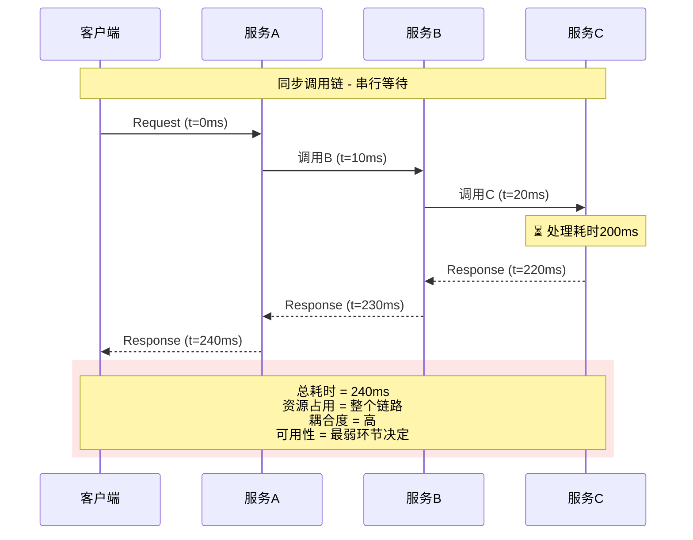
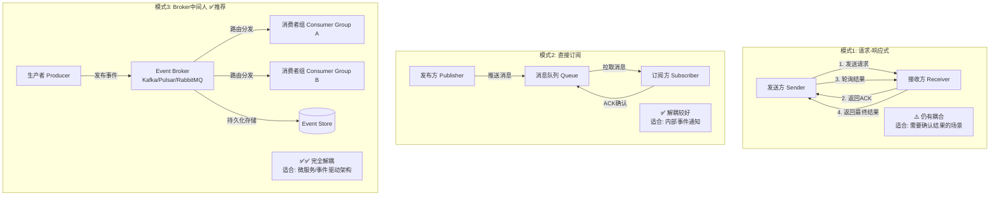
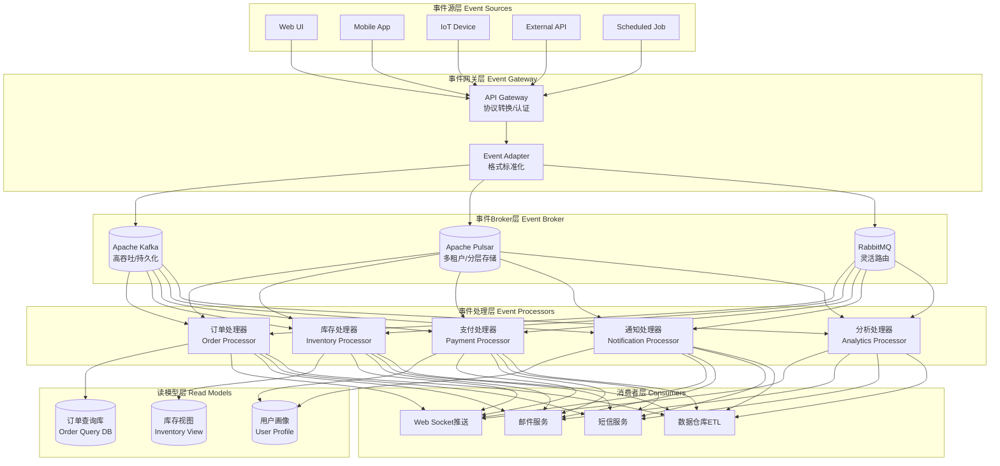
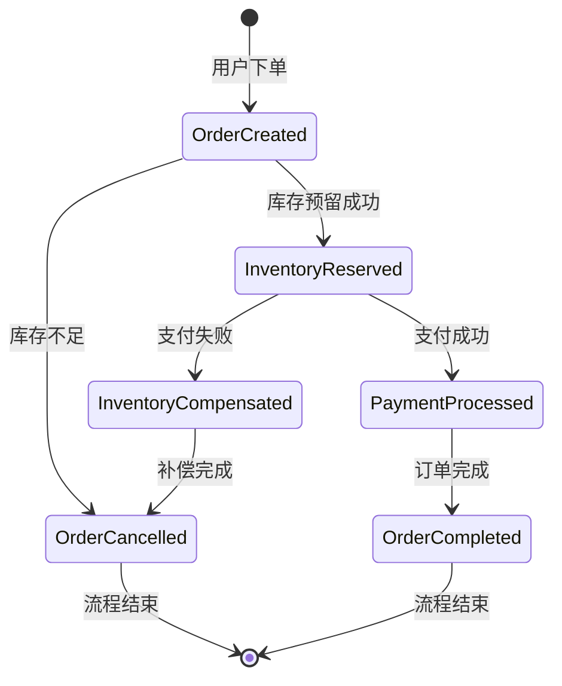
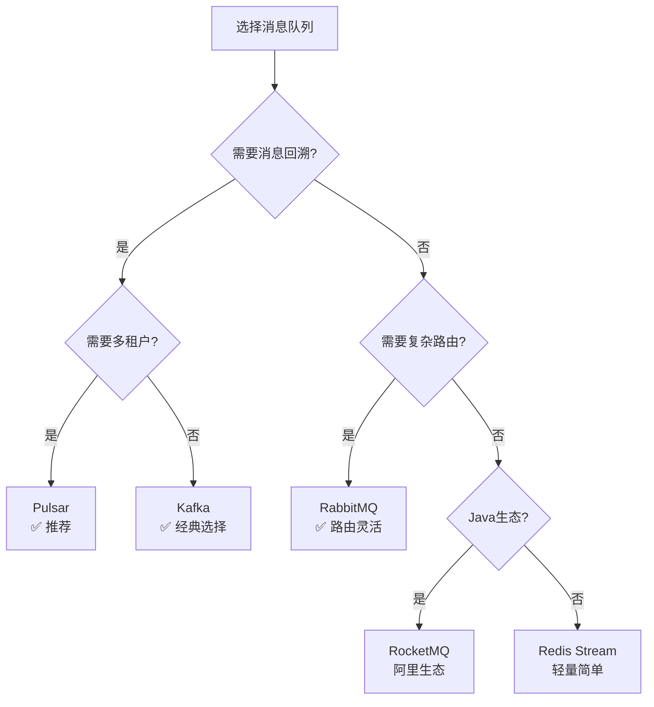
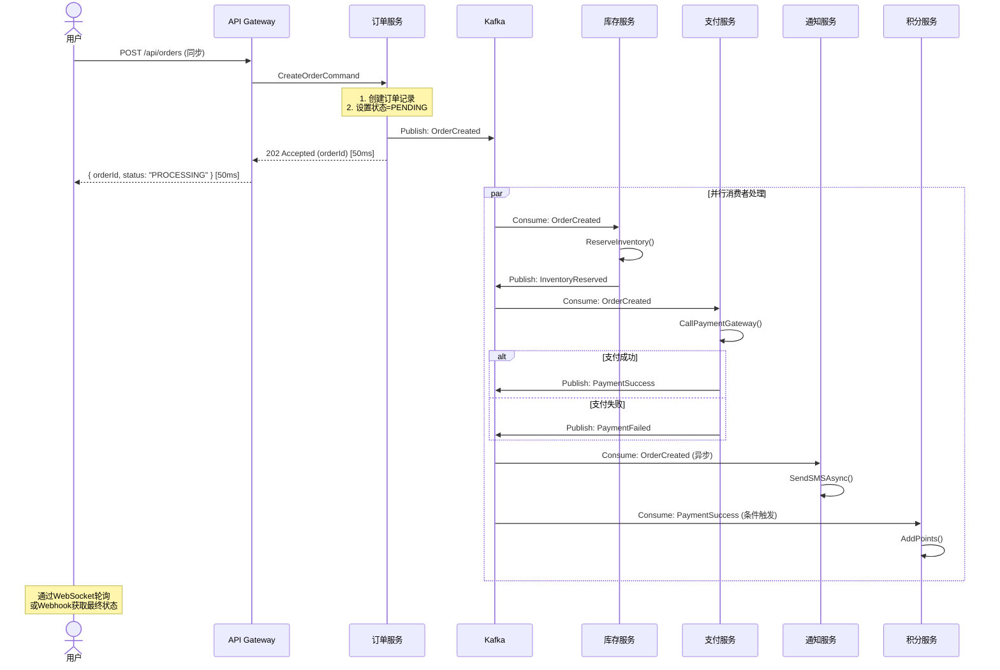

# 弹力设计篇之"异步通讯设计" - [2026重制版]

> **核心变更说明**：本文基于原极客时间专栏第43讲内容进行全面升级，更新至2026年技术栈。主要变更包括：
> - 补充现代消息队列对比（Kafka、Pulsar、RabbitMQ、RocketMQ）
> - 新增事件驱动架构（EDA）最佳实践
> - 引入CloudEvents标准和Schema Registry
> - 添加Kubernetes原生事件机制
> - 包含真实电商/金融场景案例

---

## 一、问题背景：为什么需要异步通讯

### 1.1 同步调用的四大痛点

在深入异步设计之前，让我们先理解同步调用的问题：



| 问题 | 描述 | 影响 |
|------|------|------|
| **性能瓶颈** | 整体响应时间 = 所有服务延迟之和 | 用户体验差，吞吐量低 |
| **资源浪费** | 调用方线程阻塞等待 | 线程池耗尽，连接池耗尽 |
| **级联故障** | 一个服务慢导致整条链路慢 | 雪崩效应 |
| **扩展困难** | 只能一对一调用 | 难以支持广播/扇出 |

### 1.2 真实故障案例

**案例：2019年某银行核心系统超时事故**
- **场景**：理财产品购买高峰期
- **原因**：
  1. 用户下单 → 同步调用风控系统（500ms）
  2. 风控通过 → 同步调用库存系统（300ms）
  3. 库存扣减 → 同步调用支付网关（1000ms）
  4. 支付成功 → 同步发送短信通知（200ms）
- **总延迟**：2000ms+，超过用户耐心阈值
- **后果**：
  - 大量用户重复点击（导致重复下单）
  - 线程池全部被阻塞
  - 新请求无法处理，系统"假死"
  - 最终损失约200万交易额

**教训**：非核心路径（如短信通知）不应阻塞主流程！

---

## 二、核心概念与架构图

### 2.1 异步通讯的三种模式



### 2.2 事件驱动架构（EDA）全景图



### 2.3 CloudEvents标准（CNCF）

为了实现不同系统间的事件互操作性，CNCF推出了CloudEvents规范：

```json
{
  "specversion": "1.0",
  "type": "com.example.order.created",
  "source": "/orders-service",
  "id": "A234-1234-1234",
  "time": "2026-06-06T12:00:00Z",
  "datacontenttype": "application/json",
  "subject": "order-12345",
  "data": {
    "orderId": "ORD-20260606-001",
    "userId": "USER-789",
    "items": [
      {"productId": "PROD-001", "quantity": 2, "price": 99.99}
    ],
    "totalAmount": 199.98,
    "currency": "CNY",
    "status": "CREATED"
  },
  "extensions": {
    "traceparent": "00-0af7651916cd43dd8448eb211c80319c-b7ad6b716920581d-01",
    "partitionkey": "USER-789"
  }
}
```

**关键属性说明**：

| 属性 | 必填 | 说明 |
|------|------|------|
| `specversion` | ✅ | 规范版本（字段值固定为"1.0"） |
| `type` | ✅ | 事件类型标识符 |
| `source` | ✅ | 事件来源（URI） |
| `id` | ✅ | 事件唯一ID |
| `time` | ❌ | 事件发生时间（ISO8601） |
| `datacontenttype` | ❌ | 数据内容类型（MIME type） |
| `subject` | ❌ | 事件主题/描述 |
| `data` | ❌ | 事件载荷（payload） |

---

## 三、技术实现细节

### 3.1 主流消息中间件对比（2026年版本）

| 特性 | Apache Kafka | Apache Pulsar | RabbitMQ | RocketMQ (Alibaba) |
|------|-------------|---------------|----------|-------------------|
| **架构模型** | 分区日志（Partitioned Log） | 分层存储（Tiered Storage） | 队列+交换机（Queue+Exchange） | Topic+Queue |
| **吞吐量** | 极高（百万级/秒） | 高（百万级/秒） | 中高（万级/秒） | 高（十万级/秒） |
| **延迟** | ms级（批处理优化后可达亚ms） | ms级 | μs级 | ms级 |
| **消息顺序** | 分区内有序 | 分区内有序 | 队列内有序 | 有序 |
| **消息回溯** | ✅ 基于offset | ✅ 基于cursor | ❌ | ✅ 基于时间戳 |
| **持久化** | 磁盘日志 | 分层存储（内存/SSD/HDD/S3） | 磁盘/内存 | 磁盘 |
| **多租户** | ⚠️ 需要外部方案 | ✅ 原生支持 | ⚠️ Vhost隔离 | ✅ 原生支持 |
| **生态成熟度** | ★★★★★ | ★★★★☆ | ★★★★★ | ★★★★☆ |
| **运维复杂度** | 高（需ZooKeeper/KRaft） | 中 | 低 | 中 |
| **适用场景** | 日志收集、流处理、事件溯源 | 多租户、大规模消息、IoT | 传统企业集成、复杂路由 | 金融、电商、物联网 |
| **云原生支持** | Confluent Cloud / Strimzi | StreamNative / Apache Pulsar Operator | RabbitMQ on Kubernetes | RocketMQ on Kubernetes |
| **社区活跃度** | 非常活跃 | 快速增长中 | 稳定 | 活跃（主要在中国） |

### 3.2 Kafka实战配置与代码示例

#### 3.2.1 生产者配置（Spring Boot + Kafka）

```yaml
# application.yml
spring:
  kafka:
    bootstrap-servers: kafka-0:9092,kafka-1:9092,kafka-2:9092
    producer:
      # 必须的可靠性配置
      acks: all                    # 等待所有ISR副本确认
      retries: 3                   # 重试次数
      retry-backoff-ms: 100        # 重试间隔
      max-in-flight-requests-per-connection: 5  # 控制重试顺序性
      
      # 性能优化
      batch-size: 16384            # 批次大小（16KB）
      linger-ms: 5                 # 等待更多消息组成批次
      buffer-memory: 33554432      # 缓冲区大小（32MB）
      compression-type: lz4       # 压缩算法
      
      # 序列化
      key-serializer: org.apache.kafka.common.serialization.StringSerializer
      value-serializer: io.confluent.kafka.serializers.KafkaAvroSerializer
      
      # Schema Registry
      schema.registry.url: http://schema-registry:8081
      auto-register-schemas: true
      
    consumer:
      group-id: order-service-group
      auto-offset-reset: earliest     # 最早未消费的消息
      enable-auto-commit: false       # 手动提交offset（确保精确一次）
      max-poll-records: 500           # 每次最大拉取数量
      session-timeout-ms: 30000       # 会话超时
      heartbeat-interval-ms: 10000    # 心跳间隔
      isolation-level: read_committed # 读取已提交的事务消息
      
      # 反序列化
      key-deserializer: org.apache.kafka.common.serialization.StringDeserializer
      value-deserializer: io.confluent.kafka.serializers.KafkaAvroDeserializer
      schema.registry.url: http://schema-registry:8081
      
      # 并发控制
      concurrency: 4                  # 并发消费者数量
      
    listener:
      ack-mode: MANUAL_IMMEDIATE      # 手动立即确认
      missing-topics-fatal: false     # topic不存在时不报错
```

#### 3.2.2 事件发布代码示例

```java
@Service
@RequiredArgsConstructor
@Slf4j
public class OrderEventPublisher {

    private final KafkaTemplate<String, OrderCreatedEvent> kafkaTemplate;
    private final ApplicationEventPublisher applicationEventPublisher;

    /**
     * 发布订单创建事件
     * 使用事务确保本地操作和消息发布的原子性
     */
    @Transactional
    public void publishOrderCreated(Order order) {
        // 1. 构建CloudEvents标准事件
        OrderCreatedEvent event = OrderCreatedEvent.builder()
            .specVersion("1.0")
            .type("com.ecommerce.order.created")
            .source("/order-service")
            .id(UUID.randomUUID().toString())
            .time(Instant.now())
            .subject(order.getId())
            .data(OrderEventData.from(order))
            .extension("traceId", MDC.get("traceId"))
            .build();

        // 2. 发送到Kafka（使用事务）
        try {
            kafkaTemplate.executeInTransaction(operations -> {
                operations.send(
                    "order-events",                          // topic名称
                    order.getUserId(),                        // partition key（按用户分区）
                    event                                     // 事件对象
                ).addCallback(
                    result -> log.info("Event sent: offset={}", 
                                      result.getRecordMetadata().offset()),
                    failure -> log.error("Failed to send event", failure)
                );
                return true;
            });
            
            // 3. 发布本地Spring事件（用于同步处理或缓存更新）
            applicationEventPublisher.publishEvent(
                new OrderCreatedLocalEvent(order.getId())
            );
            
        } catch (Exception e) {
            log.error("Failed to publish order created event for order: {}", 
                      order.getId(), e);
            throw new EventPublishException("Failed to publish event", e);
        }
    }
}

// Avro Schema定义（OrderCreatedEvent.avsc）
/*
{
  "type": "record",
  "name": "OrderCreatedEvent",
  "namespace": "com.ecommerce.event.order",
  "fields": [
    {"name": "orderId", "type": "string"},
    {"name": "userId", "type": "string"},
    {"name": "items", "type": {
      "type": "array",
      "items": {
        "type": "record",
        "name": "OrderItem",
        "fields": [
          {"name": "productId", "type": "string"},
          {"name": "quantity", "type": "int"},
          {"name": "unitPrice", "type": "double"}
        ]
      }
    }},
    {"name": "totalAmount", "type": "double"},
    {"name": "currency", "type": "string"},
    {"name": "createdAt", "type": "long", "logicalType": "timestamp-millis"}
  ]
}
*/
```

#### 3.2.3 事件消费者代码示例

```java
@Service
@Slf4j
@RequiredArgsConstructor
public class OrderEventConsumer {

    private final InventoryService inventoryService;
    private final PaymentService paymentService;
    private final NotificationService notificationService;
    private final OrderEventRepository orderEventRepository;

    /**
     * 消费订单创建事件
     * 使用幂等性设计防止重复消费
     */
    @KafkaListener(
        topics = "order-events",
        groupId = "inventory-service-group",
        containerFactory = "kafkaListenerContainerFactory"
    )
    public void handleOrderCreated(
            @Payload OrderCreatedEvent event,
            @Headers Map<String, Object> headers,
            Acknowledgment acknowledgment) {

        String eventId = event.getId();
        
        try {
            // 1. 幂等性检查：避免重复处理
            if (orderEventRepository.existsByEventId(eventId)) {
                log.info("Event already processed, skipping: {}", eventId);
                acknowledgment.acknowledge();
                return;
            }

            // 2. 记录事件接收（用于追踪和对账）
            orderEventRepository.save(OrderEventRecord.received(event));

            // 3. 业务处理：扣减库存
            inventoryService.reserveStock(
                event.getData().getOrderId(),
                event.getData().getItems()
            );

            // 4. 标记事件已处理
            orderEventRepository.markAsProcessed(eventId);

            // 5. 手动确认消息
            acknowledgment.acknowledge();
            
            log.info("Successfully processed order created event: {}", eventId);
            
        } catch (InsufficientStockException e) {
            // 库存不足：记录失败但不确认消息（触发重试）
            log.error("Insufficient stock for order: {}", 
                     event.getData().getOrderId(), e);
            throw new RetryableException(e);  // 抛出异常触发重试
            
        } catch (Exception e) {
            // 其他错误：记录到死信队列
            log.error("Failed to process event: {}", eventId, e);
            sendToDeadLetterQueue(event, headers, e);
            acknowledgment.acknowledge();  // 确认消息，避免无限重试
        }
    }

    /**
     * 发送到死信队列（DLQ）
     */
    private void sendToDeadLetterQueue(
            OrderCreatedEvent event, 
            Map<String, Object> headers,
            Exception error) {
        
        DeadLetterEntry deadLetter = DeadLetterEntry.builder()
            .originalTopic("order-events")
            .event(event)
            .headers(headers)
            .errorClass(error.getClass().getName())
            .errorMessage(error.getMessage())
            .stackTrace(ExceptionUtils.getStackTrace(error))
            .failedAt(Instant.now())
            .retryCount(0)
            .build();
            
        deadLetterRepository.save(deadLetter);
        log.warn("Sent to dead letter queue: {}", event.getId());
    }
}
```

### 3.3 Kafka集群部署配置（Kubernetes）

```yaml
# kafka-cluster.yaml (使用Strimzi Operator)
apiVersion: kafka.strimzi.io/v1beta2
kind: Kafka
metadata:
  name: my-cluster
  namespace: messaging
spec:
  kafka:
    version: 3.9.0
    replicas: 3
    listeners:
      - name: plain
        port: 9092
        type: internal
        tls: false
      - name: tls
        port: 9093
        type: internal
        tls: true
    config:
      offsets.topic.replication.factor: 3
      transaction.state.log.replication.factor: 3
      transaction.state.log.min.isr: 2
      default.replication.factor: 3
      min.insync.replicas: 2
      log.retention.hours: 168          # 保留7天
      log.segment.bytes: 1073741824     # 1GB per segment
      log.retention.check.interval.ms: 300000  # 5分钟检查一次
      num.partitions: 10               # 默认分区数
      auto.create.topics.enable: false  # 禁止自动创建topic（安全考虑）
      message.max.bytes: 10485760       # 单条消息最大10MB
    storage:
      type: jbod
      volumes:
      - id: 0
        type: persistent-claim
        size: 100Gi
        class: standard              # StorageClass
        deleteClaim: false
    resources:
      requests:
        cpu: "2"
        memory: 4Gi
      limits:
        cpu: "4"
        memory: 8Gi
    jvmOptions:
      -Xms: 2g
      -Xmx: 4g
    rack:
      topologyKey: topology.kubernetes.io/zone  # 跨可用区分布
    # KRaft模式：Kafka 3.3+生产可用，Kafka 4.0（2025-03发布）起完全移除ZooKeeper
  entityOperator:
    topicOperator: {}
    userOperator: {}
---
# 创建订单事件topic（带多分区和副本）
apiVersion: kafka.strimzi.io/v1beta2
kind: KafkaTopic
metadata:
  name: order-events
  namespace: messaging
  labels:
    strimzi.io/cluster: my-cluster
spec:
  partitions: 12                    # 12个分区（支持并行消费）
  replication-factor: 3             # 3副本（高可用）
  config:
    retention.ms: 604800000         # 保留7天
    segment.bytes: 1073741824       # 1GB per segment
    cleanup.policy: delete          # 过期删除
    compression.type: producer     # 使用生产者指定的压缩算法
    min.insync.replicas: 2          # 至少2个副本写入成功才确认
---
# Schema Registry配置（Confluent或Apicurio）
apiVersion: apps/v1
kind: Deployment
metadata:
  name: schema-registry
  namespace: messaging
spec:
  replicas: 3
  selector:
    matchLabels:
      app: schema-registry
  template:
    metadata:
      labels:
        app: schema-registry
    spec:
      containers:
      - name: schema-registry
        image: confluentinc/cp-schema-registry:7.5.0
        ports:
        - containerPort: 8081
        env:
        - name: SCHEMA_REGISTRY_KAFKASTORE_BOOTSTRAP_SERVERS
          value: "my-cluster-kafka-bootstrap:9092"
        - name: SCHEMA_REGISTRY_HOST_NAME
          value: schema-registry
        - name: SCHEMA_REGISTRY_LOG_LEVEL
          value: INFO
        resources:
          requests:
            cpu: 500m
            memory: 1Gi
          limits:
            cpu: "1"
            memory: 2Gi
---
apiVersion: v1
kind: Service
metadata:
  name: schema-registry
  namespace: messaging
spec:
  selector:
    app: schema-registry
  ports:
  - port: 8081
    targetPort: 8081
  type: ClusterIP
```

### 3.4 事件驱动架构中的 Saga 模式

对于跨服务的分布式事务，Saga模式是最佳实践之一：



**Saga协调器代码示例**：

```java
@Service
@Slf4j
@RequiredArgsConstructor
public class OrderSagaOrchestrator {

    private final KafkaTemplate<String, SagaEvent> kafkaTemplate;
    private final SagaStateRepository sagaStateRepository;

    /**
     * 启动订单Saga流程
     */
    public void startOrderSaga(Order order) {
        String sagaId = UUID.randomUUID().toString();
        
        // 初始化Saga状态
        sagaStateRepository.save(SagaState.builder()
            .sagaId(sagaId)
            .order(order)
            .currentStep(SagaStep.ORDER_CREATED)
            .status(SagaStatus.STARTED)
            .startedAt(Instant.now())
            .build());

        // 发布第一个步骤事件
        publishSagaEvent(sagaId, SagaEventType.RESERVE_INVENTORY, order);
    }

    /**
     * 处理Saga步骤完成事件
     */
    @KafkaListener(topics = "saga-reply-events", groupId = "saga-orchestrator")
    public void handleStepCompleted(SagaReplyEvent reply) {
        SagaState state = sagaStateRepository.findBySagaId(reply.getSagaId())
            .orElseThrow(() -> new SagaNotFoundException(reply.getSagaId()));

        switch (reply.getStep()) {
            case RESERVE_INVENTORY:
                if (reply.isSuccess()) {
                    state.setCurrentStep(SagaStep.INVENTORY_RESERVED);
                    publishSagaEvent(state.getSagaId(), SagaEventType.PROCESS_PAYMENT, state.getOrder());
                } else {
                    // 库存不足，取消订单
                    state.setStatus(SagaStatus.COMPENSATING);
                    publishSagaEvent(state.getSagaId(), SagaEventType.CANCEL_ORDER, state.getOrder());
                }
                break;

            case PROCESS_PAYMENT:
                if (reply.isSuccess()) {
                    state.setCurrentStep(SagaStep.PAYMENT_PROCESSED);
                    publishSagaEvent(state.getSagaId(), SagaEventType.CONFIRM_ORDER, state.getOrder());
                } else {
                    // 支付失败，补偿库存
                    state.setStatus(SagaStatus.COMPENSATING);
                    publishCompensationEvent(state.getSagaId(), CompensationType.RELEASE_INVENTORY, state.getOrder());
                }
                break;

            case CONFIRM_ORDER:
                state.setStatus(SagaStatus.COMPLETED);
                state.setCompletedAt(Instant.now());
                log.info("Saga completed successfully: {}", state.getSagaId());
                break;

            case COMPENSATION_COMPLETED:
                state.setStatus(SagaStatus.COMPENSATED);
                log.info("Saga compensated successfully: {}", state.getSagaId());
                break;
        }

        sagaStateRepository.save(state);
    }

    private void publishSagaEvent(String sagaId, SagaEventType eventType, Order order) {
        SagaEvent event = SagaEvent.builder()
            .sagaId(sagaId)
            .eventType(eventType)
            .payload(order)
            .timestamp(Instant.now())
            .build();
            
        kafkaTemplate.send("saga-command-events", sagaId, event);
    }
}
```

---

## 四、方案对比表格

### 4.1 异步通讯模式对比

| 维度 | 同步调用（REST/gRPC） | 异步消息队列 | 事件流（Kafka Streams） | gRPC Streaming |
|------|---------------------|-------------|----------------------|----------------|
| **耦合度** | 高（强依赖） | 低（松耦合） | 极低（完全解耦） | 中（长连接） |
| **实时性** | 高（即时响应） | 中（毫秒~秒级） | 可配置（ms~min） | 高（双向实时） |
| **可靠性** | 取决于网络 | 高（持久化+重试） | 极高（WAL+复制） | 中（需应用层保障） |
| **吞吐量** | 受限于连接数 | 高 | 极高 | 中高 |
| **背压支持** | ❌ | ✅（队列缓冲） | ✅（原生支持） | ✅（流控） |
| **消息回溯** | ❌ | 部分（RabbitMQ不支持） | ✅ | ❌ |
| **适用场景** | 简单CRUD | 解耦/削峰/可靠传输 | 事件溯源/流处理 | 实时通信/AI推理流 |

### 4.2 消息队列选型决策树



---

## 五、实战案例（Case Study）

### 案例：电商平台从同步到异步的演进

**背景**：
某电商平台原有下单流程为完全同步调用，大促期间经常出现超时和系统假死。

**改造前流程（同步）**：
```
用户下单 → 创建订单(50ms) → 扣减库存(30ms) → 支付(1000ms) → 发送短信(200ms) → 积分奖励(20ms) → 返回结果
总耗时: ~1300ms
```

**改造后流程（异步事件驱动）**：


**关键技术决策**：

| 决策点 | 选择 | 原因 |
|--------|------|------|
| 消息队列 | Kafka | 高吞吐、消息回溯、生态成熟 |
| 序列化格式 | Avro + Schema Registry | 强类型、向前兼容、压缩率高 |
| 事务保证 | Kafka Transactions | 精确一次语义 |
| 幂等性 | 事件ID去重表 | 防止重复消费 |
| 最终一致性 | Saga编排器 | 协调多步骤业务流程 |
| 监控追踪 | OpenTelemetry + Jaeger | 全链路可观测 |

**效果对比**：

| 指标 | 改造前（同步） | 改造后（异步） | 提升 |
|------|--------------|--------------|------|
| 下单接口P99延迟 | 1300ms | 50ms | -96% |
| 系统吞吐量（QPS） | 500 | 50000 | +9900% |
| 可用性（SLA） | 99.5% | 99.99% | +0.49% |
| 数据一致性 | 强一致 | 最终一致（<1秒） | 可接受 |
| 扩展能力 | 差（单点瓶颈） | 好（水平扩展） | 显著提升 |
| 开发复杂度 | 低 | 中高 | 需要学习曲线 |

---

## 六、2026年最新趋势与实践

### 6.1 Serverless事件驱动（AWS Lambda / Knative Eventing）

```yaml
# knative-eventing-source.yaml
# 使用Knative Eventing构建Serverless事件驱动架构
apiVersion: sources.knative.dev/v1
kind: ApiServerSource
metadata:
  name: order-events-source
  namespace: production
spec:
  serviceAccountName: events-sa
  mode: Resource
  resources:
  - apiVersion: v1
    kind: Event
  sink:
    ref:
      apiVersion: eventing.knative.dev/v1
      kind: Broker
      name: default
---
apiVersion: eventing.knative.dev/v1
kind: Trigger
metadata:
  name: inventory-trigger
  namespace: production
spec:
  broker: default
  filter:
    attributes:
      type: com.ecommerce.order.created
  subscriber:
    ref:
      apiVersion: serving.knative.dev/v1
      kind: Service
      name: inventory-handler
---
apiVersion: serving.knative.dev/v1
kind: Service
metadata:
  name: inventory-handler
  namespace: production
spec:
  template:
    metadata:
      annotations:
        autoscaling.knative.dev/minScale: "0"   # 允许缩容到0
        autoscaling.knative.dev/maxScale: "100" # 最大100个实例
        autoscaling.knative.dev/target: "10"   # 目标并发数
    spec:
      containers:
      - image: inventory-handler:v2.0
        env:
        - name: KAFKA_BROKERS
          value: "my-cluster-kafka-bootstrap:9092"
        resources:
          requests:
            cpu: 100m
            memory: 128Mi
```

### 6.2 流式数据库（Streaming Database）

传统数据库正在融合流处理能力：

| 产品 | 特点 | 适用场景 |
|------|------|---------|
| **RisingWave** | PostgreSQL兼容的流数据库 | 实时分析、CDC |
| **Materialize** | SQL-on-streams | 实时BI、欺诈检测 |
| **PipelineDB** (团队已并入Confluent) | 时序+流处理 | IoT监控 |
| **ksqlDB** (Confluent) | Kafka上的SQL接口 | Kafka生态系统 |

**RisingWave示例**：
```sql
-- 实时计算每个商品的销售额（持续查询）
CREATE MATERIALIZED VIEW product_sales AS
SELECT
    window_start(product_created_at, INTERVAL '1 MINUTE') AS minute,
    product_id,
    COUNT(*) AS order_count,
    SUM(total_amount) AS total_revenue,
    AVG(total_amount) AS avg_order_value
FROM order_events  -- 直接订阅Kafka topic
WHERE event_type = 'ORDER_CREATED'
GROUP BY
    window_start(product_created_at, INTERVAL '1 MINUTE'),
    product_id;

-- 结果可以像普通表一样查询
SELECT * FROM product_sales WHERE minute > NOW() - INTERVAL '5 MINUTES';
```

### 6.3 WebAssembly (WASM) 在消息处理中的应用

WASM正成为消息处理函数的新运行时：

```rust
// Rust编写的WASM消息处理函数
use wasm_bindgen::prelude::*;
use serde::{Deserialize, Serialize};

#[derive(Serialize, Deserialize)]
struct OrderEvent {
    order_id: String,
    user_id: String,
    total_amount: f64,
}

#[wasm_bindgen]
pub fn process_order_event(event_json: &str) -> String {
    // 解析输入事件
    let event: OrderEvent = serde_json::from_str(event_json).unwrap();
    
    // 业务逻辑：判断是否为VIP用户的大额订单
    let is_priority = event.total_amount > 1000.0;
    
    // 输出路由决策
    let routing_decision = serde_json::json!({
        "target_queue": if is_priority { "priority-processing" } else { "normal-processing" },
        "priority": if is_priority { "high" } else { "normal" },
        "requires_approval": is_priority && event.total_amount > 5000.0
    });
    
    routing_decision.to_string()
}
```

**优势**：
- **安全性**：沙箱执行，限制资源访问
- **便携性**：Write Once, Run Anywhere
- **冷启动快**：比容器快10-100倍
- **语言无关**：Rust/Go/C++/AssemblyScript等

---

## 七、异步通讯设计的最佳实践

### 7.1 设计原则

1. **单一职责原则**：一个事件只包含一种业务含义
2. **事件命名规范**：`{Domain}.{Entity}.{Action}` 如 `order.payment.completed`
3. **版本管理**：事件Schema必须向后兼容（Avro/Protobuf原生支持）
4. **不可变性**：事件一旦发布不应修改（如需更正发布新事件）
5. **幂等性**：消费者必须能够安全地处理重复事件

### 7.2 运维检查清单

- [ ] 消息积压监控（Consumer Lag告警）
- [ ] 死信队列（DLQ）定期审查
- [ ] Schema变更审计日志
- [ ] 消费者重启/扩容预案
- [ ] 跨数据中心复制策略验证
- [ ] 消息加密和访问控制（ACL）
- [ ] 成本优化（存储层级调整）

### 7.3 反模式（Anti-Patterns）

| 反模式 | 问题 | 解决方案 |
|--------|------|---------|
| **过度使用异步** | 简单CRUD也走消息队列，增加复杂度 | 仅在真正需要解耦/削峰时使用 |
| **忽略消息顺序** | 需要顺序处理的逻辑出错 | 使用分区键保证有序性 |
| **不处理死信** | 异常消息堆积导致消费停滞 | 建立DLQ处理流程和告警 |
| **缺乏监控** | 消息丢失或延迟无法发现 | 建立完善的可观测性体系 |
| **Schema硬编码** | 版本升级导致兼容性问题 | 使用Schema Registry管理 |

---

## 八、延伸学习资源

### 官方文档

1. **Apache Kafka官方文档**
   - 网站：https://kafka.apache.org/documentation/
   - 重点：Producer/Consumer配置、Exactly-Once语义、Kafka Streams

2. **Apache Pulsar官方文档**
   - 网站：https://pulsar.apache.org/docs/
   - 重点：Multi-tenancy、Tiered Storage、Functions

3. **Confluent Platform文档**
   - 网站：https://docs.confluent.io/
   - 重点：Schema Registry、Kafka Connect、ksqlDB

4. **CloudEvents Specification**
   - 网站：https://cloudevents.io/
   - CNCF标准，所有主流云厂商支持

5. **Strimzi (Kafka on Kubernetes)**
   - 网站：https://strimzi.io/documentation/
   - 重点：KafkaOperator、KafkaTopic、KafkaUser CRD

### 推荐书籍

1. **《Designing Event-Driven Systems》** - Ben Stopford
   - ISBN: 978-1492036895
   - Kafka作者团队出品，事件驱动架构权威指南

2. **《Distributed Systems for Fun and Profit》** - Mikito Takada
   - 在线免费：https://book.mixu.net/distsys/
   - 分布式系统基础理论

3. **《Building Microservices》2nd Edition** - Sam Newman
   - 第4章：Event-Driven Architecture

4. **《Making Sense of Stream Processing》** - Martin Kleppmann
   - 在线免费文章，流处理入门必读

### 开源项目

1. **Apache Flink**：https://flink.apache.org/ （流处理框架）
2. **Apache Spark Structured Streaming**：https://spark.apache.org/streaming/
3. **Debezium**：https://debezium.io/ （CDC数据变更捕获）
4. **Temporal.io**：https://temporal.io/ （工作流引擎）
5. **Camunda**：https://camunda.com/ （BPMN工作流）

---

## 九、总结

异步通讯设计是构建高性能、高可用分布式系统的关键技术。本文的核心要点：

1. **核心理念**：通过消息解耦实现服务间的松耦合，提高系统的弹性和吞吐量
2. **技术选型**：
   - 高吞吐/日志场景：**Kafka**（首选）
   - 多租户/IoT场景：**Pulsar**（推荐）
   - 企业集成/复杂路由：**RabbitMQ**（经典）
3. **实施要点**：
   - 采用**CloudEvents**标准统一事件格式
   - 使用**Schema Registry**管理事件契约
   - 实现**幂等消费**防止数据不一致
   - 建立**死信队列**处理异常消息
4. **架构模式**：
   - **Event Choreography**（协同）：适合简单流程
   - **Saga Orchestration**（编排）：适合复杂业务流程
5. **未来趋势**：
   - Serverless事件驱动（Knative Eventing）
   - 流式数据库（RisingWave/Materialize）
   - WASM消息处理函数

**记住**：异步不是银弹，它带来了最终一致性、调试复杂性等新挑战。正确的做法是根据业务需求合理选择同步/异步混合架构，而非一味追求全面异步化。

---

**参考资料来源**：
- [Apache Kafka Official Documentation](https://kafka.apache.org/documentation/)
- [Apache Pulsar Documentation](https://pulsar.apache.org/docs/)
- [CloudEvents Specification](https://cloudevents.io/)
- [Strimzi - Apache Kafka on Kubernetes](https://strimzi.io/)
- [Confluent Documentation](https://docs.confluent.io/)
- [CNCF Cloud Native Landscape](https://landscape.cncf.io/)
- [Knative Eventing Documentation](https://knative.dev/docs/eventing/)
