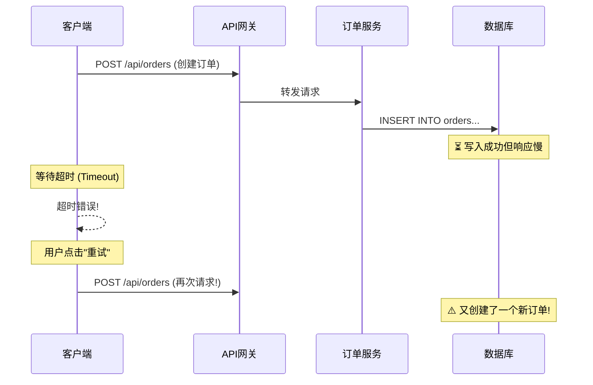
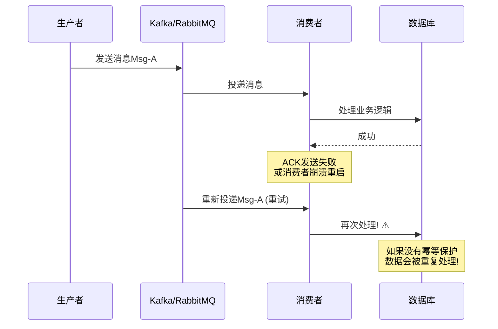
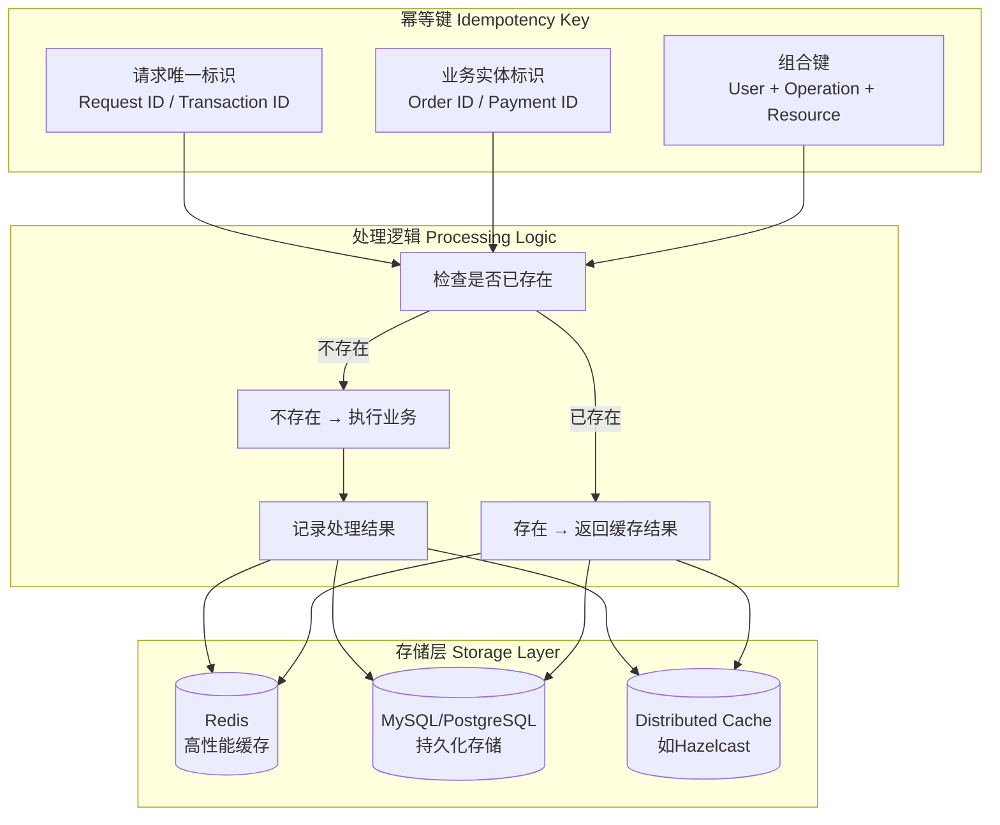
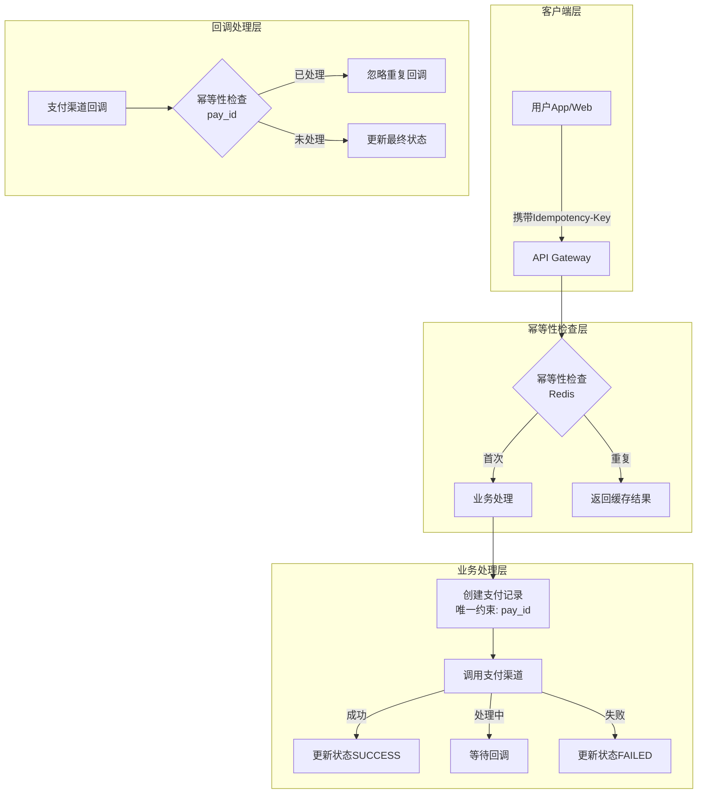

# 弹力设计篇之"幂等性设计" - [2026重制版]

> **核心变更说明**：本文基于原极客时间专栏第44讲内容进行全面升级，更新至2026年技术栈。主要变更包括：
> - 补充全局唯一ID生成算法对比（Snowflake、ULID、UUID v7）
> - 新增分布式幂等性实现方案（Redis、数据库）
> - 引入HTTP幂等性最佳实践（RFC 9110）
> - 添加支付/订单场景的完整代码示例
> - 包含常见陷阱和避坑指南

---

## 一、问题背景：为什么需要幂等性

### 1.1 什么是幂等性

**数学定义**：在数学中，若运算符 f 满足 `f(x) = f(f(x))`，则称 f 具有幂等性。

**分布式系统中的定义**：对同一操作的多次执行所产生的结果，与单次执行的结果相同。

$$Idempotent(f, x) \Rightarrow f(x) = f(f(x)) = f^n(x), \forall n \geq 1$$

**通俗理解**：
- ✅ **幂等操作**：设置用户名为"张三"，无论执行多少次，结果都是"张三"
- ❌ **非幂等操作**：账户余额+100元，执行N次就会增加N×100元

### 1.2 真实故障场景

#### 场景1：网络超时导致的重复提交



**后果**：
- 用户被扣了两次钱
- 库存被多扣了两件商品
- 需要人工介入退款和处理

#### 场景2：消息队列重复消费



#### 场景3：前端重复点击

| 场景 | 触发原因 | 影响 |
|------|---------|------|
| 支付按钮双击 | 网络慢导致用户多次点击 | 重复扣款 |
| 表单重复提交 | 浏览器后退/刷新 | 重复下单 |
| API客户端重试 | SDK内置重试机制 | 重复操作 |

### 1.3 幂等性的价值

```mermaid
graph LR
    A[幂等性保障] --> B[✅ 数据一致性]
    A --> C[✅ 支持安全重试]
    A --> D[✅ 提升用户体验]
    A --> E[✅ 降低系统复杂度]

    B --> F[避免重复扣款/发货]
    C --> G[超时可放心重试]
    D --> H[无需"请勿重复点击"提示]
    E --> I[无需复杂的去重逻辑]
```

---

## 二、核心概念与架构图

### 2.1 幂等性设计的核心要素



### 2.2 全局唯一ID生成方案对比

| 方案 | 示例格式 | 长度 | 有序性 | 分布式支持 | 性能 | 推荐场景 |
|------|---------|------|--------|-----------|------|---------|
| **UUID v4** | `550e8400-e29b...` | 36字符 | ❌ 无序 | ✅ 原生 | 高 | 一般场景 |
| **Snowflake** | `1234567890123456789` | 19数字 | ✅ 时间有序 | ✅ 需配置WorkerID | 极高 | **推荐** |
| **ULID** | `01ARZ3NDEKTSV4RRFFQ69G5FAV` | 26字符 | ✅ 大致有序 | ✅ 原生 | 高 | 替代UUID |
| **UUID v7** | `018f3b3d-...-b0e3` | 36字符 | ✅ 时间有序 | ✅ 原生 | 高 | **RFC 9562标准** |
| **NanoID** | `V1StGXR8_Z5jdHi6B-myT` | 21字符 | ❌ 无序 | ✅ 原生 | 极高 | URL友好 |
| **CUID** | `ckj720h00000qm8zsnnbpk7zr` | 25字符 | ✅ 大致有序 | ✅ 原生 | 高 | Web端 |
| **KSUID** | `0ujtsYcgvSTl8PAuAdqWYSMLOX` | 27字符 | ✅ 时间有序 | ✅ 原生 | 高 | B端系统 |

### 2.3 Snowflake算法详解（Twitter开源）

```mermaid
graph LR
    subgraph Snowflake ID结构 (64位)
        direction LR
        A[1位: 符号位<br/>固定为0] --> B[41位: 时间戳<br/>毫秒级, 69年]
        B --> C[10位: 机器ID<br/>5位数据中心 + 5位工作节点<br/>支持1024节点]
        C --> D[12位: 序列号<br/>每毫秒4096个ID]
    end

    N1["总容量: ~409万/秒/节点"]
    D -.-> N1
```

**Java实现示例**：

```java
public class SnowflakeIdGenerator {
    // ==================== 常量 ====================
    /** 开始时间截 (2021-01-01) */
    private final long twepoch = 1609430400000L;

    /** 机器id所占的位数 */
    private final long workerIdBits = 5L;

    /** 数据标识id所占的位数 */
    private final long datacenterIdBits = 5L;

    /** 支持的最大机器id，结果是31 (这个移位算法可以很快计算出几位二进制数所能表示的最大十进制数) */
    private final long maxWorkerId = -1L ^ (-1L << workerIdBits);

    /** 支持的最大数据标识id，结果是31 */
    private final long maxDatacenterId = -1L ^ (-1L << datacenterIdBits);

    /** 序列在id中占的位数 */
    private final long sequenceBits = 12L;

    /** 机器ID向左移12位 */
    private final long workerIdShift = sequenceBits;

    /** 数据标识id向左移17位(12+5) */
    private final long datacenterIdShift = sequenceBits + workerIdBits;

    /** 时间戳向左移22位(5+5+12) */
    private final long timestampLeftShift = sequenceBits + workerIdBits + datacenterIdBits;

    /** 生成序列的掩码，这里为4095 (0b111111111111=0xfff=4095) */
    private final long sequenceMask = -1L ^ (-1L << sequenceBits);

    /** 工作机器ID(0~31) */
    private long workerId;

    /** 数据中心ID(0~31) */
    private long datacenterId;

    /** 毫秒内序列(0~4095) */
    private long sequence = 0L;

    /** 上次生成ID的时间截 */
    private long lastTimestamp = -1L;

    //==============================构造函数=========================
    /**
     * 构造函数
     * @param workerId 工作ID (0~31)
     * @param datacenterId 数据中心ID (0~31)
     */
    public SnowflakeIdGenerator(long workerId, long datacenterId) {
        if (workerId > maxWorkerId || workerId < 0) {
            throw new IllegalArgumentException(String.format("worker Id can't be greater than %d or less than 0", maxWorkerId));
        }
        if (datacenterId > maxDatacenterId || datacenterId < 0) {
            throw new IllegalArgumentException(String.format("datacenter Id can't be greater than %d or less than 0", maxDatacenterId));
        }
        this.workerId = workerId;
        this.datacenterId = datacenterId;
    }

    // ==============================方法=================================
    /**
     * 获得下一个ID (该方法是线程安全的)
     * @return SnowflakeId
     */
    public synchronized long nextId() {
        long timestamp = timeGen();

        //如果当前时间小于上一次ID生成的时间戳，说明系统时钟回退过这个时候应当抛出异常
        if (timestamp < lastTimestamp) {
            throw new RuntimeException(
                String.format("Clock moved backwards. Refusing to generate id for %d milliseconds", lastTimestamp - timestamp));
        }

        //如果是同一时间生成的，则进行毫秒内序列
        if (lastTimestamp == timestamp) {
            sequence = (sequence + 1) & sequenceMask;
            //毫秒内序列溢出
            if (sequence == 0) {
                //阻塞到下一个毫秒,获得新的时间戳
                timestamp = tilNextMillis(lastTimestamp);
            }
        }
        //时间戳改变，毫秒内序列重置
        else {
            sequence = 0L;
        }

        //上次生成ID的时间截
        lastTimestamp = timestamp;

        //移位并通过或运算拼到一起组成64位的ID
        return ((timestamp - twepoch) << timestampLeftShift) //
            | (datacenterId << datacenterIdShift) //
            | (workerId << workerIdShift) //
            | sequence;
    }

    /**
     * 阻塞到下一个毫秒，直到获得新的时间戳
     * @param lastTimestamp 上次生成ID的时间截
     * @return 当前时间戳
     */
    protected long tilNextMillis(long lastTimestamp) {
        long timestamp = timeGen();
        while (timestamp <= lastTimestamp) {
            timestamp = timeGen();
        }
        return timestamp;
    }

    /** 返回以毫秒为单位的当前时间 */
    protected long timeGen() {
        return System.currentTimeMillis();
    }
}
```

### 2.4 UUID v7（2026年推荐的新标准）

UUID v7结合了时间有序性和随机性，是RFC 9562推荐的最新版本：

```java
// UUID v7 Java实现 (使用java.util.UUID或第三方库)
import com.fasterxml.uuid.Generators;
import com.fasterxml.uuid.impl.TimeBasedEpochGenerator;

// 使用UUID v7生成有序且唯一的ID
UUID uuid7 = Generators.timeBasedEpochGenerator().generate();

// 输出示例: 018f3b3d-5b8e-7c9d-8f01-23456789abcd
// 特点:
// - 前48位是Unix毫秒时间戳（有序）
// - 后74位是随机数（保证唯一性）
// - 可以直接存入数据库的VARCHAR(36)或BINARY(16)（UUID为128位，无法存入64位的BIGINT）
```

**UUID v7 vs Snowflake 对比**：

| 特性 | Snowflake | UUID v7 |
|------|----------|---------|
| 长度 | 19字符（数字） | 36字符（含横杠） |
| 有序性 | ✅ 严格单调递增 | ✅ 大致按时间排序 |
| 可读性 | 好（纯数字） | 一般（含字母） |
| 无需配置 | ❌ 需要分配WorkerID | ✅ 开箱即用 |
| 数据库索引效率 | ✅ 极优（紧凑） | ✅ 良好 |
| 标准化程度 | 厂商标准 | RFC国际标准 |

---

## 三、技术实现细节

### 3.1 方案一：基于Redis的幂等性实现

**适用场景**：高性能要求、短期有效的幂等性检查（如防重复提交）

```java
@Service
@RequiredArgsConstructor
@Slf4j
public class RedisIdempotencyService {

    private final StringRedisTemplate redisTemplate;

    /** 幂等key前缀 */
    private static final String IDEMPOTENCY_KEY_PREFIX = "idempotency:";

    /** 默认过期时间：24小时 */
    private static final Duration DEFAULT_TTL = Duration.ofHours(24);

    /**
     * 检查并记录幂等性
     *
     * @param idempotencyKey 幂等键（如请求ID）
     * @param ttl 过期时间
     * @return true 表示首次请求，false 表示重复请求
     */
    public boolean checkAndSet(String idempotencyKey, Duration ttl) {
        String key = IDEMPOTENCY_KEY_PREFIX + idempotencyKey;
        
        // SETNX: 只有当key不存在时才设置，原子操作
        Boolean isFirstRequest = redisTemplate.opsForValue()
            .setIfAbsent(key, "1", ttl != null ? ttl : DEFAULT_TTL);
        
        return Boolean.TRUE.equals(isFirstRequest);
    }

    /**
     * 检查并记录幂等性（带结果缓存）
     *
     * @param idempotencyKey 幂等键
     * @param result 业务执行结果（JSON字符串）
     * @param ttl 过期时间
     * @return IdempotencyResult 包装对象
     */
    public <T> IdempotencyResult<T> checkAndSetWithResult(
            String idempotencyKey,
            T result,
            Duration ttl) {

        String key = IDEMPOTENCY_KEY_PREFIX + idempotencyKey;
        
        // Lua脚本保证原子性：检查是否存在，存在则返回旧值，不存在则设置新值
        String luaScript =
            "if redis.call('exists', KEYS[1]) == 1 then " +
            "   return redis.call('get', KEYS[1]) " +
            "else " +
            "   redis.call('set', KEYS[1], ARGV[1], 'EX', ARGV[2]) " +
            "   return nil " +
            "end";

        DefaultRedisScript<String> script = new DefaultRedisScript<>();
        script.setScriptText(luaScript);
        script.setResultType(String.class);

        String cachedResult = redisTemplate.execute(
            script,
            Collections.singletonList(key),
            toJson(result),
            String.valueOf(ttl.getSeconds())
        );

        if (cachedResult != null) {
            // 之前已经处理过，返回缓存的结果
            T previousResult = fromJson(cachedResult, (Class<T>) result.getClass());
            return IdempotencyResult.duplicate(previousResult);
        } else {
            // 首次处理
            return IdempotencyResult.firstTime(result);
        }
    }

    /**
     * 删除幂等记录（慎用！仅在补偿/回滚场景下使用）
     */
    public void delete(String idempotencyKey) {
        String key = IDEMPOTENCY_KEY_PREFIX + idempotencyKey;
        redisTemplate.delete(key);
    }

    /**
     * 更新幂等记录中的业务结果（结果缓存）
     * 首次请求处理完成后调用，供后续重复请求返回缓存结果
     */
    public void updateResult(String idempotencyKey, Object result, Duration ttl) {
        String key = IDEMPOTENCY_KEY_PREFIX + idempotencyKey;
        redisTemplate.opsForValue().set(key, toJson(result), ttl != null ? ttl : DEFAULT_TTL);
    }
}

/**
 * 幂等性检查结果包装类
 */
@Data
@Builder
public class IdempotencyResult<T> {
    private boolean firstRequest;      // 是否首次请求
    private T result;                  // 执行结果（首次或缓存）
    private boolean duplicate;         // 是否重复请求

    public static <T> IdempotencyResult<T> firstTime(T result) {
        return IdempotencyResult.<T>builder()
            .firstRequest(true)
            .result(result)
            .duplicate(false)
            .build();
    }

    public static <T> IdempotencyResult<T> duplicate(T cachedResult) {
        return IdempotencyResult.<T>builder()
            .firstRequest(false)
            .result(cachedResult)
            .duplicate(true)
            .build();
    }
}
```

**使用示例**：

```java
@RestController
@RequestMapping("/api/orders")
@RequiredArgsConstructor
public class OrderController {

    private final OrderService orderService;
    private final RedisIdempotencyService idempotencyService;

    /**
     * 创建订单（带幂等性保护）
     */
    @PostMapping
    public ResponseEntity<OrderResponse> createOrder(
            @RequestBody CreateOrderRequest request,
            @RequestHeader(value = "X-Idempotency-Key", required = false) String idempotencyKey) {

        // 1. 生成或获取幂等key
        if (StringUtils.isBlank(idempotencyKey)) {
            idempotencyKey = UUID.randomUUID().toString();
        }

        // 2. 幂等性检查（首次原子占用Key，重复时返回缓存结果）
        IdempotencyResult<OrderResponse> idempotencyResult =
            idempotencyService.checkAndSetWithResult(idempotencyKey, null, Duration.ofHours(24));

        if (idempotencyResult.isDuplicate()) {
            OrderResponse cached = idempotencyResult.getResult();
            if (cached != null) {
                // 重复请求，直接返回之前的结果
                log.info("Duplicate order request detected, returning cached result");
                return ResponseEntity.ok()
                    .header("X-Idempotency-Key", idempotencyKey)
                    .header("X-Cache-Hit", "true")
                    .body(cached);
            }
            // 首次请求仍在处理中，返回202由客户端稍后查询
            return ResponseEntity.accepted()
                .header("X-Idempotency-Key", idempotencyKey)
                .build();
        }

        // 3. 首次请求，执行业务逻辑
        try {
            OrderResponse response = orderService.createOrder(request);

            // 4. 更新幂等缓存中的结果
            idempotencyService.updateResult(idempotencyKey, response, Duration.ofHours(24));

            return ResponseEntity.created(URI.create("/api/orders/" + response.getOrderId()))
                .header("X-Idempotency-Key", idempotencyKey)
                .header("X-Cache-Hit", "false")
                .body(response);

        } catch (Exception e) {
            // 发生异常，删除幂等key允许重试（可选策略）
            // idempotencyService.delete(idempotencyKey);
            throw e;
        }
    }
}
```

### 3.2 方案二：基于数据库的唯一约束实现

**适用场景**：需要持久化的幂等性、强一致性要求的场景

```sql
-- 创建幂等性记录表
CREATE TABLE idempotent_records (
    id BIGINT PRIMARY KEY AUTO_INCREMENT,
    idempotency_key VARCHAR(64) NOT NULL COMMENT '幂等键（唯一）',
    business_type VARCHAR(32) NOT NULL COMMENT '业务类型',
    business_id VARCHAR(64) NOT NULL COMMENT '业务主键ID',
    request_payload JSON COMMENT '请求参数快照',
    response_payload JSON COMMENT '响应结果缓存',
    status TINYINT NOT NULL DEFAULT 0 COMMENT '状态: 0-处理中 1-成功 2-失败',
    created_at TIMESTAMP DEFAULT CURRENT_TIMESTAMP,
    updated_at TIMESTAMP DEFAULT CURRENT_TIMESTAMP ON UPDATE CURRENT_TIMESTAMP,
    expire_at TIMESTAMP COMMENT '过期时间',
    
    UNIQUE KEY uk_idempotency_key (idempotency_key),
    INDEX idx_business (business_type, business_id),
    INDEX idx_expire (expire_at)
) ENGINE=InnoDB DEFAULT CHARSET=utf8mb4 
COMMENT='幂等性记录表';
```

**MyBatis Mapper实现**：

```java
@Mapper
public interface IdempotentRecordMapper {

    /**
     * 尝试插入幂等记录（利用唯一约束保证原子性）
     * @return 影响行数（1表示成功，0表示已存在）
     */
    @Insert("INSERT INTO idempotent_records " +
            "(idempotency_key, business_type, business_id, request_payload, status, expire_at) " +
            "VALUES (#{key}, #{businessType}, #{businessId}, #{requestPayload}, #{status}, #{expireAt})")
    int insert(@Param("key") String idempotencyKey,
               @Param("businessType") String businessType,
               @Param("businessId") String businessId,
               @Param("requestPayload") String requestPayload,
               @Param("status") int status,
               @Param("expireAt") LocalDateTime expireAt);

    /**
     * 更新响应结果
     */
    @Update("UPDATE idempotent_records " +
            "SET response_payload = #{responsePayload}, status = #{status}, updated_at = NOW() " +
            "WHERE idempotency_key = #{key}")
    int updateResponse(@Param("key") String idempotencyKey,
                       @Param("responsePayload") String responsePayload,
                       @Param("status") int status);

    /**
     * 查询幂等记录
     */
    @Select("SELECT * FROM idempotent_records WHERE idempotency_key = #{key}")
    Optional<IdempotentRecord> findByKey(@Param("key") String idempotencyKey);
}
```

**服务层封装**：

```java
@Service
@Transactional
@RequiredArgsConstructor
@Slf4j
public class DatabaseIdempotencyService {

    private final IdempotentRecordMapper recordMapper;

    /**
     * 执行幂等操作
     */
    public <T> IdempotencyResult<T> executeIdempotent(
            String idempotencyKey,
            String businessType,
            Supplier<T> operation,
            Class<T> resultType) {

        // 1. 尝试插入幂等记录
        int inserted = recordMapper.insert(
            idempotencyKey,
            businessType,
            null,  // businessId稍后更新
            null,  // requestPayload
            0,     // PROCESSING状态
            LocalDateTime.now().plusHours(24)  // 24小时后过期
        );

        if (inserted == 0) {
            // 2. 已存在，查询之前的记录
            Optional<IdempotentRecord> existing = recordMapper.findByKey(idempotencyKey);
            if (existing.isPresent()) {
                IdempotentRecord record = existing.get();
                if (record.getStatus() == 1) {  // SUCCESS
                    T cachedResult = fromJson(record.getResponsePayload(), resultType);
                    log.info("Returning cached result for key: {}", idempotencyKey);
                    return IdempotencyResult.duplicate(cachedResult);
                } else if (record.getStatus() == 0) {  // PROCESSING
                    // 正在处理中，可能发生了并发请求或长时间运行的任务
                    log.warn("Request is still processing for key: {}", idempotencyKey);
                    throw new RequestProcessingException("Request is being processed");
                } else {  // FAILED
                    log.error("Previous execution failed for key: {}", idempotencyKey);
                    throw new PreviousExecutionFailedException(record);
                }
            }
        }

        // 3. 首次执行，调用实际业务逻辑
        try {
            T result = operation.get();

            // 4. 更新幂等记录为成功状态
            recordMapper.updateResponse(idempotencyKey, toJson(result), 1);  // SUCCESS

            return IdempotencyResult.firstTime(result);

        } catch (Exception e) {
            // 5. 更新幂等记录为失败状态
            recordMapper.updateResponse(idempotencyKey, toJson(e.getMessage()), 2);  // FAILED
            
            log.error("Execution failed for idempotent key: {}", idempotencyKey, e);
            throw e;
        }
    }
}
```

### 3.3 方案三：基于业务表唯一约束的轻量级实现

对于简单的CRUD操作，可以直接利用业务表的唯一约束来实现幂等性：

```sql
-- 订单表（包含业务唯一约束）
CREATE TABLE orders (
    order_id VARCHAR(32) PRIMARY KEY COMMENT '订单ID（幂等键）',
    user_id VARCHAR(32) NOT NULL,
    total_amount DECIMAL(10, 2) NOT NULL,
    status VARCHAR(20) NOT NULL DEFAULT 'PENDING',
    version INT NOT NULL DEFAULT 1 COMMENT '乐观锁版本号',
    created_at TIMESTAMP DEFAULT CURRENT_TIMESTAMP,
    updated_at TIMESTAMP DEFAULT CURRENT_TIMESTAMP ON UPDATE CURRENT_TIMESTAMP,

    -- 业务约束：防止同一用户在同一时间段内重复下单（可选）
    UNIQUE KEY uk_user_order_time (user_id, created_at)
) ENGINE=InnoDB DEFAULT CHARSET=utf8mb4;
```

**幂等性插入SQL**：

```sql
-- MySQL: INSERT ... ON DUPLICATE KEY UPDATE
INSERT INTO orders (order_id, user_id, total_amount, status)
VALUES ('ORD-20260606-001', 'USER-789', 199.98, 'CREATED')
ON DUPLICATE KEY UPDATE
    updated_at = NOW();  -- 不做任何实质性修改，只是触发唯一约束检查

-- PostgreSQL: INSERT ... ON CONFLICT DO NOTHING
INSERT INTO orders (order_id, user_id, total_amount, status)
VALUES ('ORD-20260606-001', 'USER-789', 199.98, 'CREATED')
ON CONFLICT (order_id) DO NOTHING;
```

**MyBatis-Plus示例**：

```java
@Service
@RequiredArgsConstructor
public class OrderService {

    private final OrderMapper orderMapper;

    /**
     * 创建订单（利用唯一索引实现幂等性）
     */
    @Transactional(rollbackFor = Exception.class)
    public Order createOrder(CreateOrderRequest request) {
        // 1. 生成订单ID作为幂等键
        String orderId = generateOrderId();  // Snowflake/UUID v7
        
        // 2. 构建订单对象
        Order order = Order.builder()
            .orderId(orderId)
            .userId(request.getUserId())
            .totalAmount(request.getTotalAmount())
            .status(OrderStatus.CREATED)
            .build();

        try {
            // 3. 尝试插入（如果orderId已存在会抛出DuplicateKeyException）
            orderMapper.insert(order);
            log.info("Order created successfully: {}", orderId);
            return order;

        } catch (DuplicateKeyException e) {
            // 4. 主键冲突，说明订单已存在，查询并返回
            log.warn("Order already exists: {}", orderId);
            return orderMapper.selectById(orderId);
        }
    }
}
```

---

## 四、HTTP幂等性规范（RFC 9110）

### 4.1 HTTP方法与幂等性

| HTTP方法 | 幂等性 | 安全性 | 说明 |
|---------|-------|--------|------|
| GET | ✅ 幂等 | ✅ 安全 | 获取资源，不产生副作用 |
| HEAD | ✅ 幂等 | ✅ 安全 | 类似GET，只返回头信息 |
| OPTIONS | ✅ 幂等 | ✅ 安全 | 查询支持的通信选项 |
| PUT | ✅ 幂等 | ❌ 不安全 | 整体替换资源 |
| DELETE | ✅ 幂等 | ❌ 不安全 | 删除资源（删除不存在的资源也算成功） |
| POST | ❌ 非幂等 | ❌ 不安全 | 创建资源或触发副作用 |
| PATCH | ❌ 通常非幂等 | ❌ 不安全 | 部分修改资源（可设计成幂等） |

### 4.2 RESTful API幂等性设计最佳实践

```yaml
# OpenAPI/Swagger 定义（展示幂等性相关字段）
paths:
  /api/orders:
    post:
      summary: 创建订单（非幂等，需配合Idempotency-Key使用）
      description: |
        创建新订单。
        
        ## 幂等性保障
        此接口通过 `Idempotency-Key` 请求头实现幂等性。
        客户端应在第一次请求时生成唯一的Idempotency-Key，
        并在后续的重试请求中使用相同的值。
        
        服务端会缓存首次请求的响应，并在检测到相同的Idempotency-Key时
        直接返回缓存的响应，不会重复执行业务逻辑。
      
      parameters:
        - name: Idempotency-Key
          in: header
          required: true
          schema:
            type: string
            format: uuid
            example: "550e8400-e29b-41d4-a716-446655440000"
          description: |
            幂等性键（必须全局唯一）
            推荐使用 UUID v4/v7 或 ULID
      
      responses:
        '201':
          description: 订单创建成功
          headers:
            Idempotency-Key:
              schema:
                type: string
              description: 返回原始的幂等性键
            X-Cache-Hit:
              schema:
                type: boolean
              description: 是否命中缓存（true表示这是重复请求）
          content:
            application/json:
              schema:
                $ref: '#/components/schemas/OrderResponse'
        
        '200':
          description: 重复请求，返回缓存的响应
          headers:
            X-Cache-Hit:
              schema:
                type: boolean
              enum: [true]
              description: 始终为true（表示命中了幂等性缓存）
          
        '409':
          description: 冲突（Idempotency-Key已被用于不同的请求内容）
          content:
            application/json:
              schema:
                $ref: '#/components/schemas/Error'
```

### 4.3 客户端幂等性Key生成策略

```typescript
// TypeScript/JavaScript 客户端示例
import { v4 as uuidv4 } from 'uuid';
import axios from 'axios';

class IdempotentApiClient {
  private idempotencyKeys: Map<string, string> = new Map();

  /**
   * 发送幂等的POST请求
   */
  async post<T>(url: string, data: any, config?: AxiosRequestConfig): Promise<T> {
    const cacheKey = `${url}:${JSON.stringify(data)}`;
    
    // 获取或生成幂等性Key
    let idempotencyKey = this.idempotencyKeys.get(cacheKey);
    if (!idempotencyKey) {
      idempotencyKey = uuidv4();  // 或使用 crypto.randomUUID()
      this.idempotencyKeys.set(cacheKey, idempotencyKey);
      
      // 设置自动清理（例如30分钟后）
      setTimeout(() => this.idempotencyKeys.delete(cacheKey), 30 * 60 * 1000);
    }

    try {
      const response = await axios.post(url, data, {
        ...config,
        headers: {
          ...config?.headers,
          'Idempotency-Key': idempotencyKey,
        },
      });

      // 检查是否命中了服务端缓存
      const cacheHit = response.headers['x-cache-hit'] === 'true';
      if (cacheHit) {
        console.log(`[Idempotency] Cached response returned for ${url}`);
      }

      return response.data;

    } catch (error: any) {
      // 对于可重试的错误（如网络超时），保持Key以便下次重试
      if (this.isRetryableError(error)) {
        console.log(`[Idempotency] Keeping key for retry: ${idempotencyKey}`);
        throw error;  // 让上层重试逻辑处理
      } else {
        // 不可重试的错误（如400 Bad Request），清除Key
        this.idempotencyKeys.delete(cacheKey);
        throw error;
      }
    }
  }

  private isRetryableError(error: any): boolean {
    if (!error.response) {
      return true;  // 网络错误，可重试
    }
    const status = error.response.status;
    // 5xx服务器错误、408请求超时、429太多请求
    return status >= 500 || status === 408 || status === 429;
  }
}
```

---

## 五、方案对比表格

### 5.1 幂等性实现方案对比

| 维度 | Redis方案 | 数据库唯一约束方案 | Token/Bucket方案 | 分布式锁方案 |
|------|----------|------------------|-----------------|-------------|
| **性能** | ⭐⭐⭐⭐⭐ 极高 | ⭐⭐⭐ 中等 | ⭐⭐⭐⭐ 高 | ⭐⭐ 较低 |
| **可靠性** | ⭐⭐⭐ 中（可能丢失） | ⭐⭐⭐⭐⭐ 极高（持久化） | ⭐⭐⭐⭐ 高 | ⭐⭐⭐⭐ 高 |
| **复杂度** | 低 | 中 | 低 | 高 |
| **存储成本** | 内存占用 | 磁盘空间 | 内存占用 | 内存+网络开销 |
| **适合场景** | 短期有效、高并发 | 长期有效、审计需求 | API网关层 | 复杂分布式事务 |
| **过期机制** | ✅ 原生支持TTL | 需要定时清理 | ✅ 原生支持 | 需要手动释放 |
| **结果缓存** | ✅ 支持 | ✅ 支持 | ⚠️ 需额外实现 | ❌ 不支持 |

### 5.2 不同业务场景的推荐方案

| 业务场景 | 推荐方案 | 原因 |
|---------|---------|------|
| **支付接口** | Redis + 数据库双重保障 | 高性能 + 持久化 |
| **订单创建** | 数据库唯一约束 | 强一致性、可审计 |
| **API网关限流** | Redis + Token Bucket | 高吞吐、易实现 |
| **消息消费** | 消费者本地去重表 | 保证Exactly-Once语义 |
| **文件上传** | 文件Hash + 对象存储元数据 | 避免重复上传 |
| **表单提交** | 前端Token + 后端Redis | 用户体验好 |

---

## 六、实战案例（Case Study）

### 案例：支付系统的幂等性设计

**背景**：
某支付平台面临以下问题：
- 用户因网络问题重复点击"支付"按钮
- 支付渠道回调延迟导致重复扣款
- 内部系统重试机制导致重复发起支付请求

**解决方案架构**：



**关键代码实现**：

```java
@Service
@Transactional
@RequiredArgsConstructor
@Slf4j
public class PaymentService {

    private final PaymentRepository paymentRepo;
    private final RedisIdempotencyService idempotencyService;
    private final PaymentGatewayClient gatewayClient;

    /**
     * 发起支付（对外接口）
     */
    public PaymentResult initiatePayment(PaymentRequest request, String idempotencyKey) {
        // 1. Redis快速幂等检查（毫秒级）
        IdempotencyResult<PaymentResult> redisCheck = 
            idempotencyService.checkAndSetWithResult(
                idempotencyKey, 
                null, 
                Duration.ofMinutes(30)
            );
        
        if (redisCheck.isDuplicate()) {
            log.info("Payment already in progress, returning cached status");
            return redisCheck.getResult() != null ? 
                redisCheck.getResult() : 
                PaymentResult.processing(request.getPaymentId());
        }

        // 2. 数据库层面幂等保障（利用唯一约束）
        try {
            Payment payment = Payment.builder()
                .paymentId(request.getPaymentId())       // 业务ID作为唯一键
                .orderId(request.getOrderId())
                .amount(request.getAmount())
                .currency(request.getCurrency())
                .status(PaymentStatus.INITIATED)
                .idempotencyKey(idempotencyKey)           // 保存幂等key便于追踪
                .build();
            
            paymentRepo.save(payment);  // 可能抛出DuplicateKeyException
            
            // 3. 调用外部支付渠道
            GatewayResponse gatewayResp = gatewayClient.charge(request);
            
            // 4. 更新支付状态
            payment.setStatus(PaymentStatus.PROCESSING);
            payment.setGatewayTransactionId(gatewayResp.getTransactionId());
            paymentRepo.save(payment);
            
            // 5. 缓存中间状态到Redis（供快速查询）
            PaymentResult result = PaymentResult.processing(payment.getPaymentId());
            idempotencyService.updateResult(idempotencyKey, result, Duration.ofMinutes(30));
            
            return result;

        } catch (DuplicateKeyException e) {
            // 支付记录已存在，查询当前状态返回
            Payment existing = paymentRepo.findByPaymentId(request.getPaymentId())
                .orElseThrow(() -> new PaymentNotFoundException(request.getPaymentId()));
            
            log.warn("Payment record already exists: {} with status: {}", 
                     request.getPaymentId(), existing.getStatus());
                     
            return mapToResult(existing);
            
        } catch (Exception e) {
            log.error("Failed to initiate payment: {}", request.getPaymentId(), e);
            // 清除Redis缓存允许客户端重试
            idempotencyService.delete(idempotencyKey);
            throw new PaymentFailedException(e);
        }
    }

    /**
     * 处理支付渠道回调（确保幂等性）
     */
    public void handleGatewayCallback(GatewayCallback callback) {
        String transactionId = callback.getTransactionId();
        
        // 查找对应的支付记录
        Payment payment = paymentRepo.findByGatewayTransactionId(transactionId)
            .orElseThrow(() -> new PaymentNotFoundException(transactionId));

        // 幂等性检查：只有特定状态的支付才能更新
        if (!canUpdateStatus(payment.getStatus())) {
            log.info("Ignoring callback for payment {} with current status: {}", 
                     payment.getPaymentId(), payment.getStatus());
            return;  // 忽略重复或无效的回调
        }

        // 更新支付状态
        if (callback.isSuccess()) {
            payment.setStatus(PaymentStatus.SUCCESS);
            payment.setPaidAt(LocalDateTime.now());
        } else {
            payment.setStatus(PaymentStatus.FAILED);
            payment.setFailureReason(callback.getErrorMessage());
        }
        
        paymentRepo.save(payment);
        
        // 发布支付完成事件（异步通知下游系统）
        eventPublisher.publishEvent(new PaymentCompletedEvent(payment));
    }

    private boolean canUpdateStatus(PaymentStatus currentStatus) {
        return currentStatus == PaymentStatus.PROCESSING 
            || currentStatus == PaymentStatus.INITIATED;
    }
}
```

**效果验证**：

| 测试场景 | 预期行为 | 实际结果 |
|---------|---------|---------|
| 正常支付 | 创建记录→调用渠道→等待回调 | ✅ 通过 |
| 快速双击支付按钮 | 第二次请求返回"处理中"状态 | ✅ 仅创建一条记录 |
| 渠道超时后重试 | 返回已有记录的状态 | ✅ 不重复扣款 |
| 重复收到渠道回调 | 忽略后续回调 | ✅ 状态不变 |
| 网络分区恢复后重试 | 返回最终支付结果 | ✅ 一致性保证 |

---

## 七、常见陷阱与避坑指南

### 陷阱1：幂等Key泄露或可预测

**问题**：如果幂等Key可以被猜测或枚举，攻击者可能恶意消耗用户的配额。

**解决方案**：
- 使用密码学安全的随机数生成器（CSPRNG）
- Key长度至少128位（UUID v4的标准长度）
- 设置合理的TTL（如24小时），过期后需重新生成

### 陷阱2：忘记清理过期的幂等记录

**问题**：长期运行的系统会导致幂等记录表无限增长。

**解决方案**：
```sql
-- 定时任务清理过期记录（每天执行一次）
DELETE FROM idempotent_records 
WHERE expire_at < NOW() - INTERVAL 7 DAY 
AND status IN (1, 2);  -- 只清理已完成或失败的记录
```

### 陷阱3：部分成功的幂等性处理

**问题**：操作执行了一半就失败了，此时既不能算成功也不能算失败。

**解决方案**：
- 使用Saga模式协调多步骤操作
- 每个步骤独立记录状态
- 提供补偿机制回滚已完成的步骤

### 陷阱4：分布式环境下的时钟不一致

**问题**：不同节点的系统时钟可能相差几秒，影响基于时间的幂等判断。

**解决方案**：
- 使用NTP同步时钟
- 或者完全依赖逻辑时钟（如Snowflake的时间戳部分）
- 避免依赖`System.currentTimeMillis()`做精确比较

### 陷阱5：忽略了GET请求的副作用

**问题**：某些API虽然使用GET方法，但实际上产生了副作用（如统计计数）。

**解决方案**：
- 严格遵守HTTP语义：GET必须是安全且幂等的
- 如果有副作用，改用POST/PUT并实现幂等性

---

## 八、延伸学习资源

### 官方文档与规范

1. **RFC 9110 - HTTP Semantics**
   - 链接：https://www.rfc-editor.org/rfc/rfc9110.html
   - 重点：第9.2.1节关于幂等方法的定义

2. **IETF Draft - Idempotency-Key Header**
   - 链接：https://datatracker.ietf.org/doc/html/draft-ietf-httpapi-idempotency-key-header
   - 行业标准草案，描述Idempotency-Key头的用法

3. **RFC 9562 - Universally Unique IDentifiers (UUIDs)**
   - 链接：https://www.rfc-editor.org/rfc/rfc9562.html
   - 包含UUID v7规范（时间有序的UUID）

### 推荐阅读

1. **《Designing Data-Intensive Applications》** Chapter 7: Transactions
   - 重点：分布式事务中的幂等性模式

2. **《Building Microservices》2nd Edition** - Sam Newman
   - 第13章：Building Services with Events

3. **Google Cloud - Designing Robust and Scalable APIs**
   - 在线文档：https://cloud.google.com/solutions/api-design
   - 最佳实践指南

### 开源工具

1. **Idempotency-Key (Python)**：https://github.com/EconomistDigitalSolutions/idempotency-key
2. **go-idempotency (Go)**：https://github.com/barweiss/go-idempotency
3. **Spring Idempotency (Java)**：社区实现的Spring Starter

---

## 九、总结

幂等性设计是构建可靠分布式系统的基石之一。本文的核心要点：

1. **核心理念**：`f(x) = f(f(x))` —— 多次执行与单次执行效果相同
2. **关键要素**：
   - **唯一标识符**：Snowflake / UUID v7 / ULID
   - **存储介质**：Redis（高性能）/ 数据库（强一致）
   - **生命周期管理**：TTL设置、定期清理
3. **实施方案**：
   - **轻量级**：数据库唯一约束（适合简单CRUD）
   - **高性能**：Redis + Lua脚本（适合高并发API）
   - **企业级**：双层保障（Redis预检 + 数据库兜底）
4. **HTTP层面**：遵循RFC 9110语义，合理使用`Idempotency-Key`头
5. **避坑指南**：注意Key安全性、过期清理、部分失败处理

**记住**：幂等性不是可选的优化，而是分布式系统的必备能力。正如Amazon CTO Werner Vogels的名言"Everything fails, all the time."所揭示的——让每个操作都具备幂等性，系统才能在反复失败与重试面前保持数据一致。

---

**参考资料来源**：
- [RFC 9110 - HTTP Semantics](https://www.rfc-editor.org/rfc/rfc9110.html)
- [RFC 9562 - UUIDs](https://www.rfc-editor.org/rfc/rfc9562.html)
- [IETF Idempotency-Key Header Draft](https://datatracker.ietf.org/doc/html/draft-ietf-httpapi-idempotency-key-header)
- [Apache Kafka Documentation - Exactly-Once Semantics](https://kafka.apache.org/documentation/#semantics)
- [Resilience4j Documentation](https://resilience4j.readme.io/)
- [CNCF Cloud Native Landscape](https://landscape.cncf.io/)
