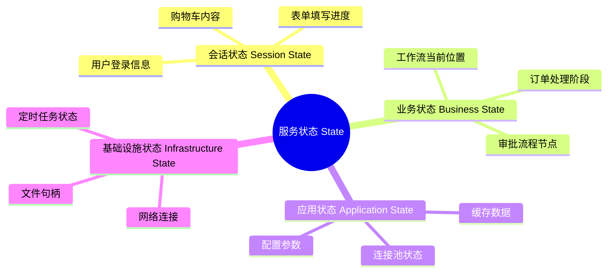
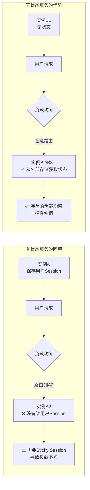
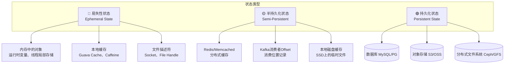
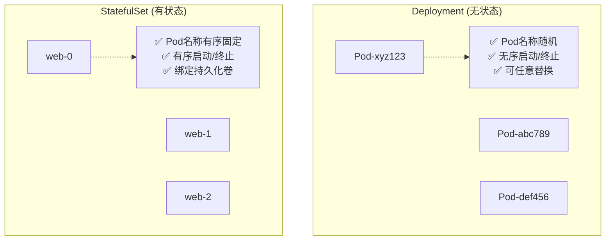
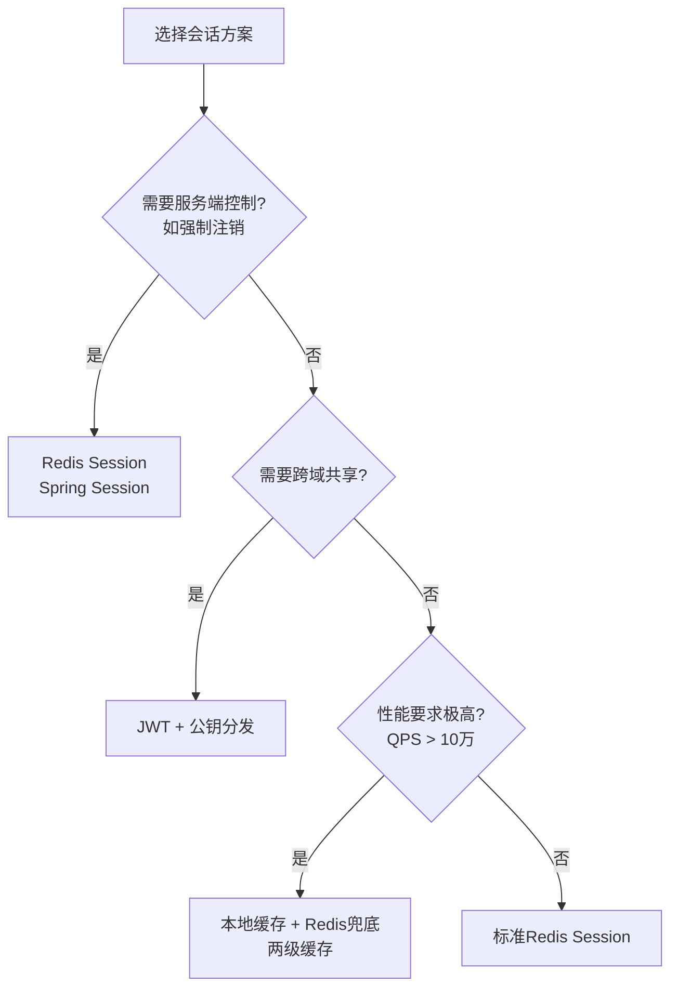
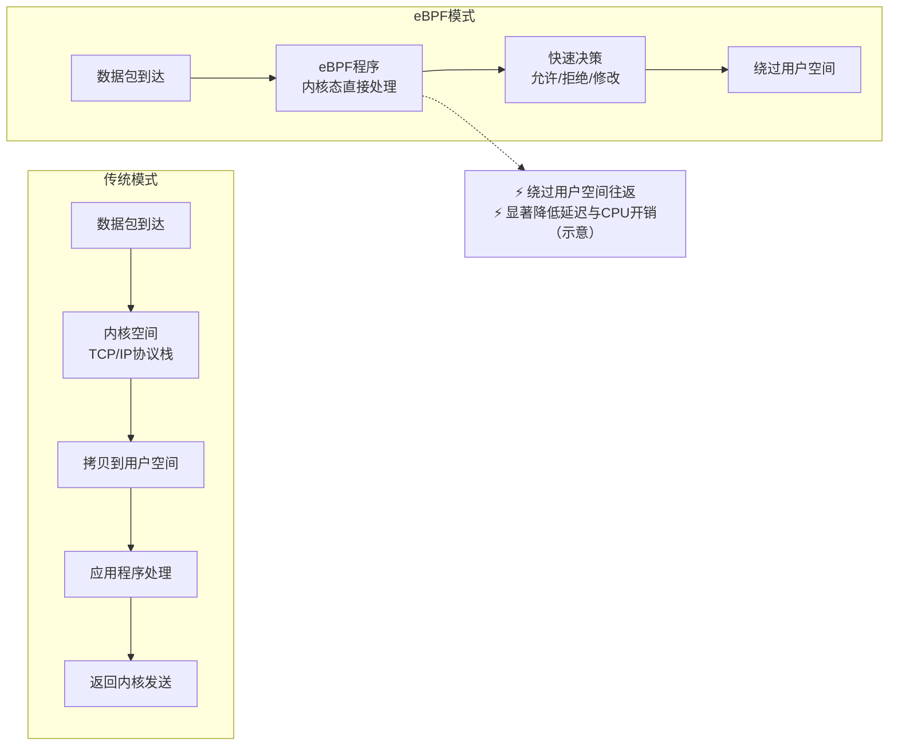

# 弹力设计篇之"服务的状态" - [2026重制版]

> **核心变更说明**：本文基于原极客时间专栏第45讲内容进行全面升级，更新至2026年技术栈。主要变更包括：
> - 补充Kubernetes StatefulSet与Stateless对比
> - 新增Serverless/FAAS无状态架构最佳实践
> - 引入分布式会话管理方案（Redis Cluster、JWT）
> - 添加有状态服务在K8s中的实践（Volume Claim Template）
> - 包含状态外置化的完整代码示例

---

## 一、问题背景：状态的本质与挑战

### 1.1 什么是"状态"

在软件系统中，"状态"（State）指的是系统为了完成业务功能所需要记住的信息。这些信息包括：



### 1.2 有状态 vs 无状态的核心区别

| 维度 | 无状态服务 (Stateless) | 有状态服务 (Stateful) |
|------|----------------------|---------------------|
| **定义** | 不保存任何请求间的上下文信息 | 保存跨请求的持久化或临时数据 |
| **扩展方式** | 水平无限扩展（加机器即可） | 需要考虑数据分片和同步 |
| **部署简单性** | ✅ 极简（可随意启停） | ❌ 复杂（需迁移状态） |
| **故障恢复** | ✅ 快速（重启即可） | ❌ 慢（需恢复/重建状态） |
| **性能** | 可能稍慢（需访问外部存储） | 更快（本地数据访问） |
| **一致性模型** | 最终一致（依赖外部存储） | 可实现强一致 |
| **典型代表** | REST API、Lambda函数 | 数据库、缓存、消息队列 |

### 1.3 为什么无状态成为微服务的最佳实践



---

## 二、核心概念与架构图

### 2.1 状态分类体系



### 2.2 状态外置化架构

```mermaid
flowchart TB
    subgraph 无状态应用层 Stateless App Layer
        APP1[Pod A - v1.0]
        APP2[Pod B - v1.0]
        APP3[Pod C - v1.0]
        APP4[Pod D - v2.0]  <!-- 可滚动升级 -->
    end

    subgraph 外部状态存储层 External State Storage
        CACHE[(Redis Cluster<br/>会话/缓存)]
        DB[(PostgreSQL集群<br/>业务数据)]
        OBJ[(MinIO/S3<br/>文件/图片)]
        MQ[(Kafka<br/>事件流)]
    end

    subgraph 状态管理中间件 State Management
        SESSION[Session Store<br/>Spring Session]
        TX[Transaction Manager<br/>Seata/Distributed]
        CACHE_MGR[Cache Manager<br/>Spring Cache]
    end

    APP1 & APP2 & APP3 & APP4 --> SESSION & TX & CACHE_MGR
    SESSION --> CACHE
    TX --> DB
    CACHE_MGR --> CACHE
    APP1 & APP2 & APP3 & APP4 --> DB & OBJ & MQ

```

### 2.3 Kubernetes中的有状态 vs 无状态工作负载



---

## 三、技术实现细节

### 3.1 Kubernetes无状态部署示例（Deployment）

```yaml
# deployment-stateless.yaml
apiVersion: apps/v1
kind: Deployment
metadata:
  name: order-service
  labels:
    app: order-service
spec:
  replicas: 3  # 运行3个副本，完全无状态
  selector:
    matchLabels:
      app: order-service
  strategy:
    type: RollingUpdate
    rollingUpdate:
      maxSurge: 1          # 滚动更新时最多多出1个Pod
      maxUnavailable: 0   # 不允许不可用
  template:
    metadata:
      labels:
        app: order-service
    spec:
      serviceAccountName: order-service-sa
      securityContext:
        runAsNonRoot: true
        runAsUser: 1000
        fsGroup: 1000
      containers:
      - name: order-service
        image: order-service:v2.3.0
        ports:
        - containerPort: 8080
          protocol: TCP
        env:
        # 从ConfigMap读取配置（无硬编码）
        - name: SPRING_PROFILES_ACTIVE
          valueFrom:
            configMapKeyRef:
              name: order-service-config
              key: spring.profiles.active
        # 从Secret读取敏感信息
        - name: DATABASE_URL
          valueFrom:
            secretKeyRef:
              name: database-secret
              key: url
        # 资源限制（防止资源争抢）
        resources:
          requests:
            cpu: 100m
            memory: 256Mi
          limits:
            cpu: "1"
            memory: 512Mi
        # 健康检查
        livenessProbe:
          httpGet:
            path: /actuator/health/liveness
            port: 8080
          initialDelaySeconds: 30
          periodSeconds: 10
          timeoutSeconds: 5
          failureThreshold: 3
        readinessProbe:
          httpGet:
            path: /actuator/health/readiness
            port: 8080
          initialDelaySeconds: 5
          periodSeconds: 5
          timeoutSeconds: 3
          failureThreshold: 3
        startupProbe:
          httpGet:
            path: /actuator/health
            port: 8080
          initialDelaySeconds: 10
          periodSeconds: 5
          failureThreshold: 30  # 允许最长150秒启动时间
        # 安全上下文
        securityContext:
          allowPrivilegeEscalation: false
          readOnlyRootFilesystem: true
          capabilities:
            drop:
            - ALL
        volumeMounts:
        - name: tmp
          mountPath: /tmp
        - name: logs
          mountPath: /var/log/app
      volumes:
      - name: tmp
        emptyDir: {}
      - name: logs
        emptyDir: {}
      # 优雅终止
      terminationGracePeriodSeconds: 30  # 允许30秒完成正在处理的请求
---
# 对应的Service（负载均衡器）
apiVersion: v1
kind: Service
metadata:
  name: order-service
spec:
  type: ClusterIP
  selector:
    app: order-service
  ports:
  - port: 80
    targetPort: 8080
    protocol: TCP
```

### 3.2 Kubernetes有状态部署示例（StatefulSet）

```yaml
# statefulset-mongodb.yaml
# MongoDB副本集的有状态部署
apiVersion: apps/v1
kind: StatefulSet
metadata:
  name: mongodb
  labels:
    app: mongodb
spec:
  serviceName: mongodb-headless  # 必须关联Headless Service
  replicas: 3                   # 3节点副本集
  selector:
    matchLabels:
      app: mongodb
  template:
    metadata:
      labels:
        app: mongodb
    spec:
      terminationGracePeriodSeconds: 10
      containers:
      - name: mongodb
        image: mongo:6.0
        command:
        - mongod
        - --wiredTigerCacheSizeGB
        - "0.5"
        - --bind_ip
        - "0.0.0.0"
        - --replSet
        - rs0
        ports:
        - containerPort: 27017
          name: peer
        env:
        - name: POD_NAME
          valueFrom:
            fieldRef:
              fieldPath: metadata.name  # 获取Pod序号(0,1,2)
        volumeMounts:
        - name: data
          mountPath: /data/db       # 数据持久化目录
        - name: config
          mountPath: /config
          readOnly: true
        resources:
          requests:
            cpu: 500m
            memory: 1Gi
          limits:
            cpu: "2"
            memory: 4Gi
        readinessProbe:
          exec:
            command:
            - mongosh
            - --quiet
            - --eval
            - "db.adminCommand('ping')"
          initialDelaySeconds: 10
          periodSeconds: 10
        livenessProbe:
          exec:
            command:
            - mongosh
            - --quiet
            - --eval
            - "db.adminCommand('ping')"
          initialDelaySeconds: 30
          periodSeconds: 20
  volumeClaimTemplates:           # ⭐ 关键：自动为每个Pod创建PVC
  - metadata:
      name: data
    spec:
      accessModes: ["ReadWriteOnce"]
      storageClassName: standard   # 默认StorageClass（按集群而定）
      resources:
        requests:
          storage: 100Gi           # 每个MongoDB节点100GB
  volumes:
  - name: config
    configMap:
      name: mongodb-config
---
# Headless Service（用于稳定的网络标识）
apiVersion: v1
kind: Service
metadata:
  name: mongodb-headless
  labels:
    app: mongodb
spec:
  clusterIP: None                 # Headless Service
  selector:
    app: mongodb
  ports:
  - name: peer
    port: 27017
    targetPort: 27017
---
# 普通Service（用于客户端访问）
apiVersion: v1
kind: Service
metadata:
  name: mongodb
spec:
  selector:
    app: mongodb
  ports:
  - port: 27017
    targetPort: 27017
```

**StatefulSet的关键特性**：

| 特性 | Deployment | StatefulSet |
|------|-----------|-------------|
| Pod命名 | `order-service-xxxxx`（随机hash） | `mongodb-0`, `mongodb-1`, `mongodb-2`（有序） |
| 启动顺序 | 并行启动 | 有序启动（0→1→2） |
| 终止顺序 | 并行终止 | 有序终止（2→1→0） |
| 存储卷 | 共享卷或emptyDir | 每个Pod独立的PVC |
| DNS解析 | 通过ClusterIP | 直接解析到每个Pod |
| 适用场景 | 无状态API/Web服务 | 数据库、缓存、消息队列 |

### 3.3 分布式会话管理方案

#### 3.3.1 Spring Session + Redis

```java
// Maven依赖
/*
<dependency>
    <groupId>org.springframework.session</groupId>
    <artifactId>spring-session-data-redis</artifactId>
</dependency>
<dependency>
    <groupId>org.springframework.boot</groupId>
    <artifactId>spring-boot-starter-data-redis</artifactId>
</dependency>
*/

@Configuration
@EnableRedisHttpSession  // 启用Redis HTTP Session
public class SessionConfig {

    /**
     * 配置Redis序列化器（使用JSON而非Java默认序列化）
     */
    @Bean
    public RedisSerializer<Object> springSessionDefaultRedisSerializer() {
        return new GenericJackson2JsonRedisSerializer();
    }

    /**
     * Cookie配置
     */
    @Bean
    public CookieSerializer cookieSerializer() {
        DefaultCookieSerializer serializer = new DefaultCookieSerializer();
        serializer.setCookieName("SESSION_ID");     // Cookie名称
        serializer.setUseHttpOnly(true);             // 防止XSS攻击
        serializer.setSameSite("Lax");               // CSRF保护
        serializer.setDomainNamePattern("^.+?\\.\\..*"); // 匹配所有子域
        serializer.setCookiePath("/");                // 全站有效
        serializer.setMaxAge(Duration.ofHours(24));   // 过期时间
        return serializer;
    }
}

// Controller中使用Session
@RestController
@RequestMapping("/api/cart")
@RequiredArgsConstructor
public class ShoppingCartController {

    private final ShoppingCartService cartService;

    /**
     * 购物车是无状态的典型反面教材！
     * 但使用Spring Session后，购物车数据存在Redis中，
     * 服务本身仍然是无状态的。
     */
    @GetMapping
    public ResponseEntity<CartResponse> getCart(HttpSession session) {
        String userId = (String) session.getAttribute("userId");
        
        // 如果用户未登录，从Session获取临时购物车ID
        String cartId = (String) session.getAttribute("cartId");
        if (cartId == null) {
            cartId = UUID.randomUUID().toString();
            session.setAttribute("cartId", cartId);
        }

        CartResponse cart = cartService.getCart(cartId);
        return ResponseEntity.ok(cart);
    }

    @PostMapping("/items")
    public ResponseEntity<Void> addItem(
            @RequestBody AddCartItemRequest request,
            HttpSession session) {
        
        String cartId = (String) session.getAttribute("cartId");
        cartService.addItem(cartId, request.getProductId(), request.getQuantity());
        
        return ResponseEntity.ok().build();
    }
}
```

#### 3.3.2 JWT（JSON Web Token）无状态认证

对于完全无状态的场景，可以使用JWT替代Session：

```java
@Service
@RequiredArgsConstructor
@Slf4j
public class JwtTokenService {

    private final JwtProperties properties;
    private final PrivateKey rsaKey;

    @PostConstruct
    public void init() throws Exception {
        // 加载RSA密钥对（用于RS256签名）
        KeyFactory kf = KeyFactory.getInstance("RSA");
        PKCS8EncodedKeySpec keySpec = new PKCS8EncodedKeySpec(
            Base64.getDecoder().decode(properties.getPrivateKey())
        );
        this.rsaKey = kf.generatePrivate(keySpec);
    }

    /**
     * 生成JWT Token
     */
    public String generateToken(Authentication authentication) {
        UserPrincipal userPrincipal = (UserPrincipal) authentication.getPrincipal();

        Date now = new Date();
        Date expiryDate = new Date(now.getTime() + properties.getTokenValidityInSeconds() * 1000);

        return Jwts.builder()
            .setSubject(Long.toString(userPrincipal.getId()))
            .setIssuedAt(new Date())
            .setExpiration(expiryDate)
            .claim("email", userPrincipal.getEmail())
            .claim("roles", userPrincipal.getAuthorities()
                .stream()
                .map(GrantedAuthority::getAuthority)
                .collect(Collectors.toList()))
            .signWith(rsaKey, SignatureAlgorithm.RS256)  // 非对称加密
            .compact();
    }

    /**
     * 从Token中获取用户ID（无需查询数据库）
     */
    public Long getUserIdFromToken(String token) {
        Claims claims = Jwts.parserBuilder()
            .setSigningKey(getPublicKey())
            .build()
            .parseClaimsJws(token)
            .getBody();

        return Long.parseLong(claims.getSubject());
    }

    /**
     * 验证Token有效性
     */
    public boolean validateToken(String authToken) {
        try {
            Jwts.parserBuilder()
                .setSigningKey(getPublicKey())
                .build()
                .parseClaimsJws(authToken);
            return true;
        } catch (SecurityException ex) {
            log.error("Invalid JWT signature");
        } catch (MalformedJwtException ex) {
            log.error("Invalid JWT token");
        } catch (ExpiredJwtException ex) {
            log.error("Expired JWT token");
        } catch (UnsupportedJwtException ex) {
            log.error("Unsupported JWT token");
        } catch (IllegalArgumentException ex) {
            log.error("JWT claims string is empty.");
        }
        return false;
    }
}
```

**Session vs JWT 对比**：

| 维度 | Spring Session (Redis) | JWT |
|------|----------------------|-----|
| **服务器存储** | ✅ 需要（Redis） | ❌ 不需要（自包含） |
| **注销/吊销** | ✅ 删除Redis Key即可 | ⚠️ 需要黑名单机制 |
| **Token大小** | 小（仅Session ID） | 较大（包含Claims） |
| **跨服务共享** | ✅ 天然支持 | ✅ 自包含，易共享 |
| **性能** | 每次查Redis | 本地验证即可 |
| **安全性** | 服务端控制 | 注意密钥保护 |
| **适用场景** | 需要实时管控的会话 | API网关、微服务间调用 |

### 3.4 状态外置化的完整示例

```java
/**
 * 用户偏好设置服务（展示如何将状态外置）
 * 
 * 场景：用户的UI主题、语言偏好等需要跨请求保持，
 * 但不应该保存在应用内存中。
 */
@Service
@RequiredArgsConstructor
@Slf4j
public class UserPreferenceService {

    private final RedisTemplate<String, String> redisTemplate;
    private final UserRepository userRepository;
    private final ApplicationEventPublisher eventPublisher;
    
    private static final String PREFERENCE_KEY_PREFIX = "user:pref:";
    private static final Duration CACHE_TTL = Duration.ofHours(24);

    /**
     * 获取用户偏好（优先从缓存读取）
     */
    public UserPreference getPreference(Long userId) {
        String key = PREFERENCE_KEY_PREFIX + userId;
        
        // 1. 先查Redis缓存
        String cached = redisTemplate.opsForValue().get(key);
        if (cached != null) {
            log.debug("Cache hit for user preference: {}", userId);
            return JsonUtils.fromJson(cached, UserPreference.class);
        }

        // 2. 缓存未命中，查数据库
        UserPreference preference = userRepository.findPreferenceByUserId(userId)
            .orElse(UserPreference.defaultPreference());

        // 3. 写入缓存（异步，不影响响应时间）
        CompletableFuture.runAsync(() -> {
            redisTemplate.opsForValue().set(
                key, 
                JsonUtils.toJson(preference), 
                CACHE_TTL
            );
        });

        return preference;
    }

    /**
     * 更新用户偏好（同时更新DB和Cache）
     */
    @Transactional
    public void updatePreference(Long userId, UpdatePreferenceRequest request) {
        // 1. 更新数据库（强一致）
        userRepository.updatePreference(userId, request);

        // 2. 删除缓存（下次访问时重新加载）
        String key = PREFERENCE_KEY_PREFIX + userId;
        redisTemplate.delete(key);

        // 3. 发布事件（通知其他服务）
        eventPublisher.publishEvent(new PreferenceChangedEvent(userId, request));
    }
}

/**
 * 购物车服务（更复杂的例子：需要处理并发）
 */
@Service
@RequiredArgsConstructor
@Slf4j
public class ShoppingCartService {

    private final RedisTemplate<String, Object> redisTemplate;
    private final CartEventPublisher eventPublisher;

    private static final String CART_KEY_PREFIX = "cart:";
    private static final Duration CART_TTL = Duration.ofDays(7);  // 购物车保留7天

    /**
     * 添加商品到购物车（使用Redis Hash结构）
     * 
     * 为什么用Redis而不是数据库？
     * - 购物车是临时数据，不需要持久化
     * - 需要高频读写（每次浏览商品页可能触发）
     * - 支持原子操作（避免超卖）
     */
    public CartItem addToCart(String cartId, String productId, int quantity) {
        String key = CART_KEY_PREFIX + cartId;

        // 使用Lua脚本保证原子性：
        // 1. 检查是否已存在该商品
        // 2. 如果存在则增加数量，否则新增
        // 3. 返回最新的数量
        String luaScript =
            "local current = redis.call('HGET', KEYS[1], ARGV[1]) " +
            "if current then " +
            "   local newQty = tonumber(current) + tonumber(ARGV[2]) " +
            "   redis.call('HSET', KEYS[1], ARGV[1], newQty) " +
            "   return newQty " +
            "else " +
            "   redis.call('HSET', KEYS[1], ARGV[1], ARGV[2]) " +
            "   return tonumber(ARGV[2]) " +
            "end";

        DefaultRedisScript<Long> script = new DefaultRedisScript<>();
        script.setScriptText(luaScript);
        script.setResultType(Long.class);

        Long newQuantity = redisTemplate.execute(
            script,
            Collections.singletonList(key),
            productId,
            String.valueOf(quantity)
        );

        // 刷新过期时间（滑动过期）
        redisTemplate.expire(key, CART_TTL);

        // 发布事件用于数据分析
        eventPublisher.publishCartUpdated(cartId, productId, newQuantity);

        return CartItem.builder()
            .productId(productId)
            .quantity(newQuantity)
            .build();
    }

    /**
     * 获取完整购物车
     */
    public Map<String, Integer> getCartItems(String cartId) {
        String key = CART_KEY_PREFIX + cartId;
        Map<Object, Object> entries = redisTemplate.opsForHash().entries(key);
        
        return entries.entrySet().stream()
            .collect(Collectors.toMap(
                e -> (String) e.getKey(),
                e -> (Integer) e.getValue()
            ));
    }

    /**
     * 清空购物车（下单成功后调用）
     */
    public void clearCart(String cartId) {
        String key = CART_KEY_PREFIX + cartId;
        redisTemplate.delete(key);
        log.info("Cleared shopping cart: {}", cartId);
    }
}
```

---

## 四、方案对比表格

### 4.1 状态存储方案对比

| 方案 | 性能 | 可靠性 | 成本 | 复杂度 | 适用场景 |
|------|------|--------|------|--------|---------|
| **应用内存** | ⭐⭐⭐⭐⭐ | ⭐ | 免费 | 低 | 临时计算、本地缓存 |
| **Redis** | ⭐⭐⭐⭐ | ⭐⭐⭐⭐ | 中 | 中 | 会话、购物车、热点数据 |
| **Memcached** | ⭐⭐⭐⭐ | ⭐⭐⭐ | 低 | 中 | 纯缓存场景 |
| **MySQL/PG** | ⭐⭐ | ⭐⭐⭐⭐⭐ | 中低 | 低 | 核心业务数据 |
| **MongoDB** | ⭐⭐⭐ | ⭐⭐⭐⭐ | 中 | 中 | 文档型、灵活Schema |
| **Etcd/Consul** | ⭐⭐⭐ | ⭐⭐⭐⭐⭐ | 高 | 高 | 配置中心、服务发现 |
| **对象存储(S3)** | ⭐⭐ | ⭐⭐⭐⭐⭐ | 低 | 低 | 图片、视频、备份文件 |

### 4.2 会话管理方案选型指南



---

## 五、实战案例（Case Study）

### 案例：电商平台的状态管理演进

**初始状态（单体时代）**：
- Session存储在Tomcat内存中
- 购物车存放在HTTP Session
- 无法水平扩展（Sticky Session问题）

**第一次改造（引入Redis Session）**：
```java
// 引入Spring Session
@EnableRedisHttpSession
public class SessionConfig { ... }

// 问题解决：
// ✅ 可以水平扩展了
// ✅ 多个实例共享Session
// ❌ Redis单点故障风险
```

**第二次改造（微服务 + JWT）**：
```
用户 → API Gateway (验证JWT) → 业务服务 (无状态)

优势：
✅ 完全无状态，可无限扩展
✅ 服务间调用通过JWT传递身份
✅ Gateway统一认证，业务服务零感知

挑战：
⚠️ Token无法主动撤销（需要黑名单）
⚠️ Token较大，增加网络开销
⚠️ 敏感信息不应放入JWT
```

**最终架构（混合模式）**：

```mermaid
flowchart TB
    subgraph Client
        Web[Web浏览器]
        Mobile[移动App]
    end

    subgraph Gateway
        IG[Ingress Nginx/Istio]
        AG[API Gateway<br/>OAuth2/JWT验证]
    end

    subgraph 核心服务 (无状态)
        US[用户服务]
        OS[订单服务]
        PS[支付服务]
    end

    subgraph 边缘服务 (有状态但可替换)
        CS[购物车服务<br/>State: Redis]
        SS[搜索服务<br/>State: Elasticsearch Index]
    end

    subgraph 基础设施
        REDIS[(Redis Cluster)]
        PG[(PostgreSQL)]
        ES[(Elasticsearch)]
        KAFKA[(Kafka)]
    end

    Web & Mobile --> IG --> AG
    AG --> US & OS & PS & CS & SS
    
    US --> PG
    OS --> PG & KAFKA
    PS --> PG & KAFKA
    CS --> REDIS
    SS --> ES

```

**效果指标**：

| 指标 | 单体架构 | 微服务+Session | 微服务+JWT(当前) |
|------|---------|---------------|-----------------|
| 最大实例数 | 1（有状态） | 10（受限于Redis） | 100+（真正无状态） |
| 平均响应时间 | 200ms | 250ms（+Redis网络开销） | 180ms（本地验证） |
| 故障恢复时间 | 分钟级 | 秒级（重启即可） | 毫秒级（自动扩容） |
| 运维复杂度 | 低 | 中 | 中高 |
| 开发体验 | 简单 | 一般 | 需理解JWT机制 |

---

## 六、2026年最新趋势

### 6.1 Serverless/FaaS推动无状态化

Serverless架构强制要求函数是无状态的：

```python
# AWS Lambda 示例 (Python)
import json
import boto3
from aws_lambda_powertools import Logger, Tracer

logger = Logger()
tracer = Tracer()

dynamodb = boto3.resource('dynamodb')
table = dynamodb.Table('user-preferences')

@tracer.capture_lambda_handler
@logger.inject_lambda_context
def get_user_preference(event, context):
    """
    Lambda函数必须是无状态的！
    所有状态都存储在外部（DynamoDB/S3等）
    """
    user_id = event['pathParameters']['userId']
    
    # 从DynamoDB读取状态（不是内存变量！）
    response = table.get_item(Key={'userId': user_id})
    
    if 'Item' not in response:
        return {
            'statusCode': 404,
            'body': json.dumps({'error': 'User not found'})
        }
    
    preference = response['Item']
    
    return {
        'statusCode': 200,
        'body': json.dumps(preference),
        'headers': {
            'Content-Type': 'application/json',
            # 即使是同一个用户，也可能在不同容器执行
            # 所以不能假设任何本地状态存在
        }
    }
```

**Serverless的限制与应对**：

| 限制 | 描述 | 解决方案 |
|------|------|---------|
| 执行时间限制 | Lambda最多15分钟 | 拆分为多个小函数 |
| 无本地存储 | /tmp目录默认512MB（可配置）且临时 | 使用S3/EFS持久化 |
| 冷启动延迟 | 首次调用较慢 | Provisioned Concurrency |
| 状态管理困难 | 不能保存实例状态 | 外部状态存储(DynamoDB) |
| 并发限制 | 默认1000并发 | 异步队列缓冲 |

### 6.2 eBPF加速无状态服务

eBPF（Extended Berkeley Packet Filter）正在革新网络层的无状态处理：



**适用场景**：
- **Service Mesh数据面**：Envoy/Cilium使用eBPF加速
- **网络策略执行**：Kubernetes NetworkPolicy offload
- **可观测性采集**：零侵入的性能监控

### 6.3 WebAssembly (WASM) 作为轻量级运行时

WASM正在成为无状态函数的新选择：

| 特性 | Docker容器 | WASM |
|------|----------|------|
| 启动时间 | 秒级 | **毫秒级** |
| 内存占用 | ~100MB+ | **~1-5MB** |
| 安全沙箱 | Namespaces/CGroups | **WASM沙箱（更强）** |
| 可移植性 | 需要匹配OS/CPU | **真正的WORA** |
| 语言支持 | 任意语言 | Rust/Go/C++/AssemblyScript |

**未来展望**：WASM可能在边缘计算和FaaS领域取代部分容器的角色。

---

## 七、最佳实践清单

### 设计阶段
- [ ] 明确区分哪些状态是必须持久化的，哪些可以是临时的
- [ ] 选择合适的外部存储介质（Redis vs DB vs 对象存储）
- [ ] 设计状态的生命周期管理（创建、更新、过期、清理）
- [ ] 考虑状态迁移策略（版本升级时的兼容性）

### 实施阶段
- [ ] 使用声明式配置管理状态（Kubernetes PVC、ConfigMap）
- [ ] 实现优雅关闭（Graceful Shutdown），确保状态持久化
- [ ] 添加健康检查（Readiness/Liveness），避免将未就绪的服务加入流量池
- [ ] 监控状态存储的使用情况（内存、连接数、QPS）

### 运维阶段
- [ ] 定期备份关键状态数据
- [ ] 设置合理的TTL，自动清理过期状态
- [ ] 规划容量扩容方案（Redis Cluster分片、数据库读写分离）
- [ ] 进行故障演练（模拟Redis宕机、网络分区）

---

## 八、延伸学习资源

### 官方文档

1. **Kubernetes StatefulSet文档**
   - https://kubernetes.io/docs/concepts/workloads/controllers/statefulset/
   
2. **Spring Session官方文档**
   - https://docs.spring.io/spring-session/reference/

3. **Redis最佳实践**
   - https://redis.io/docs/management/optimization/

4. **12-Factor App Methodology**
   - https://12factor.net/processes （Factor VI: Processes）

### 推荐书籍

1. **《Designing Data-Intensive Applications》** Chapter 5: Replication
2. **《Building Microservices》** Sam Newman - 第4章
3. **《Site Reliability Engineering》** Google - 关于无状态设计的章节

### 开源项目

1. **Spring Session**: https://spring.io/projects/spring-session
2. **JWT.IO**: https://jwt.io/ （JWT库和工具集合）
3. **HashiCorp Vault**: https://www.vaultproject.io/ （ secrets管理）

---

## 九、总结

本文深入探讨了服务状态管理的方方面面。核心要点：

1. **核心理念**："Stateless is the new black" —— 无状态是云原生时代的黄金法则
2. **技术选型**：
   - **无状态服务**：使用Deployment + 外部状态存储（推荐）
   - **有状态服务**：仅在必要时使用StatefulSet（如数据库、消息队列）
3. **状态外置化三要素**：
   - 会话 → Redis Cluster 或 JWT
   - 缓存 → Redis / Memcached
   - 持久化数据 → PostgreSQL / MongoDB
4. **Kubernetes实践**：
   - 无状态：Deployment + HPA/VPA 自动伸缩
   - 有状态：StatefulSet + PVC 稳定存储
5. **2026趋势**：
   - Serverless/FaaS 强制无状态化
   - eBPF 加速网络层处理
   - WASM 作为轻量级补充

**记住**：无状态不是为了消除所有状态，而是将状态从应用内部转移到专门的外部存储系统中。正如12-Factor App所说："Twelve-factor processes are stateless and share-nothing."（十二因素应用的进程是无状态且不共享任何东西的。）

---

**参考资料来源**：
- [Kubernetes Official Documentation](https://kubernetes.io/docs/)
- [Spring Session Documentation](https://docs.spring.io/spring-session/reference/)
- [12-Factor App](https://12factor.net/)
- [Redis Documentation](https://redis.io/docs/)
- [CNCF Cloud Native Landscape](https://landscape.cncf.io/)
