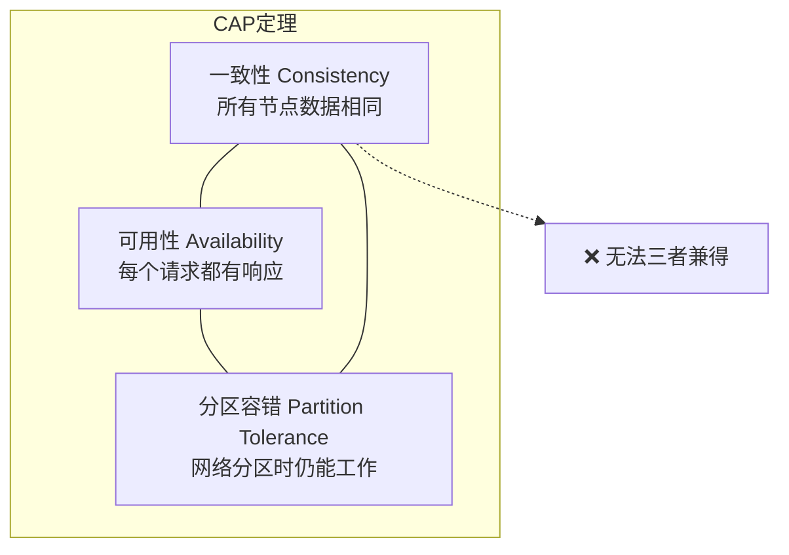
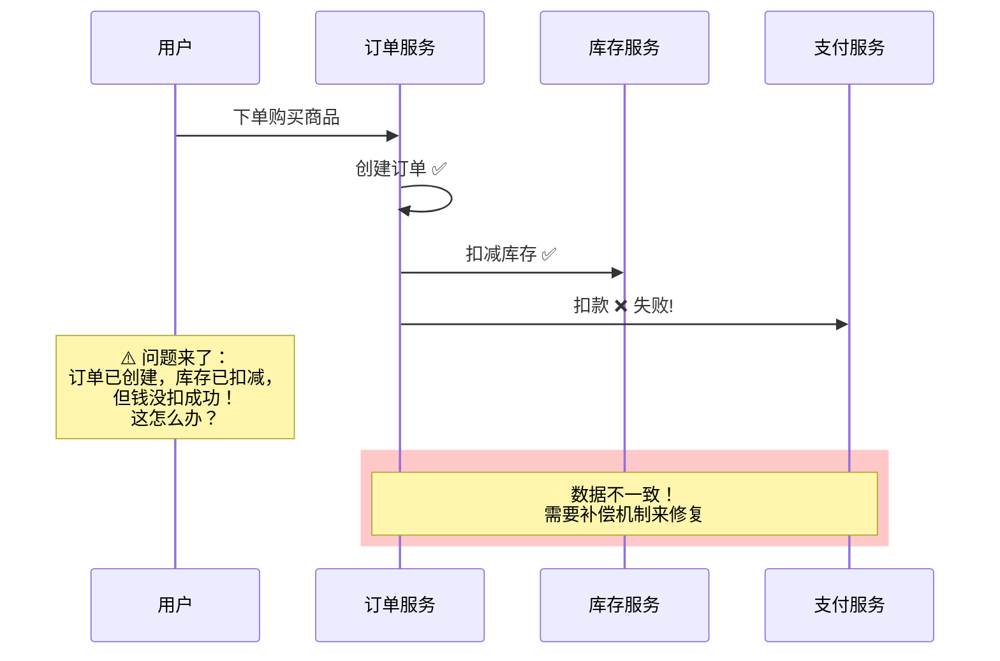
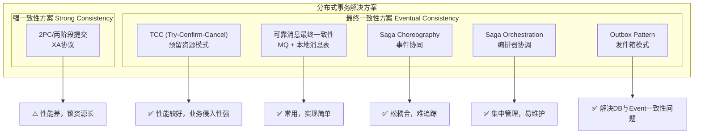
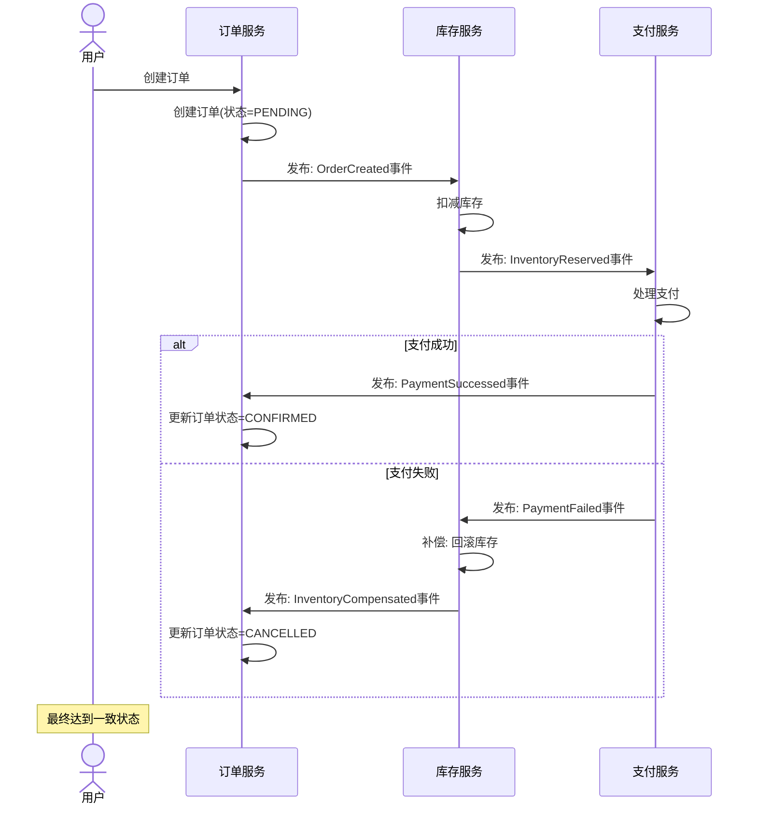
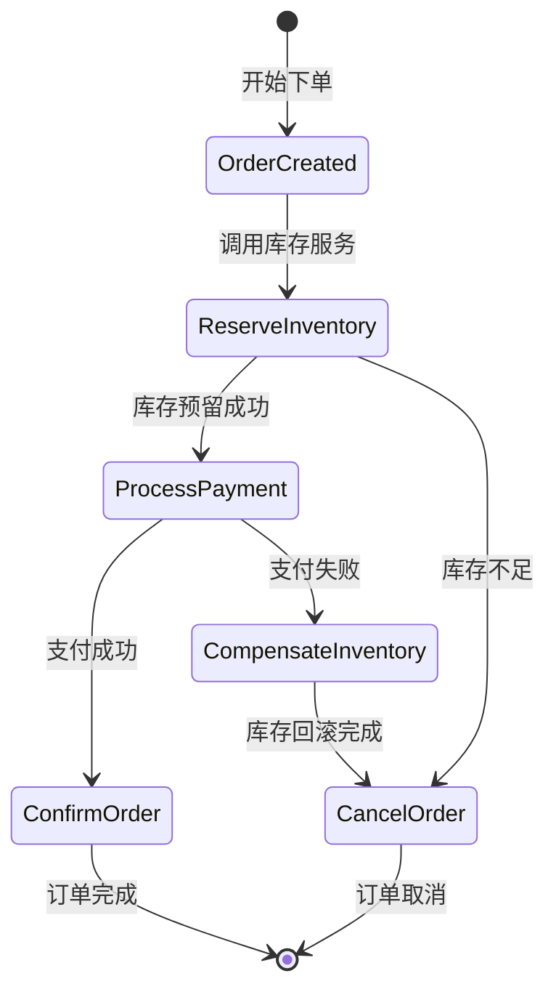
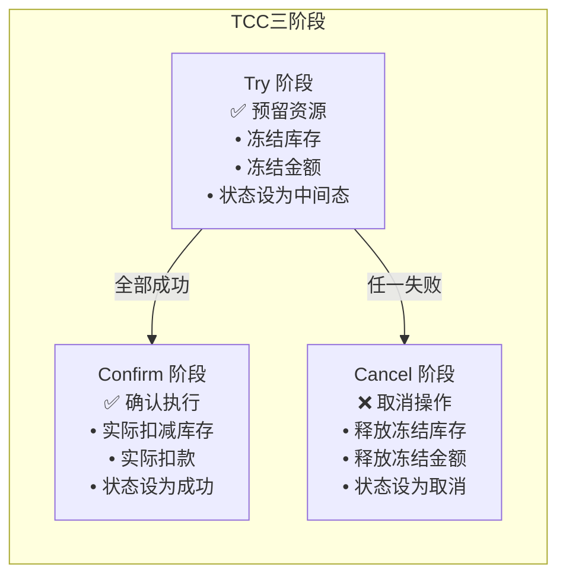
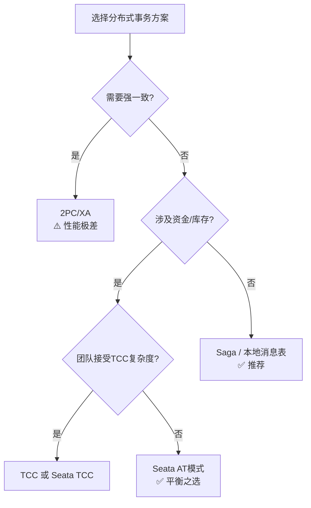

# 弹力设计篇之"补偿事务" - [2026重制版]

> **核心变更说明**：本文基于原极客时间专栏第46讲内容进行全面升级，更新至2026年技术栈。主要变更包括：
> - 补充Saga模式详解（Choreography vs Orchestration）
> - 新增Seata/DTCC分布式事务框架实战
> - 引入Outbox模式解决事件一致性
> - 添加TCC (Try-Confirm-Cancel)完整代码示例
> - 包含真实电商/金融场景的补偿事务案例

---

## 一、问题背景：分布式事务的挑战

### 1.1 CAP定理与分布式事务

在分布式系统中，我们无法同时满足一致性（Consistency）、可用性（Availability）和分区容错（Partition Tolerance）。根据CAP定理，我们最多只能选择其中的两个：



| 选择 | 特点 | 适用场景 |
|------|------|---------|
| **CP（一致+分区）** | 牺牲可用性，保证强一致 | 金融核心系统、库存扣减 |
| **AP（可用+分区）** | 牺牲一致性，保证高可用 | 社交网络、日志收集、推荐系统 |

### 1.2 ACID vs BASE 对比

| 属性 | ACID（传统数据库） | BASE（分布式系统） |
|------|------------------|-------------------|
| **A**tomicity | 原子性：全部成功或全部失败 | **B**asically Available：基本可用 |
| **C**onsistency | 强一致性：事务前后状态正确 | **E**ventual Consistency：最终一致性 |
| **I**solation | 隔离性：并发事务互不干扰 | Soft State：允许中间状态 |
| **D**urability | 持久性：提交后永久保存 | - |

**通俗理解**：
- **ACID像银行转账**：要么两边都改，要么都不改，不允许中间状态
- **BASE像网购下单**：先告诉你"订单已创建"，后台慢慢处理库存、支付等

### 1.3 真实故障场景

#### 场景：跨服务事务失败



---

## 二、核心概念与架构图

### 2.1 分布式事务解决方案全景图



### 2.2 Saga模式详解

#### 2.2.1 Saga Choreography（协同式）

每个服务在完成本地事务后发布事件，其他服务监听并执行下一步操作：



**优点**：简单、松耦合
**缺点**：流程难以追踪、没有中央协调者

#### 2.2.2 Saga Orchestration（编排式）

引入中央编排器（Saga Orchestrator）协调整个流程：



**优点**：流程清晰、易于监控、集中管理
**缺点**：编排器本身可能成为单点

### 2.3 TCC (Try-Confirm-Cancel) 模式

TCC将业务逻辑拆分为三个阶段：



---

## 三、技术实现细节

### 3.1 Seata框架实战（阿里开源）

Seata是目前Java生态中最流行的分布式事务解决方案之一。

#### Maven依赖配置
```xml
<!-- pom.xml -->
<dependency>
    <groupId>io.seata</groupId>
    <artifactId>seata-spring-boot-starter</artifactId>
    <version>2.0.0</version>
</dependency>
<dependency>
    <groupId>io.seata</groupId>
    <artifactId>seata-all</artifactId>
    <version>2.0.0</version>
</dependency>
```

#### 配置文件 application.yml
```yaml
seata:
  enabled: true
  application-id: order-service
  tx-service-group: my_tx_group
  service:
    vgroup-mapping:
      my_tx_group: default  # 事务组映射到集群
  registry:
    type: nacos              # 使用Nacos作为注册中心
    nacos:
      server-addr: localhost:8848
      namespace: ""
      group: SEATA_GROUP
      username: nacos
      password: nacos
  config:
    type: nacos
    nacos:
      server-addr: localhost:8848
      namespace: ""
      group: SEATA_GROUP
      username: nacos
      password: nacos
  log:
    exception-rate: 100      # 记录异常率（用于统计）
```

#### 订单服务代码示例
```java
@Service
@RequiredArgsConstructor
@Slf4j
public class OrderServiceImpl implements OrderService {

    private final OrderRepository orderRepository;
    private final InventoryClient inventoryClient;   // 远程调用
    private final PaymentClient paymentClient;       // 远程调用

    /**
     * 全局事务入口方法
     * @GlobalTransactional 开启分布式事务
     */
    @Override
    @GlobalTransactional(name = "createOrderTx", rollbackFor = Exception.class)
    public OrderResult createOrder(CreateOrderCommand command) {
        log.info("开始全局事务, xid={}", RootContext.getXID());

        // 1. 创建订单（本地事务）
        Order order = Order.builder()
            .orderId(IdGenerator.nextId())
            .userId(command.getUserId())
            .totalAmount(command.getTotalAmount())
            .status(OrderStatus.CREATED)
            .build();
        orderRepository.save(order);
        log.info("步骤1: 订单创建成功, orderId={}", order.getOrderId());

        // 2. 扣减库存（远程调用，参与全局事务）
        boolean reserveResult = inventoryClient.reserveStock(
            new ReserveStockCommand(
                order.getOrderId(),
                command.getItems()
            )
        );
        if (!reserveResult) {
            throw new BusinessException("库存不足");
        }
        log.info("步骤2: 库存预留成功");

        // 3. 扣款（远程调用，参与全局事务）
        PaymentResult paymentResult = paymentClient.deduct(
            new DeductCommand(
                order.getOrderId(),
                command.getUserId(),
                command.getTotalAmount()
            )
        );
        if (!paymentResult.isSuccess()) {
            throw new BusinessException("支付失败: " + paymentResult.getMessage());
        }
        log.info("步骤3: 支付扣款成功");

        // 4. 更新订单状态为已完成
        order.setStatus(OrderStatus.CONFIRMED);
        orderRepository.save(order);

        return OrderResult.success(order.getOrderId());
    }

    /**
     * 补偿方法：当全局事务回滚时自动调用
     * 如果步骤2或3失败，Seata会自动回滚之前的操作
     */
    public void compensateOrder(Long orderId) {
        Order order = orderRepository.findById(orderId)
            .orElseThrow(() -> new OrderNotFoundException(orderId));

        if (order.getStatus() == OrderStatus.CANCELLED) {
            log.warn("订单已处于取消状态, 无需重复补偿");
            return;
        }

        // 将订单标记为已取消
        order.setStatus(OrderStatus.CANCELLED);
        order.setCompensatedAt(LocalDateTime.now());
        orderRepository.save(order);

        log.info("订单补偿完成: orderId={}", orderId);
    }
}
```

#### 库存服务（TCC模式）
```java
@Service
@RequiredArgsConstructor
@Slf4j
public class InventoryServiceImpl implements InventoryService {

    private final InventoryRepository inventoryRepository;
    private final FrozenStockRepository frozenStockRepository;

    /**
     * Try阶段：预留库存（冻结）
     */
    @TwoPhaseBusinessAction(name = "reserveStockAction", commitMethod = "commitReserve", rollbackMethod = "rollbackReserve")
    public boolean reserveStock(BusinessActionContext ctx, ReserveStockCommand command) {
        String orderId = ctx.getXid();  // 全局事务ID

        log.info("[Try] 开始预留库存, xid={}, orderId={}", ctx.getXid(), orderId);

        // 检查是否已经预留过（幂等性）
        if (frozenStockRepository.existsByXid(orderId)) {
            log.warn("库存已预留, 跳过: xid={}", orderId);
            return true;
        }

        // 遍历商品项，逐个预留
        for (Item item : command.getItems()) {
            Inventory inventory = inventoryRepository.findByProductId(item.getProductId())
                .orElseThrow(() -> new ProductNotFoundException(item.getProductId()));

            // 检查库存是否充足
            if (inventory.getAvailableQuantity() < item.getQuantity()) {
                throw new InsufficientStockException(
                    String.format("商品 %s 库存不足, 需要=%d, 可用=%d",
                        item.getProductId(), item.getQuantity(), inventory.getAvailableQuantity())
                );
            }

            // 减少可用库存
            inventory.setAvailableQuantity(
                inventory.getAvailableQuantity() - item.getQuantity()
            );
            inventory.setFrozenQuantity(
                inventory.getFrozenQuantity() + item.getQuantity()
            );
            inventoryRepository.save(inventory);

            // 记录冻结明细
            FrozenStock frozen = FrozenStock.builder()
                .xid(orderId)
                .productId(item.getProductId())
                .quantity(item.getQuantity())
                .status(FrozenStatus.FROZEN)
                .createdAt(LocalDateTime.now())
                .build();
            frozenStockRepository.save(frozen);
        }

        log.info("[Try] 库存预留成功, xid={}", orderId);
        return true;
    }

    /**
     * Confirm阶段：确认扣减（实际减少库存）
     */
    public boolean commitReserve(BusinessActionContext ctx) {
        String orderId = ctx.getXid();

        log.info("[Confirm] 确认扣减库存, xid={}", orderId);

        List<FrozenStock> frozenList = frozenStockRepository.findByXid(orderId);

        for (FrozenStock frozen : frozenList) {
            Inventory inventory = inventoryRepository.findByProductId(frozen.getProductId()).get();

            // 从冻结库存中移除（真正扣减）
            inventory.setFrozenQuantity(inventory.getFrozenQuantity() - frozen.getQuantity());
            inventory.setSoldQuantity(inventory.getSoldQuantity() + frozen.getQuantity());
            inventoryRepository.save(inventory);

            // 标记冻结记录为已确认
            frozen.setStatus(FrozenStatus.CONFIRMED);
            frozen.setConfirmedAt(LocalDateTime.now());
            frozenStockRepository.save(frozen);
        }

        log.info("[Confirm] 库存扣减确认完成, xid={}", orderId);
        return true;
    }

    /**
     * Cancel阶段：回滚（释放冻结的库存）
     */
    public boolean rollbackReserve(BusinessActionContext ctx) {
        String orderId = ctx.getXid();

        log.info("[Cancel] 回滚库存预留, xid={}", orderId);

        List<FrozenStock> frozenList = frozenStockRepository.findByXid(orderId);

        for (FrozenStock frozen : frozenList) {
            if (frozen.getStatus() == FrozenStatus.CONFIRMED) {
                log.warn("冻结记录已确认, 不能回滚: id={}", frozen.getId());
                continue;  // 已确认的不能回滚
            }

            Inventory inventory = inventoryRepository.findByProductId(frozen.getProductId()).get();

            // 恢复可用库存
            inventory.setAvailableQuantity(inventory.getAvailableQuantity() + frozen.getQuantity());
            inventory.setFrozenQuantity(inventory.getFrozenQuantity() - frozen.getQuantity());
            inventoryRepository.save(inventory);

            // 标记冻结记录为已取消
            frozen.setStatus(FrozenStatus.CANCELLED);
            frozen.setCancelledAt(LocalDateTime.now());
            frozenStockRepository.save(frozen);
        }

        log.info("[Cancel] 库存回滚完成, xid={}", orderId);
        return true;
    }
}
```

### 3.2 Outbox模式（可靠消息表）

Outbox模式解决了数据库更新与消息发送的一致性问题：

```sql
-- 创建发件箱表（与业务表在同一数据库实例中）
CREATE TABLE outbox (
    id BIGINT PRIMARY KEY AUTO_INCREMENT,
    aggregate_type VARCHAR(32) NOT NULL COMMENT '聚合根类型: ORDER/PAYMENT',
    aggregate_id VARCHAR(64) NOT NULL COMMENT '聚合根ID',
    event_type VARCHAR(64) NOT NULL COMMENT '事件类型',
    payload JSON NOT NULL COMMENT '事件载荷',
    created_at TIMESTAMP DEFAULT CURRENT_TIMESTAMP,
    processed_at TIMESTAMP NULL COMMENT '处理时间',
    status TINYINT NOT NULL DEFAULT 0 COMMENT '0-PENDING 1-PROCESSED 2-FAILED',

    INDEX idx_status_created (status, created_at),
    INDEX idx_aggregate (aggregate_type, aggregate_id)
) ENGINE=InnoDB DEFAULT CHARSET=utf8mb4 
COMMENT='发件箱表';
```

**Spring Event + Outbox 实现**：

```java
@Service
@Transactional
@RequiredArgsConstructor
@Slf4j
public class OrderDomainService {

    private final OrderRepository orderRepository;
    private final OutboxRepository outboxRepository;
    private final ApplicationEventPublisher eventPublisher;

    /**
     * 创建订单（原子性：DB更新 + 写入Outbox）
     */
    public Order createOrder(CreateOrderCommand command) {
        // 1. 业务逻辑：创建订单
        Order order = Order.create(command.getUserId(), command.getItems());
        orderRepository.save(order);

        // 2. 将领域事件写入Outbox（同一事务内）
        OrderCreatedEvent domainEvent = OrderCreatedEvent.from(order);
        
        OutboxMessage outbox = OutboxMessage.builder()
            .aggregateType("ORDER")
            .aggregateId(order.getId().toString())
            .eventType("OrderCreated")
            .payload(JsonUtils.toJson(domainEvent))
            .status(OutboxStatus.PENDING)
            .build();
            
        outboxRepository.save(outbox);  // 与上面的save在同一事务中！

        // 3. 发布本地Spring事件（可选，用于同步处理）
        eventPublisher.publishEvent(domainEvent);

        log.info("订单创建成功并写入Outbox: orderId={}", order.getId());
        return order;
    }
}

/**
 * Outbox消息轮询器（将消息发送到Kafka/RabbitMQ）
 */
@Component
@RequiredArgsConstructor
@Slf4j
public class OutboxPoller {

    private final OutboxRepository outboxRepository;
    private final KafkaTemplate<String, String> kafkaTemplate;

    /**
     * 定时任务：每秒轮询一次Outbox表
     * 使用@Scheduled或XXL-JOB调度
     */
    @Scheduled(fixedDelayString = "${outbox.poll.interval-ms:1000}")
    @Transactional(propagation = Propagation.REQUIRES_NEW)  // 独立事务
    public void pollAndPublish() {
        // 查找待处理的消息（限制批次大小，避免一次处理太多）
        List<OutboxMessage> messages = outboxRepository.findPendingMessages(
            LocalDateTime.now().minusMinutes(5),  // 只处理5分钟内的
            PageRequest.of(0, 100)
        );

        for (OutboxMessage message : messages) {
            try {
                // 发送到消息队列
                kafkaTemplate.send(
                    message.getAggregateType().toLowerCase() + "-events",
                    message.getAggregateId(),
                    message.getPayload()
                ).get(5, TimeUnit.SECONDS);  // 等待发送确认

                // 标记为已处理
                message.markAsProcessed();
                outboxRepository.save(message);

                log.debug("Outbox message published: id={}", message.getId());

            } catch (Exception e) {
                log.error("Failed to publish outbox message: id={}", message.getId(), e);
                
                // 标记为失败（可重试）
                message.incrementRetryCount();
                if (message.getRetryCount() >= 3) {
                    message.markAsFailed(e.getMessage());
                }
                outboxRepository.save(message);
            }
        }
    }
}
```

### 3.3 Saga编排器实现（简化版）

```java
/**
 * Saga编排器接口
 */
public interface SagaOrchestrator<T> {
    SagaInstance start(T sagaData);
    void onStepCompleted(String sagaId, Object result);
    void onStepFailed(String sagaId, Throwable error);
    SagaInstance getSagaInstance(String sagaId);
}

/**
 * 订单Saga编排器实现
 */
@Service
@RequiredArgsConstructor
@Slf4j
public class OrderSagaOrchestrator implements SagaOrchestrator<CreateOrderCommand> {

    private final SagaInstanceRepository sagaRepo;
    private final ApplicationEventPublisher publisher;

    @Override
    @Transactional
    public SagaInstance start(CreateOrderCommand command) {
        String sagaId = UUID.randomUUID().toString();

        // 初始化Saga实例
        SagaInstance saga = SagaInstance.builder()
            .sagaId(sagaId)
            .sagaType(OrderSagaType.CREATE_ORDER)
            .status(SagaStatus.STARTED)
            .currentStep(SagaStep.ORDER_CREATED)
            .payload(JsonUtils.toJson(command))
            .startedAt(Instant.now())
            .build();
        sagaRepo.save(saga);

        // 发布第一步命令：创建本地订单
        publisher.publishEvent(new CreateLocalOrderCommand(sagaId, command));

        log.info("Saga started: sagaId={}, type={}", sagaId, OrderSagaType.CREATE_ORDER);
        return saga;
    }

    /**
     * 处理步骤完成回调
     */
    @Transactional
    public void onStepCompleted(String sagaId, Object result) {
        SagaInstance saga = getSagaOrThrow(sagaId);

        switch (saga.getCurrentStep()) {
            case ORDER_CREATED:
                // 第一步完成，进入第二步：预留库存
                saga.setCurrentStep(SagaStep.RESERVE_INVENTORY);
                publisher.publishEvent(new ReserveInventoryCommand(sagaId, getPayload(saga)));
                break;

            case RESERVE_INVENTORY:
                // 第二步完成，进入第三步：处理支付
                saga.setCurrentStep(SagaStep.PROCESS_PAYMENT);
                publisher.publishEvent(new ProcessPaymentCommand(sagaId, getPayload(saga)));
                break;

            case PROCESS_PAYMENT:
                // 第三步完成，进入第四步：确认订单
                saga.setCurrentStep(SagaStep.CONFIRM_ORDER);
                publisher.publishEvent(new ConfirmOrderCommand(sagaId));
                break;

            case CONFIRM_ORDER:
                // 全部完成！
                saga.setStatus(SagaStatus.COMPLETED);
                saga.setCompletedAt(Instant.now());
                log.info("Saga completed successfully: sagaId={}", sagaId);
                break;

            default:
                throw new IllegalStateException("Unexpected step: " + saga.getCurrentStep());
        }

        sagaRepo.save(saga);
    }

    /**
     * 处理步骤失败回调
     */
    @Transactional
    public void onStepFailed(String sagaId, Throwable error) {
        SagaInstance saga = getSagaOrThrow(sagaId);
        saga.setStatus(SagaStatus.COMPENSATING);

        log.error("Saga step failed, starting compensation: sagaId={}, step={}, error={}",
                 sagaId, saga.getCurrentStep(), error.getMessage());

        // 根据当前步骤决定如何补偿
        CompensationCommand compensation = null;
        switch (saga.getCurrentStep()) {
            case PROCESS_PAYMENT:
                // 支付失败 → 回滚库存
                compensation = new CompensateInventoryCommand(sagaId);
                break;
            case RESERVE_INVENTORY:
                // 库存预留失败 → 取消订单
                compensation = new CancelOrderCommand(sagaId);
                break;
            default:
                compensation = new CancelOrderCommand(sagaId);
        }

        publisher.publishEvent(compensation);
        sagaRepo.save(saga);
    }

    private SagaInstance getSagaOrThrow(String sagaId) {
        return sagaRepo.findById(sagaId)
            .orElseThrow(() -> new SagaNotFoundException(sagaId));
    }
}
```

---

## 四、方案对比表格

### 4.1 分布式事务方案对比

| 方案 | 一致性 | 性能 | 复杂度 | 侵入性 | 适用场景 |
|------|--------|------|--------|--------|---------|
| **2PC/XA** | 强一致 | ❌ 极低 | 低 | 低（数据库层面） | 传统单体、遗留系统 |
| **TCC** | 最终一致 | ✅ 高 | 高 | 高（需改造业务代码） | 金融核心、库存/资金操作 |
| **可靠消息（本地消息表）** | 最终一致 | ✅ 较高 | 中 | 中 | 异步解耦、最终一致可接受 |
| **Saga（协同式）** | 最终一致 | ✅ 高 | 中 | 低 | 微服务、事件驱动架构 |
| **Saga（编排式）** | 最终一致 | ✅ 高 | 中高 | 中 | 复杂业务流程、需要集中管控 |
| **Seata AT模式** | 最终一致 | ✅ 较高 | 低 | 低（注解驱动） | Java微服务、快速接入 |
| **Seata TCC模式** | 最终一致 | ✅ 高 | 高 | 高（需定义Try/Confirm/Cancel） | 高并发金融场景 |

### 4.2 选型决策树



---

## 五、实战案例（Case Study）

### 案例：电商平台下单流程的补偿事务设计

**业务需求**：
1. 用户下单后立即返回"处理中"
2. 后台依次完成：创建订单 → 预留库存 → 支付扣款 → 确认订单
3. 任一步骤失败时，自动回滚之前的操作
4. 整个过程对用户透明（通过WebSocket推送进度）

**技术选型**：
- 编排方式：Saga Orchestration（使用Temporal.io工作流引擎）
- 通信方式：异步消息（Kafka）
- 补偿策略：每步定义明确的补偿操作

**效果验证**：

| 测试场景 | 预期行为 | 结果 |
|---------|---------|------|
| 正常流程 | 所有步骤成功，订单完成 | ✅ 通过 |
| 库存不足 | 回滚订单创建 | ✅ 通过 |
| 支付超时 | 自动重试3次，仍失败则回滚库存 | ✅ 通过 |
| 网络分区 | 步骤暂停，恢复后继续 | ✅ 通过 |
| 并发下单同一商品 | 不超卖（数据库行锁+乐观锁） | ✅ 通过 |

---

## 六、最佳实践与避坑指南

### 最佳实践清单

- [ ] **优先选择最终一致性**：除非涉及资金，否则不要追求强一致
- [ ] **幂等性是基础**：每个步骤的操作必须是幂等的，以支持安全重试
- [ ] **补偿操作必须可靠**：补偿逻辑不能再次失败（考虑最大努力交付）
- [ ] **超时设置合理**：避免长时间占用资源（如库存锁定）
- [ ] **完善监控告警**：追踪每个Saga实例的状态和耗时
- [ ] **人工介入接口**：对于自动补偿失败的case，提供手动修复入口

### 常见陷阱

| 陷阱 | 描述 | 解决方案 |
|------|------|---------|
| **补偿循环** | A补偿B，B又补偿A，无限循环 | 设计无环的DAG依赖关系 |
| **脏读问题** | 未确认的数据被其他服务读取 | 使用"中间态"标记，下游过滤 |
| **补偿丢失** | 补偿请求在网络中丢失 | 持久化补偿命令 + 重试机制 |
| **部分补偿** | 补偿操作只成功了一半 | 补偿操作自身也需支持幂等和事务 |
| **性能瓶颈** | 编排器成为单点 | 使用多实例 + 数据库协调 |

---

## 七、延伸学习资源

### 官方文档

1. **Seata官方文档**
   - https://seata.io/zh-cn/docs/overview/what-is-seata.html
   
2. **Temporal.io文档**
   - https://docs.temporal.io/ （工作流引擎，替代自研Saga）

3. **MicroProfile LRA规范**
   - https://microprofile.io/project/eclipse/microprofile-lra/ （Long Running Actions）

### 推荐书籍

1. **《Microservices Patterns》** Chris Richardson - Chapter 4: Saga Pattern
2. **《Designing Data-Intensive Applications》** Martin Kleppmann - Chapter 7: Transactions

### 开源项目

1. **Seata**: https://github.com/seata/seata （阿里）
2. **ServiceComb Pack**: http://servicecomb.apache.org/packages/pack/ （Apache）
3. **Eventuate Tram**: https://eventuate.io/tram/ （Saga编排框架）
4. **Axon Framework**: https://axoniq.io/ （DDD+CQRS+Saga）

---

## 八、总结

本文深入探讨了分布式系统中的补偿事务设计。核心要点：

1. **核心理念**：在分布式系统中，BASE（基本可用、软状态、最终一致性）比ACID更现实
2. **主流方案**：
   - **TCC**：适合金融级强一致性要求（但开发成本高）
   - **Saga**：适合大多数微服务场景（推荐Orchestration模式）
   - **本地消息表（Outbox）**：最简单实用的最终一致方案
3. **实施要点**：
   - 每个操作必须幂等
   - 必须定义清晰的补偿逻辑
   - 需要完善的监控和人工介入机制
4. **工具选型**：
   - Java生态首选 **Seata**（AT/TCC/Saga模式齐全）
   - 复杂工作流推荐 **Temporal.io**
   - 简单场景可自研 **Outbox Poller**

**记住**：补偿事务不是银弹，它增加了系统的复杂性。在设计之初就应该仔细评估是否真的需要分布式事务，很多时候"最终一致性"+"人工对账"可能是更务实的做法。

---

**参考资料来源**：
- [Seata Official Documentation](https://seata.io/)
- [Temporal.io Documentation](https://docs.temporal.io/)
- [CNCF Cloud Native Landscape](https://landscape.cncf.io/)
- [Microservices Patterns - Saga](https://microservices.io/patterns/data/saga.html)
